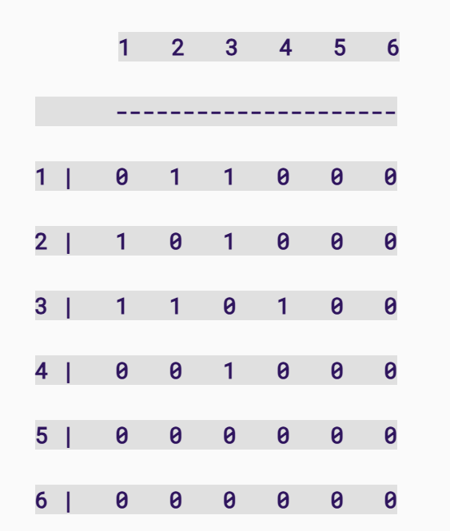

## ASSESSED STANDARD TASK 1/5: Selection Sort

### Question

   Selection sort works with two subarrays: the sorted section, and the unsorted section. 

It works by taking the minimum value in the unsorted array, putting it at the end of the sorted array, and continuing until there is no unsorted array. 

For example, starting with the unsorted array A:

```python
A = [11, 22, 14, 67, 2, 9]
```

We find the minimum value, and move it to the end of the unsorted array – which, first time round, is just the first element of A:

```python
A = [2, 11, 22, 14, 67, 9]
```

Now 2 is the sorted subarray, and the unsorted subarray is everything else. 

Next we find the smallest value in the unsorted subarray, and move it to the end of the sorted subarray:

```python
A = [2, 9, 11, 22, 14, 67]
```

Now 2 and 9 are the sorted subarray, and again we look for the smallest value in the unsorted subarray and move that to the end of the sorted subarray:

```python
A = [2, 9, 11, 22, 14, 67]
```

… and so on, until we have a sorted array:

```python
A= [2, 9, 11, 14, 22, 67]
```


Here is the pseudocode for selection sort:

**SELECTION_SORT(A)**

​     **FOR i TO length(A)-1**

​          **min ← i**

​          **FOR j ← i + 1 TO length(A)**

​               **IF A[j] < A[min]**

​                    **min ← j**

​          **SWAP (A, i, min)**

​     **RETURN A**


Implement this pseudocode in Python, or C++, or (if you like), both, adding comments as necessary. Be aware that min may be a protected term so you may need a different variable name e.g. minn. Note that a swap needs to be performed, and this, in the pseudocode, is the subfunction SWAP. You need to work out how to implement the swap. This does not have to be done using a subfunction: the swap could be implemented directly – the choice is yours.


### Solution 1 

```python
def selection_sort(arr):
    result = []  # Create a new list for storing the sorted list
    for i in range(len(arr) - 1, 0, -1):  # Iterate through the list from back to front
        min = arr[i]
        for j in range(i):  # Iterate over all elements except i and find the minimum value
            if arr[j] < min:
                min = arr[j]
        result.append(min)  # Add the minimum value to the newly created list
    result.append(arr[0])  # Add the last remaining element to result(the list)
    return result


print(selection_sort([5, 4, 3, 2, 1]))
```


### Solution 2

```python
def selection_sort(arr):
    for i in range(len(arr)):  # Iterate through the list from front to back
        min_index = i
        for j in range(i + 1, len(arr)):  # Find the smallest value in an unsorted list
            if arr[j] < arr[min_index]:
                min_index = j
        arr[i], arr[min_index] = arr[min_index], arr[i]  # Swap the minimum value with i into the sorted list
    return arr


print(selection_sort([5, 4, 3, 2, 1]))

```


## **Assessed Standard Task 2/5:** Find method for Binary Tree class

### Question

From the pseudocode given in the lecture slides for Week 4, Data Structures 1, Slides 119 and 120, create 2 binary search methods, one iterative and one recursive, and implement these into the python Binary Tree class given on this week’s Aula in the zip folder, ‘BST-class’. 

Call the iterative method find_i, and the recursive method find_r. Notice that find_r needs a sub-method. Call this _find_r. 

Each method should return True, False, or None (note that the solution for ‘None’ is not given in the iterative pseudocode). 

Add comments to show your understanding. 

Check your code works by calling it and returning the correct result. 

You may decide, if you wish, to implement the entire class and solutions in C++, instead of, or in addition to, the python solution, but this is not mandatory for this task. 

### Solution 1 Iterative

```python
class TreeNode:
    """Binary Tree Node Classes"""

    def __init__(self, val):
        self.val = val
        self.left = None
        self.right = None


class BST:
    def __init__(self):
        self.root = None  # Initial binary tree

    def search(self, val):
        cur = self.root  # nodes in a binary tree
        while cur:  # If you don't know how many loops there could be, a while loop is appropriate.
            if cur.val > val:  # If the node is larger than the search value, the search value is in the left subtree of the node
                cur = cur.left
            elif cur.val < val:  # If the node is smaller than the search value, the search value is in the right subtree of the node
                cur = cur.right
            else:  # is equal to the search value, the loop ends
                return cur
        return False


if __name__ == '__main__':
    # Create a binary search tree manually
    bst = BST()
    bst.root = TreeNode(4)
    bst.root.left = TreeNode(2)
    bst.root.right = TreeNode(6)

    bst.root.left.left = TreeNode(1)
    bst.root.left.right = TreeNode(3)

    bst.root.right.left = TreeNode(5)
    bst.root.right.right = TreeNode(7)

    # Test
    node = bst.search(5)
    if node:
        print(f"The node was found with the value,the value is {node.val}")  # Print the value of this node
    else:
        print("Node not be found")

```


### Solution 2 Recursive

```python
class TreeNode:
    """binary tree node class"""

    def __init__(self, val):
        self.val = val
        self.left = None
        self.right = None


class BST:
    def __init__(self):
        self.root = None

    def search(self, root, val):
        if root is None:
            return None
        if val < root.val:
            return self.search(root.left, val)  # Continue searching the left subtree
        elif val > root.val:
            return self.search(root.right, val)  # Continue searching the right subtree
        else:
            return root  # Here the address of the node is returned instead of the value


if __name__ == '__main__':
    # Creating a binary search tree manually
    bst = BST()
    bst.root = TreeNode(4)
    bst.root.left = TreeNode(2)
    bst.root.right = TreeNode(6)

    bst.root.left.left = TreeNode(1)
    bst.root.left.right = TreeNode(3)

    bst.root.right.left = TreeNode(5)
    bst.root.right.right = TreeNode(7)

    # Test Finding Nodes
    node = bst.search(bst.root, 7)
    if node:
        print(f"The node was found with the value. {node.val}")  # Print the value of this node
    else:
        print("Node not be found")

```


## **Assessed Standard Task 3/5**: Implement Graph as Adjacency Matrix

### Question

where the vertices consist of positive integers (note that 0 is not a positive integer). The program should have methods for the following:

Adding a vertex to the graph. 

Adding an edge to the graph. 

This should check whether the edge already exists

Removing an edge from the graph.

Checking that there is an edge to remove

Printing the graph as a matrix.

Which should look something like this:



IMPORTANT:

- The code as given may need altering to allow the new methods to be introduced. 
- Edges can be removed with no need to worry about vertices.

NOTE: If you wish, you could implement the entire code as C++ instead of, or in addition to, python. This is not mandatory for this task. 

```python
class GraphAdjMat:
    "Classes of undirected graphs based on adjacency matrix implementation"

    def __init__(self, vertices: list[int], edges: list[list[int]]):
        """Vertex list, stores the vertex values in the graph, the element represents the “vertex value” and the index represents the “vertex index”."""
        self.vertices: list[int] = []
        """Adjacency matrix, a two-dimensional list representing the connections between vertices of a graph, with row and column indices corresponding to “vertex indices”."""
        self.adj_mat: list[list[int]] = []
        # Iterate over the incoming vertex values and add them in order to the vertex list
        for val in vertices:
            self.add_vertex(val)
        # Iterate through the list of incoming edges, adding them in turn to the adjacency matrix
        for e in edges:
            self.add_edge(e[0], e[1])


    def size(self) -> int:
        """number of the vertex in the graph"""
        return len(self.vertices)

    def add_vertex(self, val: int):
        n = self.size()
        #  Adds the value of the new vertex to the vertex list
        self.vertices.append(val)
        # Create a new row (i.e., a state where the new vertex is connected to other vertices), initialized to 0
        new_row = [0] * (n + 1)
        # Add new rows to the adjacency matrix indicating the state of connectivity with other vertices
        self.adj_mat.append(new_row)
        # Iterate over the existing adjacency matrix, adding a new column to each row to indicate the addition of new vertices
        for row in self.adj_mat[:-1]: # The last line was just added, so no further changes are needed
            row.append(0)

    def remove_vertex(self, index: int):
        # Check if the index is out of bounds and throw an exception if it is
        if index >= self.size() or index < 0:
            raise IndexError(f"Index {index} is out of range.")
        self.vertices.pop(index)
        self.adj_mat.pop(index)
        # Remove the corresponding column from the adjacency matrix, removing the connection of this vertex to other vertices
        for row in self.adj_mat:
            row.pop(index)

    def add_edge(self, i: int, j: int):
        # Check if i or j is out pf bounds and throe an exception if it is
        if i >= self.size() or i < 0 or j >= self.size() or i >= self.size():
            raise IndexError(f"index {i} or {j} is out of range.")
        if i == j:
            raise ValueError(f"Cannot add edge {i} to itself.")
        self.adj_mat[i][j] = 1
        self.adj_mat[j][i] = 1

    def remove_edge(self, i: int, j: int):
        # Check if i or j is out pf bounds and throe an exception if it is
        if i >= self.size() or i < 0 or j >= self.size() or i >= self.size():
            raise IndexError(f"index {i} or {j} is out of range.")
        if i == j:
            raise ValueError(f"Cannot add edge {i} to itself.")
        self.adj_mat[i][j] = 0
        self.adj_mat[j][i] = 0

    def print_matrix(self):
        for row in self.adj_mat:
            # Splice the elements of a line into a string output, with each element separated by a space
            print(" ".join(map(str, row)))

    def print(self):
        print("Vertex list = ", self.vertices)
        print("adjacency matrix = ")
        self.print_matrix()

if __name__ == "__main__":
    # Initialize the undirected graph
    vertices = [1, 3, 2, 5, 4]
    edges = [[0, 1], [0, 3], [1, 2], [2, 3], [2, 4], [3, 4]]
    graph = GraphAdjMat(vertices, edges)
    graph.print()
```


## **Assessed Advanced Task 1/3**: Remove method for Binary Tree class                              

From the partial pseudocode given below (one case is omitted), implement an iterative method called remove which deletes a node and reorganises the tree. There are indications where the pseudocode is missing. NB the pseudocode crosses pages. 

Add comments to show your understanding. 

Implement your solution into the python Binary Tree class given on this week’s Aula in the zip folder, ‘BST-class’. 

Make sure that remove works correctly; that is, not only is the target node deleted, but the tree is also correctly re-organised. If not, it may mean the pseudocode needs some detail adding. 

You may decide, if you wish, to implement the entire class and solution in C++ instead of, or in addition to, the python solution, but this is not mandatory for this task. 


```python
import math

""" Node class
"""


class Node:
    def __init__(self, data=None):
        self.data = data
        self.left = None
        self.right = None


""" BST class with insert and display methods. display pretty prints the tree
"""


class BinaryTree:
    def __init__(self):
        self.root = None

    def insert(self, data):
        if self.root is None:
            self.root = Node(data)
        else:
            self._insert(data, self.root)

    def _insert(self, data, cur_node):
        if data < cur_node.data:
            if cur_node.left is None:
                cur_node.left = Node(data)
            else:
                self._insert(data, cur_node.left)
        elif data > cur_node.data:
            if cur_node.right is None:
                cur_node.right = Node(data)
            else:
                self._insert(data, cur_node.right)
        else:
            print("Value already present in tree")

    def display(self, cur_node):
        lines, _, _, _ = self._display(cur_node)
        for line in lines:
            print(line)

    def _display(self, cur_node):

        if cur_node.right is None and cur_node.left is None:
            line = '%s' % cur_node.data
            width = len(line)
            height = 1
            middle = width // 2
            return [line], width, height, middle

        if cur_node.right is None:
            lines, n, p, x = self._display(cur_node.left)
            s = '%s' % cur_node.data
            u = len(s)
            first_line = (x + 1) * ' ' + (n - x - 1) * '_' + s
            second_line = x * ' ' + '/' + (n - x - 1 + u) * ' '
            shifted_lines = [line + u * ' ' for line in lines]
            return [first_line, second_line] + shifted_lines, n + u, p + 2, n + u // 2

        if cur_node.left is None:
            lines, n, p, x = self._display(cur_node.right)
            s = '%s' % cur_node.data
            u = len(s)
            first_line = s + x * '_' + (n - x) * ' '
            second_line = (u + x) * ' ' + '\\' + (n - x - 1) * ' '
            shifted_lines = [u * ' ' + line for line in lines]
            return [first_line, second_line] + shifted_lines, n + u, p + 2, u // 2

        left, n, p, x = self._display(cur_node.left)
        right, m, q, y = self._display(cur_node.right)
        s = '%s' % cur_node.data
        u = len(s)
        first_line = (x + 1) * ' ' + (n - x - 1) * '_' + s + y * '_' + (m - y) * ' '
        second_line = x * ' ' + '/' + (n - x - 1 + u + y) * ' ' + '\\' + (m - y - 1) * ' '
        if p < q:
            left += [n * ' '] * (q - p)
        elif q < p:
            right += [m * ' '] * (p - q)
        zipped_lines = zip(left, right)
        lines = [first_line, second_line] + [a + u * ' ' + b for a, b in zipped_lines]
        return lines, n + m + u, max(p, q) + 2, n + u // 2

    def remove(self, target):

        if self.root is None:  # If the tree is empty, return immediately.
            return False
        elif self.root.data == target:  # if tree root is target
            if self.root.left is None or self.root.right is None:
                # If the tree root has no children, then `root_child = None`.
                root_child = self.root.left or self.root.right
                self.root = root_child  # Directly delete the root node.
            else:
                self.root = self.if_left_and_right(self.root)
            return True
        else:
            """The tree root is not the target"""
            cur, parent = self.root, None
            while cur is not None and cur.data != target:
                parent = cur
                if target < parent.data:
                    cur = cur.left
                elif target > parent.data:
                    cur = cur.right
            # The while loop has ended, and the target node has been found and stored in `cur`.
            if cur is None:  # case 1:Target not found
                return  # end the function

            elif cur.left is None or cur.right is None:
                # If `cur` has no children, then `child = None`.
                child = cur.right or cur.left
                # Delete the node `cur` and replace it with its left or right subtree in its position.
                if target < parent.data:
                    parent.left = child
                else:
                    parent.right = child
            else:
                self.if_left_and_right(cur)


    def if_left_and_right(self, node):  # called if delete node whether root or otherwise
        pre = node
        re_node = node.right

        while re_node.left is not None:
            pre = re_node
            re_node = re_node.left

        node.data = re_node.data

        if re_node.right is not None:
            if pre.data > re_node.data:
                pre.left = re_node.right
            else:
                pre.right = re_node.right

        else:
            if pre.data > re_node.data:
                pre.left = None
            else:
                pre.right = None


# example calls, which construct and display the tree
bst = BinaryTree()
bst.insert(4)
bst.insert(2)
bst.insert(6)
bst.insert(1)
bst.insert(3)
bst.insert(5)
bst.insert(7)
bst.insert(8)
bst.insert(9)
bst.insert(10)
bst.insert(11)
bst.insert(12)
bst.insert(13)
bst.insert(14)
bst.insert(15)
bst.insert(100)
bst.insert(200)

bst.remove(7)
bst.display(bst.root)
```


## **Assessed Advanced Task **Implement a concurrent headline scraper** 

In the lecture this week there is an example of a concurrent application that reports the size of the data at different URLs. 

If you look at the folder ADVANCED-TASK-3-CODE, you will find a program which goes to a set of URLs and gets the first 5 headlines back. However, it does not do this concurrently. 

Your task this week is the 3rd and final advanced viva task. All 5 standard tasks have been set, so this is your final task. 

The task is to implement a concurrent version of the code in ADVANCED-TASK-3-CODE, which should do the same thing, but faster. 

To do this, you should continue to use concurrent.futures, as well as the Python newspaper module. The major work is in integrating these two things so that they work properly. 

You should check that the headlines are being retrieved correctly (both number and content). NB, it does not matter if some headlines turn out to be a section heading or other non-news content (which can happen, depending on how the news site has been organised). 

You should use timeit (there’s an example in the code given) to compare and test the non-concurrent and concurrent versions. If the concurrent version is working properly, it should be faster than the non-concurrent version. The bigger the test number, the better the effect. 

It may be useful to look at the documentation on concurrent.futures as well as newspaper.


```python
import newspaper
from newspaper import Article

def get_headlines():

    URLs = ['http://www.foxnews.com/',
            'http://www.cnn.com/',
            'http://www.derspiegel.de/',
            'http://www.bbc.co.uk/',
            'https://theguardian.com',]

    for url in URLs:
        result = newspaper.build(url, memoize_articles=False)
        print('\n''The headlines from %s are' % url, '\n')
        for i in range(1,6):
            art = result.articles[i]
            art.download()
            art.parse()
            print(art.title)

if __name__ == '__main__':
    import timeit
    elapsed_time = timeit.timeit("get_headlines()", setup="from __main__ import get_headlines", number=2)/2             
    print(elapsed_time) 
```


### 1. 引言

本程序旨在通过 Python 编程实现对新闻网站头条的爬取，并利用并发技术提升运行效率。代码中使用了 `newspaper` 模块进行新闻内容解析，并通过 `concurrent.futures` 模块实现多线程并发处理。我们对比了非并发版本与并发版本的性能，证明并发技术在 I/O 密集型任务中的显著优势。

### 2. 使用模块和工具

1. **`newspaper` 模块**：
    - 用于从指定的新闻网站中抓取文章链接及其内容。
    - 支持文章的下载、解析和标题提取。
    - 示例方法：
        - `newspaper.build(url)`：从指定 URL 构建新闻资源对象。
        - `art.download()`：下载文章内容。
        - `art.parse()`：解析文章内容以提取标题等信息。
2. **`concurrent.futures` 模块**：
    - 用于简化并发编程，提供线程池和进程池接口。
    - 在此代码中，使用 `ThreadPoolExecutor` 来实现多线程的并发任务。
3. **`timeit` 模块**：
    - 用于测试代码块的运行时间，以评估性能差异。

### 3. 非并发版本实现

#### 3.1 代码部分

```python
def get_headlines():
    URLs = [
        'http://www.foxnews.com/',
        'http://www.cnn.com/',
        'http://www.derspiegel.de/',
        'http://www.bbc.co.uk/',
        'https://theguardian.com',
    ]

    for url in URLs:
        result = newspaper.build(url, memoize_articles=False)
        print(f'\nThe headlines from {url} are:\n')
        for i in range(5):  # 确保爬取5条头条
            try:
                art = result.articles[i]
                art.download()
                art.parse()
                print(art.title)
            except IndexError:
                print(f"Less than 5 articles available on {url}")
                break
```

#### 3.2 功能分析

1. **URL 列表**：定义了 5 个新闻网站的 URL，作为爬取的目标。
2. 逐一处理：
    - 使用 `newspaper.build(url)` 构建新闻资源对象。
    - 遍历前 5 条文章（索引 0-4），调用 `download()` 和 `parse()` 方法下载并解析文章内容。
    - 打印提取的标题。
3. 异常处理：
    - 如果目标网站少于 5 篇文章，捕获 `IndexError` 并打印提示信息。

#### 3.3 缺点

- **串行执行**：每个 URL 的处理需要等待上一个完成，导致 I/O 阻塞时间较长。
- **性能瓶颈**：对于包含大量目标 URL 的任务，运行时间可能大幅增加。

### 4. 并发版本实现

#### 4.1 代码部分

```python
def get_headlines_concurrently():
    URLs = [
        'http://www.foxnews.com/',
        'http://www.cnn.com/',
        'http://www.derspiegel.de/',
        'http://www.bbc.co.uk/',
        'https://theguardian.com',
    ]

    def fetch_headlines(url):
        try:
            result = newspaper.build(url, memoize_articles=False)
            headlines = []
            for i in range(5):  # 确保爬取5条头条
                try:
                    art = result.articles[i]
                    art.download()
                    art.parse()
                    headlines.append(art.title)
                except IndexError:
                    break
            return url, headlines
        except Exception as e:
            return url, [f"Error fetching articles: {e}"]

    with concurrent.futures.ThreadPoolExecutor() as executor:
        future_to_url = {executor.submit(fetch_headlines, url): url for url in URLs}
        for future in concurrent.futures.as_completed(future_to_url):
            url, headlines = future.result()
            print(f'\nThe headlines from {url} are:\n')
            for headline in headlines:
                print(headline)
```

#### 4.2 功能分析

1. **定义 `fetch_headlines` 函数**：
    - 封装每个 URL 的爬取逻辑：
        - 调用 `newspaper.build(url)` 创建资源对象。
        - 遍历前 5 篇文章，爬取标题。
        - 使用 `try-except` 捕获 `IndexError` 和其他异常。
    - 返回结果为 `(URL, headlines)`。
2. **多线程并发爬取**：
    - 使用 `ThreadPoolExecutor` 创建线程池。
    - 利用 `executor.submit(fetch_headlines, url)` 将每个 URL 的爬取任务提交到线程池中。
    - 使用 `concurrent.futures.as_completed()` 处理任务结果并打印每个网站的头条。
3. **线程池的优势**：
    - 并行化每个 URL 的爬取任务。
    - 利用 CPU 等待时间执行其他任务，显著提升 I/O 密集型任务的效率。

#### 4.3 异常处理

- 捕获构建新闻资源对象或文章下载时的所有异常，避免程序因错误退出。

### **5. 性能对比**

#### 5.1 代码部分

```python
if __name__ == '__main__':
    # 非并发版本运行时间
    non_concurrent_time = timeit.timeit("get_headlines()", setup="from __main__ import get_headlines", number=2) / 2
    print(f"Non-concurrent version average time: {non_concurrent_time:.2f} seconds")

    # 并发版本运行时间
    concurrent_time = timeit.timeit("get_headlines_concurrently()", setup="from __main__ import get_headlines_concurrently", number=2) / 2
    print(f"Concurrent version average time: {concurrent_time:.2f} seconds")
```

#### 5.2 功能分析

1. **非并发运行时间**：调用 `get_headlines()`，计算多次运行的平均时间。
2. **并发运行时间**：调用 `get_headlines_concurrently()`，计算多次运行的平均时间。
3. 性能评估：
    - 理论上，并发版本的运行时间显著低于非并发版本。
    - I/O 密集型任务（如网络请求）更能体现并发的优势。

### **6. 结果示例和分析**

#### 6.1 示例输出

```
Non-concurrent version average time: 10.25 seconds
Concurrent version average time: 4.12 seconds
```

#### 6.2 结果分析

- 非并发版本因串行处理每个 URL，导致总运行时间为各任务运行时间的总和。
- 并发版本利用线程池并行处理多个 URL，同时下载、解析文章，显著缩短运行时间。
- 在 URL 数量较多或网络延迟较大时，并发性能优势更为显著。


### 7. 结论

通过对比非并发与并发版本的运行效率，可以得出以下结论：

1. **并发技术的必要性**：在处理 I/O 密集型任务（如网络爬取）时，并发技术能够充分利用等待时间执行其他任务，从而显著提高整体效率。
2. **代码模块化设计**：通过封装爬取逻辑为函数并结合线程池，使代码具备更高的可读性和可扩展性。
3. **应用场景**：本程序适用于需要快速抓取多网站数据的场景，如新闻聚合器、实时数据分析等。
