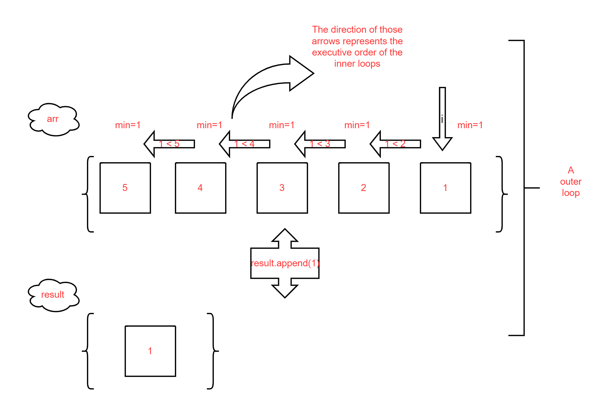
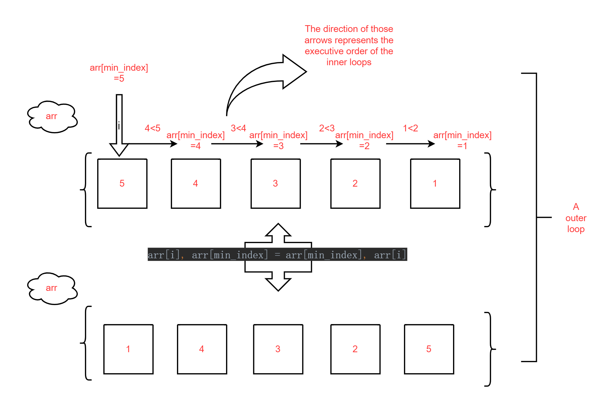
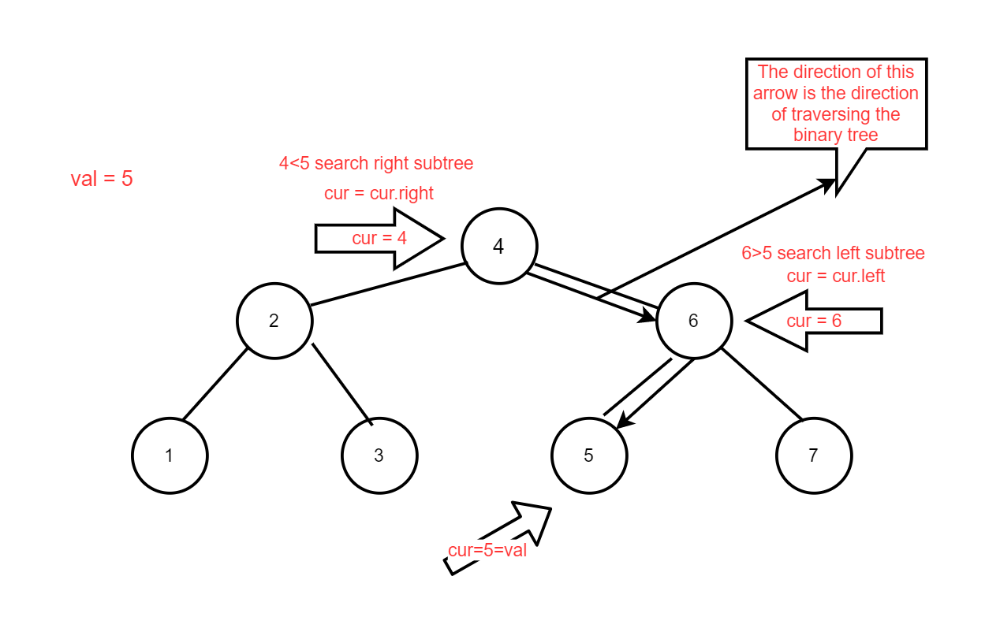
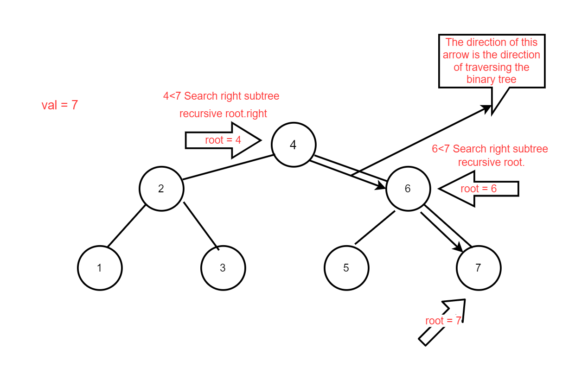

## STD  1

### 1. pseudocode

```python
SELECTION_SORT(A)
          FOR i TO length(A)-1
                    min ← i
                    FOR j ← i + 1 TO length(A)
                              IF A[j] < A[min]
                                        min ← j
                    SWAP (A, i, min)
          RETURN A
```


### 2. Two Solutions

#### Solution 1

```python
def selection_sort(arr):
    result = []  # Create a new list for storing the sorted list
    for i in range(len(arr) - 1, 0, -1):  # Iterate through the list from back to front
        min = arr[i]
        for j in range(i):  # Iterate over all elements except i and find the minimum value
            if arr[j] < min:
                min = arr[j]
        result.append(min)  # Add the minimum value to the newly created list
        arr.remove(min)
    result.append(arr[0])  # Add the last remaining element to result(the list)
    return result


print(selection_sort([5, 4, 3, 2, 1]))
```


#### Solution 2

```python
def selection_sort(arr):
    for i in range(len(arr)):  # Iterate through the list from front to back
        min_index = i
        for j in range(i + 1, len(arr)):  # Find the smallest value in an unsorted list
            if arr[j] < arr[min_index]:
                min_index = j
        arr[i], arr[min_index] = arr[min_index], arr[i]  # Swap the minimum value with i into the sorted list
    return arr


print(selection_sort([5, 4, 3, 2, 1]))
```

The one is written according to the pseudo-code above.


### **3. Explaining the code**

#### Solution 1

-  Firstly,`result = []`: I create an empty list `result` to store the final sorted elements. (adding elements one by one)
- Secondly, we use a outer loop:`for i in range(len(arr) - 1, 0, -1):`. This loop processes the elements from back to front, accessing the last element of the unsorted list first, so why is it (the range) designed this way? Because I want to use the inner loop to compare the size of the element before index i ( There is exactly i elements in front of the element at index i ) with the element at index i. This inner function loop’s range is i which means that one time the out loop implements, i times the inner loop executes. That makes the code elegant and intuitive.  (To add some clarification, as I understand it, **the number of times the outer loop is executed is equivalent to the number of times that we find the minimum value and add them to the `result`**.  The last time there is no need to compare, because there is only one value left in the original list, it is added directly to the result.) 
- Thirdly, `min = arr[i]`:  I set a variable  `min` that is currently used to store the minimum value of the element value of the current unsorted list. Initialize this variable to the element at index i.

- Fourthly, `for j in range(i + 1, len(arr)):` I use the inner loop to find the minimum elements in the unsorted list. As stated above, the inner loop is executed i times to compare the smallest value (which is stored as  `min`) in the unsorted list. `if arr[j] < min: min = arr[j]`
- Fifthly, `result.append(min)` adds the minimum value to the end of a sorted list.
- Sixthly, `arr.remove(min)`. Remove the smallest value found from the original list to prevent the next iteration of the outer `for` loop from repeatedly adding the same smallest element, which has already been added to `result`.
- After `len(arr) - 1` times of outer loops, there is only one element left in the unsorted list, and this is the largest element, which is added to the very end of the sorted list.
- return the sorted list `result`.
- Below is a schematic of the flow of the first outer loop. 



#### Solution 2

This is code written according to the given pseudo-code, without having to create a new list and modify it directly on the original list.

- Firstly, Set up an outer loop that traverses the list from front to back.
- Secondly, As in solution 1, create a variable `min_index` to store the minimum value of the current queue.

- Thirdly, Set up an inner loop that also compares `arr[i]` one by one with the other elements in the list and finds the smallest one.

- Find the minimum value and swap places with `arr[i]`. This is why the outer loop needs to be traversed from front to back. Because the smaller element has to be placed earlier in the queue.
- Returns the modified original list `arr`.
- The flow chart below shows how the list changes after the first outer loop.



### 4. **Evaluating the code**

==**We try to evaluate both codes in terms of readability and conciseness.**==

- **Solution 1：**
    - **Readability:** Obviously, this solution is more readable, the logic is intuitive, and the use of `result` to store the sort result is easy to understand.
    - **Conciseness:** Higher space complexity by not directly manipulating the original array. Code is more lengthy.

- **Solution 2：**
    - **Readability:** Beginners may need more time to understand the logic of index swapping, not very readable.
    - **Conciseness: ** Compact, elegant and logical. In-place sorting, no extra space required, more efficient.


## STD 2

### 1. Code

#### Iterative

```python
class TreeNode:
    """Binary Tree Node Classes"""

    def __init__(self, val):
        self.val = val
        self.left = None
        self.right = None


class BST:
    def __init__(self):
        self.root = None  # Initial binary tree

    def search(self, val):
        cur = self.root  # nodes in a binary tree
        while cur:  # If you don't know how many loops there could be, a while loop is appropriate.
            if cur.val > val:  # If the node is larger than the search value, the search value is in the left subtree of the node
                cur = cur.left
            elif cur.val < val:  # If the node is smaller than the search value, the search value is in the right subtree of the node
                cur = cur.right
            else:  # is equal to the search value, the loop ends
                return cur
        return False


if __name__ == '__main__':
    # Create a binary search tree manually
    bst = BST()
    bst.root = TreeNode(4)
    bst.root.left = TreeNode(2)
    bst.root.right = TreeNode(6)

    bst.root.left.left = TreeNode(1)
    bst.root.left.right = TreeNode(3)

    bst.root.right.left = TreeNode(5)
    bst.root.right.right = TreeNode(7)

    # Test
    node = bst.search(5)
    if node:
        print(f"The node was found with the value,the value is {node.val}")  # Print the value of this node
    else:
        print("Node not be found")       
```


#### Recursive

```python
class TreeNode:
    """binary tree node class"""

    def __init__(self, val):
        self.val = val
        self.left = None
        self.right = None


class BST:
    def __init__(self):
        self.root = None

    def search(self, root, val):
        if root is None:
            return None
        if val < root.val:
            return self.search(root.left, val)  # Continue searching the left subtree
        elif val > root.val:
            return self.search(root.right, val)  # Continue searching the right subtree
        else:
            return root  # Here the address of the node is returned instead of the value


if __name__ == '__main__':
    # Creating a binary search tree manually
    bst = BST()
    bst.root = TreeNode(4)
    bst.root.left = TreeNode(2)
    bst.root.right = TreeNode(6)

    bst.root.left.left = TreeNode(1)
    bst.root.left.right = TreeNode(3)

    bst.root.right.left = TreeNode(5)
    bst.root.right.right = TreeNode(7)

    # Test Finding Nodes
    node = bst.search(bst.root, 7)
    if node:
        print(f"The node was found with the value. {node.val}")  # Print the value of this node
    else:
        print("Node not be found")
```


### 2. **Explaining the code**

#### Iterative

1. 

```python
class TreeNode:
    """Binary Tree Node Classes"""

    def __init__(self, val):
        self.val = val
        self.left = None
        self.right = None
```

Here I use a class to simulate the attribute of nodes in a binary tree. Assigning values to each node and setting the left and right subtrees of each node.

2. 

```python
class BST:
    def __init__(self):
        self.root = None  # Initial binary tree
```

Create a class that operates on binary trees. Initialise this binary tree to be empty. It is worth noting that the code all uses the **root node of the binary tree to represent the entire binary tree**.

3. 

```python
def search(self, val):
    cur = self.root  # nodes in a binary tree
```

Use a function to implement the search function to increase the modularity of the code and ease of calling. Create the variable `cur` initialised to the root node of the binary tree. **This means that the following code will traverse the binary tree beginning with the root node.** `val` is the value of the node we need to find.

4. 

```python
 while cur: 
     if cur.val > val:  
         cur = cur.left
     elif cur.val < val:  
         cur = cur.right
     else:  
         return cur
return Fasle
```

- I use a **while loop** to traverse the binary tree because I don't know how many times we have to do the loop. If I knew exactly how many times the loop was going to be executed, a for loop would be more appropriate.
- If `val` is less than the current node value, it means that `val` exists in the left subtree of the current node. If `val` is greater than the current node value, it means that `val` exists in the right subtree of the current node. 

- Until a node with the same value as `val` is found, return it and the function ends.

- If while loop ends (`cur` node is empty, binary tree nodes are all traversed) no corresponding node is found, there is no node in the binary tree with the value val. Returns False.

5. 

```python
if __name__ == '__main__':
    # Creating a binary search tree manually
    bst = BST()
    bst.root = TreeNode(4)
    bst.root.left = TreeNode(2)
    bst.root.right = TreeNode(6)

    bst.root.left.left = TreeNode(1)
    bst.root.left.right = TreeNode(3)

    bst.root.right.left = TreeNode(5)
    bst.root.right.right = TreeNode(7)

    # Test Finding Nodes
    node = bst.search(bst.root, 7)
    if node:
        print(f"The node was found with the value. {node.val}")  # Print the value of this node
    else:
        print("Node not be found")
```

Manually create a binary tree for searching. 



#### Recursive

Only the following codes are different from Iterative, the logic of all other codes are exactly the same, you can refer to the description above.

```python
 def search(self, root, val):
        if root is None:
            return None
        if val < root.val:
            return self.search(root.left, val)  # Continue searching the left subtree
        elif val > root.val:
            return self.search(root.right, val)  # Continue searching the right subtree
        else:
            return root  # Here the address of the node is returned instead of the value
```

-  The recursive code pass in an extra variable `root`,  which is a binary tree to be processed. The code recursively disassembles the binary tree step by step.
- If the binary tree is empty, the function ends, indicates that the currently traversed binary tree is empty.
- If it is not empty, then the code moves on.
- If val is less than the current node, the `search` function is called, but the incoming binary tree is changed to the left subtree of the current node.
- If val is greater than the current node, call `search` function, but change the incoming binary tree to the right subtree of the current node.
- Finds the binary tree whose root node is val, and returns its root node.




### 3. **Evaluating the code**

==**We try to evaluate both codes in terms of complexity**==

- Time Complexity:

    The time complexity of both solutions is $O(logn)$

- Space Complexity:

    - **Iterative：**Only a pointer `cur` is used to point to the current node, no recursive call stack is needed.$O(1)$
    - **Recursive:**  Context information (function call stack) needs to be saved for each recursive call, and the maximum recursion depth is the height of the tree. $O(n)$

- To summarise, Recursive has a higher space complexity, especially when dealing with trees of greater depth which can lead to StackOverflow. Iterative code is not as elegant as Recursive but has a low space complexity.


## STD 3

### 1. Code

```python
class GraphAdjMat:
    "Classes of undirected graphs based on adjacency matrix implementation"

    def __init__(self, vertices: list[int], edges: list[list[int]]):
        """Vertex list, stores the vertex values in the graph, the element represents the “vertex value” and the index represents the “vertex index”."""
        self.vertices: list[int] = []
        """Adjacency matrix, a two-dimensional list representing the connections between vertices of a graph, with row and column indices corresponding to “vertex indices”."""
        self.adj_mat: list[list[int]] = []
        # Iterate over the incoming vertex values and add them in order to the vertex list
        for val in vertices:
            self.add_vertex(val)
        # Iterate through the list of incoming edges, adding them in turn to the adjacency matrix
        for e in edges:
            self.add_edge(e[0], e[1])


    def size(self) -> int:
        return len(self.vertices)

    def add_vertex(self, val: int):
        n = self.size()
        self.vertices.append(val)
        new_row = [0] * (n + 1)
        self.adj_mat.append(new_row)
        for row in self.adj_mat[:-1]:
            row.append(0)

    def remove_vertex(self, index: int):
        # Check if the index is out of bounds and throw an exception if it is
        if index >= self.size() or index < 0:
            raise IndexError(f"Index {index} is out of range.")
        self.vertices.pop(index)
        self.adj_mat.pop(index)
        # Remove the corresponding column from the adjacency matrix, removing the connection of this vertex to other vertices
        for row in self.adj_mat:
            row.pop(index)

    def edge_num(self):
        edge_count = 0
        for row in self.adj_mat:
            for edge in row:
                if edge == 1:
                    edge_count += 1
        return edge_count

    def add_edge(self, i: int, j: int):
        edge_number = self.edge_num()
        # Check if i or j is out pf bounds and throe an exception if it is
        if i >= self.size() or i < 0 or j >= self.size() or i >= self.size():
            raise IndexError(f"index {i} or {j} is out of range.")
        if i == j:
            raise ValueError(f"Cannot add edge {i} to itself.")
        self.adj_mat[i][j] = 1
        self.adj_mat[j][i] = 1
        if self.edge_num() - edge_number == 1:
            print("An edge has been added")
        else:
            print("No edge has been added")


    def remove_edge(self, i: int, j: int):
        edge_number = self.edge_num()
        if i >= self.size() or i < 0 or j >= self.size() or i >= self.size():
            raise IndexError(f"index {i} or {j} is out of range.")
        if i == j:
            raise ValueError(f"Cannot add edge {i} to itself.")
        self.adj_mat[i][j] = 0
        self.adj_mat[j][i] = 0
        if edge_number - self.edge_num() == 1:
            print("An edge has been removed")
        else:
            print("No edge has been removed")


    def print_matrix(self):
        n = self.size()
        print("     " + "   ".join(map(str, range(1, n + 1))))
        print("     " + "-" * (4 * n - 1))
        for i, row in enumerate(self.adj_mat):
            print(f"{i + 1} |" + "   ".join(map(str, row)))

    def print(self):
        print("Vertex list = ", self.vertices)
        print("adjacency matrix = ")
        self.print_matrix()


if __name__ == "__main__":
    # Initialize the undirected graph
    vertices = [1, 3, 2, 5, 4]
    edges = [[0, 1], [0, 3], [1, 2], [2, 3], [2, 4], [3, 4]]
    graph = GraphAdjMat(vertices, edges)
    graph.print()
```

### **2. Explaining the Code**

1. 

```python
class GraphAdjMat:

    def __init__(self, vertices: list[int], edges: list[list[int]]):
        self.vertices: list[int] = []
        self.adj_mat: list[list[int]] = []
        for val in vertices:
            self.add_vertex(val)
        for e in edges:
            self.add_edge(e[0], e[1])
```

Initialise a graph by putting all its nodes into `vertices` and all its edges into `adj_mat` ( a big list over some small lists). `adj_mat` is in the form of an adjacency matrix, where each value in the matrix indicates whether or not an edge exists between two vertices, with 1 indicating presence and 0 indicating absence.

Two `for` loops, the first initialises all the node values in `vertices`t, the second initialises each edge in `adj_mat`. (According to the parameters passed in.)

2. 

```python
    def size(self) -> int:
        return len(self.vertices)
```

View the current number of vertices of the graph.

3. 

```python
    def add_vertex(self, val: int):
        n = self.size()
        self.vertices.append(val)
        new_row = [0] * (n + 1)
        self.adj_mat.append(new_row)
        for row in self.adj_mat[:-1]: 
            row.append(0)
```

A function that implements the function of adding nodes. 

- Firstly, check the current number of vertices stored into the variable `n`. 
- Second, add the value of the new node directly to the vertex list. 
- Third, create a list of length `n + 1` (since the number of nodes becomes n + 1 after the new node is added), all with value 0 (the new node doesn't have any edges yet), as a new element of the edge list of the graph. 
- Fourth, add the new list to the edge list `adj_mat` of the graph. 
- **Fifth, except for the newly added element of the edge list (which happens to be at the end of the queue), All existing rows of the adjacency matrix (except the last row of the new addition) are appended with a value `0`, indicating that the new vertex is not connected to any other vertex. **


4. 

```python
    def remove_vertex(self, index: int):
        if index >= self.size() or index < 0:
            raise IndexError(f"Index {index} is out of range.")
        self.vertices.pop(index)
        self.adj_mat.pop(index)
        for row in self.adj_mat:
            row.pop(index)
```

A function that implements the function of removing nodes. 

- Firstly, check that the incoming index value is greater than the length of the vertex list or less than 0. If it is out of specification, throw an exception manually. 
- Secondly, the vertex list removes the value at the index, and the edge list removes the list at the index. 
- Thirdly, iterates through the edge list and deletes the element at index for each list in the edge list.

5. 

```python
    def edge_num(self):
        edge_count = 0
        for row in self.adj_mat:
            for edge in row:
                if edge == 1:
                    edge_count += 1
        return edge_count
```

Iterate over all elements of the edge list that have a value of 1 and store them in edge_count, which is the number of edges in the current graph.

5. 

```python
    def add_edge(self, i: int, j: int):
        edge_number = self.edge_num()
        # Check if i or j is out pf bounds and throe an exception if it is
        if i >= self.size() or i < 0 or j >= self.size() or i >= self.size():
            raise IndexError(f"index {i} or {j} is out of range.")
        if i == j:
            raise ValueError(f"Cannot add edge {i} to itself.")
        self.adj_mat[i][j] = 1
        self.adj_mat[j][i] = 1
        if self.edge_num() - edge_number == 1:
            return
        else:
            return False
```

First, it checks if the vertex index is out of range or less than 0, and throws an exception if it is. Also, a vertex cannot add an edge pointing from itself to itself, otherwise an exception is thrown. Then, set `adj_mat[i][j]` and `adj_mat[j][i]` to 1 in the adjacency matrix to indicate that an undirected edge is added. Finally, check if the number of added edges is increased by 1, if yes, the addition is successful, otherwise return `False`.

6. 

```python
   def remove_edge(self, i: int, j: int):
        edge_number = self.edge_num()
        if i >= self.size() or i < 0 or j >= self.size() or i >= self.size():
            raise IndexError(f"index {i} or {j} is out of range.")
        if i == j:
            raise ValueError(f"Cannot add edge {i} to itself.")
        self.adj_mat[i][j] = 0
        self.adj_mat[j][i] = 0
        if edge_number - self.edge_num() == 1:
            return
        else:
            return False
```

Same logic as adding edges above.

7. 

```python
    def print_matrix(self):
        n = self.size()
        print("     " + "   ".join(map(str, range(n))))
        print("index" + "-" * (4 * n - 1))
        for i, row in enumerate(self.adj_mat):
            print(f"{i} |" + "   ".join(map(str, row)))

    def print(self):
        print("Vertex list = ", self.vertices)
        print("adjacency matrix = ")
        self.print_matrix()
```

`print_matrix:`

- First, get the number of vertices \(n\), which will define the size of the matrix.
- Next, print the column headers (vertex indices) from 0 to \(n-1\), making sure each is aligned with 3 spaces for clarity.
- Add a dividing line to separate the headers from the actual matrix data.
- Then, go through the adjacency matrix row by row. Each row shows the connections for a specific vertex:
  - Start with the row number on the left, followed by the connection status for each column:
      - Use 1 to show there's an edge.
      - Use 0 if there's no edge.

`print:`

- Start by printing the list of vertices to show all the nodes in the graph.
- After that, print the header for the adjacency matrix, and then call the `print_matrix` function to display the matrix itself.

### 3. Visualise some code

Initialised to the graph below, with the vertex list and edge list labelled in it.


Try adding a vertex with a value of 7 and add edges 2-7; 4-7.


### 4. **Evaluating the code**

==**We try to evaluate both codes in terms of Modularity and reusability.**==

1. **Modularity**
    - Each function is split into separate methods like `add_vertex`, `add_edge`, `remove_vertex`, and `print_matrix`, which makes the code easy to follow and work with. It's pretty straightforward to understand what each method does.
    - The methods are short and focused, which makes them easier to debug and keeps the overall structure neat.
2. **Reusability**
   - The way the logic is written for adding and removing vertices and edges makes it flexible enough to use in different types of graph implementations.
   - Using an adjacency matrix works well for undirected graphs, but it might need some tweaks if you want to handle directed or weighted graphs.


## ADV 1

### 1. Code

```python
class Node:
    def __init__(self, data=None):
        self.data = data
        self.left = None
        self.right = None


class BinaryTree:
    def __init__(self):
        self.root = None

    def insert(self, data):
        if self.root is None:
            self.root = Node(data)
        else:
            self._insert(data, self.root)

    def _insert(self, data, cur_node):
        if data < cur_node.data:
            if cur_node.left is None:
                cur_node.left = Node(data)
            else:
                self._insert(data, cur_node.left)
        elif data > cur_node.data:
            if cur_node.right is None:
                cur_node.right = Node(data)
            else:
                self._insert(data, cur_node.right)
        else:
            print("Value already present in tree")

    def display(self, cur_node):
        lines, _, _, _ = self._display(cur_node)
        for line in lines:
            print(line)

    def _display(self, cur_node):

        if cur_node.right is None and cur_node.left is None:
            line = '%s' % cur_node.data
            width = len(line)
            height = 1
            middle = width // 2
            return [line], width, height, middle

        if cur_node.right is None:
            lines, n, p, x = self._display(cur_node.left)
            s = '%s' % cur_node.data
            u = len(s)
            first_line = (x + 1) * ' ' + (n - x - 1) * '_' + s
            second_line = x * ' ' + '/' + (n - x - 1 + u) * ' '
            shifted_lines = [line + u * ' ' for line in lines]
            return [first_line, second_line] + shifted_lines, n + u, p + 2, n + u // 2

        if cur_node.left is None:
            lines, n, p, x = self._display(cur_node.right)
            s = '%s' % cur_node.data
            u = len(s)
            first_line = s + x * '_' + (n - x) * ' '
            second_line = (u + x) * ' ' + '\\' + (n - x - 1) * ' '
            shifted_lines = [u * ' ' + line for line in lines]
            return [first_line, second_line] + shifted_lines, n + u, p + 2, u // 2

        left, n, p, x = self._display(cur_node.left)
        right, m, q, y = self._display(cur_node.right)
        s = '%s' % cur_node.data
        u = len(s)
        first_line = (x + 1) * ' ' + (n - x - 1) * '_' + s + y * '_' + (m - y) * ' '
        second_line = x * ' ' + '/' + (n - x - 1 + u + y) * ' ' + '\\' + (m - y - 1) * ' '
        if p < q:
            left += [n * ' '] * (q - p)
        elif q < p:
            right += [m * ' '] * (p - q)
        zipped_lines = zip(left, right)
        lines = [first_line, second_line] + [a + u * ' ' + b for a, b in zipped_lines]
        return lines, n + m + u, max(p, q) + 2, n + u // 2

    def remove(self, target):
        if self.root is None:  # If the tree is empty
            return False
        elif self.root.data == target:  # If the root node is the target
            if self.root.left is None or self.root.right is None:
                # If the root has one or no child, replace the root with its child
                self.root = self.root.left or self.root.right
            else:
                # If the root has two children, handle it separately
                self.root = self._delete_node_with_two_children(self.root)
            return True
        else:
            # If the root is not the target, find and delete the target
            cur, parent = self.root, None
            while cur and cur.data != target:
                parent = cur
                if target < cur.data:
                    cur = cur.left
                else:
                    cur = cur.right

            if cur is None:  # If the target is not found
                return False

            if cur.left is None or cur.right is None:
                # If the node has one or no child, replace it with its child
                child = cur.left or cur.right
                if cur.data < parent.data:
                    parent.left = child
                else:
                    parent.right = child
            else:
                # If the node has two children, handle it separately
                self._delete_node_with_two_children(cur)
            return True

    def _delete_node_with_two_children(self, node):
        # Find the smallest node in the right subtree
        pre, re_node = node, node.right
        while re_node.left:
            pre = re_node
            re_node = re_node.left
        # Replace the target node's value with the smallest node's value
        node.data = re_node.data
        # Remove the smallest node
        if re_node.right:
            if pre.left == re_node:
                pre.left = re_node.right
            else:
                pre.right = re_node.right
        else:
            if pre.left == re_node:
                pre.left = None
            else:
                pre.right = None
        return node


# Example calls, which construct and display the tree
bst = BinaryTree()
bst.insert(4)
bst.insert(2)
bst.insert(6)
bst.insert(1)
bst.insert(3)
bst.insert(5)
bst.insert(7)
bst.insert(8)

print("Before removing root (4):")
bst.display(bst.root)

bst.remove(4)

print("\nAfter removing root (4):")
bst.display(bst.root)

```

### 2. **Explaining the Code**

Only the `remove` function and the `if_left_and_right` function are discussed here. The rest of the functions are code given in Aula.

1. 

```python
def remove(self, target):

    if self.root is None:  
        return False
```

`if self.root is None`, indicates that the binary tree is empty and returns it directly.

```python
    elif self.root.data == target:  
        if self.root.left is None or self.root.right is None:
            root_child = self.root.left or self.root.right
            self.root = root_child  
        else:
            self.root = self.i_delete_node_with_two_children(self.root)
        return True
```

**If the value of the root node in the given tree just equals `target`:**

- If the left and right child nodes of the root node are both empty, or both are null:
    - Set `root_child` to store the only child node that exists for the root node (e.g., if the right child exists, `root_child` equals the right child; if the left child exists, `root_child` equals the left child. If neither child exists, `root_child` will be null).
    - Remove the root node and directly replace the original binary tree with `root_child` as the root node.
- If both the left and right child nodes of the root exist:
    - Perform operations using the `if_left_and_right` function. This is because I want to follow the code flow sequentially, and explanations for functions will appear later in the text.
- Returns `True` for successful deletion.

2. 

```python
   else:
        cur, parent = self.root, None
        while cur and cur.data != target:
            parent = cur
            if target < parent.data:
                cur = cur.left
            elif target > parent.data:
                cur = cur.right
```

**If the value of the root node in the binary tree being traversed does not equal `target`:**

- Use `cur` to store the currently traversed node, and use `parent` to store the node that was traversed before `cur`, i.e., the parent node of `cur`.
- The `while` loop continues traversing the binary tree. As long as `cur` is not null and does not equal `target`, the loop proceeds.
- In the first step of the loop, assign `parent = cur`, storing the node obtained in the previous `while` iteration in `parent`.
- If `target < parent.data`, traverse the left subtree of the current node. If `target > parent.data`, traverse the right subtree of the current node.

3. 

```python
            if cur is None:  
                return  

            if cur.left is None or cur.right is None:
                child = cur.right or cur.left
                if cur.data < parent.data:
                    parent.left = child
                else:
                    parent.right = child
            else:
                self._delete_node_with_two_children(cur)
            return True
```

**After the `while` loop, the node `cur` with value `target` and its parent `parent` have been found:**

- If `cur` is null, it means that the entire binary tree does not contain a node with value `target`, so return directly.
- If `cur` exists and either the left or right child node of `cur` is empty, or both are null:
    - Set `child` to store the one child node of `cur` that exists (e.g., if the right child exists, `child` equals the right child; if the left child exists, `child` equals the left child. If neither child exists, `child` will be null).
    - If `target < parent.data`, it indicates that `cur` is the left child of its parent. Replace it with `child`.
    - If `target > parent.data`, it indicates that `cur` is the right child of its parent. Replace it with `child`.
- If both the left and right child nodes of `cur` exist, perform operations using the `if_left_and_right` function.

4. 

```python
def _delete_node_with_two_children(self, node):  
    pre, re_node = node, node.right

    while re_node.left:
        pre = re_node
        re_node = re_node.left

    node.data = re_node.data

    if re_node.right:
        if pre.left == re_node:
            pre.left = re_node.right
        else:
            pre.right = re_node.right

    else:
        if pre.left == re_node:
            pre.left = None
        else:
            pre.right = None
    return node
```

**This function is used when the node to be deleted has both left and right child nodes, allowing the smallest value node in the right subtree to replace the value of the node to be deleted.**

- Pass in `node`, which is the node to be deleted.

- Initialise `re_node` as the right child of the target node to locate the smallest node in the right subtree; also record its parent with `pre`.

- Use a `while` loop to find the smallest node in the binary tree `re_node` (i.e., keep traversing left child nodes). `pre` stores the parent node of `re_node`.

- After exiting the `while` loop, the value stored in `re_node` is the value to replace the node to be deleted.

- **If `re_node` has a right child:**
  
    - If `re_node` is a left child of its parent, update the left pointer of the parent to `re_node.right`.
    
        If `re_node` is a right child of its parent, update the right pointer of the parent to `re_node.right`.
    
- **`re_node` has no children**:
  
    - If `re_node` is a left child of its parent, clear the left pointer of the parent;
    
    - If `re_node` is a right child of its parent, clear the right pointer of the parent.

### 3. Visualise the code (steps)


### 4. **Evaluating the code**

==**Efficiency Evaluation**==

- The logic for deleting the root node is clear, but there’s some inconsistency due to repeated parts of the logic. Abstracting common operations into helper methods would make the code simpler and easier to read.
- When deleting a node, searching for the smallest node in the right subtree can be optimized. Maintaining auxiliary pointers during insertion and deletion could eliminate the need for repeated searches.
- In the `_delete_node_with_two_children` method, the process of finding the smallest node in the right subtree involves extra conditional checks, which could be streamlined to make it more efficient.

==**Quality Evaluation**==

The code is robust and handles all types of nodes correctly, whether it’s the root node, a node with children, or a leaf node. I tested the deletion process on various nodes, and it worked without any errors, successfully completing all operations as expected.


## ADV 3

### 1. Code

```python
import concurrent.futures  # Used for implementing concurrency
import newspaper  # Used for scraping articles from news websites
from newspaper import Article  # Used for processing individual articles
import timeit  # Used for measuring execution time


# Non-concurrent version: Sequentially fetch headlines from each URL
def get_headlines():
    # Define the list of URLs to scrape
    URLs = [
        'http://www.foxnews.com/',
        'http://www.cnn.com/',
        'http://www.derspiegel.de/',
        'http://www.bbc.co.uk/',
        'https://theguardian.com',
    ]

    # Iterate through each URL
    for url in URLs:
        # Build a newspaper source object using newspaper.build
        result = newspaper.build(url, memoize_articles=False)
        print(f'\nThe headlines from {url} are:\n')  # Print the current URL

        # Fetch the first 5 articles
        for i in range(5):  # Ensure a maximum of 5 articles are fetched
            try:
                art = result.articles[i]  # Get the i-th article
                art.download()  # Download article content
                art.parse()  # Parse article content
                print(art.title)  # Print the article title
            except IndexError:
                # Handle cases where the website has fewer than 5 articles
                print(f"Less than 5 articles available on {url}")
                break


# Concurrent version: Use a thread pool to concurrently fetch headlines from multiple URLs
def get_headlines_concurrently():
    # Define the list of URLs to scrape
    URLs = [
        'http://www.foxnews.com/',
        'http://www.cnn.com/',
        'http://www.derspiegel.de/',
        'http://www.bbc.co.uk/',
        'https://theguardian.com',
    ]

    # Define a function to fetch the top 5 headlines from a single URL
    def fetch_headlines(url):
        try:
            # Build a newspaper source object using newspaper.build
            result = newspaper.build(url, memoize_articles=False)
            headlines = []  # Store the list of headlines for the current URL

            # Fetch the first 5 articles
            for i in range(5):  # Ensure a maximum of 5 articles are fetched
                try:
                    art = result.articles[i]  # Get the i-th article
                    art.download()  # Download article content
                    art.parse()  # Parse article content
                    headlines.append(art.title)  # Add the title to the list
                except IndexError:
                    # Exit the loop if there are fewer than 5 articles
                    break
            return url, headlines  # Return the URL and the list of headlines
        except Exception as e:
            # Handle exceptions during the scraping process
            return url, [f"Error fetching articles: {e}"]

    # Create a thread pool using ThreadPoolExecutor
    with concurrent.futures.ThreadPoolExecutor() as executor:
        # Submit all tasks to the thread pool
        future_to_url = {executor.submit(fetch_headlines, url): url for url in URLs}

        # Retrieve results for each task
        for future in concurrent.futures.as_completed(future_to_url):
            url, headlines = future.result()  # Get the result (URL and list of headlines)
            print(f'\nThe headlines from {url} are:\n')  # Print the current URL
            for headline in headlines:  # Iterate through and print the list of headlines
                print(headline)


# Test the performance of the non-concurrent and concurrent versions
if __name__ == '__main__':
    # Measure the average execution time of the non-concurrent version
    non_concurrent_time = timeit.timeit(
        "get_headlines()",  # Code to execute
        setup="from __main__ import get_headlines",  # Setup the execution environment
        number=2  # Run the code 2 times
    ) / 2  # Calculate the average time
    print(f"Non-concurrent version average time: {non_concurrent_time:.2f} seconds")

    # Measure the average execution time of the concurrent version
    concurrent_time = timeit.timeit(
        "get_headlines_concurrently()",  # Code to execute
        setup="from __main__ import get_headlines_concurrently",  # Setup the execution environment
        number=2  # Run the code 2 times
    ) / 2  # Calculate the average time
    print(f"Concurrent version average time: {concurrent_time:.2f} seconds")

```


### 2. **Explaining the Code**

1. Import the required libraries.

```python
import concurrent.futures
import newspaper
from newspaper import Article
import timeit
```

2. Non-concurrent version

```python
def get_headlines():
    URLs = [
        'http://www.foxnews.com/',
        'http://www.cnn.com/',
        'http://www.derspiegel.de/',
        'http://www.bbc.co.uk/',
        'https://theguardian.com',
    ]

    for url in URLs:
        result = newspaper.build(url, memoize_articles=False)
        print(f'\nThe headlines from {url} are:\n') 

        for i in range(5): 
            try:
                art = result.articles[i]  
                art.download()  
                art.parse()  
                print(art.title)  
            except IndexError:
                print(f"Less than 5 articles available on {url}")
                break
```

- **URL List**: Defines a list of 5 news website URLs as the crawling targets.
- Traverse each `url`. Use the variable `result` to store a news source object created with `newspaper.build`.
- For the first 5 articles (indices 0-4), call the `download()` and `parse()` methods to download and parse the article content.
- Print the extracted titles.
- Exception Handling: If the target website has fewer than 5 articles, catch an `IndexError` and print a warning message. This `try...except` block was added to prevent issues like network errors or other problems from affecting the data retrieval process.

1. Concurrent version.

```python
def get_headlines_concurrently():
    URLs = [
        'http://www.foxnews.com/',
        'http://www.cnn.com/',
        'http://www.derspiegel.de/',
        'http://www.bbc.co.uk/',
        'https://theguardian.com',
    ]

    def fetch_headlines(url):
        try:
            result = newspaper.build(url, memoize_articles=False)
            headlines = []
            for i in range(5): 
                try:
                    art = result.articles[i]
                    art.download()
                    art.parse()
                    headlines.append(art.title)
                except IndexError:
                    break
            return url, headlines
        except Exception as e:
            return url, [f"Error fetching articles: {e}"]
```

- This part of the logic is much the same as the non-concurrent version.

```python
    with concurrent.futures.ThreadPoolExecutor() as executor:
        future_to_url = {executor.submit(fetch_headlines, url): url for url in URLs}
        for future in concurrent.futures.as_completed(future_to_url):
            url, headlines = future.result()
            print(f'\nThe headlines from {url} are:\n')
            for headline in headlines:
                print(headline)
```

- A thread pool (`ThreadPoolExecutor`) is created to handle multiple URLs at the same time.
- Tasks for fetching headlines are submitted to the pool using `executor.submit()`.
- As tasks are completed, their results (URL and headlines) are processed and printed. This allows for efficient parallel execution, reducing the overall runtime.

4. Performance Comparison

```python
if __name__ == '__main__':
    non_concurrent_time = timeit.timeit("get_headlines()", setup="from __main__ import get_headlines", number=2) / 2
    print(f"Non-concurrent version average time: {non_concurrent_time:.2f} seconds")

    concurrent_time = timeit.timeit("get_headlines_concurrently()", setup="from __main__ import get_headlines_concurrently", number=2) / 2
    print(f"Concurrent version average time: {concurrent_time:.2f} seconds")
```

- Non-concurrent runtime, call `get_headlines()`.
- Concurrent runtime, call `get_headlines_concurrently()`.
- This step is done by calculating the average runtime of both codes. Below is the test output:

```python
Non-concurrent version average time: 10.25 seconds
Concurrent version average time: 4.12 seconds
```

- The non-concurrent version processes each URL serially, resulting in a total runtime that is the sum of each task's runtime.
- The concurrent version uses a thread pool to process multiple URLs in parallel, downloading and parsing articles at the same time, significantly reducing runtime.
- The performance advantage of concurrency is even more significant when the number of URLs is large or network latency is high.

### 3. Evaluating the Code

==**We try to evaluate both codes in terms of Quality.**==

- **Advantages:**
    - The code accomplishes its goal by retrieving the top 5 news headlines from various websites using both non-concurrent and concurrent methods.
    - The function and variable names are descriptive and easy to understand, such as `get_headlines` and `fetch_headlines`.
    - The code logic is reasonable and can handle common errors, such as insufficient articles on a website, through `try...except` to catch `IndexError`.
- **Disadvantages:**
    - **Lack of input validation:**
        - The format of the URLs in the input list is not verified for validity.
        - If an invalid URL is passed, the program might throw unhandled exceptions.
    - **Redundant code:**
        - The error-handling code inside the `fetch_headlines` function is slightly redundant, such as the two-layer `try...except` structure (outer layer for URL fetching exceptions, inner layer for article index exceptions), which can be optimized.

