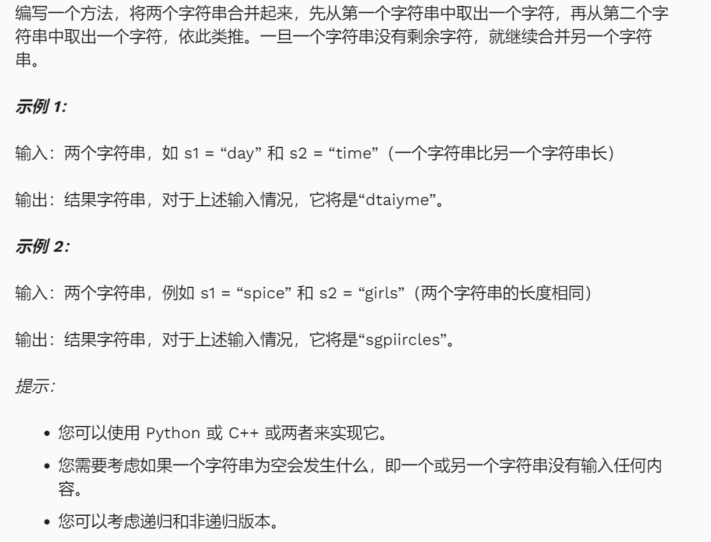
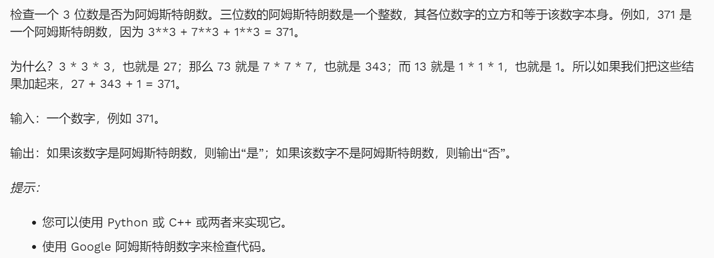
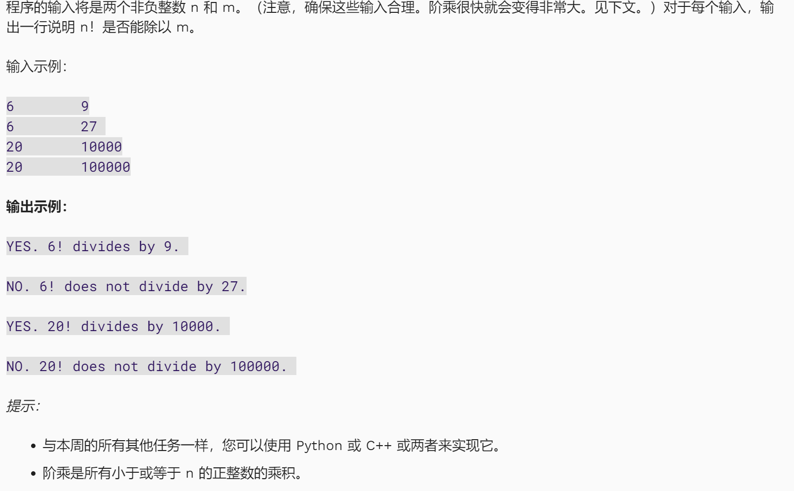
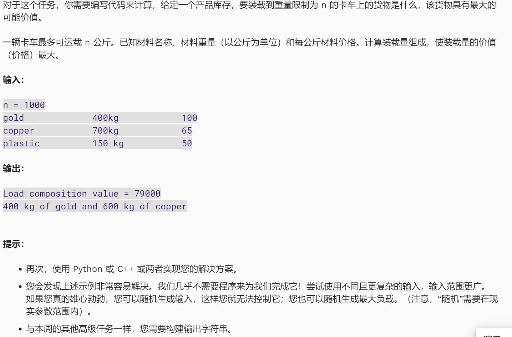
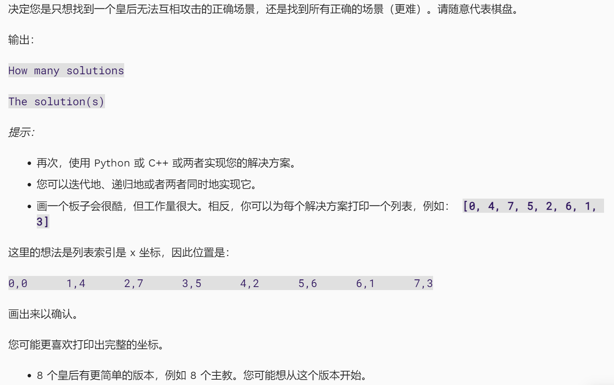

##  非评估任务1：字符串合并



以下代码均为看懂了学校给的代码的逻辑，然后自己重新写出的版本。

**Solution 01：非递归版本**

```python
string1 = input('Please enter your first string: ')
string2 = input('Please enter your second string:')
len_string1 = len(string1)
len_string2 = len(string2)
new_string = ''
if len_string1 >= len_string2:
    limit = len_string2
else:
    limit = len_string1
for i in range(limit):
    new_string += string1[i]
    new_string += string2[i]
if len_string1 >= len_string2:
    new_string += string1[limit:len_string1]
else:
    new_string += string2[limit:len_string2]

print(new_string)
```

**Solution 02 : 递归版本**

```python
str1 = input("Enter the first string: ")
str2 = input("Enter the second string: ")
def merge_string(str1, str2):
    if not str1:
        return str2
    elif not str2:
        return str1
    else:
        return str1[0] + str2[0] + merge_string(str1[1:], str2[1:])

print(merge_string(str1, str2))
```


## 非评估任务2：阿姆斯特朗数字



**Solution （by myself):**

```python
num = input('Enter a integer and check whether it is a Armstrong Numbers or not: ')
h_num = int(num[0])
ten_num = int(num[1])
single_num = int(num[2])
if h_num ** 3 + ten_num ** 3 + single_num ** 3 == int(num):
    print('It is an Armstrong Number')
else:
    print('It is not an Armstrong Number')
```


**Solution (Coventry Given):**

```python
#armstrong number if the sum of each digit raised to the power of the total number of digits is equal to the number input
#also works for the task: three-digit numbers only, cubed

def isarmstrong(totest):                                    #input is an integer                        
    toteststr = str(totest)                                 #convert integer to string so it is iterable
    res = 0                                                 #declare a variable for result and initialise
    for i in range(len(toteststr)):                         #iterate through each digit
        res = res + (int(toteststr[i])**len(toteststr))     #add the digit raised to the power of the length of the number to the result      
    if res != totest:                                       #if the result is not the same as the number return False and quit
        return False 
    return True                                             #if False was not returned return True - it's an Armstrong number
        
print(isarmstrong(371))
```

由此意识到自己的问题：输入的数字不一定是一个三位数呀！

**Solution (modified):**

```python
num = input('Enter a integer and check whether it is a Armstrong Numbers or not: ')
sum = 0
for i in num:
    sum += int(i)**3
if sum == int(num):
    print('Armstrong Number')
else:
    print('Not Armstrong Number')
```


## 非评估作业 3 ： 阶乘是否能被整除？



**Solution(by myself):**

```python
n = input('Enter a number whose factorial you want to calculate:')
m = int(input('Enter a number that you want to be able to calculate whether or not you can divide the factorial of the above numbers:'))
fact_n = 0
for i in range(1,int(n)+1):
    fact_n *= i
if fact_n % m == 0:
    print(f'Yes, {n}! divides by {m}.')
else:
    print(f'No, {n}! does not divide by {m}')
```

**Solution(Coventry Given):**

```python
def factorial(n):
    if (n==0):
        return 1
    else:
        return (n*factorial(n-1))

def does_factorial_divide(fact, divisor):
    if factorial (fact) % divisor == 0:
        print('YES. %s! divides by %s' % (fact, divisor))
    else:
        print('NO. %s! does not divide by %s' % (fact, divisor))

#print(factorial(6))                #check the factorial function works
does_factorial_divide(6, 9)
```

函数递归方法。也很值得学习！


**Solution(modified):**

当我们进行如下测试时，我们发现，我们所写的程序对于计算 数字0 的阶乘时出现 bug:

```python
n = input('Enter a number whose factorial you want to calculate:')
m = int(input('Enter a number that you want to be able to calculate whether or not you can divide the factorial of the above numbers:'))
fact_n = 0
for i in range(1,int(n)+1):
    fact_n *= i
print(fact_n)
if fact_n % m == 0:
    print(f'Yes, {n}! divides by {m}.')
else:
    print(f'No, {n}! does not divide by {m}')
#output
Enter a number whose factorial you want to calculate:0
Enter a number that you want to be able to calculate whether or not you can divide the factorial of the above numbers:1
0
Yes, 0! divides by 1.
```

这个程序计算数字0的阶乘为0 , 而数字0的阶乘为1.

修改：

```python
n = int(input('Enter a number whose factorial you want to calculate:'))
m = int(input('Enter a number that you want to be able to calculate whether or not you can divide the factorial of the above numbers:'))
fact_n = 0
if n == 0:
    fact_n = 1
else:
    for i in range(1, n+1):
        fact_n *= i
if fact_n % m == 0:
    print(f'Yes, {n}! divides by {m}.')
else:
    print(f'No, {n}! does not divide by {m}')
```

这样就解决问题了。


## 非评估任务4：满载糖果的卡车




**Solution(Coventry Given):**

```python
'''
    OPTIMAL KNAPSACK ASSUMES ITEMS ARE MULTIPLES OF 1KG ELEMENTS
    最优的背包问题假设物品的重量是1kg元素的倍数
'''

# 定义一个函数，用于生成物品的组成
def generate_composition(inventory, weight_limit):
    composition = []  # 用于存放物品的每个1kg元素的列表
    for item in inventory:  # 遍历库存中的每个物品
        for i in range(item['weight']):  # 根据物品的重量，按1kg为单位添加到composition
            composition.append(item)
    composition = composition[:weight_limit]  # 如果超过了背包的重量限制，则将多余的部分截掉
    result = []  # 存储最终物品及其数量

    for item in inventory:  # 再次遍历库存中的物品
        # 计算背包中有多少该物品的元素（1kg为单位）
        item['comp_quantity'] = composition.count(item)
        if item not in result:  # 确保不重复添加物品
            result.append(item)  # 添加物品到结果列表
    return result  # 返回物品组成及其在背包中的数量

# 定义生成背包函数
def generate_knapsack(inventory, weight_limit):
    if not inventory:  # 如果没有提供库存物品
        inventory = example_inventory  # 使用默认的库存物品
    comp = generate_composition(inventory, weight_limit)  # 获取最优的背包物品组合
    string = ''  # 用于构建输出的字符串，告知背包中装了哪些物品
    for item in comp:  # 遍历组合后的物品
        if item['comp_quantity'] > 0:  # 如果该物品在背包中数量大于0
            string += '{}kg of {}, '.format(
                str(item['comp_quantity']), item['name'])  # 构建物品的描述字符串
    if string:  # 如果字符串不为空
        string = string[:-2]  # 去掉最后的逗号和空格
    else:
        string = "No materials"  # 如果背包里没有物品，返回“No materials”
    return 'Robber\'s knapsack contains: %s.' % string  # 返回最终字符串，描述背包中的物品

# 主函数，执行逻辑
def main():
    # 定义找到的物品，包含物品的名字、重量和价值
    found_items = [
        {'name': 'Item_1', 'weight': 60, 'value': 60},
        {'name': 'Item_2', 'weight': 20, 'price': 100},
        {'name': 'Item_3', 'weight': 30, 'price': 120}
    ]

    weight_limit = 50  # 定义背包的重量限制
    inventory = found_items  # 使用找到的物品作为库存

    # 打印出生成的背包内容
    print(generate_knapsack(inventory, weight_limit))

# 调用主函数
main()

```


## 非评估任务5：八皇后



参考链接：https://en.wikipedia.org/wiki/Eight_queens_puzzle

Solution(Coventry Given):

```python
-
```

