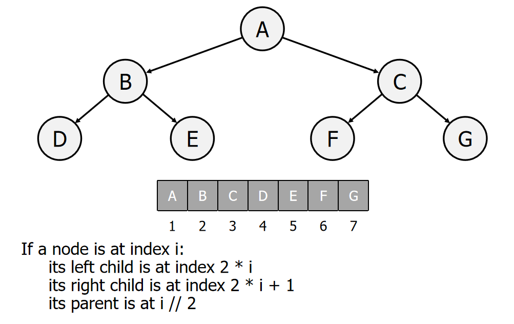

## Week 02: Sorting Algorithms


### 1. Bogosort

```python
import random


def bogoSort(mylist):
    while (is_sorted(mylist) == False):  # if the list is not sorted...
        shuffle(mylist)  # ...shuffle again
    return (mylist)  # if sorted, return


# check if list is sorted
def is_sorted(mylist):
    n = len(mylist)
    for i in range(0, n - 1):  # iterate through list
        if (mylist[i] > mylist[i + 1]):  # if number is bigger than the number to the right
            return False  # list is not sorted so return False


# shuffle the list
def shuffle(mylist):
    n = len(mylist)
    for i in range(0, n):
        r = random.randint(0, n - 1)  # go through list, swapping each
        mylist[i], mylist[r] = mylist[r], mylist[i]  # item with another randomly chosen
    # item


mylist = [3, 2, 4, 1, 0, 5]  # define a list to sort
print(bogoSort(mylist))  # function call
```


### 2. Insertion Sort

```python
def insertionsort(arr):
    for i in range(1, len(arr)):
        key = arr[i]
        j = i
        while j > 0 and arr[j - 1] > key:
            arr[j] = arr[j - 1]
            j = j - 1
        arr[j] = key
    return arr


print(insertionsort([10, 6, 11, 2, 9]))
```


### 3. Bubble Sort

```python
def bubble_sort(arr):
    for i in range(len(arr)):
        for j in range(len(arr) - i - 1):
            if arr[j] > arr[j+1]:
                arr[j], arr[j+1] = arr[j+1], arr[j]
    return arr

print(bubble_sort([4,6,1,7,3]))
```


### 4. Quick Sort

```python
def quick_sort(arr):
    if arr == []:
        return
    pivot = arr[0]
    ltp = []
    etogtp = []
    for x in range(1, len(arr)):
        if arr[x] < pivot:
            ltp.append(x)
        else:
            etogtp.append(x)
    return quick_sort(ltp) + [pivot] + quick_sort(etogtp)


print(quick_sort([1, 4, 2, 7, 5, 9]))
```


### 5. merge sort

```python
def merge_sort(arr):
    if len(arr) <= 1:
        return arr
    mid = len(arr) // 2
    left_arr = arr[:mid]
    right_arr = arr[mid:]

    left_sort = merge_sort(left_arr)
    right_sort = merge_sort(right_arr)

    merged = merge(left_sort, right_sort)
    return merged

def merge(left_arr, right_arr):
    result = []
    i = j = 0
    while i < len(left_arr) and j < len(right_arr):
        if left_arr[i] < right_arr[j]:
            result.append(left_arr[i])
            i += 1
        else:
            result.append(right_arr[j])
            j += 1
    result.extend(left_arr[i:])
    result.extend(right_arr[j:])
    return result

print(merge_sort([38, 27, 43, 3, 9, 82, 10]))
```


## Week 03

### 1. Linear Search

- Also called sequential search
- Iterate over elements until found or sequence ends

Disadvantages:

- Not a very good algorithm
- We have to check every single item in sequence
- Inefficient

Code:

```python
def linear(lst, goal_num):
    for i in range(len(lst)):
        if lst[i] == goal_num:
            return i
    else:
        return -1


print(linear([1, 2, 3, 4, 5], 2))
```


### 2. Binary Search

- Much faster than linear search
- A ‘Divide and Conquer’ algorithm
- Only works on sorted sequences

#### 2.1 How it works?

1. Find the middle value of sequence
2. If search value is the middle value, then success
3. If search value is less than the middle value, discard the top half of the sequence
4. If search value is greater than the middle value, discard the bottom half of the sequence
5. Repeat from (1) until value is found or length of the sequence is zero (i.e. value is not found)


::: tabs

@tab Iterative

```python
def binarySearch(arr, val):
    middle = len(arr) // 2
    while val != arr[middle]:
        if len(arr) > 1:
            if arr[middle] > val:
                arr = arr[0:middle]
            else:
                arr = arr[middle:]
        else:
            if val != arr[middle]:
                return False
        middle = len(arr) // 2
    return True


print(binarySearch([1, 3, 4, 5, 7, 9, 10], 8))
```


@tab Recursive

```python
def binarySearch(arr, val):
    ans = True
    if len(arr) == 1 and val != arr[0]:
        ans = False
    else:
        middle = len(arr) // 2
        if val != arr[middle]:
            if val > arr[middle]:
                arr = arr[middle + 1:]
                ans = binarySearch(arr, val)
            else:
                arr = arr[:middle]
                ans = binarySearch(arr, val)
    return ans


print(binarySearch([1, 2, 3, 4, 5, 6, 7, 8, 9], 6))

```

@tab 自己写的代码

```python
def binarySearch(arr, val):
    i = 0
    j = len(arr) - 1
    while i <= j:
        middle = (i + j) // 2
        if arr[middle] == val:
            return True
        elif arr[middle] > val:
            j = middle - 1
        elif arr[middle] < val:
            i = middle + 1
    return False


print(binarySearch([1, 2, 3, 4, 5, 6, 7, 8, 9], 6))
```


:::


### 3. Interpolation Search

给定一个长度为 n 的有序数组 nums 和一个元素 target ，数组不存在重复元素。现将 target 插入数组 nums 中，并保持其有序性。若数组中已存在元素 target ，则插入到其左方。请返回插入后 target 在数组中的索引。

```python
def binary_searching(nums, target):
    i = 0
    j = len(nums) - 1
    while i <= j:
        m = (i + j) // 2
        if nums[m] == target:
            nums.insert(m, target)
            return nums
        elif nums[m] > target:
            j = m - 1
        else:
            i = m + 1
    else:
        return i


print(binary_searching([1, 3, 6, 8, 12, 15, 23, 26, 31, 36], 6))
```


### 4. Data Structures

#### 4.1 Binary Tree

- Some Rules

    

#### 4.2 Heaps


