## 0. 目录

- bogosort
- insertion sort
- bubble sort
- merge sort
- quick sort


## 1. Bogosort

- 这是一个笑话算法，随机洗牌一个列表； 
- 如果洗牌没有按正确顺序排列，就再洗一次  
- 继续洗牌，直到得到一个排序列表！
- 查看 python 代码

### 1.1 前置知识

- 随机库：`random`
    - `random.randint(a, b)`
- 内置函数：
    - `len()`    
    - `range()`
- 语法：
    - `for`
    - `function`
    - 比较运算符
    - 多个变量同时赋予不同值 | 引入多一个变量

### 1.2 前置知识查漏补缺

1. 随机库：

`random.randint(a, b)`用于随机生成一个从 a 到 b 的数字，==包含 a 和 b==。

### 1.3 排序原理

随机打乱列表，判断列表是否有序。无序则继续打乱，继续判断。

### 1.4 功能拆解

#### 1.4.1 如何判断一个列表是否有序？

> 思考一下，类似之前讲到，如何判断用户输入是否为浮点数？
>
> - Solution 1：首先，用内置函数 `count()`算出输入中有几个小数点（.），再 `replace()`小数点判断其是否为纯数字。
> - Solution 2：直接 `replace('.', '', 1)`,控制替换次数为1，然后判断其是否为纯数字。

**Solution 01：（不使用函数的方法）**

```python
lst = [1, 2, 3, 4, 5, 6, 7, 8, 9, 0]
is_sorted = True
former = lst[0]
for i in lst:
    if i >= former:
        former = i
    else:
        is_sorted = False
        break
print(is_sorted)
```


**Solution 02：（使用函数的方法）**

```python
lst = [1, 2, 4, 5, 6, 3]
def is_sorted(lst):
    former = lst[0]
    for i in lst:
        if i >= former:
            former = i
        else:
            return False
    return True
```

::: details 实现原理

使用了函数遇到 `return`即停止的特性。

:::


**Solution 03：（优化的方法）**

非函数：

```python
lst = [1, 2, 3, 4, 5, 6, 7, 8, 9, 0]
is_sorted = True
for i in range(len(lst) - 1):
    if lst[i] <= lst[i + 1]:
        is_sorted = True
    else:
        is_sorted = False
        break
print(is_sorted)
```

or

函数：

```python
def is_sorted(lst):
    # 从第二个元素开始遍历，因为第一个元素没有前一个元素可以比较
    for i in range(1, len(lst)):
        # 如果前一个元素大于当前元素，说明不是升序排列
        if lst[i - 1] > lst[i]:
            return False
    # 如果没有发现任何不符合升序的情况，返回True
    return True
```


#### 1.4.2 如何打乱列表

::: tabs

@tab 使用 `random.shuffle()`（推荐）

这是最直接的方法，Python 自带的 `random`模块已经实现了对列表的就地随机打乱

```python
import random

mylist = [1, 2, 4, 6, 8]
random.shuffle(mylist)
print(mylist)
```

**特点：**

- 这是 Python 的内置函数方法。简单快捷
- 原地打乱，不返回新列表，直接修改原始列表。


@tab 使用 `random.sample()`（不修改列表）

如果不想修改原列表想建立一个新的打乱顺序的列表，可以使用 `random.sample()`。

```python
import random

mylist = [1, 2, 4, 6, 8]
shuffle_list = random.sample(mylist, len(mylist))
print(shuffle_list)
```


@tab 使用 Fisher-Yates 洗牌算法 （手动实现）

##### 1. **Fisher-Yates 洗牌算法简介**:

Fisher-Yates 洗牌算法，也称为 Knuth 洗牌算法，是一种用于随机打乱一个列表或数组的经典算法。它通过将每个元素与未打乱部分的元素随机交换，确保每个元素在打乱后的列表中有相同的概率出现在任何位置。

```python
import random
def fisher_yates_shuffle(mylist):
    n = len(mylist)
    for i in range(n-1, 0, -1):
        # 在索引范围 0 到 i 之间随机选择一个索引 j
        j = random.randint(0, i)
        # 交换位置： 将索引 i 与索引 j 处的元素交换
        mylist[i], mylist[j] = mylist[j], mylist[i]
        # 第二种交换方法：
        # change_num = mylist[i]
        # mylist[i] = mylist[j]
        # mylist[j] = change_num
    # 返回洗牌后的列表
    return mylist

```

**特点：**

- 这种方法可以手动控制打乱过程， 理解 shuffle 的逻辑。
- 与 `random.shuffle()`效果一致。

##### 2. 算法的原理

Fisher-Yates 算法的核心思想是，从未打乱的部分中随机选取一个元素与当前元素进行交换，并逐步缩小未打乱的范围，直到整个列表都被随机打乱。

**步骤如下：**

1. 从后向前遍历：从列表的最后一个元素开始，遍历到列表的第一个元素。
2. 随机选择一个索引：在当前未打乱的部分中随机选择一个索引，范围是从 0 到当前元素的索引。
3. 交换元素：将当前元素与随机选择的索引对应的元素交换位置。
4. 继续遍历：然后继续向前移动，直到所有元素都被遍历并交换过。
5. 这种方式可以保证每个元素被选择和交换的概率是均匀的，因此打乱后的列表是完全随机的。

##### 3. 步骤详解：

假设我们有一个包含五个元素的列表 `mylist = [1, 2, 3, 4, 5]`，我们打乱它。

1. **初始列表：**

```python
mylist = [1, 2, 3, 4, 5]
```

2. **从后往前遍历**

- 第一次，`i = 4`（列表的最后一个元素 `5`），我们在 `[0, 4]` 范围内随机选择一个索引，比如 `j = 2`，然后交换 `mylist[4]` 和 `mylist[2]`：

    ```python
    mylist = [1, 2, 5, 4, 3]  # 交换 5 和 3
    ```

- 第二次，`i = 3`（元素 `4`），我们在 `[0, 3]` 范围内随机选择一个索引，比如 `j = 0`，然后交换 `mylist[3]` 和 `mylist[0]`：

    ```python
    mylist = [4, 2, 5, 1, 3]  # 交换 4 和 1
    ```

- 第三次，`i = 2`（元素 `5`），我们在 `[0, 2]` 范围内随机选择一个索引，比如 `j = 1`，然后交换 `mylist[2]` 和 `mylist[1]`：

    ```python
    mylist = [4, 5, 2, 1, 3]  # 交换 5 和 2
    ```

- 第四次，`i = 1`（元素 `5`），我们在 `[0, 1]` 范围内随机选择一个索引，比如 `j = 0`，然后交换 `mylist[1]` 和 `mylist[0]`：

    ```python
    mylist = [5, 4, 2, 1, 3]  # 交换 5 和 4
    ```

到此为止，列表已经被打乱。

3. **最终打乱的列表**

```python
mylist = [5, 4, 2, 1, 3]
```


@tab 使用 `sorted()` + 随机键

通过给 `sorted()`函数传入一个随机排序键，可以打乱列表顺序.

```python
import random

mylist = [1, 2, 3, 4, 5, 6, 7, 8, 9, 10]
shuffled_list = sorted(mylist, key=lambda x: random.random()) # 根据随机键排列
print(shuffled_list)
```

**特点：**

- 使用 `sorted()`函数通过随机键进行打乱，

- 虽然能实现，但效率较低。因为 `sorted()`的复杂度为 $O(n \space log \space n)$,而 `shuffle`操作的复杂度应该是 $O(n)$


@tab 使用 Numpy 的 `np.random.shuffle()`

如果在处理的是 Numpy 数组， 也可以使用 Numpy 提供的 `shuffle`方法。

```python
import numpy
import numpy as np

myarray = np.array([1, 2, 3, 4, 5, 6, 7, 8, 9])
np.random.shuffle(myarray) # 就地打乱 Numpy 数组
print(myarray)
```

**特点：**

- 适合处理大规模的数值型数据，尤其是在科学计算中常用。
- 原地打乱 Numpy 数组，操作与 `random.shuffle()`类似。

:::

**汇总：**

- `random.shuffle()`：推荐，最常用原地打乱列表的方法。
- `random.sample()`: 返回一个打乱后的新列表，不修改原列表
- Fisher-Yates 洗牌算法： 手动实现打乱列表
- `sorted()` + 随机键：通过随机键打乱列表，效率不高
- Numpy 的 `np.random.shuffle()`：适合打乱 Numpy 数组，用于大规模计算。

在一般情况下，使用 `random.shuffle()`是最推荐的方式，它简洁高效，如果要保留原列表可以选择 `random.sample()`。


### 1.5 完整代码

**自己总结的方法：**

::: code-tabs

@tab 1.**自动打乱的完整代码：**

```python
import random


def is_sorted(lst):
    # 从第二个元素开始遍历，因为第一个元素没有前一个元素可以比较
    for i in range(1, len(lst)):
        # 如果前一个元素大于当前元素，说明不是升序排列
        if lst[i - 1] > lst[i]:
            return False
    # 如果没有发现任何不符合升序的情况，返回True
    return True


def is_shuffle():
    lst = [1, 0, 4, 6, 2, 4, 3, 7, 9]
    while not is_sorted(lst):
        random.shuffle(lst)
    print(lst)


is_shuffle()
```


@tab 2.**手动打乱的完整代码：**

```python
import random


def is_sorted(lst):
    # 从第二个元素开始遍历，因为第一个元素没有前一个元素可以比较
    for i in range(1, len(lst)):
        # 如果前一个元素大于当前元素，说明不是升序排列
        if lst[i - 1] > lst[i]:
            return False
    # 如果没有发现任何不符合升序的情况，返回True
    return True

def fisher_yates_shuffle(mylist):
    n = len(mylist)
    for i in range(n-1, 0, -1):
        # 在索引范围 0 到 i 之间随机选择一个索引 j
        j = random.randint(0, i)
        # 交换位置： 将索引 i 与索引 j 处的元素交换
        mylist[i], mylist[j] = mylist[j], mylist[i]
    # 返回洗牌后的列表
    return mylist
def is_shuffle():
    lst = [1, 0, 4, 6, 2, 4, 3, 7, 9]
    while not is_sorted(lst):
        fisher_yates_shuffle(lst)
    print(lst)


is_shuffle()
```

:::

**学校方法：**

```python
import random


def bogoSort(mylist):
    while (is_sorted(mylist) == False):  # if the list is not sorted...
        shuffle(mylist)  # ...shuffle again
    return (mylist)  # if sorted, return


# check if list is sorted
def is_sorted(mylist):
    n = len(mylist)
    for i in range(0, n - 1):  # iterate through list
        if (mylist[i] > mylist[i + 1]):  # if number is bigger than the number to the right
            return False  # list is not sorted so return False


# shuffle the list
def shuffle(mylist):
    n = len(mylist)
    for i in range(0, n):
        r = random.randint(0, n - 1)  # go through list, swapping each
        mylist[i], mylist[r] = mylist[r], mylist[i]  # item with another randomly chosen
    # item


mylist = [3, 2, 4, 1, 0, 5]  # define a list to sort
print(bogoSort(mylist))  # function call

```


**对比：**

自己总结的方法2与学校方法类似。只是学校手动打乱的方法效率较低，我们的方法避免了打乱的时候可能同一个元素自己与自己交换位#置的情况。


## 2. Insertion sorting


### 2.1 排序原理

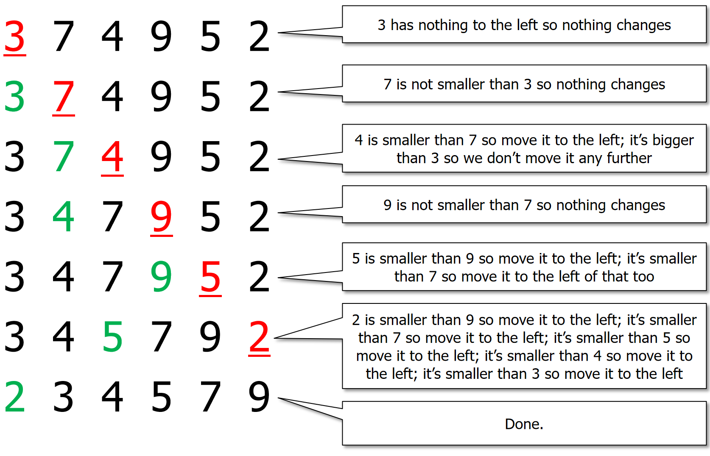

关于上面图片的例子，我们分步走：

1. 首先，创建一个新的空列表；
2. 顺序地遍历原列表中的每一个元素
3. 把第一个数字——3，放入新列表
4. 把原列表中3后面紧跟的数字7拿出来，与新列表的所有元素比大小，放入前一个数字（可能没有）`可能`小于7、后一个数字（可能没有）`可能`大于7的位置，
5. 现在得到新列表里的元素为：`[3, 7]`
6. 然后来到数字4 。与上面同样的方法，尝试将其放进我们新创建的列表。
7. 可知，4应该放在3和7之间，所以放入4，此时我们的新列表为`[3, 4, 7]`
8. 重复这个过程，最后输出我们的新列表，就是原列表插入排序后的样子啦。


### 2.2 功能拆解

#### 2.2.1 新数字插入列表进行排序

我们要实现插入排序的功能，首先要实现的就是怎么把一个数字插入到顺序排序的列表中，并不能破坏其顺序的排列。也就是说，在这个新数字插入前和插入后，列表都是顺序排列的。

::: code-tabs 

@ tab 自己的想法（太过于冗杂）

```python
# 获取用户输入一个数字，把该数字放到目标列表中合适的位置，最后输出的结果应该是从小到大排序，不能使用排序函数。

def insertion_func(lst):
    num = int(input('Enter a number: '))
    for i in range(len(lst)):
        if lst[i] <= num and lst[i + 1] >= num:
            lst.insert(i + 1, num)
            return lst
        elif lst[0] >= num:
            lst.insert(0, num)
            return lst
        else:
            lst.insert(len(lst), num)
            return lst


print(insertion_func([4, 8]))
```


@tab 最优解：

```python
def insert_in_order(lst, num):
    for i in range(len(lst)):
        if num < lst[i]:
            lst.insert(i, num)
            break
        else:
            lst.append(num)
    return lst


print(insert_in_order([4, 8], 1))
```

:::

### 2.3 完整代码

#### 2.3.1 初级版

```python
lst = [12, 11, 13, 5, 6]
sorted_lst = []
for j in range(len(lst)):
    for i in range(len(sorted_lst)):
        if lst[j] < sorted_lst[i]:
            sorted_lst.insert(i, lst[j])
            break
    else:
        sorted_lst.append(lst[j])  # 如果遍历完还没有找到合适位置，说明 num 最大，放在最后

print("排序后的列表:", sorted_lst)
```


#### 2.3.2 中极版

改良：不用新建一个列表，直接在原列表上面修改。

```python
lst = [12, 11, 13, 5, 6]

for j in range(1, len(lst)):
    for i in range(j):
        if lst[i] > lst[j]:
            num = lst[j]  
            del lst[j]
            lst.insert(i, num)
            break

print("排序后的列表:", lst)
```


#### 2.3.3 boss 版

```python
def insert_sort(nums):
    for i in range(1, len(nums)):
        base = nums[i]
        j = i - 1
        while j >= 0 and base < nums[j]:
            nums[j + 1] = nums[j]
            j -= 1 # 为什么要减1？
            nums[j + 1] = base
    return nums


nums = [3, 1, 7, 9, 2]
print(insert_sort(nums))
```


## 3. 冒泡排序

### 3.1 排序原理

1. 一个列表，从第一个元素开始与后面的元素两两比较，如果后面的元素更小，则交换位置。一轮比较下来，最大的元素一定会出现在列表的末尾。

    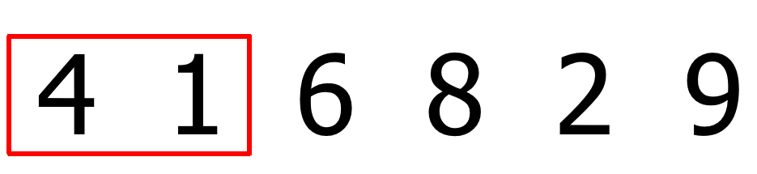

    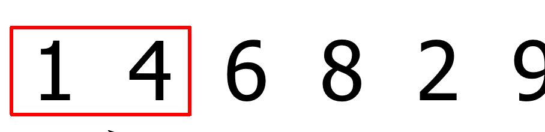

    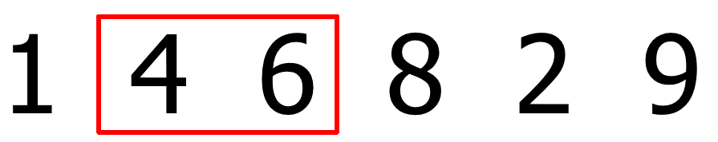

    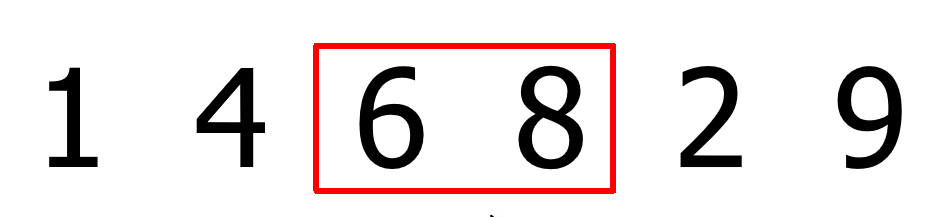

    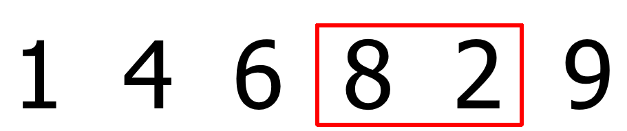

    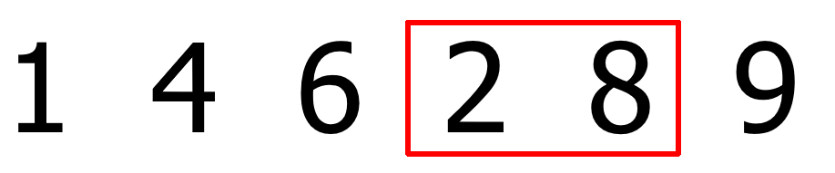

    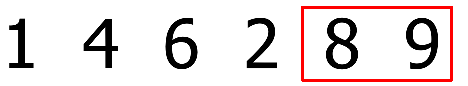

    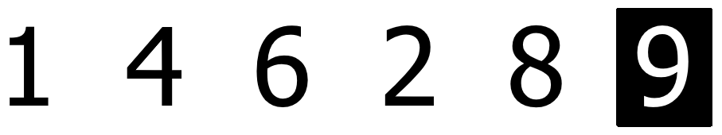

    2. 再进行第二次的整个列表从头到尾的比较，这时剩下的元素中最大的元素也被放到了列表的末尾。过程略，结果如下：

        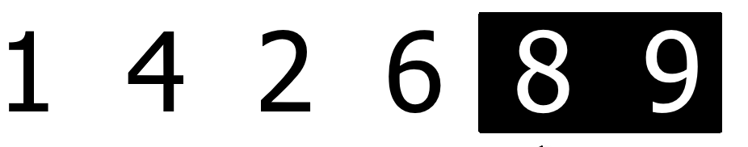

    3. 第三次比较后：

        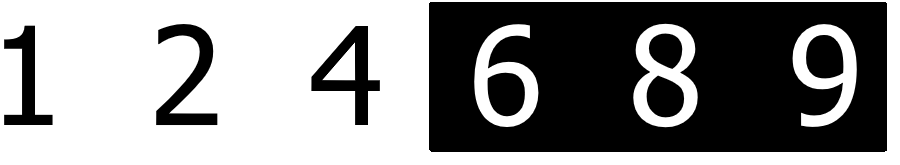

    4. 第四次：

        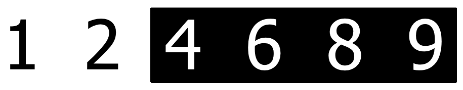

    5. 第五次：

        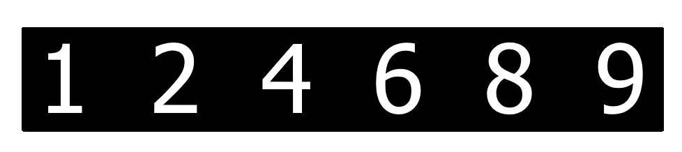

        

```python
def bubble(lst):
    for j in range(len(lst)):
        for i in range(len(lst) - j - 1): 
            """为啥要 - 1？比如现在队列还有五个没有排序的数字，那么我们只用比较四次！"""
            if lst[i] > lst[i + 1]:
                lst[i], lst[i + 1] = lst[i + 1], lst[i]
    return lst


print(bubble([3, 2, 6, 1, 5, 4]))
```


## 4. 快速排序


### 4.1 排序原理

快速排序的核心操作是“哨兵划分”，其目标是：选择数组中某个元素作为“基准数”，将所有小于基准数的元素移到其左侧，而大于基准数的元素移到其右侧。


### 4.2 功能拆解

1. 选取数组最左端元素作为基准数，初始化两个指针 i 和 j 分别指向数组的两端。
2. 设置一个循环，在每轮中使用 i（j）分别寻找第一个比基准数大（小）的元素，然后交换这两个元素。
3. 循环执行步骤2，直到 i 和 j 相遇时停止，最后将基准数交换到两个子数组的分界线。


### 4.3 完整代码

```python
def partition(nums, left, right):
    i, j = left, right  # 以nums[left]为基数
    while i < j:  # 把数组第一个数当成基准数
        while i < j and nums[j] >= nums[left]:  # 从右向左找首个小于基准数的元素
            j -= 1
        while i < j and nums[i] <= nums[left]:
            i += 1
        nums[i], nums[j] = nums[j], nums[i]
    return i


def quick_sort(nums, left, right):
    if left >= right:
        return
    pivot = partition(nums, left, right)
    quick_sort(nums, left, pivot - 1)
    quick_sort(nums, pivot + 1, right)


if __name__ == '__main__':
    nums = [2, 4, 1, 0, 3, 5]
    quick_sort(nums, 0, len(nums) - 1)
    print(nums)

```


### 4.4 功能略解

1. 首先我们要确定基准数，把比基准数小的数放在基准数左边，把比基准数大的数放在基准数右边，并且把比基准数小的且现在已经在基准数左边的数字（们）分为左子数组，把比基准数大的且现在已经在基准数右边的数字（们）分为右子数组。
2. 然后把我们分好的左右子数组再次分组，在左右子数组内部再找基准数，再把小于基准数的数放基准数左边；大于基准数的数放基准数右边…….

3. 当左右子数组被分的只剩一个数，停止递归。


## 5. 归并排序

归并排序（merge sort）是一种基于分治策略的排序算法。包含划分和合并的阶段；

1. 划分阶段：通过递归不断将数组从中点处分开，将长数组的排序问题转换为短数组的排序问题。
2. 合并阶段：当子数组长度为 1 时终止划分，开始合并，持续的将左右两个较短的有序数组合并为一个较长的有序数组，直至结束。


### 5.1 划分阶段

::: code-tabs

@tab 自己思路

```python
def division(lst):
    if len(lst) <= 1:  # 列表划分的只剩一个数，停止递归。
        return lst[0]  # 返回单个值
    else:
        if len(lst) % 2 == 1:  # 列表数字个数为单
            n = int(len(lst) // 2)   # 用取整代替除法。强制转换为整型
            left_lst = lst[:n]  # 不能在 print 里调用，不然会返回 None
            right_lst = lst[n:]
            print(f'Division:{lst} -> Left:{left_lst} -> Right: {right_lst}')
            division(left_lst)
            division(right_lst)

        elif len(lst) % 2 == 0:
            n = int(len(lst) / 2)
            left_lst = lst[:n]
            right_lst = lst[n:]
            print(f'Division:{lst} -> Left:{left_lst} -> Right: {right_lst}')
            division(left_lst)
            division(right_lst)


division([38, 27, 43, 3, 9, 82, 10])
```


@tab 优化代码

```python
def merge_sort_division(arr):
    if len(arr) <= 1:
        return arr
    mid = len(arr) // 2
    left = arr[:mid]
    right = arr[mid:]
    print(f'Division:{arr} -> Left:{left} -> Right: {right}')
    merge_sort_division(left)
    merge_sort_division(right)
    return merge # 返回合并代码，因为合并代码的结果是重新排序的结果


merge_sort_division([3, 2, 4, 29, 145, 64, 6])
```

:::


### 5.2 代码执行顺序：

``` python
'''
/Users/huangjiabao/GitHub/iMac/Pycharm/venv/bin/python /Users/huangjiabao/GitHub/iMac/Pycharm/StudentCoder/43-xiaoxianyusxb/DS.py
初始数组: [38, 27, 43, 3, 9, 82, 10]
调用merge_sort函数，当前数组为: [38, 27, 43, 3, 9, 82, 10]
将数组划分为: 左半部分: [38, 27, 43], 右半部分: [3, 9, 82, 10]
  调用merge_sort函数，当前数组为: [38, 27, 43]
  将数组划分为: 左半部分: [38], 右半部分: [27, 43]
    调用merge_sort函数，当前数组为: [38]
    数组元素个数小于等于1，返回: [38]
    调用merge_sort函数，当前数组为: [27, 43]
    将数组划分为: 左半部分: [27], 右半部分: [43]
      调用merge_sort函数，当前数组为: [27]
      数组元素个数小于等于1，返回: [27]
      调用merge_sort函数，当前数组为: [43]
      数组元素个数小于等于1，返回: [43]
    开始合并: 左数组: [27], 右数组: [43]
    合并结果: [27, 43]
    合并后的数组: [27, 43]
  开始合并: 左数组: [38], 右数组: [27, 43]
  合并结果: [27, 38, 43]
  合并后的数组: [27, 38, 43]
  调用merge_sort函数，当前数组为: [3, 9, 82, 10]
  将数组划分为: 左半部分: [3, 9], 右半部分: [82, 10]
    调用merge_sort函数，当前数组为: [3, 9]
    将数组划分为: 左半部分: [3], 右半部分: [9]
      调用merge_sort函数，当前数组为: [3]
      数组元素个数小于等于1，返回: [3]
      调用merge_sort函数，当前数组为: [9]
      数组元素个数小于等于1，返回: [9]
    开始合并: 左数组: [3], 右数组: [9]
    合并结果: [3, 9]
    合并后的数组: [3, 9]
    调用merge_sort函数，当前数组为: [82, 10]
    将数组划分为: 左半部分: [82], 右半部分: [10]
      调用merge_sort函数，当前数组为: [82]
      数组元素个数小于等于1，返回: [82]
      调用merge_sort函数，当前数组为: [10]
      数组元素个数小于等于1，返回: [10]
    开始合并: 左数组: [82], 右数组: [10]
    合并结果: [10, 82]
    合并后的数组: [10, 82]
  开始合并: 左数组: [3, 9], 右数组: [10, 82]
  合并结果: [3, 9, 10, 82]
  合并后的数组: [3, 9, 10, 82]
开始合并: 左数组: [27, 38, 43], 右数组: [3, 9, 10, 82]
合并结果: [3, 9, 10, 27, 38, 43, 82]
合并后的数组: [3, 9, 10, 27, 38, 43, 82]
最终排序后的数组: [3, 9, 10, 27, 38, 43, 82]

Process finished with exit code 0
'''
```


### 5.3 完整代码

```python
import time

def merge_sort_divide(arr, depth=0):
    # 打印当前递归的深度和数组
    print(f"{'  ' * depth}调用merge_sort函数，当前数组为: {arr}")
    time.sleep(0.5)  # 添加0.5秒的延迟，便于观察

    # 如果数组长度小于等于1，则返回数组
    if len(arr) <= 1:
        print(f"{'  ' * depth}数组元素个数小于等于1，返回: {arr}")
        time.sleep(0.5)  # 添加延迟
        return arr

    # 找到数组的中间索引，将数组划分为两部分
    mid = len(arr) // 2
    left_half = arr[:mid]
    right_half = arr[mid:]

    # 打印当前数组的划分情况
    print(f"{'  ' * depth}将数组划分为: 左半部分: {left_half}, 右半部分: {right_half}")
    time.sleep(0.5)  # 添加延迟

    # 递归地对左右两部分进行排序，并增加递归深度
    left_sorted = merge_sort_divide(left_half, depth + 1)
    right_sorted = merge_sort_divide(right_half, depth + 1)

    # 归并排序后的左右两部分，并打印归并过程
    merged = merge(left_sorted, right_sorted, depth)
    print(f"{'  ' * depth}合并后的数组: {merged}")
    time.sleep(0.5)  # 添加延迟

    return merged

def merge(left_sorted, right_sorted, depth=0):
    result = []
    i = j = 0
    while i < len(left_sorted) and j < len(right_sorted):
        if left_sorted[i] < right_sorted[j]:
            result.append(left_sorted[i])
            i += 1
        else:
            result.append(right_sorted[j])
            j += 1
    # 将 left 数组中剩余的元素添加到结果中
    result.extend(left_sorted[i:])
    result.extend(right_sorted[j:])
    return result

# 测试代码
arr = [38, 27, 43, 3, 9, 82, 10]
print("初始数组:", arr)
time.sleep(1)  # 初始输出时延迟1秒
sorted_arr = merge_sort_divide(arr)
print("最终排序后的数组:", sorted_arr)
```


### 5.4 输出

```python
初始数组: [38, 27, 43, 3, 9, 82, 10]
调用merge_sort函数，当前数组为: [38, 27, 43, 3, 9, 82, 10]
将数组划分为: 左半部分: [38, 27, 43], 右半部分: [3, 9, 82, 10]
  调用merge_sort函数，当前数组为: [38, 27, 43]
  将数组划分为: 左半部分: [38], 右半部分: [27, 43]
    调用merge_sort函数，当前数组为: [38]
    数组元素个数小于等于1，返回: [38]
    调用merge_sort函数，当前数组为: [27, 43]
    将数组划分为: 左半部分: [27], 右半部分: [43]
      调用merge_sort函数，当前数组为: [27]
      数组元素个数小于等于1，返回: [27]
      调用merge_sort函数，当前数组为: [43]
      数组元素个数小于等于1，返回: [43]
    合并后的数组: [27, 43]
  合并后的数组: [27, 38, 43]
  调用merge_sort函数，当前数组为: [3, 9, 82, 10]
  将数组划分为: 左半部分: [3, 9], 右半部分: [82, 10]
    调用merge_sort函数，当前数组为: [3, 9]
    将数组划分为: 左半部分: [3], 右半部分: [9]
      调用merge_sort函数，当前数组为: [3]
      数组元素个数小于等于1，返回: [3]
      调用merge_sort函数，当前数组为: [9]
      数组元素个数小于等于1，返回: [9]
    合并后的数组: [3, 9]
    调用merge_sort函数，当前数组为: [82, 10]
    将数组划分为: 左半部分: [82], 右半部分: [10]
      调用merge_sort函数，当前数组为: [82]
      数组元素个数小于等于1，返回: [82]
      调用merge_sort函数，当前数组为: [10]
      数组元素个数小于等于1，返回: [10]
    合并后的数组: [10, 82]
  合并后的数组: [3, 9, 10, 82]
合并后的数组: [3, 9, 10, 27, 38, 43, 82]
最终排序后的数组: [3, 9, 10, 27, 38, 43, 82]
```


### 5.5 整个流程逻辑

根据上面的代码可以清晰的感受到递归的一个流程和顺序。

1. 首先把左半部分的数拆分成只剩下一个数的列表，再根据先左后右的顺序来合并。有例子可知，最先进行操作的是 [38]，单个数不需要合并，遂跳过。
2. 再来操作 [27, 43] 。
3. 来到第三步，左列表这时候是 [38]，右列表是 [27, 43]
4. **这时来到了合并代码的逻辑。**
    - **首先设置指针为 `i = j = 0`，这是我们要遍历两个列表需要用到的指针。**
    - **比较两个列表第一个数的大小。显然，27小于38，所以先把 27 添加到列表 result 里面去。这时 j += 1，j = 1了**
    - **再把 `left[i]`和 `right[j]`比较想（显然这时 i = 0 ，j = 1），所以我们在比较 38 和 43 。显然 38 小，把 38 添加进 result.**
    - **这时 j 再加1等于2，不满足 while 循环的条件。while 循环终止。**
    - **最后是查看列表中最后没被插入列表的元素，即 43.**
    - **这时列表为 `[27, 38, 43]`**

5. 拆分右列表。一样的。得到 `[3, 9, 10, 82]`
6. 最后合成 `[3, 9, 10, 27, 38, 43, 82]`


