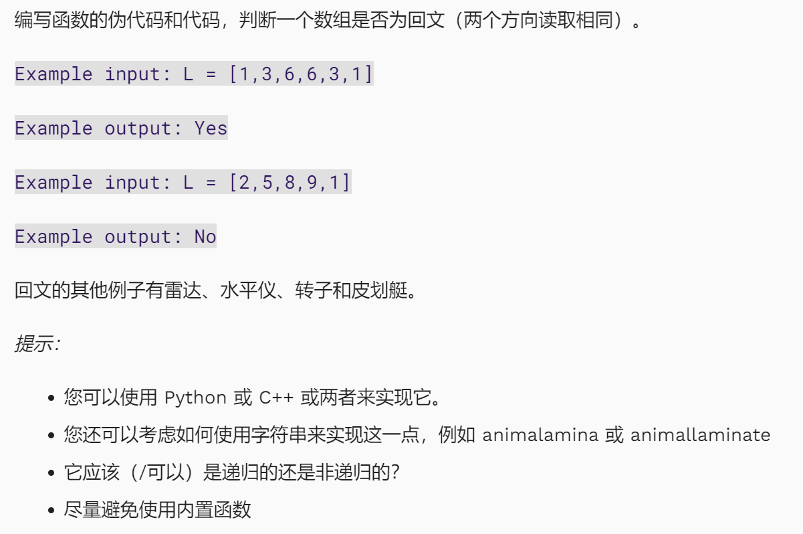

## 1. 判断是否回文



::: code-tabs


@tab Solution （mine）：

```python
from copy import deepcopy

L = input('Please enter a list: ')
if L.replace('[', '').replace(']', '').replace(',','').isdigit():
    L = L.strip('[').strip(']').split(',')
    L_original = deepcopy(L)
    L.reverse()
    if L == L_original:
        print('True')
elif L.isalpha():
    L_reverse = ''
    for i in range(len(L)-1, 0, -1):
        L_reverse = L_reverse + L[i]
    if L_reverse == L:
        print('True')
```

@tab Solution 01 (Coventry): 

```python
#non-destructive ; will work with list or string
def palindrome2(posspal):
    for i in range(len(posspal)//2):
        if (posspal[i] != posspal[len(posspal) - 1 - i]):
            return False
    return True
```

@tab Solution 02 (Coventry):

```python
def palindrome(posspal):
    if len(posspal) < 2:
        return True
    elif posspal[0] != posspal[-1]:
        return False
    return palindrome(posspal[1:-1])
```


:::


::: warning

避免使用内置函数，那我们最好手动使用循环来一个个 check 是否对称，找到需要配对下标的数学联系。

第二个递归方法，比对第一个和最后一个，递归剥去外面一层….

:::


## 2. 冒泡排序

```python
# bubble_sort 代码实现

from typing import List

# 冒泡排序
def bubble_sort(arr: List[int]):
    """
    冒泡排序(Bubble sort)
    :param arr: 待排序的List,此处限制了排序类型为int
    :return: 冒泡排序是就地排序(in-place)
    """
    length = len(arr)
    if length <= 1:
        return

    for i in range(length):
        is_made_swap = False  ## 设置标志位，若本身已经有序，则直接break
        for j in range(length - i - 1):
            if arr[j] > arr[j + 1]:
                arr[j], arr[j + 1] = arr[j + 1], arr[j]
                is_made_swap = True
        if not is_made_swap:
            break


# 测试数据
if __name__ == '__main__':
    import random
    random.seed(54)
    arr = [random.randint(0, 100) for _ in range(10)]
    print("原始数据：", arr)
    bubble_sort(arr)
    print("冒泡排序结果：", arr)
```


