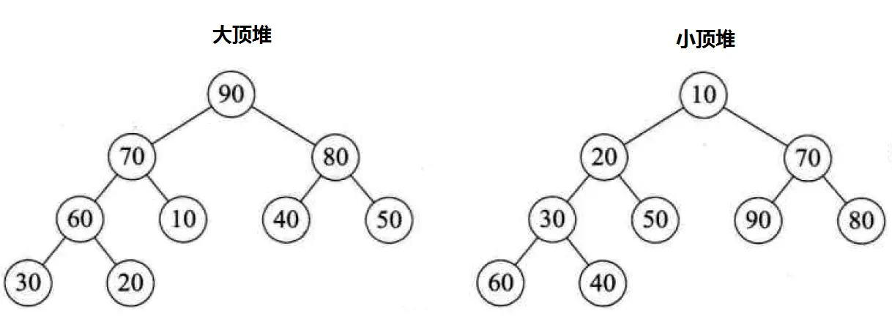

## 1. 线性查找

### 1.1 步骤

1. 从第一个元素开始，将其与目标值进行比较。
2. 如果找到目标值，则返回该元素所在的索引。
3. 如果没有找到目标，继续比较列表下一个元素
4. 如果遍历完整个列表都没有目标值，则目标值不存在于列表中。（一般返回 -1）


### 1.2 完整代码

只考虑列表中只有一个目标值的情况：

```python
def linear(lst, goal_num):
    for i in range(len(lst)):
        if lst[i] == goal_num:
            return i
    else:
        return -1


print(linear([1, 2, 3, 4, 5], 2))
```


### 1.3 练习

::: tabs

@tab 题目1：森林里的隐藏宝藏

你被困在一片神秘的森林里，传说森林里隐藏着一块能指引方向的宝藏石。森林被划分为一系列的区域，每个区域都有一块石头，但只有一块是真正的宝藏石。每块石头上都有一个刻印编号。已知这些编号的列表 `stones`，你的任务是通过线性查找找到宝藏石的编号 `treasure_stone`。

**要求：**

1. 编写一个线性查找算法，找到宝藏石的编号位置。
2. 输出宝藏石所在区域的索引。

**输入：**

一个列表 `stones`，包含区域的石头编号；一个整数 `treasure_stone` 表示宝藏石的编号。

**输出：**

找到宝藏石编号的位置，或者输出“未找到”。

**示例：**

```python
stones = [14, 52, 89, 33, 71, 26]
treasure_stone = 71
```

**期望输出：**

```
宝藏石位于区域 4
```


==**Solution:**==

```python
def treasure_searching(stones, treasure_stone):
    index_ = []
    if treasure_stone in stones:
        for i in range(len(stones)):
            if stones[i] == treasure_stone:
                index_.append(i)
        return index_


treasure = treasure_searching(stones=[14, 52, 89, 33, 71, 26], treasure_stone=71)


def print_treasure(treasure):
    for i in range(len(treasure)):
        return treasure[i]


print(f'宝藏石位于区域{print_treasure(treasure)}')

```


@tab 题目2：机器人迷宫寻路

一个机器人在迷宫中迷路了，迷宫由一系列格子组成。格子用一个列表表示，每个格子可以是空的（用0表示）或有障碍物（用1表示）。机器人需要从起点找到终点，并穿越最短的无障碍路径。你的任务是通过线性查找找到连续的、没有障碍物的最长路径，并返回该路径的起始和结束索引。

**要求：**

1. 使用线性查找算法找到迷宫中最长的连续无障碍路径。
2. 返回最长路径的起始索引和结束索引。

**输入：**

一个列表 `maze`，由 0 和 1 组成，0 代表空格，1 代表障碍物。

**输出：**

返回最长连续无障碍路径的起始和结束索引。

**示例：**

```python
maze = [1, 0, 0, 1, 0, 0, 0, 1, 0]
```

**期望输出：**

```
最长无障碍路径的起点为 4，终点为 6
```


==**Solution:**==

代码修改前：

```python
def treasure_searching(maze, blank):
    consistant_i = []
    count_i = []
    for i in range(len(maze)):
        if maze[i] == blank:
            consistant_i.append(i)

        else:
            if len(consistant_i) > 0:
                count_i.append(consistant_i.copy())
                consistant_i.clear()

    max_lst = count_i[0]
    for lst in count_i:
        if len(lst) > len(max_lst):
            max_lst = lst
    return max_lst


max_len_lst = treasure_searching([1, 0, 0, 1, 0, 0, 0, 1, 0, 0, 0, 0, 0], 0)
print(f'最长无障碍路径的起点为 {max_len_lst[0]}，终点为 {max_len_lst[-1]}')

# output
最长无障碍路径的起点为 4，终点为 6
```

代码修改后：

```python
def treasure_searching(maze, blank):
    consistant_i = []   # 用于存储值为0时的列表下标
    count_i = []  # 用于存储所有值为0，且连续出现的下标的列表（存储子列表）           
    for i in range(len(maze)):
        if maze[i] == blank:
            consistant_i.append(i)  

        else:
            if len(consistant_i) > 0:  # 空数组不会被存入
                count_i.append(consistant_i.copy()) # 拷贝数组然后存入，不可以直接存入。
                consistant_i.clear()  # 清空数组，进行新一轮的存储。
    if len(consistant_i) > 0:
        count_i.append(consistant_i.copy())
        consistant_i.clear()

    max_lst = count_i[0]     # 找到存储在count_i中长度最大的数组，就是最长连续无障碍路径的包含所有下标的数组
    for lst in count_i:
        if len(lst) > len(max_lst):
            max_lst = lst
    return max_lst


max_len_lst = treasure_searching([1, 0, 0, 1, 0, 0, 0, 1, 0, 0, 0, 0, 0], 0)
print(f'最长无障碍路径的起点为 {max_len_lst[0]}，终点为 {max_len_lst[-1]}')

# output 
最长无障碍路径的起点为 8，终点为 12
```

::: info

- 为什么要添加12-14行？

    答：当我们的 maze 以 0 结尾时，代码的结果就错了。原代码里，我们是根据==是否出现 1==来判断我们是否要把 `consistant_i` 存进 `count_i` 中，再把 `consistant_i` 清空的，但是当**我们最后一个数不为 1 时，最后几个 0 就无法存进**。

- 这么修改的逻辑？

    答：加上了一个条件判断，当运行遍历到 maze 里最后一个元素时（假设为 0，如测试例子所示），这时 `consistant_i`里的值没被存入也没被清空，显然 `len(consistant_i)>0`，**满足条件判断，进入13-14的条件判断的代码。**这样就能顺利存入最后几个 0 了。

:::


:::


## 2. 二分查找

### 2.1 基本信息

二分查找（Binary searching) 是一种基于分治策略的算法。它利用数据的有序性，每轮缩小一半搜索范围。直至找到目标元素或搜索区间为空为止。

### 2.2 完整代码

- Question：

    给一个长度为 n 的数组 `nums` ，元素按从小到大排列且不重复。请查找并返回元素 target 在该数组中的索引。若数组不包含该元素，则返回 -1

- Solution：

    1. 先初始化指针 `i = 0`和 `j = n-1`，分别指向数组的首元素和尾元素。代表搜索区间 `[0, n-1]`。

    接下来循环执行：

    1. 计算中点索引 `m = (i+j)/2` （向下取整）

    2. 判断 `nums[m]` 与 `target` 的大小关系。

    - 当 ` nums[m] < target` 时，说明 target 在哪个区间？
    - 当 `nums[m] > target`时，说明 target 在哪个区间

```python
def binary_searching(nums, target):
    i = 0
    j = len(nums) - 1
    while i <= j:
        m = (i + j) // 2
        if nums[m] == target:
            return m
        elif nums[m] > target:
            j = m - 1
        else:
            i = m + 1
    return -1


print(binary_searching([1, 3, 6, 8, 12, 15, 23, 26, 31, 36], 28))
```


## 3. 插值搜索

给定一个长度为 n 的有序数组 nums 和一个元素 target ，数组不存在重复元素。现将 target 插入数组 nums 中，并保持其有序性。若数组中已存在元素 target ，则插入到其左方。请返回插入后 target 在数组中的索引。

**与二分查找逻辑非常相似。**

```python
def binary_searching(nums, target):
    i = 0
    j = len(nums) - 1
    while i <= j:
        m = (i + j) // 2
        if nums[m] == target:
            nums.insert(m, target)
            return nums
        elif nums[m] > target:
            j = m - 1
        else:
            i = m + 1
    else:
        return i


print(binary_searching([1, 3, 6, 8, 12, 15, 23, 26, 31, 36], 6))
```


## 4.堆排序

### 4.1 基本信息

堆 (heap) 是一种满足特定条件的完全二叉树，主要可以分为两种类型。

- 小顶堆：任意节点的值 <= 其子节点的值
- 大顶堆：任意节点的值 >= 其子节点的值




堆作为完全二叉树的一个特殊情况，具有以下特性：

- 最底层节点靠左填充，其他层节点都被填满。

- 我们将根结点称为“堆顶”，将底层最靠右节点称为“堆底”。

- 从堆顶到堆底放入列表，从 1 号位开始依次放入（不是 0 号位），所以在实际操作中，我们可以

    1. 随便拿一个数充当 0 号位

    2. 每次计算位次时 + 1


### 4.2 排序原理

设数组的长度为n:

1. 输入数组并建立大顶堆，完成后，最大元素位于堆顶。

2. 将堆顶元素（第一个元素）与堆底元素（最后一个元素）交换。完成交换后，堆的长度减1，已排序元素的数量加1。

3. 从堆顶元素开始，从顶到底执行堆化操作（sift down）

    3.1 堆化：在计算机科学中用于将一颗二叉树调整为堆的操作。堆是一种特殊的二叉树结构，分为最大堆和最小堆。

    3.2 堆化的作用是确保二叉树满足堆的性质。具体来说，它从树的某个节点开始，比较该节点与其子节点的值，并根据需要交换位置，直到整个数满足堆结构。


