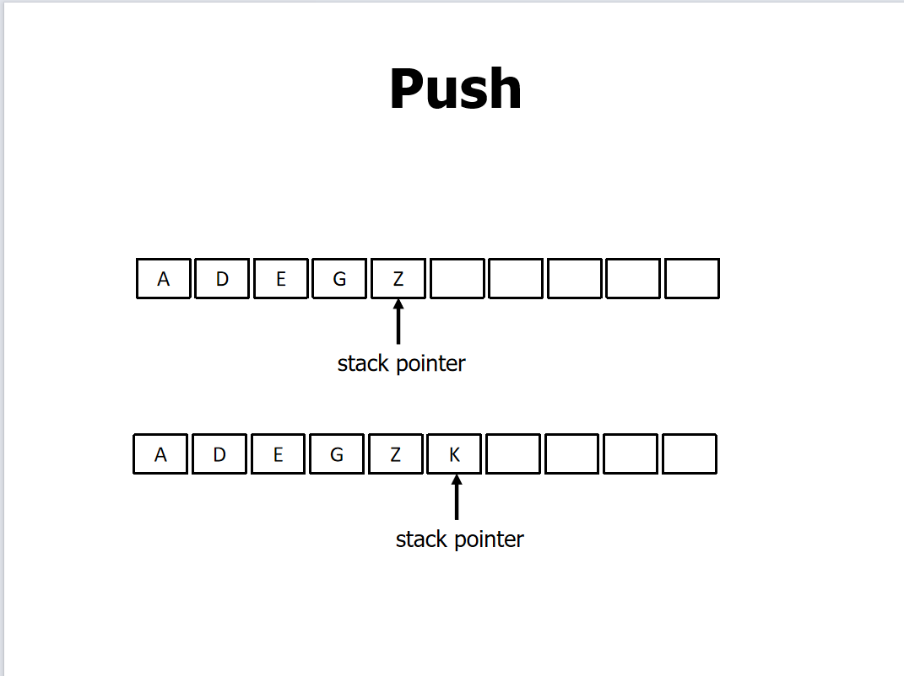
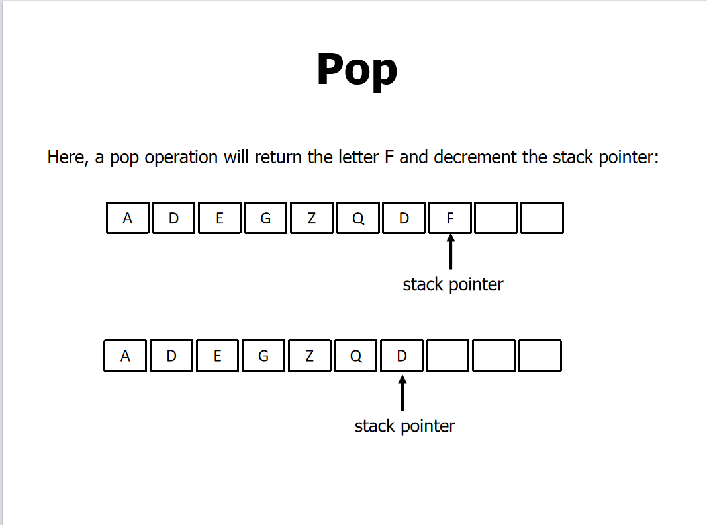
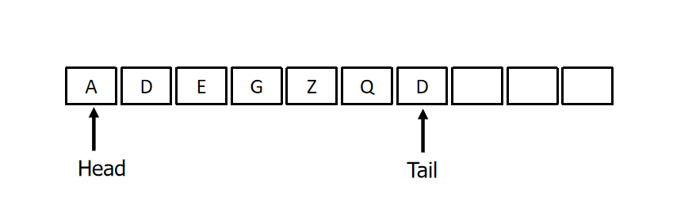
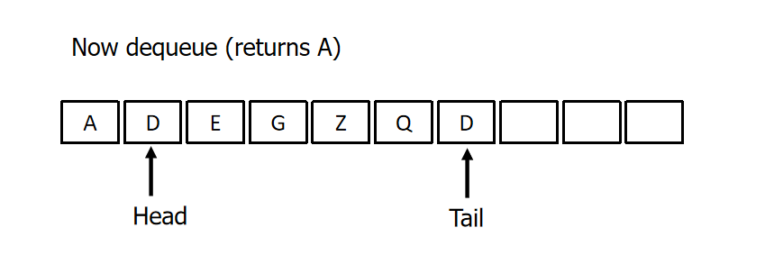
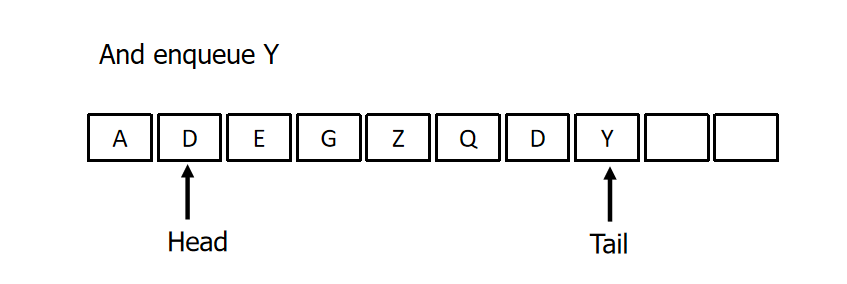

## week 04

### 1. BST 的查找，插入与删除

#### 循环的——查找插入删除

```python
class TreeNode:
    def __init__(self, val):
        self.val = val
        self.left = None
        self.right = None


class BST:
    def __init__(self):
        self.root = None

    def find(self, key):
        cur = self.root
        while cur != None:
            if cur.val == key:
                return cur
            elif cur.val > key:
                cur = cur.left
            else:
                cur = cur.right
        return False

    def insert(self, key):
        cur, pre = self.root, None
        while cur != None:
            if cur.val == key:
                return
            pre = cur
            if cur.val > key:
                cur = cur.left
            elif cur.val < key:
                cur = cur.right
        node = TreeNode(key)
        if pre.val > key:
            pre.left = node
        else:
            pre.right = node

    def delete(self, key):
        cur, pre = self.root, None
        while cur.val != key:
            if cur is None:
                return False
            pre = cur
            if cur.val > key:
                cur = cur.left
            else:
                cur = cur.right
        if cur.left is None or cur.right is None:
            child = cur.right or cur.left
            if pre.left == cur:
                pre.left = child
            else:
                pre.right = child
        else:
            replace_cur = self.find_min(cur)
            cur.val = replace_cur.val

    def find_min(self, node):
        if node is None:
            return None
        node = node.right
        while node.left is not None:
            node = node.left
        return node


if __name__ == '__main__':
    # 手动创建二叉搜索树
    bst = BST()
    bst.root = TreeNode(4)
    bst.root.left = TreeNode(2)
    bst.root.right = TreeNode(6)

    bst.root.left.left = TreeNode(1)
    bst.root.left.right = TreeNode(3)

    bst.root.right.left = TreeNode(5)
    bst.root.right.right = TreeNode(7)

    bst.insert(8)
    bst.delete(8)

    # 测试查找节点
    node = bst.find(8)
    if node:
        print(f"找到了节点，值为: {node.val}")  # 打印该节点的值
    else:
        print("未找到节点")
```


#### 递归的——查找插入删除

```python
class TreeNode:
    """二叉树节点类"""

    def __init__(self, val):
        self.val = val
        self.left = None
        self.right = None


class BST:
    def __init__(self):
        self.root = None


    def search(self, root, val):
        if root is None:
            return None
        if val < root.val:
            return self.search(root.left, val)
        elif val > root.val:
            return self.search(root.right, val)
        else:
            return root  # 这里是返回了该节点的地址，而不是值


    def insert(self, root, num):
        if root is None:
            return TreeNode(num)
        if num < root.val:
            root.left = self.insert(root.left, num)
        elif num > root.val:
            root.right = self.insert(root.right, num)
        return root

    def delete(self, root, key):
        if root is None:
            return root
        if key < root.val:
            root.left = self.delete(root.left, key)
        elif key > root.val:
            root.right = self.delete(root.right, key)
        else:
            if root.left is None and root.right is None:
                return None
            elif root.left:
                return root.left
            elif root.right:
                return root.right
            else:
                min_find_num = self.find_min(root.right)
                min_find_num.val = root.val
                root.right = self.delete(root.right, min_find_num)
                return root
    def find_min(self,root):
        current = root
        while current.left is not None:
            current = current.left
        return current


if __name__ == '__main__':
    bst = BST()
    bst.root = bst.insert(bst.root,6)
    bst.insert(bst.root, 3)
    bst.insert(bst.root, 9)
    bst.insert(bst.root, 1)
    bst.insert(bst.root, 2)
    bst.insert(bst.root, 7)

    bst.insert(bst.root, 10)
    bst.delete(bst.root, 5)

    # 测试查找节点
    node = bst.search(bst.root, 10)
    if node:
        print(f"找到了节点，值为: {node.val}") # 打印该节点的值
    else:
        print("未找到节点")
```


### 2. BST 的遍历

#### 2.1 Pre Order

```python
res = []
def preorder(root: TreeNode):
    if root is None:
        return
    res.append(root.val)
    if root.left is not None:
        preorder(root.left)
    if root.right:
        preorder(root.right)

preorder(n1)
print(res)
```

#### 2.2 In Order

```python
res = []
def inorder(root: TreeNode):
    if root is None:
        return
    if root.left is not None:
        inorder(root.left)
        res.append(root.val)
    if root.right:
        inorder(root.right)


inorder(n1)
print(res)
```


#### 2.3 Post Order

```python
res = []
def postorder(root: TreeNode):
    if root is None:
        return
    if root.left is not None:
        inorder(root.left)
    if root.right:
        inorder(root.right)
    res.append(root.val)


postorder(n1)
print(res)
```


### 3. 广度遍历和深度遍历

#### 3.1 广度遍历（BFS）


```python
class TreeNode:
    def __init__(self, val: int):
        self.val = val
        self.left = None
        self.right = None
n1 = TreeNode(val=1)
n2 = TreeNode(val=2)
n3 = TreeNode(val=3)
n4 = TreeNode(val=4)
n5 = TreeNode(val=5)
n6 = TreeNode(val=6)
n7 = TreeNode(val=7)
n1.left = n2
n1.right = n3
n2.left = n4
n2.right = n5
n3.left = n6
n3.right = n7

def level_order(root):
    queue = []
    if root is not None:
        queue.append(root)
    res = []

    while queue:
        node = queue.pop(0)
        res.append(node.val)
        if node.left:
            queue.append(node.left)
        if node.right:
            queue.append(node.right)
    return res

print(level_order(n1))
```

```python
class TreeNode:
    """二叉树节点类"""

    def __init__(self, val: int):
        self.val: int = val  # 节点值
        self.left: 'TreeNode' | None = None  # 左子节点引用
        self.right: 'TreeNode' | None = None  # 右子节点引用


n1 = TreeNode(val=1)
n2 = TreeNode(val=2)
n3 = TreeNode(val=3)
n4 = TreeNode(val=4)
n5 = TreeNode(val=5)
n6 = TreeNode(val=6)
n7 = TreeNode(val=7)
n1.left = n2
n1.right = n3
n2.left = n4
n2.right = n5
n3.left = n6
n3.right = n7


def level_order_recursive(root):
    res = []
    if root:
        level_helper([root], res)
    return res


def level_helper(queue, res):
    if not queue:
        return
    node = queue.pop(0)
    res.append(node.val)
    if node.left:
        queue.append(node.left)
    if node.right:
        queue.append(node.right)

    level_helper(queue, res)


print(level_order_recursive(n1))
```


#### 3.2 深度遍历（就是先中后序遍历）


### 5. Balanced and Unbalanced Trees 查找。无意义


### 6. AVL Trees

```python
class TreeNode:
    def __init__(self, val):
        self.height = 0
        self.val = val
        self.left = None
        self.right = None

    def get_height(self, node):
        if node is not None:
            return node.height
        return -1

    def update_height(self, node):
        return max([self.get_height(node.left), self.get_height(node.right)]) + 1

    def balance_factor(self, node):
        if node is None:
            return 0
        return self.get_height(node.left) - self.get_height(node.right)

    def right_rotation(self, node):
        child = node.left
        grand_child = child.right

        child.right = node
        node.left = grand_child
        self.update_height(child)
        self.update_height(node)
        return child
    def left_rotation(self, node):
        child =node.right
        grand_child = child.left

        child.left = node
        node.right = grand_child
        self.update_height(child)
        self.update_height(node)
        return child

    def roration(self, node):
        balance_factor = self.balance_factor(node)
        if balance_factor > 1:
            if self.balance_factor(node.left) >= 0:
                self.right_rotation(node)
            else:
                self.left_rotation(node.left)
                self.left_rotation(node)
        elif balance_factor < -1:
            if self.balance_factor(node.right) >= 0:
                self.left_rotation(node)
            else:
                self.right_rotation(node.left)
                self.left_rotation(node)
        return node

    def insert(self, val):
        self._root = self.insert_helper(self._root, val)

    def insert_helper(self, node, val):
        if node is None:
            return TreeNode(val)
        if val < node.val:
            node.left = self.insert_helper(node.left, val)
        elif val > node.val:
            node.right = self.insert_helper(node.right, val)
        else:
            return

        self.update_height(node)
        return node.rotation(node)

    def delete(self, val):
        self._root = self.delete_helper(self._root,val)

    def delete_helper(self, node, val):
        if node is None:
            return
        if val < node.val:
            node.left = self.delete_helper(node.left, val)
        elif val > node.val:
            node.right = self.delete_helper(node.right,val)
        else:
            if node.left is None or node.right is None:
                child = node.left or node.right
                if child is not None:
                    node = child
                else:
                    return None
            else:
                min_node = node.right
                while min_node.left is not None:
                    min_node = min_node.left
                node.val = min_node.val
                node.right = self.delete_helper(node.right, min_node.val)

        self.update_height(node)
        return node.rotation(node)

```


## week 05

### 1. Hashing


### 2. linked list

数组查找好，链表插入和删除好。

双向链表 ：DOUBLE LINKED LIST

循环链表：CIRCULAR  LIST

双向链表插入删除查找序号；值：

::: code-tabs

@tab 自己写的（逻辑不严密）

```python
class ListNode:
    def __init__(self, val):
        self.val = val
        self.next = None
        self.prev = None
        self.L.head = None
        self.L.tail = None

def insert(n0, p):
    if n0.next is None:
        n0.next = ListNode(p)
        p.prev = n0
    else:
        n0.next.prev = p
        p.next = n0.next
        n0.next = p
        p.prev = n0

def delete(p):
    if 

def access(head, index):
    for i in range(index):
        if head is None:
            return None
        else:
            head = head.next
    return head

def find_val(head, target):
    if head is None:
        return None
    index = 0
    while head is not None:
        if head.val == target:
            return index
        else:
            head = head.next
            index += 1

n0 = ListNode(1)
n1 = ListNode(2)
n2 = ListNode(3)
n0.next = n1
n1.prev = n0
n1.next = n2
n2.prev = n1

node = access(n0, 1)
print(f"列表 1 号位置的节点是{node.val}")
```

@tab 插入节点、删除节点

```python
class ListNode:
    def __init__(self, val):
        self.val = val
        self.next = None
        self.prev = None

class linkedList:
    def __init__(self):
        self._L = None
        self.head = None
        self.tail = None

    def insert(self, L, pre, p):
        if L.head is None:
            # 如果链表为空，初始化链表
            L.head = L.tail = p
            p.next = p.prev = None
        else:
            # 插入新节点 p 在 pre 后面
            p.next = pre.next
            pre.next = p
            p.prev = pre

            # 更新下一个节点的 prev 指针
            if p.next is not None:
                p.next.prev = p
            # 如果 pre 是尾节点，更新尾节点
            if L.tail == pre:
                L.tail = p

    def delete(self, L, p):
        if p.prev is not None:
            p.prev.next = p.next
        else:
            L.head = p.next
        if p.next is not None:
            p.next.prev = p.prev
        else:
            L.tail = p.prev
```

@tab 打印、头尾节点插入、删头结点

```python
class Node:
    def __init__(self, dataval):
        self.dataval = dataval
        self.nextval = None


class SLinkedList:
    def __init__(self):
        self.headval = None  # 初始化一个头结点（Initialize a head node）

    def listprint(self):
        printval = self.headval
        while printval is not None:
            print(printval.dataval)
            printval = printval.nextval

    # 在链表的开头插入新节点
    def AtBeginning(self, newdata):
        NewNode = Node(newdata)  # 创建新节点
        if self.headval is None:
            # 链表为空时，直接让 head 指向新节点
            self.headval = NewNode
        else:
            # 插入新节点到链表头部
            NewNode.nextval = self.headval
            self.headval = NewNode

    def AtEnd(self, newdata):
        NewNode = Node(newdata)
        if self.headval is None:
            self.headval = NewNode
            return
        else:
            last = self.headval
            while last.nextval:
                last = last.nextval
            last.nextval = NewNode

    def delete_head(self):
        # if linked list is empty nothing to delete
        if self.headval is None:
            return
            # Point at the head of the linked lisr
        start = self.headval
        # set the head of list as the second element
        self.headval = self.headval.nextval
        # delete the original head of the list
        del start

list = SLinkedList()
list.headval = Node("Mon")
e2 = Node("Tue")
e3 = Node("Thur")
e4 = Node("Fri")
e5 = Node("Sat")
list.headval.nextval = e2
e2.nextval = e3
e3.nextval = e4
e4.nextval = e5
list.AtEnd("Sun")
list.AtBeginning("Days")
list.listprint()
```

:::

### 3. Stacks

- 操作：入栈和出栈

- 堆栈指针：
    - 用来索引栈里的元素
    - 经常用在栈头部
    - 如果推送了一个元素，指针就会递增，该元素就会被添加到顶部。
    - 如果一个项目被弹出，指针将递减，该项目将返回给程序

::: tabs

@tab



@tab



:::

```python
class Stack(object):
    def __init__(self):
        self.stack = [0] * 100
        self.top = 0

    def push(self, val):
        # 检查栈是否已满，如果满了则扩容
        if self.top >= len(self.stack):
            self.stack = self.stack + [0] * len(self.stack)  # 将栈的长度翻倍
        # 插入元素到栈顶位置
        self.top += 1
        self.stack[self.top] = val

    def pop(self, val):
        if self.top == -1:
            raise IndexError("pop from empty stack")
        self.top -= 1
        return self.stack[self.top + 1]  # 这个是返回弹出的栈顶元素

    def peek(self):
        # 检查栈是否为空
        if self.top == -1:
            raise IndexError("peek from empty stack")
        return self.stack[self.top]

    def is_empty(self):
        # 判断栈是否为空
        return self.top == -1

    def size(self):
        # 返回栈中元素的数量
        return self.top + 1

    def capacity(self):
        # 返回栈的容量（数组长度）
        return len(self.stack)

    def print_stack(self):
        # 打印栈中的所有元素
        if self.is_empty():
            print("Stack is empty.")
        else:
            print("Stack elements:", self.stack[:self.top + 1])

stack = Stack()
stack.push(10)
stack.push(20)
stack.push(30)

print("栈顶元素:", stack.peek())  # 输出 30
print("栈大小:", stack.size())  # 输出 3

stack.pop(30)  # 弹出 30
print("弹出后的栈顶元素:", stack.peek())  # 输出 20

```


### 4. Queues

- **Head and tail:**
    - A queue needs two pointers - one to point to the item at the start (head) of the queue, and one to point at the end tail

::: tabs

@tab



@tab



@tab



:::

```python
class CircularQueue:
    def __init__(self, size):
        self.queue = [None] * size
        self.size = size
        self.head = 0
        self.tail = -1

    def enqueue(self, node):
        if (self.tail + 1) % self.size == self.head and self.queue[self.head] is not None:
            print("queue full")
            return
        self.tail = (self.tail + 1) % self.size
        self.queue[self.tail] = node


    def dequeue(self):
        if self.head == (self.tail + 1) % self.size and self.queue[self.head] is None:
            print("queue is empty")
            return

        value = self.queue[self.head]
        self.queue[self.head] = None
        self.head = (self.head + 1) % self.size
        return value

    def display(self):
        print("Queue:", self.queue)
        print(f"Head at index {self.head}, Tail at index {self.tail}")

q = CircularQueue(8)
q.enqueue('A')
q.enqueue('D')
q.enqueue('E')
q.enqueue('G')
q.enqueue('Z')
q.enqueue('Q')
q.enqueue('D')
q.enqueue('Y')
q.display()  # 输出队列内容及指针位置
print(q.dequeue())  # 输出：A
q.display()
```

**output**

```python
Queue: ['A', 'D', 'E', 'G', 'Z', 'Q', 'D', 'Y']
Head at index 0, Tail at index 7
A
Queue: [None, 'D', 'E', 'G', 'Z', 'Q', 'D', 'Y']
Head at index 1, Tail at index 7
```


### 5. Graphs

陌生英文单词：

- **vertices:** 顶点
- **incident：**附带的
- **adjacent = neighbours：**邻近的；靠近的

Items：

- undirected graph
- Vertex labelled graph：顶点标记图（顶点有属性，比如有颜色属性）
- Cyclic graph：有环图
- Acycic  graph：无环图
- weighted graph：带权图（边带权）
- connected or unconnected graph：（非）连通图
- Adjacency Matrix：邻接矩阵
- Adjacency List：邻接表

#### 5.1 图的添加、删除边和节点

```python
class GraphAdjMatrix:
    def __init__(self, vertices:list[int], edges: list[list[int]]):
        self.vertices: list[int] = []
        self.adj_mat: list[list[int]] = []
        for val in vertices:
            self.add_vertex(val)
        for e in edges:
            self.add_edge(e[0], e[1])

    def size(self) -> int:
        return len(self.vertices)

    def add_vertex(self, val: int):
        n = self.size()
        self.vertices.append(val)
        new_row = [0] * n
        self.adj_mat.append(new_row)
        for row in self.adj_mat:
            row.append(0)

    def remove_vertex(self, index: int):
        if index >= self.size() or index < 0:
            raise IndexError("Index out of the range")
        self.vertices.pop(index)
        self.adj_mat.pop(index)
        for row in self.adj_mat:
            row.pop(index)

    def add_edge(self, i:int, j:int):
        if i < 0 or j < 0 or i >= self.size() or j >= self.size():
            raise IndexError("index out of the range")
        if i == j:
            raise ValueError("Edges from vertex to itself are not allowed.")
        self.adj_mat[i][j] = 1
        self.adj_mat[j][i] = 1

    def remove_edge(self, i:int, j:int):
        if i < 0 or j < 0 or i >= self.size() or j >= self.size():
            raise IndexError("index out of the range")
        if i == j:
            raise ValueError("Deteling edge from vertex to itself is not allowed.")
        self.adj_mat[i][j] = 0
        self.adj_mat[j][i] = 0

    def print(self):
        print(f"vertices = ", self.vertices)
        print("Adjacency Matrix = ")
        self.print_matrix()

    def print_matrix(self):
        # 在顶点列表打印时，前面加一个空格
        print("  " + " ".join(map(str, self.vertices)))
        for i in range(self.size()):
            self.adj_mat[i].insert(0, self.vertices[i])

        for row in self.adj_mat:
            print(" ".join(map(str, row)))


if __name__ == '__main__':
    vertices = [1, 3, 2, 5, 4]
    edges = [[0, 1], [0, 3], [1, 2], [2, 3], [2, 4], [3, 4]]
    graph = GraphAdjMatrix(vertices, edges)

    # graph.add_edge(0, 2)
    # graph.remove_edge(0, 1)
    # graph.add_vertex(6)
    # graph.remove_vertex(1)
    graph.print()
```


#### 5.2 DFS

```python
    def dfs_recursive(self, start: int, visited: list[bool]):
        visited[start] = True
        print(self.vertices[start], end=' ')

        for neighbor, is_connected in enumerate(self.adj_mat[start]):
            if is_connected and not visited[neighbor]:
                self.dfs_recursive(neighbor, visited)

    def dfs(self, start_vertex: int):
        visited = [False] * self.size()
        start_index = self.vertices.index(start_vertex)
        self.dfs_recursive(start_index, visited)
        print()
```


测试代码：

```python
def test_graph_adjmat_dfs():
    print("=== 测试1：简单图 ===")
    # 创建图
    vertices = [0, 1, 2, 3, 4]
    edges = [[0, 1], [0, 2], [1, 3], [2, 4]]
    graph = GraphAdjMat(vertices, edges)
    graph.print()  # 打印邻接矩阵
    print("DFS 从顶点 0 开始：")
    graph.dfs(0)   # 从顶点 0 开始进行 DFS 遍历，预期输出 0 1 3 2 4

    print("\n=== 测试2：环形图 ===")
    # 创建一个环形图
    vertices = [0, 1, 2, 3]
    edges = [[0, 1], [1, 2], [2, 3], [3, 0]]
    graph = GraphAdjMat(vertices, edges)
    graph.print()  # 打印邻接矩阵
    print("DFS 从顶点 0 开始：")
    graph.dfs(0)   # 从顶点 0 开始进行 DFS 遍历，预期输出 0 1 2 3

    print("\n=== 测试3：不连通图 ===")
    # 创建不连通的图
    vertices = [0, 1, 2, 3, 4]
    edges = [[0, 1], [2, 3]]
    graph = GraphAdjMat(vertices, edges)
    graph.print()  # 打印邻接矩阵
    print("DFS 从顶点 0 开始：")
    graph.dfs(0)   # 从顶点 0 开始进行 DFS 遍历，预期输出 0 1
    print("DFS 从顶点 2 开始：")
    graph.dfs(2)   # 从顶点 2 开始进行 DFS 遍历，预期输出 2 3

    print("\n=== 测试4：单一顶点 ===")
    # 创建只有一个顶点的图
    vertices = [0]
    edges = []
    graph = GraphAdjMat(vertices, edges)
    graph.print()  # 打印邻接矩阵
    print("DFS 从顶点 0 开始：")
    graph.dfs(0)   # 从顶点 0 开始进行 DFS 遍历，预期输出 0
```


#### 5.3 BFS

```python
    def bfs(self, start_vertex: int):
        start_index = self.vertices.index(start_vertex)
        queue = [start_index]
        visited = [False] * self.size()
        visited[start_index] = True
        while queue:
            vertex = queue.pop(0)
            print(self.vertices[vertex], end=' ')
            for neighbor, is_connected in enumerate(self.adj_mat[vertex]):
                if not visited[neighbor] and is_connected:
                    visited[neighbor] = True
                    queue.append(neighbor)
        print()
```

