## 1. 二叉树基本信息

二叉树（Binary Tree）是一种非线性数据结构，代表“祖先”和“后代”的派生关系，体现了“一分为二”的分治逻辑。与链表类似，二叉树的基本单元是节点，每个节点包含值，左子结点引用和右子节点引用。

```python
class TreeNode:
    def __init__(self, val:int):
        self.val = val   # 节点值
        self.left = None   # 左子节点
        self.right = None  # 右子节点
```

每个节点都有两个引用（指针）。分别指向左子结点（left-child node）和右子节点（right-child node），该节点被称为这两个子节点的父节点（parent node）。当给定一个二叉树的节点时，我们将该节点的左子结点及其以下节点形成的数称为该节点的左子树（left-subtree），同理可得右子树（right-subtree)。

在二叉树中，除叶节点外，其他所有节点都包含子节点和非空子树。如图所示，如果讲“节点2”视作父节点，则其左子节点和右子节点分别是“节点4”和“节点5”，左子树是“节点4及其以下节点形成的树”，右子树是“节点5及其以下节点形成的树”。

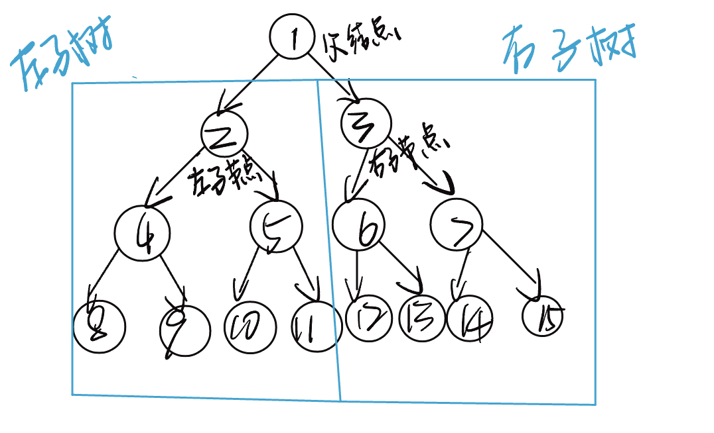

常用术语：

- 根结点（root node）：位于二叉树顶层的节点，没有父节点。
- 叶节点（leaf node）：没有子节点的节点，其两个指针均指向 `None`
- 边（edge）：连接两个节点的线段，即节点引用（指针）。
- 节点所在的层（level）：从顶至底递增，根结点所在层为 1.
- 二叉树的高度（height）：从根节点到最远叶节点所经过的边的数量。
- 节点的度（degree）：节点的子节点的数量，在二叉树中，度的取值范围是0、1、2。
- 节点的深度（depth）：从根结点到该节点所经历边的数量。
- 节点的高度（height）：从距离该节点最远的叶节点到该节点所经过的边的数量。

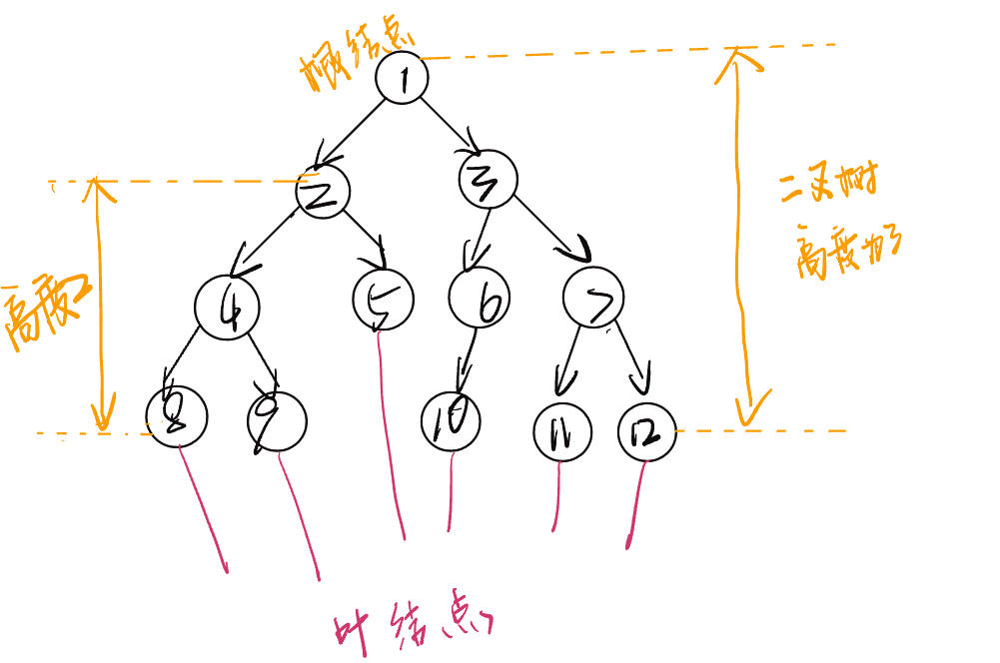

::: warning

请注意，我们通常将“高度”和“深度”定义为“经过的边的数量”，但有些题目或教材可能会将其定义为“经过的节点的数量”。在这种情况下，高度和深度都需要加 1 。

:::


## 2. 二叉树基本操作

### 2.1 初始化二叉树

与链表类似，首先初始化节点。

```python
class TreeNode:
    def __init__(self, val: int):
        self.val = val  # 节点值
        self.left = None  # 左子节点
        self.right = None  # 右子节点


n1 = TreeNode(val=1)
n2 = TreeNode(val=2)
n3 = TreeNode(val=3)
n4 = TreeNode(val=4)
n5 = TreeNode(val=5)
n1.left = n2
n1.right = n3
n2.left = n4
n2.right = n5
```

<iframe width="800" height="500" frameborder="0" src="https://pythontutor.com/iframe-embed.html#code=class%20TreeNode%3A%0A%20%20%20%20def%20__init__%28self,%20val%3A%20int%29%3A%0A%20%20%20%20%20%20%20%20self.val%20%3D%20val%20%20%23%20%E8%8A%82%E7%82%B9%E5%80%BC%0A%20%20%20%20%20%20%20%20self.left%20%3D%20None%20%20%23%20%E5%B7%A6%E5%AD%90%E8%8A%82%E7%82%B9%0A%20%20%20%20%20%20%20%20self.right%20%3D%20None%20%20%23%20%E5%8F%B3%E5%AD%90%E8%8A%82%E7%82%B9%0A%0A%0An1%20%3D%20TreeNode%28val%3D1%29%0An2%20%3D%20TreeNode%28val%3D2%29%0An3%20%3D%20TreeNode%28val%3D3%29%0An4%20%3D%20TreeNode%28val%3D4%29%0An5%20%3D%20TreeNode%28val%3D5%29%0An1.left%20%3D%20n2%0An1.right%20%3D%20n3%0An2.left%20%3D%20n4%0An2.right%20%3D%20n5&codeDivHeight=400&codeDivWidth=350&cumulative=false&curInstr=35&heapPrimitives=nevernest&origin=opt-frontend.js&py=3&rawInputLstJSON=%5B%5D&textReferences=false"> </iframe>


由 [](https://pythontutor.com) 可知以上代码的运行逻辑，即先建立所有节点的子节点并初始化为None，再把相应的子节点一一对应放入。


### 2.2 插入与删除节点

与链表类似，在二叉树中插入与删除节点可以通过修改指针来实现。

1. 下图示意的是插入节点的过程。

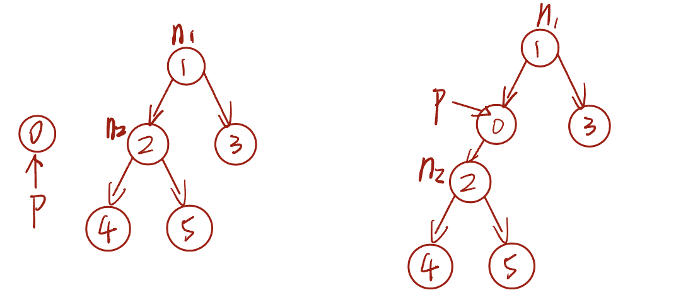

插入节点的代码：

```python
class TreeNode:
    def __init__(self, val: int):
        self.val = val  # 节点值
        self.left = None  # 左子节点
        self.right = None  # 右子节点


n1 = TreeNode(val=1)
n2 = TreeNode(val=2)
n3 = TreeNode(val=3)
n4 = TreeNode(val=4)
n5 = TreeNode(val=5)
p = TreeNode(val=0)
n1.left = n1
n1.right = n3
n2.left = n4
n2.right = n5
n1.left = p
p.left = n2
```

去掉刚刚添加的节点？

```python
class TreeNode:
    def __init__(self, val: int):
        self.val = val  # 节点值
        self.left = None  # 左子节点
        self.right = None  # 右子节点


n1 = TreeNode(val=1)
n2 = TreeNode(val=2)
n3 = TreeNode(val=3)
n4 = TreeNode(val=4)
n5 = TreeNode(val=5)
p = TreeNode(val=0)
n1.left = n1
n1.right = n3
n2.left = n4
n2.right = n5

n1.left = p
p.left = n2

n1.left = n2
```


可视化输出二叉树：

::: tabs

@tab 原二叉树

```python
class TreeNode:
    """二叉树节点类"""
    def __init__(self, val: int):
        self.val: int = val                # 节点值
        self.left: 'TreeNode' | None = None  # 左子节点引用
        self.right: 'TreeNode' | None = None # 右子节点引用

def display(root):
    """打印二叉树为字符树"""
    lines, *_ = _display_aux(root)
    for line in lines:
        print(line)

def _display_aux(node):
    """返回包含当前子树所有行的列表，以及子树宽度、高度和水平坐标"""
    if node is None:
        return [" "], 0, 0, 0

    line = f'{node.val}'
    width = len(line)
    height = 1
    middle = width // 2

    # 只有左子树
    if node.left and not node.right:
        l_lines, l_width, l_height, l_middle = _display_aux(node.left)
        first_line = ' ' * (l_middle + 1) + '_' * (l_width - l_middle - 1) + line
        second_line = ' ' * l_middle + '/' + ' ' * (l_width - l_middle - 1 + width)
        shifted_lines = [line + ' ' * width for line in l_lines]
        return [first_line, second_line] + shifted_lines, l_width + width, l_height + 2, l_width + width // 2

    # 只有右子树
    if not node.left and node.right:
        r_lines, r_width, r_height, r_middle = _display_aux(node.right)
        first_line = line + '_' * r_middle + ' ' * (r_width - r_middle)
        second_line = ' ' * (width + r_middle) + '\\' + ' ' * (r_width - r_middle - 1)
        shifted_lines = [' ' * width + line for line in r_lines]
        return [first_line, second_line] + shifted_lines, width + r_width, r_height + 2, width // 2

    # 同时有左右子树
    if node.left and node.right:
        l_lines, l_width, l_height, l_middle = _display_aux(node.left)
        r_lines, r_width, r_height, r_middle = _display_aux(node.right)
        first_line = ' ' * (l_middle + 1) + '_' * (l_width - l_middle - 1) + line + '_' * r_middle + ' ' * (r_width - r_middle)
        second_line = ' ' * l_middle + '/' + ' ' * (l_width - l_middle - 1 + width + r_middle) + '\\' + ' ' * (r_width - r_middle - 1)
        # 对齐高度
        if l_height < r_height:
            l_lines += [' ' * l_width] * (r_height - l_height)
        elif r_height < l_height:
            r_lines += [' ' * r_width] * (l_height - r_height)
        merged_lines = [a + ' ' * width + b for a, b in zip(l_lines, r_lines)]
        return [first_line, second_line] + merged_lines, l_width + width + r_width, max(l_height, r_height) + 2, l_width + width // 2

    # 叶子节点
    return [line], width, height, middle

# 示例：创建二叉树并打印
root = TreeNode(1)
root.left = TreeNode(2)
root.right = TreeNode(3)
root.left.left = TreeNode(4)
root.left.right = TreeNode(5)
root.right.right = TreeNode(6)

display(root)
```

/ output

```python
  _1 
 /  \
 2  3
/ \  
4 5 
```


@tab 二叉树添加节点p后

```python
class TreeNode:
    """二叉树节点类"""
    def __init__(self, val: int):
        self.val: int = val                # 节点值
        self.left: 'TreeNode' | None = None  # 左子节点引用
        self.right: 'TreeNode' | None = None # 右子节点引用

def display(root):
    """打印二叉树为字符树"""
    lines, *_ = _display_aux(root)
    for line in lines:
        print(line)

def _display_aux(node):
    """返回包含当前子树所有行的列表，以及子树宽度、高度和水平坐标"""
    if node is None:
        return [" "], 0, 0, 0

    line = f'{node.val}'
    width = len(line)
    height = 1
    middle = width // 2

    # 只有左子树
    if node.left and not node.right:
        l_lines, l_width, l_height, l_middle = _display_aux(node.left)
        first_line = ' ' * (l_middle + 1) + '_' * (l_width - l_middle - 1) + line
        second_line = ' ' * l_middle + '/' + ' ' * (l_width - l_middle - 1 + width)
        shifted_lines = [line + ' ' * width for line in l_lines]
        return [first_line, second_line] + shifted_lines, l_width + width, l_height + 2, l_width + width // 2

    # 只有右子树
    if not node.left and node.right:
        r_lines, r_width, r_height, r_middle = _display_aux(node.right)
        first_line = line + '_' * r_middle + ' ' * (r_width - r_middle)
        second_line = ' ' * (width + r_middle) + '\\' + ' ' * (r_width - r_middle - 1)
        shifted_lines = [' ' * width + line for line in r_lines]
        return [first_line, second_line] + shifted_lines, width + r_width, r_height + 2, width // 2

    # 同时有左右子树
    if node.left and node.right:
        l_lines, l_width, l_height, l_middle = _display_aux(node.left)
        r_lines, r_width, r_height, r_middle = _display_aux(node.right)
        first_line = ' ' * (l_middle + 1) + '_' * (l_width - l_middle - 1) + line + '_' * r_middle + ' ' * (r_width - r_middle)
        second_line = ' ' * l_middle + '/' + ' ' * (l_width - l_middle - 1 + width + r_middle) + '\\' + ' ' * (r_width - r_middle - 1)
        # 对齐高度
        if l_height < r_height:
            l_lines += [' ' * l_width] * (r_height - l_height)
        elif r_height < l_height:
            r_lines += [' ' * r_width] * (l_height - r_height)
        merged_lines = [a + ' ' * width + b for a, b in zip(l_lines, r_lines)]
        return [first_line, second_line] + merged_lines, l_width + width + r_width, max(l_height, r_height) + 2, l_width + width // 2

    # 叶子节点
    return [line], width, height, middle

# 示例：创建二叉树并打印
# root = TreeNode(1)
# root.left = TreeNode(2)
# root.right = TreeNode(3)
# root.left.left = TreeNode(4)
# root.left.right = TreeNode(5)
# root.right.right = TreeNode(6)

n1 = TreeNode(val=1)
n2 = TreeNode(val=2)
n3 = TreeNode(val=3)
n4 = TreeNode(val=4)
n5 = TreeNode(val=5)
p = TreeNode(val=0)
n1.left = n1
n1.right = n3
n2.left = n4
n2.right = n5
n1.left = p
p.left = n2

display(n1)
```

/ output

```python
    1 
   / \
  _0 3
 /    
 2    
/ \   
4 5   
```


@tab 二叉树再删除节点p

```python
class TreeNode:
    """二叉树节点类"""
    def __init__(self, val: int):
        self.val: int = val                # 节点值
        self.left: 'TreeNode' | None = None  # 左子节点引用
        self.right: 'TreeNode' | None = None # 右子节点引用

def display(root):
    """打印二叉树为字符树"""
    lines, *_ = _display_aux(root)
    for line in lines:
        print(line)

def _display_aux(node):
    """返回包含当前子树所有行的列表，以及子树宽度、高度和水平坐标"""
    if node is None:
        return [" "], 0, 0, 0

    line = f'{node.val}'
    width = len(line)
    height = 1
    middle = width // 2

    # 只有左子树
    if node.left and not node.right:
        l_lines, l_width, l_height, l_middle = _display_aux(node.left)
        first_line = ' ' * (l_middle + 1) + '_' * (l_width - l_middle - 1) + line
        second_line = ' ' * l_middle + '/' + ' ' * (l_width - l_middle - 1 + width)
        shifted_lines = [line + ' ' * width for line in l_lines]
        return [first_line, second_line] + shifted_lines, l_width + width, l_height + 2, l_width + width // 2

    # 只有右子树
    if not node.left and node.right:
        r_lines, r_width, r_height, r_middle = _display_aux(node.right)
        first_line = line + '_' * r_middle + ' ' * (r_width - r_middle)
        second_line = ' ' * (width + r_middle) + '\\' + ' ' * (r_width - r_middle - 1)
        shifted_lines = [' ' * width + line for line in r_lines]
        return [first_line, second_line] + shifted_lines, width + r_width, r_height + 2, width // 2

    # 同时有左右子树
    if node.left and node.right:
        l_lines, l_width, l_height, l_middle = _display_aux(node.left)
        r_lines, r_width, r_height, r_middle = _display_aux(node.right)
        first_line = ' ' * (l_middle + 1) + '_' * (l_width - l_middle - 1) + line + '_' * r_middle + ' ' * (r_width - r_middle)
        second_line = ' ' * l_middle + '/' + ' ' * (l_width - l_middle - 1 + width + r_middle) + '\\' + ' ' * (r_width - r_middle - 1)
        # 对齐高度
        if l_height < r_height:
            l_lines += [' ' * l_width] * (r_height - l_height)
        elif r_height < l_height:
            r_lines += [' ' * r_width] * (l_height - r_height)
        merged_lines = [a + ' ' * width + b for a, b in zip(l_lines, r_lines)]
        return [first_line, second_line] + merged_lines, l_width + width + r_width, max(l_height, r_height) + 2, l_width + width // 2

    # 叶子节点
    return [line], width, height, middle

# 示例：创建二叉树并打印
# root = TreeNode(1)
# root.left = TreeNode(2)
# root.right = TreeNode(3)
# root.left.left = TreeNode(4)
# root.left.right = TreeNode(5)
# root.right.right = TreeNode(6)

n1 = TreeNode(val=1)
n2 = TreeNode(val=2)
n3 = TreeNode(val=3)
n4 = TreeNode(val=4)
n5 = TreeNode(val=5)
p = TreeNode(val=0)
n1.left = n1
n1.right = n3
n2.left = n4
n2.right = n5
n1.left = p
p.left = n2
n1.left = n2

display(n1)
```

/ output

```python
  _1 
 /  \
 2  3
/ \  
4 5 
```

:::


::: info

需要注意的是，插入节点可能会改变二叉树的原有逻辑结构，而删除节点通常意味着删除该节点及其所有子树。因此，在二叉树中，插入与删除通常是由一套操作配合完成的，以实现有实际意义的操作。

:::


## 3. 常见二叉树类型

### 3.1 完美二叉树

完美二叉树(perfect binary tree)所有层的节点都被完全填满。在完美二叉树中，叶节点的度为0，其余所有节点的度都为2；若树的高度为h，则总节点数为$2^{h+1} - 1$，呈现标准的指数级关系，反映了自然界中常见的细胞分裂现象。

::: tips

请注意，在中文社区中，完美二叉树又可以称为满二叉树

:::

### 3.2 完全二叉树

完全二叉树（complete binary tree）只有最底层的节点未被填满，且最底层节点尽量靠左填充。

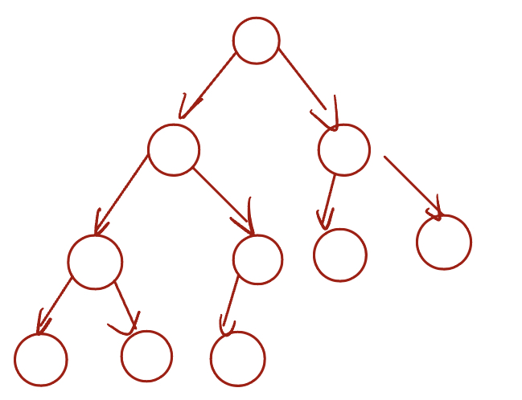

### 3.3 完满二叉树

完满二叉树（full binary tree）除了叶节点之外，其余所有节点都有两个子节点。

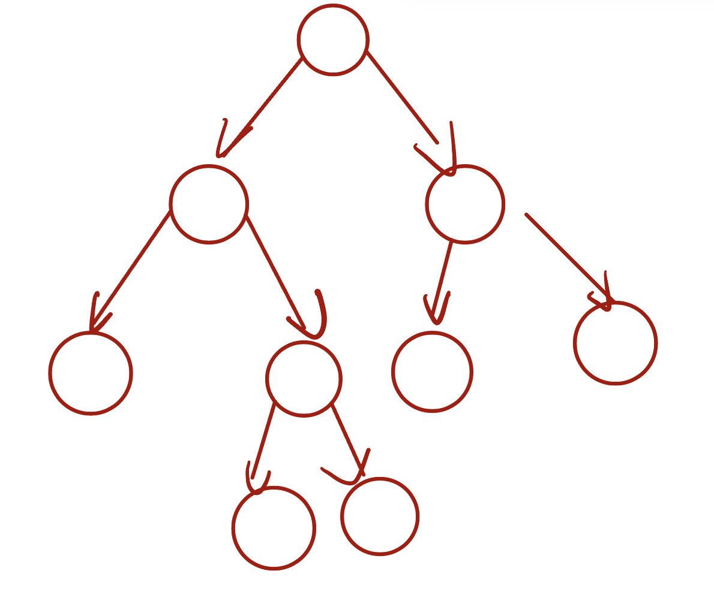

### 3.4 平衡二叉树

平衡二叉树（balanced binary tree）中任意节点的左子树和右子树的高度差的绝对值不超过1。

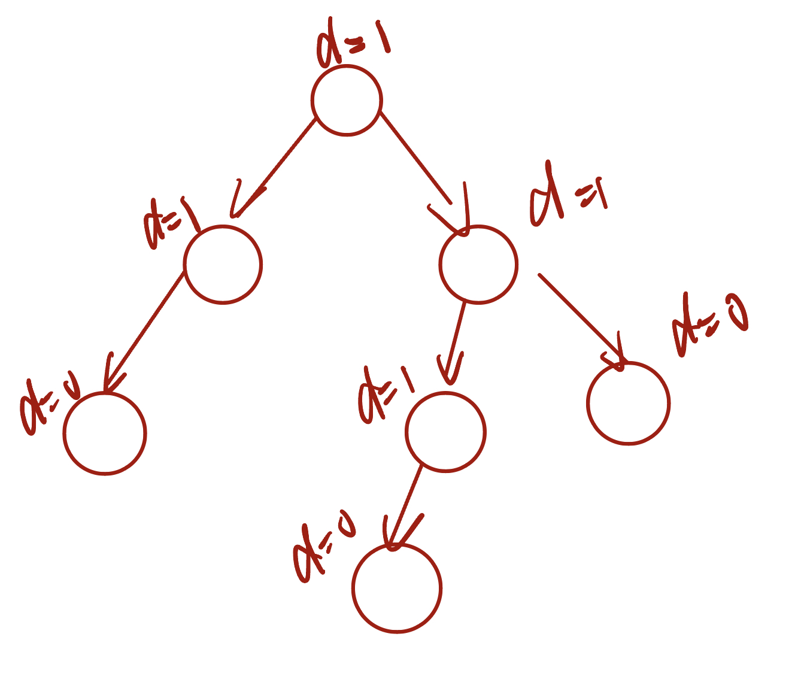

### 3.5 二叉树退化

当二叉树的每层节点都被填满时，达到“完美二叉树”；当所有节点都偏向一侧时，二叉树退化为“链表”。

- 完美二叉树是理想情况，可以充分发挥二叉树“分治”的优势。
- 链表则是另一个极端，所有操作都变为线性操作，时间复杂度退化至 O(n)。

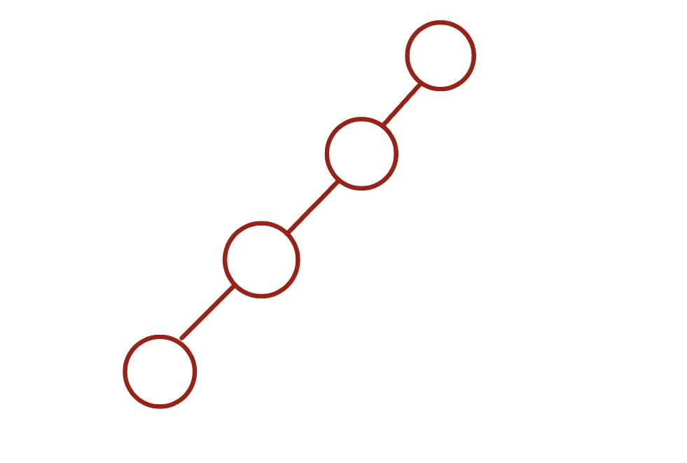


::: details

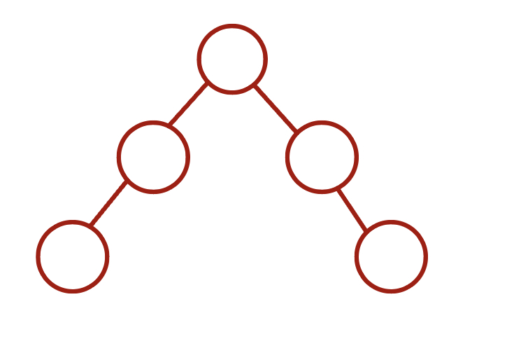

——chatgpt:

是的，您所上传的图片确实是一个二叉树的形式，虽然从它的结构上看更像是个“退化”的形式。通常情况下，如果二叉树的某些节点只有一个子节点（左子节点或者右子节点），而另一个子节点为空，这样的二叉树被称为“退化二叉树”（或“病态二叉树”）。这会使得树的形状接近于一条线，而不是理想的完全平衡的形状。

从图片来看，这个树的结构比较简洁，每个节点只有一个或者两个子节点，但并没有形成完全的平衡形状。如果这表示一种数据结构，通常会导致某些操作的效率下降，如查找、插入等。

如果您有更多关于二叉树结构的问题，或者需要分析具体的二叉树实现，欢迎进一步探讨。

不完全是一个退化二叉树。

:::


::: center

表7-1 二叉树的最佳结构和最差结构

:::

|                             | 完美二叉树         | 链表    |
| --------------------------- | ------------------ | ------- |
| 第 $i$ 层的节点数量         | $2^{i-1}$          | $1$     |
| 高度为 $h$ 的树的叶节点数量 | $2^h$              | $1$     |
| 高度为 $h$ 的树的节点总数   | $2^{h+1} - 1$      | $h + 1$ |
| 节点总数为 $n$ 的树的高度   | $\log_2 (n+1) - 1$ | $n - 1$ |


## 4. 二叉树的遍历

### 4.1 广度优先遍历 （BFS）

::: tabs 非递归

@tab 引入队列的实现：

```python
from collections import deque
class TreeNode:
    """二叉树节点类"""
    def __init__(self, val: int):
        self.val: int = val                # 节点值
        self.left: 'TreeNode' | None = None  # 左子节点引用
        self.right: 'TreeNode' | None = None # 右子节点引用

n1 = TreeNode(val=1)
n2 = TreeNode(val=2)
n3 = TreeNode(val=3)
n4 = TreeNode(val=4)
n5 = TreeNode(val=5)
n6 = TreeNode(val=6)
n7 = TreeNode(val=7)
n1.left = n2
n1.right = n3
n2.left = n4
n2.right = n5
n3.left = n6
n3.right = n7

def level_order(root):
    queue = deque()
    queue.append(root)
    res = []
    while queue:
        node = queue.popleft()
        res.append(node.val)
        if node.left is not None:
            queue.append(node.left)
        if node.right is not None:
            queue.append(node.right)
    return res

level_order(n1)
```

@tab 不用队列，但逻辑相同 (自己方法)

```python

class TreeNode:
    """二叉树节点类"""
    def __init__(self, val: int):
        self.val: int = val                # 节点值
        self.left: 'TreeNode' | None = None  # 左子节点引用
        self.right: 'TreeNode' | None = None # 右子节点引用

n1 = TreeNode(val=1)
n2 = TreeNode(val=2)
n3 = TreeNode(val=3)
n4 = TreeNode(val=4)
n5 = TreeNode(val=5)
n6 = TreeNode(val=6)
n7 = TreeNode(val=7)
n1.left = n2
n1.right = n3
n2.left = n4
n2.right = n5
n3.left = n6
n3.right = n7


def printtree(root):
    queue = []
    queue.append(root)
    res = []
    while queue:
        length = len(queue)
        for i in range(length):
            node = queue[i]
            res.append(node.val)
            if node.left is not None:
                queue.append(node.left)
            if node.right is not None:
                queue.append(node.right)
        queue = queue[length:]
        
    return res

printtree(n1)
```

@tab 优化后

```python
class TreeNode:
    """二叉树节点类"""
    def __init__(self, val: int):
        self.val: int = val                # 节点值
        self.left: 'TreeNode' | None = None  # 左子节点引用
        self.right: 'TreeNode' | None = None # 右子节点引用

n1 = TreeNode(val=1)
n2 = TreeNode(val=2)
n3 = TreeNode(val=3)
n4 = TreeNode(val=4)
n5 = TreeNode(val=5)
n6 = TreeNode(val=6)
n7 = TreeNode(val=7)
n1.left = n2
n1.right = n3
n2.left = n4
n2.right = n5
n3.left = n6
n3.right = n7

def level_order(root):
    queue = []
    if root is not None:
        queue.append(root)
    res = []

    while queue:
        node = queue.pop(0)
        res.append(node)
        if node.left is not None:
            queue.append(node.left)
        if node.right is not None:
            queue.append(node.right)
    return res

level_order(n1)
```

:::


::: tabs  递归方法：

@tab 自己方法

```python
class TreeNode:
    """二叉树节点类"""
    def __init__(self, val: int):
        self.val: int = val                # 节点值
        self.left: 'TreeNode' | None = None  # 左子节点引用
        self.right: 'TreeNode' | None = None # 右子节点引用

n1 = TreeNode(val=1)
n2 = TreeNode(val=2)
n3 = TreeNode(val=3)
n4 = TreeNode(val=4)
n5 = TreeNode(val=5)
n6 = TreeNode(val=6)
n7 = TreeNode(val=7)
n1.left = n2
n1.right = n3
n2.left = n4
n2.right = n5
n3.left = n6
n3.right = n7
res = []
def level_order(root):
    if not res:
        res.append(root.val)
    if root.left:
        res.append(root.left.val)
    if root.right:
        res.append(root.right.val)
    if root.left is not None:
        level_order(root.left)
    if root.right is not None:
        level_order(root.right)

level_order(n1)
print(res)
```

@tab

```python
class TreeNode:
    """二叉树节点类"""
    def __init__(self, val: int):
        self.val: int = val                # 节点值
        self.left: 'TreeNode' | None = None  # 左子节点引用
        self.right: 'TreeNode' | None = None # 右子节点引用

n1 = TreeNode(val=1)
n2 = TreeNode(val=2)
n3 = TreeNode(val=3)
n4 = TreeNode(val=4)
n5 = TreeNode(val=5)
n6 = TreeNode(val=6)
n7 = TreeNode(val=7)
n1.left = n2
n1.right = n3
n2.left = n4
n2.right = n5
n3.left = n6
n3.right = n7
res = []
def level_order_recursive(root):
    res = []
    if root:
        level_helper([root], res)
    return res

def level_helper(queue, res):
    if not queue:
        return
    node = queue.pop(0)
    res.append(node.val)
    if node.left:
        queue.append(node.left)
    if node.right:
        queue.append(node.right)
        
    level_helper(queue, res)
        
level_order_recursive()

```


### 4.2 深度优先遍历（DFS）

#### 4.2.1 pre order

```python
class TreeNode:
    """二叉树节点类"""
    def __init__(self, val: int):
        self.val: int = val                # 节点值
        self.left: 'TreeNode' | None = None  # 左子节点引用
        self.right: 'TreeNode' | None = None # 右子节点引用

n1 = TreeNode(val=1)
n2 = TreeNode(val=2)
n3 = TreeNode(val=3)
n4 = TreeNode(val=4)
n5 = TreeNode(val=5)
n6 = TreeNode(val=6)
n7 = TreeNode(val=7)
n1.left = n2
n1.right = n3
n2.left = n4
n2.right = n5
n3.left = n6
n3.right = n7

res = []
def pre_order(root):
    if root is None:
        return
    res.append(root.val)
    if root.left is not None:
        pre_order(root.left)
    if root.right is not None:
        pre_order(root.right)

pre_order(n1)
print(res)
```


#### 4.2.2 In Order

```python
class TreeNode:
    """二叉树节点类"""
    def __init__(self, val: int):
        self.val: int = val                # 节点值
        self.left: 'TreeNode' | None = None  # 左子节点引用
        self.right: 'TreeNode' | None = None # 右子节点引用

n1 = TreeNode(val=1)
n2 = TreeNode(val=2)
n3 = TreeNode(val=3)
n4 = TreeNode(val=4)
n5 = TreeNode(val=5)
n6 = TreeNode(val=6)
n7 = TreeNode(val=7)
n1.left = n2
n1.right = n3
n2.left = n4
n2.right = n5
n3.left = n6
n3.right = n7

res = []
def in_order(root):
    if root is None:
        return
    
    if root.left is not None:
        in_order(root.left)
    res.append(root.val)
    if root.right is not None:
        in_order(root.right)

in_order(n1)
print(res)
```


#### 4.2.3 Post Order

```python
class TreeNode:
    """二叉树节点类"""
    def __init__(self, val: int):
        self.val: int = val                # 节点值
        self.left: 'TreeNode' | None = None  # 左子节点引用
        self.right: 'TreeNode' | None = None # 右子节点引用

n1 = TreeNode(val=1)
n2 = TreeNode(val=2)
n3 = TreeNode(val=3)
n4 = TreeNode(val=4)
n5 = TreeNode(val=5)
n6 = TreeNode(val=6)
n7 = TreeNode(val=7)
n1.left = n2
n1.right = n3
n2.left = n4
n2.right = n5
n3.left = n6
n3.right = n7

res = []
def post_order(root):
    if root is None:
        return
    
    if root.left is not None:
        post_order(root.left)
    
    if root.right is not None:
        post_order(root.right)
        
    res.append(root.val)

post_order(n1)
print(res)
```


## 5. 二叉树的数组表示

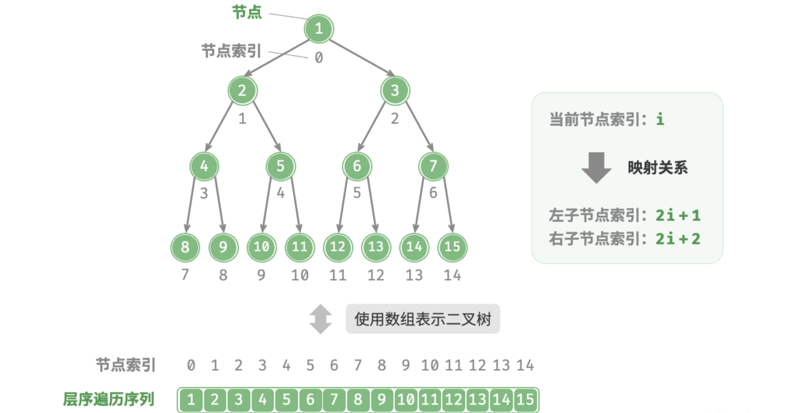


### 5.1 用二叉树的数组表示实现 BFS DFS

```python
class TreeNode:
    """二叉树节点类"""
    def __init__(self, val):
        self.val = val
        self.left = None
        self.right = None

class ArrayBinaryTree:
    """数组表示下的二叉树类"""

    def __init__(self, arr: list[int | None]):
        """构造方法"""
        self._tree = list(arr)

    def size(self):
        """列表容量"""
        return len(self._tree)

    def val(self, i: int) -> int:
        """获取索引为 i 节点的值"""
        if i < 0 or i >= self.size():
            return None
        return self._tree[i]

    def left(self, i: int) -> int | None:
        """获取左子节点的索引"""
        return 2 * i + 1

    def right(self, i: int) -> int | None:
        """获取右子节点的索引"""
        return 2 * i + 2

    def parent(self, i: int) -> int | None:
        """获取父节点的索引"""
        return (i - 1) // 2

    def level_order(self) -> list[int]:
        """层序遍历"""
        self.res = []
        # 直接遍历数组
        for i in range(self.size()):
            if self.val(i) is not None:
                self.res.append(self.val(i))
        return self.res

    def dfs(self, i: int, order: str):
        """深度优先遍历"""
        if self.val(i) is None:
            return
        # 前序遍历
        if order == "pre":
            self.res.append(self.val(i))
        self.dfs(self.left(i), order)
        # 中序遍历
        if order == "in":
            self.res.append(self.val(i))
        self.dfs(self.right(i), order)
        # 后序遍历
        if order == "post":
            self.res.append(self.val(i))

    def pre_order(self) -> list[int]:
        """前序遍历"""
        self.res = []
        self.dfs(0, order="pre")
        return self.res

    def in_order(self) -> list[int]:
        """中序遍历"""
        self.res = []
        self.dfs(0, order="in")
        return self.res

    def post_order(self) -> list[int]:
        """后序遍历"""
        self.res = []
        self.dfs(0, order="post")
        return self.res
```

测试代码：

```python
"""Driver Code"""
if __name__ == "__main__":
    # 初始化二叉树
    arr = [1, 2, 3, 4, None, 6, None]
    abt = ArrayBinaryTree(arr)

    # 访问节点
    i = 1
    l, r, p = abt.left(i), abt.right(i), abt.parent(i)

    # 遍历树
    res = abt.level_order()
    res = abt.pre_order()
    res = abt.in_order()
    res = abt.post_order()
    print(res)
```


## 6. 二叉搜索树（BST）

- 对于根节点，左子树中所有的值 < 根节点 < 右子树中所有的值

- 任意节点的左右子树也是二叉搜索树，同样满足条件1.
- 我们将二叉搜索树封装为一个类 `BinarySearchTree` ，并声明一个成员变量 root，指向树的根结点。

### 6.1 查找节点

- 给定目标节点值 `num`，可以根据二叉搜索树的性质来查找。

- 我们声明一个节点 `cur`，从二叉树的根节点 root 出发。

    - 若 `cur.val < num` ，说明目标节点在 cur 的右子树中，因此执行 `cur = cur.right`
    - 若 `cur.val > num` ，说明目标节点在 cur 的左子树中，因此执行 `cur = cur.left`
    - 若 `cur.val = num` ，说明目标节点就是 `num`

::: code-tabs

@tab 递归实现


```python
class TreeNode:
    """二叉树节点类"""

    def __init__(self, val):
        self.val = val
        self.left = None
        self.right = None


class BST:
    def __init__(self):
        self.root = None

    def search(self, root, val):
        if root is None:
            return None
        if val < root.val:
            return self.search(root.left, val)
        elif val > root.val:
            return self.search(root.right, val)
        else:
            return root  # 这里是返回了该节点的地址，而不是值


if __name__ == '__main__':
    # 手动创建二叉搜索树
    bst = BST()
    bst.root = TreeNode(4)
    bst.root.left = TreeNode(2)
    bst.root.right = TreeNode(6)

    bst.root.left.left = TreeNode(1)
    bst.root.left.right = TreeNode(3)

    bst.root.right.left = TreeNode(5)
    bst.root.right.right = TreeNode(7)

    # 测试查找节点
    node = bst.search(bst.root, 7)
    if node:
        print(f"找到了节点，值为: {node.val}") # 打印该节点的值
    else:
        print("未找到节点")
```

@tab 循环实现

```python
class TreeNode:
    """二叉树节点类"""

    def __init__(self, val):
        self.val = val
        self.left = None
        self.right = None


class BST:
    def __init__(self):
        self.root = None

    def search(self, root, val):
        root = self.root
        while root:
            if root.val > val:
                root = root.left
            elif root.val < val:
                root = root.right
            else:
                break
        return root


if __name__ == '__main__':
    # 手动创建二叉搜索树
    bst = BST()
    bst.root = TreeNode(4)
    bst.root.left = TreeNode(2)
    bst.root.right = TreeNode(6)

    bst.root.left.left = TreeNode(1)
    bst.root.left.right = TreeNode(3)

    bst.root.right.left = TreeNode(5)
    bst.root.right.right = TreeNode(7)

    # 测试查找节点
    node = bst.search(bst.root, 9)
    if node:
        print(f"找到了节点，值为: {node.val}") # 打印该节点的值
    else:
        print("未找到节点")
```

:::


### 6.2 插入节点

1. 给定一个待插入元素 `num` ，为了保持二叉搜索树“左子树 < 根节点 < 右子树”的性质：

2. 查找插入位置：与查找操作相似，从根节点出发，根据当前节点值和 `num` 的大小关系循环向下搜索，直到越过叶节点（遍历至 None ）时跳出循环。

3. 在该位置插入节点：初始化节点 `num` ，将该节点置于 None 的位置。

::: warning

在代码实现中，需要注意以下两点。

二叉搜索树不允许存在重复节点，否则将违反其定义。因此，若待插入节点在树中已存在，则不执行插入，直接返回。
为了实现插入节点，我们需要借助节点 `pre` 保存上一轮循环的节点。这样在遍历至 None 时，我们可以获取到其父节点，从而完成节点插入操作。

:::

::: code-tabs

@tab 递归实现

```python
class TreeNode:
    """二叉树节点类"""

    def __init__(self, val):
        self.val = val
        self.left = None
        self.right = None


class BST:
    def __init__(self):
        self.root = None


    def search(self, root, val):
        if root is None:
            return None
        if val < root.val:
            return self.search(root.left, val)
        elif val > root.val:
            return self.search(root.right, val)
        else:
            return root  # 这里是返回了该节点的地址，而不是值


    def insert(self, root, num):
        if root is None:
            return TreeNode(num)
        if num < root.val:
            root.left = self.insert(root.left, num) # 二叉树找寻路径：根->左->右....
        elif num > root.val:
            root.right = self.insert(root.right, num)   
        return root  # 返回原二叉树
        


if __name__ == '__main__':
    bst = BST()
    bst.root = bst.insert(bst.root,6)
    bst.insert(bst.root, 3)
    bst.insert(bst.root, 9)
    bst.insert(bst.root, 1)
    bst.insert(bst.root, 2)
    bst.insert(bst.root, 7)

    # 测试查找节点
    node = bst.search(bst.root, 3)
    if node:
        print(f"找到了节点，值为: {node.val}") # 打印该节点的值
    else:
        print("未找到节点")
```

@tab 循环实现

```python
class TreeNode:
    """二叉树节点类"""

    def __init__(self, val):
        self.val = val
        self.left = None
        self.right = None


class BST:
    def __init__(self):
        self.root = None

    def search(self, root, val):
        root = self.root
        while root:
            if root.val > val:
                root = root.left
            elif root.val < val:
                root = root.right
            else:
                break
        return root

    def insert(self, root, num):
        cur = self.root
        while cur:
            if num < cur.val:
                cur = cur.left
            elif num > cur.val:
                cur = cur.right
        return TreeNode(num)


if __name__ == '__main__':
    bst = BST()
    bst.root = bst.insert(bst.root,6)
    bst.insert(bst.root, 3)
    bst.insert(bst.root, 9)
    bst.insert(bst.root, 1)
    bst.insert(bst.root, 2)
    bst.insert(bst.root, 7)

    # 测试查找节点
    node = bst.search(bst.root, 5)
    if node:
        print(f"找到了节点，值为: {node.val}") # 打印该节点的值
    else:
        print("未找到节点")
```

:::

### 6.3 删除节点

先在二叉树中查找到目标节点，再将其删除。与插入节点类似，我们需要保证在删除操作完成后，二叉搜索树的“左子树 < 根节点 < 右子树”的性质仍然满足。因此，我们根据目标节点的子节点数量，分 0、1 和 2 三种情况，执行对应的删除节点操作。

当待删除节点的度为 0 时，表示该节点是叶节点，可以直接删除。

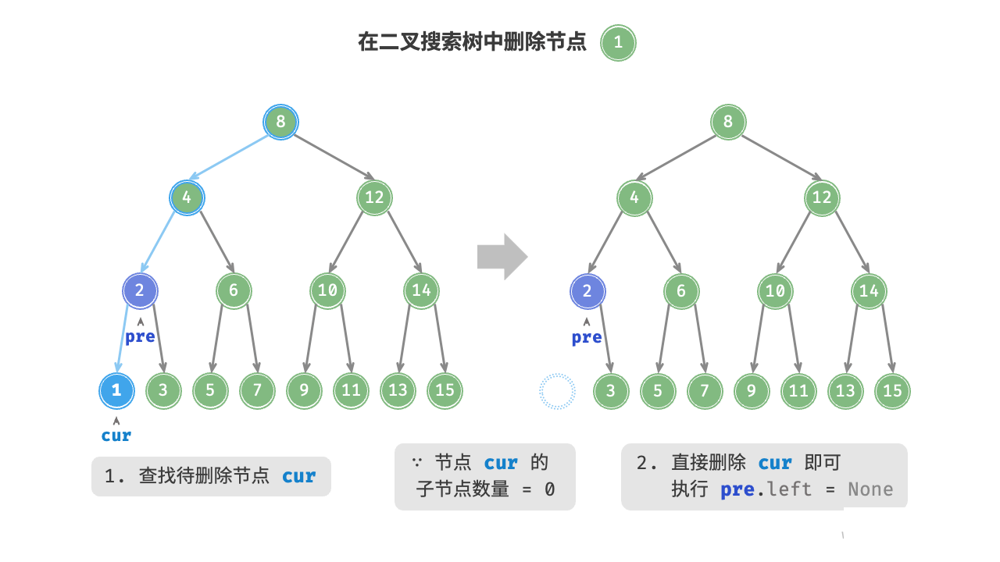

当待删除节点的度为 1 时，将待删除节点替换为其子节点即可。

当待删除节点的度为 2 时，我们无法直接删除它，而需要使用一个节点替换该节点。由于要保持二叉搜索树“左子树 < 根节点 < 右子树”的性质，因此这个节点可以是右子树的最小节点或左子树的最大节点。

::; code-tabs

@tab 递归

```python
class TreeNode:
    """二叉树节点类"""

    def __init__(self, val):
        self.val = val
        self.left = None
        self.right = None


class BST:
    def __init__(self):
        self.root = None


    def search(self, root, val):
        if root is None:
            return None
        if val < root.val:
            return self.search(root.left, val)
        elif val > root.val:
            return self.search(root.right, val)
        else:
            return root  # 这里是返回了该节点的地址，而不是值


    def insert(self, root, num):
        if root is None:
            return TreeNode(num)
        if num < root.val:
            root.left = self.insert(root.left, num)
        elif num > root.val:
            root.right = self.insert(root.right, num)
        return root

    def delete(self, root, key):
        if root is None:
            return root
        if root.val > key:
            root.left = self.delete(root.left, key)
        elif root.val < key:
            root.right = self.delete(root.right, key)
        else:
            if root.left is None and root.right is None:
                return None
            elif root.left is None:
                return root.right
            elif root.right is None:
                return root.left
            else:
                """找到右子树最小节点"""
                min_larger_root = self.find_min(root.right)
                root.val = min_larger_root.val
                root.right = self.delete(root.right, min_larger_root.val)
            return root
                # store = root.right
                # while store.left is not None:
                #     store = store.left
                # store.left = root.left
                # store.right = root.right
                # return store
    def find_min(self, root):
        current = root
        while current is not None:
            current = current.left
        return current

if __name__ == '__main__':
    bst = BST()
    bst.root = bst.insert(bst.root,6)
    bst.insert(bst.root, 3)
    bst.insert(bst.root, 9)
    bst.insert(bst.root, 1)
    bst.insert(bst.root, 2)
    bst.insert(bst.root, 7)

    bst.delete(bst.root, 7)

    # 测试查找节点
    node = bst.search(bst.root, 2)
    if node:
        print(f"找到了节点，值为: {node.val}") # 打印该节点的值
    else:
        print("未找到节点")
```

@tab 循环

```python
class TreeNode:
    """二叉树节点类"""

    def __init__(self, val):
        self.val = val
        self.left = None
        self.right = None


class BST:
    def __init__(self):
        self.root = None

    def search(self, root, val):
        root = self.root
        while root:
            if root.val > val:
                root = root.left
            elif root.val < val:
                root = root.right
            else:
                break
        return root

    def insert(self, root, num):
        cur = self.root
        while cur:
            if num < cur.val:
                cur = cur.left
            elif num > cur.val:
                cur = cur.right
        return TreeNode(num)

    def delete(self, root, key):
        cur = self.root
        while cur:
            if cur.val > key:
                cur = cur.left
            elif cur.val < key:
                cur = cur.right
            else:
                if cur.left is None and cur.right is None:
                    return None
                elif cur.left is None:
                    return cur.right
                elif cur.right is None:
                    return cur.left
                else:
                    min_node = self.find_min(cur.right)
                    cur.val = min_node.val
                    self.delete(cur.right, min_node.val)
                    return cur


    def find_min(self, current):
        while current:
            current = current.left
        return current

if __name__ == '__main__':
    # 手动创建二叉搜索树
    bst = BST()
    bst.root = TreeNode(4)
    bst.root.left = TreeNode(2)
    bst.root.right = TreeNode(6)

    bst.root.left.left = TreeNode(1)
    bst.root.left.right = TreeNode(3)

    bst.root.right.left = TreeNode(5)
    bst.root.right.right = TreeNode(7)

    bst.delete(bst.root,5)

    # 测试查找节点
    node = bst.search(bst.root, 5)
    if node:
        print(f"找到了节点，值为: {node.val}") # 打印该节点的值
    else:
        print("未找到节点")
```

:::

### 6.4 补充内容

#### 6.4.1 中序遍历有序

如图 7-22 所示，二叉树的中序遍历遵循“左 $\rightarrow$ 根 $\rightarrow$ 右”的遍历顺序，而二叉搜索树满足“左子节点 $<$ 根节点 $<$ 右子节点”的大小关系。

这意味着在二叉搜索树中进行中序遍历时，总是会优先遍历下一个最小节点，从而得出一个重要性质：**二叉搜索树的中序遍历序列是升序的**。

利用中序遍历升序的性质，我们在二叉搜索树中获取有序数据仅需 $O(n)$ 时间，无须进行额外的排序操作，非常高效。

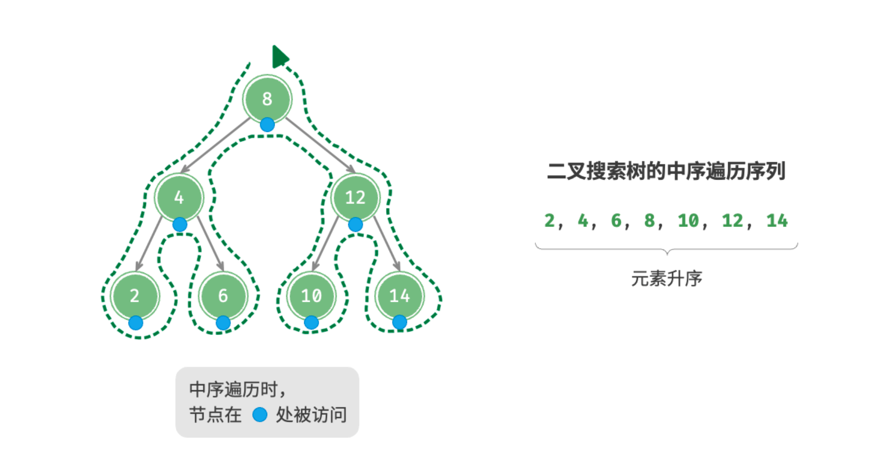

#### 6.4.2 二叉搜索树的效率

给定一组数据，我们考虑使用数组或二叉搜索树存储。观察表 7-2 ，二叉搜索树的各项操作的时间复杂度都是对数阶，具有稳定且高效的性能。只有在高频添加、低频查找删除数据的场景下，数组比二叉搜索树的效率更高。

::: center

表 7-2  数组与搜索树的效率对比

:::

|          | 无序数组 | 二叉搜索树 |
| :------- | :------- | :--------- |
| 查找元素 | $O(n)$   | $O(logn)$  |
| 插入元素 | $O(1)$   | $O(logn)$  |
| 删除元素 | $O(n)$   | $O(logn)$  |

在理想情况下，二叉搜索树是“平衡”的，这样就可以在 $logn$ 轮循环内查找任意节点。

然而，如果我们在二叉搜索树中不断地插入和删除节点，可能导致二叉树退化为图 7-23 所示的链表，这时各种操作的时间复杂度也会退化为 $O(n)$ 。

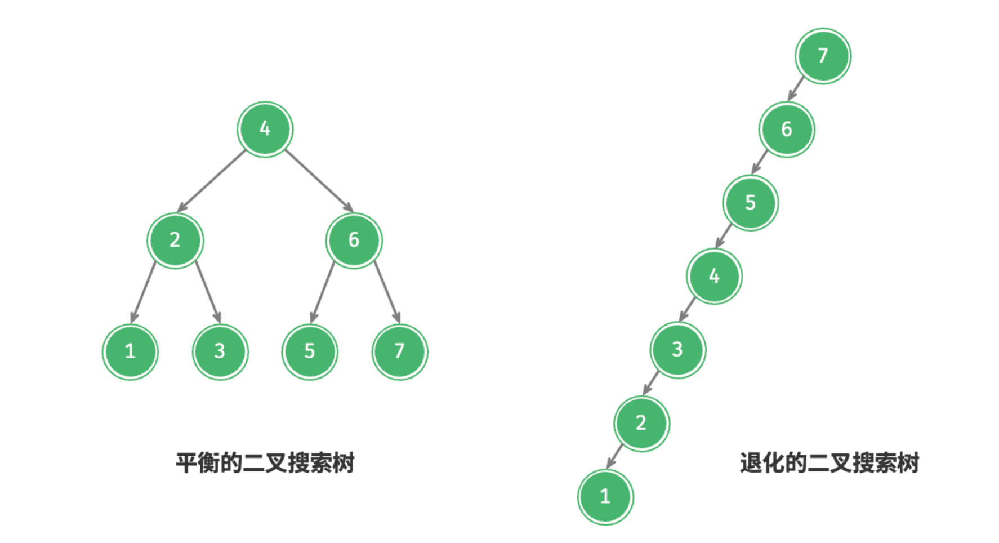

### 6.5 二叉树的常见应用

- 用作系统中的多级索引，实现高效的查找，插入，删除等操作
- 作为某些搜索算法的底层数据结构
- 用于存储数据流，以保持其有序状态


## 7. 二叉树的时间复杂度

1. **什么是二叉树？**

二叉树是一个树形结构，其中每个节点最多有两个子节点：一个左子节点和一个右子节点。一个常见的例子是**二叉搜索树**，它的性质是：对于每个节点，左子树的所有节点值都小于这个节点的值，右子树的所有节点值都大于这个节点的值。

2. **树的高度是什么？**

树的**高度**指的是从根节点到最深的叶子节点的路径长度。比如：

- 如果一个二叉树只有一个节点，树的高度是 0。
- 如果一个二叉树有两个节点，根节点和一个叶子节点，那么树的高度是 1。

在一个理想的平衡二叉树中，如果有 `n` 个节点，那么树的高度大约是 $O(\log n)$，这是因为每一层的节点数是前一层的两倍。

3. **为什么是 $O(\log n)$？**

假设你有一棵平衡的二叉树，并且它的高度为 `h`，那么这棵树最多可以容纳的节点数是 $2^h - 1$ 个。也就是说：

- 高度为 1 时，最多有 1 个节点（$2^1 - 1 = 1$）
- 高度为 2 时，最多有 3 个节点（$2^2 - 1 = 3$）
- 高度为 3 时，最多有 7 个节点（$2^3 - 1 = 7$）

可以看到，随着树的高度增加，节点的数量呈指数级增长。

要插入、查找或删除一个节点时，你需要从树的根开始，逐层往下找到合适的位置。每向下一层，树的节点数就会减半。换句话说，你在查找的过程中，每一步都缩小了一半的范围。因此，这种操作的时间复杂度是与树的高度成正比的。

对于一个有 `n` 个节点的平衡二叉树，树的高度大约是 $O(\log n)$，所以插入、查找或删除操作的时间复杂度也是 $O(\log n)$。

4. **总结**

- 二叉树操作的时间复杂度通常和树的**高度**有关。
- 对于一个有 `n` 个节点的**平衡二叉树**，树的高度大约是 $O(\log n)$。
- 查找、插入、删除操作的复杂度都与树的高度相关，所以在平衡二叉树中的这些操作通常为 $O(\log n)$。

在二叉树的时间复杂度为 $O(\log n)$ 中，底数是 **2**。

:::info **为什么底数是 2？**

这是因为在每一层，平衡二叉树的节点数会 **翻倍**。具体来说：

- 在树的第 0 层（根节点），有 1 个节点。
- 在树的第 1 层，有 2 个节点。
- 在树的第 2 层，有 4 个节点。
- 在树的第 3 层，有 8 个节点。

因此，树的每一层的节点数以 $2^h$ 的形式增长，$h$ 是层数（高度）。这个增长模式导致树的高度与节点总数之间的关系是以 2 为底的对数关系。所以，复杂度表示为 $O(\log_2 n)$，其中底数是 2。

不过，计算机科学中的对数复杂度通常忽略底数，因为不同底数的对数之间的差别只是一个常数倍，并不会影响大规模情况下的渐进复杂度。因此，常常简写为 $O(\log n)$，不具体说明底数。但从数学上讲，这里的底数是 2。

:::

## 8. AVL树
