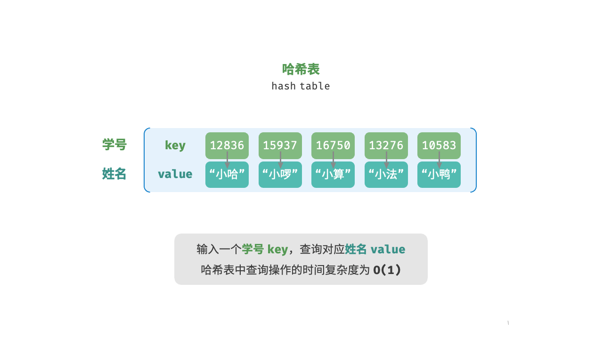
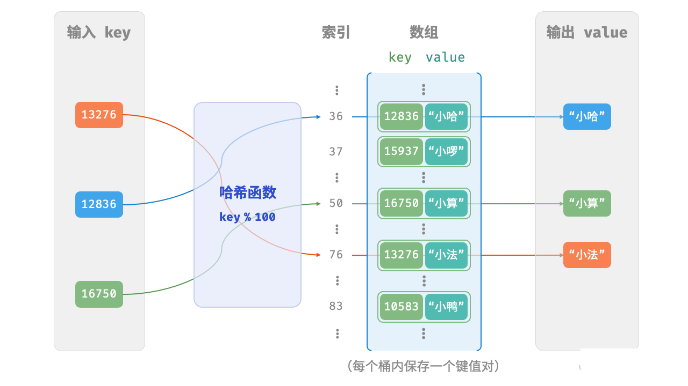
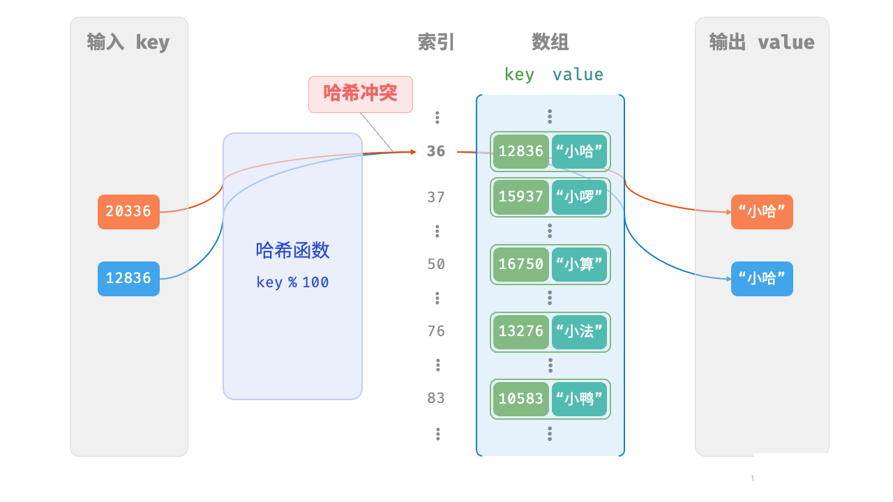
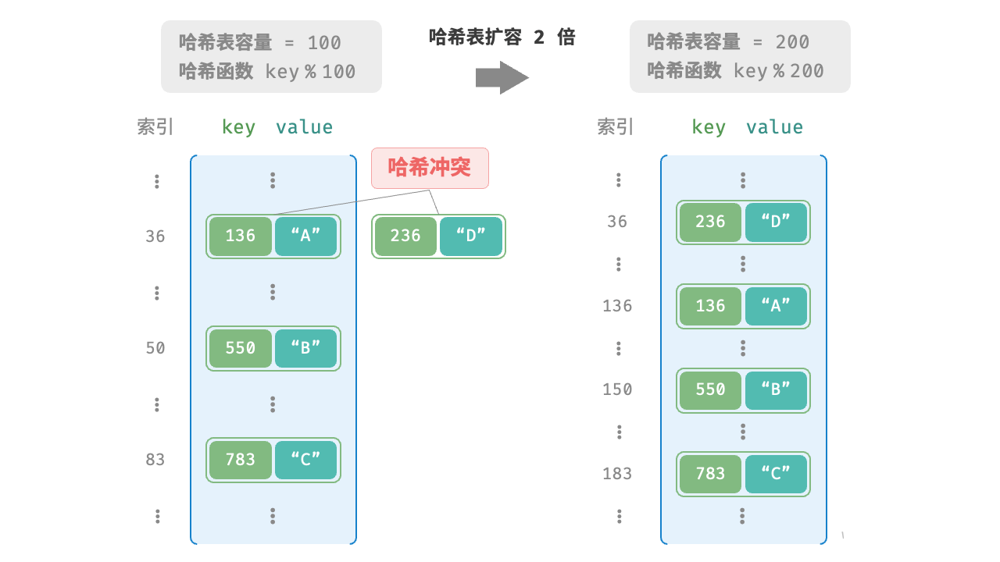
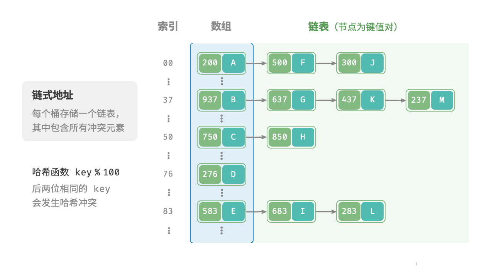
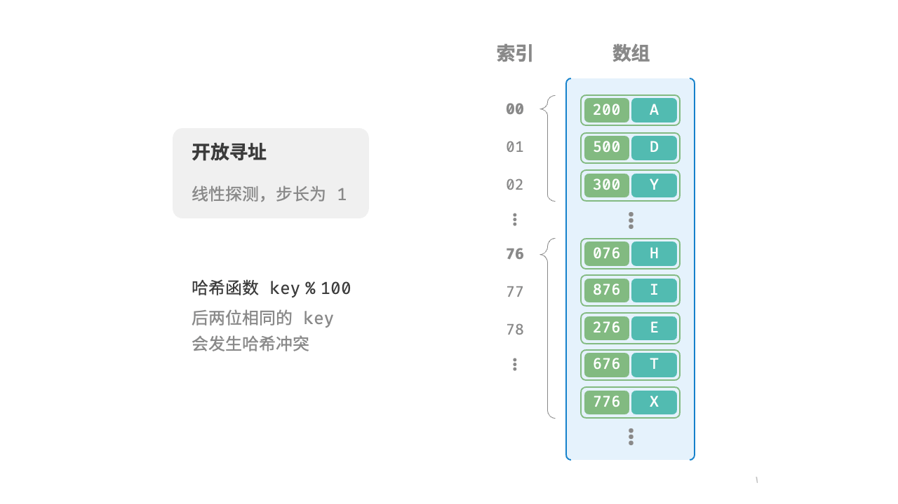
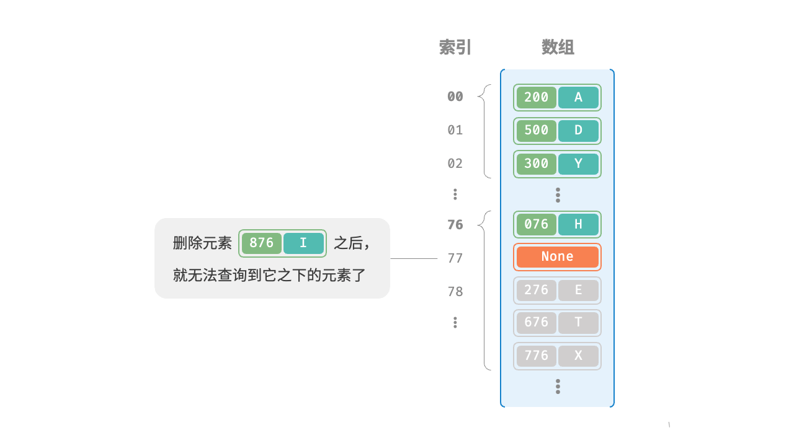
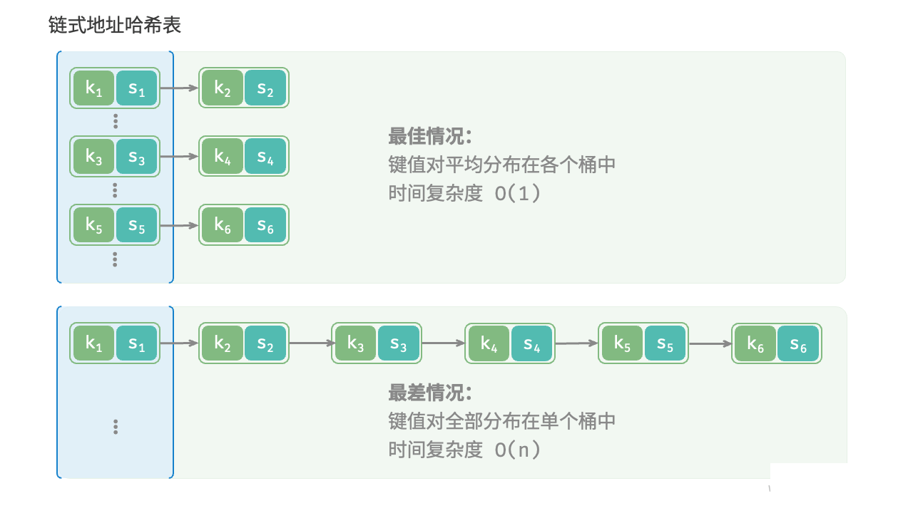

## 1. Stacks

栈（stack）是一种遵循先入后出逻辑的线性数据结构。

我们可以将栈类比为桌面上的一摞盘子，如果想取出底部的盘子，则需要先将上面的盘子依次移走。我们将盘子替换为各种类型的元素（如整数、字符、对象等），就得到了栈这种数据结构。

我们把堆叠元素的顶部称为“栈顶”，底部称为“栈底”。将把元素添加到栈顶的操作叫作“入栈”，删除栈顶元素的操作叫作“出栈”。

```python
class Stack:
    def __init__(self):
        self.stack = []

    def is_empty(self):
        # 判断栈是否为空
        return len(self.stack) == 0

    def push(self, item):
        # 入栈操作，将元素添加到栈顶
        self.stack.append(item)

    def pop(self):
        # 出栈操作，弹出栈顶元素
        if not self.is_empty():
            self.stack.pop()
        else:
            raise IndexError('pop from an empty stack')  # 手动报错

    def peek(self):
        # 查看栈顶元素但不弹出
        if not self.is_empty():
            return self.stack[-1]
        else:
            raise IndexError('empty stack')  # 手动报错

    def size(self):
        # 返回栈的大小
        return len(self.stack)


# 示例
stack = Stack()
stack.push(10)
stack.push(20)
stack.push(30)

print("栈顶元素:", stack.peek())  # 输出 30
print("栈大小:", stack.size())  # 输出 3

stack.pop()  # 弹出 30
print("弹出后的栈顶元素:", stack.peek())  # 输出 20


# output
栈顶元素: 30
栈大小: 3
弹出后的栈顶元素: 20
```


## 2. Queues

队列（queue）是一种遵循先入先出规则的线性数据结构。顾名思义，队列模拟了排队现象，即新来的人不断加入队列尾部，而位于队列头部的人逐个离开。

我们将队列头部称为“队首”，尾部称为“队尾”，将把元素加入队尾的操作称为“入队”，删除队首元素的操作称为“出队”。


```python
class Queue:
    def __init__(self):
        self.queue = []

    def is_empty(self):
        # 判断队列是否为空
        return len(self.queue) == 0

    def enqueue(self, item):
        # 入队操作，将元素添加到队列末尾
        self.queue.append(item)

    def dequeue(self):
        # 出队操作，移除并返回队列头部的元素
        if not self.is_empty():
            self.queue.pop(0)
        else:
            raise IndexError('pop from an empty queue')

    def front(self):
        # 返回队列头部元素但不移除
        if not self.is_empty():
            return self.queue[0]
        else:
            raise IndexError('empty queue')

    def size(self):
        # 返回队列的大小
        return len(self.queue)

# 示例
queue = Queue()
queue.enqueue(10)
queue.enqueue(20)
queue.enqueue(30)

print("队列头部元素:", queue.front())  # 输出 10
print("队列大小:", queue.size())      # 输出 3

queue.dequeue()  # 移除 10
print("移除后的队列头部元素:", queue.front())  # 输出 20
```


## 3. List 

链表（Linked List）是一种线性数据结构，其中的每一个元素都是一个节点对象，各个节点通过“引用”相连接，引用记录了下一个节点的内存地址，通过它可以从当前的节点访问到下一个节点。链表的设计使得各个节点可以分散存储在内存的各处，他们的内存地址无需连接。


### 3.1 基础代码

单向链表

::: tabs 

@tab 构建元素

```python
class ListNode:
    def __init__(self, value):
        self.value = value
        self.next: ListNode | None = None

n0 = ListNode(1)
n1 = ListNode(3)
n2 = ListNode(2)
```

- Python tutor

    


@tab 连接元素

```python
class ListNode:
    def __init__(self, value):
        self.value = value
        self.next: ListNode | None = None

n0 = ListNode(1)
n1 = ListNode(3)
n2 = ListNode(2)
n0.next = n1
n1.next = n2
```

- Python tutor

    

:::

双向链表

::: tabs 

```python
class ListNode:
    def __init__(self, value):
        self.value = value
        self.prev: ListNode | None = None  # 前驱节点
        self.next: ListNode | None = None  # 后继节点


n0 = ListNode(1)
n1 = ListNode(3)
n2 = ListNode(2)

n0.next = n1
n1.prev = n0
n1.next = n2
n2.prev = n1
```

:::


### 3.2 插入

```python
class ListNode:
    def __init__(self, value):
        self.value = value
        self.next: ListNode | None = None

def insert(n0: ListNode, P: ListNode):
    """在链表的节点 n0 之后插入节点 P"""
    n1 = n0.next
    P.next = n1
    n0.next = P

n0 = ListNode(1)
n1 = ListNode(3)
n2 = ListNode(2)
n3 = ListNode(5)
n4 = ListNode(4)
n0.next = n1
n1.next = n2
n2.next = n3
n3.next = n4
```


### 3.3 删除

```python
class ListNode:
    def __init__(self, value):
        self.value = value
        self.next: ListNode | None = None


def remove(n0):
    if n0.next == None:
        return None
    else:
        n0.next = n0.next.next
        return


# 初始化链表的各个节点
n0 = ListNode(1)
n1 = ListNode(3)
n2 = ListNode(2)
n3 = ListNode(5)
n4 = ListNode(4)
n0.next = n1
n1.next = n2
n2.next = n3
n3.next = n4

# 删除 n2
remove(n0)
```


### 3.4 查找索引

```python
class ListNode:
    def __init__(self, value):
        self.value = value
        self.next: ListNode | None = None


def access(head, index):
    for i in range(index):
        if head is None:
            return None
        else:
            head = head.next
    return head

# 初始化链表的各个节点
n0 = ListNode(1)
n1 = ListNode(3)
n2 = ListNode(2)
n3 = ListNode(5)
n4 = ListNode(4)
n0.next = n1
n1.next = n2
n2.next = n3
n3.next = n4


# 访问节点
node = access(n0, 1)
print(f"链表中索引 1 处的节点的值为{node.value}")
```


### 3.5 查找值

```python
class ListNode:
    def __init__(self, value):
        self.value = value
        self.next: ListNode | None = None

def find(head: ListNode, target: int) -> int:
    index = 0
    while head is not None:
        if head.value == target:
            return index
        else:
            head = head.next
            index += 1


n0 = ListNode(1)
n1 = ListNode(3)
n2 = ListNode(2)
n3 = ListNode(5)
n4 = ListNode(4)
n0.next = n1
n1.next = n2
n2.next = n3
n3.next = n4

find_index = find(n0, 1)
print(f"找到首个值为 1 的节点，在链表的{find_index}号位")
```


## 4. 图

图（graph）是一种非线性数据结构，有顶点（vertex）和边（edge）组成。

我们可以将图 G 抽象的表示为一组顶点 V 和一组边 E 的集合。

以下示例展示了一个包含 5 个顶点和 7 条边的图。

```python
V = {1, 2, 3, 4, 5}
E = {(1, 2), (1, 3), (1, 5), (2, 3), (2, 4), (2, 5), (4, 5)}
G = {V, E}
```

如果将顶点看作节点，将边看作连接各个节点的引用（指针），我们就可以将图看作一种从链表扩展而来的数据结构。

相较于线性关系（链表）和分治关系（树），网络关系（图）的自由度更高，因而更加复杂。

### 4.1 术语

- 有向图：边有指向，有方向，例如微信和 QQ 的好友关系

- 无向图：边无指向，无方向。

- 连通图：从某个一个顶点出发到任意一个顶点的路径都连通。
- 非连通图：从某一个顶点出发，至少有一个顶点无法到达。

- 有权图：每一条边都附带一个对应的数值。

    

    ​                                                                                                  图 1-1

- 邻接：比如图 1-1 ，0与1和3邻接。

- 路径：从顶点 A 到顶点 B 经过的边构成的序列被称为 A 到 B 的路径。

- 度：

    - 无向图：一个顶点拥有的边数。
    - 有向图：分为入度和出度。

- 邻接矩阵：设图的顶点数为 n ，邻接矩阵使用一个 n X n 的大小矩阵来表示图，每一行（列）代表一个顶点，矩阵元素代表边，用 1 或 0 表示两顶点之间是否存在边。

    例子：设邻接矩阵为 M，顶点列表为 V，那么矩阵元素 M {i, j} = 1 表示顶点V[i] 到顶点V[j]之间存在的边，反之 M[i,j] = 0 表示两顶点之间无边。


​                                                                                                            图 1-2

邻接矩阵特点：

1. 顶点不能与自身相连，因此邻接矩阵主对角线元素没有意义。
2. 对于无向图，两个方向的边等价，此时邻接矩阵关于主对角线对称
3. 将邻接矩阵的元素从 1 到 哦替换为权重，则可表示有权图


- 邻接表

    


### 4.2 基于邻接矩阵的变换

::: tabs 

@tab Step 1


@tab Step 2


@tab Step 3


@tab Step 4


@tab Step 5


:::


```python
class GraphAdjMat:
    """基于邻接矩阵实现的无向图类"""

    def __init__(self, vertices: list[int], edges: list[list[int]]):
        """构造方法，初始化图，接收顶点和边的列表"""
        # 顶点列表，存储图中的顶点值，元素代表“顶点值”，索引代表“顶点索引”
        self.vertices: list[int] = []
        # 邻接矩阵，用二维列表表示图的顶点之间的连接情况，行列索引对应“顶点索引”
        self.adj_mat: list[list[int]] = []
        # 遍历传入的顶点值，依次添加到顶点列表中
        for val in vertices:
            self.add_vertex(val)
        # 遍历传入的边列表，依次在邻接矩阵中添加这些边
        for e in edges:
            self.add_edge(e[0], e[1])

    def size(self) -> int:
        """获取顶点数量"""
        # 返回顶点列表的长度，即图中顶点的数量
        return len(self.vertices)

    def add_vertex(self, val: int):
        """添加顶点"""
        # 获取当前图的顶点数量，方便扩展邻接矩阵
        n = self.size()
        # 将新顶点的值添加到顶点列表中
        self.vertices.append(val)
        # 创建一个新的行（即新顶点与其他顶点的连接状态），初始化为 0
        new_row = [0] * (n + 1)  # 新行需要有 n+1 列，因为新增了一个顶点
        # 将新行添加到邻接矩阵中，表示与其他顶点的连接状态
        self.adj_mat.append(new_row)
        # 遍历现有的邻接矩阵，为每一行添加一个新列，表示新顶点的加入
        for row in self.adj_mat[:-1]:  # 最后一行是刚刚添加的，因此不需要再修改
            row.append(0)

    def remove_vertex(self, index: int):
        """删除指定索引的顶点"""
        # 检查索引是否越界，如果越界则抛出异常
        if index >= self.size() or index < 0:
            raise IndexError(f"顶点索引 {index} 超出范围。")
        # 从顶点列表中移除索引为 index 的顶点
        self.vertices.pop(index)
        # 从邻接矩阵中移除对应的行，表示删除该顶点的所有连接
        self.adj_mat.pop(index)
        # 从邻接矩阵中移除对应的列，删除该顶点与其他顶点的连接
        for row in self.adj_mat:
            row.pop(index)

    def add_edge(self, i: int, j: int):
        """添加边"""
        # 检查顶点索引 i 和 j 是否越界
        if i < 0 or j < 0 or i >= self.size() or j >= self.size():
            raise IndexError(f"顶点索引 {i} 或 {j} 超出范围。")
        # 检查是否尝试添加自环（即从顶点 i 到自身的边）
        if i == j:
            raise ValueError(f"不允许添加从顶点 {i} 到自身的边。")
        # 在无向图中，邻接矩阵关于主对角线对称，因此需要设置两个位置的值为 1
        self.adj_mat[i][j] = 1
        self.adj_mat[j][i] = 1

    def remove_edge(self, i: int, j: int):
        """删除边"""
        # 检查顶点索引 i 和 j 是否越界
        if i < 0 or j < 0 or i >= self.size() or j >= self.size():
            raise IndexError(f"顶点索引 {i} 或 {j} 超出范围。")
        # 检查是否尝试删除自环
        if i == j:
            raise ValueError(f"不允许删除从顶点 {i} 到自身的边。")
        # 删除边，在邻接矩阵中将两个位置的值设为 0
        self.adj_mat[i][j] = 0
        self.adj_mat[j][i] = 0

    def print_matrix(self):
        """打印邻接矩阵"""
        # 遍历邻接矩阵的每一行
        for row in self.adj_mat:
            # 将行中的元素拼接成字符串输出，每个元素之间用空格分隔
            print(" ".join(map(str, row)))

    def print(self):
        """打印顶点列表和邻接矩阵"""
        # 输出顶点列表
        print("顶点列表 =", self.vertices)
        # 输出邻接矩阵的标题
        print("邻接矩阵 =")
        # 调用内部的 print_matrix 方法，输出矩阵内容
        self.print_matrix()
        
if __name__ == "__main__":
    # 初始化无向图
    vertices = [1, 3, 2, 5, 4]
    edges = [[0, 1], [0, 3], [1, 2], [2, 3], [2, 4], [3, 4]]
    graph = GraphAdjMat(vertices, edges)

    # 添加边
    # 顶点 1, 2 的索引分别为 0, 2
    graph.add_edge(0, 2)

    # 删除边
    # 顶点 1, 3 的索引分别为 0, 1
    graph.remove_edge(0, 1)

    # 添加顶点
    graph.add_vertex(6)

    # 删除顶点
    # 顶点 3 的索引为 1
    graph.remove_vertex(1)
    graph.print()
```


### 4.3 DFS

```python
class GraphAdjMat:
    """基于邻接矩阵实现的无向图类"""

    def __init__(self, vertices: list[int], edges: list[list[int]]):
        """构造方法"""
        # 顶点列表，元素代表“顶点值”，索引代表“顶点索引”
        self.vertices: list[int] = []
        # 邻接矩阵，行列索引对应“顶点索引”
        self.adj_mat: list[list[int]] = []
        # 添加顶点
        for val in vertices:
            self.add_vertex(val)
        # 添加边
        # 请注意，edges 元素代表顶点索引，即对应 vertices 元素索引
        for e in edges:
            self.add_edge(e[0], e[1])

    def size(self) -> int:
        """获取顶点数量"""
        return len(self.vertices)

    def add_vertex(self, val: int):
        """添加顶点"""
        n = self.size()
        self.vertices.append(val)
        new_row = [0] * (n+1)
        self.adj_mat.append(new_row)
        for row in self.adj_mat[:-1]:
            row.append(0)


    def remove_vertex(self, index: int):
        """删除顶点"""
        if index >= self.size() or index < 0:
            raise Exception(f"顶点索引{index}超出范围。")
        self.vertices.pop(index)
        self.adj_mat.pop(index)
        for row in self.adj_mat:
            row.pop(index)


    def add_edge(self, i: int, j: int):
        """添加边"""
        if i < 0 or i >= self.size() or j < 0 or j >= self.size():
            raise IndexError(f"顶点索引{i}和{j}超储范围。")
        if i == j:
            raise ValueError(f"不允许添加从顶点{i}到自身的边")
        self.adj_mat[i][j] = 1
        self.adj_mat[j][i] = 1


    def remove_edge(self, i: int, j: int):
        """删除边"""
        if i < 0 or i >= self.size() or j < 0 or j>= self.size():
            raise IndexError(f"顶点索引{i}和{j}超储范围。")
        if i == j:
            raise ValueError(f"不允许删除从顶点{i}到自身的边")
        self.adj_mat[i][j] = 0
        self.adj_mat[j][i] = 0


    def print_matrix(self):
        """打印邻接矩阵"""
        for row in self.adj_mat:
            print(" ".join(map(str, row)))

    def print(self):
        """打印邻接矩阵和顶点列表"""
        print("顶点列表 =", self.vertices)
        print("邻接矩阵 =")
        self.print_matrix()

    def dfs_recursive(self, start: int, visited: list[bool]):
    """递归方式实现 DFS"""
    visited[start] = True  # 标记当前顶点为已访问
    print(self.vertices[start], end=" ")  # 输出当前顶点
    
    # 遍历所有与当前顶点相连的顶点
    for neighbor, is_connected in enumerate(self.adj_mat[start]):
        if is_connected and not visited[neighbor]:  # 如果有连接且未访问
            self.dfs_recursive(neighbor, visited)  # 递归访问该顶点


    def dfs(self, start_vertex: int):
        """调用 DFS 遍历"""
        visited = [False] * self.size()  # 初始化所有顶点都未访问
        start_index = self.vertices.index(start_vertex)  # 获取起始顶点的索引
        self.dfs_recursive(start_index, visited)  # 从起始顶点开始递归遍历
        print()  # 打印结果后的换行


if __name__ == "__main__":
    # 初始化无向图
    vertices = [1, 3, 2, 5, 4]
    edges = [[0, 1], [0, 3], [1, 2], [2, 3], [2, 4], [3, 4]]
    graph = GraphAdjMat(vertices, edges)

    # 添加边
    # 顶点 1, 2 的索引分别为 0, 2
    graph.add_edge(0, 2)

    # 删除边
    # 顶点 1, 3 的索引分别为 0, 1
    graph.remove_edge(0, 1)

    # 添加顶点
    graph.add_vertex(6)

    # 删除顶点
    # 顶点 3 的索引为 1
    graph.remove_vertex(1)
    graph.print()

def test_graph_adjmat_dfs():
    print("=== 测试1：简单图 ===")
    # 创建图
    vertices = [0, 1, 2, 3, 4]
    edges = [[0, 1], [0, 2], [1, 3], [2, 4]]
    graph = GraphAdjMat(vertices, edges)
    graph.print()  # 打印邻接矩阵
    print("DFS 从顶点 0 开始：")
    graph.dfs(0)   # 从顶点 0 开始进行 DFS 遍历，预期输出 0 1 3 2 4

    print("\n=== 测试2：环形图 ===")
    # 创建一个环形图
    vertices = [0, 1, 2, 3]
    edges = [[0, 1], [1, 2], [2, 3], [3, 0]]
    graph = GraphAdjMat(vertices, edges)
    graph.print()  # 打印邻接矩阵
    print("DFS 从顶点 0 开始：")
    graph.dfs(0)   # 从顶点 0 开始进行 DFS 遍历，预期输出 0 1 2 3

    print("\n=== 测试3：不连通图 ===")
    # 创建不连通的图
    vertices = [0, 1, 2, 3, 4]
    edges = [[0, 1], [2, 3]]
    graph = GraphAdjMat(vertices, edges)
    graph.print()  # 打印邻接矩阵
    print("DFS 从顶点 0 开始：")
    graph.dfs(0)   # 从顶点 0 开始进行 DFS 遍历，预期输出 0 1
    print("DFS 从顶点 2 开始：")
    graph.dfs(2)   # 从顶点 2 开始进行 DFS 遍历，预期输出 2 3

    print("\n=== 测试4：单一顶点 ===")
    # 创建只有一个顶点的图
    vertices = [0]
    edges = []
    graph = GraphAdjMat(vertices, edges)
    graph.print()  # 打印邻接矩阵
    print("DFS 从顶点 0 开始：")
    graph.dfs(0)   # 从顶点 0 开始进行 DFS 遍历，预期输出 0
```


### 4.4 BFS

```python
class GraphAdjMat:
    """基于邻接矩阵实现的无向图类"""

    def __init__(self, vertices: list[int], edges: list[list[int]]):
        """构造方法"""
        # 顶点列表，元素代表“顶点值”，索引代表“顶点索引”
        self.vertices: list[int] = []
        # 邻接矩阵，行列索引对应“顶点索引”
        self.adj_mat: list[list[int]] = []
        # 添加顶点
        for val in vertices:
            self.add_vertex(val)
        # 添加边
        # 请注意，edges 元素代表顶点索引，即对应 vertices 元素索引
        for e in edges:
            self.add_edge(e[0], e[1])

    def size(self) -> int:
        """获取顶点数量"""
        return len(self.vertices)

    def add_vertex(self, val: int):
        """添加顶点"""
        n = self.size()
        self.vertices.append(val)
        new_row = [0] * (n+1)
        self.adj_mat.append(new_row)
        for row in self.adj_mat[:-1]:
            row.append(0)


    def remove_vertex(self, index: int):
        """删除顶点"""
        if index >= self.size() or index < 0:
            raise Exception(f"顶点索引{index}超出范围。")
        self.vertices.pop(index)
        self.adj_mat.pop(index)
        for row in self.adj_mat:
            row.pop(index)


    def add_edge(self, i: int, j: int):
        """添加边"""
        if i < 0 or i >= self.size() or j < 0 or j >= self.size():
            raise IndexError(f"顶点索引{i}和{j}超储范围。")
        if i == j:
            raise ValueError(f"不允许添加从顶点{i}到自身的边")
        self.adj_mat[i][j] = 1
        self.adj_mat[j][i] = 1


    def remove_edge(self, i: int, j: int):
        """删除边"""
        if i < 0 or i >= self.size() or j < 0 or j>= self.size():
            raise IndexError(f"顶点索引{i}和{j}超储范围。")
        if i == j:
            raise ValueError(f"不允许删除从顶点{i}到自身的边")
        self.adj_mat[i][j] = 0
        self.adj_mat[j][i] = 0


    def print_matrix(self):
        """打印邻接矩阵"""
        for row in self.adj_mat:
            print(" ".join(map(str, row)))

    def print(self):
        """打印邻接矩阵和顶点列表"""
        print("顶点列表 =", self.vertices)
        print("邻接矩阵 =")
        self.print_matrix()

    def dfs_recursive(self, start: int, visited: list[bool]):
        """递归方式实现 DFS"""
        visited[start] = True  # 标记当前顶点为已访问
        print(self.vertices[start], end=" ")  # 输出当前顶点

        # 遍历所有与当前顶点相连的顶点
        for neighbor, is_connected in enumerate(self.adj_mat[start]):
            if is_connected and not visited[neighbor]:  # 如果有连接且未访问
                self.dfs_recursive(neighbor, visited)  # 递归访问该顶点


    def dfs(self, start_vertex: int):
        """调用 DFS 遍历"""
        visited = [False] * self.size()  # 初始化所有顶点都未访问
        start_index = self.vertices.index(start_vertex)  # 获取起始顶点的索引
        self.dfs_recursive(start_index, visited)  # 从起始顶点开始递归遍历
        print()  # 打印结果后的换行


    def bfs(self, start_vertex: int):
        # 获取起始顶点在列表中的索引
        start_index = self.vertices.index(start_vertex)
        queue = [start_index]  # 使用列表模拟队列
        # 初始化所有顶点状态为空
        visited = [False] * self.size()
        # 标记顶点为已经访问
        visited[start_index] = True
        # 当队列不为空时，进行遍历
        while queue:
            # 模拟队列，从队列中取出头部顶点。
            vertex = queue.pop(0)
            # 打印当前节点的值
            print(self.vertices[vertex], end='')
            # 遍历当前节点的所有与之有边的邻节点
            for neighbor, is_connect in enumerate(self.adj_mat[vertex]):
                # 如果存在邻节点且没有被访问过
                if not visited[neighbor] and is_connect:
                    visited[neighbor] = True
                    queue.append(neighbor)
        print()   # 只为换行
            
        


if __name__ == "__main__":
    # 初始化无向图
    vertices = [1, 3, 2, 5, 4]
    edges = [[0, 1], [0, 3], [1, 2], [2, 3], [2, 4], [3, 4]]
    graph = GraphAdjMat(vertices, edges)

    # 添加边
    # 顶点 1, 2 的索引分别为 0, 2
    graph.add_edge(0, 2)

    # 删除边
    # 顶点 1, 3 的索引分别为 0, 1
    graph.remove_edge(0, 1)

    # 添加顶点
    graph.add_vertex(6)

    # 删除顶点
    # 顶点 3 的索引为 1
    graph.remove_vertex(1)
    graph.print()

def test_graph_adjmat_dfs():
    print("=== 测试1：简单图 ===")
    # 创建图
    vertices = [0, 1, 2, 3, 4]
    edges = [[0, 1], [0, 2], [1, 3], [2, 4]]
    graph = GraphAdjMat(vertices, edges)
    graph.print()  # 打印邻接矩阵
    print("DFS 从顶点 0 开始：")
    graph.dfs(0)   # 从顶点 0 开始进行 DFS 遍历，预期输出 0 1 3 2 4

    print("\n=== 测试2：环形图 ===")
    # 创建一个环形图
    vertices = [0, 1, 2, 3]
    edges = [[0, 1], [1, 2], [2, 3], [3, 0]]
    graph = GraphAdjMat(vertices, edges)
    graph.print()  # 打印邻接矩阵
    print("DFS 从顶点 0 开始：")
    graph.dfs(0)   # 从顶点 0 开始进行 DFS 遍历，预期输出 0 1 2 3

    print("\n=== 测试3：不连通图 ===")
    # 创建不连通的图
    vertices = [0, 1, 2, 3, 4]
    edges = [[0, 1], [2, 3]]
    graph = GraphAdjMat(vertices, edges)
    graph.print()  # 打印邻接矩阵
    print("DFS 从顶点 0 开始：")
    graph.dfs(0)   # 从顶点 0 开始进行 DFS 遍历，预期输出 0 1
    print("DFS 从顶点 2 开始：")
    graph.dfs(2)   # 从顶点 2 开始进行 DFS 遍历，预期输出 2 3

    print("\n=== 测试4：单一顶点 ===")
    # 创建只有一个顶点的图
    vertices = [0]
    edges = []
    graph = GraphAdjMat(vertices, edges)
    graph.print()  # 打印邻接矩阵
    print("DFS 从顶点 0 开始：")
    graph.dfs(0)   # 从顶点 0 开始进行 DFS 遍历，预期输出 0
```


## 5. Hashing

哈希表（hash table），又叫散列表，他通过建立键 `key` 与 值`value` 之间的映射，实现高效的元素查询。具体而言，我们向哈希表中输入一个键，则可以在 $O(1)$ 时间内获取对应的值。

如图 6-1 所示，给定 n 个学生，每个学生都有“姓名”和“学号”两项数据。假如我们希望实现“输入一个学号，返回对应的姓名”的查询功能，则可以采用下图所示的哈希表来实现。



除了哈希表外，数组和链表也可以实现查询功能，它们的效率对比如表 6-1 所示。

- **添加元素：**仅需将元素添加至数组（链表）的尾部即可，使用$O(1)$时间
- **查询元素：**由于数组（链表）是乱序的，因此需要遍历其中的所有元素，使用 $O(n)$ 时间。
- **删除元素**：需要先查询元素再从数组（链表）中删除，使用 $O(n)$ 时间。

::: center

表 6-1 元素查询效率对比

:::

|          | 数组   | 链表   | 哈希表 |
| -------- | ------ | ------ | ------ |
| 查找元素 | $O(n)$ | $O(n)$ | $O(1)$ |
| 添加元素 | $O(1)$ | $O(1)$ | $O(1)$ |
| 删除元素 | $O(n)$ | $O(n)$ | $O(1)$ |

观察发现，**在哈希表中进行增删查改的时间复杂度都是** $O(1)$，非常高效。


### 5.1 哈希表的常用操作

哈希表的常用操作包括：初始化、查询、添加键值对和删除键值对。示例代码如下：

```python
hmap: dict = {}

# 添加操作
# 在哈希表中添加键值对 (key, value)
hmap[12836] = 'haha'
hmap[15937] = 'xixi'
hmap[16758] = 'heihei'
hmap[13276] = 'hehe'
hmap[10583] = 'yeye'

# 查询操作
# 向哈希表中输入键，得到值
name: str = hmap[15937]

# 删除操作
# 在哈希表中删除键值对（key，value）
hmap.pop(10583)


class HashTable:
    def __init__(self, size=10):
        self.size = size  # 哈希表的大小
        self.table = [[] for _ in range(size)]  # 初始化哈希表，每个槽都是一个空列表，用于处理冲突

    def _hash(self, key):
        # 简单的哈希函数：将键转换为字符串后求哈希值，并将其模以哈希表大小
        return hash(key) % self.size

    def put(self, key, value):
        # 向哈希表中插入键值对
        index = self._hash(key)
        bucket = self.table[index]
        for i, (k, v) in enumerate(bucket):
            if k == key:
                bucket[i] = (key, value)
                return
        bucket.append((key, value))

    def get(self, key):
        # 获取键对应的值
        index = self._hash(key)
        bucket = self.table[index]
        for k, v in bucket:
            if k == key:
                return v
        return None

    def remove(self, key):
        # 从哈希表中删除键
        index = self._hash(key)
        bucket = self.table[index]
        for i, (k, v) in enumerate(bucket):
            if k == key:
                bucket[i] = None
                return
        return None


# 使用示例
hash_table = HashTable()
hash_table.put("name", "Alice")
print(hash_table.get("name"))  # 输出: Alice
hash_table.put("name", "Bob")
print(hash_table.get("name"))  # 输出: Bob
hash_table.remove("name")
print(hash_table.get("name"))  # 输出: None
```


### 5.2 哈希表的遍历

::: code-tabs

@tab 字典实现

```python
hmap: dict = {}

# 添加操作
# 在哈希表中添加键值对 (key, value)
hmap[12836] = 'haha'
hmap[15937] = 'xixi'
hmap[16758] = 'heihei'
hmap[13276] = 'hehe'
hmap[10583] = 'yeye'

# 查询操作
# 向哈希表中输入键，得到值
name: str = hmap[15937]

# 删除操作
# 在哈希表中删除键值对（key，value）
hmap.pop(10583)

# 遍历哈希表
# 遍历键值对
for key, value in hmap.items():
    print(key, '->', value)

# 单独遍历键
for key in hmap.keys():
    print(key)

# 单独遍历值
for value in hmap.values():
    print(value)
```

@tab 列表实现

```python
class HashTable:
    def __init__(self, size=10):
        self.size = size  # 哈希表的大小
        self.table = [[] for _ in range(size)]  # 初始化哈希表，每个槽都是一个空列表，用于处理冲突

    def _hash(self, key):
        # 简单的哈希函数：将键转换为字符串后求哈希值，并将其模以哈希表大小
        return hash(key) % self.size

    def put(self, key, value):
        # 向哈希表中插入键值对
        index = self._hash(key)
        bucket = self.table[index]
        for i, (k, v) in enumerate(bucket):
            if k == key:
                # 如果键已存在，则更新值
                bucket[i] = (key, value)
                return
        # 如果键不存在，则添加新的键值对
        bucket.append((key, value))

    def get(self, key):
        # 获取键对应的值
        index = self._hash(key)
        bucket = self.table[index]
        for k, v in bucket:
            if k == key:
                return v
        return None  # 如果键不存在，返回None

    def remove(self, key):
        # 从哈希表中删除键
        index = self._hash(key)
        bucket = self.table[index]
        for i, (k, v) in enumerate(bucket):
            if k == key:
                del bucket[i]
                return True
        return False  # 如果键不存在，返回False

    def items(self):
        items_lst = []
        # 遍历哈希表中的所有键值对
        for bucket in self.table:
            for item in bucket:
                items_lst.append(item)
        return items_lst

    def keys(self):
        # 遍历哈希表中的所有键
        key_lst = []
        for bucket in self.table:
            for k, _ in bucket:
                key_lst.append(k)
        return key_lst

    def values(self):
        # 遍历哈希表中的所有值
        value_lst = []
        for bucket in self.table:
            for _, v in bucket:
                value_lst.append(v)
        return value_lst


# 使用示例
hash_table = HashTable()
hash_table.put("name", "Alice")
hash_table.put("age", 25)
hash_table.put("city", "New York")

# 遍历键值对
print("Items:")
for key, value in hash_table.items():
    print(key, value)

# 遍历键
print("\nKeys:")
for key in hash_table.keys():
    print(key)

# 遍历值
print("\nValues:")
for value in hash_table.values():
    print(value)
```

@tab 新语法 yield

```python
class HashTable:
    def __init__(self, size=10):
        self.size = size  # 哈希表的大小
        self.table = [[] for _ in range(size)]  # 初始化哈希表，每个槽都是一个空列表，用于处理冲突

    def _hash(self, key):
        # 简单的哈希函数：将键转换为字符串后求哈希值，并将其模以哈希表大小
        return hash(key) % self.size

    def put(self, key, value):
        # 向哈希表中插入键值对
        index = self._hash(key)
        bucket = self.table[index]
        for i, (k, v) in enumerate(bucket):
            if k == key:
                # 如果键已存在，则更新值
                bucket[i] = (key, value)
                return
        # 如果键不存在，则添加新的键值对
        bucket.append((key, value))

    def get(self, key):
        # 获取键对应的值
        index = self._hash(key)
        bucket = self.table[index]
        for k, v in bucket:
            if k == key:
                return v
        return None  # 如果键不存在，返回None

    def remove(self, key):
        # 从哈希表中删除键
        index = self._hash(key)
        bucket = self.table[index]
        for i, (k, v) in enumerate(bucket):
            if k == key:
                del bucket[i]
                return True
        return False  # 如果键不存在，返回False

    def items(self):
        # 遍历哈希表中的所有键值对
        for bucket in self.table:
            for item in bucket:
                yield item

    def keys(self):
        # 遍历哈希表中的所有键
        for bucket in self.table:
            for k, _ in bucket:
                yield k

    def values(self):
        # 遍历哈希表中的所有值
        for bucket in self.table:
            for _, v in bucket:
                yield v


# 使用示例
hash_table = HashTable()
hash_table.put("name", "Alice")
hash_table.put("age", 25)
hash_table.put("city", "New York")

# 遍历键值对
print("Items:")
for key, value in hash_table.items():
    print(key, value)

# 遍历键
print("\nKeys:")
for key in hash_table.keys():
    print(key)

# 遍历值
print("\nValues:")
for value in hash_table.values():
    print(value)
```

功能是把一些特定的值存在一个可迭代容器里。

:::


### 5.3 哈希表的简单实现

我们先考虑最简单的情况，仅用一个数组来实现哈希表。在哈希表中，我们将数组中的每个空位称为桶（bucket），每一个桶可存储一个键值对。因此，查询操作就是找到 `key` 对应的桶，并在桶中获取 `value`。

那么，如何基于 `key` 定位对应的桶呢？这是通过哈希函数（hash function）实现的。哈希函数作用是用一个较大的输入空间映射到一个较小的输出空间。在哈希表中，输入空间是所有 `key`, 输出空间是所有桶（数组索引）。换句话说，输入一个 `key`，我们可以通过哈希函数得到该 `key` 对应的键值对在数组中的存储位置。

输入一个 `key`，哈希函数的计算过程分为以下两种：

1. 通过某种哈希算法 `hash()`计算得到哈希值。
2. 将哈希值对桶数量（数组长度）`capacity` 取值，从而获取该 `key`对应的数组索引 `index`

```python
index = hash(key) # capacity
```

随后，我们就可以用 `index`在哈希表中访问对应的值，从而获取 `value`。

设数组长度为 `capacity = 100`哈希算法 `hash(key) = key`，易得哈希函数为 `key % 100` 。下图展示了哈希函数的工作原理。




以下代码实现了一个简单的哈希表。其中，我们将 `key` 和 `value` 分装成一个类 `Pair`，以表示键值对。

```python
class Pair:
    """键值对"""

    def __init__(self, key: int, value: str):
        self.key = key
        self.value = value


class ArrayHashing:
    def __init__(self):
        self.buckets: list[Pair | None] = [None] * 100

    def hash_fun(self, key: int) -> int:
        index = key % 100
        return index

    def get(self, key: int) -> str:
        index: int = self.hash_fun(key)
        pair: Pair = self.buckets[index]
        if pair is None:
            return None
        return pair.value

    def put(self, key: int, value: str):
        pair = Pair(key, value)
        index: int = self.hash_fun(key)
        self.buckets[index] = pair

    def delete(self, key: int):
        index: int = self.hash_fun(key)
        self.buckets[index] = None

    def entry_set(self) -> list[Pair]:
        for pair in self.buckets:
            if pair is not None:
                yield pair

    def key_set(self) -> list[Pair]:
        for pair in self.buckets:
            if pair is not None:
                yield pair.key

    def value_set(self) -> list[Pair]:
        for pair in self.buckets:
            if pair is not None:
                yield pair.value

    def print(self):
        for pair in self.buckets:
            if pair is not None:
                print(pair.key, "->", pair.value)

"""Driver Code"""
if __name__ == "__main__":
    # 初始化哈希表
    hmap = ArrayHashing()

    # 添加操作
    hmap.put(12836, "小哈")
    hmap.put(15937, "小啰")
    hmap.put(16750, "小算")
    hmap.put(13276, "小法")
    hmap.put(10583, "小鸭")

    # 查询操作
    name = hmap.get(15937)

    # 删除操作
    hmap.delete(10583)

    # 遍历哈希表
    print("\n遍历键值对 Key->Value")
    for pair in hmap.entry_set():
        print(pair.key, "->", pair.value)
```


### 5.4 哈希冲突与扩容

从本质上看，哈希函数的作用就是将所有 `key`构成的输入空间映射到数组所有索引号构成的输出空间。而输入空间往往远大于输出空间。因此，理论上一定存在“多个输入对应想相同输出“的情况。

::: tabs

@tab

哈希函数的作用是将一个输入（通常是一个“key”）转换为一个数字（通常是数组的索引）。这个过程就像是给每个输入找到一个“家”，这样你可以在数组中根据索引快速找到对应的数据。

但是，输入的可能性非常多，比如所有的字符串、所有的整数等等——这个集合被称为“输入空间”。而数组的大小是有限的，这个数组的索引范围也称为“输出空间”。因为输入空间比输出空间大，所以不可能给每个不同的输入都找到唯一的输出位置，最终会有多个输入映射到相同的输出位置。这种情况就是所谓的“哈希冲突”。

一个例子：

假设你有一个哈希函数，输入是1到100的整数，而你的数组只有10个位置（索引0到9）。无论你的哈希函数怎么设计，总会有某些整数映射到相同的索引位置。

比如，我们的哈希函数可以定义为hash(key) = key % 10，表示将输入的整数对10取余数，得到的结果就是索引位置。

这样：
	•	1 % 10 = 1
	•	11 % 10 = 1
	•	21 % 10 = 1

这三个数（1, 11, 21）都会映射到索引1的位置。因为输入空间（1到100）远大于输出空间（索引0到9），所以一定会有不同的输入映射到相同的输出位置。

总结：哈希函数设计的目标是尽量分散这些映射，减少冲突，但完全避免冲突是理论上做不到的。

:::

对于上述示例中的哈希函数，当输入的 `key`后两位相同时，哈希函数的输出也相同。例如，查询学号为 12836 和 20336 的两个学生时，我们得到：

```python
12836 % 100 = 36
20336 % 100 = 36
```

如图 6-3 所示，两个学号指向了同一个姓名，这显然是不对的。我们将这种多个输入对应同一输出的情况称为哈希冲突（hash collision）。



容易想到，哈希表容量 $n$ 越大，多个 `key` 被分配到同一个桶中的概率就越低，冲突就越少。因此，**我们可以通过扩容哈希表来减少哈希冲突**。

如图 6-4 所示，扩容前键值对 `(136, A)` 和 `(236, D)` 发生冲突，扩容后冲突消失。



类似于数组扩容，哈希表扩容需将所有键值对从原哈希表迁移至新哈希表，非常耗时；并且由于哈希表容量 capacity 改变，我们需要通过哈希函数来重新计算所有键值对的存储位置，这进一步增加了扩容过程的计算开销。为此，编程语言通常会预留足够大的哈希表容量，防止频繁扩容。

负载因子（load factor）是哈希表的一个重要概念，其定义为哈希表的元素数量除以桶数量，用于衡量哈希冲突的严重程度，**也常作为哈希表扩容的触发条件**。例如在 Java 中，当负载因子超过 $0.75$ 时，系统会将哈希表扩容至原先的 $2$ 倍。

**通常情况下哈希函数的输入空间远大于输出空间**，因此理论上哈希冲突是不可避免的。比如，输入空间为全体整数，输出空间为数组容量大小，则必然有多个整数映射至同一桶索引。

哈希冲突会导致查询结果错误，严重影响哈希表的可用性。为了解决该问题，每当遇到哈希冲突时，我们就进行哈希表扩容，直至冲突消失为止。此方法简单粗暴且有效，但效率太低，因为哈希表扩容需要进行大量的数据搬运与哈希值计算。为了提升效率，我们可以采用以下策略。

1. 改良哈希表数据结构，**使得哈希表可以在出现哈希冲突时正常工作**。
2. 仅在必要时，即当哈希冲突比较严重时，才执行扩容操作。

哈希表的结构改良方法主要包括“链式地址”和“开放寻址”。

#### 1. 链式地址

在原始哈希表中，每个桶仅能存储一个键值对。链式地址（separate chaining）将单个元素转换为链表，将键值对作为链表节点，将所有发生冲突的键值对都存储在同一链表中。图 6-5 展示了一个链式地址哈希表的例子。



基于链式地址实现的哈希表的操作方法发生了以下变化。

- **查询元素**：输入 `key` ，经过哈希函数得到桶索引，即可访问链表头节点，然后遍历链表并对比 `key` 以查找目标键值对。
- **添加元素**：首先通过哈希函数访问链表头节点，然后将节点（键值对）添加到链表中。
- **删除元素**：根据哈希函数的结果访问链表头部，接着遍历链表以查找目标节点并将其删除。

链式地址存在以下局限性。

- **占用空间增大**：链表包含节点指针，它相比数组更加耗费内存空间。
- **查询效率降低**：因为需要线性遍历链表来查找对应元素。

以下代码给出了链式地址哈希表的简单实现，需要注意两点。

- **使用列表（动态数组）代替链表，从而简化代码。**在这种设定下，哈希表（数组）包含多个桶，每个桶都是一个列表。
- 以下实现包含哈希表扩容方法。当负载因子超过 $\frac{2}{3}$ 时，我们将哈希表扩容至原先的 $2$ 倍。


```python
class Pair:
    def __init__(self, key: int, val:str):
        self.key = key
        self.val = val

class HashMapChaining:
    def __init__(self):
        self.size = 0
        self.capacity = 4
        self.load_thres = 2.0 / 3.0
        self.extend_ratio = 2
        self.buckets = [[] for _ in range(self.capacity)]

    def hash_func(self, key: int) -> int:
        return key % self.capacity

    def load_factor(self) -> float:
        return self.size / self.capacity

    def get(self, key: int) -> str | None:
        index = self.hash_func(key)
        bucket = self.buckets[index]
        for pair in bucket:
            if pair.key == key:
                return pair.val
        return None

    def put(self, key: int, val: str):
        if self.load_factor() > self.load_thres:
            self.extend()
        index = self.hash_func(key)
        bucket = self.buckets[index]
        for pair in bucket:
            if pair.key == key:
                pair.val = val
                return
        pair = Pair(key, val)
        bucket.append(pair)
        self.size += 1

    def remove(self, key: int):
        index = self.hash_func(key)
        bucket = self.buckets[index]
        for pair in bucket:
            if pair.key == key:
                bucket.remove(pair)
                self.size -= 1
                break

    def extend(self):
        buckets = self.buckets
        self.capacity *= self.extend_ratio
        self.buckets = [[] for _ in range(self.capacity)]
        self.size = 0
        for bucket in buckets:
            for pair in bucket:
                self.put(pair.key, pair.val)

    def print(self):
        for bucket in self.buckets:
            res = []
            for pair in bucket:
                res.append(str(pair.key) + '->' + pair.val)
            print(res)


"""Driver Code"""
if __name__ == "__main__":
    # 初始化哈希表
    hashmap = HashMapChaining()

    # 添加操作
    hashmap.put(12836, "小哈")
    hashmap.put(15937, "小啰")
    hashmap.put(16750, "小算")
    hashmap.put(13276, "小法")
    hashmap.put(10583, "小鸭")

    # 查询操作
    name = hashmap.get(13276)

    # 删除操作
    hashmap.remove(12836)

    hashmap.print()
```

值得注意的是，当链表很长时，查询效率 $O(n)$ 很差。**此时可以将链表转换为“AVL 树”或“红黑树”**，从而将查询操作的时间复杂度优化至 $Olog n$。

#### 2. 开放寻址

开放寻址（open addressing）不引入额外的数据结构，而是通过“多次探测”来处理哈希冲突，探测方式主要包括线性探测、平方探测和多次哈希等。

下面以线性探测为例，介绍开放寻址哈希表的工作机制。

##### ==**线性探测：**==

线性探测采用固定步长的线性搜索来进行探测，其操作方法与普通哈希表有所不同。

- **插入元素**：通过哈希函数计算桶索引，若发现桶内已有元素，则从冲突位置向后线性遍历（步长通常为 1 ），直至找到空桶，将元素插入其中。
- **查找元素**：若发现哈希冲突，则使用相同步长向后进行线性遍历，直到找到对应元素，返回 `value` 即可；如果遇到空桶，说明目标元素不在哈希表中，返回 `None` 。



图展示了开放寻址（线性探测）哈希表的键值对分布。根据此哈希函数，最后两位相同的 `key` 都会被映射到相同的桶。而通过线性探测，它们被依次存储在该桶以及之下的桶中。

然而，**线性探测容易产生“聚集现象”**。具体来说，数组中连续被占用的位置越长，这些连续位置发生哈希冲突的可能性越大，从而进一步促使该位置的聚堆生长，形成恶性循环，最终导致增删查改操作效率劣化。

值得注意的是，**我们不能在开放寻址哈希表中直接删除元素**。这是因为删除元素会在数组内产生一个空桶 `None` ，而当查询元素时，线性探测到该空桶就会返回，因此在该空桶之下的元素都无法再被访问到，程序可能误判这些元素不存在，如下图所示。



为了解决该问题，我们可以采用懒删除（lazy deletion）机制：它不直接从哈希表中移除元素，**而是利用一个常量 `TOMBSTONE` 来标记这个桶**。在该机制下，`None` 和 `TOMBSTONE` 都代表空桶，都可以放置键值对。但不同的是，线性探测到 `TOMBSTONE` 时应该继续遍历，因为其之下可能还存在键值对。

然而，**懒删除可能会加速哈希表的性能退化**。这是因为每次删除操作都会产生一个删除标记，随着 `TOMBSTONE` 的增加，搜索时间也会增加，因为线性探测可能需要跳过多个 `TOMBSTONE` 才能找到目标元素。

为此，考虑在线性探测中记录遇到的首个 `TOMBSTONE` 的索引，并将搜索到的目标元素与该 `TOMBSTONE` 交换位置。这样做的好处是当每次查询或添加元素时，元素会被移动至距离理想位置（探测起始点）更近的桶，从而优化查询效率。

以下代码实现了一个包含懒删除的开放寻址（线性探测）哈希表。为了更加充分地使用哈希表的空间，我们将哈希表看作一个“环形数组”，当越过数组尾部时，回到头部继续遍历。

```python
class HashMapOpenAddressing:
    """开放寻址哈希表"""

    def __init__(self):
        """构造方法"""
        self.size = 0  # 键值对数量
        self.capacity = 4  # 哈希表容量
        self.load_thres = 2.0 / 3.0  # 触发扩容的负载因子阈值
        self.extend_ratio = 2  # 扩容倍数
        self.buckets: list[Pair | None] = [None] * self.capacity  # 桶数组
        self.TOMBSTONE = Pair(-1, "-1")  # 删除标记

    def hash_func(self, key: int) -> int:
        """哈希函数"""
        return key % self.capacity

    def load_factor(self) -> float:
        """负载因子"""
        return self.size / self.capacity

    def find_bucket(self, key: int) -> int:
        """搜索 key 对应的桶索引"""
        index = self.hash_func(key)
        first_tombstone = -1
        # 线性探测，当遇到空桶时跳出
        while self.buckets[index] is not None:
            # 若遇到 key ，返回对应的桶索引
            if self.buckets[index].key == key:
                # 若之前遇到了删除标记，则将键值对移动至该索引处
                if first_tombstone != -1:
                    self.buckets[first_tombstone] = self.buckets[index]
                    self.buckets[index] = self.TOMBSTONE
                    return first_tombstone  # 返回移动后的桶索引
                return index  # 返回桶索引
            # 记录遇到的首个删除标记
            if first_tombstone == -1 and self.buckets[index] is self.TOMBSTONE:
                first_tombstone = index
            # 计算桶索引，越过尾部则返回头部
            index = (index + 1) % self.capacity
        # 若 key 不存在，则返回添加点的索引
        return index if first_tombstone == -1 else first_tombstone

    def get(self, key: int) -> str:
        """查询操作"""
        # 搜索 key 对应的桶索引
        index = self.find_bucket(key)
        # 若找到键值对，则返回对应 val
        if self.buckets[index] not in [None, self.TOMBSTONE]:
            return self.buckets[index].val
        # 若键值对不存在，则返回 None
        return None

    def put(self, key: int, val: str):
        """添加操作"""
        # 当负载因子超过阈值时，执行扩容
        if self.load_factor() > self.load_thres:
            self.extend()
        # 搜索 key 对应的桶索引
        index = self.find_bucket(key)
        # 若找到键值对，则覆盖 val 并返回
        if self.buckets[index] not in [None, self.TOMBSTONE]:
            self.buckets[index].val = val
            return
        # 若键值对不存在，则添加该键值对
        self.buckets[index] = Pair(key, val)
        self.size += 1

    def remove(self, key: int):
        """删除操作"""
        # 搜索 key 对应的桶索引
        index = self.find_bucket(key)
        # 若找到键值对，则用删除标记覆盖它
        if self.buckets[index] not in [None, self.TOMBSTONE]:
            self.buckets[index] = self.TOMBSTONE
            self.size -= 1

    def extend(self):
        """扩容哈希表"""
        # 暂存原哈希表
        buckets_tmp = self.buckets
        # 初始化扩容后的新哈希表
        self.capacity *= self.extend_ratio
        self.buckets = [None] * self.capacity
        self.size = 0
        # 将键值对从原哈希表搬运至新哈希表
        for pair in buckets_tmp:
            if pair not in [None, self.TOMBSTONE]:
                self.put(pair.key, pair.val)

    def print(self):
        """打印哈希表"""
        for pair in self.buckets:
            if pair is None:
                print("None")
            elif pair is self.TOMBSTONE:
                print("TOMBSTONE")
            else:
                print(pair.key, "->", pair.val)
```


##### ==**平方探测**==

平方探测与线性探测类似，都是开放寻址的常见策略之一。当发生冲突时，平方探测不是简单地跳过一个固定的步数，而是跳过“探测次数的平方”的步数，即 $1,4,9,…$ 步。

平方探测主要具有以下优势。

- 平方探测通过跳过探测次数平方的距离，试图缓解线性探测的聚集效应。
- 平方探测会跳过更大的距离来寻找空位置，有助于数据分布得更加均匀。

然而，平方探测并不是完美的。

- 仍然存在聚集现象，即某些位置比其他位置更容易被占用。
- 由于平方的增长，平方探测可能不会探测整个哈希表，这意味着即使哈希表中有空桶，平方探测也可能无法访问到它。

**多次哈希**

顾名思义，多次哈希方法使用多个哈希函数 $f_1(x)\text{、}f_2(x)\text{、}f_3(x)\dots$进行探测。

- **插入元素**：若哈希函数 $f_1(x)$ 出现冲突，则尝试 $f_2(x)$ ，以此类推，直到找到空位后插入元素。
- **查找元素**：在相同的哈希函数顺序下进行查找，直到找到目标元素时返回；若遇到空位或已尝试所有哈希函数，说明哈希表中不存在该元素，则返回 `None` 。

与线性探测相比，多次哈希方法不易产生聚集，但多个哈希函数会带来额外的计算量。

::: tip

请注意，开放寻址（线性探测、平方探测和多次哈希）哈希表都存在“不能直接删除元素”的问题。

:::


### 5.5 哈希算法

前两节介绍了哈希表的工作原理和哈希冲突的处理方法。然而无论是开放寻址还是链式地址，**它们只能保证哈希表可以在发生冲突时正常工作，而无法减少哈希冲突的发生**。

如果哈希冲突过于频繁，哈希表的性能会急剧恶化，如下图所示，对于链式地址哈希表，理想情况下键对值均匀分布在各个桶中，达到最佳查询效率，最差情况下所有键对值到一个桶中，时间复杂度退化至 $O(n)$



**键对值的分布的情况由哈希函数决定，**回忆哈希函数的计算步骤，先计算哈希值，再对数组长度取模。

```python
index = hash(key) % capacity
```

观察以上公式，当哈希表容量 `capacity`固定时，哈希算法 `hash()`决定了输出值。进而决定了键值对在哈希表中的分布情况。

这意味着，为了降低哈希冲突的发生概率，我们应该把注意力转移到哈希算法 `hash()`的设计上。

####  哈希算法的目标

为了实现“既快又稳”的哈希表数据结构，哈希算法应具备以下特点。

- **确定性**：对于相同的输入，哈希算法应始终产生相同的输出。这样才能确保哈希表是可靠的。
- **效率高**：计算哈希值的过程应该足够快。计算开销越小，哈希表的实用性越高。
- **均匀分布**：哈希算法应使得键值对均匀分布在哈希表中。分布越均匀，哈希冲突的概率就越低。

实际上，哈希算法除了可以用于实现哈希表，还广泛应用于其他领域中。

- **密码存储**：为了保护用户密码的安全，系统通常不会直接存储用户的明文密码，而是存储密码的哈希值。当用户输入密码时，系统会对输入的密码计算哈希值，然后与存储的哈希值进行比较。如果两者匹配，那么密码就被视为正确。

    ```python
    # pip install bcrypt
    import bcrypt
    
    # 注册用户时，存储密码哈希
    def hash_password(plain_password):
        # 生成盐并创建哈希
        salt = bcrypt.gensalt()
        hashed_password = bcrypt.hashpw(plain_password.encode('utf-8'), salt)
        return hashed_password
    
    # 登录用户时，验证密码
    def check_password(plain_password, hashed_password):
        # 对输入的密码进行哈希，并与存储的哈希值进行比较
        return bcrypt.checkpw(plain_password.encode('utf-8'), hashed_password)
    
    # 示例流程
    # 注册：用户输入密码 "my_secure_password"
    plain_password = "my_secure_password"
    hashed_password = hash_password(plain_password)
    print(f"存储的哈希值: {hashed_password}")
    
    # 登录：用户再次输入密码 "my_secure_password"
    login_password = "my_secure_password"
    if check_password(login_password, hashed_password):
        print("密码正确，登录成功！")
    else:
        print("密码错误，登录失败！")
    ```

- **数据完整性检查**：数据发送方可以计算数据的哈希值并将其一同发送；接收方可以重新计算接收到的数据的哈希值，并与接收到的哈希值进行比较。如果两者匹配，那么数据就被视为完整。

    ```python
    import hashlib
    
    # 发送方：计算数据的哈希值
    def calculate_hash(data):
        sha256 = hashlib.sha256()
        sha256.update(data.encode('utf-8'))  # 将数据编码并更新哈希计算
        return sha256.hexdigest()
    
    # 接收方：验证数据完整性
    def verify_data_integrity(received_data, received_hash):
        # 计算接收到的数据的哈希值
        calculated_hash = calculate_hash(received_data)
        # 比较计算出的哈希值与接收的哈希值
        return calculated_hash == received_hash
    
    # 示例流程
    data_to_send = "This is the data to be sent securely."
    hash_to_send = calculate_hash(data_to_send)
    print(f"发送的数据哈希值: {hash_to_send}")
    
    # 接收方接收到数据和哈希值
    received_data = "This is the data to be sent securely."  # 模拟接收到的数据
    received_hash = hash_to_send  # 模拟接收到的哈希值
    
    # 检查数据完整性
    if verify_data_integrity(received_data, received_hash):
        print("数据完整，未被篡改！")
    else:
        print("数据不完整或被篡改！")
    ```

对于密码学的相关应用，为了防止从哈希值推导出原始密码等逆向工程，哈希算法需要具备更高等级的安全特性。

- **单向性**：无法通过哈希值反推出关于输入数据的任何信息。
- **抗碰撞性**：应当极难找到两个不同的输入，使得它们的哈希值相同。
- **雪崩效应**：输入的微小变化应当导致输出的显著且不可预测的变化。

请注意，**“均匀分布”与“抗碰撞性”是两个独立的概念**，满足均匀分布不一定满足抗碰撞性。例如，在随机输入 `key` 下，哈希函数 `key % 100` 可以产生均匀分布的输出。然而该哈希算法过于简单，所有后两位相等的 `key` 的输出都相同，因此我们可以很容易地从哈希值反推出可用的 `key` ，从而破解密码。


#### 哈希算法的设计

哈希算法的设计是一个需要考虑许多因素的复杂问题。然而对于某些要求不高的场景，我们也能设计一些简单的哈希算法。

- **加法哈希**：对输入的每个字符的 ASCII 码进行相加，将得到的总和作为哈希值。
- **乘法哈希**：利用乘法的不相关性，每轮乘以一个常数，将各个字符的 ASCII 码累积到哈希值中。
- **异或哈希**：将输入数据的每个元素通过异或操作累积到一个哈希值中。
- **旋转哈希**：将每个字符的 ASCII 码累积到一个哈希值中，每次累积之前都会对哈希值进行旋转操作。


::: code-tabs

@tab

```python
def add_hash(key: str):
    hash = 0
    modulus = 1000000007
    for c in key:
        hash += ord(c)
    return hash % modulus

def mul_hash(key: str):
    hash = 0
    modulus = 1000000007
    for c in key:
        hash = 58 * hash + ord(c)
    return hash % modulus

def xor_hash(key: str):
    hash = 0
    modulus = 1000000007
    for c in key:
        hash ^= ord(c)
    return hash % modulus

def rotate_hash(key: str):
    hash = 0
    modulus = 1000000007
    for c in key:
        hash = (hash << 4) ^ (hash >> 28) ^ ord(c)
    return hash % modulus
```

@tab

```python
if __name__ == '__main__':
    key = "Hello 算法"

    hash = add_hash(key)
    print(f"加法哈希值为{hash}")

    hash = mul_hash(key)
    print(f"乘法哈希值为{hash}")

    hash = xor_hash(key)
    print(f"抑或哈希值为{hash}")

    hash = rotate_hash(key)
    print(f'旋转哈希值为{hash}')
```

:::


观察发现，每种哈希算法的最后一步都是对大质数 $1000000007$ 取模，以确保哈希值在合适的范围内。值得思考的是，为什么要强调对质数取模，或者说对合数取模的弊端是什么？这是一个有趣的问题。

先抛出结论：**使用大质数作为模数，可以最大化地保证哈希值的均匀分布**。因为质数不与其他数字存在公约数，可以减少因取模操作而产生的周期性模式，从而避免哈希冲突。

举个例子，假设我们选择合数 $9$ 作为模数，它可以被 $3$ 整除，那么所有可以被 $3$ 整除的 `key` 都会被映射到 $0$、$3$、$6$ 这三个哈希值。
$$
\begin{aligned}
\text{modulus} & = 9 \newline
\text{key} & = \{ 0, 3, 6, 9, 12, 15, 18, 21, 24, 27, 30, 33, \dots \} \newline
\text{hash} & = \{ 0, 3, 6, 0, 3, 6, 0, 3, 6, 0, 3, 6,\dots \}
\end{aligned}
$$
如果输入 `key` 恰好满足这种等差数列的数据分布，那么哈希值就会出现聚堆，从而加重哈希冲突。现在，假设将 `modulus` 替换为质数 $13$ ，由于 `key` 和 `modulus` 之间不存在公约数，因此输出的哈希值的均匀性会明显提升。
$$
\begin{aligned}
\text{modulus} & = 13 \newline
\text{key} & = \{ 0, 3, 6, 9, 12, 15, 18, 21, 24, 27, 30, 33, \dots \} \newline
\text{hash} & = \{ 0, 3, 6, 9, 12, 2, 5, 8, 11, 1, 4, 7, \dots \}
\end{aligned}
$$
值得说明的是，如果能够保证 `key` 是随机均匀分布的，那么选择质数或者合数作为模数都可以，它们都能输出均匀分布的哈希值。而当 `key` 的分布存在某种周期性时，对合数取模更容易出现聚集现象。

总而言之，我们通常选取质数作为模数，并且这个质数最好足够大，以尽可能消除周期性模式，提升哈希算法的稳健性。

#### 常见哈希算法

不难发现，以上介绍的简单哈希算法都比较“脆弱”，远远没有达到哈希算法的设计目标。例如，由于加法和异或满足交换律，因此加法哈希和异或哈希无法区分内容相同但顺序不同的字符串，这可能会加剧哈希冲突，并引起一些安全问题。

在实际中，我们通常会用一些标准哈希算法，例如 MD5、SHA-1、SHA-2 和 SHA-3 等。它们可以将任意长度的输入数据映射到恒定长度的哈希值。

近一个世纪以来，哈希算法处在不断升级与优化的过程中。一部分研究人员努力提升哈希算法的性能，另一部分研究人员和黑客则致力于寻找哈希算法的安全性问题。下表展示了在实际应用中常见的哈希算法。

- MD5 和 SHA-1 已多次被成功攻击，因此它们被各类安全应用弃用。
- SHA-2 系列中的 SHA-256 是最安全的哈希算法之一，仍未出现成功的攻击案例，因此常用在各类安全应用与协议中。
- SHA-3 相较 SHA-2 的实现开销更低、计算效率更高，但目前使用覆盖度不如 SHA-2 系列。


::: center

表 6-2  常见的哈希算法

:::

|          | MD5                            | SHA-1            | SHA-2                        | SHA-3               |
| -------- | ------------------------------ | ---------------- | ---------------------------- | ------------------- |
| 推出时间 | 1992                           | 1995             | 2002                         | 2008                |
| 输出长度 | 128 bit                        | 160 bit          | 256/512 bit                  | 224/256/384/512 bit |
| 哈希冲突 | 较多                           | 较多             | 很少                         | 很少                |
| 安全等级 | 低，已被成功攻击               | 低，已被成功攻击 | 高                           | 高                  |
| 应用     | 已被弃用，仍用于数据完整性检查 | 已被弃用         | 加密货币交易验证、数字签名等 | 可用于替代 SHA-2    |

#### 数据结构的哈希值

我们知道，哈希表的 `key` 可以是整数、小数或字符串等数据类型。编程语言通常会为这些数据类型提供内置的哈希算法，用于计算哈希表中的桶索引。以 Python 为例，我们可以调用 `hash()` 函数来计算各种数据类型的哈希值。

- 整数和布尔量的哈希值就是其本身。
- 浮点数和字符串的哈希值计算较为复杂，有兴趣的读者请自行学习。
- 元组的哈希值是对其中每一个元素进行哈希，然后将这些哈希值组合起来，得到单一的哈希值。
- 对象的哈希值基于其内存地址生成。通过重写对象的哈希方法，可实现基于内容生成哈希值。

::: tip

请注意，不同编程语言的内置哈希值计算函数的定义和方法不同。

:::

```python
num = 3
hash_num = hash(num)
# 整数 3 的哈希值为 3

bol = True
hash_bol = hash(bol)
# 布尔量 True 的哈希值为 1

dec = 3.14159
hash_dec = hash(dec)
# 小数 3.14159 的哈希值为 326484311674566659

str = "Hello 算法"
hash_str = hash(str)
# 字符串“Hello 算法”的哈希值为 4617003410720528961

tup = (12836, "小哈")
hash_tup = hash(tup)
# 元组 (12836, '小哈') 的哈希值为 1029005403108185979

obj = ListNode(0)
hash_obj = hash(obj)
# 节点对象 <ListNode object at 0x1058fd810> 的哈希值为 274267521
```
