## 1. Stacks

栈（stack）是一种遵循先入后出逻辑的线性数据结构。

我们可以将栈类比为桌面上的一摞盘子，如果想取出底部的盘子，则需要先将上面的盘子依次移走。我们将盘子替换为各种类型的元素（如整数、字符、对象等），就得到了栈这种数据结构。

我们把堆叠元素的顶部称为“栈顶”，底部称为“栈底”。将把元素添加到栈顶的操作叫作“入栈”，删除栈顶元素的操作叫作“出栈”。

```python
class Stack:
    def __init__(self):
        self.stack = []

    def is_empty(self):
        # 判断栈是否为空
        return len(self.stack) == 0

    def push(self, item):
        # 入栈操作，将元素添加到栈顶
        self.stack.append(item)

    def pop(self):
        # 出栈操作，弹出栈顶元素
        if not self.is_empty():
            self.stack.pop()
        else:
            raise IndexError('pop from an empty stack')  # 手动报错

    def peek(self):
        # 查看栈顶元素但不弹出
        if not self.is_empty():
            return self.stack[-1]
        else:
            raise IndexError('empty stack')  # 手动报错

    def size(self):
        # 返回栈的大小
        return len(self.stack)


# 示例
stack = Stack()
stack.push(10)
stack.push(20)
stack.push(30)

print("栈顶元素:", stack.peek())  # 输出 30
print("栈大小:", stack.size())  # 输出 3

stack.pop()  # 弹出 30
print("弹出后的栈顶元素:", stack.peek())  # 输出 20


# output
栈顶元素: 30
栈大小: 3
弹出后的栈顶元素: 20
```


## 2. Queues

队列（queue）是一种遵循先入先出规则的线性数据结构。顾名思义，队列模拟了排队现象，即新来的人不断加入队列尾部，而位于队列头部的人逐个离开。

我们将队列头部称为“队首”，尾部称为“队尾”，将把元素加入队尾的操作称为“入队”，删除队首元素的操作称为“出队”。


```python
class Queue:
    def __init__(self):
        self.queue = []

    def is_empty(self):
        # 判断队列是否为空
        return len(self.queue) == 0

    def enqueue(self, item):
        # 入队操作，将元素添加到队列末尾
        self.queue.append(item)

    def dequeue(self):
        # 出队操作，移除并返回队列头部的元素
        if not self.is_empty():
            self.queue.pop(0)
        else:
            raise IndexError('pop from an empty queue')

    def front(self):
        # 返回队列头部元素但不移除
        if not self.is_empty():
            return self.queue[0]
        else:
            raise IndexError('empty queue')

    def size(self):
        # 返回队列的大小
        return len(self.queue)

# 示例
queue = Queue()
queue.enqueue(10)
queue.enqueue(20)
queue.enqueue(30)

print("队列头部元素:", queue.front())  # 输出 10
print("队列大小:", queue.size())      # 输出 3

queue.dequeue()  # 移除 10
print("移除后的队列头部元素:", queue.front())  # 输出 20
```


## 3. List 

链表（Linked List）是一种线性数据结构，其中的每一个元素都是一个节点对象，各个节点通过“引用”相连接，引用记录了下一个节点的内存地址，通过它可以从当前的节点访问到下一个节点。链表的设计使得各个节点可以分散存储在内存的各处，他们的内存地址无需连接。

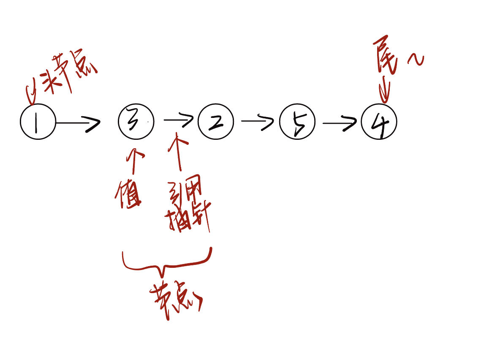

### 3.1 基础代码

单向链表

::: tabs 

@tab 构建元素

```python
class ListNode:
    def __init__(self, value):
        self.value = value
        self.next: ListNode | None = None

n0 = ListNode(1)
n1 = ListNode(3)
n2 = ListNode(2)
```

- Python tutor

    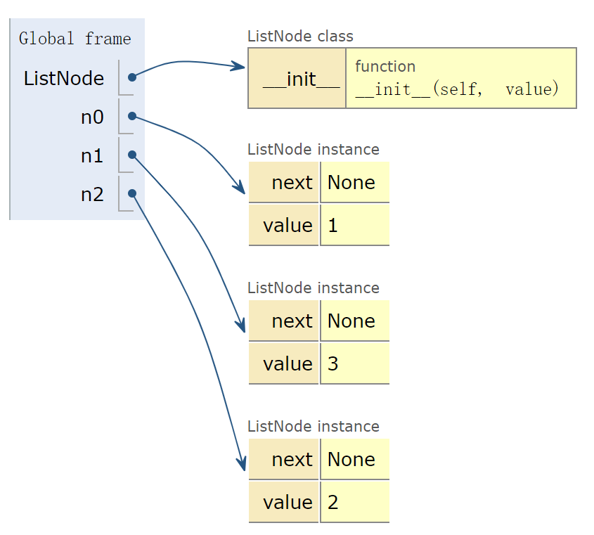


@tab 连接元素

```python
class ListNode:
    def __init__(self, value):
        self.value = value
        self.next: ListNode | None = None

n0 = ListNode(1)
n1 = ListNode(3)
n2 = ListNode(2)
n0.next = n1
n1.next = n2
```

- Python tutor

    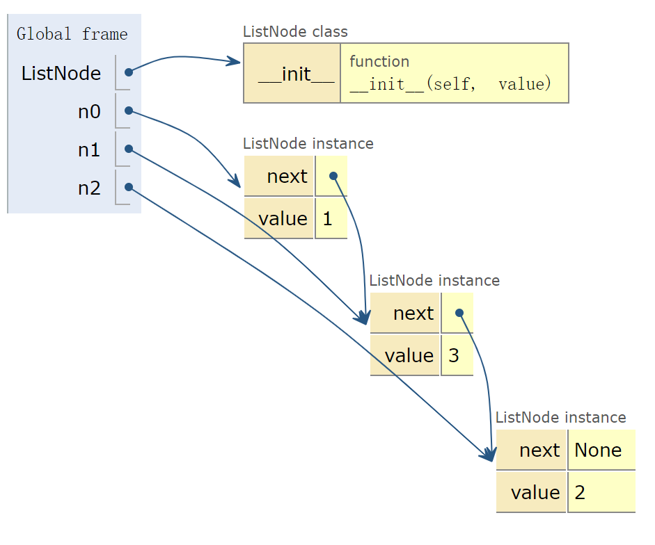

:::

::: tabs 双向链表

```python
class ListNode:
    def __init__(self, value):
        self.value = value
        self.prev: ListNode | None = None  # 前驱节点
        self.next: ListNode | None = None  # 后继节点


n0 = ListNode(1)
n1 = ListNode(3)
n2 = ListNode(2)

n0.next = n1
n1.prev = n0
n1.next = n2
n2.prev = n1
```

:::

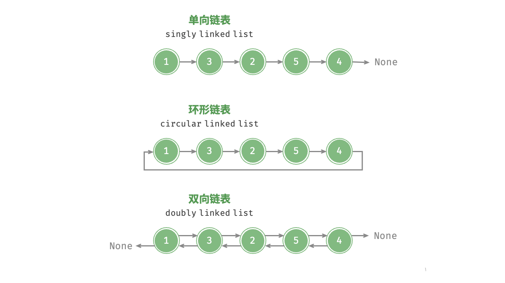

### 3.2 插入

```python
class ListNode:
    def __init__(self, value):
        self.value = value
        self.next: ListNode | None = None

def insert(n0: ListNode, P: ListNode):
    """在链表的节点 n0 之后插入节点 P"""
    n1 = n0.next
    P.next = n1
    n0.next = P

n0 = ListNode(1)
n1 = ListNode(3)
n2 = ListNode(2)
n3 = ListNode(5)
n4 = ListNode(4)
n0.next = n1
n1.next = n2
n2.next = n3
n3.next = n4
```


### 3.3 删除

```python
class ListNode:
    def __init__(self, value):
        self.value = value
        self.next: ListNode | None = None


def remove(n0):
    if n0.next == None:
        return None
    else:
        n0.next = n0.next.next
        return


# 初始化链表的各个节点
n0 = ListNode(1)
n1 = ListNode(3)
n2 = ListNode(2)
n3 = ListNode(5)
n4 = ListNode(4)
n0.next = n1
n1.next = n2
n2.next = n3
n3.next = n4

# 删除 n2
remove(n0)
```


### 3.4 查找索引

```python
class ListNode:
    def __init__(self, value):
        self.value = value
        self.next: ListNode | None = None


def access(head, index):
    for i in range(index):
        if head is None:
            return None
        else:
            head = head.next
    return head

# 初始化链表的各个节点
n0 = ListNode(1)
n1 = ListNode(3)
n2 = ListNode(2)
n3 = ListNode(5)
n4 = ListNode(4)
n0.next = n1
n1.next = n2
n2.next = n3
n3.next = n4


# 访问节点
node = access(n0, 1)
print(f"链表中索引 1 处的节点的值为{node.value}")
```


### 3.5 查找值

```python
class ListNode:
    def __init__(self, value):
        self.value = value
        self.next: ListNode | None = None

def find(head: ListNode, target: int) -> int:
    index = 0
    while head is not None:
        if head.value == target:
            return index
        else:
            head = head.next
            index += 1


n0 = ListNode(1)
n1 = ListNode(3)
n2 = ListNode(2)
n3 = ListNode(5)
n4 = ListNode(4)
n0.next = n1
n1.next = n2
n2.next = n3
n3.next = n4

find_index = find(n0, 1)
print(f"找到首个值为 1 的节点，在链表的{find_index}号位")
```


## 4. 图

图（graph）是一种非线性数据结构，有顶点（vertex）和边（edge）组成。

我们可以将图 G 抽象的表示为一组顶点 V 和一组边 E 的集合。

以下示例展示了一个包含 5 个顶点和 7 条边的图。

```python
V = {1, 2, 3, 4, 5}
E = {(1, 2), (1, 3), (1, 5), (2, 3), (2, 4), (2, 5), (4, 5)}
G = {V, E}
```

如果将顶点看作节点，将边看作连接各个节点的引用（指针），我们就可以将图看作一种从链表扩展而来的数据结构。

相较于线性关系（链表）和分治关系（树），网络关系（图）的自由度更高，因而更加复杂。

### 4.1 术语

- 有向图：边有指向，有方向，例如微信和 QQ 的好友关系

- 无向图：边无指向，无方向。

- 连通图：从某个一个顶点出发到任意一个顶点的路径都连通。
- 非连通图：从某一个顶点出发，至少有一个顶点无法到达。

- 有权图：每一条边都附带一个对应的数值。

    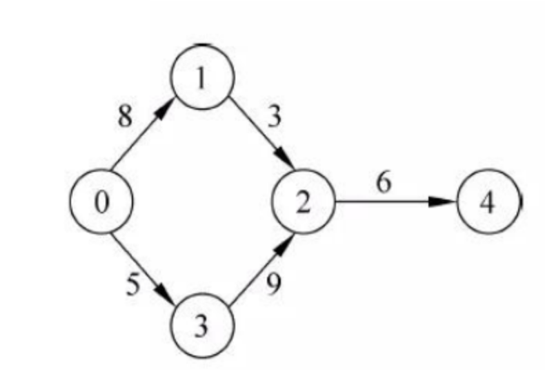

    ​                                                                                                  图 1-1

- 邻接：比如图 1-1 ，0与1和3邻接。

- 路径：从顶点 A 到顶点 B 经过的边构成的序列被称为 A 到 B 的路径。

- 度：

    - 无向图：一个顶点拥有的边数。
    - 有向图：分为入度和出度。

- 邻接矩阵：设图的顶点数为 n ，邻接矩阵使用一个 n X n 的大小矩阵来表示图，每一行（列）代表一个顶点，矩阵元素代表边，用 1 或 0 表示两顶点之间是否存在边。

    例子：设邻接矩阵为 M，顶点列表为 V，那么矩阵元素 M {i, j} = 1 表示顶点V[i] 到顶点V[j]之间存在的边，反之 M[i,j] = 0 表示两顶点之间无边。

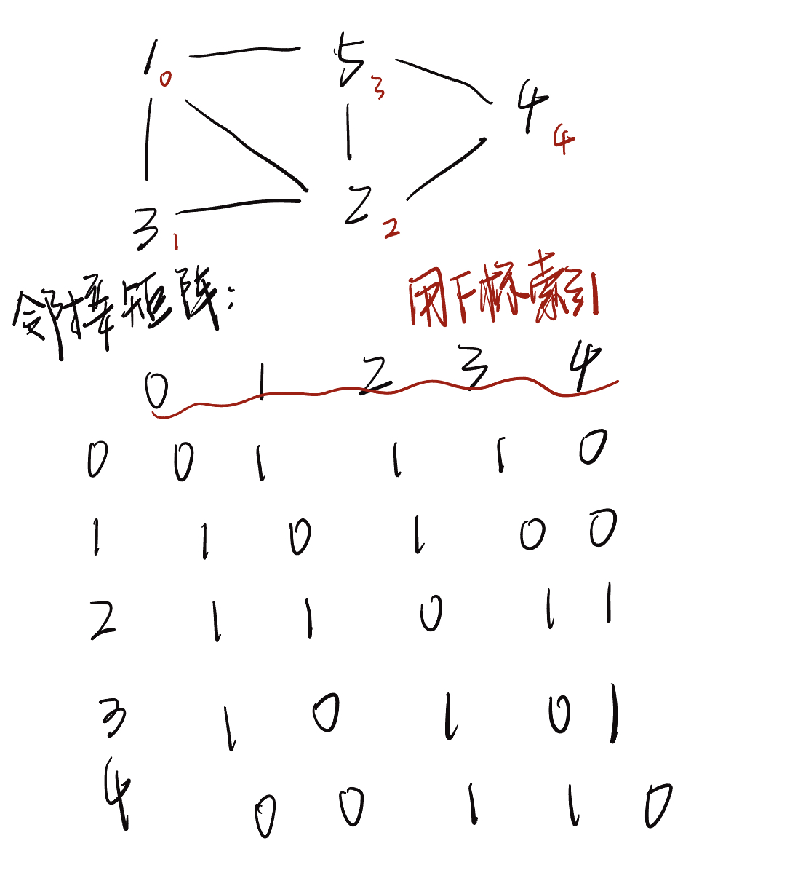

​                                                                                                            图 1-2

邻接矩阵特点：

1. 顶点不能与自身相连，因此邻接矩阵主对角线元素没有意义。
2. 对于无向图，两个方向的边等价，此时邻接矩阵关于主对角线对称
3. 将邻接矩阵的元素从 1 到 哦替换为权重，则可表示有权图


- 邻接表

    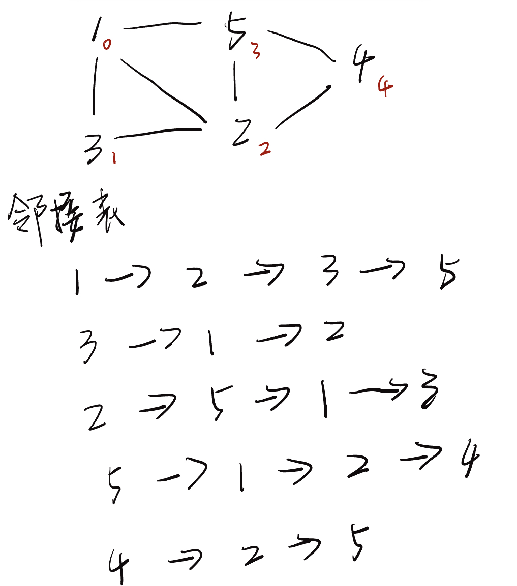


### 4.2 基于邻接矩阵的变换

::: tabs 

@tab Step 1

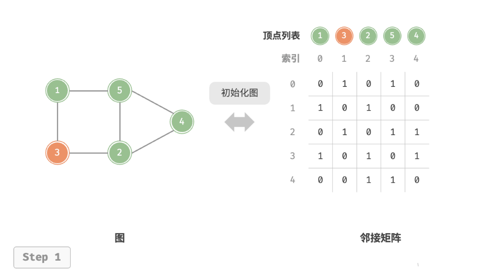

@tab Step 2

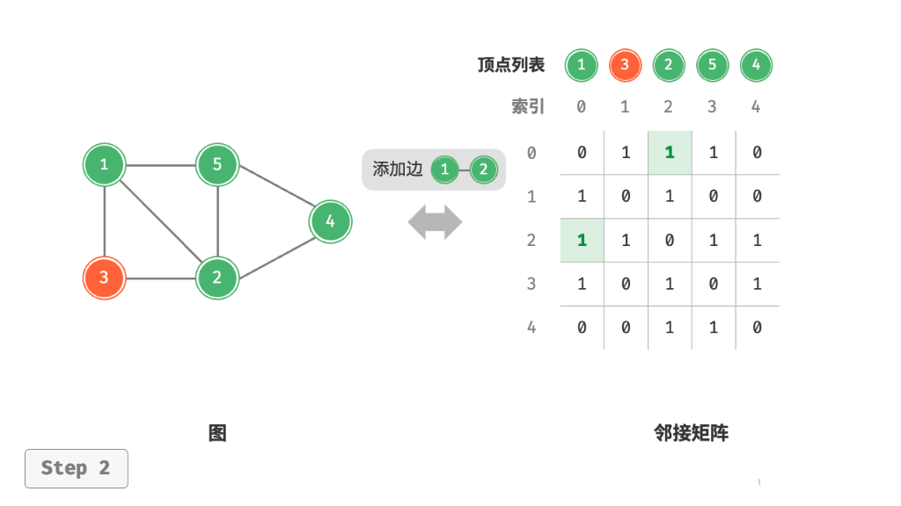

@tab Step 3

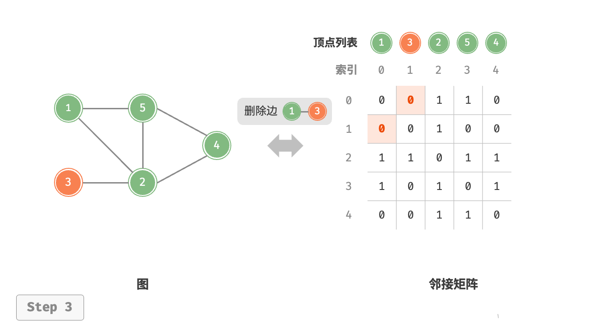


@tab Step 4

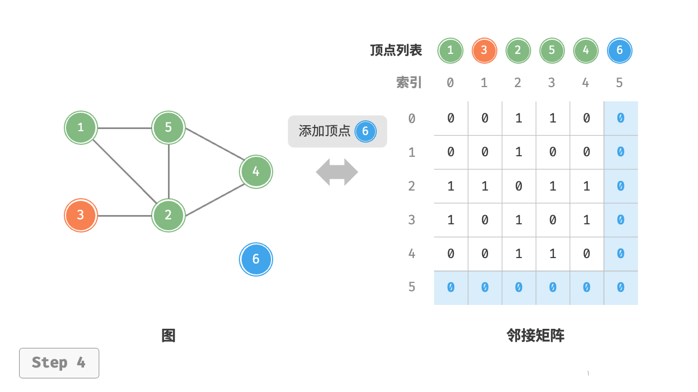

@tab Step 5

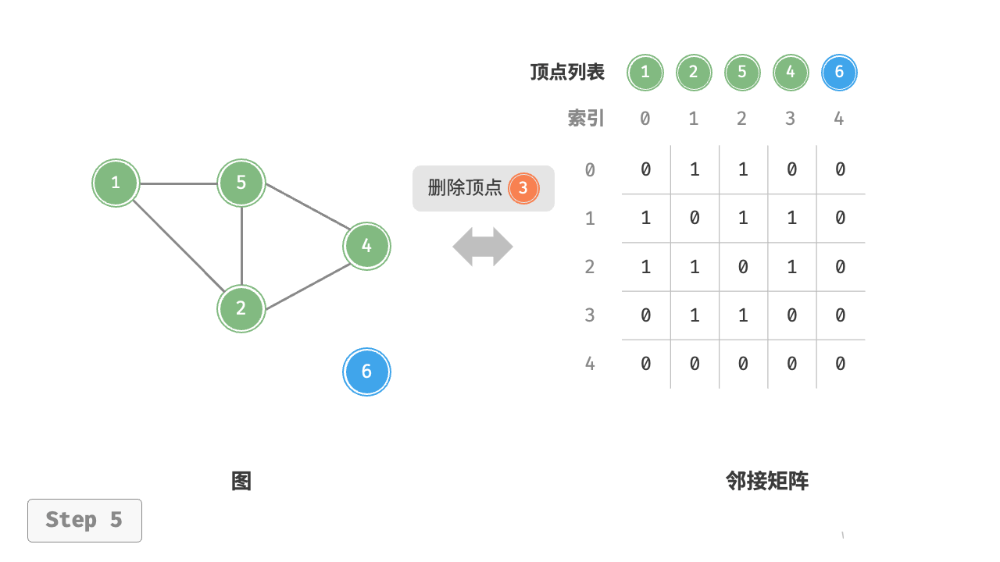

:::


```python
class GraphAdjMat:
    """基于邻接矩阵实现的无向图类"""

    def __init__(self, vertices: list[int], edges: list[list[int]]):
        """构造方法，初始化图，接收顶点和边的列表"""
        # 顶点列表，存储图中的顶点值，元素代表“顶点值”，索引代表“顶点索引”
        self.vertices: list[int] = []
        # 邻接矩阵，用二维列表表示图的顶点之间的连接情况，行列索引对应“顶点索引”
        self.adj_mat: list[list[int]] = []
        # 遍历传入的顶点值，依次添加到顶点列表中
        for val in vertices:
            self.add_vertex(val)
        # 遍历传入的边列表，依次在邻接矩阵中添加这些边
        for e in edges:
            self.add_edge(e[0], e[1])

    def size(self) -> int:
        """获取顶点数量"""
        # 返回顶点列表的长度，即图中顶点的数量
        return len(self.vertices)

    def add_vertex(self, val: int):
        """添加顶点"""
        # 获取当前图的顶点数量，方便扩展邻接矩阵
        n = self.size()
        # 将新顶点的值添加到顶点列表中
        self.vertices.append(val)
        # 创建一个新的行（即新顶点与其他顶点的连接状态），初始化为 0
        new_row = [0] * (n + 1)  # 新行需要有 n+1 列，因为新增了一个顶点
        # 将新行添加到邻接矩阵中，表示与其他顶点的连接状态
        self.adj_mat.append(new_row)
        # 遍历现有的邻接矩阵，为每一行添加一个新列，表示新顶点的加入
        for row in self.adj_mat[:-1]:  # 最后一行是刚刚添加的，因此不需要再修改
            row.append(0)

    def remove_vertex(self, index: int):
        """删除指定索引的顶点"""
        # 检查索引是否越界，如果越界则抛出异常
        if index >= self.size() or index < 0:
            raise IndexError(f"顶点索引 {index} 超出范围。")
        # 从顶点列表中移除索引为 index 的顶点
        self.vertices.pop(index)
        # 从邻接矩阵中移除对应的行，表示删除该顶点的所有连接
        self.adj_mat.pop(index)
        # 从邻接矩阵中移除对应的列，删除该顶点与其他顶点的连接
        for row in self.adj_mat:
            row.pop(index)

    def add_edge(self, i: int, j: int):
        """添加边"""
        # 检查顶点索引 i 和 j 是否越界
        if i < 0 or j < 0 or i >= self.size() or j >= self.size():
            raise IndexError(f"顶点索引 {i} 或 {j} 超出范围。")
        # 检查是否尝试添加自环（即从顶点 i 到自身的边）
        if i == j:
            raise ValueError(f"不允许添加从顶点 {i} 到自身的边。")
        # 在无向图中，邻接矩阵关于主对角线对称，因此需要设置两个位置的值为 1
        self.adj_mat[i][j] = 1
        self.adj_mat[j][i] = 1

    def remove_edge(self, i: int, j: int):
        """删除边"""
        # 检查顶点索引 i 和 j 是否越界
        if i < 0 or j < 0 or i >= self.size() or j >= self.size():
            raise IndexError(f"顶点索引 {i} 或 {j} 超出范围。")
        # 检查是否尝试删除自环
        if i == j:
            raise ValueError(f"不允许删除从顶点 {i} 到自身的边。")
        # 删除边，在邻接矩阵中将两个位置的值设为 0
        self.adj_mat[i][j] = 0
        self.adj_mat[j][i] = 0

    def print_matrix(self):
        """打印邻接矩阵"""
        # 遍历邻接矩阵的每一行
        for row in self.adj_mat:
            # 将行中的元素拼接成字符串输出，每个元素之间用空格分隔
            print(" ".join(map(str, row)))

    def print(self):
        """打印顶点列表和邻接矩阵"""
        # 输出顶点列表
        print("顶点列表 =", self.vertices)
        # 输出邻接矩阵的标题
        print("邻接矩阵 =")
        # 调用内部的 print_matrix 方法，输出矩阵内容
        self.print_matrix()
        
if __name__ == "__main__":
    # 初始化无向图
    vertices = [1, 3, 2, 5, 4]
    edges = [[0, 1], [0, 3], [1, 2], [2, 3], [2, 4], [3, 4]]
    graph = GraphAdjMat(vertices, edges)

    # 添加边
    # 顶点 1, 2 的索引分别为 0, 2
    graph.add_edge(0, 2)

    # 删除边
    # 顶点 1, 3 的索引分别为 0, 1
    graph.remove_edge(0, 1)

    # 添加顶点
    graph.add_vertex(6)

    # 删除顶点
    # 顶点 3 的索引为 1
    graph.remove_vertex(1)
    graph.print()
```


### 4.3 DFS

```python
class GraphAdjMat:
    """基于邻接矩阵实现的无向图类"""

    def __init__(self, vertices: list[int], edges: list[list[int]]):
        """构造方法"""
        # 顶点列表，元素代表“顶点值”，索引代表“顶点索引”
        self.vertices: list[int] = []
        # 邻接矩阵，行列索引对应“顶点索引”
        self.adj_mat: list[list[int]] = []
        # 添加顶点
        for val in vertices:
            self.add_vertex(val)
        # 添加边
        # 请注意，edges 元素代表顶点索引，即对应 vertices 元素索引
        for e in edges:
            self.add_edge(e[0], e[1])

    def size(self) -> int:
        """获取顶点数量"""
        return len(self.vertices)

    def add_vertex(self, val: int):
        """添加顶点"""
        n = self.size()
        self.vertices.append(val)
        new_row = [0] * (n+1)
        self.adj_mat.append(new_row)
        for row in self.adj_mat[:-1]:
            row.append(0)


    def remove_vertex(self, index: int):
        """删除顶点"""
        if index >= self.size() or index < 0:
            raise Exception(f"顶点索引{index}超出范围。")
        self.vertices.pop(index)
        self.adj_mat.pop(index)
        for row in self.adj_mat:
            row.pop(index)


    def add_edge(self, i: int, j: int):
        """添加边"""
        if i < 0 or i >= self.size() or j < 0 or j >= self.size():
            raise IndexError(f"顶点索引{i}和{j}超储范围。")
        if i == j:
            raise ValueError(f"不允许添加从顶点{i}到自身的边")
        self.adj_mat[i][j] = 1
        self.adj_mat[j][i] = 1


    def remove_edge(self, i: int, j: int):
        """删除边"""
        if i < 0 or i >= self.size() or j < 0 or j>= self.size():
            raise IndexError(f"顶点索引{i}和{j}超储范围。")
        if i == j:
            raise ValueError(f"不允许删除从顶点{i}到自身的边")
        self.adj_mat[i][j] = 0
        self.adj_mat[j][i] = 0


    def print_matrix(self):
        """打印邻接矩阵"""
        for row in self.adj_mat:
            print(" ".join(map(str, row)))

    def print(self):
        """打印邻接矩阵和顶点列表"""
        print("顶点列表 =", self.vertices)
        print("邻接矩阵 =")
        self.print_matrix()

    def dfs_recursive(self, start: int, visited: list[bool]):
    """递归方式实现 DFS"""
    visited[start] = True  # 标记当前顶点为已访问
    print(self.vertices[start], end=" ")  # 输出当前顶点
    
    # 遍历所有与当前顶点相连的顶点
    for neighbor, is_connected in enumerate(self.adj_mat[start]):
        if is_connected and not visited[neighbor]:  # 如果有连接且未访问
            self.dfs_recursive(neighbor, visited)  # 递归访问该顶点


    def dfs(self, start_vertex: int):
        """调用 DFS 遍历"""
        visited = [False] * self.size()  # 初始化所有顶点都未访问
        start_index = self.vertices.index(start_vertex)  # 获取起始顶点的索引
        self.dfs_recursive(start_index, visited)  # 从起始顶点开始递归遍历
        print()  # 打印结果后的换行


if __name__ == "__main__":
    # 初始化无向图
    vertices = [1, 3, 2, 5, 4]
    edges = [[0, 1], [0, 3], [1, 2], [2, 3], [2, 4], [3, 4]]
    graph = GraphAdjMat(vertices, edges)

    # 添加边
    # 顶点 1, 2 的索引分别为 0, 2
    graph.add_edge(0, 2)

    # 删除边
    # 顶点 1, 3 的索引分别为 0, 1
    graph.remove_edge(0, 1)

    # 添加顶点
    graph.add_vertex(6)

    # 删除顶点
    # 顶点 3 的索引为 1
    graph.remove_vertex(1)
    graph.print()

def test_graph_adjmat_dfs():
    print("=== 测试1：简单图 ===")
    # 创建图
    vertices = [0, 1, 2, 3, 4]
    edges = [[0, 1], [0, 2], [1, 3], [2, 4]]
    graph = GraphAdjMat(vertices, edges)
    graph.print()  # 打印邻接矩阵
    print("DFS 从顶点 0 开始：")
    graph.dfs(0)   # 从顶点 0 开始进行 DFS 遍历，预期输出 0 1 3 2 4

    print("\n=== 测试2：环形图 ===")
    # 创建一个环形图
    vertices = [0, 1, 2, 3]
    edges = [[0, 1], [1, 2], [2, 3], [3, 0]]
    graph = GraphAdjMat(vertices, edges)
    graph.print()  # 打印邻接矩阵
    print("DFS 从顶点 0 开始：")
    graph.dfs(0)   # 从顶点 0 开始进行 DFS 遍历，预期输出 0 1 2 3

    print("\n=== 测试3：不连通图 ===")
    # 创建不连通的图
    vertices = [0, 1, 2, 3, 4]
    edges = [[0, 1], [2, 3]]
    graph = GraphAdjMat(vertices, edges)
    graph.print()  # 打印邻接矩阵
    print("DFS 从顶点 0 开始：")
    graph.dfs(0)   # 从顶点 0 开始进行 DFS 遍历，预期输出 0 1
    print("DFS 从顶点 2 开始：")
    graph.dfs(2)   # 从顶点 2 开始进行 DFS 遍历，预期输出 2 3

    print("\n=== 测试4：单一顶点 ===")
    # 创建只有一个顶点的图
    vertices = [0]
    edges = []
    graph = GraphAdjMat(vertices, edges)
    graph.print()  # 打印邻接矩阵
    print("DFS 从顶点 0 开始：")
    graph.dfs(0)   # 从顶点 0 开始进行 DFS 遍历，预期输出 0
```


### 4.4 BFS

```python
class GraphAdjMat:
    """基于邻接矩阵实现的无向图类"""

    def __init__(self, vertices: list[int], edges: list[list[int]]):
        """构造方法"""
        # 顶点列表，元素代表“顶点值”，索引代表“顶点索引”
        self.vertices: list[int] = []
        # 邻接矩阵，行列索引对应“顶点索引”
        self.adj_mat: list[list[int]] = []
        # 添加顶点
        for val in vertices:
            self.add_vertex(val)
        # 添加边
        # 请注意，edges 元素代表顶点索引，即对应 vertices 元素索引
        for e in edges:
            self.add_edge(e[0], e[1])

    def size(self) -> int:
        """获取顶点数量"""
        return len(self.vertices)

    def add_vertex(self, val: int):
        """添加顶点"""
        n = self.size()
        self.vertices.append(val)
        new_row = [0] * (n+1)
        self.adj_mat.append(new_row)
        for row in self.adj_mat[:-1]:
            row.append(0)


    def remove_vertex(self, index: int):
        """删除顶点"""
        if index >= self.size() or index < 0:
            raise Exception(f"顶点索引{index}超出范围。")
        self.vertices.pop(index)
        self.adj_mat.pop(index)
        for row in self.adj_mat:
            row.pop(index)


    def add_edge(self, i: int, j: int):
        """添加边"""
        if i < 0 or i >= self.size() or j < 0 or j >= self.size():
            raise IndexError(f"顶点索引{i}和{j}超储范围。")
        if i == j:
            raise ValueError(f"不允许添加从顶点{i}到自身的边")
        self.adj_mat[i][j] = 1
        self.adj_mat[j][i] = 1


    def remove_edge(self, i: int, j: int):
        """删除边"""
        if i < 0 or i >= self.size() or j < 0 or j>= self.size():
            raise IndexError(f"顶点索引{i}和{j}超储范围。")
        if i == j:
            raise ValueError(f"不允许删除从顶点{i}到自身的边")
        self.adj_mat[i][j] = 0
        self.adj_mat[j][i] = 0


    def print_matrix(self):
        """打印邻接矩阵"""
        for row in self.adj_mat:
            print(" ".join(map(str, row)))

    def print(self):
        """打印邻接矩阵和顶点列表"""
        print("顶点列表 =", self.vertices)
        print("邻接矩阵 =")
        self.print_matrix()

    def dfs_recursive(self, start: int, visited: list[bool]):
        """递归方式实现 DFS"""
        visited[start] = True  # 标记当前顶点为已访问
        print(self.vertices[start], end=" ")  # 输出当前顶点

        # 遍历所有与当前顶点相连的顶点
        for neighbor, is_connected in enumerate(self.adj_mat[start]):
            if is_connected and not visited[neighbor]:  # 如果有连接且未访问
                self.dfs_recursive(neighbor, visited)  # 递归访问该顶点


    def dfs(self, start_vertex: int):
        """调用 DFS 遍历"""
        visited = [False] * self.size()  # 初始化所有顶点都未访问
        start_index = self.vertices.index(start_vertex)  # 获取起始顶点的索引
        self.dfs_recursive(start_index, visited)  # 从起始顶点开始递归遍历
        print()  # 打印结果后的换行


    def bfs(self, start_vertex: int):
        # 获取起始顶点在列表中的索引
        start_index = self.vertices.index(start_vertex)
        queue = [start_index]  # 使用列表模拟队列
        # 初始化所有顶点状态为空
        visited = [False] * self.size()
        # 标记顶点为已经访问
        visited[start_index] = True
        # 当队列不为空时，进行遍历
        while queue:
            # 模拟队列，从队列中取出头部顶点。
            vertex = queue.pop(0)
            # 打印当前节点的值
            print(self.vertices[vertex], end='')
            # 遍历当前节点的所有与之有边的邻节点
            for neighbor, is_connect in enumerate(self.adj_mat[vertex]):
                # 如果存在邻节点且没有被访问过
                if not visited[neighbor] and is_connect:
                    visited[neighbor] = True
                    queue.append(neighbor)
        print()   # 只为换行
            
        


if __name__ == "__main__":
    # 初始化无向图
    vertices = [1, 3, 2, 5, 4]
    edges = [[0, 1], [0, 3], [1, 2], [2, 3], [2, 4], [3, 4]]
    graph = GraphAdjMat(vertices, edges)

    # 添加边
    # 顶点 1, 2 的索引分别为 0, 2
    graph.add_edge(0, 2)

    # 删除边
    # 顶点 1, 3 的索引分别为 0, 1
    graph.remove_edge(0, 1)

    # 添加顶点
    graph.add_vertex(6)

    # 删除顶点
    # 顶点 3 的索引为 1
    graph.remove_vertex(1)
    graph.print()

def test_graph_adjmat_dfs():
    print("=== 测试1：简单图 ===")
    # 创建图
    vertices = [0, 1, 2, 3, 4]
    edges = [[0, 1], [0, 2], [1, 3], [2, 4]]
    graph = GraphAdjMat(vertices, edges)
    graph.print()  # 打印邻接矩阵
    print("DFS 从顶点 0 开始：")
    graph.dfs(0)   # 从顶点 0 开始进行 DFS 遍历，预期输出 0 1 3 2 4

    print("\n=== 测试2：环形图 ===")
    # 创建一个环形图
    vertices = [0, 1, 2, 3]
    edges = [[0, 1], [1, 2], [2, 3], [3, 0]]
    graph = GraphAdjMat(vertices, edges)
    graph.print()  # 打印邻接矩阵
    print("DFS 从顶点 0 开始：")
    graph.dfs(0)   # 从顶点 0 开始进行 DFS 遍历，预期输出 0 1 2 3

    print("\n=== 测试3：不连通图 ===")
    # 创建不连通的图
    vertices = [0, 1, 2, 3, 4]
    edges = [[0, 1], [2, 3]]
    graph = GraphAdjMat(vertices, edges)
    graph.print()  # 打印邻接矩阵
    print("DFS 从顶点 0 开始：")
    graph.dfs(0)   # 从顶点 0 开始进行 DFS 遍历，预期输出 0 1
    print("DFS 从顶点 2 开始：")
    graph.dfs(2)   # 从顶点 2 开始进行 DFS 遍历，预期输出 2 3

    print("\n=== 测试4：单一顶点 ===")
    # 创建只有一个顶点的图
    vertices = [0]
    edges = []
    graph = GraphAdjMat(vertices, edges)
    graph.print()  # 打印邻接矩阵
    print("DFS 从顶点 0 开始：")
    graph.dfs(0)   # 从顶点 0 开始进行 DFS 遍历，预期输出 0
```


