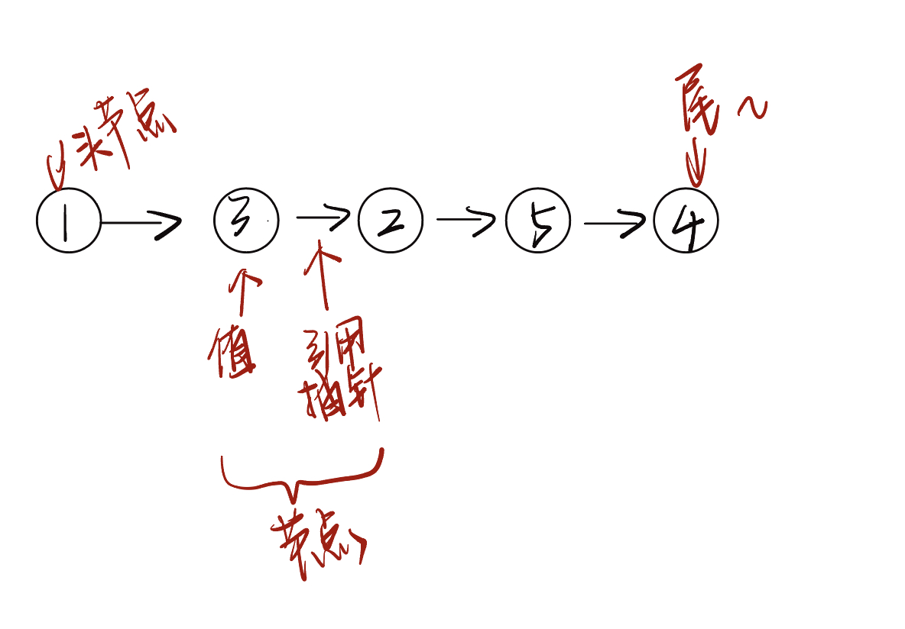
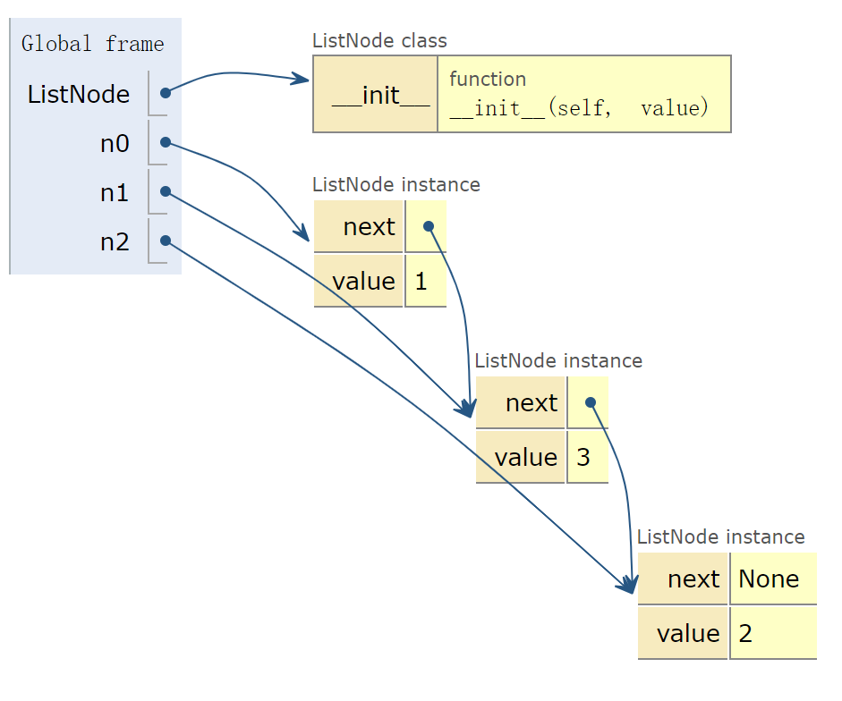
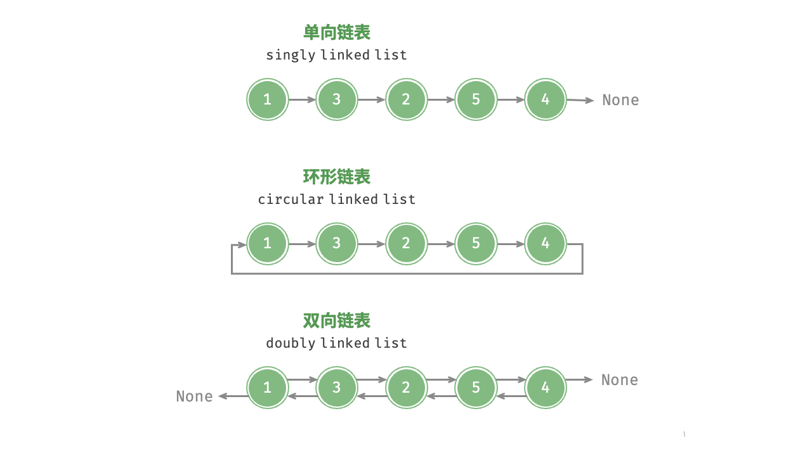

## 1. Stacks

栈（stack）是一种遵循先入后出逻辑的线性数据结构。

我们可以将栈类比为桌面上的一摞盘子，如果想取出底部的盘子，则需要先将上面的盘子依次移走。我们将盘子替换为各种类型的元素（如整数、字符、对象等），就得到了栈这种数据结构。

我们把堆叠元素的顶部称为“栈顶”，底部称为“栈底”。将把元素添加到栈顶的操作叫作“入栈”，删除栈顶元素的操作叫作“出栈”。

```python
class Stack:
    def __init__(self):
        self.stack = []

    def is_empty(self):
        # 判断栈是否为空
        return len(self.stack) == 0

    def push(self, item):
        # 入栈操作，将元素添加到栈顶
        self.stack.append(item)

    def pop(self):
        # 出栈操作，弹出栈顶元素
        if not self.is_empty():
            self.stack.pop()
        else:
            raise IndexError('pop from an empty stack')  # 手动报错

    def peek(self):
        # 查看栈顶元素但不弹出
        if not self.is_empty():
            return self.stack[-1]
        else:
            raise IndexError('empty stack')  # 手动报错

    def size(self):
        # 返回栈的大小
        return len(self.stack)


# 示例
stack = Stack()
stack.push(10)
stack.push(20)
stack.push(30)

print("栈顶元素:", stack.peek())  # 输出 30
print("栈大小:", stack.size())  # 输出 3

stack.pop()  # 弹出 30
print("弹出后的栈顶元素:", stack.peek())  # 输出 20


# output
栈顶元素: 30
栈大小: 3
弹出后的栈顶元素: 20
```


## 2. Queues

队列（queue）是一种遵循先入先出规则的线性数据结构。顾名思义，队列模拟了排队现象，即新来的人不断加入队列尾部，而位于队列头部的人逐个离开。

我们将队列头部称为“队首”，尾部称为“队尾”，将把元素加入队尾的操作称为“入队”，删除队首元素的操作称为“出队”。


```python
class Queue:
    def __init__(self):
        self.queue = []

    def is_empty(self):
        # 判断队列是否为空
        return len(self.queue) == 0

    def enqueue(self, item):
        # 入队操作，将元素添加到队列末尾
        self.queue.append(item)

    def dequeue(self):
        # 出队操作，移除并返回队列头部的元素
        if not self.is_empty():
            self.queue.pop(0)
        else:
            raise IndexError('pop from an empty queue')

    def front(self):
        # 返回队列头部元素但不移除
        if not self.is_empty():
            return self.queue[0]
        else:
            raise IndexError('empty queue')

    def size(self):
        # 返回队列的大小
        return len(self.queue)

# 示例
queue = Queue()
queue.enqueue(10)
queue.enqueue(20)
queue.enqueue(30)

print("队列头部元素:", queue.front())  # 输出 10
print("队列大小:", queue.size())      # 输出 3

queue.dequeue()  # 移除 10
print("移除后的队列头部元素:", queue.front())  # 输出 20
```


## 3. List 

链表（Linked List）是一种线性数据结构，其中的每一个元素都是一个节点对象，各个节点通过“引用”相连接，引用记录了下一个节点的内存地址，通过它可以从当前的节点访问到下一个节点。链表的设计使得各个节点可以分散存储在内存的各处，他们的内存地址无需连接。



### 3.1 基础代码

::: tabs 单向链表

@tab 构建元素

```python
class ListNode:
    def __init__(self, value):
        self.value = value
        self.next: ListNode | None = None

n0 = ListNode(1)
n1 = ListNode(3)
n2 = ListNode(2)
```

- Python tutor

    


@tab 连接元素

```python
class ListNode:
    def __init__(self, value):
        self.value = value
        self.next: ListNode | None = None

n0 = ListNode(1)
n1 = ListNode(3)
n2 = ListNode(2)
n0.next = n1
n1.next = n2
```

- Python tutor

    

:::

::: tabs 双向链表

```python
class ListNode:
    def __init__(self, value):
        self.value = value
        self.prev: ListNode | None = None  # 前驱节点
        self.next: ListNode | None = None  # 后继节点


n0 = ListNode(1)
n1 = ListNode(3)
n2 = ListNode(2)

n0.next = n1
n1.prev = n0
n1.next = n2
n2.prev = n1
```

:::



### 3.2 插入

```python
class ListNode:
    def __init__(self, value):
        self.value = value
        self.next: ListNode | None = None

def insert(n0: ListNode, P: ListNode):
    """在链表的节点 n0 之后插入节点 P"""
    n1 = n0.next
    P.next = n1
    n0.next = P

n0 = ListNode(1)
n1 = ListNode(3)
n2 = ListNode(2)
n3 = ListNode(5)
n4 = ListNode(4)
n0.next = n1
n1.next = n2
n2.next = n3
n3.next = n4
```


### 3.3 删除

```python
class ListNode:
    def __init__(self, value):
        self.value = value
        self.next: ListNode | None = None


def remove(n0):
    if n0.next == None:
        return None
    else:
        n0.next = n0.next.next
        return


# 初始化链表的各个节点
n0 = ListNode(1)
n1 = ListNode(3)
n2 = ListNode(2)
n3 = ListNode(5)
n4 = ListNode(4)
n0.next = n1
n1.next = n2
n2.next = n3
n3.next = n4

# 删除 n2
remove(n0)
```


### 3.4 查找索引

```python
class ListNode:
    def __init__(self, value):
        self.value = value
        self.next: ListNode | None = None


def access(head, index):
    for i in range(index):
        if head is None:
            return None
        else:
            head = head.next
    return head

# 初始化链表的各个节点
n0 = ListNode(1)
n1 = ListNode(3)
n2 = ListNode(2)
n3 = ListNode(5)
n4 = ListNode(4)
n0.next = n1
n1.next = n2
n2.next = n3
n3.next = n4


# 访问节点
node = access(n0, 1)
print(f"链表中索引 1 处的节点的值为{node.value}")
```


### 3.5 查找值

```python
class ListNode:
    def __init__(self, value):
        self.value = value
        self.next: ListNode | None = None

def find(head: ListNode, target: int) -> int:
    index = 0
    while head is not None:
        if head.value == target:
            return index
        else:
            head = head.next
            index += 1


n0 = ListNode(1)
n1 = ListNode(3)
n2 = ListNode(2)
n3 = ListNode(5)
n4 = ListNode(4)
n0.next = n1
n1.next = n2
n2.next = n3
n3.next = n4

find_index = find(n0, 1)
print(f"找到首个值为 1 的节点，在链表的{find_index}号位")
```


