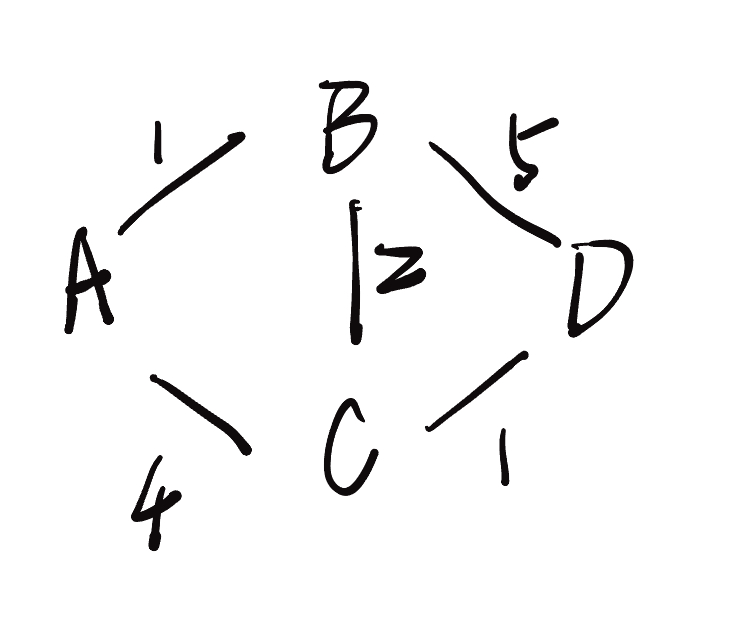
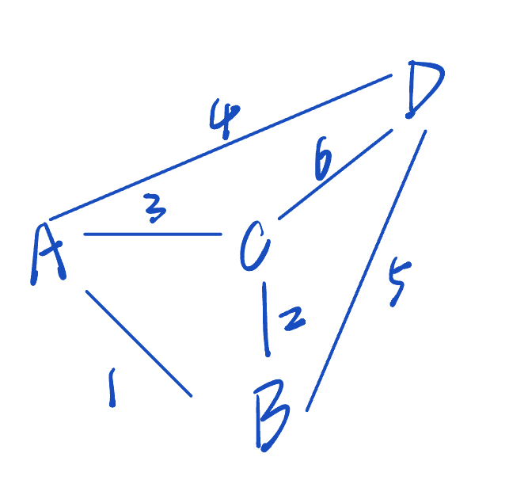

## 1. Dijkstra’s algorithm

算法目标和使用场景
使用 Dijkstra 算法，可以寻找图中节点之间的最短路径。特别是，可以在图中寻找一个节点（称为“源节点”）到所有其它节点的最短路径，生成一个最短路径树。

GPS 设备使用这个算法来寻找当前位置到目标位置的最短路径。Dijkstra 算法被广泛应用在工业上，尤其是需要建模网络的领域。

### 1.1 基础知识

1. Dijkstra‘s 算法从指定的节点（源节点）出发，寻找它与图中所有其他节点之间的最短路径。
2. Dijkstra’s 算法会记录当前已知最短路径，并在寻找更短的路径时更新。
3. 一旦找到源节点与其他节点之间的最短路径，那个节点会被标记为“已访问”并添加到路径中。
4. 重复寻找过程，直到图中所有节点都已经添加到路径中，这样就可以得到从源节点出发访问所有其他节点的最短路径方案。

必要条件：

Dijkstra’s  只能用在权重为正的图中，因为计算过程中需要权重相加来寻找最短路径。

如果图中有负权重的边，这个算法就无法正常工作。

一旦一个节点被标记为已访问，当前访问它的路径就被标记为访问它的最小路径。

如果存在负权重，则可能在之后的计算中得到总权重更小的路径，从而影响之前的结果（TIPs：即可能出现多绕路反而路线更短的情况，不合实际）


### 1.2 完整代码

```python
import heapq


def dijkstra(graph, start):
    # 初始化距离表，将所有节点的初始距离设为无限大
    # 意思是开始时假定所有节点都不可达
    distances = {node: float('inf') for node in graph}
    distances[start] = 0  # 起始点回到自身的距离为0

    # 创建一个优先级队列，存放待处理的点
    priority_queue = [(0, start)]

    # 循环处理优先级队列中的节点
    while priority_queue:
        # 弹出距离最小的节点
        current_distance, current_node = heapq.heappop(priority_queue)

        # 如果弹出的节点距离大于已知最短距离，则跳过该节点（已经找到更短路径）
        if current_distance > distances[current_node]:
            continue

        # 遍历当前节点的所有邻居节点
        for neighbor, weight in graph[current_node].items():
            # 计算从当前节点到邻居节点的距离
            distance = current_distance + weight

            # 如果找到到达邻居节点的更短路径，更新距离表
            if distance < distances[neighbor]:
                distances[neighbor] = distance  # 更新距离表
                # 将邻居节点和新的距离加入优先队列
                heapq.heappush(priority_queue, (distance, neighbor))

        # 返回从起点到各节点的最短距离
    return distances


# 示例图
graph = {
    'A': {'B': 1, 'C': 4},
    'B': {'A': 1, 'C': 2, 'D': 5},
    'C': {'A': 4, 'B': 2, 'D': 1},
    'D': {'B': 5, 'C': 1}
}

# 从起点A运行 Dikjkatra 算法，计算到所有其他节点的最短路径
start_node = 'A'
shortest_path = dijkstra(graph, start_node)

# 输出从起点到其他所有结点的最短距离
print(f'从节点{start_node}到其他节点的最短距离为：')
for node, distance in shortest_path.items():
    print(f"{start_node}->{node}: {distance}")
```


### 1.3 图示说明




1. 初始点：A，对自己的初始距离为 0 ，与其他所有顶点的距离都是无穷大。
2. A ——> B
    - 直接路径：A -> B  距离：1
    - 其他路径：
        - 1. A -> C -> B 距离：6
        - 2. A -> C -> D -> B 距离：10
    - 选择：直接路径
3. A ——> C
    - 直接路径：A -> C 距离：4
    - 其他路径：
        - 1. A -> B -> C 距离：3
        - 2. A -> B -> D -> C 距离：7
    - 选择：其他路径1
4. A ——> D
    - 1. A  -> C -> D 距离5
        2. A -> B -> D 距离6
        3. A -> C -> B -> D 距离11
        4. A -> B -> C -> D 距离4
    - 选择：路径 4


## 2. Prim’s algorithm

prim’s algorithm 是一个常用的最小生成树算法。

### 2.1 什么是生成树？

在图论中，一个生成树是包含了图中所有顶点并连接在一起的子图。最小生成树（Minimum Spanning Tree）是一种生成树，且它的边的权值总和最小。简单来说，最小生成树是找到连接所有节点的最低成本路径。

举个例子：假设我们有一些城市，城市之间有道路连接，每条路的建设成本不同。我们希望以最小的建设成本连接所有城市，这时就可以用最小生成树算法来找到最低成本的连接方案。


### 2.2 Prim's algorithm 是什么？

Prim's 算法是一种贪心算法，用来求解加权无向连接图的最小生成树。Prim‘s 算法每次都从已经连接的节点中选择一条最短的边来进行扩张，直到所有节点都被包括在内。


### 2.3 Prim's 算法的基本思想

- 开始，选择一个起点，并把它加入到生成树当中
- 逐步扩展：每次从当前生成树中找出一个连接到树外界点的权重边，将该边和该节点加入生成树。
- 重复这个过程，直到所有节点都加入到生成树中。


### 2.4 Prim 算法的步骤

假设我们有一个图 $G = (V, E)$，其中 $V$ 是节点集合，$E$ 是边集合，边的权重用 $w$ 表示。

1. **初始化**：从任意一个节点开始，记为节点 $v_0$。
2. **选择边**：找到一个**连接生成树**和**未连接节点**的最小权重边，将该边和对应的节点加入生成树。
3. **重复选择**：重复上一步，直到所有节点都在生成树中。


### 2.5 举个例子



- Step 1：初始化
    - 起始节点，选择节点A ，加入生成树。
    - 已加入节点：{A}
    - 候选边：
        - A – B(1) ; 
        - A – C(3) ; 
        - A – D(4)

- Step 2：选择最小权重边
    - 从候选边中选择权重最小的边 A – B
    - 加入生成树：边 A – B ；节点 B
    - 已加入节点：{A，B}
    - 更新后选边：
        - A – C(3) ;
        - A – D(4) ;
        - B – C(2) ;
        - B – D(5) ;
- Step 3：继续选择最小边
    - 选择权重最小的候选边：B – C
    - 加入最小生成树：边 B – C；节点 C
    - 已加入的节点：{A，B，C}
    - 更新后的选边
        - C – D(6) ;
        - A – D(4) ;
        - B – D(5) ;

- Step 4 :
    - 选择权重最小的边 A – D
    - 加入最小生成树：边 A – D；节点 D
    - 已加入的节点：{A，B，C，D}
    - 所有节点都加入，结束。

- 总结：

    现在最小生成树里的节点和边有：

    - A – B   1
    - B – C   2
    - A – D   4
    - 总长度：7


### 2.6 例子实现

```python
# 导入 heapq 模块，用于实现最小堆（优先队列）
import heapq

def prim(graph, start):
    """
    使用 Prim 算法计算最小生成树（MST）

    参数：
    graph - 图的邻接表表示，格式为 {节点: [(邻居节点, 边的权重), ...]}
    start - 起始节点

    返回：
    mst - 最小生成树的边集合，格式为 [(节点1, 节点2, 权重), ...]
    total_weight - 最小生成树的总权重
    """

    # 初始化最小生成树的边集合为空列表
    mst = []
    # 初始化最小生成树的总权重为 0
    total_weight = 0

    # 创建一个集合来存储已访问过的节点，初始时只包含起始节点
    visited = set([start])

    # 创建一个最小堆（优先队列）来存储候选边，初始为空
    min_heap = []

    # 将起始节点的所有边加入最小堆
    # 遍历起始节点的所有邻居节点
    for neighbor, weight in graph[start]:
        # 将边的信息作为元组 (权重, 起始节点, 目标节点) 加入最小堆
        heapq.heappush(min_heap, (weight,start, neighbor))

    # 当最小堆不为空时，继续循环
    while min_heap:
        # 从最小堆中弹出权重最小的边
        weight, frm, to = heapq.heappop(min_heap)


        # 如果目标节点已经被访问过，跳过该边（避免形成环）
        if to in visited:
            continue


        # 将该边加入最小生成树的边集合
        mst.append((frm, to, weight))
        # 更新最小生成树的总权重
        total_weight += weight
        # 将目标节点标记为已访问
        visited.add(to)

        # 遍历目标节点的所有邻居节点
        for neighbor, w in graph[to]:
            # 如果邻居节点未被访问过，将边加入最小堆
            if neighbor not in visited:
                heapq.heappush(min_heap, (w, to, neighbor))

    # 返回最小生成树的边集合和总权重
    return mst, total_weight

# 测试代码
if __name__ == "__main__":
    # 定义图，使用邻接表表示，每个节点对应一个列表，列表中包含其邻居节点和边的权重
    graph = {
        'A': [('B', 1), ('C', 3), ('D', 4)],
        'B': [('A', 1), ('C', 2), ('D', 5)],
        'C': [('A', 3), ('B', 2), ('D', 6)],
        'D': [('A', 4), ('B', 5), ('C', 6)],
    }

    # 调用 prim 函数，指定起始节点为 'A'
    mst, total_weight = prim(graph, 'A')

    # 输出最小生成树的边
    print("最小生成树的边：")
    # 遍历最小生成树的边集合
    for edge in mst:
        # edge 是一个包含 (起始节点, 目标节点, 权重) 的元组
        print(f"{edge[0]} - {edge[1]} 权重: {edge[2]}")

    # 输出最小生成树的总权重
    print(f"最小生成树的总权重: {total_weight}")
```

