## 1. 算法效率评估

在算法设计中，我们先后追求以下两个层面的目标。

1. **找到问题的解决方法：**算法需要在规定的输入范围内可靠地求的问题的正确解。
2. **寻求最优解法：**同一个问题可能存在多种解法，我们希望找到尽可能高效的算法。

也就是说，在能够解决问题的前提下，算法效率已经成为衡量算法优劣的主要评价标准，它包括以下两个维度。

- **时间效率：**算法运行的时间长短
- **空间效率：**算法占用的内存大小

简而言之，**我们的目标是设计“既快又省”的数据结构与算法。**而有效评估算法效率至关重要。因为只有这样，我们才能将各种算法进行对比，进而指导算法设计和优化的过程。

效率评估方法分为两种：实际测试，理论估算。

### 1.1 实际测试

假设我们现在有算法 `A` 和算法 `B` ，它们都能解决同一问题，现在需要对比这两个算法的效率。最直接的方法是找一台计算机，运行这两个算法，并监控记录它们的运行时间和内存占用情况。这种评估方式能够反映真实情况，但也存在较大的局限性。

一方面，**难以排除测试环境的干扰因素**。硬件配置会影响算法的性能表现。比如一个算法的并行度较高，那么它就更适合在多核 CPU 上运行，一个算法的内存操作密集，那么它在高性能内存上的表现就会更好。也就是说，算法在不同的机器上的测试结果可能是不一致的。这意味着我们需要在各种机器上进行测试，统计平均效率，而这是不现实的。

另一方面，**展开完整测试非常耗费资源**。随着输入数据量的变化，算法会表现出不同的效率。例如，在输入数据量较小时，算法 `A` 的运行时间比算法 `B` 短；而在输入数据量较大时，测试结果可能恰恰相反。因此，为了得到有说服力的结论，我们需要测试各种规模的输入数据，而这需要耗费大量的计算资源。

### 1.2 理论估算

由于实际测试具有较大的局限性，因此我们可以考虑仅通过一些计算来评估算法的效率。这种估算方法被称为渐近复杂度分析（asymptotic complexity analysis），简称复杂度分析。

复杂度分析能够体现算法运行所需的时间和空间资源与输入数据大小之间的关系。**它描述了随着输入数据大小的增加，算法执行所需时间和空间的增长趋势**。这个定义有些拗口，我们可以将其分为三个重点来理解。

- 时间和空间资源分别对应了时间复杂度（time complexity）和空间复杂度（space complexity）
- 随着输入数据大小的增加 意味着复杂度反映了算法运行效率与输入数据体谅之间的关系。
- 时间和空间的增长趋势 表示复杂度分析关注的不是运行时间或占用内存的具体值，而是时间或空间增长的“快慢”

**复杂度分析客服了实际测试方法的弊端。**体现在：

- 它无需实际运行代码，更加绿色节能。
- 它独立于测试环境，分析结果适用于所有运行平台。
- 它可以体现不同数据量下的算法效率，尤其在大数据量下的算法性能。

::: tip

如果你仍对复杂度的概念感到困惑，无须担心，我们会在后续章节中详细介绍。

:::

复杂度分析为我们提供了一把评估算法效率的“标尺”，使我们可以衡量执行某个算法所需的时间和空间资源，对比不同算法之间的效率。

复杂度是个数学概念，对于初学者可能比较抽象，学习难度相对较高。从这个角度看，复杂度分析可能不太适合作为最先介绍的内容。然而，当我们讨论某个数据结构或算法的特点时，难以避免要分析其运行速度和空间使用情况。

综上所述，建议你在深入学习数据结构与算法之前，**先对复杂度分析建立初步的了解，以便能够完成简单算法的复杂度分析**。


## 2. 迭代与递归

在算法中，重复执行某个任务是很常见的，它与复杂度分析息息相关。因此，在介绍时间复杂度和空间复杂度之前，我们先来了解如何在程序中实现重复执行任务，即两种基本的程序控制结构：迭代、递归。

### 2.1 迭代

迭代（iteration）是一种重复执行某个任务的控制结构。在迭代中，程序会在满足一定的条件下重复执行某段代码，直到这个条件不再满足。

#### 2.1.1 for 循环

`for` 循环是最常见的迭代形式之一，**适合在预先知道迭代次数时使用**。

以下函数基于 `for` 循环实现了求和 $1 + 2 + \dots + n$，求和结果使用变量 `res` 记录。需要注意的是，Python 中 `range(a, b)` 对应的区间是“左闭右开”的，对应的遍历范围为 $a, a + 1, \dots, b - 1$：

```python
def for_loop(n: int) -> int:
    """for 循环"""
    res = 0
    # 循环求和 1, 2, ..., n-1, n
    for i in range(1, n + 1):
        res += i
    return res
```

图 2-1 是该求和函数的流程框图。

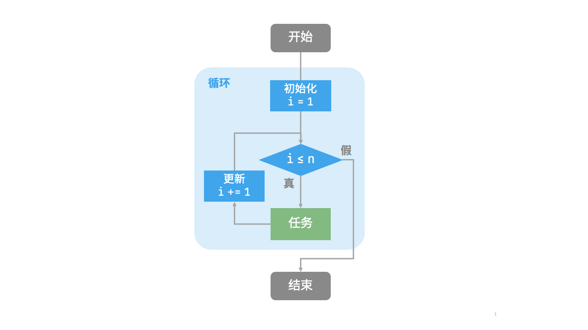

此求和函数的操作数量与输入数据大小 $n$ 成正比，或者说成“线性关系”。实际上，**时间复杂度描述的就是这个“线性关系”**。相关内容将会在下一节中详细介绍。

#### 2.1.2 while 循环

与 `for` 循环类似，`while` 循环也是一种实现迭代的方法。在 `while` 循环中，程序每轮都会先检查条件，如果条件为真，则继续执行，否则就结束循环。

下面我们用 `while` 循环来实现求和 $1 + 2 + \dots + n$:

```python
def while_loop(n: int) -> int:
    """while 循环"""
    res = 0
    i = 1  # 初始化条件变量
    # 循环求和 1, 2, ..., n-1, n
    while i <= n:
        res += i
        i += 1  # 更新条件变量
    return res
```

**`while` 循环比 `for` 循环的自由度更高**。在 `while` 循环中，我们可以自由地设计条件变量的初始化和更新步骤。

例如在以下代码中，条件变量 i 每轮进行两次更新，这种情况就不太方便用 `for` 循环实现：

```python
def while_loop_ii(n: int) -> int:
    """while 循环（两次更新）"""
    res = 0
    i = 1  # 初始化条件变量
    # 循环求和 1, 4, 10, ...
    while i <= n:
        res += i
        # 更新条件变量
        i += 1
        i *= 2
    return res
```

总的来说，**`for` 循环的代码更加紧凑，`while` 循环更加灵活**，两者都可以实现迭代结构。选择使用哪一个应该根据特定问题的需求来决定。

#### 2.1.3 嵌套循环

我们可以在一个循环结构内嵌套另一个循环结构，下面以 `for` 循环为例：

```python
def nested_for_loop(n: int) -> str:
    """双层 for 循环"""
    res = ""
    # 循环 i = 1, 2, ..., n-1, n
    for i in range(1, n + 1):
        # 循环 j = 1, 2, ..., n-1, n
        for j in range(1, n + 1):
            res += f"({i}, {j}), "
    return res
```

图 2-2 是该嵌套循环的流程框图。

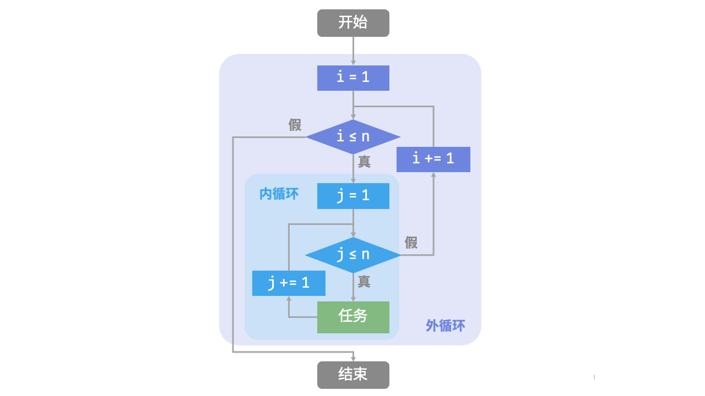

在这种情况下，函数的操作数量与 $n^2$ 成正比，或者说算法运行时间和输入数据大小 $n$ 成“平方关系”。

我们可以继续添加嵌套循环，每一次嵌套都是一次“升维”，将会使时间复杂度提高至“立方关系”“四次方关系”，以此类推。


### 2.2 递归

递归（recursion）是一种算法策略，通过函数调用自身来解决问题。它主要包含两个阶段。

1. **递**：程序不断深入地调用自身，通常传入更小或更简化的参数，直到达到“终止条件”。
2. **归**：触发“终止条件”后，程序从最深层的递归函数开始逐层返回，汇聚每一层的结果。

而从实现的角度看，递归代码主要包含三个要素。

1. **终止条件**：用于决定什么时候由“递”转“归”。
2. **递归调用**：对应“递”，函数调用自身，通常输入更小或更简化的参数。
3. **返回结果**：对应“归”，将当前递归层级的结果返回至上一层。

观察以下代码，我们只需调用函数 `recur(n)` ，就可以完成 $1 + 2 + \dots + n$ 的计算：

```python
def recur(n: int) -> int:
    """递归"""
    # 终止条件
    if n == 1:
        return 1
    # 递：递归调用
    res = recur(n - 1)
    # 归：返回结果
    return n + res
```

图 2-3 展示了该函数的递归过程。

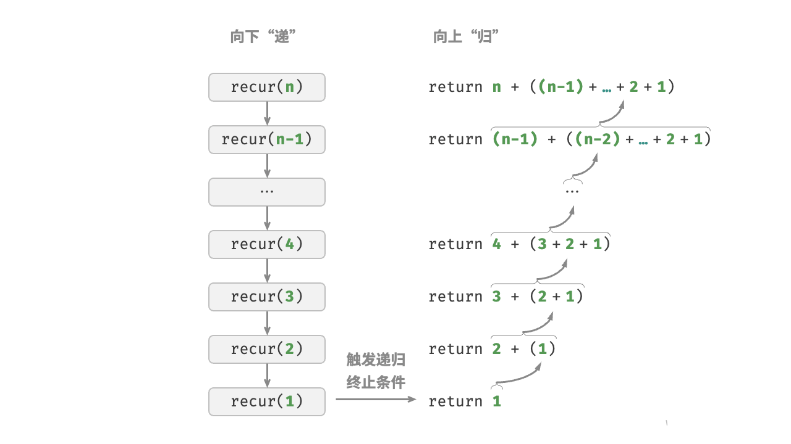

虽然从计算角度看，迭代与递归可以得到相同的结果，**但它们代表了两种完全不同的思考和解决问题的范式**。

- **迭代**：“自下而上”地解决问题。从最基础的步骤开始，然后不断重复或累加这些步骤，直到任务完成。
- **递归**：“自上而下”地解决问题。将原问题分解为更小的子问题，这些子问题和原问题具有相同的形式。接下来将子问题继续分解为更小的子问题，直到基本情况时停止（基本情况的解是已知的）。

以上述求和函数为例，设问题 $f(n) = 1 + 2 + \dots + n$。

- **迭代**：在循环中模拟求和过程，从 $1$ 遍历到 $n$，每轮执行求和操作，即可求得 $f(n)$。
- **递归**：将问题分解为子问题 $f(n) = n + f(n - 1)$，不断（递归地）分解下去，直至基本情况 $f(1) = 1$ 时终止。

#### 2.2.1 调用栈

递归函数每次调用自身时，系统都会为新开启的函数分配内存，以存储局部变量、调用地址和其他信息等。这将导致两方面的结果。

- 函数的上下文数据都存储在称为“栈帧空间”的内存区域中，直至函数返回后才会被释放。因此，**递归通常比迭代更加耗费内存空间**。
- 递归调用函数会产生额外的开销。**因此递归通常比循环的时间效率更低**。

如图 2-4 所示，在触发终止条件前，同时存在 $n$ 个未返回的递归函数，**递归深度为 $n$** 。

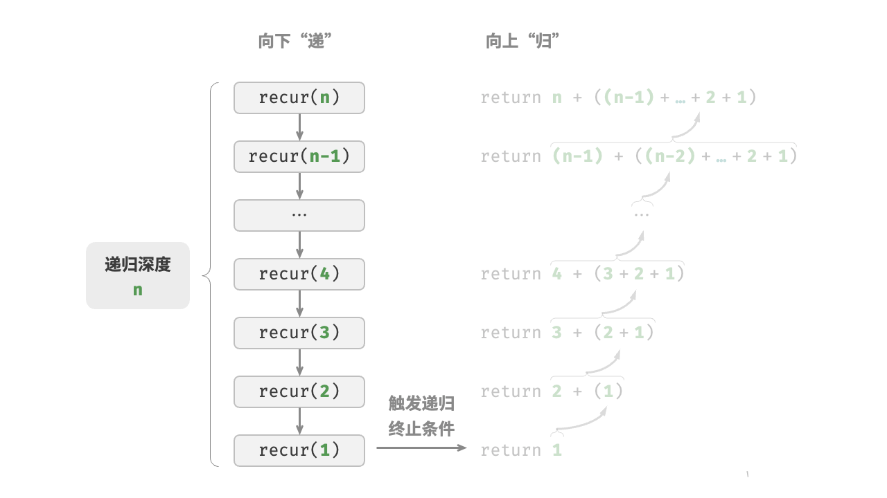

在实际中，编程语言允许的递归深度通常是有限的，过深的递归可能导致栈溢出错误。

#### 2.2.2 尾递归

有趣的是，**如果函数在返回前的最后一步才进行递归调用**，则该函数可以被编译器或解释器优化，使其在空间效率上与迭代相当。这种情况被称为尾递归（tail recursion）。

- **普通递归**：当函数返回到上一层级的函数后，需要继续执行代码，因此系统需要保存上一层调用的上下文。
- **尾递归**：递归调用是函数返回前的最后一个操作，这意味着函数返回到上一层级后，无须继续执行其他操作，因此系统无须保存上一层函数的上下文。

以计算 $1 + 2 + \dots + n$ 为例，我们可以将结果变量 `res` 设为函数参数，从而实现尾递归：

```python
def tail_recur(n, res):
    """尾递归"""
    # 终止条件
    if n == 0:
        return res
    # 尾递归调用
    return tail_recur(n - 1, res + n)
```

尾递归的执行过程如图 2-5 所示。对比普通递归和尾递归，两者的求和操作的执行点是不同的。

- **普通递归**：求和操作是在“归”的过程中执行的，每层返回后都要再执行一次求和操作。
- **尾递归**：求和操作是在“递”的过程中执行的，“归”的过程只需层层返回。


::: tip

请注意，许多编译器或解释器并不支持尾递归优化。例如，Python 默认不支持尾递归优化，因此即使函数是尾递归形式，仍然可能会遇到栈溢出问题。

:::

#### 2.3 递归树

当处理与“分治”相关的算法问题时，递归往往比迭代的思路更加直观、代码更加易读。以“斐波那契数列”为例。

::: info

给定一个斐波那契数列 $0,1,1,2,3,5,8,13,\dots$，求该数列的第 $n$ 个数字。

:::


设斐波那契数列的第 $n$ 个数字为 $f(n)$，易得两个结论。

- 数列的前两个数字为 $f(1) = 0$ 和 $f(2) = 1$。
- 数列中的每个数字是前两个数字的和，即 $f(n) = f(n - 1) + f(n - 2)$。

按照递推关系进行递归调用，将前两个数字作为终止条件，便可写出递归代码。调用 `fib(n)` 即可得到斐波那契数列的第 $n$ 个数字：

```python
def fib(n: int) -> int:
    """斐波那契数列：递归"""
    # 终止条件 f(1) = 0, f(2) = 1
    if n == 1 or n == 2:
        return n - 1
    # 递归调用 f(n) = f(n-1) + f(n-2)
    res = fib(n - 1) + fib(n - 2)
    # 返回结果 f(n)
    return res
```

观察以上代码，我们在函数内递归调用了两个函数，**这意味着从一个调用产生了两个调用分支**。如图 2-6 所示，这样不断递归调用下去，最终将产生一棵层数为 $n$ 的递归树（recursion tree）。

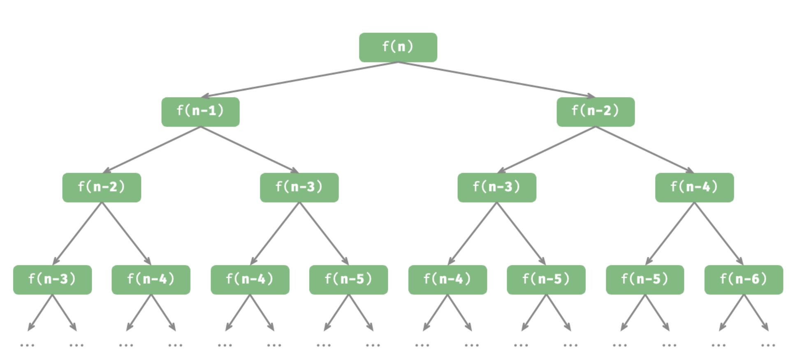

从本质上看，递归体现了“将问题分解为更小子问题”的思维范式，这种分治策略至关重要。

- 从算法角度看，搜索、排序、回溯、分治、动态规划等许多重要算法策略直接或间接地应用了这种思维方式。
- 从数据结构角度看，递归天然适合处理链表、树和图的相关问题，因为它们非常适合用分治思想进行分析。

### 2.3 两者对比

总结以上内容，如表 2-1 所示，迭代和递归在实现、性能和适用性上有所不同。

::: center

表 2-1  迭代与递归特点对比

:::

|          | 迭代                                   | 递归                                                         |
| :------- | :------------------------------------- | :----------------------------------------------------------- |
| 实现方式 | 循环结构                               | 函数调用自身                                                 |
| 时间效率 | 效率通常较高，无函数调用开销           | 每次函数调用都会产生开销                                     |
| 内存使用 | 通常使用固定大小的内存空间             | 累积函数调用可能使用大量的栈帧空间                           |
| 适用问题 | 适用于简单循环任务，代码直观、可读性好 | 适用于子问题分解，如树、图、分治、回溯等，代码结构简洁、清晰 |

## 3. 时间复杂度

运行时间可以直观且准确地反映算法的效率。如果我们想准确预估一段代码的运行时间，应该如何操作呢？

1. **确定运行平台**，包括硬件配置、编程语言、系统环境等，这些因素都会影响代码的运行效率。
2. **评估各种计算操作所需的运行时间**，例如加法操作 `+` 需要 1 ns ，乘法操作 `*` 需要 10 ns ，打印操作 `print()` 需要 5 ns 等。
3. **统计代码中所有的计算操作**，并将所有操作的执行时间求和，从而得到运行时间。

例如在以下代码中，输入数据大小为 $n$ ：


### 3.1 Big-O

写作 $T(n)$ ，也叫语句频度，n 代表的是问题规模。

$f(n)$ ，使得$T(n)/f(n)$ 极限值（当 n 趋于无穷大时）为不等于 0 的常数，则称 $f(n)$ 是 $T(n)$ 的同数量级函数，记作 $T(n) = Of(n)$

称 $f(n)$ 为算法的渐进时间复杂度，简称时间复杂度。在数学上，Big-O 符合用来描述一个函数数量级的渐进上界。

如果我们将算法中的一次计算记为 1，那么如果 n 个输入值，算法对每个输入值都做一次运算，那么整个算法的运算量即为 n。这个时候我们就可以说，这是一个时间复杂度为 O(n) 的算法。

**思考：**

- 如果仍有 n 个输入值，但算法对每一个输入值做一次运算这个操作要再重复 n 次，那么整个算法的运算量即为：$n^2$ ，时间复杂度为 $O(n^2)$ 。
- 如果仍有 n 个输入值，但算法对每一个输入值做一次运算这个操作要再重复 $n + 1$ 次，算法的运算量是 $n * (n+1)$。
    - 按理说时间复杂度会变为 $O(n^2 + n)$,但是是否会改变呢？
    - 不会，时间复杂度仍然是 $O(n^2)$。为什么？输入量 n 趋于无穷大时，$n^2$ 已经大到可以忽略掉 $n$ 的存在，直接省略。

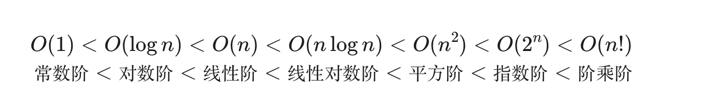

::: tips

嵌套循环一个n一个m，$O(nm)$

斐波那契数列， $O(2^n)$

:::

::: tabs

@tab 常数阶

```python
def constant(n: int) -> int:
    count = 0
    size = 100000
    for _ in range(size):
        count += 1
    return count
```


@tab 线性阶

```python
def array_traversal(nums):
    """线性阶（遍历数组）数组的长度为标准"""
    count = 0
    for num in nums:
        count += 1
    return count

def linear(n):
    """线性阶，n 的大小为标准"""
    count = 0
    for _ in range(n):
        count += 1
    return count
```


@tab 平方阶 $O(n^2)$

```python
def quadratic(n: int) -> int:
    """平方阶"""
    count = 0
    # 循环次数与数据大小 n 成平方关系
    for i in range(n):
        for j in range(n):   
            count += 1
    return count

def bubble_sort(arr):
    for i in range(len(arr)):
        for j in range(len(arr) - i - 1):
            if arr[j] > arr[j+1]:
                arr[j], arr[j+1] = arr[j+1], arr[j]
    return arr

print(bubble_sort([4,6,1,7,3]))
```


@tab 指数阶 $O(2^n)$

```python
def expontial(n): # 传入 n ，返回2的n次方
    count = 0
    base = 1
    for i in range(n):
        for j in range(base):
            count += 1
        base += 2
        return count
```

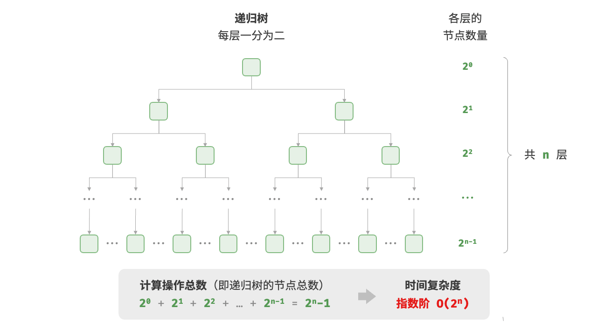

@tab 对数阶 $O(logn)$

每进行一次操作，操作的对象（数据）都减半。时间复杂度就是对数阶。

```python
def logarithmic(n):
    count = 0
    while n > 1:
        n = n/2
        count += 1
    return count

def log_recur(n):
    if n <= 1:
        return 0
    return log_recur(n / 2) + 1
```


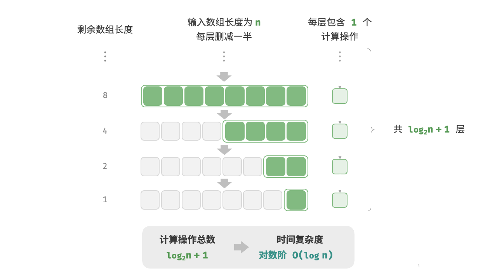


@tab 线性对数阶 $O(nlogn)$

```python
def linear_log_recur(n: int) -> int:
    """线性对数阶"""
    if n <= 1:
        return 1
    # 一分为二，子问题的规模减小一半
    count = linear_log_recur(n // 2) + linear_log_recur(n // 2)
    # 当前子问题包含 n 个操作
    for _ in range(n):
        count += 1
    return count
```

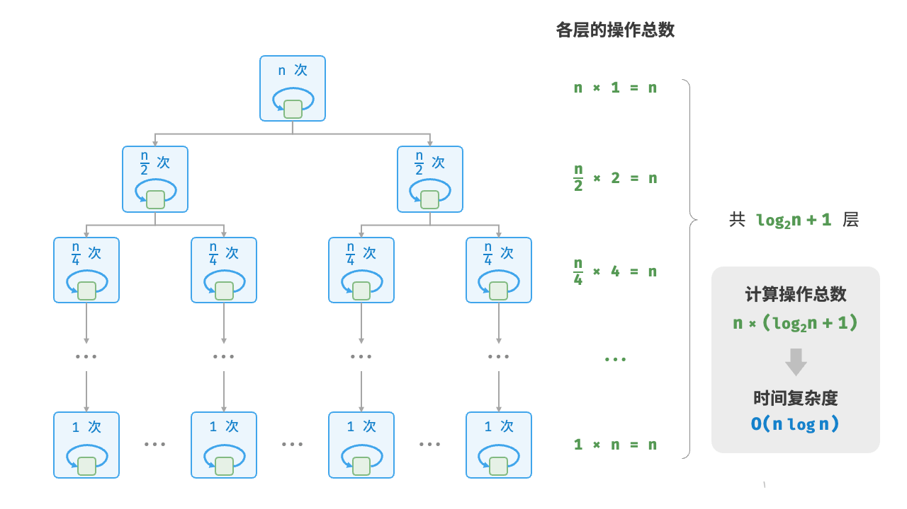


@tab 阶乘阶 $O(n!)$

```python
def factorial_recur(n):
    if n == 0:
        return 1
    count = 0
    for i in range(n):
        count += factorial_recur(n - 1)
        
    return count
```

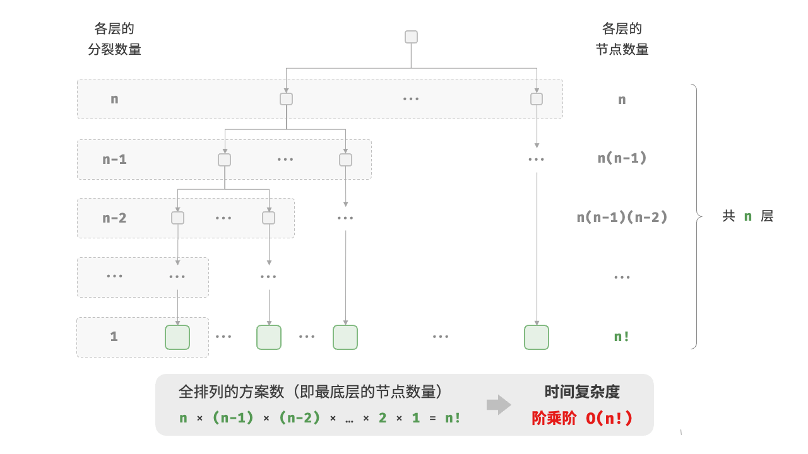

## 4. 空间复杂度（space complexity）

**用于衡量算法占用内存空间随着数据量变大时的增长趋势。这个概念与时间复杂度非常类似。只需将“运行时间”替换为：“占用内存空间”。**


### 4.1 算法相关空间

算法在运行中使用的内存空间主要包括以下几种。

```python
class Node:
    """类"""
    def __init__(self, x: int):
        self.val: int = x              # 节点值
        self.next: Node | None = None  # 指向下一节点的引用

def function() -> int:
    """函数"""
    # 执行某些操作...
    return 0

def algorithm(n) -> int:  # 输入数据
    A = 0                 # 暂存数据（常量，一般用大写字母表示）
    b = 0                 # 暂存数据（变量）
    node = Node(0)        # 暂存数据（对象）
    c = function()        # 栈帧空间（调用函数）
    return A + b + c      # 输出数据
```

- **输入空间：**用于存储算法输入数据
- **暂存空间：**用于存储算法在运行过程中的变量，对象，函数上下文等数据。
- **输出空间：**用于存储算法的输出数据

一般情况下，空间复杂度的统计范围是“暂存空间”加上“输出空间”。

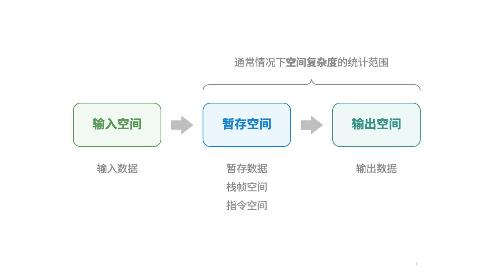

### 4.2 暂存空间

一般分为三个部分。

- **暂存数据：**用于保存算法运行过程中的各种常量，变量，对象等。
- **栈帧空间：**用于保存调用函数的上下文数据。系统在每次调用函数时都会在栈顶创建一个栈帧，函数返回后，栈帧空间会被释放。
- **指令空间：**用于保存编译后的程序指令，在实际统计中通常忽略不计。


### 4.3 空间复杂度的推算

空间复杂度的推算方法与时间复杂度大致相同，只需将统计对象从“操作数量”转为“使用空间大小”。
而与时间复杂度不同的是，我们通常只关注最差空间复杂度。这是因为内存空间是一项硬性要求，我们必须确保在所有输入数据下都有足够的内存空间预留。

#### 4.3.1 什么是最差空间复杂度？

观察以下代码，最差空间复杂度中的“最差”有两层含义。

```python
def solution(n):
    a = 0  # O(1)
    b = [0] * 1000  # O(1)
    if n > 10:
        nums = [0] * n  # O(n)
```

1. **以最差输入数据为准**：当 $n < 10$ 时，空间复杂度为 $O(1)$ ；但当 $n > 10$ 时，初始化的数组 `nums` 占用 $O(n)$ 空间，因此最差空间复杂度为 $O(n)$ 。
2. **以算法运行中的峰值内存为准**：例如，程序在执行最后一行之前，占用 $O(1)$ 空间；当初始化数组 `nums` 时，程序占用 $O(n)$ 空间，因此最差空间复杂度为 $O(n)$ 。


#### 4.3.2 栈帧空间里：

在递归函数中，需要注意统计栈帧空间。观察以下代码：

```python
def function() -> int:
    # 执行某些操作
    return 0

def loop(n: int):
    """循环的空间复杂度为 O(1)"""
    for _ in range(n):
        function()

def recur(n: int):
    """递归的空间复杂度为 O(n)"""
    if n == 1:
        return
    return recur(n - 1)
```

函数 `loop()` 和 `recur()` 的时间复杂度都为 $O(n)$ ，但空间复杂度不同。

- 函数 `loop()` 在循环中调用了 $n$ 次 `function()` ，每轮中的 `function()` 都返回并释放了栈帧空间，因此空间复杂度仍为 $O(1)$ 。
- 递归函数 `recur()` 在运行过程中会同时存在 $n$ 个未返回的 `recur()` ，从而占用 $O(n)$ 的栈帧空间。

### 4.4 常见类型

设输入数据大小为 $n$ ，下图展示了常见的空间复杂度类型（从低到高排列）。

$$
\begin{aligned}
O(1) < O(\log n) < O(n) < O(n^2) < O(2^n) \newline
\text{常数阶} < \text{对数阶} < \text{线性阶} < \text{平方阶} < \text{指数阶}
\end{aligned}
$$
可视化：

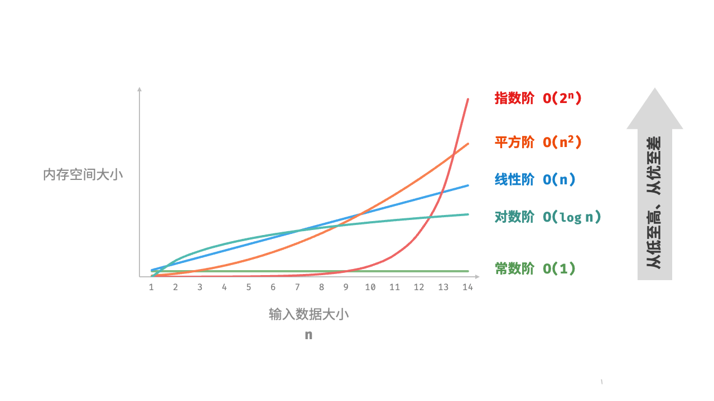

#### 4.4.1 常数阶 $O(1)$

常数阶常见于数量与输入数据大小 $n$ 无关的常量、变量、对象。

需要注意的是，在循环中初始化变量或调用函数而占用的内存，在进入下一循环后就会被释放，因此不会累积占用空间，空间复杂度仍为 $O(1)$ ：

```python
def function() -> int:
    """函数"""
    # 执行某些操作
    return 0

def constant(n: int):
    """常数阶"""
    # 常量、变量、对象占用 O(1) 空间
    a = 0
    nums = [0] * 10000
    node = ListNode(0)
    # 循环中的变量占用 O(1) 空间
    for _ in range(n):
        c = 0
    # 循环中的函数占用 O(1) 空间
    for _ in range(n):
        function()
```


#### 4.4.2 线性阶 $O(n)$

线性阶常见于元素数量与 $n$ 成正比的数组、链表、栈、队列等：

```python
def linear(n: int):
    """线性阶"""
    # 长度为 n 的列表占用 O(n) 空间
    nums = [0] * n
    # 长度为 n 的哈希表占用 O(n) 空间
    hmap = dict[int, str]()
    for i in range(n):
        hmap[i] = str(i)
```

如下图所示，此函数的递归深度为 $n$ ，即同时存在 $n$ 个未返回的 `linear_recur()` 函数，使用 $O(n)$ 大小的栈帧空间：

```python
def linear_recur(n: int):
    """线性阶（递归实现）"""
    print("递归 n =", n)
    if n == 1:
        return
    linear_recur(n - 1)
```

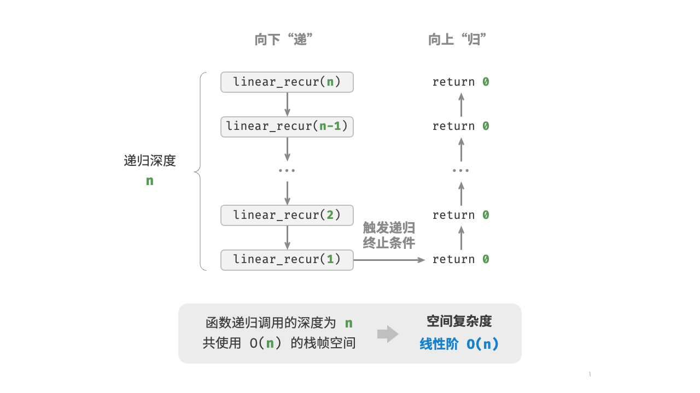

#### 4.4.3 指数阶 $O(2^n)$

指数阶常见于二叉树。观察下图，层数为 $n$ 的“满二叉树”的节点数量为 $2^n - 1$ ，占用 $O(2^n)$ 空间：

```python
def build_tree(n: int) -> TreeNode | None:
    """指数阶（建立满二叉树）"""
    if n == 0:
        return None
    root = TreeNode(0)
    root.left = build_tree(n - 1)
    root.right = build_tree(n - 1)
    return root
```

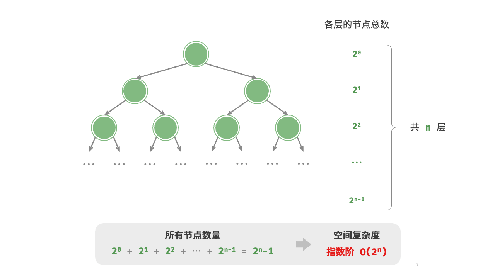

#### 4.4.4 对数阶 $O(\log n)$

对数阶常见于分治算法。例如归并排序，输入长度为 $n$ 的数组，每轮递归将数组从中点处划分为两半，形成高度为 $\log n$ 的递归树，使用 $O(\log n)$ 栈帧空间。

再例如将数字转化为字符串，输入一个正整数 $n$ ，它的位数为 $\lfloor \log_{10} n \rfloor + 1$ ，即对应字符串长度为 $\lfloor \log_{10} n \rfloor + 1$ ，因此空间复杂度为 $O(\log_{10} n + 1) = O(\log n)$ 。


## 5. 权衡时间与空间

理想情况下，我们希望算法的时间复杂度和空间复杂度都能达到最优。然而在实际情况中，同时优化时间复杂度和空间复杂度通常非常困难。

**降低时间复杂度通常需要以提升空间复杂度为代价，反之亦然**。我们将牺牲内存空间来提升算法运行速度的思路称为“以空间换时间”；反之，则称为“以时间换空间”。

选择哪种思路取决于我们更看重哪个方面。在大多数情况下，时间比空间更宝贵，因此“以空间换时间”通常是更常用的策略。当然，在数据量很大的情况下，控制空间复杂度也非常重要。


## 6. NP 问题

### 6.1 暴力找图中最短路径

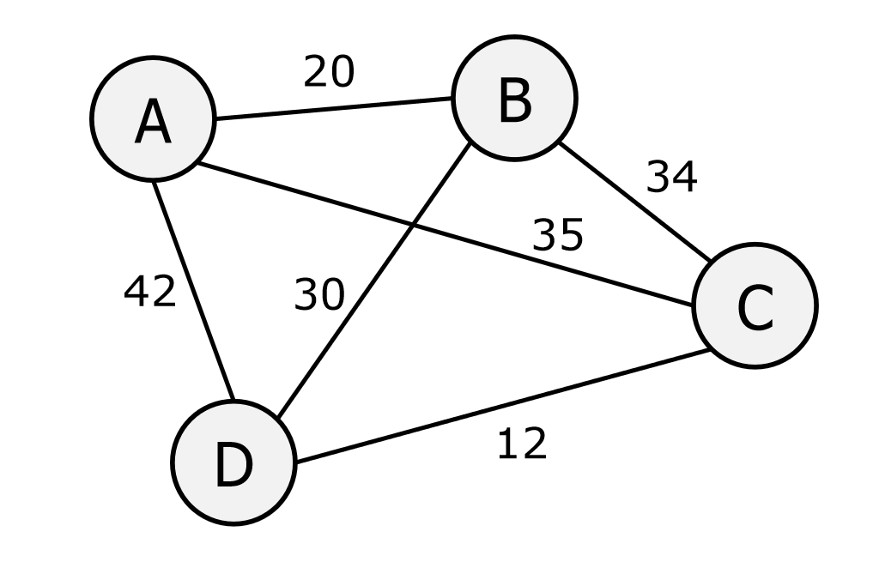

```python
from itertools import permutations

# 定义城市之间的距离，使用字典表示，键是城市对（元组），值是他们之间的距离

distances = {
    ('A', 'B'): 20, ('A', 'C'): 35, ('A', 'D'): 42,
    ('B', 'A'): 20, ('B', 'C'): 34, ('B', 'D'): 30,
    ('C', 'A'): 35, ('C', 'B'): 34, ('C', 'D'): 12,
    ('D', 'A'): 42, ('D', 'B'): 30, ('D', 'C'): 12
}


def calculate_route_cost(route):
    cost = 0  # 初始化总成本为0
    # 遍历路线中的每一对相邻城市，累加它们之间的成本
    for i in range(len(route) - 1):
        cost += distances[(route[i], route[i + 1])]
    # 加上回到起点的成本（最后一个城市到第一个城市）
    cost += distances[(route[-1], route[0])]
    return cost


cities = ['A', 'B', 'C', 'D']  # 定义所有城市的列表

# 生成所有可能的路径
all_possible_routes = permutations(cities)

# 初始化最佳路线为 None，因为一开始还没有最佳路线
# 初始化最佳成本为正无穷大
best_route = None
best_score = float('inf')

# 遍历所有可能的路线，找出成本最小的路线
for route in all_possible_routes:
    current_score = calculate_route_cost(route)  # 计算当前路径的总成本
    print(list[route] + [route[0], current_score])
    # 如果成本比已知的最佳成本更小，则更新最佳路线和最佳成本
    if current_score < best_score:
        best_route = route
        best_score = current_score

# 输出结果
print("最佳路线：", best_route)
print("最低成本：", best_score)
```

::: tips

在 `calculate_route_cost` 函数中，`len(route) - 1` 的原因是我们需要计算相邻城市之间的成本，但不需要在最后一个城市之后再访问一个不存在的城市。具体来说：

- 假设 `route = ['A', 'B', 'C', 'D']`，这是一个可能的行程路线。
- `len(route) - 1` 的目的是确保我们只遍历到倒数第二个城市的索引位置。
- 在循环中，我们逐对计算每两个相邻城市之间的成本，即：
    - `A -> B`
    - `B -> C`
    - `C -> D`
- 这时，循环已经完成了 `A -> B -> C -> D` 的成本计算。
- 然后，最后我们手动添加从最后一个城市 `D` 回到起始城市 `A` 的成本，这样就完整了一个环形路线。

如果不减去 1，循环会尝试访问一个超出索引范围的元素，比如 `route[4]`（假设 `route` 长度为 4），这会导致错误。

:::

```python
import itertools                                    # python library for handling iterators
                                                    # extremely useful!
dists = [['A','B',20],['A','C',35],['A','D',42],    # list of all edges (distances between cities)
         ['B','A',20],['B','C',34],['B','D',30],    # could be represented as adjacency matrix
         ['C','A',35],['C','B',34],['C','D',12],
         ['D','A',42],['D','B',30],['D','C',12]]

def get_and_convert_perm_list(dests):               # get all the permutations, i.e. possible routes
    perm_list = list(itertools.permutations(dests)) # this outputs a list of tuples
    new_perm_list = []                              # convert to a list of lists
    for item in perm_list:                          # (easier to work with)
        new_perm_list.append(list(item))
    return new_perm_list

def TSP_get_dists(dests, dists):
    results = []                                    # we will build a list of results
    perm_list = get_and_convert_perm_list(dests)
    for item in perm_list:                          # for each permutation (i.e. route)
        item.append(item[0])                        # add the origin as the destination
        total_dist = 0                              # initialise total distance
        for i in range(len(item)-1):                # iterate through each permutation
            for dist in dists:                                  # match each pair in permutation
                if item[i] == dist[0] and item[i+1] == dist[1]: # with appropriate pair in dist
                    total_dist = total_dist + dist[2]           # add cost to total distance
                    if i == len(item)-2:                        # if we've gone through the whole permutation
                        item.append(total_dist)     # append the total cost to the permutation
                        print(item)                 # print the permutation with cost for convenience
                        results.append(item)        # append the permutation with cost to results
    return results                                  # return results list

TSP_get_dists(['A','B','C','D'],dists)
```

### 6.2 NP-Hard Problems: Heuristics

- A heuristic function produces a solution in a reasonable time frame that is good enough for solving the problem.

- The solution may not be the best solution.

- The solution might still be valuable because it does not take a long time to find it. 

#### Heuristic algorithms

- Don’t promise to find the best solution.

- Quickly find a ‘good enough’ solution.

- There are several heuristic algorithms that can solve the travelling salesmen problem. For example:

    - Nearest neighbour (greedy algorithm):

    - The salesman starts at a random city and visits the nearest city until all have been visited

#### Nearest neighbour

1. Initialise all vertices as unvisited

2. Select an arbitrary vertex, set it as the current vertex u and mark it as visited.

3. Find the shortest edge connecting u and an unvisited vertex v.

4. Set v as the current vertex u. Mark v as visited.

5. If all the vertices are visited then terminate (moving back to origin) otherwise go to step 3.


#### 图片演示

::: tabs

@tab

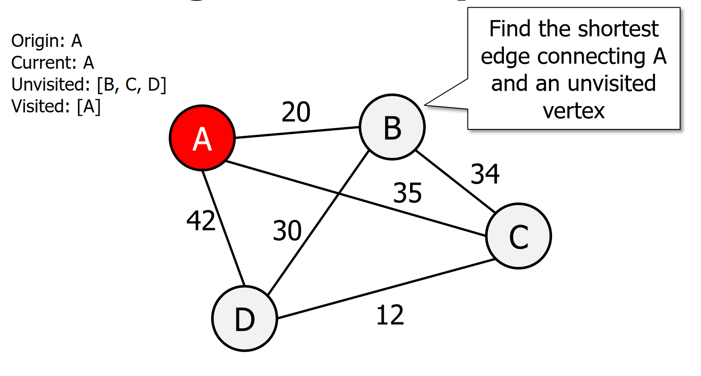

@tab

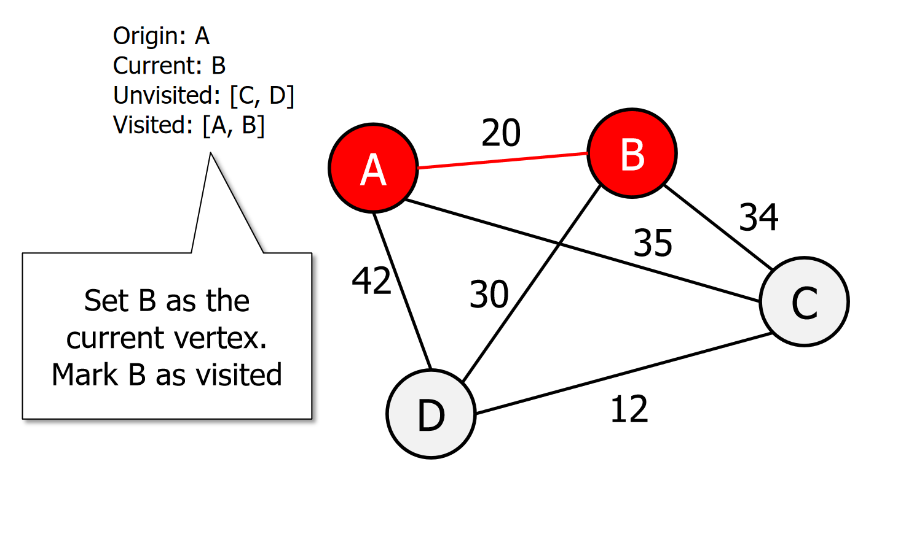

@tab

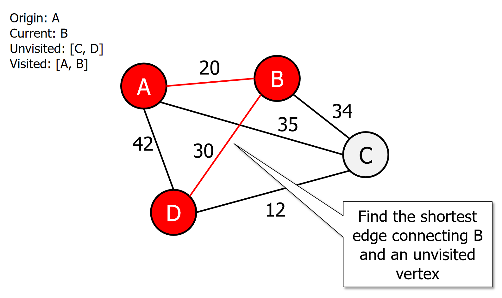

@tab

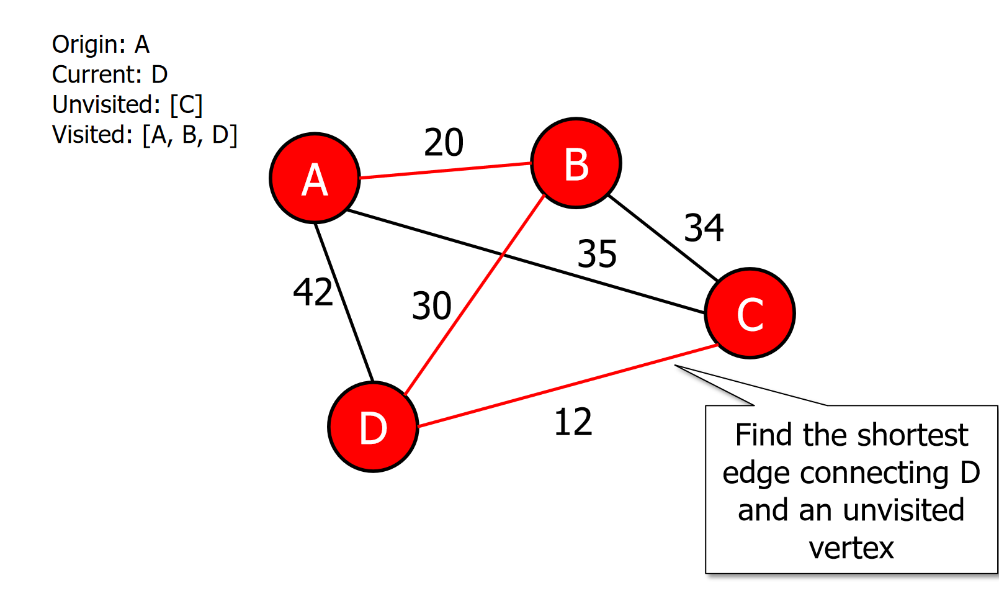

@tab

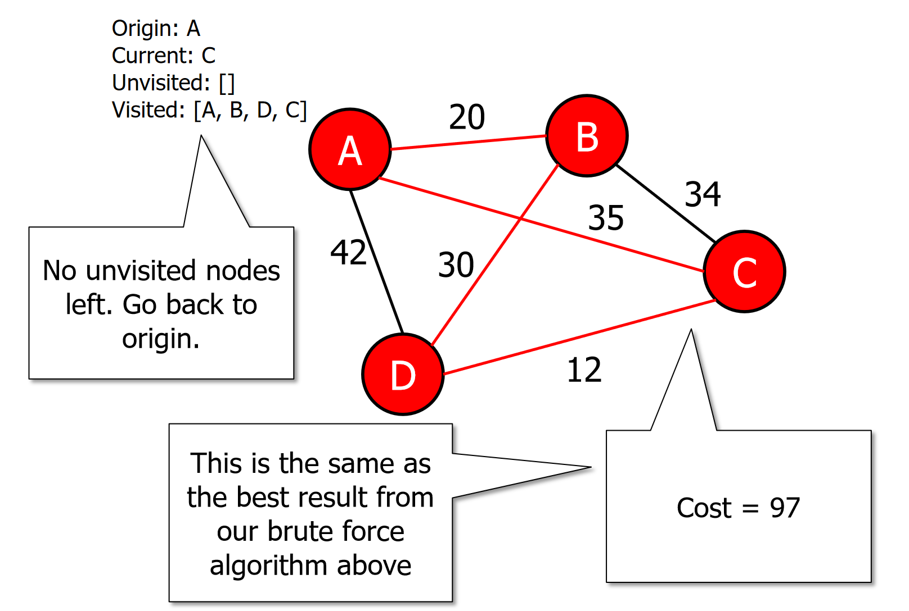

:::


#### 伪代码

```python
unvisited ← remaining vertices
visited ← []
connections ← NULL

u ← unvisited[0]
visited ← visited + u
unvisited ← unvisited - u

while (unvisited ≠ NULL ) 
     	Find edge e = (u, v) such that: 
          1. u ∈ visited 
          2. v ∈ unvisited 
          3. e has smallest cost
	u ← v
     	connections ← connections + e 
     	visited ← visited + v
     	unvisited ← unvisited - v
```


#### 代码

```python
# 初始化数据
unvisited = {'B', 'C', 'D'}  # 使用集合，便于添加和删除
visited = ['A']
connections = []

# 假设 edges 列表定义了图的边和它们的权重
edges = [
    ('A', 'B', 1),
    ('A', 'C', 4),
    ('A', 'D', 3),
    ('B', 'C', 2),
    ('B', 'D', 5),
    ('C', 'D', 1)
]

# 从当前节点开始
u = visited[0]

# 只要未访问的节点集中还有节点，就继续循环
while unvisited:
    # 找到满足条件的最小成本边 e = (u, v)
    min_edge = None
    min_cost = float('inf')

    # 遍历已访问的节点
    for u in visited:
        # 查找所有从已访问节点 u 出发且终点在未访问集合中的边
        for start, end, cost in edges:
            if start == u and end in unvisited and cost < min_cost:
                min_cost = cost
                min_edge = (start, end)

    # 如果找到符合条件的边，将其添加到连接列表中
    if min_edge:
        u, v = min_edge  # 获取最小边的起点和终点
        connections.append((u, v))  # 将边加入连接列表
        visited.append(v)  # 将终点 v 加入已访问节点列表
        unvisited.remove(v)  # 从未访问集合中移除 v

# 输出结果
print("已访问的节点:", visited)
print("构建的最小生成树连接:", connections)
```


