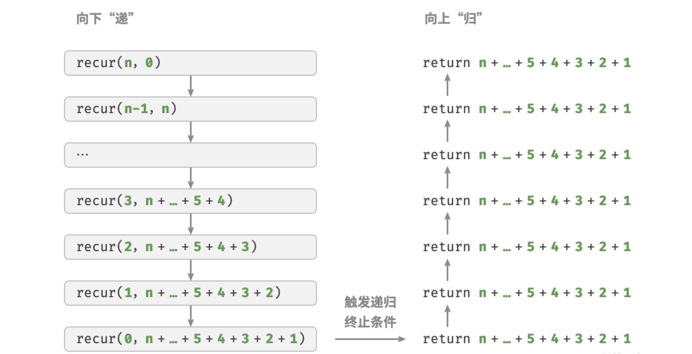

## 1. 算法效率评估

在算法设计中，我们先后追求以下两个层面的目标。

1. **找到问题的解决方法：**算法需要在规定的输入范围内可靠地求的问题的正确解。
2. **寻求最优解法：**同一个问题可能存在多种解法，我们希望找到尽可能高效的算法。

也就是说，在能够解决问题的前提下，算法效率已经成为衡量算法优劣的主要评价标准，它包括以下两个维度。

- **时间效率：**算法运行的时间长短
- **空间效率：**算法占用的内存大小

简而言之，**我们的目标是设计“既快又省”的数据结构与算法。**而有效评估算法效率至关重要。因为只有这样，我们才能将各种算法进行对比，进而指导算法设计和优化的过程。

效率评估方法分为两种：实际测试，理论估算。

### 1.1 实际测试

假设我们现在有算法 `A` 和算法 `B` ，它们都能解决同一问题，现在需要对比这两个算法的效率。最直接的方法是找一台计算机，运行这两个算法，并监控记录它们的运行时间和内存占用情况。这种评估方式能够反映真实情况，但也存在较大的局限性。

一方面，**难以排除测试环境的干扰因素**。硬件配置会影响算法的性能表现。比如一个算法的并行度较高，那么它就更适合在多核 CPU 上运行，一个算法的内存操作密集，那么它在高性能内存上的表现就会更好。也就是说，算法在不同的机器上的测试结果可能是不一致的。这意味着我们需要在各种机器上进行测试，统计平均效率，而这是不现实的。

另一方面，**展开完整测试非常耗费资源**。随着输入数据量的变化，算法会表现出不同的效率。例如，在输入数据量较小时，算法 `A` 的运行时间比算法 `B` 短；而在输入数据量较大时，测试结果可能恰恰相反。因此，为了得到有说服力的结论，我们需要测试各种规模的输入数据，而这需要耗费大量的计算资源。

### 1.2 理论估算

由于实际测试具有较大的局限性，因此我们可以考虑仅通过一些计算来评估算法的效率。这种估算方法被称为渐近复杂度分析（asymptotic complexity analysis），简称复杂度分析。

复杂度分析能够体现算法运行所需的时间和空间资源与输入数据大小之间的关系。**它描述了随着输入数据大小的增加，算法执行所需时间和空间的增长趋势**。这个定义有些拗口，我们可以将其分为三个重点来理解。

- 时间和空间资源分别对应了时间复杂度（time complexity）和空间复杂度（space complexity）
- 随着输入数据大小的增加 意味着复杂度反映了算法运行效率与输入数据体谅之间的关系。
- 时间和空间的增长趋势 表示复杂度分析关注的不是运行时间或占用内存的具体值，而是时间或空间增长的“快慢”

**复杂度分析客服了实际测试方法的弊端。**体现在：

- 它无需实际运行代码，更加绿色节能。
- 它独立于测试环境，分析结果适用于所有运行平台。
- 它可以体现不同数据量下的算法效率，尤其在大数据量下的算法性能。

::: tip

如果你仍对复杂度的概念感到困惑，无须担心，我们会在后续章节中详细介绍。

:::

复杂度分析为我们提供了一把评估算法效率的“标尺”，使我们可以衡量执行某个算法所需的时间和空间资源，对比不同算法之间的效率。

复杂度是个数学概念，对于初学者可能比较抽象，学习难度相对较高。从这个角度看，复杂度分析可能不太适合作为最先介绍的内容。然而，当我们讨论某个数据结构或算法的特点时，难以避免要分析其运行速度和空间使用情况。

综上所述，建议你在深入学习数据结构与算法之前，**先对复杂度分析建立初步的了解，以便能够完成简单算法的复杂度分析**。


## 2. 迭代与递归

在算法中，重复执行某个任务是很常见的，它与复杂度分析息息相关。因此，在介绍时间复杂度和空间复杂度之前，我们先来了解如何在程序中实现重复执行任务，即两种基本的程序控制结构：迭代、递归。

### 2.1 迭代

迭代（iteration）是一种重复执行某个任务的控制结构。在迭代中，程序会在满足一定的条件下重复执行某段代码，直到这个条件不再满足。

#### 2.1.1 for 循环

`for` 循环是最常见的迭代形式之一，**适合在预先知道迭代次数时使用**。

以下函数基于 `for` 循环实现了求和 $1 + 2 + \dots + n$，求和结果使用变量 `res` 记录。需要注意的是，Python 中 `range(a, b)` 对应的区间是“左闭右开”的，对应的遍历范围为 $a, a + 1, \dots, b - 1$：

```python
def for_loop(n: int) -> int:
    """for 循环"""
    res = 0
    # 循环求和 1, 2, ..., n-1, n
    for i in range(1, n + 1):
        res += i
    return res
```

图 2-1 是该求和函数的流程框图。


此求和函数的操作数量与输入数据大小 $n$ 成正比，或者说成“线性关系”。实际上，**时间复杂度描述的就是这个“线性关系”**。相关内容将会在下一节中详细介绍。

#### 2.1.2 while 循环

与 `for` 循环类似，`while` 循环也是一种实现迭代的方法。在 `while` 循环中，程序每轮都会先检查条件，如果条件为真，则继续执行，否则就结束循环。

下面我们用 `while` 循环来实现求和 $1 + 2 + \dots + n$:

```python
def while_loop(n: int) -> int:
    """while 循环"""
    res = 0
    i = 1  # 初始化条件变量
    # 循环求和 1, 2, ..., n-1, n
    while i <= n:
        res += i
        i += 1  # 更新条件变量
    return res
```

**`while` 循环比 `for` 循环的自由度更高**。在 `while` 循环中，我们可以自由地设计条件变量的初始化和更新步骤。

例如在以下代码中，条件变量 i 每轮进行两次更新，这种情况就不太方便用 `for` 循环实现：

```python
def while_loop_ii(n: int) -> int:
    """while 循环（两次更新）"""
    res = 0
    i = 1  # 初始化条件变量
    # 循环求和 1, 4, 10, ...
    while i <= n:
        res += i
        # 更新条件变量
        i += 1
        i *= 2
    return res
```

总的来说，**`for` 循环的代码更加紧凑，`while` 循环更加灵活**，两者都可以实现迭代结构。选择使用哪一个应该根据特定问题的需求来决定。

#### 2.1.3 嵌套循环

我们可以在一个循环结构内嵌套另一个循环结构，下面以 `for` 循环为例：

```python
def nested_for_loop(n: int) -> str:
    """双层 for 循环"""
    res = ""
    # 循环 i = 1, 2, ..., n-1, n
    for i in range(1, n + 1):
        # 循环 j = 1, 2, ..., n-1, n
        for j in range(1, n + 1):
            res += f"({i}, {j}), "
    return res
```

图 2-2 是该嵌套循环的流程框图。


在这种情况下，函数的操作数量与 $n^2$ 成正比，或者说算法运行时间和输入数据大小 $n$ 成“平方关系”。

我们可以继续添加嵌套循环，每一次嵌套都是一次“升维”，将会使时间复杂度提高至“立方关系”“四次方关系”，以此类推。


### 2.2 递归

递归（recursion）是一种算法策略，通过函数调用自身来解决问题。它主要包含两个阶段。

1. **递**：程序不断深入地调用自身，通常传入更小或更简化的参数，直到达到“终止条件”。
2. **归**：触发“终止条件”后，程序从最深层的递归函数开始逐层返回，汇聚每一层的结果。

而从实现的角度看，递归代码主要包含三个要素。

1. **终止条件**：用于决定什么时候由“递”转“归”。
2. **递归调用**：对应“递”，函数调用自身，通常输入更小或更简化的参数。
3. **返回结果**：对应“归”，将当前递归层级的结果返回至上一层。

观察以下代码，我们只需调用函数 `recur(n)` ，就可以完成 $1 + 2 + \dots + n$ 的计算：

```python
def recur(n: int) -> int:
    """递归"""
    # 终止条件
    if n == 1:
        return 1
    # 递：递归调用
    res = recur(n - 1)
    # 归：返回结果
    return n + res
```

图 2-3 展示了该函数的递归过程。


虽然从计算角度看，迭代与递归可以得到相同的结果，**但它们代表了两种完全不同的思考和解决问题的范式**。

- **迭代**：“自下而上”地解决问题。从最基础的步骤开始，然后不断重复或累加这些步骤，直到任务完成。
- **递归**：“自上而下”地解决问题。将原问题分解为更小的子问题，这些子问题和原问题具有相同的形式。接下来将子问题继续分解为更小的子问题，直到基本情况时停止（基本情况的解是已知的）。

以上述求和函数为例，设问题 $f(n) = 1 + 2 + \dots + n$。

- **迭代**：在循环中模拟求和过程，从 $1$ 遍历到 $n$，每轮执行求和操作，即可求得 $f(n)$。
- **递归**：将问题分解为子问题 $f(n) = n + f(n - 1)$，不断（递归地）分解下去，直至基本情况 $f(1) = 1$ 时终止。

#### 2.2.1 调用栈

递归函数每次调用自身时，系统都会为新开启的函数分配内存，以存储局部变量、调用地址和其他信息等。这将导致两方面的结果。

- 函数的上下文数据都存储在称为“栈帧空间”的内存区域中，直至函数返回后才会被释放。因此，**递归通常比迭代更加耗费内存空间**。
- 递归调用函数会产生额外的开销。**因此递归通常比循环的时间效率更低**。

如图 2-4 所示，在触发终止条件前，同时存在 $n$ 个未返回的递归函数，**递归深度为 $n$** 。


在实际中，编程语言允许的递归深度通常是有限的，过深的递归可能导致栈溢出错误。

#### 2.2.2 尾递归

有趣的是，**如果函数在返回前的最后一步才进行递归调用**，则该函数可以被编译器或解释器优化，使其在空间效率上与迭代相当。这种情况被称为尾递归（tail recursion）。

- **普通递归**：当函数返回到上一层级的函数后，需要继续执行代码，因此系统需要保存上一层调用的上下文。
- **尾递归**：递归调用是函数返回前的最后一个操作，这意味着函数返回到上一层级后，无须继续执行其他操作，因此系统无须保存上一层函数的上下文。

以计算 $1 + 2 + \dots + n$ 为例，我们可以将结果变量 `res` 设为函数参数，从而实现尾递归：

```python
def tail_recur(n, res):
    """尾递归"""
    # 终止条件
    if n == 0:
        return res
    # 尾递归调用
    return tail_recur(n - 1, res + n)
```

尾递归的执行过程如图 2-5 所示。对比普通递归和尾递归，两者的求和操作的执行点是不同的。

- **普通递归**：求和操作是在“归”的过程中执行的，每层返回后都要再执行一次求和操作。
- **尾递归**：求和操作是在“递”的过程中执行的，“归”的过程只需层层返回。



::: tip

请注意，许多编译器或解释器并不支持尾递归优化。例如，Python 默认不支持尾递归优化，因此即使函数是尾递归形式，仍然可能会遇到栈溢出问题。

:::

#### 2.3 递归树

当处理与“分治”相关的算法问题时，递归往往比迭代的思路更加直观、代码更加易读。以“斐波那契数列”为例。

::: info

给定一个斐波那契数列 $0,1,1,2,3,5,8,13,\dots$，求该数列的第 $n$ 个数字。

:::


设斐波那契数列的第 $n$ 个数字为 $f(n)$，易得两个结论。

- 数列的前两个数字为 $f(1) = 0$ 和 $f(2) = 1$。
- 数列中的每个数字是前两个数字的和，即 $f(n) = f(n - 1) + f(n - 2)$。

按照递推关系进行递归调用，将前两个数字作为终止条件，便可写出递归代码。调用 `fib(n)` 即可得到斐波那契数列的第 $n$ 个数字：

```python
def fib(n: int) -> int:
    """斐波那契数列：递归"""
    # 终止条件 f(1) = 0, f(2) = 1
    if n == 1 or n == 2:
        return n - 1
    # 递归调用 f(n) = f(n-1) + f(n-2)
    res = fib(n - 1) + fib(n - 2)
    # 返回结果 f(n)
    return res
```

观察以上代码，我们在函数内递归调用了两个函数，**这意味着从一个调用产生了两个调用分支**。如图 2-6 所示，这样不断递归调用下去，最终将产生一棵层数为 $n$ 的递归树（recursion tree）。


从本质上看，递归体现了“将问题分解为更小子问题”的思维范式，这种分治策略至关重要。

- 从算法角度看，搜索、排序、回溯、分治、动态规划等许多重要算法策略直接或间接地应用了这种思维方式。
- 从数据结构角度看，递归天然适合处理链表、树和图的相关问题，因为它们非常适合用分治思想进行分析。

### 2.3 两者对比

总结以上内容，如表 2-1 所示，迭代和递归在实现、性能和适用性上有所不同。

::: center

表 2-1  迭代与递归特点对比

:::

|          | 迭代                                   | 递归                                                         |
| :------- | :------------------------------------- | :----------------------------------------------------------- |
| 实现方式 | 循环结构                               | 函数调用自身                                                 |
| 时间效率 | 效率通常较高，无函数调用开销           | 每次函数调用都会产生开销                                     |
| 内存使用 | 通常使用固定大小的内存空间             | 累积函数调用可能使用大量的栈帧空间                           |
| 适用问题 | 适用于简单循环任务，代码直观、可读性好 | 适用于子问题分解，如树、图、分治、回溯等，代码结构简洁、清晰 |

## 3. 时间复杂度

运行时间可以直观且准确地反映算法的效率。如果我们想准确预估一段代码的运行时间，应该如何操作呢？

1. **确定运行平台**，包括硬件配置、编程语言、系统环境等，这些因素都会影响代码的运行效率。
2. **评估各种计算操作所需的运行时间**，例如加法操作 `+` 需要 1 ns ，乘法操作 `*` 需要 10 ns ，打印操作 `print()` 需要 5 ns 等。
3. **统计代码中所有的计算操作**，并将所有操作的执行时间求和，从而得到运行时间。

例如在以下代码中，输入数据大小为 $n$ ：