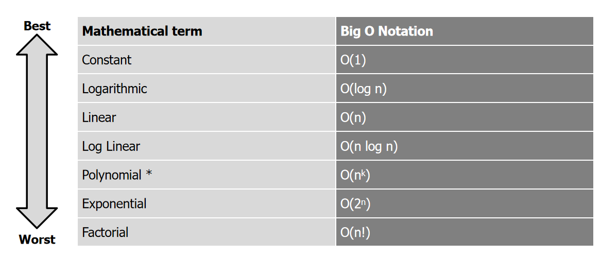
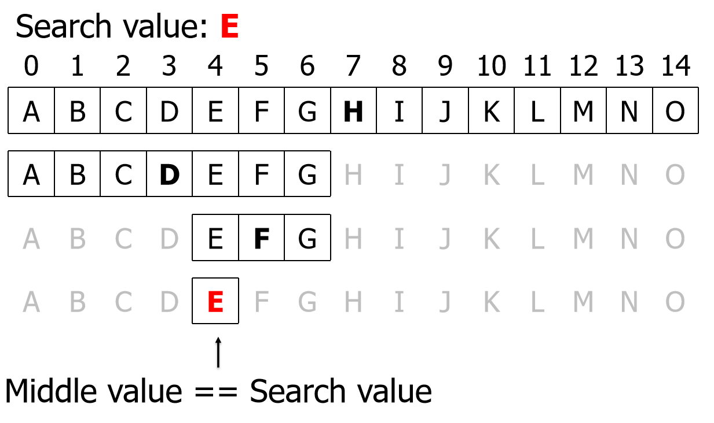
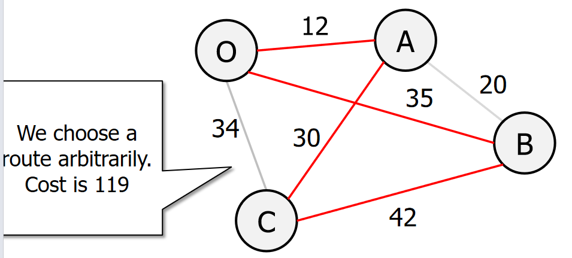
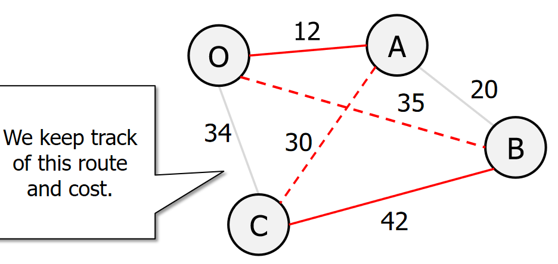
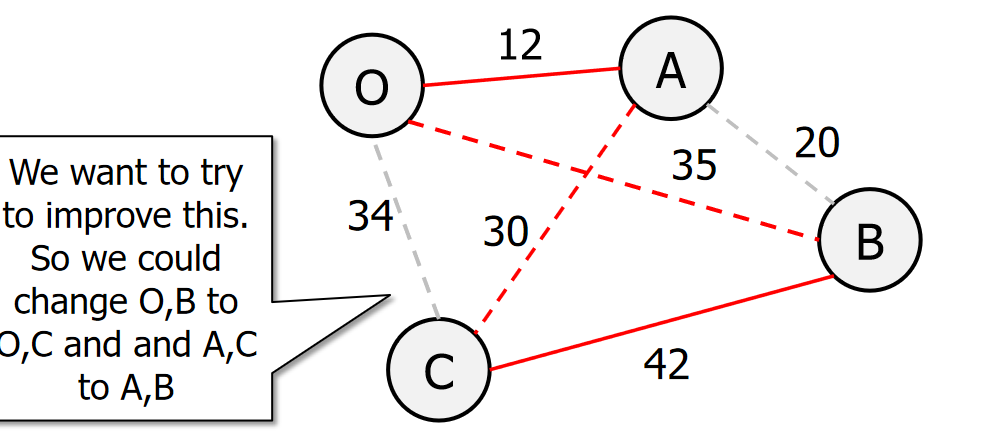
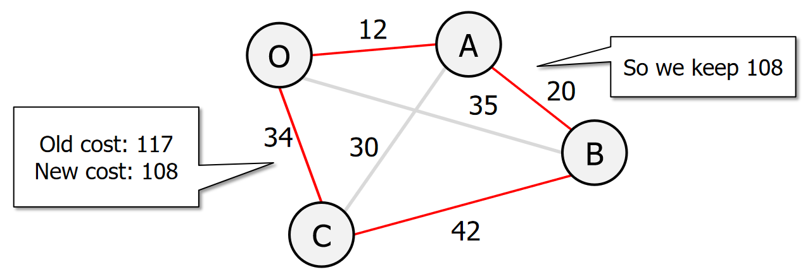

## Lecture 08

### 时间复杂度



#### 1. constant $O(1)$

```python
a = [11, 22, 33, 44, 55]
b = [10, 8, 7]

print(a[0])
print(b[0])
```

如插值搜索（最好情况）的时间复杂度。


#### 2. Logarithmic $O(log n)$

如二分搜索的时间复杂度。



每次都会将要操作的对象减半。符合 log 函数的定义。


#### 3. linear $O(n)$

伪代码：

```python
FIND (A, target) 
	n ← A.length 
	FOR (i FROM 0 TO n) 
		IF (A[i]=target) 
			RETURN TRUE 
	RETURN FALSE 
```


#### 4. log linear $O(n log n)$

- O (n log n) means do O (log n) n times.
- So e.g. do 6 binary searches

```python
def linear_log_recur(n: int) -> int:
    """线性对数阶"""
    if n <= 1:
        return 1
    # 一分为二，子问题的规模减小一半
    count = linear_log_recur(n // 2) + linear_log_recur(n // 2)
    # 当前子问题包含 n 个操作
    for _ in range(n):
        count += 1
    return count
```


#### 5. polynomial $O(n^k)$

嵌套循环。

插值排序：

```python
INSERTION-SORT(A)
	for j ← 1 to length[A]				(n times)
		key ← A[j]						(n times)
		i ← j-1							(n times)
		while i > 0 and A[i] > key		(n*n times)
			A[i+1] ← A[i]				(n*n times)
			i ← i+1					(n*n times)
		A[i+1] ← key 					(n times)
```


#### 6. exponential  $O(2^n)$

斐波那契数列：

```python
FIBONACCI(num)
	IF num <=1
		return num
	return FIBONACCI (num-2) + FIBONACCI(num-1)
```


#### 7. factorial  $O(n!)$

```python
def factorial_recur(n):
    if n == 0:
        return 1
    count = 0
    for i in range(n):
        count += factorial_recur(n - 1)
        
    return count
```


### NP-Hard problems

- NP - Non deterministic Polynomial time complexity
- A non deterministic algorithm can exhibit different behaviours on different runs for the same input variables.

#### 1. Exhaustive search —— Travelling saleman

这是关于**穷举搜索（Exhaustive Search）**的概述图片，介绍了穷举搜索的一些特点。这类搜索方法遍历所有可能的解，以找到满足问题条件的解。穷举搜索适用于问题规模较小的情况，因为它的时间和空间成本会随着问题规模的增加而迅速增长。

穷举法：

```python
import itertools  # 导入Python的itertools库，用于处理迭代器

# 定义边的列表，即城市之间的距离
dists = [
    ['A', 'B', 20], ['A', 'C', 35], ['A', 'D', 42],
    ['B', 'A', 20], ['B', 'C', 34], ['B', 'D', 30],
    ['C', 'A', 35], ['C', 'B', 34], ['C', 'D', 12],
    ['D', 'A', 42], ['D', 'B', 30], ['D', 'C', 12]
]


# 定义函数，获取所有可能的排列（即可能的路径）
def get_and_convert_perm_list(dests):
    # 使用itertools.permutations生成所有排列
    perm_list = list(itertools.permutations(dests))  # 生成一个包含所有排列的列表（列表中的元素是元组）
    new_perm_list = []  # 定义一个新的列表，用于存储列表形式的排列

    # 将元组转换为列表（方便后续处理）
    for item in perm_list:
        new_perm_list.append(list(item))

    return new_perm_list  # 返回转换后的排列列表


# 定义函数，计算每条路径的总距离
def TSP_get_dists(dests, dists):
    results = []  # 用于存储所有结果的列表
    perm_list = get_and_convert_perm_list(dests)  # 获取所有排列列表

    # 遍历每一个排列（即一条路径）
    for item in perm_list:
        item.append(item[0])  # 将起点添加到路径末尾，形成回路
        total_dist = 0  # 初始化总距离

        # 计算该路径的总距离
        for i in range(len(item) - 1):  # 遍历路径中的每对相邻城市
            for dist in dists:  # 匹配路径中的每对城市与距离列表中的城市对
                if item[i] == dist[0] and item[i + 1] == dist[1]:  # 找到匹配的城市对
                    total_dist = total_dist + dist[2]  # 将对应的距离加到总距离中

                    # 如果已经遍历完该路径，记录总距离
                    if i == len(item) - 2:
                        item.append(total_dist)  # 将总距离添加到路径的末尾
                        print(item)  # 打印路径及其总距离，便于观察
                        results.append(item)  # 将该路径及总距离添加到结果列表中

    return results  # 返回所有结果的列表


# 调用函数，计算包含城市A、B、C、D的所有路径及其总距离
TSP_get_dists(['A', 'B', 'C', 'D'], dists)
```


#### 2. Heuristics ——Travelling saleman

启发式函数能在合理的时间范围内产生一个足以解决问题的解决方案。该解决方案可能不是最佳解决方案，但可能仍然很有价值，因为它不需要很长时间就能找到。

销售员从一个随机城市开始，访问最近的城市，直到访问完所有城市为止

```python
# 定义城市之间的距离
dists = [
    ['A', 'B', 20], ['A', 'C', 35], ['A', 'D', 42],
    ['B', 'A', 20], ['B', 'C', 34], ['B', 'D', 30],
    ['C', 'A', 35], ['C', 'B', 34], ['C', 'D', 12],
    ['D', 'A', 42], ['D', 'B', 30], ['D', 'C', 12]
]

# 定义一个函数，用于查找两个城市之间的距离
def find_distance(city1, city2, dists):
    for dist in dists:
        if dist[0] == city1 and dist[1] == city2:
            return dist[2]
    return float('inf')  # 如果没有找到对应的距离，返回无穷大

# 定义最近邻算法的主函数
def nearest_neighbour(start, dists):
    unvisited = ['A', 'B', 'C', 'D']  # 未访问的城市
    visited = []  # 已访问的城市
    connections = []  # 记录访问路径的连接

    u = start  # 从起始城市开始
    visited.append(u)  # 将起始城市添加到已访问列表
    unvisited.remove(u)  # 从未访问列表中移除起始城市

    # 当还有未访问的城市时，继续循环
    while unvisited:
        # 找到从当前城市到未访问城市的最小距离的边
        min_distance = float('inf')
        next_city = None

        for city in unvisited:
            distance = find_distance(u, city, dists)  # 查找距离
            if distance < min_distance:  # 如果找到更小的距离
                min_distance = distance
                next_city = city

        # 更新当前城市为找到的下一个城市
        u = next_city
        connections.append((visited[-1], u, min_distance))  # 添加边到连接列表
        visited.append(u)  # 将找到的城市添加到已访问列表
        unvisited.remove(u)  # 从未访问列表中移除该城市

    return connections  # 返回完整的访问路径和距离

# 调用函数，并输出结果
start_city = 'A'
route = nearest_neighbour(start_city, dists)

# 输出路径
print("访问路径及距离：")
for connection in route:
    print(f"从 {connection[0]} 到 {connection[1]} 的距离为 {connection[2]}")
```


#### 3. Local search

::: tabs

@tab



@tab



@tab



@tab



:::

```python
import random

# 定义城市之间的距离
dists = {
    ('A', 'B'): 20, ('A', 'C'): 35, ('A', 'D'): 42,
    ('B', 'A'): 20, ('B', 'C'): 34, ('B', 'D'): 30,
    ('C', 'A'): 35, ('C', 'B'): 34, ('C', 'D'): 12,
    ('D', 'A'): 42, ('D', 'B'): 30, ('D', 'C'): 12
}

# 定义计算路径总距离的函数
def distance(route, dists):
    total_distance = 0
    for i in range(len(route) - 1):
        total_distance += dists[(route[i], route[i+1])]
    total_distance += dists[(route[-1], route[0])]  # 回到起始点
    return total_distance

# 定义变异函数，用于2-opt交换
def mutate_2_opt(route):
    i, j = random.sample(range(1, len(route)), 2)
    if i > j:
        i, j = j, i
    # 执行2-opt交换
    new_route = route[:i] + route[i:j+1][::-1] + route[j+1:]
    return new_route

# 定义TSP的局部搜索算法
def local_search_tsp(startroute, dists, i_max=100):
    current_route = startroute  # 初始化为起始路径
    min_distance = distance(current_route, dists)  # 计算初始路径的总距离

    for i in range(i_max):
        new_route = mutate_2_opt(current_route)  # 生成一个新路径
        new_distance = distance(new_route, dists)  # 计算新路径的距离

        if new_distance < min_distance:  # 如果新路径更短，则更新最优解
            min_distance = new_distance
            current_route = new_route

    return current_route, min_distance  # 返回最优路径和最短距离

# 定义初始路径
start_route = ['A', 'B', 'C', 'D']

# 调用局部搜索算法并输出结果
best_route, best_distance = local_search_tsp(start_route, dists)

print("最优路径:", best_route)
print("最优路径的总距离:", best_distance)
```

#### 4.  Simulated annealing

```python
import math
import random

# 定义城市之间的距离
dists = {
    ('A', 'B'): 20, ('A', 'C'): 35, ('A', 'D'): 42,
    ('B', 'A'): 20, ('B', 'C'): 34, ('B', 'D'): 30,
    ('C', 'A'): 35, ('C', 'B'): 34, ('C', 'D'): 12,
    ('D', 'A'): 42, ('D', 'B'): 30, ('D', 'C'): 12
}

# 定义计算路径总距离的函数
def distance(route, dists):
    total_distance = 0
    for i in range(len(route) - 1):
        # 累加相邻城市之间的距离
        total_distance += dists[(route[i], route[i + 1])]
    # 加上最后一个城市回到起始城市的距离
    total_distance += dists[(route[-1], route[0])]
    return total_distance

# 定义变异函数，用于2-opt交换
def mutate_2_opt(route):
    # 随机选择两个索引进行2-opt交换
    i, j = random.sample(range(1, len(route)), 2)
    if i > j:
        i, j = j, i
    # 生成新的路径，将i到j之间的部分反转
    new_route = route[:i] + route[j:i-1:-1] + route[j+1:]
    return new_route

# 模拟退火算法
def simulated_annealing(start_route, dists, initial_temp=1000, cooling_rate=0.995, min_temp=0.01):
    current_route = start_route  # 当前路径初始化为起始路径
    current_distance = distance(current_route, dists)  # 当前路径的总距离
    best_route = current_route  # 初始化最优路径
    best_distance = current_distance  # 初始化最优距离
    temperature = initial_temp  # 设置初始温度

    # 当温度高于最低温度时，持续迭代
    while temperature > min_temp:
        # 生成一个新的路径，并计算其距离
        new_route = mutate_2_opt(current_route)
        new_distance = distance(new_route, dists)
        
        # 判断是否接受新解：若新解更优则接受，若更差则以一定概率接受
        if new_distance < current_distance or random.random() < math.exp((current_distance - new_distance) / temperature):
            current_route = new_route  # 接受新解作为当前解
            current_distance = new_distance
            
            # 如果新解优于最优解，则更新最优解
            if new_distance < best_distance:
                best_route = new_route
                best_distance = new_distance
        
        # 按照冷却速率降低温度
        temperature *= cooling_rate
    
    return best_route, best_distance  # 返回最终的最优路径和最优距离

# 定义初始路径
start_route = ['A', 'B', 'C', 'D']

# 调用模拟退火算法并输出结果
best_route, best_distance = simulated_annealing(start_route, dists)

print("最优路径:", best_route)
print("最优路径的总距离:", best_distance)
```

#### 5. Grasp

**整体思路：**

- 调用 random 库和 math 库。
- 首先封装一个函数算出两个城市之间的距离
- 再封装一个函数算出一条路线上城市的总距离
- `greedy_construct_solution` 用于随机构成一个初始路径
- `local_search`找到局部最优解，这个范围是局部的，因为循环次数有限。
- 不断搜索局部最优解，找到最优的局部最优解。

```python
import random
import math


# 计算两个城市之间的欧几里得距离
def calculate_distance(city1, city2):
    """
    计算城市 city1 和 city2 之间的欧几里得距离。
    :param city1: 城市1的坐标 (x1, y1)
    :param city2: 城市2的坐标 (x2, y2)
    :return: 两个城市之间的距离
    """
    return math.sqrt((city1[0] - city2[0]) ** 2 + (city1[1] - city2[1]) ** 2)


# 计算路径的总距离
def total_distance(path, cities):
    """
    计算给定路径的总距离。
    :param path: 城市访问顺序的列表
    :param cities: 城市的坐标列表
    :return: 路径的总距离
    """
    distance = 0
    for i in range(len(path)):
        city1 = cities[path[i]]
        city2 = cities[path[(i + 1) % len(path)]]
        distance += calculate_distance(city1, city2)
    return distance


# 随机化贪心构造初始解
def greedy_construct_solution(cities):
    """
    使用随机化贪心算法构造一个初始解。
    :param cities: 城市的坐标列表
    :return: 构造出的初始解路径
    """
    num_cities = len(cities)
    unvisited = list(range(num_cities))  # 未访问的城市列表
    solution = []
    current_city = random.choice(unvisited)  # 随机选择一个起始城市
    solution.append(current_city)
    unvisited.remove(current_city)

    # 构造路径，直到所有城市都被访问
    while unvisited:
        # 构建候选列表，并按距离排序
        candidate_list = []
        for city in unvisited:
            distance = calculate_distance(cities[current_city], cities[city])
            candidate_list.append((city, distance))

        # 按距离排序，并构造受限候选列表 (RCL)
        candidate_list.sort(key=lambda x: x[1])
        rcl_size = max(1, len(candidate_list) // 3)  # 选择前 1/3 的较优解作为 RCL
        rcl = candidate_list[:rcl_size]

        # 从 RCL 中随机选择一个城市
        next_city = random.choice(rcl)[0]
        solution.append(next_city)
        unvisited.remove(next_city)
        current_city = next_city

    return solution


# 局部搜索优化解（2-opt 算法）
def local_search(solution, cities):
    """
    使用 2-opt 算法进行局部搜索优化。
    :param solution: 初始解路径
    :param cities: 城市的坐标列表
    :return: 优化后的路径
    """
    best_solution = solution[:]
    best_distance = total_distance(best_solution, cities)

    improved = True
    while improved:
        improved = False
        # 2-opt 搜索：交换路径中的两个边
        for i in range(1, len(solution) - 1):
            for j in range(i + 1, len(solution)):
                if j - i == 1:  # 相邻城市跳过
                    continue
                # 交换两个城市之间的路径
                new_solution = best_solution[:]
                new_solution[i:j] = best_solution[i:j][::-1]
                new_distance = total_distance(new_solution, cities)
                if new_distance < best_distance:
                    best_solution = new_solution[:]
                    best_distance = new_distance
                    improved = True

    return best_solution


# GRASP 主函数
def grasp_tsp(cities, max_iterations):
    """
    使用 GRASP 算法求解旅行商问题。
    :param cities: 城市的坐标列表
    :param max_iterations: 最大迭代次数
    :return: 最优路径和最短距离
    """
    best_solution = None
    best_distance = float('inf')

    for _ in range(max_iterations):
        # 构造初始解
        initial_solution = greedy_construct_solution(cities)
        # 局部搜索优化解
        improved_solution = local_search(initial_solution, cities)
        # 计算路径总距离
        current_distance = total_distance(improved_solution, cities)

        # 更新全局最优解
        if current_distance < best_distance:
            best_solution = improved_solution
            best_distance = current_distance

    return best_solution, best_distance


# 主程序
if __name__ == "__main__":
    # 定义城市的坐标 (x, y)
    cities = [
        (0, 0), (1, 5), (5, 2), (6, 6), (8, 3),
        (3, 7), (7, 9), (4, 4), (9, 1), (2, 8)
    ]

    # 最大迭代次数
    max_iterations = 100

    # 执行 GRASP 算法求解 TSP
    best_solution, best_distance = grasp_tsp(cities, max_iterations)

    # 输出最优路径和最短距离
    print("最优路径:", best_solution)
    print("最短距离:", best_distance)
```


## Lecture 09

### 1. 什么是 Multithreading 多线程问题？

- Multithreading allows us to run an application as separate processes which run ‘asynchronously’

多进程允许我们 run a application as seperate process（多个进程），这叫异步。

- 我们可以在相同的时间运行不同的进程。

#### Chat Sever

- SEVER PART

```python
# 引入必要的模块
import socket  # 用于创建和管理网络连接
import threading  # 用于支持多线程

# 创建一个套接字对象，指定使用 IPv4 地址 (AF_INET) 和 TCP 协议 (SOCK_STREAM)
sock = socket.socket(socket.AF_INET, socket.SOCK_STREAM)

# 绑定套接字到本地地址和端口
# 这里绑定的是本地主机 127.0.0.1 和端口 12345
sock.bind(('127.0.0.1', 12345))

# 使服务器开始监听连接请求
# 参数 1 表示允许队列中最多有 1 个待处理的连接请求
sock.listen(1)

# 用于存储当前所有已连接的客户端
connections = []

# 定义一个函数，用于处理每个客户端连接的通信
def handler(c, a):
    """
    c: 客户端套接字对象
    a: 客户端地址 (IP 和端口)
    """
    while True:
        # 接收客户端发送的数据，最大接收字节为 4098
        data = c.recv(4098)

        # 将收到的数据广播给所有其他已连接的客户端
        for connection in connections:
            if connection != c:  # 排除发送数据的客户端
                connection.send(data)

        # 如果接收到空数据，说明客户端已断开，退出循环
        if not data:
            break

# 主线程用于不断接收新的客户端连接
while True:
    # 接受一个新的客户端连接
    # c 是新的客户端套接字对象，a 是客户端地址
    c, a = sock.accept()

    # 创建一个新线程，用于处理该客户端的通信
    cThread = threading.Thread(target=handler, args=(c, a))

    # 将线程设置为守护线程，确保主线程退出时，子线程自动结束
    cThread.daemon = True

    # 启动该线程
    cThread.start()

    # 将新连接的客户端加入到全局连接列表中
    connections.append(c)

    # 打印当前所有已连接的客户端套接字对象列表
    print(connections)
```

- CLIENT PART

```python
#client.py
#run multiple instances of this after starting the server

import socket
import threading

sock = socket.socket(socket.AF_INET, socket.SOCK_STREAM)

sock.connect(('127.0.0.1', 12345))

def sendMsg():
    while True:
        msg = input().encode()
        sock.send(msg)

iThread = threading.Thread(target=sendMsg)
iThread.daemon = True
iThread.start()

while True:
    #this is data received back from the server
    data = sock.recv(4098).decode()
    if not data:
        break
    print(data)
```


#### NEWS SCRAPERS

##### Non-concurrent-example

```python
# 引入用于发送 HTTP 请求的 urllib.request 模块
import urllib.request

# 定义一个包含多个 URL 的列表，这些是我们要尝试访问的地址
URLS = [
    'http://www.foxnews.com/',         # Fox News 网站
    'http://www.cnn.com/',             # CNN 网站
    'http://europe.wsj.com/',          # 欧洲版华尔街日报
    'http://www.bbc.co.uk/',           # 英国广播公司
    'http://some-made-up-domain.com/'  # 一个不存在的域名（用于测试异常处理）
]

# 定义一个函数，用于加载指定的 URL
def load_url(url, timeout):
    """
    通过指定的 URL 加载数据
    :param url: 要访问的 URL 地址
    :param timeout: 超时时间，单位为秒
    :return: 返回从 URL 读取的内容
    """
    # 使用 urllib.request.urlopen 发送 GET 请求
    # `with` 确保连接资源在使用完成后正确关闭
    with urllib.request.urlopen(url, timeout=timeout) as conn:
        return conn.read()  # 从连接中读取返回的数据并返回

# 定义一个函数，按顺序加载 URL 并处理异常
def non_concurrent_URLs_example():
    """
    按顺序（非并发）加载 URL，并对每个请求处理可能出现的异常
    """
    # 遍历 URL 列表
    for url in URLS:
        try:
            # 尝试加载 URL，超时时间设为 60 秒
            data = load_url(url, 60)
        except Exception as exc:
            # 如果出现任何异常，打印异常信息
            print('%r generated an exception: %s' % (url, exc))
        else:
            # 如果成功加载 URL，打印页面大小（字节数）
            print('%r page is %d bytes' % (url, len(data)))

# 调用函数，运行非并发的 URL 加载示例
non_concurrent_URLs_example()
```

从代码中可以明确看到，**这是一个非并发（单线程）的程序**。以下是原因的详细分析：

**为什么是单线程？**

1. **代码设计：**
    - 在 `non_concurrent_URLs_example` 函数中，程序通过 `for url in URLS:` 循环依次加载每个 URL。
    - 每次加载操作是顺序执行的，只有当前的 URL 加载完成后，程序才会继续处理下一个 URL。
    - 这种方式不会并发或并行执行任何操作。
2. **没有使用线程或进程相关的工具：**
    - 如果是多线程，代码中应该会引入线程相关的模块（如 `threading`）并启动多个线程。
    - 如果是多进程，代码中会引入进程模块（如 `multiprocessing`）并启动多个进程。
3. **单线程行为：**
    - 每次只处理一个 URL 请求，其他请求需要等待当前请求完成后才会开始

##### concurrent-example

```python
# 导入必要的模块
import concurrent.futures  # 用于并发执行任务的高层接口
import urllib.request      # 用于发送 HTTP 请求
import timeit              # 可用于计时（目前未用到）

# 定义需要访问的 URL 列表
URLS = [
    'http://www.foxnews.com/',         # Fox News 网站
    'http://www.cnn.com/',             # CNN 网站
    'http://europe.wsj.com/',          # 欧洲版华尔街日报
    'http://www.bbc.co.uk/',           # 英国广播公司
    'http://some-made-up-domain.com/'  # 一个不存在的域名（用于测试异常处理）
]

# 定义一个函数，用于加载指定 URL 的数据
def load_url(url, timeout):
    """
    加载指定的 URL 数据
    :param url: 要访问的 URL 地址
    :param timeout: 超时时间（秒）
    :return: 返回从 URL 读取的内容
    """
    # 使用 urllib.request.urlopen 发送 GET 请求
    # 使用 `with` 确保资源在操作完成后自动释放
    with urllib.request.urlopen(url, timeout=timeout) as conn:
        return conn.read()  # 读取返回的数据并返回

# 定义并发加载 URL 的函数
def concurrent_URLs_example():
    """
    使用线程池并发加载 URL
    """
    # 创建一个线程池执行器，最多可以有 5 个线程并发执行任务
    with concurrent.futures.ThreadPoolExecutor(max_workers=5) as executor:
        # 提交所有 URL 的加载任务到线程池，并将每个任务和其对应的 URL 关联
        future_to_url = {executor.submit(load_url, url, 60): url for url in URLS}

        # 处理线程池中的任务，`as_completed` 会返回一个迭代器，
        # 按照任务完成的顺序依次处理
        for future in concurrent.futures.as_completed(future_to_url):
            url = future_to_url[future]  # 获取与当前 future 对应的 URL
            try:
                # 如果任务执行成功，获取结果（即加载的页面数据）
                data = future.result()
            except Exception as exc:
                # 如果任务抛出异常，打印异常信息
                print('%r generated an exception: %s' % (url, exc))
            else:
                # 如果任务成功完成，打印页面大小（字节数）
                print('%r page is %d bytes' % (url, len(data)))

# 调用并发 URL 加载函数
concurrent_URLs_example()
```


### 2. data sharing

#### 单线程

```python
from threading import Thread, Event
from time import sleep
from time import time

event = Event()

def modify_variable(var):
    while True:
        for i in range(len(var)):
            var[i] += 1
        if event.is_set():
            break
    print('Stop printing')


my_var = [1, 2, 3]
t = Thread(target=modify_variable, args=(my_var, ))
t.start()
t0 = time()
while time()-t0 < 5:
    try:
        print(my_var)
        sleep(1)
    except KeyboardInterrupt:
        event.set()
        break
event.set()
t.join()
print(my_var)
```

```python
[28968, 28968, 28969]
[4674591, 4674592, 4674593]
[9478383, 9478384, 9478384]
[14256289, 14256290, 14256291]
[19175299, 19175300, 19175300]
Stop printing
[24035613, 24035614, 24035615]# 主线程打印了一遍
```


#### unmanaged data access two threads

```python
from threading import Thread, Event
from time import time
from time import sleep

event = Event()

def modify_variable(var):
    while True:
        for i in range(len(var)):
            var[i] += 1
        if event.is_set():
            break
        #sleep(.5)
    print('Stop printing')

my_var = [1, 2, 3]
t = Thread(target=modify_variable, args=(my_var, ))
t2 = Thread(target=modify_variable, args=(my_var, ))
t.start()
t2.start()
t0 = time()
while time()-t0 < 5:
    try:
        print(my_var)
        sleep(1)
    except KeyboardInterrupt:
        event.set()
        break
event.set()
t.join()
t2.join()
print(my_var)
```

```python
[592709, 592709, 592710]
[5411562, 5411563, 5411564]
[10500502, 10500503, 10500503]
[15740738, 15740739, 15740740]
[20633360, 20633361, 20633361]
Stop printingStop printing

[25653103, 25653104, 25653105]
```


#### Lock

```python
import threading
from threading import Thread, Event
from time import time
from time import sleep
from threading import Lock

event = Event()
data_lock = Lock()

def modify_variable(var):
    while True:
        for i in range(len(var)):
            with data_lock:
                var[i] += 1
        if event.is_set():
            break
    print('Stop printing')

my_var = [1, 2, 3]
t = threading.Thread(target=modify_variable, args=(my_var, ))
t2 = threading.Thread(target=modify_variable, args=(my_var, ))
t.start()
t2.start()
t0 = time()

while time()-t0 < 5:
#while True:
    try:
        print(my_var)           
        sleep(1)
    except KeyboardInterrupt:
        event.set()
        break
event.set()
t.join()
t2.join()
print(my_var)
```

```python
[121165, 121165, 121166]
[2073767, 2073768, 2073769]
[4153462, 4153463, 4153463]
[6130332, 6130333, 6130333]
[8000434, 8000435, 8000435]
Stop printing
Stop printing
[9856092, 9856093, 9856094]
```


#### Queue

::: code-tabs

@tab 2 queues

```python
import threading
from threading import Thread, Event
from time import time
from time import sleep
from queue import Queue

event = Event()


def modify_variable(queue_in, queue_out):
    while True:
        if not queue_in.empty():
            var = queue_in.get()
            for i in range(len(var)):
                var[i] += 1
            queue_out.put(var)
        if event.is_set():
            break
    print('Stop printing')

my_var = [1, 2, 3]
queue1 = Queue()
queue2 = Queue()
queue1.put(my_var)
t = Thread(target=modify_variable, args=(queue1, queue2))
t2 = Thread(target=modify_variable, args=(queue2, queue1))
t.start()
t2.start()
t0 = time()
while time()-t0 < 5:
    try:
        print(my_var)  
        sleep(1)
    except KeyboardInterrupt:
        event.set()
        break
event.set()
t.join()
t2.join()
if not queue1.empty():
    print(queue1.get())
if not queue2.empty():
    print(queue2.get())
```

```python
[3, 4, 5]
[67, 68, 69]
[135, 136, 137]
[200, 201, 202]
[263, 264, 265]
Stop printing
Stop printing
[330, 331, 332]
```

@tab 1 queue

```python
import threading
from threading import Thread, Event
from time import time
from time import sleep
from queue import Queue

event = Event()


def modify_variable(queue_in, queue_out):
    while True:
        if not queue_in.empty():
            var = queue_in.get()
            for i in range(len(var)):
                var[i] += 1
            queue_out.put(var)
        if event.is_set():
            break
    print('Stop printing')

my_var = [1, 2, 3]
queue1 = Queue()
queue1.put(my_var)
t = Thread(target=modify_variable, args=(queue1, queue1))
t2 = Thread(target=modify_variable, args=(queue1, queue1))
t.start()
t2.start()
t0 = time()
while time()-t0 < 5:
    try:
        print(my_var)  
        sleep(1)
    except KeyboardInterrupt:
        event.set()
        break
event.set()
t.join()
t2.join()
if not queue1.empty():
    print(queue1.get())
```

```python
[16892, 16893, 16894]
[447286, 447287, 447288]
[929397, 929398, 929399]
[1400916, 1400917, 1400918]
[1876637, 1876638, 1876639]
Stop printing
Stop printing
[2343167, 2343168, 2343169]
```

:::
