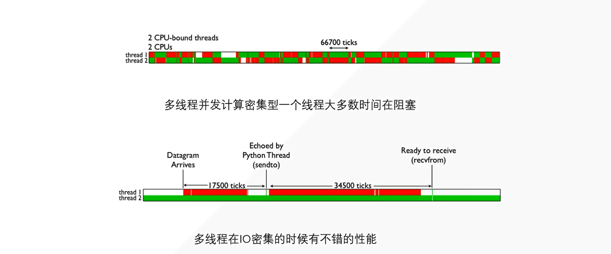
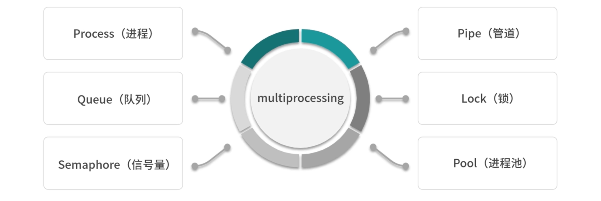
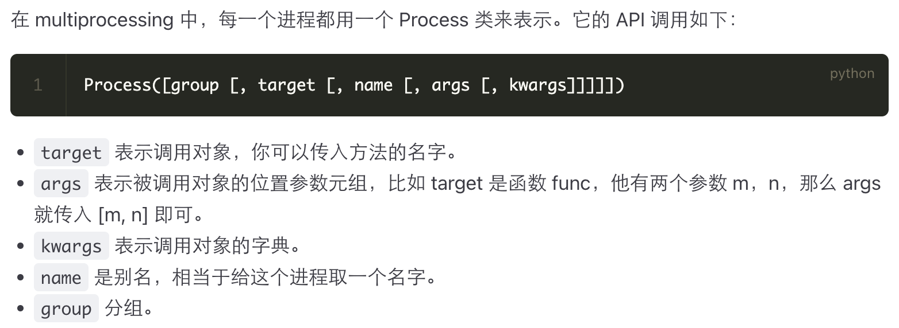

## 0. 进程和线程

通过场景理解进程和线程较为容易：当我们上网浏览打开网页，就开启了一个进程。一个进程可以处理很多任务，这些任务叫线程。我们在这个网页上播放音乐、查找音乐、调整音乐播放进度属于开启了一个个小线程。

总而言之，进程就是线程的集合，进程就是由一个或多个线程构成的，线程是操作系统进行**运算调度的最小单位**，是进程中的一个最小运行单元。


## 1. Intended Learning

- Understand the multithreading concept

- Be able to explain applications of multithreading

- Understand and manage data sharing in multithreaded environments
- Be able to explain the race condition
- Understand implementation of threading (mainly) in Python and (partly) in C++


## 2. What is multithreading?

- Many of the applications you’ve written so far do one thing after another
- Multithreading allows us to run an application as separate processes which run ‘asynchronously’
- i.e., the timing is arbitrary
- This results in processes which run at the same or similar / overlapping times


## 3. Applications of multithreading

- We’ll now look at two applications of multithreading:
    1. Chat server
    2. Newspaper size getter

## 4. Concurrent Example 1: CHAT SERVER

- The first example of a threaded environment is a chat server

- We’ll set this up and run it in the lecture

- Note that all the code in this session is on Aula, but it needs a stack and a server

- Best way to do this is Codio

- There are instructions how to set this up on Aula

### 代码

**Aula 原版：**

::: code-tabs

@tab sever

```python
#server.py
#run this first 

import socket
import threading

sock = socket.socket(socket.AF_INET, socket.SOCK_STREAM)

sock.bind(('127.0.0.1', 12345))

sock.listen(1)

connections = []

def handler (c, a):
    while True:
        data = c.recv(4098)
        for connection in connections:
            if connection != c:
                  connection.send(data)
        if not data:
              break

while True:
    c, a = sock.accept()
    cThread = threading.Thread(target=handler, args=(c, a))
    cThread.daemon = True
    cThread.start()
    connections.append(c)
    print(connections)
```

@tab client

```python
#client.py
#run multiple instances of this after starting the server

import socket
import threading

sock = socket.socket(socket.AF_INET, socket.SOCK_STREAM)

sock.connect(('127.0.0.1', 12345))

def sendMsg():
    while True:
        msg = input().encode()
        sock.send(msg)

iThread = threading.Thread(target=sendMsg)
iThread.daemon = True
iThread.start()

while True:
    #this is data received back from the server
    data = sock.recv(4098).decode()
    if not data:
        break
    print(data)
```

:::

**注释版：**

::: code-tabs

@tab sever

```python
# 导入 socket 和 threading 模块
import socket
import threading

# 创建一个 socket 对象，使用 IPv4 和 TCP 协议
sock = socket.socket(socket.AF_INET, socket.SOCK_STREAM)

# 绑定服务器 IP 和端口
sock.bind(('127.0.0.1', 12345))

# 开始监听客户端连接，最多可以排队一个连接
sock.listen(1)

# 存储所有连接的客户端
connections = []

# 定义一个 handler 函数，用于处理每个客户端的消息
def handler(c, a):
    while True:
        # 接收客户端发送的数据（最大接收 4098 字节）
        data = c.recv(4098)
        
        # 遍历所有连接的客户端，将接收到的数据转发给每个其他客户端
        for connection in connections:
            if connection != c:  # 排除自己
                connection.send(data)
        
        # 如果没有数据（客户端关闭连接），退出循环
        if not data:
            break

# 主循环，等待客户端连接
while True:
    # 接受客户端连接
    c, a = sock.accept()
    
    # 启动一个新线程处理该客户端的消息
    cThread = threading.Thread(target=handler, args=(c, a))
    cThread.daemon = True  # 设置为守护线程，程序退出时自动结束
    cThread.start()
    
    # 将新连接的客户端添加到连接列表中
    connections.append(c)
    
    # 打印当前所有连接的客户端
    print(connections)
```

@tab client

```python
# 导入 socket 和 threading 模块
import socket
import threading

# 创建一个 socket 对象，使用 IPv4 和 TCP 协议
sock = socket.socket(socket.AF_INET, socket.SOCK_STREAM)

# 连接到服务器的 IP 和端口
sock.connect(('127.0.0.1', 12345))

# 定义一个发送消息的函数
def sendMsg():
    while True:
        # 获取用户输入，并将其编码为字节串发送
        msg = input().encode()
        sock.send(msg)

# 启动一个线程负责发送消息
iThread = threading.Thread(target=sendMsg)
iThread.daemon = True  # 设置为守护线程
iThread.start()

# 接收来自服务器的数据并打印
while True:
    # 接收数据（最大 4098 字节）
    data = sock.recv(4098).decode()
    
    # 如果没有数据（服务器关闭连接），退出循环
    if not data:
        break
    
    # 打印接收到的数据
    print(data)
```

:::


### 过程详解

#### 1. 启动服务器 (`server.py`)：

   1. 打开一个终端窗口。

   2. 确保你已经在 `server.py` 文件所在的目录。

   3. 执行以下命令来运行服务器：

      ```bash
      python server.py
      ```

   4. 服务器应该开始监听客户端连接，等待连接的客户端发送消息。

#### 2. 启动客户端 (`client.py`)：

   你需要在多个终端窗口中启动多个客户端，以便测试多用户聊天功能。

   - 打开 **另一个终端窗口**（可以是多个窗口），并确保你在 `client.py` 文件所在的目录。

   - 执行以下命令来启动一个客户端：

     ```bash
     python client.py
     ```

   - 你可以运行多个客户端实例，只要在每个终端窗口中运行上面的命令，就能模拟多个用户同时连接到服务器。

#### 3. 测试聊天功能：

   - **客户端输入消息：** 启动客户端后，每个客户端都会提示你输入消息。你可以在每个客户端窗口输入不同的消息，看看消息是否能正确地从一个客户端传递到其他客户端。
   - **消息广播：** 当你在一个客户端输入消息并按 Enter 键时，服务器会将这条消息转发给所有其他连接的客户端，其他客户端会显示你发送的消息。

#### 4. 关闭连接：

   - 如果你想关闭某个客户端，只需在该客户端窗口按 `Ctrl + C` 或关闭该终端窗口即可。
   - 如果要停止服务器，可以在服务器的终端窗口按 `Ctrl + C`。

#### 注意事项：

- **端口占用问题：** 如果你在本地运行多个服务器或客户端，确保端口 `12345` 没有被其他程序占用。如果端口被占用，你可以选择更换端口号，比如 `12346` 等。
- **防火墙/网络问题：** 由于使用的是本地地址 (`127.0.0.1`)，它应该不受防火墙影响，但如果你要在不同机器上测试，需要确保防火墙设置允许使用该端口。

#### 总结：

1. 启动 `server.py`，它会开始监听。
2. 启动多个 `client.py` 实例，输入消息进行聊天。
3. 观察是否所有客户端都能收到其他客户端发出的消息。


## 5. Concurrent Example 2: NEWS SCRAPERS

### More About Threads

- Chat Servers set up threads which run independently so that messages can be sent and received in any order

- Threads also allow processes to be run concurrently – at the same time, or near the same time

- This makes applications faster

###  News size

- First, we’ll check out and run non-concurrent-example-URLs-timeit.py

- This goes to news URLs, reports the URL, and prints the size of the data received

- Note the time taken 

- Code analysis (excluding timeit) over

::: code-tabs

@tab concurrent-example-URLs.py

```python
# 导入 urllib.request 模块，用于处理 URL 请求
import urllib.request

# 定义一个包含多个 URL 的列表，后续程序会依次访问这些网站
URLS = ['http://www.foxnews.com/',
        'http://www.cnn.com/',
        'http://europe.wsj.com/',
        'http://www.bbc.co.uk/',
        'http://some-made-up-domain.com/']

# 定义一个函数用于加载指定 URL 的网页内容
# 参数 url: 要访问的 URL
# 参数 timeout: 设置连接的超时时间，单位是秒
def load_url(url, timeout):
    # 使用 urllib.request.urlopen() 打开 URL，timeout 用于指定超时时间
    # 使用 with 语句保证请求完成后会自动关闭连接
    with urllib.request.urlopen(url, timeout=timeout) as conn:
        # 读取网页内容并返回
        return conn.read()

# 定义一个函数，展示如何按顺序请求多个 URL（不使用并发）
def non_concurrent_URLs_example():
    # 遍历 URLS 列表中的每个 URL
    for url in URLS:
        try:
            # 调用 load_url 函数加载 URL，设置 60 秒的超时
            data = load_url(url, 60)
        except Exception as exc:
            # 如果发生异常（如连接失败、超时等），打印错误信息
            print('%r generated an exception: %s' % (url, exc))
        else:
            # 如果请求成功，打印网页的大小（以字节为单位）
            print('%r page is %d bytes' % (url, len(data)))

# 调用 non_concurrent_URLs_example 函数开始请求并输出结果
non_concurrent_URLs_example()
```

@tab concurrent-example-URLs.timeit.py

```python
import timeit  # 导入 timeit 模块，用来计时代码执行的时间

# 将需要执行并计时的代码放在三引号之间，作为一个字符串传入 timeit
code_to_time = """
# 导入所需的模块
import concurrent.futures  # 用于并发编程的线程池模块
import urllib.request  # 用于处理 HTTP 请求
import threading  # 用于多线程

# 定义需要请求的 URL 列表
URLS = ['http://www.foxnews.com/',
        'http://www.cnn.com/',
        'http://europe.wsj.com/',
        'http://www.bbc.co.uk/',
        'http://some-made-up-domain.com/']

# 定义请求 URL 的函数，设置超时时间
def load_url(url, timeout):
    # 使用 urllib.request.urlopen 发送 HTTP 请求并读取内容
    with urllib.request.urlopen(url, timeout=timeout) as conn:
        return conn.read()

# 定义一个示例函数，演示如何使用线程池并发请求多个 URL
def concurrent_URLs_example():
    # 使用 ThreadPoolExecutor 创建一个最大线程数为 5 的线程池
    with concurrent.futures.ThreadPoolExecutor(max_workers=5) as executor:
        # 将 URL 和对应的请求任务提交到线程池，返回一个字典 future_to_url
        future_to_url = {executor.submit(load_url, url, 60): url for url in URLS}
        
        # 使用 as_completed 获取已经完成的任务
        for future in concurrent.futures.as_completed(future_to_url):
            url = future_to_url[future]  # 获取当前任务对应的 URL
            try:
                # 获取任务结果（即网页内容）
                data = future.result()
            except Exception as exc:
                # 如果请求过程中抛出异常，则打印异常信息
                print('%r generated an exception: %s' % (url, exc), \n)
            else:
                # 如果请求成功，打印网页的大小（字节数）
                print('%r page is %d bytes' % (url, len(data)),\n)
        print(\n)

# 执行并发请求的示例函数
concurrent_URLs_example()
"""

# 使用 timeit.timeit 来计时代码执行的时间
# timeit 会执行传入的代码多次，这里设置执行 10 次，最后取平均值
elapsed_time = timeit.timeit(code_to_time, number=10) / 10  # 计算 10 次执行的平均时间

# 打印每次执行的平均时间（单位为秒）
print(elapsed_time)
```

@tab non-concurrent-example-URLs.py

```python
# 导入需要的库
import concurrent.futures  # 用于并发执行任务
import urllib.request  # 用于发送网络请求
import timeit  # 用于计时，虽然在此代码中未被使用

# 预定义一个URL列表
URLS = ['http://www.foxnews.com/',
        'http://www.cnn.com/',
        'http://europe.wsj.com/',
        'http://www.bbc.co.uk/',
        'http://some-made-up-domain.com/']

# 定义一个函数，用于加载指定的URL
# 该函数接受两个参数：url（要访问的网址）和timeout（请求的超时时间）
def load_url(url, timeout):
    # 使用urllib.request.urlopen()方法打开指定的URL
    # 其中timeout表示连接超时的时间（单位为秒）
    with urllib.request.urlopen(url, timeout=timeout) as conn:
        # 返回页面的内容（以字节形式）
        return conn.read()

# 定义一个函数，展示如何并发地加载多个URL
def concurrent_URLs_example():
    # 使用concurrent.futures.ThreadPoolExecutor创建一个线程池执行器
    # max_workers=5表示最多允许同时执行5个线程
    with concurrent.futures.ThreadPoolExecutor(max_workers=5) as executor:
        # 创建一个字典future_to_url，将每个URL任务与线程池中的future对象关联
        # executor.submit(load_url, url, 60)会将load_url函数及其参数提交到线程池中
        # 60是请求的超时时间
        future_to_url = {executor.submit(load_url, url, 60): url for url in URLS}
        
        # 使用concurrent.futures.as_completed()方法来遍历所有任务的结果
        # 该方法会按任务完成的顺序返回future对象
        for future in concurrent.futures.as_completed(future_to_url):
            # 获取当前future对象对应的URL
            url = future_to_url[future]
            try:
                # 调用future.result()获取任务的返回结果（即网页内容）
                data = future.result()
            except Exception as exc:
                # 如果任务执行过程中发生异常，打印异常信息
                print('%r generated an exception: %s' % (url, exc))
            else:
                # 如果任务执行成功，打印URL及其页面的字节长度
                print('%r page is %d bytes' % (url, len(data)))

# 调用concurrent_URLs_example函数来执行并发任务
concurrent_URLs_example()
```

@tab non-concurrent-example-URLs.timeit.py

```python
```


:::


## 6. 理解的例子

```python
import time
import threading

def start():
    for i in range(1000000):
        i += 1
    return

# TODO: 0.20663189888000488
# 不使用任何线程（裸着来）
# def main():
#     start_time = time.time()
#     for i in range(10):
#         start()
#     print(time.time() - start_time)
#
#
# if __name__ == '__main__':
#     main()

def main():
    start_time = time.time()
    thread_name_time = {}  # 我们先创建个字典 (thread_name_time) 用来来存储我们每个线程的名称与对应的时间
    for i in range(10):
        # 也就是说，每个线程顺序执行
        thread = threading.Thread(target=start)  # target=写你要多线程运行的函数，不需要加括号
        thread.start()  # 上一行开启了线程，这一行是开始运行（也就是开启个 run）
        thread_name_time[i] = thread  # 添加数据到我们的字典当中，这里为什么要用i做key？这是因为这样方便我们join


    for i in range(10):
        thread_name_time[i].join()
        # 	join() 等待线程执行完毕（也就是说卡在这里，这个线程执行完才会执行下一步）
    print(time.time() - start_time)

if __name__ == '__main__':
    main()
```


## 7. try except

对于一个需要输入的代码，输入一个整数来判断是奇数还是偶数：

```python
user_input = input(':>>>')
if user_input.isdigit():
    if int(user_input) % 2 == 0:
        print('even')
    else:
        print('odd')
else:
    print('需要正常数字')
```

可以看到，我们需要一个条件判断来排除输入不是整数的情况，让程序不至于报错。

新语法可以使得这个功能更简洁清晰：

```python
try:
    # 正常执行的代码
    pass
except:
    # 出现错误的代码
    pass
```

### 基础实现

对于上述功能的代码，我们可以这么写：

::: tabs

@tab

```python
user_input = input(':>>>')
try:
    user_input = int(user_input)
    if user_input % 2 == 0:
        print(even)
    else:
        print(odd)
except:
    print('Invalid')
```

@tab + 条件

当然，except 后面还可以跟条件。什么样的条件？—— **报错类型。** 就是如果代码不是 except 后面跟的报错类型，就不会执行 except 里面的命令。

```python
user_input = input(':>>>')
try:
    user_input = int(user_input)
    if user_input % 2 == 0:
        print(even)
    else:
        print(odd)
except TypeError:
    print('Invalid')
    
# output
:>>>a
Traceback (most recent call last):
  File "D:\603\pythonProject1\.venv\Scripts\demo.py", line 3, in <module>
    user_input = int(user_input)
ValueError: invalid literal for int() with base 10: 'a'
```

这里的报错属于 `ValueError` ，于是 except 后接 `TypeError` 会不执行 except 后面的命令，报错。

```python
user_input = input(':>>>')
try:
    user_input = int(user_input)
    if user_input % 2 == 0:
        print(even)
    else:
        print(odd)
except ValueError:
    print('Invalid')
    
# output
:>>>a
Invalid
```

@tab + 条件s

当然，一个 except 可以有多个条件，也可以有多个 except

```python
user_input = input(':>>>')
try:
    user_input = int(user_input)
    if user_input % 2 == 0:
        print(even)
    else:
        print(odd)
except (ValueError,TypeError):
    print('Invalid')

except KeyboardInterrupt:
    print('Interrupted')
```

:::

### finally

```python
user_input = input(':>>>')
try:
    user_input = int(user_input)
    if user_input % 2 == 0:
        print(even)
    else:
        print(odd)
except (ValueError,TypeError):
    print('Invalid')
finally:
    print('a')
    
#output
:>>>h
Invalid
a
```

无论发生什么，代码==最后==都会执行 finally。finally 不能单独存在，必须与 try except 搭配使用。


## 8. 计算密集型和IO密集型



> BIOS: B: Base; I: Input; O: Output; S: System

也就是你电脑开机的时候就会启动的。

1. **计算密集型**

> 在上面的时候，我们开启了两个线程，如果这两个线程要同时执行，那同一时期 CPU 上只有一个线程在执行。 那从上图可知，那这两个线程就需要频繁的在上下文切换。 Ps：我们这个绿色表示我们这个线程正在执行，红色代表阻塞。 所以，我们可以明显的观察到，线程的上下文切换也是需要消耗资源的（时间-ms）不断的归还和拿取 GIL 等，切换上下文。明显造成很大的资源浪费。


2. **IO密集型**

> 我们现在假设，有个服务器程序（Socket）也就是我们新开的一个程序（也就是我们网络爬虫的最底层）开始爬取目标网页了，我们那个网页呢，有两个线程同时运行，我们线程二已经请求成功开始运行了，也就是上图的 （Thread 2）绿色一条路过去。 而我们的线程一（Thread 1）- Datagram（这里它开启了一个 UDP），然后等待数据建立（也就是等待哪些 HTML、CSS 等数据返回）也就是说，在 Ready to receive（recvfrom） 之间都是准备阶段。这样就是有一段时间一直阻塞，而我们的线程二可以一直无停歇也不用切换上下文就一直在运行。这样的 IO 密集型就有很大的好处。

这里我们需要注意的是，我们的多线程是运行在 IO 密集型上的，我们得区分清楚。

还有就是，资源等待，比如有时候我们使用浏览器发起了一个 Get 请求，那浏览器图标上面在转圈圈的时候就是我们请求资源等待的时间，（也就是图上面的 Datagram 到 Ready to receive ）数据建立到数据接收（就是转圈圈的时间）。我们完全就不需要执行它，就让它等待就好。这个时候让另一个线程去执行就好


## 9. 线程

### 非守护线程

```python
import threading, time

def start(num):
    time.sleep(num)
    print(threading.current_thread().name) # 当前线程名称
    print(threading.current_thread().is_alive()) # 当前线程状态
    print(threading.current_thread().ident) # 当前线程的编号

print('start')
# 要使用多线程哪个函数>>>target=函数,name=给这个多线程取个名字
# 如果你不起一个名字的话，那那它会自己去起一个名字的（pid）也就是个 ident
# 类似声明
thread = threading.Thread(target=start,name='my first thread',args=(1,))

# 每个线程写完你不start()的话，就类似只是声明
thread.start()
print('stop')
```

::: info

由上图可知，声明为线程函数的函数也可以有参数，具体传入参数的方法：`args = # 元组`，有几个参数元组里传入多少个参数。

:::

输出：

```python
start
stop
my first thread
True
22268
```

::: important

由输出可知，这个线程函数是在主线程之后才开始执行的。这种函数==**非守护线程**==。

:::


### .join()

```python
import threading, time


def target(second):
    print(f"Treading{threading.current_thread().name} is running")
    print(f"Treading{threading.current_thread().name} sleep {second}s")
    time.sleep(second)
    print(f"Treading{threading.current_thread()} ended")

print(f"Treading{threading.current_thread().name} is running")

for i in [1, 5]:
    t = threading.Thread(target=target, args=[i])
    t.start()
    t.join()
print(f"Treading{threading.current_thread().name} is ended")
```


输出：

```python
TreadingMainThread is running
TreadingThread-1 (target) is running
TreadingThread-1 (target) sleep 1s
Treading<Thread(Thread-1 (target), started 22892)> ended
TreadingThread-2 (target) is running
TreadingThread-2 (target) sleep 5s
Treading<Thread(Thread-2 (target), started 20580)> ended
TreadingMainThread is ended
```

::: important

在调用线程函数之后加 `.join()`，这样能保证主线程在子线程结束之后结束。

:::


::: detail

可以对比看一下不加第15行的代码的输出：

```python
TreadingMainThread is running
TreadingThread-1 (target) is running
TreadingThread-1 (target) sleep 1s
TreadingThread-2 (target) is running
TreadingThread-2 (target) sleep 5s
TreadingMainThread is ended
Treading<Thread(Thread-1 (target), started 18856)> ended
Treading<Thread(Thread-2 (target), started 23740)> ended
```


在这里我们首先声明了一个方法，叫作 target，它接收一个参数为 second，通过方法的实现可以发现，这个方法其实就是执行了一个 `time.sleep` 休眠操作，second 参数就是休眠秒数，其前后都 print了一些内容，其中线程的名字我们通过 `threading.current_thread().name` 来获取出来，如果是主线程的话，其值就是 `MainThread`，如果是子线程的话，其值就是 Thread-*。

然后我们通过 Thead类新建了两个线程，target参数就是刚才我们所定义的方法名，`args`以列表的形式传递。两次循环中，这里 i 分别就是 1 和 5，这样两个线程就分别休眠 1 秒和 5 秒，声明完成之后，我们调用 start 方法即可开始线程的运行。

观察结果我们可以发现，这里一共产生了三个线程，分别是主线程 MainThread和两个子线程 Thread-1、Thread-2。另外我们观察到，主线程首先运行结束，紧接着 Thread-1、Thread-2 才接连运行结束，分别间隔了 1 秒和 4 秒。这说明主线程并没有等待子线程运行完毕才结束运行，而是直接退出了，有点不符合常理。

如果我们想要主线程等待子线程运行完毕之后才退出，可以让每个子线程对象都调用下 join方法。

:::


### 守护线程

```python
import threading, time

def start(num):
    time.sleep(num)
    print(threading.current_thread().name)
    print(threading.current_thread().is_alive())
    print(threading.current_thread().ident)

print('start')
thread = threading.Thread(target=start, name='my first thread', args=(1,))
thread.setDaemon(True)
thread.start()
print('stop')
```

::: info

显而易见，通过 `thread.setDaemon(True)` 命令我们把非守护线程变成了守护线程。

:::
**守护线程的定义：**不等待子线程的结束，主线程结束所有线程结束。没来得及执行的子线程销毁。

**输出：**

```python
start
stop
```

::: detail

我们把主线程时间延长一点，手动等待子线程运行结束。

```python
import threading, time

def start(num):
    time.sleep(num)
    print(threading.current_thread().name)
    print(threading.current_thread().is_alive())
    print(threading.current_thread().ident)

print('start')
thread = threading.Thread(target=start, name='my first thread', args=(1,))
thread.setDaemon(True)
thread.start()
time.sleep(20)
print('stop')
```

**输出：**

```python
start
my first thread
True
1588
stop
```

:::


### 线程池

```python
import time
import threadpool

# 执行比较耗时的函数，需要开多线程
def get_html(url):
    time.sleep(3)
    print(url)
# 按原本的单线程运行时间为：300s
# 而多线程池的化：30s
# 使用多线程执行 telent 函数
start_time = time.time()
urls = [i for i in range(100)]
pool = threadpool.ThreadPool(100) # 建立线程池

# 提交任务给线程池
requests = threadpool.makeRequests(get_html, urls)

# 开始执行任务
for req in requests:
    pool.putRequest(req)
pool.wait()
print(":>>>>", time.time() - start_time)
```


## 10. 进程

- **多进程的含义：** 通过上一课时我们知道，由于进程中 GIL 的存在，Python 中的多线程并不能很好地发挥多核优势，一个进程中的多个线程，在同一时刻只能有一个线程运行。而对于多进程来说，每个进程都有属于自己的 GIL，所以，在多核处理器下，多进程的运行是不会受 GIL 的影响的。因此，多进程能更好地发挥多核的优势。总的来说，Python 的多进程整体来看是比多线程更有==优势==的。所以，在条件允许的情况下，能用多进程就尽量用多进程。不过值得注意的是，由于进程是系统进行资源分配和调度的一个独立单位，**所以各个进程之间的数据是无法共享的，如多个进程无法共享一个全局变量，进程之间的数据共享需要有单独的机制来实现**，这在后面也会讲到。

- **多进程的实现：** 



在 Python 中也有内置的库来实现多进程，它就是 multiprocessing。多线程在 IO 密集型用的比较多，也就是在爬虫方面用的比较多。而 CPU 密集型根本就不用多线程。

我们一般的策略是，多进程加多线程，这样的结合是最好。multiprocessing 提供了一系列的组件，如 Process（进程）、Queue（队列）、Semaphore（信号量）、Pipe（管道）、Lock（锁）、Pool（进程池）等，接下来让我们来了解下它们的使用方法。


### multiprocessing 库




### 代码

- 最简单的多进程的使用：

```python
import multiprocessing

def process(index):
    print(f"Process:{index}")

if __name__ == '__main__':
    for i in range(5):
        p = multiprocessing.Process(target = process, args = (i,))
        p.start()
```

- 

```python
import multiprocessing, time

def start(i):
    time.sleep(3)
    print(i)
    print(multiprocessing.current_process().name)
    print(multiprocessing.current_process().pid)
    print(multiprocessing.current_process().is_alive())
    print(multiprocessing.cpu_count())

if __name__ == '__main__':
    print('start')
    p = multiprocessing.Process(target=start, args=(1,),name = 'p1')
    p.start()
    print('stop')
```

```python
# 输出
start
stop
1
p1
18888
True
20
```

- 

```python
import multiprocessing, time

def process(index):
    time.sleep(index)
    print(f'Process: {index}')

if __name__ == '__main__':
    for i in range(5):
        p = multiprocessing.Process(target=process, args=[i,])
        p.start()
    print(f'CPU number:{multiprocessing.cpu_count()}')
    for p in multiprocessing.active_children():
        print(f'Child process name:{p.name} id:{p.pid}')
    print("Process Ended")
```

```python
Process: 0
CPU number:20
Child process name:Process-3 id:15888
Child process name:Process-4 id:15688
Child process name:Process-5 id:6680
Child process name:Process-2 id:25484
Process Ended
Process: 1
Process: 2
Process: 3
Process: 4
```


### 进程池

- **进程池执行多个任务：**

```python
from multiprocessing import Pool
def function_square(data):
    result = data*data
    return result

if __name__ == '__main__':
    inputs = [i for i in range(100)]
	# 那么，我们可以首先声明这个进程池；
    pool = Pool(processes=4) # 如果不定义数字，他会根据你的电脑情况自行创建
	# 然后，使用 map 方法，那其实这个 map 方法和正常的 map 方法是一致的。
	# map：
	# pool = Pool()
	# pool.map(main, [i*10 for i in range(10)])
	# 第一个参数：他会将数组中的每一个元素拿出来，当作函数的一个个参数，然后创建一个个进程，放到进程池里面去运行。
	# 第二个参数：构造一个数组，然后也就是 0 到 99 的这么一个循环，那我们直接使用 list 构造一下
    pool_outputs = pool.map(function_square, inputs)
    pool.close()
    pool.join()
    print('Pool  :', pool_outputs)
```

- **进程池执行单个任务：**

```python
from multiprocessing import Pool
def function_square(data):
	result = data*data
	return result

if __name__ == '__main__':
	pool = Pool(processes=4) # 如果你不指定数目的化，它就会根据你电脑状态，自行创建。（按你的电脑自动创建相应的数目）
	# map 把任务交给进程池
	# pool.map(function, iterable)
	pool_outputs = pool.apply(function_square, args=(10, ))
	pool.close()
	pool.join()
	print("Pool     :", pool_outputs)
```

