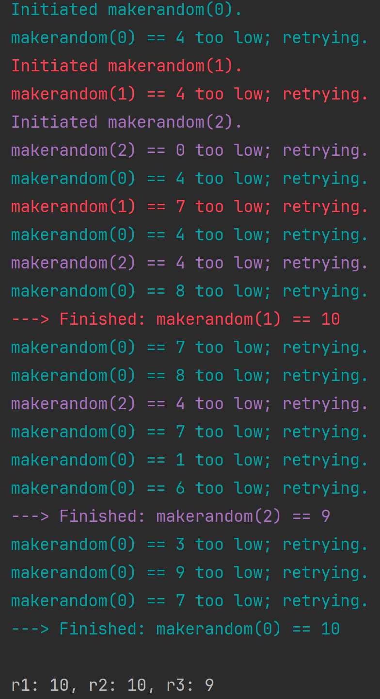

## Lecture 09

### 1. 什么是 Multithreading 多线程问题？

- Multithreading allows us to run an application as separate processes which run ‘asynchronously’

多进程允许我们 run a application as seperate process（多个进程），这叫异步。

- 我们可以在相同的时间运行不同的进程。

#### Chat Sever

- SEVER PART

```python
# 引入必要的模块
import socket  # 用于创建和管理网络连接
import threading  # 用于支持多线程

# 创建一个套接字对象，指定使用 IPv4 地址 (AF_INET) 和 TCP 协议 (SOCK_STREAM)
sock = socket.socket(socket.AF_INET, socket.SOCK_STREAM)

# 绑定套接字到本地地址和端口
# 这里绑定的是本地主机 127.0.0.1 和端口 12345
sock.bind(('127.0.0.1', 12345))

# 使服务器开始监听连接请求
# 参数 1 表示允许队列中最多有 1 个待处理的连接请求
sock.listen(1)

# 用于存储当前所有已连接的客户端
connections = []

# 定义一个函数，用于处理每个客户端连接的通信
def handler(c, a):
    """
    c: 客户端套接字对象
    a: 客户端地址 (IP 和端口)
    """
    while True:
        # 接收客户端发送的数据，最大接收字节为 4098
        data = c.recv(4098)

        # 将收到的数据广播给所有其他已连接的客户端
        for connection in connections:
            if connection != c:  # 排除发送数据的客户端
                connection.send(data)

        # 如果接收到空数据，说明客户端已断开，退出循环
        if not data:
            break

# 主线程用于不断接收新的客户端连接
while True:
    # 接受一个新的客户端连接
    # c 是新的客户端套接字对象，a 是客户端地址
    c, a = sock.accept()

    # 创建一个新线程，用于处理该客户端的通信
    cThread = threading.Thread(target=handler, args=(c, a))

    # 将线程设置为守护线程，确保主线程退出时，子线程自动结束
    cThread.daemon = True

    # 启动该线程
    cThread.start()

    # 将新连接的客户端加入到全局连接列表中
    connections.append(c)

    # 打印当前所有已连接的客户端套接字对象列表
    print(connections)
```

- CLIENT PART

```python
#client.py
#run multiple instances of this after starting the server

import socket
import threading

sock = socket.socket(socket.AF_INET, socket.SOCK_STREAM)

sock.connect(('127.0.0.1', 12345))

def sendMsg():
    while True:
        msg = input().encode()
        sock.send(msg)

iThread = threading.Thread(target=sendMsg)
iThread.daemon = True
iThread.start()

while True:
    #this is data received back from the server
    data = sock.recv(4098).decode()
    if not data:
        break
    print(data)
```


#### NEWS SCRAPERS

##### Non-concurrent-example

```python
# 引入用于发送 HTTP 请求的 urllib.request 模块
import urllib.request

# 定义一个包含多个 URL 的列表，这些是我们要尝试访问的地址
URLS = [
    'http://www.foxnews.com/',         # Fox News 网站
    'http://www.cnn.com/',             # CNN 网站
    'http://europe.wsj.com/',          # 欧洲版华尔街日报
    'http://www.bbc.co.uk/',           # 英国广播公司
    'http://some-made-up-domain.com/'  # 一个不存在的域名（用于测试异常处理）
]

# 定义一个函数，用于加载指定的 URL
def load_url(url, timeout):
    """
    通过指定的 URL 加载数据
    :param url: 要访问的 URL 地址
    :param timeout: 超时时间，单位为秒
    :return: 返回从 URL 读取的内容
    """
    # 使用 urllib.request.urlopen 发送 GET 请求
    # `with` 确保连接资源在使用完成后正确关闭
    with urllib.request.urlopen(url, timeout=timeout) as conn:
        return conn.read()  # 从连接中读取返回的数据并返回

# 定义一个函数，按顺序加载 URL 并处理异常
def non_concurrent_URLs_example():
    """
    按顺序（非并发）加载 URL，并对每个请求处理可能出现的异常
    """
    # 遍历 URL 列表
    for url in URLS:
        try:
            # 尝试加载 URL，超时时间设为 60 秒
            data = load_url(url, 60)
        except Exception as exc:
            # 如果出现任何异常，打印异常信息
            print('%r generated an exception: %s' % (url, exc))
        else:
            # 如果成功加载 URL，打印页面大小（字节数）
            print('%r page is %d bytes' % (url, len(data)))

# 调用函数，运行非并发的 URL 加载示例
non_concurrent_URLs_example()
```

从代码中可以明确看到，**这是一个非并发（单线程）的程序**。以下是原因的详细分析：

**为什么是单线程？**

1. **代码设计：**
    - 在 `non_concurrent_URLs_example` 函数中，程序通过 `for url in URLS:` 循环依次加载每个 URL。
    - 每次加载操作是顺序执行的，只有当前的 URL 加载完成后，程序才会继续处理下一个 URL。
    - 这种方式不会并发或并行执行任何操作。
2. **没有使用线程或进程相关的工具：**
    - 如果是多线程，代码中应该会引入线程相关的模块（如 `threading`）并启动多个线程。
    - 如果是多进程，代码中会引入进程模块（如 `multiprocessing`）并启动多个进程。
3. **单线程行为：**
    - 每次只处理一个 URL 请求，其他请求需要等待当前请求完成后才会开始

##### concurrent-example

```python
# 导入必要的模块
import concurrent.futures  # 用于并发执行任务的高层接口
import urllib.request      # 用于发送 HTTP 请求
import timeit              # 可用于计时（目前未用到）

# 定义需要访问的 URL 列表
URLS = [
    'http://www.foxnews.com/',         # Fox News 网站
    'http://www.cnn.com/',             # CNN 网站
    'http://europe.wsj.com/',          # 欧洲版华尔街日报
    'http://www.bbc.co.uk/',           # 英国广播公司
    'http://some-made-up-domain.com/'  # 一个不存在的域名（用于测试异常处理）
]

# 定义一个函数，用于加载指定 URL 的数据
def load_url(url, timeout):
    """
    加载指定的 URL 数据
    :param url: 要访问的 URL 地址
    :param timeout: 超时时间（秒）
    :return: 返回从 URL 读取的内容
    """
    # 使用 urllib.request.urlopen 发送 GET 请求
    # 使用 `with` 确保资源在操作完成后自动释放
    with urllib.request.urlopen(url, timeout=timeout) as conn:
        return conn.read()  # 读取返回的数据并返回

# 定义并发加载 URL 的函数
def concurrent_URLs_example():
    """
    使用线程池并发加载 URL
    """
    # 创建一个线程池执行器，最多可以有 5 个线程并发执行任务
    with concurrent.futures.ThreadPoolExecutor(max_workers=5) as executor:
        # 提交所有 URL 的加载任务到线程池，并将每个任务和其对应的 URL 关联
        future_to_url = {executor.submit(load_url, url, 60): url for url in URLS}

        # 处理线程池中的任务，`as_completed` 会返回一个迭代器，
        # 按照任务完成的顺序依次处理
        for future in concurrent.futures.as_completed(future_to_url):
            url = future_to_url[future]  # 获取与当前 future 对应的 URL
            try:
                # 如果任务执行成功，获取结果（即加载的页面数据）
                data = future.result()
            except Exception as exc:
                # 如果任务抛出异常，打印异常信息
                print('%r generated an exception: %s' % (url, exc))
            else:
                # 如果任务成功完成，打印页面大小（字节数）
                print('%r page is %d bytes' % (url, len(data)))

# 调用并发 URL 加载函数
concurrent_URLs_example()
```


### 2. data sharing

#### 单线程

```python
from threading import Thread, Event
from time import sleep
from time import time

event = Event()

def modify_variable(var):
    while True:
        for i in range(len(var)):
            var[i] += 1
        if event.is_set():
            break
    print('Stop printing')


my_var = [1, 2, 3]
t = Thread(target=modify_variable, args=(my_var, ))
t.start()
t0 = time()
while time()-t0 < 5:
    try:
        print(my_var)
        sleep(1)
    except KeyboardInterrupt:
        event.set()
        break
event.set()
t.join()
print(my_var)
```

```python
[34528, 34529, 34530]
[2372171, 2372172, 2372173]
[4892276, 4892277, 4892277]
[7424244, 7424245, 7424246]
[9936838, 9936839, 9936840]
Stop printing
[12475565, 12475566, 12475567]
```


#### unmanaged data access two threads

```python
from threading import Thread, Event
from time import time
from time import sleep

event = Event()

def modify_variable(var):
    while True:
        for i in range(len(var)):
            var[i] += 1
        if event.is_set():
            break
        #sleep(.5)
    print('Stop printing')

my_var = [1, 2, 3]
t = Thread(target=modify_variable, args=(my_var, ))
t2 = Thread(target=modify_variable, args=(my_var, ))
t.start()
t2.start()
t0 = time()
while time()-t0 < 5:
    try:
        print(my_var)
        sleep(1)
    except KeyboardInterrupt:
        event.set()
        break
event.set()
t.join()
t2.join()
print(my_var)
```

```python
[99984, 99984, 99984]
[1303222, 1303222, 1303223]
[2517014, 2517015, 2517016]
[3673527, 3673526, 3673527]
[4974842, 4974842, 4974843]
Stop printing
Stop printing
[7138160, 7138161, 7138162]
```


#### Lock

```python
import threading
from threading import Thread, Event
from time import time
from time import sleep
from threading import Lock

event = Event()
data_lock = Lock()

def modify_variable(var):
    while True:
        for i in range(len(var)):
            with data_lock:
                var[i] += 1
        if event.is_set():
            break
    print('Stop printing')

my_var = [1, 2, 3]
t = threading.Thread(target=modify_variable, args=(my_var, ))
t2 = threading.Thread(target=modify_variable, args=(my_var, ))
t.start()
t2.start()
t0 = time()

while time()-t0 < 5:
#while True:
    try:
        print(my_var)           
        sleep(1)
    except KeyboardInterrupt:
        event.set()
        break
event.set()
t.join()
t2.join()
print(my_var)
```

```python
[30389, 30390, 30391]
[697200, 697201, 697202]
[1320040, 1320041, 1320042]
[1930139, 1930140, 1930141]
[2547447, 2547448, 2547449]
Stop printingStop printing

[3166926, 3166927, 3166928]
```


#### Queue

::: code-tabs

@tab 2 queues

```python
import threading
from threading import Thread, Event
from time import time
from time import sleep
from queue import Queue

event = Event()


def modify_variable(queue_in, queue_out):
    while True:
        if not queue_in.empty():
            var = queue_in.get()
            for i in range(len(var)):
                var[i] += 1
            queue_out.put(var)
        if event.is_set():
            break
    print('Stop printing')

my_var = [1, 2, 3]
queue1 = Queue()
queue2 = Queue()
queue1.put(my_var)
t = Thread(target=modify_variable, args=(queue1, queue2))
t2 = Thread(target=modify_variable, args=(queue2, queue1))
t.start()
t2.start()
t0 = time()
while time()-t0 < 5:
    try:
        print(my_var)  
        sleep(1)
    except KeyboardInterrupt:
        event.set()
        break
event.set()
t.join()
t2.join()
if not queue1.empty():
    print(queue1.get())
if not queue2.empty():
    print(queue2.get())
```

```python
[3, 4, 5]
[67, 68, 69]
[135, 136, 137]
[200, 201, 202]
[263, 264, 265]
Stop printing
Stop printing
[330, 331, 332]
```

@tab 1 queue

```python
import threading
from threading import Thread, Event
from time import time
from time import sleep
from queue import Queue

event = Event()


def modify_variable(queue_in, queue_out):
    while True:
        if not queue_in.empty():
            var = queue_in.get()
            for i in range(len(var)):
                var[i] += 1
            queue_out.put(var)
        if event.is_set():
            break
    print('Stop printing')

my_var = [1, 2, 3]
queue1 = Queue()
queue1.put(my_var)
t = Thread(target=modify_variable, args=(queue1, queue1))
t2 = Thread(target=modify_variable, args=(queue1, queue1))
t.start()
t2.start()
t0 = time()
while time()-t0 < 5:
    try:
        print(my_var)  
        sleep(1)
    except KeyboardInterrupt:
        event.set()
        break
event.set()
t.join()
t2.join()
if not queue1.empty():
    print(queue1.get())
```

```python
[16892, 16893, 16894]
[447286, 447287, 447288]
[929397, 929398, 929399]
[1400916, 1400917, 1400918]
[1876637, 1876638, 1876639]
Stop printing
Stop printing
[2343167, 2343168, 2343169]
```

:::


## Lecture 10

### 1. CPU or I/O bound tasks

- CPU-bound: task time depends on speed of processor
- I/O-bound: CPU has to wait for data to be loaded into and out of memory

### 2. Asychronous processing vs multithreading and multiprocessing

- 异步处理将函数控制权让给其他函数，从而加快处理速度

- 与多线程不同，多线程通过将任务分配给线程来加快速度

- 与多进程不同，多进程通过使用多个 CPU/内核来加快速度

- 异步：
    - 只使用一个线程
    - 只使用一个 CPU 内核
    - 那么，异步处理究竟是如何加快速度的呢？

### 3. 怎么做到异步的并发运行？

::: tabs

@tab sync_march

首先，设置一个异步函数 count ，使用 for 循环在 main 函数里调用三次。

```python
import time

def count(): 
    print("One") 
    time.sleep(1) 
    print("Two") 

def main(): 
    for _ in range(3): 
        count() 

if __name__ == "__main__": 
    s = time.perf_counter()
    main()
    elapsed = time.perf_counter() - s 
    print(f"{__file__} executed in {elapsed:0.2f} seconds.") 
```

输出：

```python
One
Two
One
Two
One
Two
```

@tab async_march

我们添加 await 和 gather. 

-  **`await asyncio.sleep(1)` 的含义**

    这行代码的作用是 **异步地暂停协程的执行 1 秒钟**，同时释放控制权给事件循环（event loop）。
    具体来说：

    - `await`：
        - 用于暂停当前协程（coroutine）的执行，等待一个 **异步操作** 完成。
        - 这里，`await` 等待的是 `asyncio.sleep(1)` 的完成。
    - `asyncio.sleep(1)`：
        - 一个异步的非阻塞延时函数，会在 1 秒钟后完成。
        - 在此期间，事件循环可以处理其他任务或协程，而不是阻塞程序等待 1 秒钟。

    ::: tips

    await相当于暂停当前协程，让 await 后面的代码执行完再开始协程。（将控制权交还给事件循环。 在暂停的这段时间内，事件循环会寻找其他待运行的协程任务，并切换去运行它们。）

    :::

```python
import asyncio

async def count(name):
    print(f'{name}:One')
    await asyncio.sleep(1)
    print(f'{name}:Two')

async def main():
    await asyncio.gather(count('Task1'), count('Task2'), count('Task3'))

if __name__ == '__main__':
    import time
    s = time.perf_counter()
    asyncio.run(main())
    elasped_time = time.perf_counter() - s
    print(f'Elapsed time: {elasped_time:0.2f} seconds')
```

输出：

```python
Task1:One
Task2:One
Task3:One
Task1:Two
Task2:Two
Task3:Two
Elapsed time: 1.01 seconds
```

由此可见执行顺序：

- Task1 开始执行，遇到 await 阻塞；
- Task2 趁机执行，遇到 await 阻塞；
- Task3 趁机执行，遇到 await 阻塞；
- Task1最先开始，最早等待完阻塞它的 1 秒钟，结束；
- Task2 结束
- Task3 结束

@tab 一个复杂的例子。直观表现了 await 在事件循环中的作用

```python
import asyncio
import random

# ANSI colors
c = (
    "\033[0m",   # End of color
    "\033[36m",  # Cyan
    "\033[91m",  # Red
    "\033[35m",  # Magenta
)
async def makerandom(idx: int, threshold: int = 6) -> int:
    print(c[idx + 1] + f"Initiated makerandom({idx}).")
    i = random.randint(0, 10)
    while i <= threshold:
        print(c[idx + 1] + f"makerandom({idx}) == {i} too low; retrying.")
        await asyncio.sleep(idx + 1)
        i = random.randint(0, 10)
    print(c[idx + 1] + f"---> Finished: makerandom({idx}) == {i}" + c[0])
    return i

async def main():
    res = await asyncio.gather(*(makerandom(i, 10 - i - 1) for i in range(3)))
    return res

if __name__ == "__main__":
    random.seed(444)
    r1, r2, r3 = asyncio.run(main())
    print()
    print(f"r1: {r1}, r2: {r2}, r3: {r3}")
```

输出：



这个图就很直观的展示了 await 对协程的作用。绿色是第一个开始的协程，也是等待时间最短的协程，所以执行频率较高。红色是第二个开始的，紫色是第三个开始的。

:::

总结：

- 多线程通过将任务（包括同一任务）分配给多个独立线程来加快处理速度
- 多处理通过使用多个处理器来加快处理速度
- 同步处理通过函数向其他函数释放控制来加快处理速度因此函数不必等待其他函数完成后才能执行任务


### 4. Chaining Coroutines

#### 入门例子

```python
import asyncio
import random
import time

async def part1(n: int) -> str:
    i = random.randint(0, 10)
    print(f"part1({n}) sleeping for {i} seconds.")
    await asyncio.sleep(i)
    result = f"result{n}-1"
    print(f"Returning part1({n}) == {result}.")
    return result

async def part2(n: int, arg: str) -> str:
    i = random.randint(0, 10)
    print(f"part2{n, arg} sleeping for {i} seconds.")
    await asyncio.sleep(i)
    result = f"result{n}-2 derived from {arg}"
    print(f"Returning part2{n, arg} == {result}.")
    return result

async def chain(n: int) -> None:
    start = time.perf_counter()
    p1 = await part1(n)
    p2 = await part2(n, p1)
    end = time.perf_counter() - start
    print(f"-->Chained result{n} => {p2} (took {end:0.2f} seconds).")

async def main(*args):
    await asyncio.gather(*(chain(n) for n in args))

if __name__ == "__main__":
    import sys
    random.seed(444)
    args = [1, 2, 3] if len(sys.argv) == 1 else map(int, sys.argv[1:])
    start = time.perf_counter()
    asyncio.run(main(*args))
    end = time.perf_counter() - start
    print(f"Program finished in {end:0.2f} seconds.")
```


- **part1**
    - 这是一个 **异步函数**，会随机延时 `i` 秒，然后返回一个格式化字符串 `result{n}-1`。
    - 示例：如果 `n=1`，可能返回 `result1-1`。
- **part2**
    - 这是第二步任务，会接收 `part1` 的输出作为输入参数 `arg`，随机延时后生成一个基于 `arg` 的结果字符串。
    - 示例：如果 `n=1` 且 `arg="result1-1"`，可能返回 `result1-2 derived from result1-1`。

- **chain**

    - 作用：
        - 将 `part1` 和 `part2` 串联起来依次执行。
        - 打印最终结果及任务耗时。
    - 执行过程：
        1. 调用 `part1` 并等待其完成。
        2. 用 `part1` 的输出作为参数调用 `part2`，并等待其完成。
        3. 打印两步任务的结果以及总耗时\

- `main` 的作用：

    - 接收多个参数 `args`，并为每个参数 `n` 创建一个异步任务。
    - 使用 `asyncio.gather` 并发执行所有任务。

    - 示例：如果传入参数 `(1, 2, 3)`，则会同时启动 3 个 `chain` 任务，分别处理 `n=1`、`n=2` 和 `n=3`。


#### async_march_chained

```python
import asyncio

async def count():
    print("One")
    await asyncio.sleep(1)
    print("Two")

async def chain():
    await count()
    await count()
    await count()

async def main():
    await asyncio.gather(chain())

if __name__ == "__main__":
    import time
    s = time.perf_counter()
    asyncio.run(main())
    elapsed = time.perf_counter() - s
    print(f"Program finished in {elapsed:0.2f} seconds.")
```

输出：

```python
One
Two
One
Two
One
Two
Program finished in 3.01 seconds.
```

可以看到，链式方法只是用一种连锁触发的方式顺序执行了几个协程任务，它们是并行的；不是并发的。


### 5. Queue

- 对于线程解决方案，必须对不同线程的数据访问进行管理。
- 同样，在异步处理中，不同函数访问或生成的数据也需要（而且可以）进行管理。
- 但异步通常用于其他类型的操作，在这些操作中，数据处理/返回的顺序并不那么重要，例如图形用户界面更新

```python
import asyncio
import itertools as it
import os
import random
import time

async def makeitem(size: int = 5) -> str:
    return os.urandom(size).hex()

async def randsleep(a: int = 1, b: int = 5, caller=None) -> None:
    i = random.randint(0, 10)
    if caller:
        print(f"{caller} sleeping for {i} seconds.")
    await asyncio.sleep(i)

async def produce(name: int, q: asyncio.Queue) -> None:
    n = random.randint(0, 10)
    for _ in it.repeat(None, n):    # Synchronous loop for each single producer
        await randsleep(caller=f"Producer {name}")
        i = await makeitem()
        t = time.perf_counter()
        await q.put((i, t))
        print(f"Producer {name} added <{i}> to queue.")

async def consume(name: int, q: asyncio.Queue) -> None:
    while True:
        await randsleep(caller=f"Consumer {name}")
        i, t = await q.get()
        now = time.perf_counter()
        print(f"Consumer {name} got element <{i}>"
              f" in {now-t:0.5f} seconds.")
        q.task_done()

async def main(nprod: int, ncon: int):
    q = asyncio.Queue()
    producers = [asyncio.create_task(produce(n, q)) for n in range(nprod)]
    consumers = [asyncio.create_task(consume(n, q)) for n in range(ncon)]
    await asyncio.gather(*producers)
    await q.join()                  # Implicitly awaits consumers, too
    for c in consumers:
        c.cancel()

if __name__ == "__main__":
    import argparse
    random.seed(444)
    parser = argparse.ArgumentParser()
    parser.add_argument("-p", "--nprod", type=int, default=5)
    parser.add_argument("-c", "--ncon", type=int, default=10)
    ns = parser.parse_args()
    start = time.perf_counter()
    asyncio.run(main(**ns.__dict__))
    elapsed = time.perf_counter() - start
    print(f"Program completed in {elapsed:0.5f} seconds.")
```


```python
import asyncio
import logging
from contextlib import asynccontextmanager

class Interactor:
    def __init__(self, agen):
        self.agen = agen

    async def interact(self, *args, **kwargs, ):
        try:
            await self.agen.asend((args, kwargs))
        except StopAsyncIteration:
            logging.exception("The async generator is already exhausted!")

async def wrap_in_asyngen(handler):
    while True:
        args, kwargs = yield
        handler(*args, **kwargs)

@asynccontextmanager
async def start(agen):
    try:
        await agen.asend(None)
        yield Interactor(agen)    
    finally:
        await agen.aclose()

async def main():
    async with start(wrap_in_asyngen(print)) as w:
        await w.interact("Put ", end="")
        await w.interact("the ", end="")
        await w.interact("worker ", end="")
        await w.interact("to ", end="")
        await w.interact("work!")

asyncio.run(main())
```

