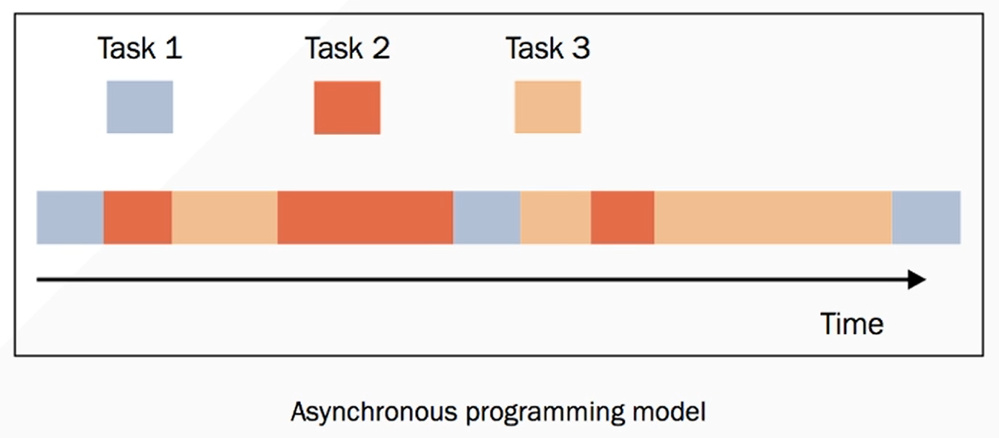
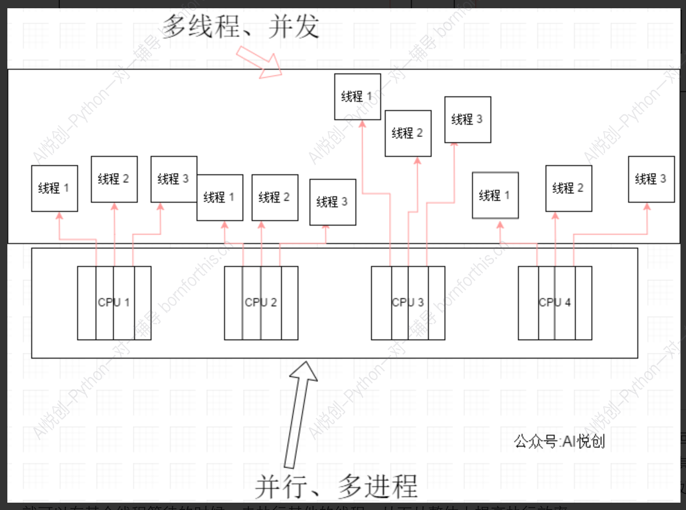

## 1. 初窥门款

异步模型是事件驱动模型的基础。

> 事件驱动是指在持续事务管理过程中，进行决策的一种策略，即跟随当前时间点上出现的事件，调动可用资源，执行相关任务，使不断出现的问题得以解决，防止事务堆积。在计算机编程、公共关系、经济活动等领域均有应用。
>
> 所谓事件驱动，简单地说就是你点什么按钮（即产生什么事件），电脑执行什么操作（即调用什么函数）。当然事件不仅限于用户的操作，事件驱动的核心自然是**事件**。从事件角度说，事件[驱动程序](https://baike.baidu.com/item/驱动程序)的基本结构是由一个事件收集器、一个事件发送器和一个事件处理器组成。事件收集器专门负责收集所有事件，包括来自用户的（如鼠标、键盘事件等）、来自硬件的（如时钟事件等）和来自软件的（如操作系统、应用程序本身等）。事件发送器负责将收集器收集到的事件分发到目标对象中。事件处理器做具体的事件响应工作，它往往要到实现阶段才完全确定，因而需要运用[虚函数](https://baike.baidu.com/item/虚函数)机制（函数名往往取为类似于 HandleMsg 的一个名字）。对于框架的使用者来说，他们唯一能够看到的是事件处理器。这也是他们所关心的内容。
>
>  视图（即我们通常所说的“窗口”）是“事件驱动”应用程序的另一个要元。它是我们所说的事件发送器的目标对象。视图接受事件并能够对其进行处理。当我们将事件发送到具体的视图时，实际上我们完成了一个根本性的变化：从传统的流线型程序结构到事件触发方式的转变。这样应用程序具备相当的柔性，可以应付种种离散的、随机的事件。

换个说法：你点击出来一个页面，你点击一下它给你一个反馈，你点击一下它给你个反馈，这个就是事件驱动。



异步活动的执行模型可以只有一个单一的主控制流，能在单核心系统和多核心系统中运行。

在并发执行的异步模型中，许多任务被穿插在同一时间线上，所有任务都由一个控制流执行（单一线程）。任务的执行可能被暂停（挂起）或恢复，中间的这段时间线程将会去执行其他任务。

**比如：**

上图（图一）就是一个单线程，但是它去可以穿插许多任务`（Task 1、Task 2、Task 3）`。

比方说：`Task 1` 它需要执行三次，每执行一次 `Task 1` 就要等待一段时间才可以继续执行。

而**异步**的时候，我们就可以在它`（Task 1 ）`等待的时候，分出去 `Task 1` 去等待，然后让该线程去执行下一个任务`（Task 2）`。当 `Task 2` 也需要等待的时候，也就把 `Task 2` 放出去等待，	再执行 `Task 3` 之后循环往复。等哪个准备好了，哪个需要执行就再放回我们的线程上执行。（如果需要等待的化，就再把它剔除出去）

当然，我们这些异步执行任务时随机的，并不是说 `Task 1、Task 2、Task 3` 按顺序来执行。

异步有一个特点，它的执行顺序时随机的不可控的，一切都是由操作系统随机进行的。（我们只需要定义任务即可）具体哪个时刻执行哪个任务我们时无法预测的。

::: tip

1. 它的所有任务时单线程，同学们不要认为是多线程。
2. 它的异步就是一条时间线上的，不可控的任务随机执行。
3. 这个任务可能被暂停或恢复。

Ps：任务需要等待一段时间的时候，就被暂停放出去。等任务等待时间过去要再次执行任务的时候，任务就被恢复。

:::

所以，上面说了这么多，异步其实就是单线程执行多种任务，这些线程上的任务可以被暂停或者恢复，不断地一些小人物穿插在一起。

异步中间其实主要是协程，同学们可能听过这两个概念，不过异步和协程是不一样的，它们是搭配起来用的。


## 2. 多线程和异步的区别

### 2.1 概念和工作原理

- 多线程：

    - 指的是在一个进程中创建多个线程，这些线程可以并发的进行。
    - 每个线程都有自己的执行路径，但他们共享进程的资源（如内存，文件描述符）
    - 多线程依赖于操作系统的进程调度，由操作

    

- 异步如上所示

### 2.2 并发与并行



**多线程**：

- 在多核 CPU 上，多线程可以实现真正的并行（多个线程同时运行）。
- 但在 Python 中，由于 GIL（全局解释器锁）的限制，Python 的多线程在计算密集型任务中无法实现真正的并行，只能在 I/O 密集型任务中发挥作用。

**异步**：

- 异步通常是在单线程中实现的伪并发（通过切换任务来实现效率提升）。
- 它更适合 I/O 密集型任务，比如文件操作、网络请求等，不能直接利用多核 CPU。

### 2.3 适用场景

**多线程**：

- 适合计算密集型任务（前提是没有 GIL 限制，或者使用多进程替代）。
- 适合需要并行处理的场景，如多任务同时执行、数据处理。

**异步**：

- 适合 I/O 密集型任务，比如高并发网络服务器、数据库操作、文件读写。
- 对 CPU 的利用率低，但对 I/O 的效率高。

### 2.4 实现方式

**多线程**：

- 使用标准库（如 Python 的 `threading` 或 Java 的 `Thread`）。
- 在实现时需要考虑线程安全问题，比如使用锁（Lock）来避免竞态条件。

**异步**：

- 通过事件循环驱动任务执行，例如 Python 的 `asyncio`，JavaScript 的 `Promise` 和 `async/await`。
- 通常不需要处理线程安全问题，但需要理解事件循环的工作原理。

### 2.5 开发难度

- 多线程：
    - 需要管理线程的创建、销毁、同步和锁的使用，容易出现死锁和资源竞争问题。
- 异步
    - 对初学者而言，理解事件循环、回调机制、`async/await` 等概念可能需要一定时间，但相对线程更易于调试。

### 2.6 性能对比

**多线程**：

- 如果任务是计算密集型，且没有 GIL 限制，多线程在多核 CPU 上可以大幅提升性能。
- 对于 I/O 密集型任务，线程数过多会导致上下文切换的开销。

**异步**：

- 减少了线程上下文切换的开销，适合高并发的 I/O 密集型任务，但对于计算密集型任务表现不佳。

::: code-tabs

@tab 多线程（Python 示例）

```python
import threading
import time

def task(name):
    print(f"Thread {name} starting")
    time.sleep(2)
    print(f"Thread {name} finished")

threads = []
for i in range(5):
    t = threading.Thread(target=task, args=(i,))
    threads.append(t)
    t.start()

for t in threads:
    t.join()
```

@tab 异步（Python 示例）

```python
import asyncio

async def task(name):
    print(f"Task {name} starting")
    await asyncio.sleep(2)
    print(f"Task {name} finished")

async def main():
    tasks = [task(i) for i in range(5)]
    await asyncio.gather(*tasks)

asyncio.run(main())
```

:::

### 2.7 总结

- 如果需要高并发处理 I/O 密集型任务，建议使用异步。

- 如果需要处理计算密集型任务，可以选择多线程（或更常用的多进程）。

- 多线程适合需要利用多核 CPU 的场景，而异步更适合单线程情况下提升程序的响应性。


## 3.  Items

### 3.1 阻塞

阻塞状态指程序未得到所需计算资源时被挂起的状态。程序在等待某个操作完成期间，自身无法继续处理其他的事情，则称该程序在该操作上是阻塞的。

常见的阻塞形式有：网络 I/O 阻塞、磁盘 I/O 阻塞、用户输入阻塞等。阻塞是无处不在的，包括 CPU 切换上下文时，所有的进程都无法真正处理事情，它们也会被阻塞。如果是多核 CPU 则正在执行上下文切换操作的核不可被利用。


### 3.2 非阻塞

程序在等待某操作过程中，自身不被阻塞，可以继续处理其他的事情，则称该程序在该操作上是非阻塞的。

非阻塞并不是在任何程序级别、任何情况下都可以存在的。仅当程序封装的级别可以囊括独立的子程序单元时，它才可能存在非阻塞状态。

非阻塞的存在是因为阻塞存在，正因为某个操作阻塞导致的耗时与效率低下，我们才要把它变成非阻塞的。


### 3.3 同步

不同程序单元为了完成某个任务，在执行过程中需靠某种通信方式以协调一致，我们称这些程序单元是同步执行的。

例如购物系统中更新商品库存，需要用“行锁”作为通信信号，让不同的更新请求强制排队顺序执行，那更新库存的操作是同步的。

简言之，同步意味着有序。


### 3.4 异步

为完成某个任务，不同程序单元之间过程中无需通信协调，也能完成任务的方式，不相关的程序单元之间可以是异步的。

例如，爬虫下载网页。调度程序调用下载程序后，即可调度其他任务，而无需与该下载任务保持通信以协调行为。不同网页的下载、保存等操作都是无关的，也无需相互通知协调。这些异步操作的完成时刻并不确定。

简言之，异步意味着无序。


### 3.5 多进程
多进程就是利用 CPU 的多核优势，在同一时间并行地执行多个任务，可以大大提高执行效率。


### 3.6 协程

协程，英文叫作 Coroutine，又称微线程、纤程，协程是一种用户态的轻量级线程。

协程拥有自己的寄存器上下文和栈。协程调度切换时，将寄存器上下文和栈保存到其他地方，在切回来的时候，恢复先前保存的寄存器上下文和栈。因此协程能保留上一次调用时的状态，即所有局部状态的一个特定组合，每次过程重入时，就相当于进入上一次调用的状态。

协程本质上是个单进程，协程相对于多进程来说，无需线程上下文切换的开销，无需原子操作锁定及同步的开销，编程模型也非常简单。

我们可以使用协程来实现异步操作，比如在网络爬虫场景下，我们发出一个请求之后，需要等待一定的时间才能得到响应，但其实在这个等待过程中，程序可以干许多其他的事情，等到响应得到之后才切换回来继续处理，这样可以充分利用 CPU 和其他资源，这就是协程的优势。


### 3.7 事件循环

在学习 `asyncio`之前还需要知道这样的几个概念。

事件循环是一种处理多并发量的有效方式，在维基百科中它被描述为**「一种等待程序分配事件或消息的编程架构」**，我们可以定义事件循环来简化使用轮询方法来监控事件，通俗的说法就是**「当 A 发生时，执行 B」**。

**所谓的事件，其实就是函数。**

事件循环，就是有一个队列，里面存放着一堆函数，从第一个函数开始执行，在函数执行的过程中，可能会有新的函数继续加入到这个队列中。一直到队列中所有的函数被执行完毕，并且再也不会有新的函数被添加到这个队列中，程序就结束了。


### 3.8  Future

**Future 是一个数据结构，表示还未完成的工作结果。**

> 事件循环可以监视 Future 对象是否完成。从而允许应用的一部分等待另一部分完成一些工作。

简单说，Future 就是一个类，用生成器实现了回调。

Future 的状态大概有如下几种:

- Pending
- Running
- Done
- Cancelled

创建 future 的时候，task 为 pending，事件循环调用执行的时候当然就是 running，调用完毕自然就是 done，如果需要停止事件循环，就需要先把 task 取消，状态为 cancel。这里先做了解知道 Task 是有状态的就够了。


### 3.9 Task

Task 是 Future 的一个子类，它知道如何包装和管理一个协程的执行。任务所需的资源可用时，事件循环会调度任务允许，并生成一个结果，从而可以由其他协程消费。一般操作最多的还是 Task。用 Task 来封装协程，给原本没有状态的协程增加一些状态。


### 3.10 awaitable objects（可等待对象）

如果一个对象可以用在 wait 表达式中，那么它就是一个可等待的对象。在 asyncio 模块中会一直提到这个概念，其中协程函数，Task，Future 都是 awaitable 对象。

用于 await 表达式中的对象。可以是 coroutine 也可以是实现了 `__await__()` 方法的对象，参见 PEP 492。类比于 Iterable 对象是 Generator 或实现了 `__iter__()` 方法的对象。


### 3.11 `object._await_(self)`

必须返回生成器，`asyncio.Future` 类也实现了该方法，用于兼容 await 表达式。

而 `Task`继承自 `Future`，因此 `awaitable` 对象有三种：`coroutines`、`Tasks`和 `Futures`。

`await`的目的：

- 获取协程的结果
- 挂起当前协程，将控制交由事件循环，切换到其他协程，然后等待结果，最后恢复协程继续执行


### 3.12 并发运行任务

一系列的协程可以通过 await 链式的调用，但是有的时候我们需要在一个协程里等待多个协程，比如我们在一个协程里等待 1000 个异步网络请求，对于访问次序有没有要求的时候，就可以使用另外的关键字 `asyncio.wait` 或 `asyncio.gather` 来解决了。

#### 3.12.1 asyncio.gather

使用方法：

```python
asyncio.gather(*aws, loop=None, return_exceptions=False)
```

也就是说使用 gather 语句并发协程，就得用 `await`去执行它。

这个方法可以接收三个参数，第一个 `aws`。

`aws`一般是一个列表，如果里面的元素是 `awaitable`类型，在运行的时候它将自动被包装成 `Task`，`gather`会根据 `aws`中元素添加的顺序。顺序执行并返回结果列表。

第二个 loop 可以传入一个事件循环对象，一般不用管，最后一个 `return_exceptions` 默认是 False，如果 `return_exceptions` 为 True，异常将被视为成功结果，然后添加到结果列表中。


## 4. 库

Python 的异步编程主要基于 `asyncio` 库，通过 `async` 和 `await` 关键字实现，适用于处理大量 I/O 密集型任务（如网络请求、文件操作），而不是 CPU 密集型任务。

### 1. 基本概念

- **同步**：任务一个接一个完成，阻塞式运行。
- **异步**：可以同时处理多个任务，通过事件循环协调任务的执行。
- **协程**：带有 `async` 关键字的函数，执行时需要使用 `await` 或通过事件循环调用。

### 2. 核心组件

- **协程函数**：使用 `async def` 定义的函数。
- **事件循环**：异步任务的核心调度器，负责运行协程。
- **任务**：事件循环管理的协程对象。
- **Future 对象**：表示未来某个时间点会完成的结果（类似于 JavaScript 的 Promise）。
- **async/await**：`async` 定义异步函数，`await` 用于暂停协程的执行直到某任务完成。


## 5. 基础代码

### 5.1 一个一个执行的，没有挂起而执行其他操作的代码

```python
import asyncio
import time

async def say_hello():
    print('Hello')
    await asyncio.sleep(2)
    print("World")

start_time = time.time()
for i in range(10):
    asyncio.run(say_hello())
print(time.time() - start_time)
```

**输出：**

```python
Hello
World
Hello
World
Hello
World
Hello
World
Hello
World
Hello
World
Hello
World
Hello
World
Hello
World
Hello
World
20.150071144104004
```


### 5.2 异步执行

```python
import asyncio
import time

async def say_hello():
    print('Hello')
    await asyncio.sleep(2)
    print("World")

async def main():
    tasks = [say_hello() for _ in range(10)]
    await asyncio.gather(*tasks) # 并发执行多个任务

start = time.time()
asyncio.run(main())
print(f"Elapsed time: {time.time() - start}")
```

**输出：**

```python
Hello
Hello
Hello
Hello
Hello
Hello
Hello
Hello
Hello
Hello
World
World
World
World
World
World
World
World
World
World
Elapsed time: 2.0041310787200928
```


## 6. `asyncio` 库使用

### `gather`

#### 例子 1

```python
import asyncio

async def foo(num):
    return num

async def main():
    coros = [asyncio.create_task(foo(i)) for i in range(10)]
    done = await asyncio.gather(*coros)
    print(done)
    for i in done:
        print(i)

if __name__ == '__main__':
    asyncio.run(main())
```

**核心作用:**

- 并发执行多个协程： 它会启动传入的多个协程，并尽可能并发地执行它们。
- 收集所有结果： 在所有协程完成后，它会返回一个包含每个协程结果的列表。
- 捕获异常： 如果某个协程抛出异常，`asyncio.gather` 会将异常重新抛出，但不会影响其他协程的执行。

**输出：**

```python
[0, 1, 2, 3, 4, 5, 6, 7, 8, 9]
0
1
2
3
4
5
6
7
8
9
```

gather 通常被用来阶段性的一个操作，做完第一步才能做第二步，比如下面这样：

#### 例子 2

```python
import asyncio
import time

async def step1(n,start):
    await asyncio.sleep(n)
    print('第1阶段已完成')
    print("此时用时", time.time() - start)
    return n

async def step2(n,start):
    await asyncio.sleep(n)
    print('第2阶段已完成')
    print("此时用时", time.time() - start)
    return n

async def main():
    now = time.time()
    result = await asyncio.gather(step1(5,now),step2(2,now))
    for i in result:
        print(i)
    print("总用时", time.time() - now)

if __name__ == '__main__':
    asyncio.run(main())
```

**输出：**

```python
第2阶段已完成
此时用时 2.012958288192749
第1阶段已完成
此时用时 5.010961532592773
5
2
总用时 5.010961532592773
```

**可以通过上面结果得到结论：**

1. step 1 和 step 2 是并行运行的。
2. gather 会等待耗时一些的那个完成之后才返回结果，耗时总时间取决于其中任务时间最长的那个


### `asyncio.await`

**例子引入：**

```python
import asyncio

async def foo(x):
    await asyncio.sleep(x)
    return f"Task {x} completed"

async def main():
    result = await asyncio.gather(
        foo(1),  # Task 1
        foo(2),  # Task 2
        foo(3)   # Task 3
    )
    print(result)  # ['Task 1 completed', 'Task 2 completed', 'Task 3 completed']

asyncio.run(main())
```

**解释：**

1. `foo(1)`、`foo(2)` 和 `foo(3)` 会同时开始执行（并发）。
2. 每个协程按照自己的逻辑运行，`foo(1)` 需要 1 秒完成，`foo(2)` 需要 2 秒，`foo(3)` 需要 3 秒。
3. 当所有协程完成后，`gather` 返回一个列表，列表中每个元素对应协程的返回值。

**输出：**

```python
['Task 1 completed', 'Task 2 completed', 'Task 3 completed']
```

**详细说明：**

我们先看一下 `wait` 的语法结构：

```python
asyncio.wait(aws, *, loop=None, timeout=None, return_when=ALL_COMPLETED)
```

`wait` 一共有 4 个参数，第一个参数 `aws`，一般是一个任务列表。

第二个 `*` 之后的都是强制关键字参数，即 `loop`、`timeout`、`return_when`。

`loop` 通 `gather` 的参数是一个事件循环，该参数计划在 Python 3.10 中删除。

`timeout`可以指定这组任务的超时时间，请注意，此函数不会引发 `asyncio.TimeoutError`，超时的时候会返回已完成的任务。

`return_when`可以指定什么条件下返回结果，默认是所以任务完成就返回结果列表。

`return_when`的具体参数看下面的表格：

| 参数名            | 含义                                                         |
| ----------------- | ------------------------------------------------------------ |
| `FIRST_COMPLETED` | 任何一个 future 完成或取消时返回                             |
| `FIRST_EXCEPTION` | 任何一个 future 出现错误将返回，如果没有出现异常等价于 `ALL_COMPLETED` |
| `ALL_COMPLETED`   | 当所有任务完成或者被取消时返回结果，默认值。                 |

```python
import asyncio,time,aiohttp
from requests.exceptions import RequestException

start_time = time.time()
async def request(url):
	try:
		async with aiohttp.ClientSession() as session:
			html = await session.get(url)
			res = await html.text()
			# print(res)
	except RequestException:
		return None

# async def main(loop):
# 	url = 'https://static4.scrape.cuiqingcai.com/'
# 	tasks = [request(url) for _ in range(10)]
# 	tasks = loop.create_task(tasks)


if __name__ == '__main__':
	url = 'https://ssr4.scrape.center'
	loop = asyncio.get_event_loop()
	tasks = [asyncio.ensure_future(request(url)) for _ in range(10)]
	wait = loop.run_until_complete(asyncio.wait(tasks))
	print(type(wait))
	print(time.time() - start_time)

# 输出
<class 'tuple'>
6.529097557067871
```

wait 返回的结果是一个元组，第一部分是完成的任务，第二部分是准备中的任务。

```python
done, pending = await asyncio.wait(aws)
```

其中 done 表示完成的任务，可以通过迭代获取每个任务。

pending 表示的是还没执行的任务。

下面看一个例子来进一步了解：

```python
import asyncio

async def foo(num):
    await asyncio.sleep(0.99991)
    return num
async def main():
    #coro = foo()
    coro = [asyncio.create_task(foo(i)) for i in range(10) ]
    done, pending = await asyncio.wait(coro,timeout=1,return_when="ALL_COMPLETED")

    for coro in done:
        print(coro.result())
    print("pending",pending)
    for item in pending:
         print(item)    

if __name__ == '__main__':
    asyncio.run(main())
```

### 捕获异常

```python
import asyncio

async def foo(x):
    if x == 2:
        raise ValueError(f"Error in Task {x}")
    await asyncio.sleep(1)
    return f"Task {x} completed"

async def main():
    try:
        result = await asyncio.gather(foo(1), foo(2), foo(3))
        print(result)
    except Exception as e:
        print(f"Caught exception: {e}")

if __name__ == '__main__':
    asyncio.run(main())
```

**输出：**

```python
Caught exception: Error in Task 2
```

**在这种情况下：**

- 虽然 foo(2) 抛出了异常，gather 仍然会等待其他任务完成。
- 异常会被 gather 捕获并重新抛出，你可以通过 try...except 处理它。

你可以通过设置 return_exceptions=True，让 gather 在任务失败时返回异常而不是抛出异常：

```python
import asyncio

async def foo(x):
    if x == 2:
        raise ValueError(f"Error in Task {x}")
    await asyncio.sleep(1)
    return f"Task {x} completed"

async def main():
    try:
        result = await asyncio.gather(foo(1), foo(2), foo(3), return_exceptions=True)
        print(result)
    except Exception as e:
        print(f"Caught exception: {e}")

if __name__ == '__main__':
    asyncio.run(main())
```

**输出：**

```python
['Task 1 completed', ValueError('Error in Task 2'), 'Task 3 completed']
```

注意事项

1. **不保证任务顺序：** `gather` 返回的结果列表中，结果的顺序与传入协程的顺序一致，而不是任务完成的先后顺序。
2. **任务并发而非并行：** `asyncio` 是基于单线程的协程并发，适合 I/O 密集型任务。如果你需要 CPU 密集型任务，请结合 `concurrent.futures` 或 `multiprocessing`。


### 定义协程

协程就是一个**函数**，只是它满足以下几个特征：

- 依赖 I/O 操作（有 I/O 依赖的操作）
- 可以在进行 I/O 操作时暂停
- 无法直接运行

它的作用就是对有大量 I/O 操作的程序进行加速。

Python 协程属于可等待对象，因此可以在其他协程中被等待。

::: tip 什么叫可等待对象？——await

如果前面被标记 await 就表明他是个协程，我们需要等待它返回一个数据。

:::

```python
# 代码示例 一
import asyncio


async def net():
    return 11


async def main():
    # net() # error
    await net()  # right


asyncio.run(main())

import asyncio


async def net():
    return 11


async def main():
    # net() # error
    return await net()  # right


print(asyncio.run(main()))
```

举个例子，我从网络上下载某个数据文件下载到我的本地电脑上，这很显然是一个 I/O 操作。比方这个文件较大（2GB），可能需要耗时 30min 才能下载成功。而在这 30min 里面，它会卡在 await 后面。这个 await 标记了协程，那就意味着它可以被暂停，那既然该任务可以被暂停，我们就把它分离出去。我这个线程继续执行其它任务，它这个 30min 分出去慢慢的传输，我这个程序再运行其他操作。

上面的代码，Python 3.6 会给你报错。报错信息如下：

```python
Traceback (most recent call last):
  File "C:/Code/pycharm_daima/爬虫大师班/14-异步编程/test.py", line 26, in <module>
    asyncio.run(main())
AttributeError: module 'asyncio' has no attribute 'run'
```

**为什么会出现这样的报错呢？**

因为从 Python 3.7+ 之后 Python 已经完全支持异步了，Python 3.6 之前只是支持部分异步，许多的方法是非常冗长的。

**一个异步函数调用另一个异步函数：**

```python
import asyncio
async def net():
	return 11
async def main():
	# net() # error
	await net() # right
asyncio.run(main())
```

::: tip

异步主要做得是 I/O 类型，CPU 密集型就不需要使用异步。

一个异步调用另一个异步函数，不能直接被调用，必须添加 await

:::

我们使用代码验证一下，不加 await 调用试一试：

```python
import asyncio

async def net():
	return 11
async def main():
	net() # error
asyncio.run(main())
```

输出结果：

```python
C:/Code/pycharm_daima/爬虫大师班/14-异步编程/test.py:31: RuntimeWarning: coroutine 'net' was never awaited
  net() # error
RuntimeWarning: Enable tracemalloc to get the object allocation traceback
```

我们添加上 await 即可正常运行：

```python
import asyncio

async def net():
	return 11
async def main():
	# net() # error
	await net() # right
asyncio.run(main())
```

运行结果：

```python
C:\Users\clela\AppData\Local\Programs\Python\Python37\python.exe C:/Code/pycharm_daima/异步编程/test.py

Process finished with exit code 0
```

运行成功并没有报错，接下来我们要输出得到的结果该怎么编写代码呢？直接赋值即可：

```python
import asyncio

async def net():
	return 11
async def main():
	# net() # error
	a = await net() # right
	print(a)
asyncio.run(main())

# 输出结果：
11
```

Ps：async 标记异步，await 标记等待。

**如果我们不想使用 await 来运行异步函数，那这个时候我们就可以按如下方法来运行代码：**

```python
import asyncio

async def net():
	return 11

async def main():
	task = asyncio.create_task(net())
	await task # right
	
asyncio.run(main())
```

首先我们来定义一个协程，体验一下它和普通进程在实现上的不同之处，代码如下：

::: code-tabs

@tab 原版

```python
# 代码示例二
import asyncio


async def execute(x):
    print('Number:', x)


coroutine = execute(1) # 创建协程对象
print('Coroutine:', coroutine)
print('After calling execute')

loop = asyncio.get_event_loop()
loop.run_until_complete(coroutine) # 事件循环的 run_until_complete 方法运行指定的协程，直到该协程完成。
print('After calling loop')
```

@tab 注释版

```python
# 代码示例二
import asyncio  # 导入 asyncio 模块: asyncio 是 Python 内置的异步 I/O 框架，用于处理异步任务和事件循环。它允许你编写可以并发执行的代码。

# 定义异步函数
async def execute(x):
    """
    - async def 用来定义一个 异步函数，表示这个函数是可以通过 await 调用或者通过事件循环调度的。
	- 这里的函数 execute 接收一个参数 x，并打印 Number: x。
    """
	print('Number:', x)

# 创建协程对象
"""
协程（Coroutine） 是一种可暂停的函数，通常由异步函数返回。
调用 execute(1) 并不会立即执行 execute 的代码，而是返回一个 协程对象，该对象可以用来描述执行该函数的过程。
"""
coroutine = execute(1)
# 打印协程对象
print('Coroutine:', coroutine) # coroutine 是 execute(1) 返回的协程对象。
print('After calling execute') # 第二个 print 是为了说明，在调用 execute(1) 后，并未立即执行 execute 内的代码。

# 获取事件循环
"""
事件循环是 asyncio 的核心，用于调度和运行异步任务。
asyncio.get_event_loop() 获取当前线程的事件循环对象。如果没有事件循环，则会创建一个新的事件循环。
"""
loop = asyncio.get_event_loop()

"""
事件循环的 run_until_complete 方法运行指定的协程，直到该协程完成。
当运行 coroutine 时，协程中的代码 print('Number:', x) 会被实际执行，输出：1
"""
loop.run_until_complete(coroutine)
print('After calling loop')
# 协程运行完成后，事件循环返回控制权给主线程。
"""
1. 协程：通过 async def 定义，可以暂停和恢复。
2. 事件循环：通过 asyncio.get_event_loop 获取，用于调度协程。
3. 运行协程：通过 loop.run_until_complete 执行协程。
"""
```

:::

> 事件循环是 `asyncio` 的核心，用于调度和运行异步任务。
> `asyncio.get_event_loop()` 获取当前线程的事件循环对象。如果没有事件循环，则会创建一个新的事件循环。

代码示例二中，我们首先引入了 `asyncio` 这个包，这样我们才可以使用 `async` 和 `await`，然后我们使用 `async` 定义了一个 `execute ` 方法，方法接收一个数字参数，方法执行之后会打印这个数字。

随后我们直接调用了这个方法，然而这个方法并没有执行，而是返回了一个 `coroutine`协程对象。

随后我们使用 `get_event_loop` 方法创建了一个事件循环 `loop`，并调用了 `loop`对象的 `run_until_complete`方法将协程注册到事件循环 `loop`中，然后启动。最后我们才看到了 `execute`方法打印了输出结果。

可见，`async`定义的方法就会变成一个无法直接执行的 `coroutine`对象，必须将其注册到事件循环中才可以执行。

### Task 显式地进行声明

上面我们还提到了 task，它是对 coroutine 对象的进一步封装，它里面相比 coroutine 对象多了**运行状态**，比如 running、finished 等，我们可以用这些状态来获取协程对象的执行情况。

在上面的例子中，当我们将 coroutine 对象传递给 `run_until_complete` 方法的时候，实际上它进行了一个操作就是将 coroutine 封装成了 task 对象，我们也可以显式地进行声明，如下所示：

```python
"""
project = 'Code', file_name = 'yibudaima', author = 'AI悦创'
time = '2020/4/22 19:24', product_name = PyCharm, 公众号：AI悦创
# code is far away from bugs with the god animal protecting
    I love animals. They taste delicious.
"""
import asyncio

async def execute(x):
	print('Number:', x)
	return x

coroutine = execute(1)
print('Coroutine:', coroutine)
print('After calling execute')
loop = asyncio.get_event_loop()
task = loop.create_task(coroutine)
print('Task:', task)
loop.run_until_complete(task)
print('Task:', task)
# print('Task:', task.result())
print('After calling loop')
```

运行结果：

```python
Coroutine: <coroutine object execute at 0x10e0f7830>
After calling execute
Task: <Task pending coro=<execute() running at demo.py:4>>
Number: 1
Task: <Task finished coro=<execute() done, defined at demo.py:4> result=1>
After calling loop
```

这里我们定义了 loop 对象之后，接着调用了它的 `create_task` 方法将 coroutine 对象转化为了 task 对象，随后我们打印输出一下，发现它是 pending 状态。接着我们将 task 对象添加到事件循环中得到执行，随后我们再打印输出一下 task 对象，发现它的状态就变成了 finished，同时还可以看到其 result 变成了 1，也就是我们定义的 execute 方法的返回结果。


## 7. 什么是事件循环？

**事件循环（Event Loop）** 是一种编程结构，用于管理异步操作的执行。它是异步编程的核心，负责调度和运行多个协程（异步任务）。在 Python 的 `asyncio` 模块中，事件循环是实现异步操作的关键组件。

### 7.1 事件循环的核心作用

1. **调度协程和任务**：将协程或任务（由 `async def` 定义）分派到 CPU 执行。
2. **管理 I/O 操作**：监听网络 I/O、文件 I/O 等操作的完成。
3. **执行回调函数**：当某些事件完成后，事件循环会调用注册的回调函数。
4. **任务并发**：通过在任务等待时执行其他任务，实现并发。

简而言之，事件循环会不断循环检查是否有任务需要执行，并按需切换任务。

### 7.2 事件循环的运行原理

事件循环的工作流程可以分为以下步骤：

1. **初始化**：创建一个事件循环。
2. **任务注册**：将协程、回调函数、Future（未来对象）等加入事件循环的队列。
3. **运行循环**：开始循环，从队列中提取任务，执行可运行的任务。
4. 任务挂起与恢复：
    - 如果某个任务需要等待（如等待 I/O 完成），事件循环会挂起该任务。
    - 当等待条件满足时，事件循环会恢复挂起的任务继续执行。
5. **结束**：当所有任务完成，事件循环退出。

### 7.3 Python 中的事件循环

在 Python 的 `asyncio` 模块中，事件循环由 `asyncio.get_event_loop` 或 `asyncio.run` 提供，核心方法包括：

1. **`run_until_complete(task)`**：运行一个任务直到完成。
2. **`create_task(coroutine)`**：将协程包装为任务，并注册到事件循环。
3. **`run_forever()`**：持续运行事件循环（通常用于服务型应用）。
4. **`stop()`**：停止事件循环。

::: code-tabs

@tab 事件循环的一个简单示例

```python
import asyncio

async def task1():
    print("Task 1 is starting")
    await asyncio.sleep(2)
    print("Task 1 is completed")

async def task2():
    print("Task 2 is starting")
    await asyncio.sleep(1)
    print("Task 2 is completed")

async def main():
    await asyncio.gather(task1(), task2())  # 并发运行两个任务

# 获取事件循环并运行
asyncio.run(main())
```

@tab 输出

```python
Task 1 is starting
Task 2 is starting
Task 2 is completed
Task 1 is completed
```


:::

### 7.4 事件循环的特点

1. **单线程**：事件循环通常运行在单线程中，但通过协程实现并发。
2. **非阻塞**：任务之间不会阻塞，可以高效地处理多个 I/O 操作。
3. **任务切换**：基于协程的挂起和恢复机制，而非线程切换。

### 7.5 与传统多线程的区别

| 特性         | 多线程编程       | 异步事件循环     |
| ------------ | ---------------- | ---------------- |
| **并发模型** | 多线程并发       | 单线程并发       |
| **开销**     | 线程切换开销较大 | 协程切换开销较小 |
| **任务等待** | 阻塞等待         | 非阻塞等待       |
| **适用场景** | CPU 密集型任务   | I/O 密集型任务   |

### 7.6 事件循环的实际应用

1. **网络编程**：如处理 HTTP 请求的异步 Web 框架（FastAPI、aiohttp）。
2. **文件操作**：异步读取和写入文件。
3. **任务调度**：调度并发任务，避免阻塞。
4. **高性能爬虫**：通过异步 I/O 高效抓取网页内容。


### 7.7 总结

事件循环是异步编程的核心组件，负责调度任务和管理异步 I/O。它通过协程实现非阻塞的并发操作，适合处理大量 I/O 密集型任务。理解事件循环的运行机制是掌握 Python 异步编程的关键。
