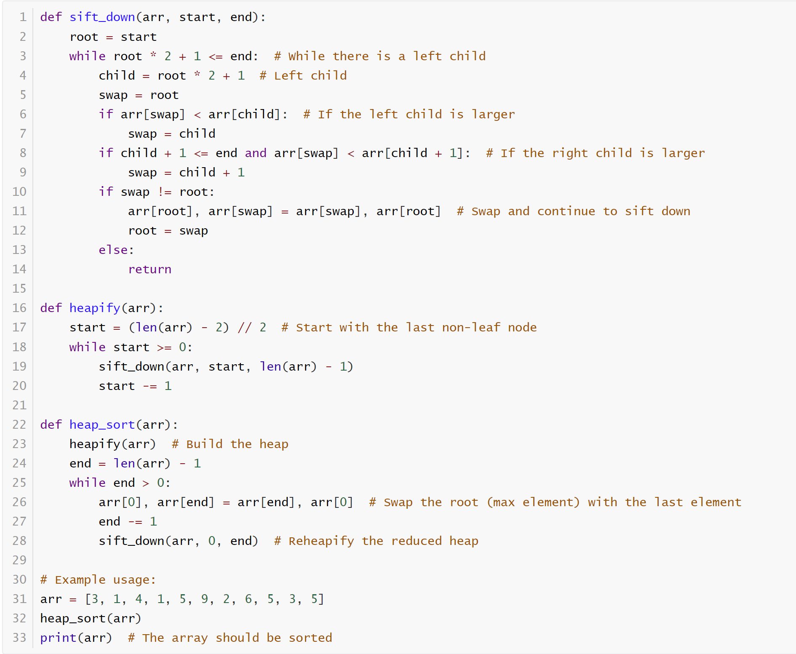
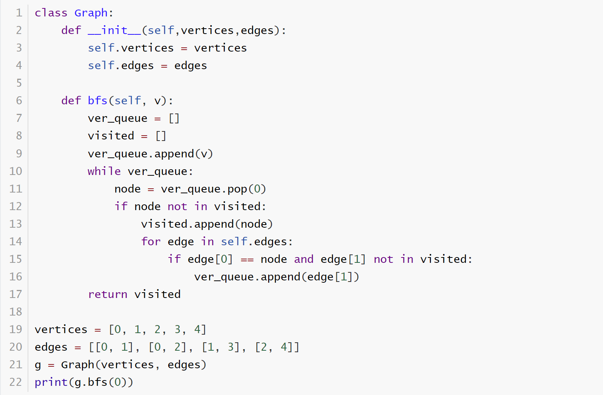
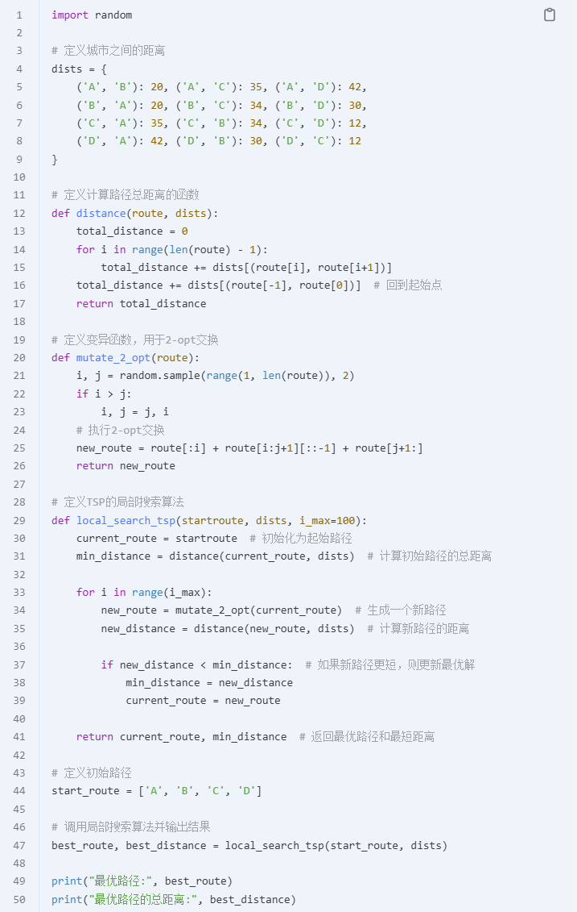
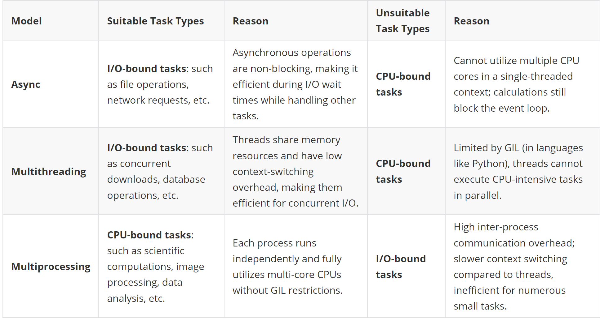

## week 02

### Bogosort

**时间复杂度**：最坏情况是 **O(n! \* n)**，预期情况是 **O(n!)**。

>  【平均情况下，需要尝试 n! 次打乱才能生成一个正确排序。每次尝试包括：调用 `is_sorted`：复杂度为 O(n)。调用 `shuffle`：复杂度为 O(n)。每次尝试的复杂度为 O(n+n)=O(n)】

**空间复杂度**：**O(1)**，因为该算法是原地排序。代码见课件

### Insertion Sort

**时间复杂度**：最优情况：O(n) 最坏情况：O(n²) 平均情况：O(n²)  **空间复杂度**：O(1)  **对于小数据算法友好。** 代码见课件

### bubble sort

**时间复杂度**：最优情况：O(n)  最坏情况：O(n²)  平均情况：O(n²)

**空间复杂度**：O(1)   **不太高效的一个排序方法。实现简单，但一般实际不会选择。**


### Quick Sort 

**时间复杂度**：  最优情况：O(n log n)  最坏情况：O(n²)  平均情况：O(n log n)

> 最差情况发生在列表本身已经有序（升序或降序），选定的基准值总是列表中的最小值或最大值。此时，每次分区都会导致一个子列表为空，另一个子列表包含剩余的所有元素。递归深度为 n，每层分区的时间复杂度为 O(n)

**空间复杂度**：O(log n)（递归栈深度）最差情况下，是 O(n)

**适合大规模数据排序。实际中基本是首选。虽然在最坏情况下时间复杂度可能退化为 **O(n²)**，但通过选择合适的基准元素，可以避免最坏情况，通常其表现会非常优秀。**

**pivot 值的选择：**如果数组数据完全随机并且数据较少，选择第一个或最后一个元素作为基准元素是简单且足够的。如果数组已经有部分排序并且数据较多，选择中值（最大值加最小值除以2）作为基准元素可以提高效率，避免最坏情况。中间值策略能更有效地分割数组，减少递归的深度，因此在大多数情况下，它能提升快速排序的性能

### Merge sort

**时间复杂度**：最优情况：O(n log n)  最坏情况：O(n log n)  平均情况：O(n log n)   **空间复杂度**：O(n)


归并排序是一种 **稳定** 排序算法，它的时间复杂度稳定在 **O(n log n)**，在处理大规模数据时效率较高。然而，由于它需要额外的空间来存储临时数组，因此它的空间复杂度为 **O(n)**，这在某些内存有限的环境中可能是一个缺点。尽管如此，归并排序仍然是一个非常可靠和常用的排序算法，尤其在数据量大或数据需要稳定排序的场合。

> - 每次合并时，需要遍历两个子数组的所有元素。对于大小为 n 的数组，合并每一层的总时间为 O(n)（因为每个元素只会被访问一次）。由于合并操作在每一层都进行，总共有 log⁡2(n) 层，因此合并过程的时间复杂度为： O(n⋅log⁡n)
>
> - 分解的总复杂度为 **O(log⁡n)**（递归树的高度）。合并的总复杂度为 **O(n⋅log⁡n)**。因此，合并排序的总时间复杂度是： O(n⋅log⁡n)

## week 03

### Binary Search

**只能在排序好[sorted]的数据里查询。**

**时间复杂度**：最优情况：O(1)  最坏情况：O(log n) 平均情况：O(log n)  **空间复杂度**：O(1)：迭代版本   O(n）：递归版本


### Interpolation search

**查找的数据是排序[sorted]好的，（均匀[uniform distribution]地，就是元素之间的间隔相同）**

**最优时间复杂度**：O(log log n)（数据均匀分布时，一次查找就过滤掉了 n 个元素，找到了给定元素）

**最坏时间复杂度**：O(n)（数据分布不均匀时，搜索了 n 次才找到）

**平均时间复杂度**：O(log n)（数据分布均匀时， 有点类似于二分查找了） **空间复杂度**：O(1)


### Heap sort

Arrangement of data as trees speeds up search by reducing the number of operations necessary to find a target

> **构建堆**：构建最大堆或最小堆需要遍历堆的每一个节点，且调整每个节点的操作时间复杂度是O(log n)。因此，构建堆的时间复杂度是 O(n)。

> **堆排序**：每次将根节点（最大值或最小值）与最后一个元素交换，然后调整堆的结构。每次调整的时间复杂度是 O(log n)，共需要进行 n 次交换，因此堆排序的时间复杂度是 O(n log n)。一次 sift-down 的时间复杂度是 $O(logn)$，因为树的深度是 $logn$，最坏的情况一个节点要向下交换树的深度的次数。

综合起来，堆排序的总**时间复杂度**是 **O(n log n)**。 **空间复杂度**是    **O(1)**[迭代]   **O(logn)**[递归]。

堆化后并不是排序好的列表，但是满足父节点永远大于其子节点，树扁平化的列表也遵循这个规则。Heapify 完了我们还需要 Sort。Sort完了是一个递增的列表。

Use recursive heap sort for small datasets.  Use iterative heap sort for large datasets to avoid stack overflow.




**Heap Sort**的主要优点是**时间复杂度稳定**为 O(n log n)，即使在最坏情况下也是如此，适合处理大规模数据。缺点是其**不稳定**，并且在实际中比快速排序稍慢。在实际应用中，如果**需要保证最坏情况的时间复杂度**，堆排序是一个不错的选择；但如果**数据规模适中且关注平均性能**，**快速排序**通常会表现得更好因为快速排序只需要少量额外空间。**快速排序** 是较为高效的选择，特别是当数据集较小或数据接近随机分布时。但在处理非常大的数据集、要求稳定排序或对最坏情况性能要求较高时，**合并排序** 是一个更好的选择。

## week 04	

**BSTs allow powerful, efficient search   $O(logn)$**. 详解请戳：

在一个完全平衡的二叉树中，树的高度是 **log n**（n 是节点的数量），因此我们每向下遍历一层，就进行一次比较。所以在每一层都只需要做一次比较，而比较的层数和树的高度成正比。树的高度不受节点数量的影响，而是与树的结构（平衡）直接相关。 随着树越来越大，搜索所需要的比较次数相对于树的总节点数的比例越来越小。

### Traversal

#### DFS —— search for unbalanced trees

#### BFS —— search for balanced trees


### AVL

#### Insert （标红！！！）


#### delete


## week 05

### Hashing


### Link list


### Queue


### Graph

**DFS** : **时间复杂度**：O(V + E)  **空间复杂度**：O(V)


**BFS** : **时间复杂度**：O(V + E)  **空间复杂度**：O(V)



## week 06

**Dijkstra’s algorithm**  :  时间复杂度：$O(V^2+E)$   空间复杂度：$O(V)$

> **寻找距离最小的节点：$O(V^2)$**
>
> - `min()` 函数的复杂度是 **O(V)**，因为需要遍历所有未处理的节点 `Q`。最多需要执行 **V 次**，因为每个节点都会被处理一次。

> **更新邻居的距离：O(E)**
>
> - 遍历每个节点的邻居对应图中的所有边，因此所有边的更新操作总计为 **O(E)**。每一次遍历一个节点都只遍历与它相连的边，而非所有边。遍历完所有节点后，所有边才被遍历了一遍。


如果用最小堆实现，时间复杂度：$O((V+E)log⁡V)$. 空间复杂度是 **O(V)**，因为 `distances` 字典和优先队列都占用 **O(V)** 的空间。

> **弹出最小元素的操作**：每个节点最多被弹出一次，时间复杂度是 **O(V log V)**。**更新邻接节点的操作**：每条边都会被遍历并插入到优先队列中，时间复杂度是 **O(E log V)**，其中 `E` 是图中的边数。


**Prim’s algorithm** : **时间复杂度**：O(V * E)

> 外层循环执行 **V-1** 次，每次执行时内层循环遍历所有邻接边，最坏情况下每条边都会被遍历一次

**空间复杂度**：O(V + E)

> 图 `graph` 存储了所有节点及其邻接边，空间复杂度为 **O(V + E)**。


**kruskal’s algorithm**:  时间复杂度： $O(E log E)$    

> 在 Kruskal 算法中，首先需要将所有边按权重升序排列。这一操作的时间复杂度是 **O(E log E)**，其中 **E** 是图中的边数

空间复杂度：$O(V + E)$


- **Dijkstra’s algorithm:** Single Source Shortest Path Problem

    > Given: directed graph G = (V, E) in which each edge has a ==non negative label== and one vertex is specified as the source.Determine the cost of the shortest path from the source to every other vertex in V
>

- **Prim’s algorithm:** An MST aims to connect ALL the nodes in a graph at minimum cost.

    > **MST 是否包含所有可能的最短路径？** **不包含**。MST 的目标是覆盖所有节点，且总权重最小，但它不能保证任意两个节点之间的路径是最短的。
    >
    > **Prim 是否让 Dijkstra 算法多余？** **不会**。Prim 算法的目标是生成 MST，而 Dijkstra 的目标是找到单源最短路径。两者解决的问题完全不同，互不替代
    >
    > 
    
- **Kruskal’s algorithm:**

    > Kruskal’s obviously avoids cycles. But how does Prim’s avoid cycles?  : Prim avoids loops by connecting only new nodes and is naturally loop-free by design. Because it just chooses the lowest value unreached node; does not need to check for cycles. Cycles cannot happen in Prim’s as cycles involve already visited nodes…… and Prim’s will only consider unvisited nodes
    >
    


> Kruskal 算法通过对所有边进行排序，直接从排序后的边列表中按顺序选取最小的边，这避免了像 Prim 那样需要在当前的节点集合中搜索最小权值边。在稠密图中，边的数量接近 $V^2$（$V$ 是节点数），排序所有边需要较高的时间成本。此外，Kruskal 算法还需要使用并查集频繁检测环路，稠密图中这一过程的开销会更大，降低效率。

## week 07

### When a greedy algorithm gives us an optimal solution, and why

> **最优子结构（Optimal Substructure）:  定义**：一个问题的解可以通过子问题的最优解合成，即每个子问题的最优解一定是整体问题的最优解的一部分。
>
> **无后效性（Greedy Choice Property）: 定义**：当前的贪婪选择不会影响后续的选择，也不会影响全局最优解的达成。

### greedy algorithms can be optimal: this applies to Dijkstra. What about Prim / Kruskal? 

都是最优的。前提是边是非负的。后俩需要图示联通的

### When a greedy algorithm does not give us an optimal solution, and why

> A greedy algorithm fails when the problem does **not satisfy the "greedy-choice property"** or the **"optimal substructure"**. Specifically, the greedy algorithm's local optimal choices at each step may prevent it from achieving the global optimal solution.

### 为啥回溯对于最优解是必要的？

Backtracking explores all possibilities systematically, ensuring the optimal solution.But takes time to run.

## week 08

NP-hard problems can exhibit different behaviours on different runs for the same input variables.

#### Heuristics


#### Local search




#### Simulated Annealing

**退火算法的优点**：能跳出局部最优。在温度较高时接受较差解，鼓励探索；在温度较低时专注于局部优化。

**怎么跳出局部最优解？**虽然初始解固定，但算法通过邻域搜索和随机接受较差解，可以有效探索更大范围的状态空间。


#### GRASP

> **GRASP 对退火算法的优化作用** ：**改进初始解的质量** **增强解的多样性** **减少退火算法的参数依赖性** **提高全局最优解的搜索效率**


## week 09

### chat sever


### data race

> 1. Thread 1 reads `my_var[0]`, gets `1`, and prepares to add `1`. 2. Thread 2 also reads `my_var[0]`, gets `1`, and prepares to add `1`.  3. Both threads compute the result `2` and write it back to `my_var[0]`.
> 
>     **Result**: Thread 2 started before Thread 1 finished. For instance,  `my_var[0]` only increases by `1` instead of `2` because both threads modify it simultaneously, causing one update to overwrite the other and resulting in a lost update. One element may have been incremented by `2` while its neighboring element may have only been incremented by `1`.
>

```python
thread.setDaemon(True) # 可以把非守护线程设置为守护线程。不等待子线程结束主线程就会结束。
```

**多个线程是操作是公用内存的，即使放在线程池里也要加锁避免数据竞争。**

### lock

```python
from concurrent.futures import ThreadPoolExecutor
from threading import Event, Lock
from time import time, sleep

# 初始化 Event 和 Lock
event = Event()
data_lock = Lock()

def modify_variable(var):
    while True:
        with data_lock:
            for i in range(len(var)):
                var[i] += 1
        if event.is_set():
            break
    print('Stop printing')

# 要操作的共享变量
my_var = [1, 2, 3]

# 创建线程池
with ThreadPoolExecutor(max_workers=2) as executor:
    # 提交任务到线程池
    executor.submit(modify_variable, my_var)
    executor.submit(modify_variable, my_var)

    t0 = time()

    while time() - t0 < 5:
        try:
            with data_lock:
                print(my_var)
            sleep(1)
        except KeyboardInterrupt:
            event.set()
            break

    # 设置 event 来停止线程
    event.set()

# 打印最终结果
print(my_var)
```

### queue

```python
from concurrent.futures import ThreadPoolExecutor
from threading import Event
from time import time, sleep
from queue import Queue

# 初始化 Event
event = Event()

def modify_variable(queue_in, queue_out):
    while True:
        if not queue_in.empty():
            var = queue_in.get()
            for i in range(len(var)):
                var[i] += 1
            queue_out.put(var)
        if event.is_set():
            break
    print('Stop printing')

# 初始化变量和队列
my_var = [1, 2, 3]
queue1 = Queue()
queue1.put(my_var)

# 使用线程池
with ThreadPoolExecutor(max_workers=2) as executor:
    executor.submit(modify_variable, queue1, queue1)
    executor.submit(modify_variable, queue1, queue1)

    t0 = time()
    while time() - t0 < 5:
        try:
            print(my_var)
            sleep(1)
        except KeyboardInterrupt:
            event.set()
            break

    # 设置事件以停止线程
    event.set()

# 打印最终结果
if not queue1.empty():
    print(queue1.get())
```

## week 10

什么时候需要用 await？**有 I/O 操作的函数**（如网络请求、文件读写）。**需要等待的任务调度**（如 `asyncio.sleep`）。**依赖另一个异步任务的完成**

### IO & CPU



**Async**: Best for I/O-bound tasks, leveraging event-driven mechanisms to efficiently handle a large number of concurrent connections. **Multithreading**: Ideal for concurrent I/O-bound tasks that require shared resources but less suitable for CPU-intensive tasks due to GIL constraints.**Multiprocessing**: Optimal for CPU-bound tasks, offering independent execution and full multi-core utilization but less efficient for small, frequent task switches due to higher overhead.

### chained_coroutines.py


### queue_producers_consumers.py


### data_order.py


### data_sharing queue


3. **创建并发的 `worker`**：

- 调用 ，同时启动了两个  协程。每个 `worker` 会从队列中取出任务并执行，直到队列为空。


4. **`worker(queue)` 的执行**：

- **`worker` 循环运行**：每次循环，调用 `queue.get()` 从队列中取出一个任务。执行 调用 `queue.task_done()`，标记队列中的这个任务已完成。如果队列为空，`worker` 循环结束。
- **并发处理**：因为有两个 `worker`，两个任务会并发运行，每个 `worker` 都在独立处理任务。当队列中有 3 个任务时，两个 `worker` 会同时取任务并运行，减少总处理时间。

5. **任务完成与清理**：`asyncio.gather()` 等待所有 `worker` 完成任务（即队列中的所有任务都被取出并处理）。当 `worker` 处理完所有任务，`main()` 返回，`asyncio.run()` 退出事件循环。
