- 数据处理：
    - checking data consistency /  handling invalid or values missing\
    - steps: load / clean / transform / reshape
    - 无确切定义，根据场景定义
    - macro level : source domain / micro level : generation domain
    - 宏观要求数据准确性有效性，用于经济，搜索引擎，政府部门。数据库管理的角度。
    - 微观偏应用性，实例层面，对于数据清洗要求没有宏观高。要求没有不完整/错误/重复数据。

数据清洗在整个流程中的作用：

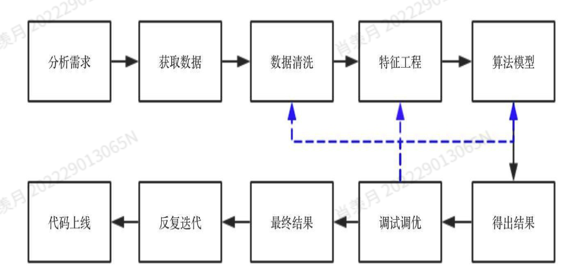

- data ware

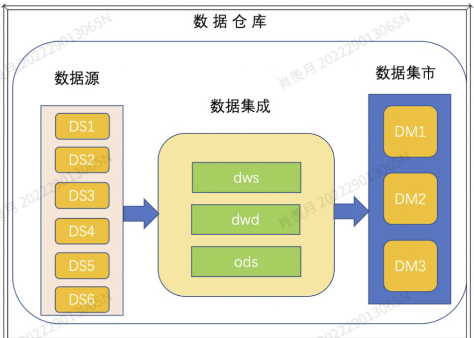

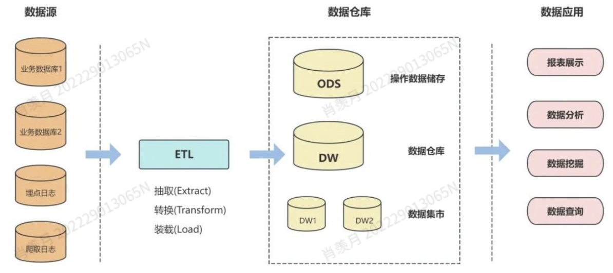

- data mining
    - discovering association and patterns from a lot pf data
    - 去除噪声 提取特征 extract

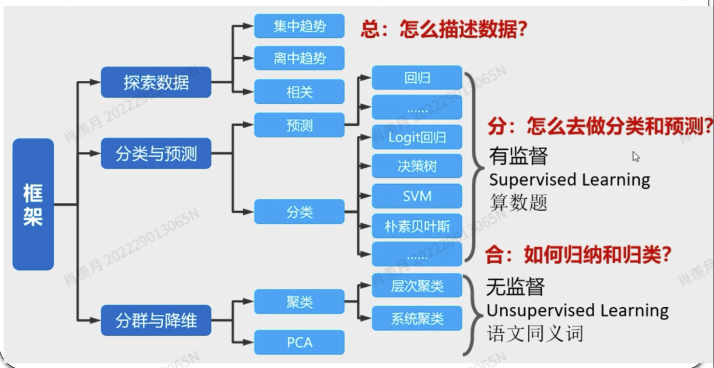

- data management


- 数据清洗五步骤
    - analyzing data：理解数据结构/内容/其他信息 为了识别原始数据的质量问题
    - define cleaning rules：定义数据清洗规则
    - 检测脏数据：统计分析，数据可视化，规则检测，模型预测等等
    - 处理脏数据： 删除或者填补缺失数据，移除重复数据
    - 评估数据：发现问题评估质量等等
- 数据清洗方法
    - Manual cleaning strategy 效率低 仔细 准确性最好
    - Automatic cleaning strategy 用电脑程序 效率高 准确性好
    - hybrid cleaning strategy 混合人工和机器，各取所长
- 自动化清洗数据方法：
    - Specific program cleaning ：代码清洗
    - Machine learning based cleaning : 人工智能方法结合
    - Statistical based cleaning：根据统计数据，平均数中位数来矫正极端偏差
    - Rule based cleaning：用一些特殊规则处理非数值型的数据，医学领域
    - Pattern based cleaning 使用正则表达式或其他模式匹配技术，根据特定的模式或格式识别并清洗数据。变量的相关性用正则表达式规范。在半结构化数据和非结构数据很有用。
- 数据评估关键：
    - 数据一致性 consistency
        - 相关性的一致性，是否有一些冲突
        - 主要是逻辑上的一些不一致性
        - 编程序处理
    - 数据完整性：
        - missing data 分两种 一种是 absolutely random missing，这种缺失跟其他数据没有什么关系没有相关性，缺失是一种偶然现象可以用平均值等代替，Random missing，如果一个变量的缺失概率与其他已观测变量有关，但与它自身未观测的取值无关。例如：如果某人的智商（IQ）在测试中未达到最低要求的100分，那么他将无法参加后续的人格测试。Non-random missing : 变量缺失的概率与该变量本身的已观测值有关。
- 数据缺失处理：
    - 删除
    - filling ：
        - Mean imputation 可能会改变均值，忽略了数据的变化性
        - Median imputation
        - Mode imputation
        - regression imputation ：establishing a regression model 
        - interpolation imputation 数学方法
        - Linear imputation：好算/精度很差
        - 多项式差值 Polynomial 精度好好算，光滑性不好
        - K-nearest neighbor Method：**利用样本观测值之间的相关性来填补缺失值。**如果两个观测值彼此相似，而其中一个在某些变量上存在缺失值，那么这个缺失值很可能与另一个观测值在该变量上的取值相近。

- 数据重复处理：

    - 删除
    - 融合 merge
    -  Tag 加一个标签表明这是重复数据

- outliers 异常数据：

    - 少数的 Minority
    - influence
    - diversity 多样性  数值上，关系上的多样异常

- 检测异常值：

    - Statistical based methods：

        - Standard score (Z-score)：

            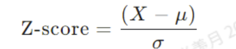

            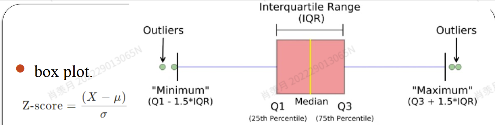

    - Distance based Method：

        - KNN 一个点与它的邻居距离太大不行。
        - LocalOutlier Factor [LOF] 计算点周围密度

    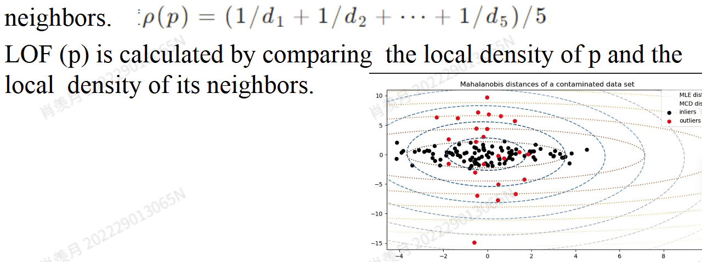

    - Cluster based methods：不属于任何一类
    - Machine learning based methods

- 处理异常值：

    - 删除
    - 替换
    - 分组方法 Grouping ：Divide the data into two parts, one containing outliers and the other not, and process each part of the data separately. This can to some extent reduce the impact of outliers on the entire dataset.


- Evaluation of data cleaning：数据评估
    1. Data must be reliable to user : The  indicators
        - Accuracy
        - Completeness
        - Consistency
        - Validity
        - Uniqueness ：没有重复数据
    2. Data must be available to user
        - Timeliness 
        - Stability
    3. 两种错误：
        - annotated erroneous data 和 dirty datasets without manual annotation


**字符串**：

- 字符串的拼接：

```python
dog = 'Tommy'

sentence = "I have a dog named" 
sentence += dog
```

- 字符串的比较：
    - 比较字符串字母的 ASCII 值的大小，一个对一个，不是比较和

```python
print("dorm room" < "dormroom")
```

对的，因为前者第五位上——空格的 ASCII 的值比字母 “r” 的 ASCII 值小

- 一些方法：

```python
dog = 'Tommy'
print(dog.upper())
print(dog.lower())
print(dog.find("TO")) # 会返回第一个字符在整个字符串中的位置信息
print(dog.replace("T","t"))
```

```python
email = "Dear {}, I hope you can come to my party."
print(email.format("Meena"))
```

```python
string = 'Java666'
print(string[-1])
for idx in range(len(string)):
    print(string[idx])
```

找缩写：

```python
phrase = "National Collegiate Athletic Association"
acro = ""
for letter in phrase:
    if letter.upper() == letter and letter.isalpha()：
    acro += letter
print(acro)
```

切片：

```python
string_var[start_index:endindex]
```


**List**：

- 列表长度 `len()`
- 查找 `[0]`
- 切片 同上
- 列表数据求和
- 用 + 添加元素
- `in`
- 列表更灵活，可以包含多种多样的数据；列表之中的数据可以进行修改
- `append` `extend` `pop`
- `sort()` 不能作用于里面元素类型不一样的列表

```python
lst = ["M","SS","SS","PP",""]
lst_join = 'I'.join(lst)
print("原本的字符串：",lst)
print("加上间隔的字符串：",lst_join)
#output
原本的字符串： ['M', 'SS', 'SS', 'PP', '']
加上间隔的字符串： MISSISSIPPI
```


## Pandas

pandas 使用的数据结构：

- Series
- DataFrame
- Panel

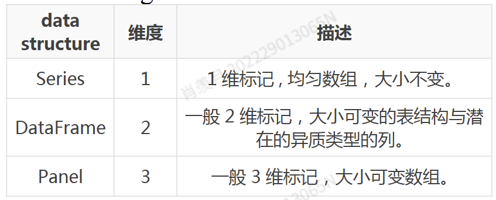

DataFrame可以看作是Series的一个container

作用：

- 对齐操作
- 缺失值处理
- 数据合并
- reshape

Series：

If no index is specified, indexes from 0 to N-1 will be automatically created.

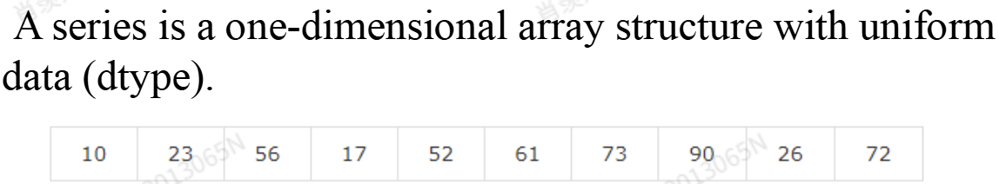

DataFrame:

Having both row and column indexes, it can be seen as a dictionary composed of Series (using a common index).

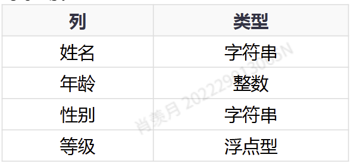

### Missing Data

- 缺失值：
    - 如果数据集很大且缺失值很少，可以删除包含缺失值的行；
    - 如果某一列缺失数据过多，导致该列没有参考意义，则可以删除该列。

- Pandas 提供了方便的 `dropna` 方法用于删除缺失值，它可以从 DataFrame 或 Series 中删除观测记录（行）或特征（列）。

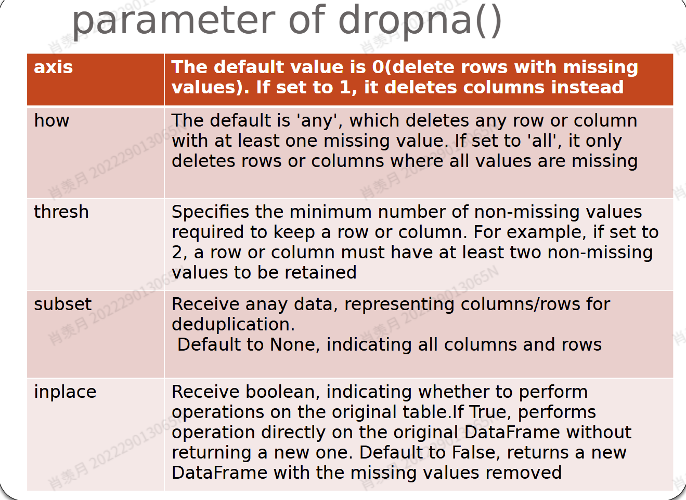


- 缺失值填补：
    - 对于数值型数据填补可以用一些统计类的方法
    - 对于类别型，采用众数。**Mode Values**
    - `fillna()` 
        - 设置填充数据的类型value: scalar/dict/Series/Dataframe
        - method: backfill / bfill ；pad / ffill 用下一个4->3/上一个3->4邻居值填缺失值 
    - `fillna` 方法的参数说明：
        - **axis: {0 或 'index'，1 或 'columns'}**
             **说明**：默认值为 0 或 'index'，表示按行进行操作；如果设置为 1 或 'columns'，则按列进行操作。
        - **inplace: 布尔值**
             **说明**：若设为 `True`，则在原始的 DataFrame 或 Series 上直接进行填充操作，不返回新对象；若为 `False`，则返回一个包含更改的新对象。
        - **limit: 整数**
             **说明**：用于指定缺失值最多填充多少个。如果不设置该参数，则对缺失值的填充数量没有限制。
    - interpolate：
        - 差值计算结果进行填充

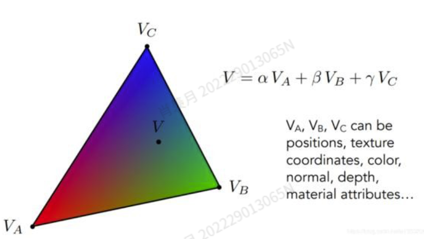


#### 实例讲解

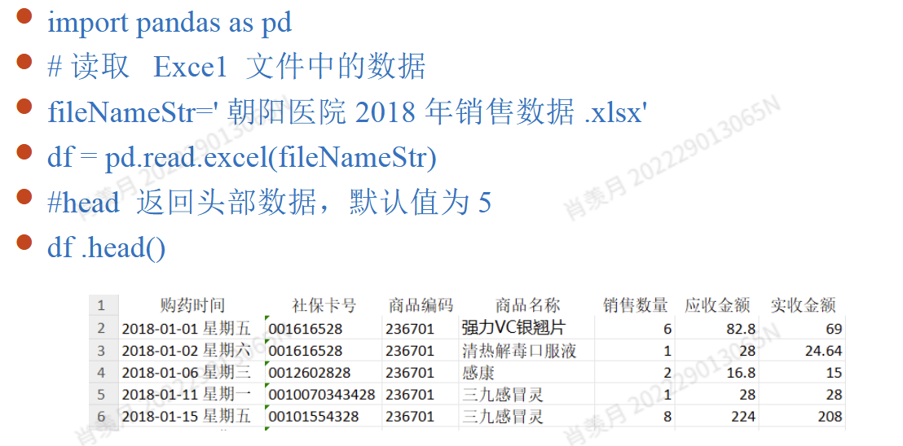

Pandas 提供了 `isnull`或者`isna` 方法用于识别缺失值，以及 `notnull``notna` 方法用于识别非缺失值。

`any` 方法：用于判断给定参数中是否存在至少一个为 True。 如果所有值都是 False，则返回 False；只要有一个为 True，就返回 True。

- (1) `df.isnull()`：如果某个元素为空（缺失值），返回 `True`；如果不是缺失值，返回 `False`。
- (2) `df.isnull().any()`：如果某列 column 中存在缺失值，返回 `True`；如果该列没有缺失值，返回 `False`。
- (3) `df.isnull().any(1)`：如果某行 row 中存在缺失值，返回 `True`；如果该行没有缺失值，返回 `False`。

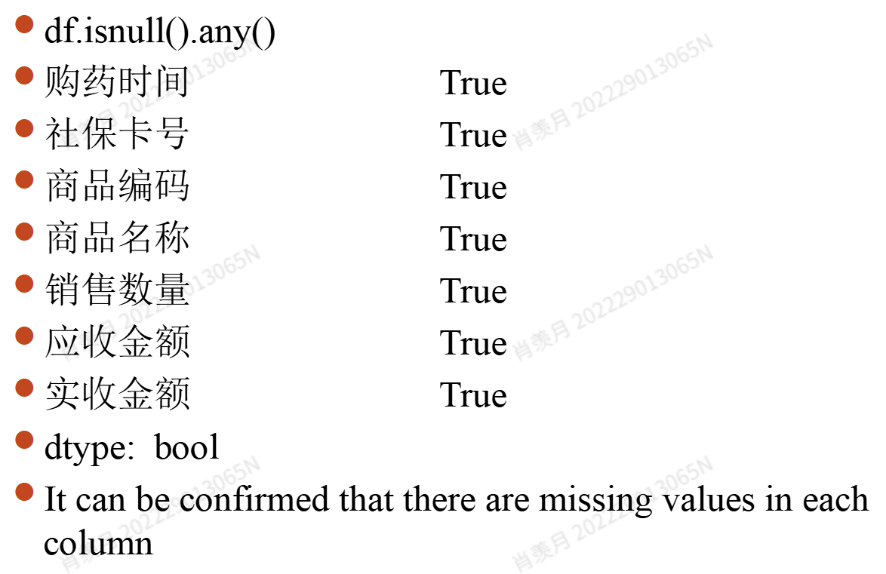

- sum() 把缺失数目求和

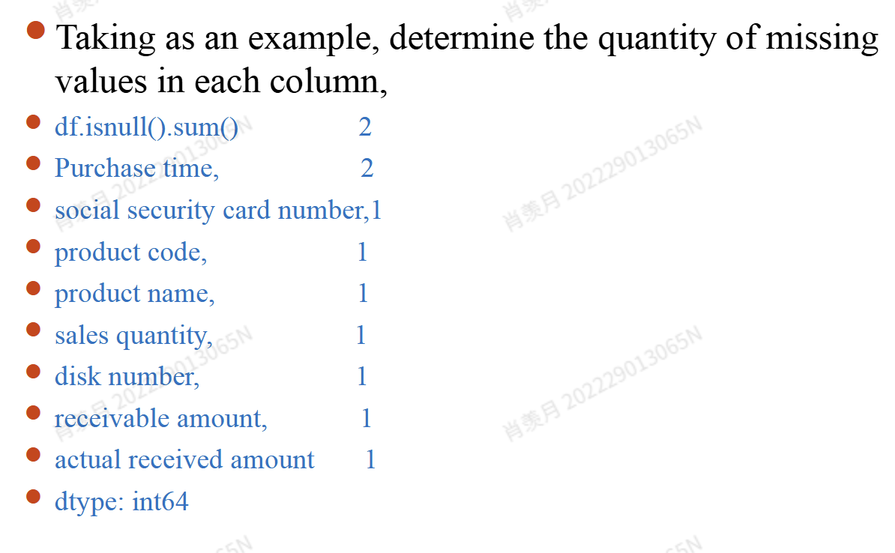

- **`df.isna().sum().sum()`**查看整个数据集中总共的缺失值数量。
- **`df.count()`** 统计每列中非空（非缺失）值的数量。
- **`df.loc[:, df.isnull().any()]`**返回包含缺失值的列。
- **`df.loc[df.isnull().any(1)]`** 返回包含缺失值的行。
- **`df.loc[~(df.isnull().any(1))]`** 返回不包含缺失值的行。

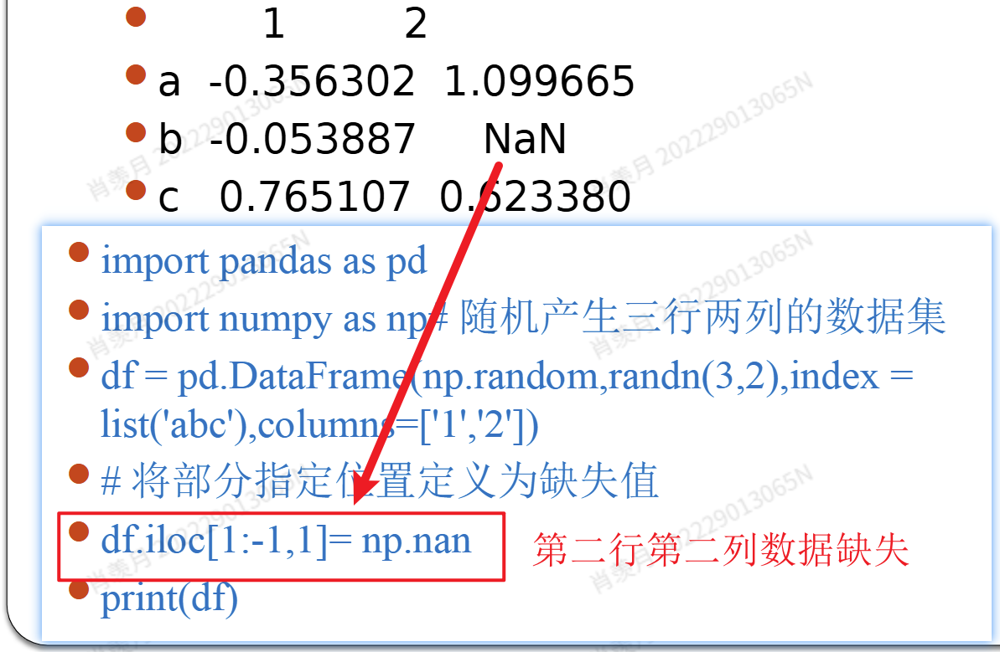

再利用 dropna 函数删除含有缺失值的行

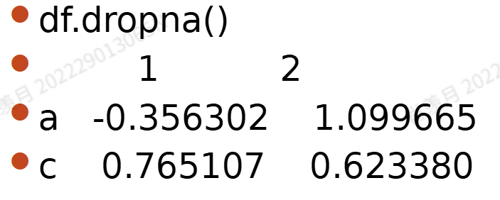


### 去重

利用**集合**中元素的唯一性去重；
使用 `drop_duplicates` 方法删除重复值。

#### duplicate

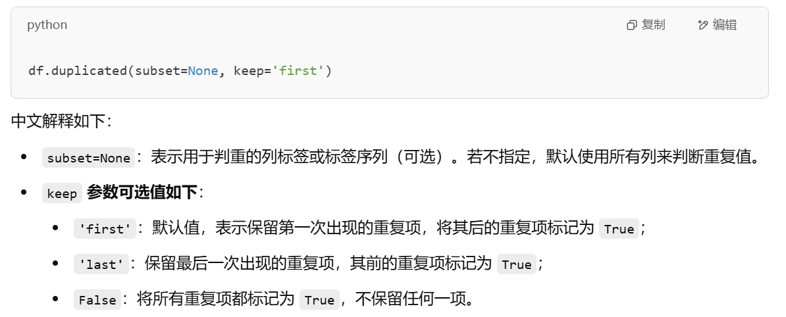

指定列：`df.duplicated(subset=["k1"])`

查看重复记录的数量（不包括第一次出现的记录）

```python
df.duplicated().value_counts()
```

------

统计重复元素的数量（包括所有重复项）

```python
df.duplicated(keep=False).value_counts()
```

------

查看所有重复的记录

```python
df[df.duplicated(keep=False)]
```

------

查看除第一次外所有重复记录

```python
df[df.duplicated()]
```

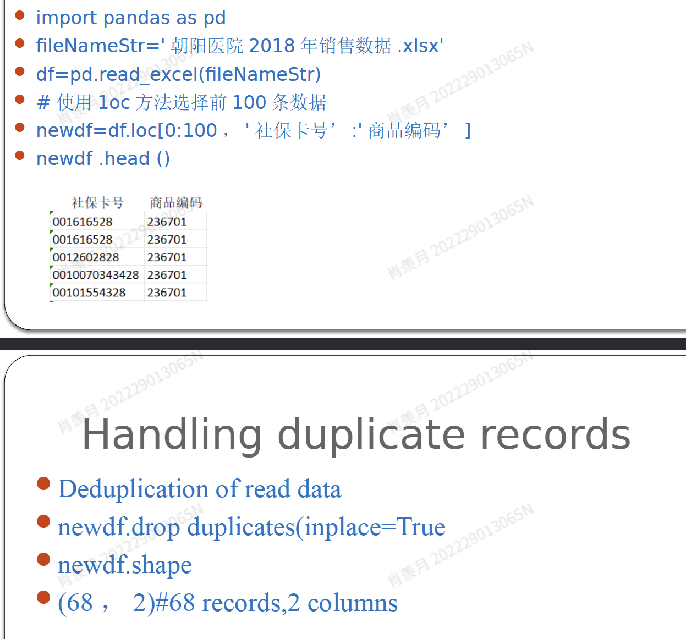

#### set

可能会打乱数据顺序，因为集合是无序的


#### corr

**`corr` 方法**用于计算一个 **DataFrame 或 Series 的相关系数矩阵**，矩阵中的每个元素表示两个列之间的相关性（即相关系数）。

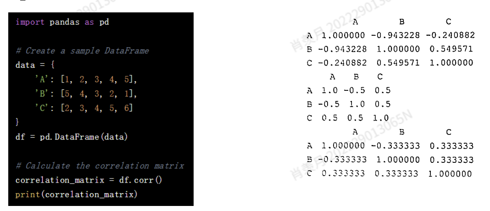

#### equals

判断数据是不是相等。NaNs in the same position are considered equal. 缺失也会判为相等。

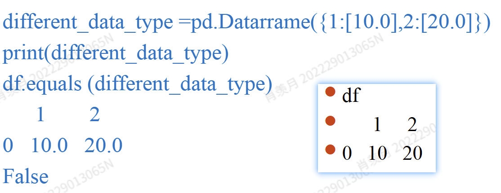


### Outliers

#### 1. judgment Outeliers

1. **The standard deviation method** 

- 近似服从正态分布的数据样本，应首选标准差法；

- 否则，应首选盒图法，因为量化值不受极端值的影响，

- 标准差法基于样本平均数和样本标准差，将偏离平均数超过两倍标准差的样本判定为离群值。

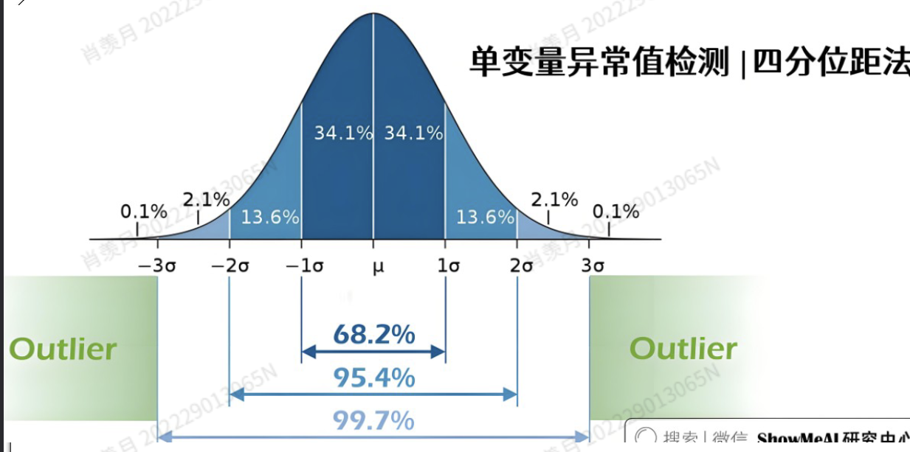

2. **box plot** 

红色圈圈是一个盒子，盒子里才是正常值。

- 箱形图法使用上四分位数 Q、下四分位数 Q、和标准差作为参考，处理离群值一般有两种方法：删除和替换。对于极少量的异常值，可以使用删除法，类似于缺失值的删除法。替换法可考虑使用最大值或最小值、平均值或中位数低于上下限的判别值进行替换。

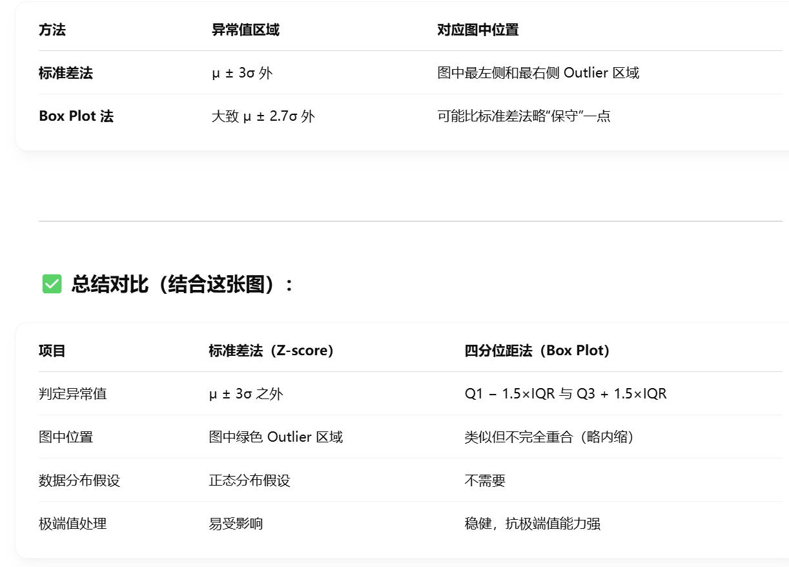


#### describe

描述性的统计信息：

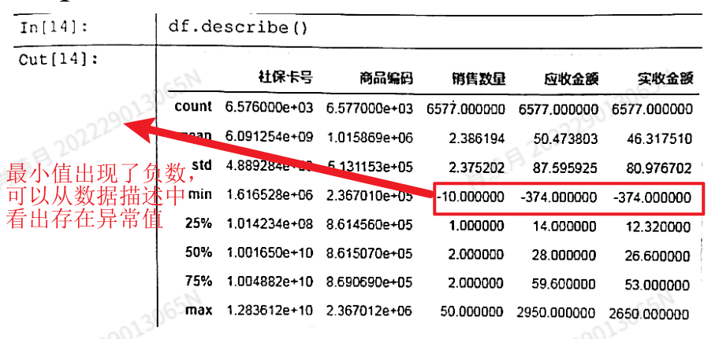

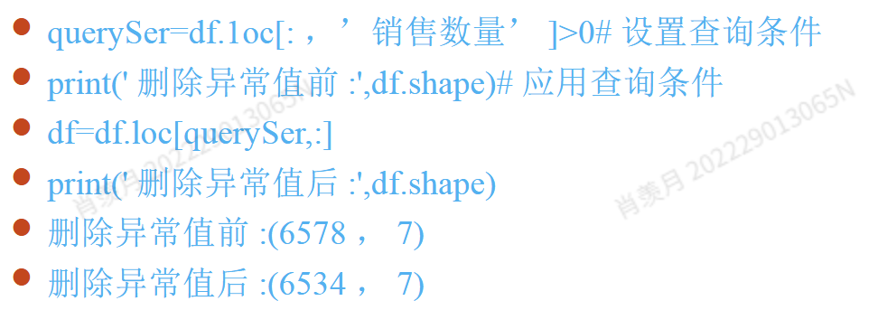


- 例子

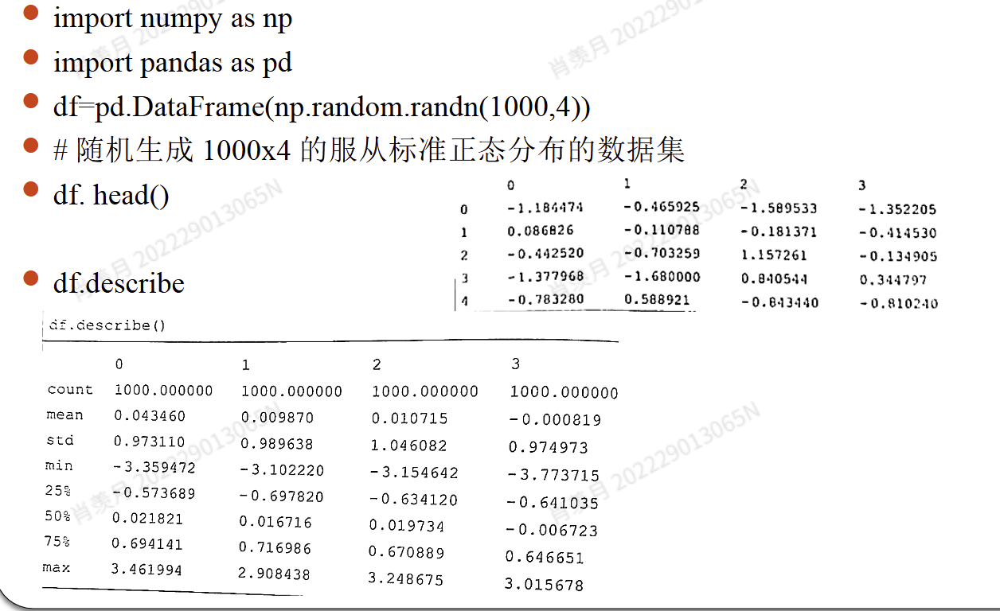

查找：

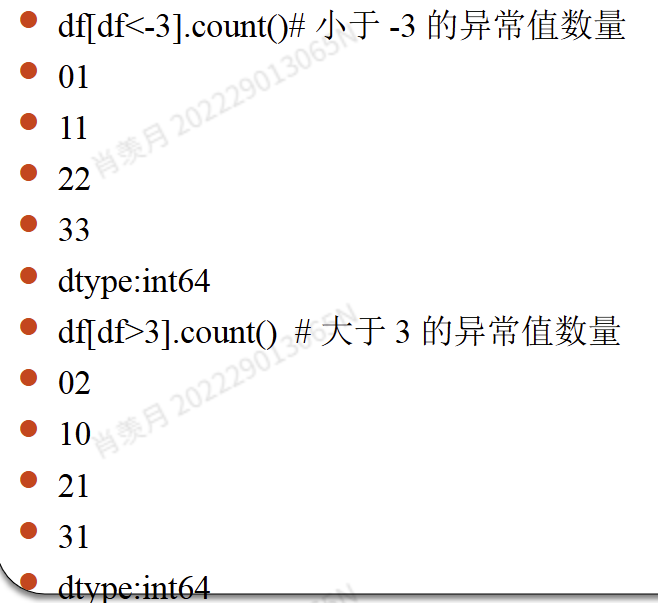

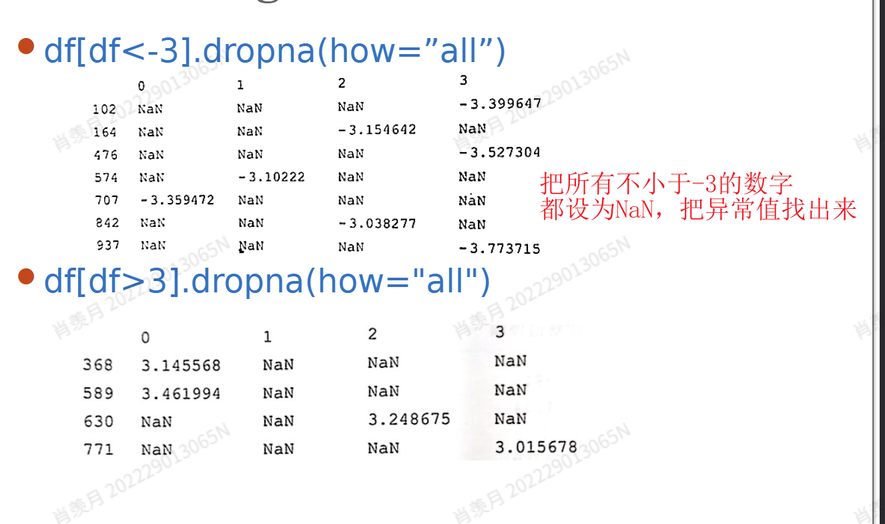

```python
df[df<-3]=-3
df[df> 3]= 3
df.describe()
```

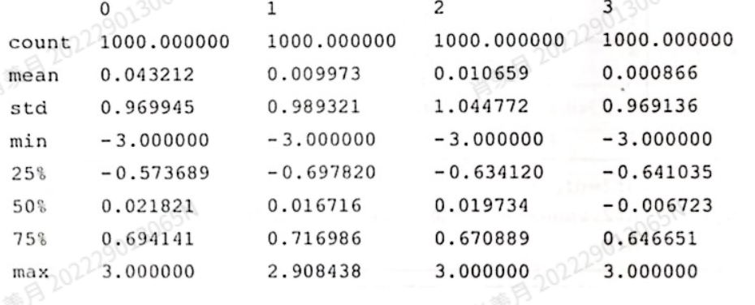

- 对于异常值的处理没有固定的解法，有两种情况出现异常值
    - 一种是pseudo outliers，由具体的业务操作产生，实际上反映了业务的正常状态，而不是数据本身的不正常。
    - 另一种是real outliers，它不是由具体的业务操作造成的，而是客观反映了离群值情况的分布。
    - 但在以下情况下，无需丢弃异常值。
        - (1) 异常值通常反映业务运营的结果。这种情况是由于业务的特定运营方式导致的一种异常分布。如果丢弃异常值，它将无法准确反映业务运营的结果。
        - (2) 异常数据检测模型。 在这种情况下，异常值本身就是目标数据，如果删除它，关键信息将会丢失。
        - (3）容忍异常值的数据建模。如果数据算法和模型对异常值不敏感，那么
            即使不处理异常值，也不会对模型本身产生显著影响。在决策树中，异常值本身可以作为一种分裂节点。
