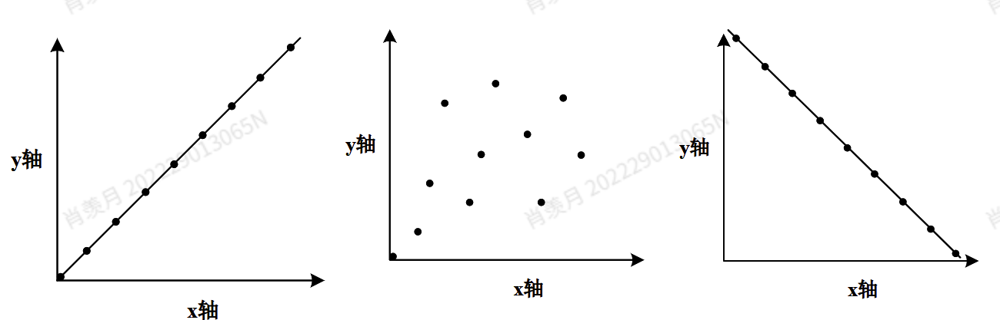

1. 数据分析要干嘛？

**Descriptive data analysis** provides a brief summary of what has happened,
 **描述性数据分析**提供了对已发生事件的简要概述，

reflecting the fluctuation and trend of data through descriptive statistical indicators,
 通过描述性统计指标反映数据的波动和趋势，

and observing whether there are any abnormal situations in the data through descriptive data analysis.
 并通过描述性分析观察数据中是否存在异常情况。

- 有 Decision management 和 Rolling prediction(dynamic, rolling, and driven-factor based
    approach)

------

**Diagnostic data analysis** goes one step further on the basis of descriptive data analysis, that is, "how it happened".
 **诊断性数据分析**在描述性分析的基础上更进一步，即回答“它是如何发生的”。

Diagnostic data analysis can discover the causes and outcomes of events.
 诊断性分析可以发现事件发生的原因及其结果。

------

**Predictive data analysis** is the result of combining descriptive data analysis and diagnostic data analysis
 **预测性数据分析**是描述性分析和诊断性分析结合的结果，

to further discover the direction of data and predict what may happen next, that is, "what may happen".
 进一步探索数据的变化方向，并预测接下来可能发生什么，即“可能发生什么”。

------

**Directive data analysis** is the process of proposing solutions based on the first three levels, namely "what should be done".
 **指导性数据分析**是在前三类分析的基础上提出解决方案的过程，即“应该做什么”。

2. Quantitative analysis

- 定量分析和定性分析都是数据分析技术。
- 定量分析侧重于量化从数据中发现的模式和关联。这项技术涉及分析从数据集中获得的大量观察结果。
- 定量分析结果是绝对数值，因此可以用于数值比较。
- 例如，对冰淇淋销量进行定量分析可能会发现，气温上升5摄氏度，冰淇淋销量就会增加15%。

3. Qualitative analysis

- 定性分析侧重于用语言描述不同的数据。它涉及对相对较小的样本进行深入分析。
- 由于样本量较小，这些分析结果无法应用于整个数据集。它无法衡量数值，也无法用于数值比较。
- 例如，冰淇淋销售分析可能会显示，5月份的销售图表不如6月份高。分析结果仅表明销售额不如6月份高，但并未提供数值偏差

4. Statistical analysis

- 统计分析是一种使用数学公式作为手段的统计方法。
- 大多数统计方法是定量的，但也可以是定性的。
- 这类分析通常通过概述来描述数据集，例如提供与数据集相关的统计数据的平均值、中位数或众数。
- 它还可以用于推断数据集中的模式和关系，例如回归分析和相关性分析。

5. Hierarchy Processing

层次分析法的具体步骤如下：

- 建立层次结构，包括目标层、准则层和决策层。
    - 目标层用于确定决策的目的，即顶层目标（例如，“选择最佳供应商”）；
    - 准则层包括决策的衡量指标和影响因素（例如，成本、质量、交货时间）；
    - 决策层包括决策的备选方案。底层是待评估的选项（例如，供应商A、B、C）。

- 构建判断矩阵（两两比较）
    - 相对尺度测量法，即通过两两比较构建判断矩阵，可以提高决策的准确性。
    - 决策者使用 1-9 的尺度比较标准/备选方案：
    - 1：同等重要。
    - 9：一个因素对另一个因素具有极强的优势。
    - 结果形成一个具有倒数的判断矩阵（例如，如果 A比 B 重要 3 倍，则 B 等于 A 的 1/3）。

。。。 看ppt

6. Correlation analysis

- 相关性分析是一种用于确定两个变量是否相互关联的技术。如果发现它们相关，下一步就是确定它们之间有什么关系。例如，每当变量 B 增长时，变量 A 也会增长。此外，我们还可以探索变量 A 和变量 B 之间的关系，这意味着我们还想分析变量 A 和变量 B 增长之间的相关程度。

