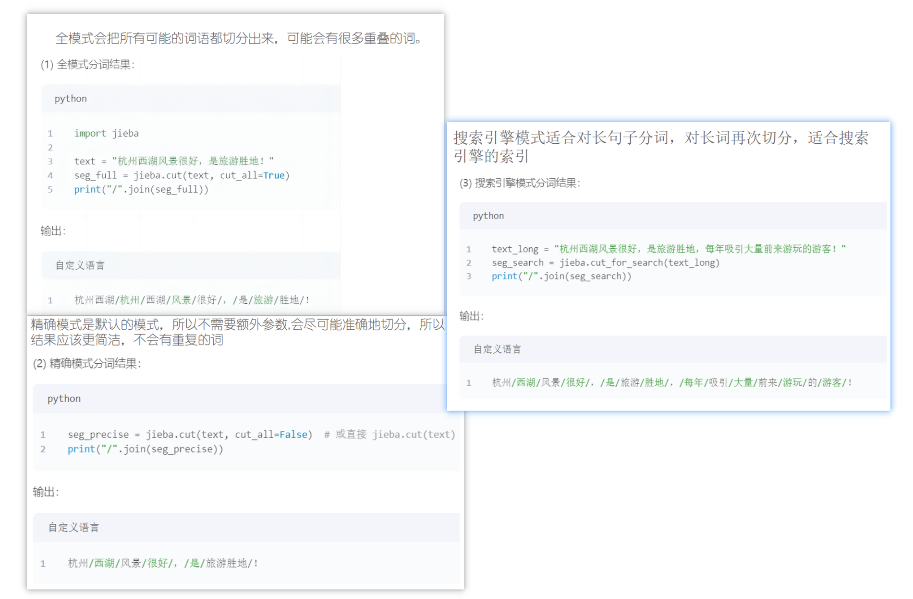
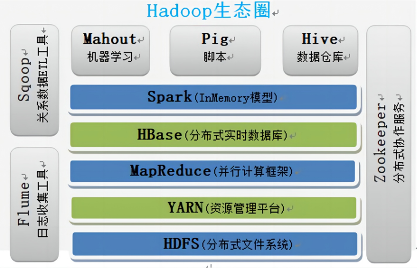

## 预测考题

### 论述题

#### Question 1

> 大数据的基本特征？特征含义？大数据是什么？

**Volume** : Refers to massive amount of data **collected and generated** ay unprecedented scales.

**Velocity**: Fast data generation and **processing** speed. ‘One second rules’ means providing data analysis result within 1 second level **time range**, otherwise the data will lose it value.

**Veracity**: it is hard to determine the accuracy and quality of data.

**Variety**: Structured, semi-structured, unstructured data such as document files and video and **audio** files  from web pages, social media, **sensors, smart terminal**.

**Value**: the data value density is relatively low. It is necessary to combine business logic and machine learning **algorithm** to mine the data value.


There is  currently no universally recognized definition of big data. it is a collection  of data that can not be captured managed and processed by conventional software tools within a certain time frame. It is a massive, high-growth, and diverse data that requires newly processing model to have stronger decision-making, insight discovery and process optimization capabilities.


#### Question 2

> 大数据处理分析的主要流程

1. Data **acquisition**: it is the **foundation** of the data analysis, severing as the first step to acquire various information from different sources like web pages, social media and **forum**. The process is : sending requests, receiving responds, parsing content, saving data.
2. Data cleaning : is the fundamental task of data preprocess, make data suitable to analysis and application. It is a critical step, ensuring the **integrity** **consistency**, **timeliness** and **effectiveness** of data to support the subsequent data handle. The process is : analyzing, defining checking rules, detecting, handling, evaluation
3. Data transformation and merge: Data merge refers to **stack** multiple datasets into one dataset, collect multiple datasets into desired dataset, and map transform **discretize** the data. Data transform means **converting** data from one **format**, structure and representation to another to ensure the analysis **modeling** and integration with other data. 
4. Data annotation: aims to learn a model that can provide a labeled sequence as prediction of observed sequence. The input is … and output is … There are text annotation and image annotation and includes sequence tagging, relationship annotation, attribute annotation and category annotation, keypoint, **rectangle**, **polygon**, regional…
5. Data analysis: extracting hidden information from large amount of data and identify the **inherent pattern** of studied objects. People understand, **judge**, make decision and take action based on data analysis. It includes **descriptive**, **diagnostic**, predictive  and directive analysis.
6. Data visualization: refers to the process of using computer **graphics** to transform **massive**, **dynamic**, high dimensional to visual format to support data analysis and **interaction**. It includes **scientific** and information  **visualization**, revealing the key **insight** through **intuitive** visuals.
7. Data storage: using computer hardware and software to store and **apply** data. In big data era, the data type and volume have grown **beyond** traditional capabilities, requiring new **technologies** such as distributed file systems and databases.

### 简答题

#### Question 1

> csv格式

CSV is a kind of file format that stores tabular files. CSV is composed of records(rows), each record is a line of text. Every record contains fields, separated by commas.

#### Question 2

> Hadoop 基本组件

1. Hadoop Distributed file systems: store data by splitting them into blocks and ensure the fault tolerance. Name nodes is the central sever managing the metadata and namespace and Data nodes store the data and operate the Name nodes’ instructions.
2. Mapreduce: uses map and reduce tasks to **perform parallel data computation with key- value pairs.** JobTracker handles job **decomposition**, task **scheduling** and resource management, TaskTracker executes task and **report** status.
3. YARN. Manage cluster resource and schedules processing tasks. Resourcemanager manage resources, Nodemanager **execute** tasks, ApplicationMaster send **request** and container carries the **workload**.

#### Question 3

> 数据分析算法

K-means

Randomly choose K **centroids**

Assign each data point to the nearest centroid.

Recompute the centroids as the mean of the assigned points

Repeat steps 2,3 until centroids no longer  change or a maximum number of iteration is reached.


## Question 1

> 什么是大数据？大数据特征？大数据应用方面？大数据结构？

1. 什么是大数据

There is currently no universally recognized definition of big data. Big data refers to a collection of data that cannot be captured, managed, and processed using conventional software tools within a certain time frame. It is a massive, high growth, and diverse information asset that requires new processing models to have stronger decision-making, insight discovery, and process optimization capabilities.

大数据目前还没有统一公认的定义。它通常指的是那种不能通过传统软件工具在规定时间内完成捕捉、管理和处理的数据集合。这类数据资产具有庞大的规模、高速增长和多样化的特征，需要新型的处理模式，以提升决策、洞察和流程优化的能力。

2. 大数据特征

Big data is characterized by several key features,   which can be summarized as the "5Vs": Volume, Velocity, Variety, Veracity, and Value. 

大数据的特征通常被概括为“5个V”：分别是体积（Volume）、速度（Velocity）、多样性（Variety）、准确性或可信度（Veracity）以及价值（Value）。

- Volume: In 2003, it will take 10 years for humans to complete the sorting of 3 billion base pairs; after 10 years, the gene analyzer can complete it just in 15 minutes. Refers to the massive amount of data generated and collected at unprecedented scales.
- Variety: Structured, semi-structured, and unstructured data such as document files, audio and video files from web pages, social media, sensors, and smart terminals.
- Velocity: Fast data generation and processing speed. The "1-second rule" refers to providing analysis results within a second level time range, otherwise the data will lose its value.
- Veracity: the large amount of data makes it difficult to determine the accuracy and reliability (data quality) of the data.
- Value: The data value density is relatively low, and it is necessary to combine business logic and machine learning algorithms to mine the data value.


## Question 2

> 数据清洗当中会可能包含哪些数据清洗的任务？

The basic process of data cleaning consists of five steps：**analyzing data, defining data cleaning rules, checking dirty data, processing dirty data, and evaluating data quality.**


### Data cleaning process

- **Analyzing data**: understand the structure, content of raw data  to identify the quality issue.
- **Define cleaning rules**: how to detect and process dirty data in raw data. For example, how to detect outliers, how to handle outliers, how to handle missing values, etc.
- **Detect dirty data**: identify and mark dirty data using statistical analysis, data visualization, rule checking, model prediction…
- **Handling dirty data**: Taking corresponding measures to make rule data clean, accurate.
    - Consistency check is mainly focused on 
        - 检查每个变量的合理取值范围，
        - 变量间的相互关系，
        - 检查变量名称是否规范，
        - 是否存在冲突，
        - 值是否符合要求，
        - 记录中是否存在拼写错误。
        - SPSS、SAS、Excel 等提供了一些基本方法来自动识别每个值是否超出范围。
        - 数据形式中可能出现值与值之间逻辑不一致的情况。
    - 缺失值处理方法：

        - **delete missing values**: This method  deletes data containing missing values directly, which is suitable for the situations where there are few missing values in the dataset and it does not affect the overall data analysis. 
        - **Fill in the missing values**: This method replaces the missing value  with another appropriate value. This method is suitable for situations where there are many missing values in the data or where deleting data affects overall data analysis.
            - （1）Mean imputation：用均值填补数值型数据的缺失值。这种方法简单易行，但容易造成均值的漂移，忽略数据的变异性。
            - （2）Median imputation：用中位数填补数值型数据的缺失值。
            - （3）Mode imputation：用众数（即出现次数最多的值）填补缺失值。
            - （4）Regression imputation：通过建立回归模型来预测缺失值。
            - （5）Interpolation imputation: 使用数学插值方法估计缺失值，然后进行填补。线性插值
            - （6）Special value : 在某些特定情况下，可以使用特殊值（例如 0 或 1）替换缺失值，但务必确保这些特殊值能够与其他数据区分开来。
            - （7） K-nearest neighbor method: 利用样本观测值之间的相关性来填充缺失值。如果两个观测值相似，并且其中一个观测值在某些变量上存在缺失值，则该缺失值很可能与另一个观测值相似。
    - 重复值处理 duplicate values：

        - (1) Delete duplicate values: The simplest method is to directly delete duplicate values.  
        - (2) Merge duplicate values: This method is suitable for situations where duplicate values have similar information and merging them will not affect data analysis.
        - (3) Tag duplicate values:  Do not remove duplicate values, but add an tags on each duplicate record to indicate that it is duplicate
    - Outliers：

        - 检测异常值：

            - Statistical based methods
            - box plot
            - Distance based methods include K-Nearest Neighbors (KNN) and LocalOutlier Factor (LOF).

            - Cluster based methods
            - Machine learning based methods

        - 处理异常值

            - The purpose of handling outliers is to ensure the accuracy and reliability of data analysis and modeling processes. 
            - Delete outliers
            - Replace Outliers
            - Group processing: 将数据分成两部分，一部分包含异常值，另一部分不包含，并对每一部分数据分别进行处理。这可以在一定程度上减少异常值对整个数据集的影响。
- Evaluation data quality
    - Helping to validate the effectiveness of data cleaning and whether data meets the expected quality standards. Find overlook.

## Question 

> ETL


**ETL 是整个流程的核心处理环节，包含三步：**

- **E：Extract（抽取）**
     从上面多个数据源中抽取出需要的数据；
- **T：Transform（转换）**
     对数据进行清洗、标准化、格式转换等处理；
- **L：Load（装载）**
     将处理后的数据加载进数据仓库。

这个过程确保**数据变得结构化、干净，并具备统一标准**。

## Question

> 数据标准化

目的：

It is mainly used to process raw data structurally to conform to specific data models, standards, or conventions .

它主要用于对原始数据进行结构处理，使其符合特定的数据模型、标准或规范。

Ch transfor那张 P4

- Conversion type of data：converting a string type to a numerical type for mathematical operations.
- Data structure adjustment：For example, splitting a field containing complex data into multiple fields.
- ==Standardization of data== : Data standardization refers to the unified representation or unit for data to ensure consistency. For example, converting data with different units to the same unit, or unifying the representation of data into a specific standard format
- Standardization of fields：同一字段命名或格式


## Question 3

> 数据的准备过程，涉及到对数据形式的操作，如合并，追加常用的方法？Python相关操作


**添加行添加列**:


```python
df.loc["英语"] = np.random.randint(60,100,4)
df.loc["英语",:] = np.random.randint(60,100,4)
```


```python
df[:."张菲"] = np.random.randint(60,100,4)
```


只能插入列：

```python
df.insert(2,"郝建", np.random.randint(60,100,4))
```


### 合并

`concat()`, `merge()`, 和 `join()` 是 pandas 中常用的数据合并函数。

`concat()`：按行或按列拼接 Series 或 DataFrame。

`merge()`：根据两个表的**列**进行连接合并（类似 SQL 中的 join）。

`join()`：根据两个表的**索引**进行连接合并。


#### concat()

| 参数名               | 含义                                                         |
| -------------------- | ------------------------------------------------------------ |
| **objs**             | 要连接的数据对象序列                                         |
| **axis**             | 指定连接的轴，默认是 0（即添加行）  1（添加列）              |
| **join**             | 连接方式，默认是 "outer"（并集），也可以设置为 "inner"（交集） |
| **ignore_index**     | 是否忽略原索引。默认 False，设为 True 时重新生成整数索引     |
| **keys**             | 多层索引的外层标签                                           |
| **levels / names**   | 构建多层索引时，指定层级顺序和名称                           |
| **verify_integrity** | 是否检查连接后是否有重复索引，默认 False                     |
| **copy**             | 是否复制数据，默认 True，设为 False 时节省内存但需注意数据结构变化 |

==1是添加列，inner不重复的行删掉；0是添加行，不重复的列删掉==

```python
pd.concat([df1,df2],axis=1,join='outer') # 1表示添加了列
```


```python
pd.concat([dfl,df2],axis=l,join='inner') # 没用的行删掉
```


```python
pd.concat([df1, df2], axis=0, join='outer') # 0表示添加了行
```


```python
pd.concat([df1, df2], axis=0, join='inner') # 没用的列删掉
```


#### append


#### Merge() 

| 参数                         | 含义                                                         |
| ---------------------------- | ------------------------------------------------------------ |
| **left/right**               | 左/右侧参与合并的 DataFrame                                  |
| **how**                      | 合并方式：'inner'（交集，默认），'outer'（并集），'left'（左连接），'right'（右连接） |
| **on**                       | 指定用于合并的列名，必须在两个表中都存在                     |
| **left_on / right_on**       | 分别指定左右表中用于合并的列名                               |
| **left_index / right_index** | 使用索引作为连接键                                           |
| **sort**                     | 是否按照连接键排序，默认 True                                |
| **suffixes**                 | 重名列的后缀，默认 `_x`, `_y`                                |
| **indicator**                | 显示行的来源（仅左/右/同时存在），输出 `_merge` 列           |


```python
df1 = pd.DataFrame({'城市':['北京','上海','广州'],'温度':[22, 27, 32]})
df2 = pd.DataFrame({'城市':['北京','上海','广州'],'湿度':[69, 78, 81]})
df = pd.merge(df1, df2, on='城市')  # 以“城市”为连接键合并两个 DataFrame

df1 = pd.DataFrame({'城市':['北京','上海','广州','成都'],'温度':[21,24,32,26]})
df2 = pd.DataFrame({'城市':['北京','上海','武汉'],'湿度':[69, 78,80]})
df = pd.merge(df1, df2, on='城市')
```

- Output:

```python
城市   温度  湿度
北京   22   69
上海   27   78
广州   32   81

城市   温度  湿度
北京   21   69
上海   24   78
```


```python
df1 = pd.DataFrame({'城市':['北京','上海','广州','成都'],'温度':[21,24,32,26]})
df2 = pd.DataFrame({'城市':['北京','上海','武汉'],'湿度':[69, 78,80]})
df = pd.merge(df1, df2, on='城市', how='left')
```

以左表为主进行连接，保留左表全部内容


```python
df = pd.merge(df1, df2, on='城市', how='outer', indicator=True)
```

`how='outer'`：外连接（outer join）→ 保留两个表中所有数据

`indicator=True`：会添加 `_merge` 列，说明每条数据来源于哪个表


#### join() P66

| 参数                  | 含义                                                |
| --------------------- | --------------------------------------------------- |
| **other**             | 要合并的另一个 DataFrame 或 Series，或它们的列表    |
| **on**                | 用于连接的列名（可选）                              |
| **how**               | 连接方式：'left'（默认）、'right'、'outer'、'inner' |
| **lsuffix / rsuffix** | 用于重名列的后缀处理                                |
| **sort**              | 是否按键排序，默认 False（即保持原顺序）            |


````python
# 创建左侧 DataFrame
left = pd.DataFrame({'Key': ['A', 'B'], 'Value': [1, 2]})

# 创建右侧 DataFrame
right = pd.DataFrame({'Key': ['A', 'C'], 'Data': [3, 4]})

# 基于 'Key' 列进行连接，先设置索引
result = left.set_index('Key').join(right.set_index('Key'), on='Key', how='left')
print(result)
````


```python
# 左表：索引是 A、B，列名是 'Value'
left = pd.DataFrame({'Value': [1, 2]}, index=['A', 'B'])

# 右表：索引是 A、C，列名也是 'Value'
right = pd.DataFrame({'Value': [3, 4]}, index=['A', 'C'])

# 使用 outer 方式合并，自动对齐索引，列名冲突时加后缀
result = left.join(right, how='outer', lsuffix='_left', rsuffix='_right')
print(result)
```

- 合并方式是 `outer`：并集，保留左右表所有索引。
- 索引 A 同时出现在两表 → 对应值分别来自左右表。
- 索引 B 只在左表 → 右侧填 NaN。
- 索引 C 只在右表 → 左侧填 NaN。
- 列名冲突：两边都有 `Value`，加上后缀 `_left` 和 `_right` 来区分。


#### combine

有重合情况：


没重合：


## Question 4

> 数据标注的形式？


#### Sequence tagging

**Name Entity Recognition** aims to **identify specific entities** (Name Entity) in text and the category which they belong to.

📙 **命名实体识别（NER）**是识别文本中具有特定含义的实体，并将其分类，如人名、地名、组织名等。

**Part of speech tagging (POS)** is a form of text data tagging that can annotate entity names, entity attributes, and entity relationships of text content.
 📙 **词性标注（POS）** 是一种标注实体、属性和关系的方式。

**Rhythm annotation** is to mark the position of rhythm symbols.
📙 **韵律标注**是标注语音中的停顿、重音等韵律信息。

**Intention understanding** data is the process of collecting various user queries, categorizing them by domain, and labeling each sentence's intention, slot, and slot value.
📙 **意图识别**是通过采集用户的查询语句，对其进行分类（如领域识别），并标注每句的**意图**、**槽位**及其**槽值**。


#### Relationship annotation

**Relationship annotation is marking the syntactic and semantic associations of complex sentences.**

📙 **关系标注**是对复杂句子中的**语法和语义关系**进行标注。


#### Attribute annotation

**Attribute annotation is the attributes annotation of objects in the text, and sentiment annotation is also a key content of attribute annotation, which labels the emotions corresponding to the original text.**
📙 属性标注是对文本中对象的属性进行标注，而情感标注也是属性标注的重要组成部分，它为原始文本对应的情感打标签。

属性标注不仅识别“用户在说什么”，还要标出“用户在表达什么情绪、针对哪个属性”，比如“对售后很愤怒”。


例子：


| 图中分析项       | 标注内容                                  | 对应的数据标注类型             | 属于的细化任务（子类型）                                   |
| ---------------- | ----------------------------------------- | ------------------------------ | ---------------------------------------------------------- |
| **分词**         | 今天 / 北京 / 是不是 / 下雨               | **Sequence Tagging**           | 分词（Word Segmentation）                                  |
| **词性标注**     | 今天/nl 北京/ns 是不是/v 下雨/v           | **Sequence Tagging**           | 词性标注（Part-of-Speech Tagging）                         |
| **命名实体标注** | 今天/TIME 北京/LOC                        | **Sequence Tagging**           | 命名实体识别（Named Entity Recognition, NER）              |
| **意图标注**     | 意图：查询气象-雨，时间：今天，城市：北京 | **Attribute Annotation**       | 意图识别（Intent Understanding）、槽位抽取（Slot Filling） |
| **情感分析**     | 中性                                      | **Attribute Annotation**       | 情感标注（Sentiment Annotation）                           |
| **英文翻译**     | Is it raining in Beijing today            | **其他拓展任务（常用于交付）** | 机器翻译 / 语义对齐（不属于核心四类，但常见）              |


## Question 5

> 大数据分析，基于分析目标，聚类，分类，预测回归，的算法原理，没有做限制，熟练掌握一种基本原理和功能。

The Kernighan Lin algorithm aims to divide a network into two known sized communities based on greedy principle. 

### Step:

**Initial Partition**: Randomly divide the nodes into two equally sized sets A and B.

**Compute Node Scores**: For each node in A and B, calculate its internal edge weight (within the group) and external edge weight (to the other group).

**Select Node Pairs to Swap**: Identify a pair of nodes (one from each group) whose swap would yield the greatest reduction in total cross-group edge weight (i.e., cut value).

**Perform Swap**: Swap the selected nodes and record the gain from each swap.

**Repeat Optimization**: Repeat steps 2 to 4 until no further improvement can be made.

### Example

去草稿本上复习


## Question 6

>  Python 中的 request 方法能完成什么样的功能，获取什么东西？


- **In addition, the Requests library also provides other types of request methods, such as PUT, DELETE, HEAD, and OPTIONS.**
     此外，`requests` 库还支持其他几种请求方法，例如 PUT、DELETE、HEAD 和 OPTIONS。


| 属性           | PUT                                  | POST                                 |
| -------------- | ------------------------------------ | ------------------------------------ |
| **用途**       | 修改或替换资源                       | 创建新资源                           |
| **幂等性**     | ✅ 是幂等操作（多次相同请求结果不变） | ❌ 非幂等操作（每次可能生成不同资源） |
| **使用场景**   | 更新用户信息、上传文件（覆盖式）     | 提交表单、新建用户、评论等           |
| **资源路径**   | 通常是明确指定的资源路径             | 通常是服务器自动分配新资源位置       |
| **请求体内容** | 包含完整的资源数据                   | 包含用于创建的字段数据               |

```python
response = requests.put('http://httpbin.org/put', data={'key': 'value'})
# PUT 方法：用于更新资源

response = requests.delete('http://httpbin.org/delete')
# DELETE 方法：用于删除资源

response = requests.head('http://httpbin.org/get')
# HEAD 方法：只获取响应头（不包含内容）

response = requests.options('http://httpbin.org/get')
# OPTIONS 方法：查看服务器支持哪些请求方法

```

- **`response.status_code`: If the status code returned is not 200, this method throws an exception.**
- **`response.status_code`：** 如果返回的状态码不是 200（即非成功请求），可能会抛出异常。


### post get 不同

#### **1. Data Transmission Methods（数据传输方式）**：

- **GET Request**:
     Data is appended to the URL, which means the data is visible and limited in size.
     **GET 请求：** 数据附加在 URL 后面，因此数据是可见的，且大小受限。


- **POST Request**:
     Data is included in the request body, making it suitable for transmitting large amounts of data or sensitive information.
     **POST 请求：** 数据放在请求体中，适合传输大量数据或敏感信息。

```python
import requests

url = "https://httpbin.org/get"
params = {"search": "python", "page": 1}

response = requests.get(url, params=params)

print("GET 请求结果：")
print(response.json())
```

```python
import requests

url = "https://httpbin.org/post"
data = {"username": "alice", "password": "123456"}

response = requests.post(url, data=data)

print("POST 请求结果：")
print(response.json())
```


#### **2. Idempotency（幂等性）**：

- **GET Request**:
     It is idempotent, meaning multiple identical requests will not change the server state.
     **GET 请求：** 是幂等的，意思是多次发送相同请求不会改变服务器状态。
- **POST Request**:
     It may alter the server state, such as creating a new resource or updating existing data.
     **POST 请求：** 可能会改变服务器状态，比如创建新资源或更新已有数据。

#### **3. Security（安全性）**：

- **GET Request**:
     Data is exposed in the URL, making it unsuitable for transmitting sensitive information.
     **GET 请求：** 数据暴露在 URL 中，不适合传输敏感信息。
- **POST Request**:
     Data is contained within the request body, providing relatively higher security.
     **POST 请求：** 数据包含在请求体中，相对更安全。

#### **4. Use Cases（使用场景）**：

- **GET**:
     Ideal for retrieving public data, such as search results or webpage content.
     **GET 请求：** 适合获取公共数据，比如搜索结果、网页内容等。
- **POST**:
     Suitable for submitting data that requires some processing, such as user login credentials or form submissions.
     **POST 请求：** 适合提交需要处理的数据，比如用户登录信息、表单提交等。

#### **5. Caching Behavior（缓存行为）**：

- **GET Request**:
     Results can be cached, improving access speed.
     **GET 请求：** 返回结果可以被缓存，提高访问速度。
- **POST Request**:
     Results are typically not cached.
     **POST 请求：** 返回结果一般不会被缓存。

#### **6. Data Limitations（数据限制）**：

- **GET Request**:
     Data size is limited by the URL length constraints.
     **GET 请求：** 数据大小受限于 URL 长度限制。
- **POST Request**:
     Data size generally has no restrictions, making it ideal for large data transmissions.
     **POST 请求：** 数据大小通常没有限制，适合传输大数据。

#### **7. HTTP Methods（HTTP 方法）**

- **`requests.get` uses the HTTP GET method, which is used to retrieve resources from a server.**
     `requests.get` 使用的是 HTTP 的 GET 方法，用于从服务器获取资源。
- **`requests.post` uses the HTTP POST method, which is used to submit data to a server.**
     `requests.post` 使用的是 HTTP 的 POST 方法，用于向服务器提交数据。

```python
# 使用 GET 请求获取数据
import requests

response = requests.get('https://api.example.com/data')
print(response.text)

# 使用 POST 请求提交数据
response = requests.post('https://api.example.com/create', data={'key': 'value'})
print(response.text)
```


### post 的两个参数

| 类型            | 参数位置       | 使用方式                        | 特点                       |
| --------------- | -------------- | ------------------------------- | -------------------------- |
| URL拼接参数     | URL            | `requests.get(url?key=value)`   | 简单但不推荐用于 POST      |
| Form Data       | 请求体（表单） | `requests.post(..., data=data)` | 最常用，支持表单结构       |
| Request Payload | 请求体（JSON） | `requests.post(..., json=data)` | 现代接口常用，支持嵌套结构 |


## Question 8

> CSV格式的特点

P 142

- CSV ( Comma-Separated Values), is a simple and widely-used file format for storing tabular data. **Each line in a CSV file represents a data record, with fields separated by commas.**
- Features: This structure allows easy data exchange between different systems and applications. CSV is commonly supported by many programming languages and tools. Its simplicity and compatibility make it a popular choice for handling structured data efficiently.

### 使用规范细则

#### 1. Records and Fields（记录和字段）

- **A CSV file is composed of records (rows), where each record is a line of text.**
     ➤ 一个 CSV 文件由多条记录（行）组成，每条记录是一行文本。
- **Each record contains fields (columns), separated by commas.**
     ➤ 每条记录由多个字段（列）构成，字段之间用逗号分隔。
     - Example: Name, Age, City
         ➤ 示例：Name, Age, City
     - This record has three fields: "Name", "Age", and "City".
       

#### 2. Special Cases（特殊情况）

- Commas within Fields: If a field contains a comma, the entire field must be enclosed in double quotes (").
     ➤ 字段中有逗号时，需要用双引号把整个字段包裹起来。
    - Example: `"John, Doe", 30, "New York"`
         ➤ 示例：字段 "John, Doe" 被双引号包裹。
- Newlines within Fields: If a field contains a newline character, it must also be enclosed in double quotes.
     ➤ 如果字段中包含换行符，也必须用双引号括起来。
    - Example: `"Multiline\nField", Data`
         ➤ 示例：含有多行的字段同样用双引号括起来。

- Quotes within Fields（字段中含有引号）
    - If a field contains a double quote, it must be expressed by doubling the quote.
         ➤ 如果字段中包含引号，需要将引号写成两个双引号。
    - Example: `"She said, ""Hello""" , 25, City`
         ➤ 示例：She said, "Hello"，25，City

#### 3. Header Row（表头）

- The first line of a CSV file often contains headers that describe the content of each column.
     ➤ CSV 文件的第一行通常是表头，用于说明每一列的含义。
- **Example**: ID, Name, Email, Phone
     ➤ 示例：ID, Name, Email, Phone

#### 4. Optional Whitespace（可选空格）

- Spaces after commas are generally ignored, but spaces within fields are preserved.
     ➤ 逗号后的空格通常会被忽略，但字段内部的空格会被保留。
- **Example**: `Name, Age , City` is equivalent to `Name,Age,City`
     ➤ 示例：`Name, Age , City` 与 `Name,Age,City` 是一样的。

#### 5. Comment Lines（注释行）

- Some CSV files may include comment lines, which typically start with a # or //.
     ➤ 有些 CSV 文件可能包含注释行，通常以 `#` 或 `//` 开头。
- but this is not part of the standard CSV syntax.
     ➤ 但这并不是标准 CSV 语法的一部分。


### 特点

```python
Name, Age, City
John Doe, 30, New York
Jane Smith, 25, Los Angeles
"Mike Johnson", 35, "San Francisco"
```

- Lightweight: Small file size, easy to read and write, suitable for storing and transmitting small and medium-sized data.
- Text format: A plain text file that can be opened and edited with any text editor.
- Easy to parse: The structure is simple, and most programming languages can quickly parse and generate CSV data.
- Wide support: Many software (such as Excel, Google Sheets, database systems) support CSV file format.


### 优缺点

**优点**：

- 易于使用：格式直观，易于理解和编辑。
- 兼容性强：支持多种编程语言和工具，例如 Python、Excel、R 等。
- 文件大小小：没有复杂的元数据或结构，比 JSON 和 XML 更小。
- 易于阅读：即使没有专门的工具，也可以通过文本编辑器查看内容。

**缺点**：

- 缺乏标准化：不同的工具处理 CSV 的方式可能有所不同（例如分隔符、换行符）。
- 无法表示层级结构：CSV 为二维结构，不适合存储复杂的嵌套数据。
- 缺乏数据类型信息：所有字段都以文本形式存储，没有数据类型定义。
- 数据安全性：没有内置加密或权限控制，容易被篡改。

### 读写

**读取 CSV 文件**：

- Python 示例：使用内置 `csv` 模块或 `pandas` 库
- JavaScript 可用 `PapaParse`，Java 用 Apache Commons CSV

**写入 CSV 文件**：

- 同样可以使用 Python 的 `csv` 或 `pandas`

```python
import csv

# 写入的数据
data = [
    ["Name", "Age", "City"],
    ["Alice", 30, "Beijing"],
    ["Bob", 25, "Shanghai"]
]

# 写入 CSV 文件
with open('people.csv', 'w', newline='', encoding='utf-8') as f:
    writer = csv.writer(f)
    writer.writerows(data)
```

```python
import pandas as pd

# 写入的数据
data = {
    "Name": ["Alice", "Bob"],
    "Age": [30, 25],
    "City": ["Beijing", "Shanghai"]
}

df = pd.DataFrame(data)

# 写入 CSV 文件
df.to_csv("people.csv", index=False, encoding="utf-8")
```


```python
import csv

# 读取 CSV 文件
with open('people.csv', 'r', encoding='utf-8') as f:
    reader = csv.reader(f)
    for row in reader:
        print(row)
```

```python
import pandas as pd

# 读取 CSV 文件
df = pd.read_csv("people.csv", encoding="utf-8")

# 打印每一行
for index, row in df.iterrows():
    print(row.to_dict())
```


Read CSV file: 

- Python example: Use the built-in CSV module or pandas library.
- Other languages such as JavaScript can use libraries like Papapath, while Java can use Apache Commons CSV.

Writing CSV files:

- Writing operations can also be performed using Python's CSV module or the pandas library


## Question 9

> 有哪些类型的爬虫？

### 按爬取内容分

**1. Focused Web Crawler**
 Crawls web pages related to a specific topic. It filters and prioritizes URLs based on relevance using text similarity or link analysis.

**2. Incremental Web Crawler**
 Only collects newly updated or changed pages. It reduces data volume and needs deduplication.

**3. Deep Web Crawler**
 Accesses hidden pages that require login or form submission. It involves detecting forms, filling them, and navigating deep links.

**4. General Web Crawler (Implied)**
 Unlike the focused crawler, it collects all accessible web pages without targeting specific topics. It is less personalized and less efficient.

### 按爬取策略分

- The static crawler : searches data according to some determined rules, which will not change due to changes in webpage structure or text information.
    - Breath first search
    - Depth first search
    - Best first search
- The dynamic crawler : aims to efficiently and quickly complete crawling tasks, and adjust crawling routes in real-time. Fish-Search and Shark-Search are crawlers based on text content; PageRank, HITS,HillTop are dynamic crawlers based on link analysis.

### 应用角度来分

Collection type crawler: Continuing the technology of search engine crawling, it is currently the most widely used mode, which limits the scope and intention of crawling to different degrees.

Monitoring type crawler: does not primarily aim to collect information, but utilizes the crawler's ability in content collection and analysis to monitor the information content of the server, thus proposing higher applications for the interaction ability between the crawler and the server


## Question 10

> 大数据处理分析中的主要流程，过程是什么？（估计是简答题）
>
> 处理过程中有哪些问题，有什么办法解决？

### 1. 数据爬取

It is the **foundation of big data analysis**, acquiring data from various sources such as social media, web pages using web crawler, APIs and so on.

The typical process includes:
 **(1)** Sending requests → **(2)** Receiving responses → **(3)** Parsing content (HTML/JSON) → **(4)** Saving data.

**Common issues** include:

- Data hidden behind JavaScript rendering
- Anti-crawling measures like **User-Agent detection** or **IP blocking**

**Solutions** involve using **custom request headers**, handling **AJAX-loaded data**, or switching to API-based crawling.


### 2. 数据清洗

**"Big data cleaning is a fundamental task, ensuring the analysis and application of big data."**

To ensure the data accurate integrity, consistency, timeliness and effectiveness and other requirements to support subsequent data handle.

The cleaning process includes:
 **(1)** Analyzing data → **(2)** Defining cleaning rules → **(3)** Detecting dirty data → **(4)** Handling dirty data → **(5)** Evaluating data quality.

Common issues include **missing values, duplicate records, and outliers**.
 Solutions involve **deleting or imputing missing data**, using **drop_duplicates()** for duplicates, and applying **statistical or machine learning methods** to detect outliers.


### 3. 数据合并转换

Introduction to Data Transformation：

- Data transformation refers to the process of converting data from one format, structure, or representation to another to make it suitable for analysis, modeling, or integration with other datasets. It is a critical step in data preprocessing, ensuring data quality, consistency, and compatibility across systems.
- It is often necessary to stack multiple datasets into one dataset, connect multiple datasets into the desired dataset, and map, transform, or discretize data values.


### 4. 数据标注

- Text data annotation, as one of the most common types of data annotation, refers to annotating text, including text and symbols, so that computers can understand and recognize them.
- The purpose of labeling problems is to learn a model that can provide labeled sequences as predictions for observed sequences.
- The input of the annotation problem is an observation sequence and the output is a label sequence or state sequence.
- Text data annotation is divided into sequence tagging, relationship annotation, attribute annotation, and category annotation. Using doccano
  - Sequence tagging includes word segmentation, entities, keywords, prosody, intent understanding, etc;
  - Relationship annotation includes pointing relationships, decorate relationships, parallel corpora, etc;
  - Attribute annotation includes text category, news, entertainment, etc;
  - Category annotation includes reading comprehension within the range of passage.

- Image annotation using LabelImg, Labelme
    - keypoint annotation, 
    - rectangular box annotation, 
    - Polygon annotation
    - image segmentation, 
    - 3D box annotation, 
    - attribute annotation


### 5. 数据分析

The purpose of data analysis and data mining is to extract information hidden in large amounts of data, to identify the inherent patterns of the studied object. People understand , judge, make decisions, and take actions based on a series of data analysis.

The purpose of data analysis can be roughly divided into four levels: descriptive data analysis, diagnostic data analysis, predictive data analysis, and directive data analysis.

**Descriptive data analysis** provides a brief summary of what has happened, reflecting the fluctuation and trend of data through descriptive statistical indicators, and observing whether there are any abnormal situations in the data through descriptive data analysis.

**Diagnostic data analysis** goes one step further on the basis of descriptive data analysis, that is, *"how it happened"*. Diagnostic data analysis can discover the causes and outcomes of events.

**Predictive data analysis** is the result of combining descriptive data analysis and diagnostic data analysis to further discover the direction of data and predict what may happen next, that is, *"what may happen"*.

**Directive data analysis** is the process of proposing solutions based on the first three levels, namely *"what should be done"*.


### 6. 数据可视化

**Data visualization** uses computer graphics to transform complex, high-dimensional data into visual formats for analysis and interaction. It includes **scientific** and **information visualization**, helping reveal key insights through intuitive visuals.


### 7. 数据存储

**Data storage and management** is the process of using computer hardware and software to store and apply data efficiently. In the big data era, data types (structured, semi-structured, unstructured) and volumes have grown beyond traditional capabilities, leading to new technologies like **distributed file systems** and **distributed databases**.


## Question

> scrapy

### Scrapy 的核心功能

| 功能                 | 简介                                                     |
| -------------------- | -------------------------------------------------------- |
| 网页抓取             | 发起请求、下载网页内容                                   |
| 数据抽取             | 通过 XPath、CSS Selector、正则表达式等方式提取结构化信息 |
| 数据持久化           | 支持保存为 JSON、CSV、XML、数据库等格式                  |
| 高性能并发           | **基于 Twisted 异步 I/O，速度快、并发高**                |
| 爬虫中间件           | 可插拔模块，支持用户自定义请求头、代理、重试机制等       |
| 多项目支持           | 可以同时管理多个爬虫项目                                 |
| 分布式支持（可拓展） | 可配合 scrapy-redis 等插件实现分布式爬虫                 |


## Question 

> matplotlib

```python
p1 = plt.figure(figsize=(8,6),dpi=80)
```


| 图类型                 | 中文名              | 说明                                            |
| ---------------------- | ------------------- | ----------------------------------------------- |
| `plot()`               | 折线图              | 展示趋势变化，默认函数                          |
| `bar()` / `barh()`     | 条形图 / 横向条形图 | 展示分类数据的对比                              |
| `hist()`               | 直方图              | 展示数据分布情况                                |
| `scatter()`            | 散点图              | 展示点之间的关系（相关性）                      |
| `pie()`                | 饼图                | 展示部分与整体的关系（比例）                    |
| `boxplot()`            | 箱线图              | 展示数据的分布、异常值、四分位数                |
| `fill_between()`       | 区域图              | 用于表示范围变化（如置信区间）                  |
| `imshow()`             | 图像展示            | 可用于显示图片、热力图等                        |
| `contour()`            | 等高线图            | 常用于地理、图像等连续空间变量                  |
| `3D plot`（需 Axes3D） | 三维图              | ==surface chart, scatter plots and line chart== |

==scatter plot 散点图==

==line chart  折线图==

==Step plot 阶梯图==

==Time series plot 时间序列图==

==bar chart 柱状图==

==Radar chart 雷达图==

==Bubble chart 气泡图==

==Pie chart 饼图==

==stack column chart== 有比例的柱状图

==Histogram 直方图==

==Box plot 镶嵌图==

==Density plot 密度图==

==word cloud==

==Temporal text==

==Force-Directed graph 力导向图==


```python
import matplotlib.pyplot as plt

x = [1, 2, 3, 4, 5]
y = [2, 4, 1, 3, 7]

plt.plot(x, y, label='line')        # 折线图
plt.xlabel('X axis')                # 设置X轴标签
plt.ylabel('Y axis')                # 设置Y轴标签
plt.title('Simple Line Chart')      # 设置图标题
plt.legend()                        # 显示图例
plt.grid(True)                      # 显示网格
plt.show()                          # 渲染显示图形
```


## Question 

> jieba



## Question 

> 大数据的结构特征

### 🧱 大数据的结构特征：主要分为三类

| 类型 | 名称             | 说明                                                       | 示例                                     |
| ---- | ---------------- | ---------------------------------------------------------- | ---------------------------------------- |
| ①    | **结构化数据**   | Has a clear schema and fields, similar to a database table | 表格、关系数据库（如 MySQL）             |
| ②    | **半结构化数据** | There are certain structural tags, but no fixed fields     | JSON、XML、日志、HTML                    |
| ③    | **非结构化数据** | 没有固定格式、无法直接建表                                 | 文本、图片、音频、视频、邮件、社交内容等 |

Structured data is organized in a predefined format and structure, typically in tables like SQL or Excel, making it easy to query and analyze. It is highly formatted.

Unstructured data lacks a fixed format and includes diverse content like text, videos, and PDFs, making it hard to process with traditional tools. It holds rich information and is widely used in areas like social media analysis.

Semi-structured data sits between structured and unstructured data, using tags or markers to add some organization. It's easier to parse than unstructured data and is often used in emails, HTML, and log files.


## Question

> 大数据存储和管理的管理系统，重点NoSQL

Distributed file system

**NoSQL 数据库**也叫非关系型数据库，适用于处理**海量数据**、**高并发访问**，以及需要**高扩展性和高可用性**的场景。
它不使用固定的表结构，也不依赖 SQL 查询语言，通常避免使用传统数据库的多表连接。
常见的 NoSQL 类型有：**键值数据库**、**列式数据库**、**文档数据库** 和 **图数据库**。每种类型都擅长解决关系型数据库难以应对的问题。

==key value databases, column family databases, document databases, and graph databases==.

遵循：ACID

Atomicity 原子性，事物不可分割

Consistency 一致性，必须保持所有预定义规则

Isolation 隔离性，并发执行的事务不互相影响

Durability 持久性，对于数据的修改永久保存


- Key-Value database 代表：Redis
- Column family database 代表：HBase
- 文档数据库：JSON 代表：MongoDB
- 图数据库：社交网络等等 代表：Neo4j


NoSQL databases typically have the following characteristics. 

(1) Flexible scalability

(2) Flexible data model

(3) Closely integrated with cloud computing

Cloud computing has excellent horizontal scalability, allowing for free scaling based on resource usage. Various resources can be dynamically added or removed.


## Question 

> 在商业领域开发和部署用到的 Hadoop 里面包含的基本组件有哪些？每一个组件功能？


The four core components of Hadoop are HDFS, MapReduce, YARN, and Hadoop Common. And many tools and solutions are used to support these main components.


### 各个子模块功能




### Hadoop Distributed Files System

想象你是一家物流公司，货太多，一台电脑根本装不下。于是你把数据切块（block），**分发**到一堆电脑上存储，这个系统就叫做 **HDFS（Hadoop Distributed File System）**。

HDFS divides files into blocks and stores them in nodes of a distributed architecture.

- 它是 **Hadoop 最核心的组成部分**；
- 支持**分布式存储与访问**；
- 文件被切分成小块，**冗余存储**，防止丢数据；
- 它还能与其它组件（比如 MapReduce）**无缝连接**。


1. **HDFS** supports distributed storage by splitting files into blocks and storing them across nodes, ensuring fault tolerance through redundancy.
2. **NameNode** is the central server managing file system metadata and namespaces, with support from a Secondary NameNode.
3. **DataNodes** handle actual data storage, reading/writing, and block operations under NameNode's instructions.


### MapReduce

有了仓库（HDFS），你还需要一个**加工厂来处理数据**，这就是 **MapReduce**：

- “**Map**” 是把原始数据切成一个个小任务（比如按关键词分类）；
- “**Reduce**” 是把分类结果总结汇总（比如统计每类有多少）；
- 它**基于 key-value 键值对**来并行处理数据，**效率高**；
- MapReduce = **把复杂任务拆小 + 多人同时干 + 最后汇总结果**。


1. **MapReduce** is a core Hadoop component that uses Map and Reduce tasks to perform parallel data computation with key-value pairs.
2. **JobTracker** handles job decomposition, task scheduling, and resource management, while **TaskTracker** executes tasks and reports status.
3. The process involves Map tasks generating intermediate results, which are then processed by Reduce tasks to produce final output.


### YARN

YARN is a core component in Hadoop 2 that manages cluster resources and intelligently schedules processing tasks across the system. RM manages resources, AM initiates requests, NM executes and manages tasks, and Container carries the workload.

你可以把 Hadoop 比作一座大城市：
 HDFS 是仓库，MapReduce 是工厂，那谁来分配仓库资源、调度工厂运作？答案就是 **YARN（Yet Another Resource Negotiator）**！


Toolkits and Foundation Packages

- 提供一组**工具类和基础包**，比如 I/O、网络、序列化等；
- 让各种硬件和节点可以无差别加入 Hadoop 网络，就像你用不同品牌的手机都能连上 Wi-Fi；
- 所有模块（HDFS、YARN、MapReduce）都需要调用它，就像小区的水电煤都得靠物业维护一样。

🔧 所以你可以理解为：**Hadoop Common 是 Hadoop 各个模块背后的“基础保障”服务，没有它就像断电断网，啥也干不了。**


## Question


