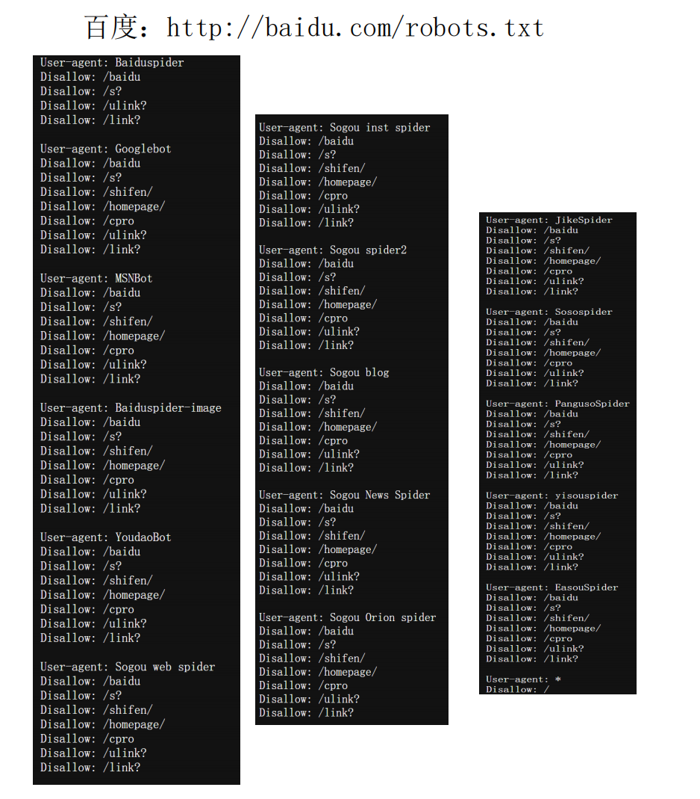
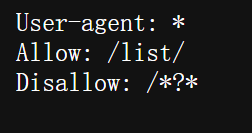
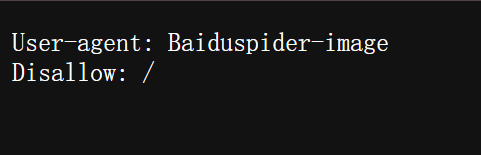

## 1. 百度



### 1.1 说明协议内容

#### **(1) User-agent 指令**

- `User-agent` 指定哪些爬虫适用该规则。
- 百度的 `robots.txt` 适用于 **多个爬虫**，包括：
    - `Baiduspider`（百度爬虫）
    - `Googlebot`（Google 爬虫）
    - `MSNBot`（微软必应爬虫）
    - `YoudaoBot`（有道爬虫）
    - `Sogou inst spider`（搜狗爬虫）
    - `JikeSpider`（即刻搜索爬虫）
    - `Soospider`（搜搜爬虫）
    - `Yisouspider`（易搜爬虫）
    - `EasouSpider`（宜搜爬虫）

------

#### **(2) Disallow 指令**

- ```
    Disallow
    ```

     用于 禁止爬虫访问某些路径，例如：

    ```bash
    Disallow: /baidu
    Disallow: /s?
    Disallow: /shifen/
    Disallow: /homepage/
    Disallow: /cpro
    Disallow: /ulink?
    Disallow: /link?
    ```

    - **`Disallow: /baidu`**
        → **禁止爬虫访问 `/baidu` 目录**
    - **`Disallow: /s?`**
        → **禁止爬虫访问 `/s?` 相关页面，通常是搜索结果页**
    - **`Disallow: /shifen/`**
        → **禁止爬虫访问 `/shifen/` 目录，可能是百度的某个产品**
    - **`Disallow: /homepage/`**
        → **禁止爬虫访问 `/homepage/` 目录**
    - **`Disallow: /cpro`**
        → **可能与百度广告系统相关，禁止爬取**
    - **`Disallow: /ulink?` 和 `Disallow: /link?`**
        → **禁止爬虫访问链接重定向、超链接处理相关的 URL**

------

#### **(3) 通用规则**

```makefile
User-agent: *
Disallow: /
```

- `User-agent: *` 适用于 **所有爬虫**（通配符 `*` 代表所有爬虫）。
- `Disallow: /` 表示 **禁止所有爬虫访问整个网站**。


### 1.2 URL

对于 `http://baidu.com/robots.txt`，可以分解为：

1. **协议（Scheme）：`http://`**
    - 这里的 **`http`（超文本传输协议，Hypertext Transfer Protocol）** 表示浏览器或爬虫访问百度服务器时使用的通信协议。
    - 如果是 `https://`，则表示使用 **安全超文本传输协议（HTTPS）**，支持加密传输。
2. **域名（Domain）：`baidu.com`**
    - 这是百度网站的主域名。
    - 域名是一个 **可读的地址**，用于定位互联网上的服务器，最终会解析为一个 **IP 地址**。
3. **路径（Path）：`/robots.txt`**
    - `robots.txt` 是一个标准文件，用于控制搜索引擎爬虫的访问权限。
    - `robots.txt` 放置在网站的根目录，搜索引擎会在访问网站时首先检查这个文件，以确定可以抓取哪些内容。


## 2. 淘宝



### 2.1 说明协议内容

#### **1. `User-agent: \*`**

- **`User-agent` 代表搜索引擎爬虫的名称**。
- **`\*`（星号）表示适用于所有爬虫**，包括 Googlebot、Baiduspider、Sogou Spider 等。

------

#### **2. `Allow: /list/`**

- **`Allow` 指令表示允许爬虫抓取某个路径**。

- ```
    /list/
    ```

     代表所有以 

    ```
    /list/
    ```

     开头的 URL 都可以被爬取，例如：

    ```arduino
    https://www.example.com/list/
    https://www.example.com/list/category1
    https://www.example.com/list/products
    ```

- 这意味着爬虫可以索引该网站的 **商品列表、分类页面或目录页**。

------

#### **3. `Disallow: /\*?\*`**

- **`Disallow` 指令表示禁止爬虫抓取某些路径**。

- ```
    /*?*
    ```

     的意思是：

    - `*` 代表 **通配符**，匹配 **任意字符**。
    - `?` 代表 **URL 中的查询参数**（通常用于搜索、筛选、分页等）。
    - `/*?*` 表示 **任何包含 `?` 的 URL 都禁止被爬取**。

##### **示例：禁止爬取的 URL**

以下 URL 都会被 **禁止爬取**，因为它们包含 `?`：

```bash
https://www.example.com/search?q=product
https://www.example.com/list?page=2
https://www.example.com/product?id=12345
https://www.example.com/list/?sort=price
```

这表明 **网站不希望爬虫抓取动态查询页面（如搜索结果、分页等），可能是为了避免爬取重复内容，减少服务器压力**。


### 2.2 URL

| 组成部分                | 具体内容      | 说明                                                       |
| ----------------------- | ------------- | ---------------------------------------------------------- |
| **协议（Scheme）**      | `https://`    | 采用 **HTTPS**，表示超文本传输安全协议，比 HTTP 更安全     |
| **子域名（Subdomain）** | `www`         | 代表 **淘宝的网页服务**，可省略（`taobao.com` 也能访问）   |
| **主域名（Domain）**    | `taobao`      | **淘宝的核心域名**，代表阿里巴巴旗下的电商平台             |
| **顶级域名（TLD）**     | `.com`        | **国际通用顶级域名（gTLD）**，适用于商业网站               |
| **路径（Path）**        | `/robots.txt` | **指定访问的资源**，此处是 `robots.txt` 文件，用于爬虫管理 |
| **端口（Port）**        | `443（默认）` | HTTPS 的默认端口（如果是 HTTP，则默认端口是 80）           |


## 3. 拼多多



### 3.1 说明协议内容

**`User-agent: Baiduspider-image`**

- `User-agent` 代表 **指定的搜索引擎爬虫**。
- `Baiduspider-image` 是 **百度图片爬虫**，专门用于抓取和索引图片资源，以便在百度图片（[image.baidu.com](https://image.baidu.com)）中展示。
- 这条规则只针对 **百度图片爬虫**，而不是百度的普通网页爬虫（`Baiduspider`）。

**`Disallow: /`**

- `Disallow` 用于 **禁止爬虫访问特定路径**。
- `/` 代表 **整个网站**，即 **禁止 Baiduspider-image 爬取网站的任何内容**。