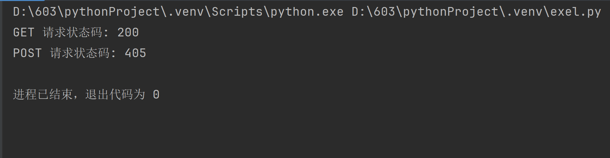

## Task 01

> 用 get 和 post 两种方式请求获取数据

### get


### post


### 疑难解惑

Q：为什么同一个网站，get方法能获取到数据，post不能，这说明了什么问题？

A：

- 目标 URL 可能只支持 `GET` 请求，而不支持 `POST` 请求。

- `POST` 请求通常需要传递数据（如表单数据、JSON 数据等），如果数据缺失或格式不正确，服务器会拒绝请求。

- `POST` 请求可能需要更高的权限或额外的身份验证（如 Token、API 密钥等），而 `GET` 请求可能不需要。

- `POST` 请求可能需要特定的请求头（如 `Content-Type`），而 `GET` 请求不需要。

    

调试代码：

```python
import requests

# GET 请求
get_url = "https://sherylmoonintaurus.com/get-endpoint"
get_response = requests.get(get_url)
print(f"GET 状态码: {get_response.status_code}")
print(f"GET 响应内容: {get_response.text}")

# POST 请求
post_url = "https://sherylmoonintaurus.com/post-endpoint"
data = {
    "key1": "value1",
    "key2": "value2"
}
headers = {
    "Content-Type": "application/json"
}
post_response = requests.post(post_url, json=data, headers=headers)
print(f"POST 状态码: {post_response.status_code}")
print(f"POST 响应内容: {post_response.text}")
```


可以看到，`get` 方法正常获取内容，`post` 方法因为没有权限而返回 405 错误。


## Task 02

> 查看响应状态码

Python 代码，查看网页响应状态码：

```python
import requests

def send_get_request(url):
    """
    发送 GET 请求并返回状态码
    """
    try:
        response = requests.get(url)
        return response.status_code
    except requests.exceptions.RequestException as e:
        return f"GET 请求出错: {e}"

def send_post_request(url, data=None):
    """
    发送 POST 请求并返回状态码
    """
    try:
        response = requests.post(url, data=data)
        return response.status_code
    except requests.exceptions.RequestException as e:
        return f"POST 请求出错: {e}"

# 示例 URL
get_url = "https://sherylmoonintaurus.com/zh/"
post_url = "https://sherylmoonintaurus.com/zh/post-endpoint"

# 发送 GET 请求
get_status_code = send_get_request(get_url)
print(f"GET 请求状态码: {get_status_code}")

# 发送 POST 请求
post_data = {
    "key1": "value1",
    "key2": "value2"
}
post_status_code = send_post_request(post_url, data=post_data)
print(f"POST 请求状态码: {post_status_code}")
```

响应结果：



- 2xx 4xx 分别表示：
    - 200 表示：请求成功；
    - 405 表示：服务器明确知道客户端使用的 HTTP 方法（如 `POST`），但该资源不允许使用此方法。例如，如果尝试对一个只支持 `GET` 请求的 URL 发送 `POST` 请求，服务器会返回 `405`。


## Task 03 

> 查看响应内容

### get

下面只展示响应内容的前30行。对应响应内容的 URL 是 Task 01、Task 02 代码中的 URL。

```html
<!doctype html>
<html lang="en-US" data-theme="light">
  <head>
    <meta charset="utf-8" />
    <meta name="viewport" content="width=device-width,initial-scale=1" />
    <meta name="generator" content="VuePress 2.0.0-rc.18" />
    <meta name="theme" content="VuePress Theme Hope 2.0.0-rc.59" />
    <style>
      :root {
        --vp-c-bg: #fff;
      }

      [data-theme="dark"] {
        --vp-c-bg: #1b1b1f;
      }

      html,
      body {
        background: var(--vp-c-bg);
      }
    </style>
    <script>
      const userMode = localStorage.getItem("vuepress-theme-hope-scheme");
      const systemDarkMode =
        window.matchMedia &&
        window.matchMedia("(prefers-color-scheme: dark)").matches;

      if (userMode === "dark" || (userMode !== "light" && systemDarkMode)) {
        document.documentElement.setAttribute("data-theme", "dark");
      }
```

### post

找一个能响应 `post` 请求的网站[PythonTutor]再试：

```python
import requests

# 目标URL
url = "https://pythontutor.com/"

# POST请求的数据（可以是表单数据或JSON数据）
data = {
    "key1": "value1",
    "key2": "value2"
}

# 发送POST请求
response = requests.post(url, data=data)

# 检查请求是否成功（状态码200表示成功）
if response.status_code == 200:
    # 输出服务器返回的内容
    print(response.text)
else:
    print(f"请求失败，状态码: {response.status_code}")
```

响应结果：

```html
D:\603\pythonProject\.venv\Scripts\python.exe D:\603\pythonProject\.venv\exel.py 
<!DOCTYPE html PUBLIC "-//W3C//DTD XHTML 1.0 Transitional//EN" "http://www.w3.org/TR/xhtml1/DTD/xhtml1-transitional.dtd">
<html xmlns="http://www.w3.org/1999/xhtml">

<!--
  Python Tutor: Copyright (C) Philip Guo
-->

<head>
  <title>Python Tutor - Python Online Compiler with Visual AI Help</title>
  <!-- 2024-10-01 -->
  <!-- <title>Online Python Tutor - visualize, debug, get AI help for Python, Java, C, C++, and JavaScript</title> -->

<meta http-equiv="Content-type" content="text/html; charset=UTF-8"/>

  <!-- let Webpack take care of everything -->
  <script type="text/javascript" src="build/index.bundle.js?e41b2a9920" charset="utf-8"></script>

<!-- insert google-analytics.txt contents here -->
<!-- Google tag (gtag.js) -->
<script async src="https://www.googletagmanager.com/gtag/js?id=G-ZQKWR5SQ3H"></script>
<script>
  window.dataLayer = window.dataLayer || [];
  function gtag(){dataLayer.push(arguments);}
  gtag('js', new Date());

  gtag('config', 'G-ZQKWR5SQ3H');
</script>

</head>

<body>

<div class="mainBodyPane">

<table class='layoutTbl'>
  <tr>
    <td>

<div class="activityPane" id="learnPane">

<h1><span id="learnHeading">
Online Compiler, AI Tutor, and Visual Debugger for Python, Java, C, C++, and JavaScript
</span>
</h1>

<p style="margin-top: 25px;">Python Tutor helps you do <b>programming homework assignments</b> in
Python, Java, C, C++, and JavaScript. It contains a step-by-step
<a href="visualize.html">visual debugger and AI tutor</a> to help you
understand and debug code.</p>

<div id="startLink">
Start coding online in <a href="python-compiler.html"><b>Python</b></a>, <a href="java.html"><b>Java</b></a>, <a href="c.html"><b>C</b></a>, <a href="cpp.html"><b>C++</b></a>, and <a href="javascript.html"><b>JavaScript</b></a>
</div>

<p>Since 2010, <b>over 20 million people in more than 180 countries</b>
have used Python Tutor to visualize over 300 million pieces of code. It
is the most widely-used program visualization tool for CS education.</p>

<p>As a preview, here is a <a href="render.html#code=def%20listSum%28numbers%29%3A%0A%20%20if%20not%20numbers%3A%0A%20%20%20%20return%200%0A%20%20else%3A%0A%20%20%20%20%28f,%20rest%29%20%3D%20numbers%0A%20%20%20%20return%20f%20%2B%20listSum%28rest%29%0A%0AmyList%20%3D%20%281,%20%282,%20%283,%20None%29%29%29%0Atotal%20%3D%20listSum%28myList%29&cumulative=false&curInstr=10&heapPrimitives=nevernest&mode=display&origin=opt-frontend.js&py=3&rawInputLstJSON=%5B%5D&textReferences=false">small example</a> that visualizes recursion in Python:</p>

<div id="demoViz"></div>

<p>You can also ask an AI tutor for help in understanding your code and visualization:
<br/>
<a href="render.html#code=def%20listSum%28numbers%29%3A%0A%20%20if%20not%20numbers%3A%0A%20%20%20%20return%200%0A%20%20else%3A%0A%20%20%20%20%28f,%20rest%29%20%3D%20numbers%0A%20%20%20%20return%20f%20%2B%20listSum%28rest%29%0A%0AmyList%20%3D%20%281,%20%282,%20%283,%20None%29%29%29%0Atotal%20%3D%20listSum%28myList%29&cumulative=false&curInstr=10&heapPrimitives=nevernest&mode=display&origin=opt-frontend.js&py=3&rawInputLstJSON=%5B%5D&textReferences=false">
</img></a>

</p>

<p>Here are some examples of how this tool visualizes Java, C, and C++ code:

<ul>
  <li><a href="https://pythontutor.com/articles/java-visualizer.html">How the Python Tutor visualizer can help students in your Java programming courses</a></li>
  <li><a href="https://pythontutor.com/articles/c-cpp-visualizer.html">How the Python Tutor visualizer can help students in your C or C++ courses</a></li>
</ul>

</p>

    </td>
  </tr>
</table>

</div>

</body>
</html>


进程已结束，退出代码为 0
```


## Task 04

> 查看网页源代码，并解释三十行

### URL

网页：https://www.jd.com/


### 源代码

```html
<!DOCTYPE html>
<html>

<head>
    <meta charset="utf8" version='1'/>
    <title>京东(JD.COM)-正品低价、品质保障、配送及时、轻松购物！</title>
    <meta name="viewport" content="width=device-width, initial-scale=1.0, maximum-scale=1.0, user-scalable=yes"/>
    <meta name="description"
          content="京东JD.COM-专业的综合网上购物商城，为您提供正品低价的购物选择、优质便捷的服务体验。商品来自全球数十万品牌商家，囊括家电、手机、电脑、服装、居家、母婴、美妆、个护、食品、生鲜等丰富品类，满足各种购物需求。"/>
    <meta name="Keywords" content="网上购物,网上商城,家电,手机,电脑,服装,居家,母婴,美妆,个护,食品,生鲜,京东"/>
    <script type="text/javascript">
        window.point = {}
        window.point.start = new Date().getTime()
    </script>
    <link rel="dns-prefetch" href="//static.360buyimg.com"/>
    <link rel="dns-prefetch" href="//misc.360buyimg.com"/>
    <link rel="dns-prefetch" href="//img10.360buyimg.com"/>
    <link rel="dns-prefetch" href="//img11.360buyimg.com"/>
    <link rel="dns-prefetch" href="//img12.360buyimg.com"/>
    <link rel="dns-prefetch" href="//img13.360buyimg.com"/>
    <link rel="dns-prefetch" href="//img14.360buyimg.com"/>
    <link rel="dns-prefetch" href="//img20.360buyimg.com"/>
    <link rel="dns-prefetch" href="//img30.360buyimg.com"/>
    <link rel="dns-prefetch" href="//d.3.cn"/>
    <link rel="dns-prefetch" href="//d.jd.com"/>
    <link rel="icon" href="//www.jd.com/favicon.ico" mce_href="//www.jd.com/favicon.ico" type="image/x-icon"/>
    <meta http-equiv="X-UA-Compatible" content="IE=edge,chrome=1"/>
    <meta name="renderer" content="webkit"/>
    
     <!--[if lte IE 6]>
    <script src="//misc.360buyimg.com/mtd/pc/index/home/ie6tip.min.js"></script>
    <![endif]-->
    <!--[if IE 8]>
    <script src="//misc.360buyimg.com/mtd/pc/index_2019/1.0.0/static/lib/polyfill/index.js"></script>
    <![endif]-->
```


### 解释

1. 第一行：声明文档类型为HTML5，告诉浏览器使用HTML5标准来解析页面。

2. `<html>` 是HTML文档的根元素，所有其他HTML元素都包含在这个标签内。

3. `<head>` 下面包含文档的元数据（metadata），如标题、字符编码、样式表链接、脚本等。这些内容不会直接显示在页面上。

4. `<meta charset="utf8" version='1'/>` 
    - 定义文档的字符编码为UTF-8，确保页面能正确显示各种语言的字符。
    - `version='1'` 是一个自定义属性，可能用于标识版本，但没有标准含义。

7. `<title>京东(JD.COM)-正品低价、品质保障、配送及时、轻松购物！</title>` 定义了网页的标题。

8. `<meta name="viewport" content="width=device-width, initial-scale=1.0, maximum-scale=1.0, user-scalable=yes"/>`

    - 控制页面在移动设备上的显示方式。

    - `width=device-width` 表示页面宽度与设备宽度一致，
    - `initial-scale=1.0` 表示初始缩放比例为1，
    - `maximum-scale=1.0` 表示最大缩放比例为1，
    - `user-scalable=yes` 表示允许用户缩放页面。

9. `<meta name="description" content="京东JD.COM-专业的综合网上购物商城，为您提供正品低价的购物选择、优质便捷的服务体验。商品来自全球数十万品牌商家，囊括家电、手机、电脑、服装、居家、母婴、美妆、个护、食品、生鲜等丰富品类，满足各种购物需求。"/>`
    - 提供页面的描述信息，通常用于搜索引擎显示在搜索结果中。

```html
    <script type="text/javascript">
        window.point = {}
        window.point.start = new Date().getTime()
    </script>
```

10. 定义了一个` JavaScript` 代码块。`window.point` 是一个全局对象，`window.point.start` 记录了页面加载开始的时间戳，可能用于性能监控。

```html
    </script>
    <link rel="dns-prefetch" href="//static.360buyimg.com"/>
    <link rel="dns-prefetch" href="//misc.360buyimg.com"/>
    <link rel="dns-prefetch" href="//img10.360buyimg.com"/>
    <link rel="dns-prefetch" href="//img11.360buyimg.com"/>
    <link rel="dns-prefetch" href="//img12.360buyimg.com"/>
    <link rel="dns-prefetch" href="//img13.360buyimg.com"/>
    <link rel="dns-prefetch" href="//img14.360buyimg.com"/>
    <link rel="dns-prefetch" href="//img20.360buyimg.com"/>
    <link rel="dns-prefetch" href="//img30.360buyimg.com"/>
    <link rel="dns-prefetch" href="//d.3.cn"/>
    <link rel="dns-prefetch" href="//d.jd.com"/>
```

11. 预解析定域名的DNS，以加快后续资源的加载速度。`static.360buyimg.com` 是京东的静态资源域名。后面所有的都是预解析定域名，预解析 `misc.360buyimg.com`  `img10.360buyimg.com`  …  `d.jd.com` 域名的 DNS。

12. `<link rel="icon" href="//www.jd.com/favicon.ico" mce_href="//www.jd.com/favicon.ico" type="image/x-icon"/>` 
    - 定义页面的图标（favicon），显示在浏览器标签页和书签中。

13. `<meta http-equiv="X-UA-Compatible" content="IE=edge,chrome=1"/>` 
    - 指示IE浏览器使用最新的渲染引擎（Edge模式）来渲染页面，`chrome=1` 表示如果安装了Google Chrome Frame插件，则使用Chrome内核渲染。

14. `<meta name="renderer" content="webkit"/>` 
    - 针对双核浏览器（如360浏览器），指示使用Webkit内核渲染页面。

```html
 <!--[if lte IE 6]>
    <script src="//misc.360buyimg.com/mtd/pc/index/home/ie6tip.min.js"></script>
    <![endif]-->
```

15. DeepSeek:
    - **`lte IE 6`**：`lte` 是 "less than or equal to" 的缩写，表示“小于或等于”。`IE 6` 是指 Internet Explorer 6。
    - **作用**：这段代码的意思是，如果用户使用的是 **IE 6 或更早版本** 的浏览器，则加载 `ie6tip.min.js` 脚本。
    - **目的**：通常是为了兼容性处理或提示用户升级浏览器。IE 6 是一个非常古老的浏览器，现代网页可能无法在其上正常运行，因此可能会通过这个脚本提示用户升级浏览器。

```html
<!--[if IE 8]>
    <script src="//misc.360buyimg.com/mtd/pc/index_2019/1.0.0/static/lib/polyfill/index.js"></script>
<![endif]-->
```

16. DeepSeek:
    - **`IE 8`**：表示 Internet Explorer 8。
    - **作用**：如果用户使用的是 **IE 8** 浏览器，则加载 `index.js` 脚本。
    - **目的**：IE 8 对一些现代 JavaScript 特性（如 ES5+）支持较差，因此通过加载 `polyfill` 脚本来填补这些功能的缺失，确保页面在 IE 8 上也能正常运行。
