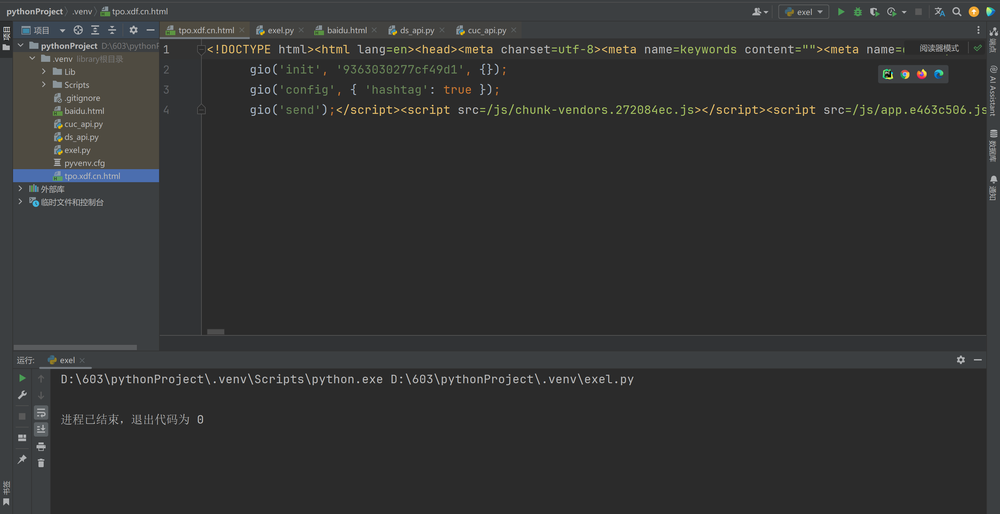
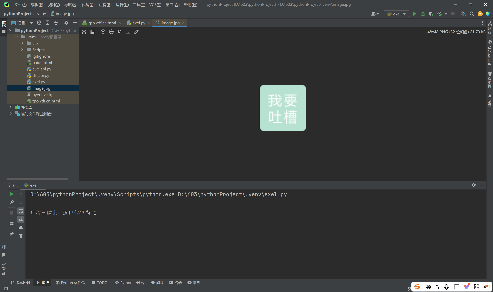
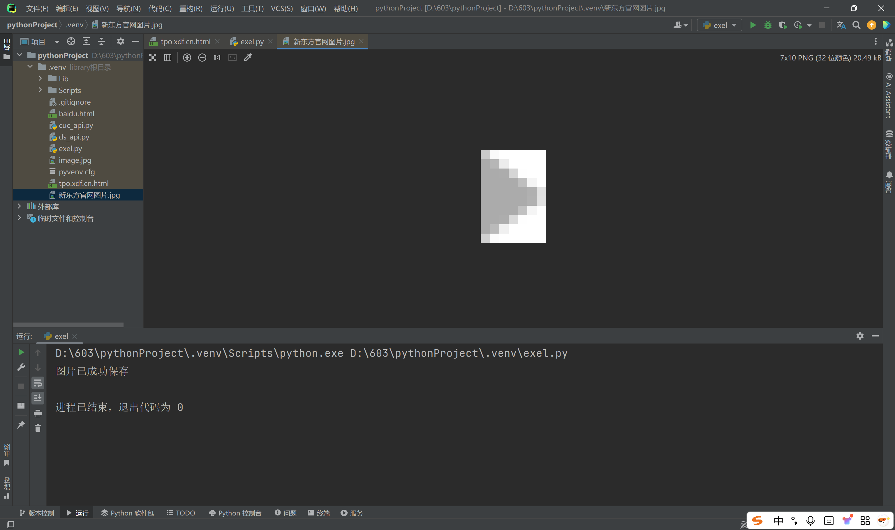
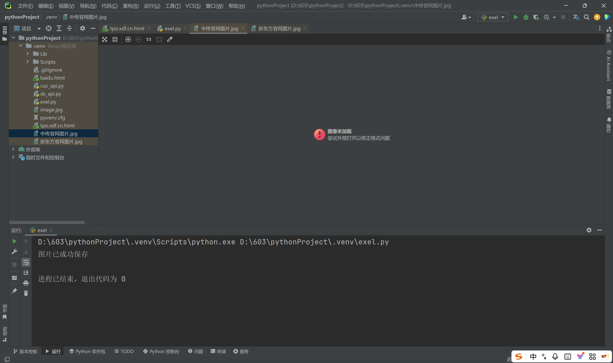

### Task 01

> 使用 response 获得响应的内容

#### 文本

```python
import requests

url = "https://tpo.xdf.cn/home"
response = requests.get(url)

response.encoding = response.apparent_encoding
with open ("tpo.xdf.cn.html", "w", encoding='utf-8') as fp:
    fp.write(response.text)
```

运行过后，同一个目录下出现了一个名为 `tpo.xdf.cn.html` 文本文件：




#### 图片

```python
import requests

url = "https://tpo.xdf.cn/img/feedback.84f8f8e3.png"


response = requests.get(url)
response.raise_for_status()

with open("image.jpg", "wb") as fp:
    fp.write(response.content)
```

运行过后，同一个目录下出现了一个名为 `image.jpg` 的图片文件




### Task 02

> 完成带参数和不带参数的两种 get 请求实例

#### 不带参数

```python
import requests

url = "https://tpo.xdf.cn/img/right_arrow.317c4432.png"

response = requests.get(url=url)
response.raise_for_status()

with open("新东方官网图片.jpg", "wb") as fp:
    fp.write(response.content)
print("图片已成功保存")
```

运行后，同一个目录下出现了一个名为 “新东方官网图片.jpg” 的图片文件。




#### 带参数


先选择 “Img” 按钮，搜索 “&” 因为带参数的图片多带这个字符 ，过滤之后，可以看到上面那个网站的网页并没有带参数的图片。

所以换一个网站：

```python
import requests


url = "https://by.cuc.edu.cn/_upload/tpl/02/d4/724/template724/style.css?v=1741058930364"


response = requests.get(url=url)
response.raise_for_status()


with open("中传官网图片.jpg", "wb") as fp:
    fp.write(response.content)
print("图片已成功保存")
```

运行后，同一个目录下出现了一个名为 “中传官网图片.jpg” 的图片文件。




再试一张图片：

```python
import requests


url = "https://by.cuc.edu.cn/_visitcount?siteId=5&type=1&columnId=7"


response = requests.get(url=url)
response.raise_for_status()


with open("中传官网图片01.jpg", "wb") as fp:
    fp.write(response.content)
print("图片已成功保存")
```

运行后，同一个目录下出现了一个名为 “中传官网图片01.jpg” 的图片文件。


还是无法加载，这是网站的问题吗？

有可能是：

1. 反爬虫机制。
2. 图片动态加载。
3. 参数错误或过期。
4. 权限问题。
5. URL 错误。
6. 服务器问题。
7. 网络问题