## Task 01

> 用大模型辅助了解判别动态网页和静态网页的方法，并简要总结

### 1. URL

- 静态网页以 `.html`或者`.htm`结尾，如：`https://top.zhan.com/toefl/listen/alltpo.html`

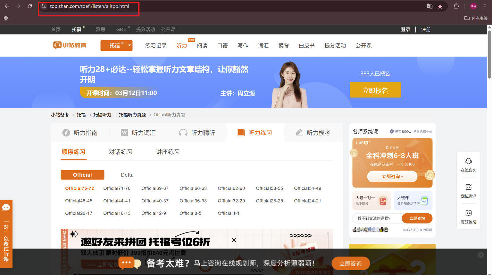

- 动态网页的URL通常带有参数，如 `https://www.ctrip.com/?allianceid=564348&sid=18845228`

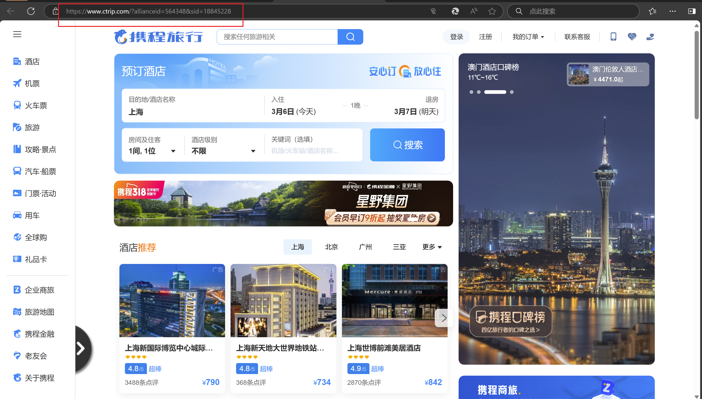

### 2. HTML 内容

- 静态网页的 HTML 内容是完整的。静态网页的内容固定，不会根据用户的操作或输入发生变化。

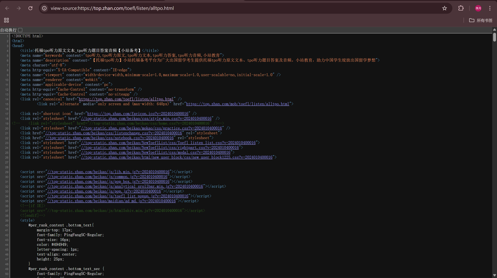

- 动态网页的源代码是动态生成。这就意味着，同一个 URL，右键查看源代码后，源代码内容却不一样，这是由于动态 HTML 网页代码是JavaScript或后端代码动态生成的。动态网页通常会根据用户操作（如搜索、登录、提交表单）返回不同的内容。如下图所示：

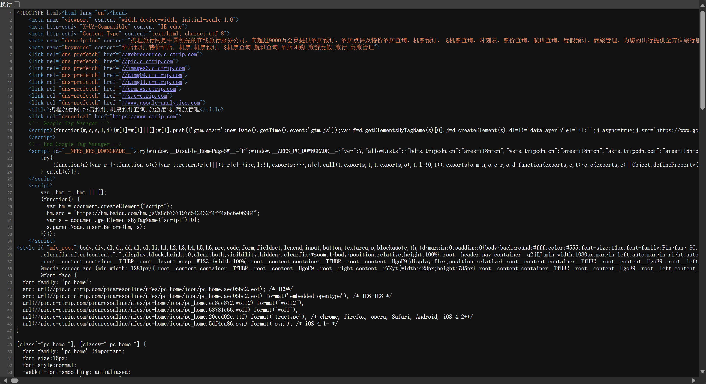

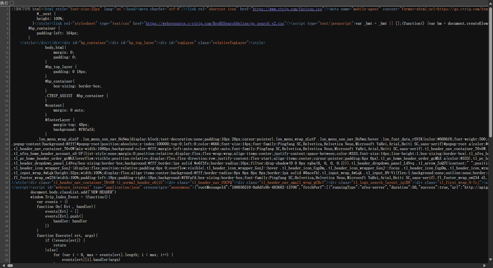


### 3. 尝试离线访问：

- 静态网页可以直接保存HTML文件并在本地打开，内容不会改变。
- 动态网页通常依赖服务器端数据和逻辑，离线打开时功能可能失效。

#### 验证静态网站

接下来我们来进行验证，依旧是使用上面两个 URL：

- 首先在静态网页上右键，选择另存为，桌面上出现文件夹：

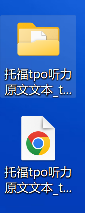

- 关闭网络，点开下面的后缀为 `.html` 的文件，看看能不能访问：

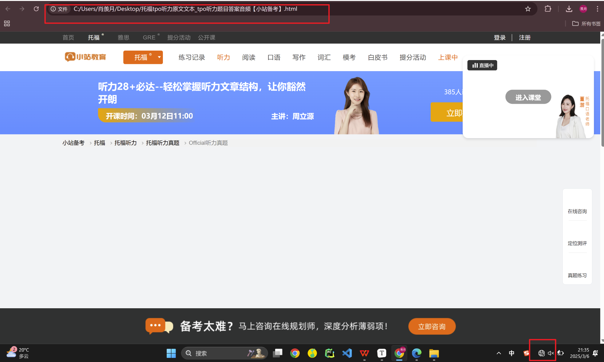

- 可以看到，网页可以正常打开，但是内容也有些显示不全，有可能是因为网站部分图片、CSS 样式、JavaScript 代码 托管在 CDN（内容分发网络）。

#### 验证动态网站

- 同样网页另存为：

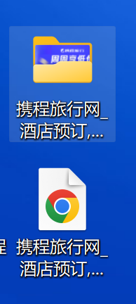

- 关闭网络，点击看看：

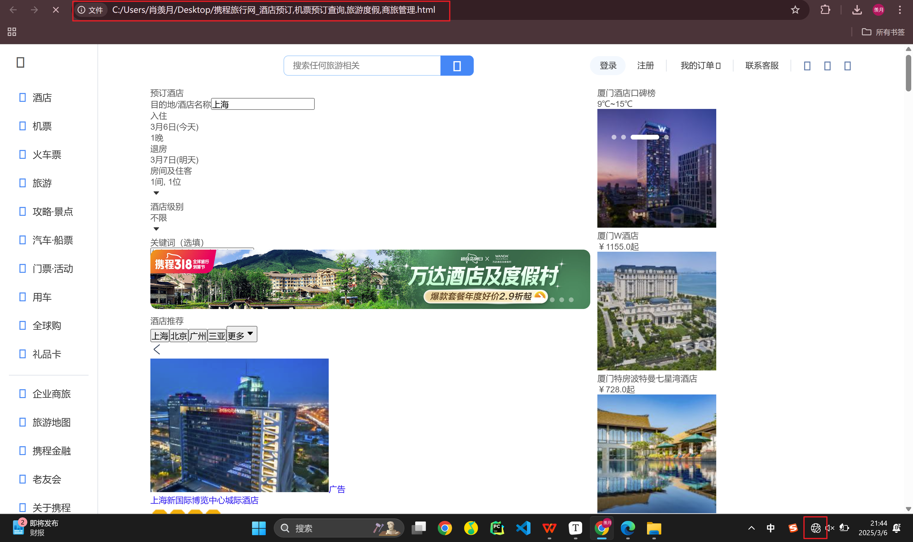

- 一些动态滑动的内容和弹窗不见了，但是保留了一定的静态内容，比如一些酒店推荐。

#### 总结

- 这种方法不太适用于判断网站是否静态，因为静态网站上可能也存在无法另存的内容，动态网站上可能也有静态内容，所以单独用这种方法不太可靠，还需结合其他方法判断。


## Task 02

### 获取动态加载内容

- 在开发者工具中，切换到 **Network** 选项卡。
- 确保勾选了 **XHR** 或 **Fetch** 过滤器，以便只显示动态加载的请求。

- 查找返回 JSON 数据的请求（通常以 `.json` 结尾，或响应头中包含 `Content-Type: application/json`）。

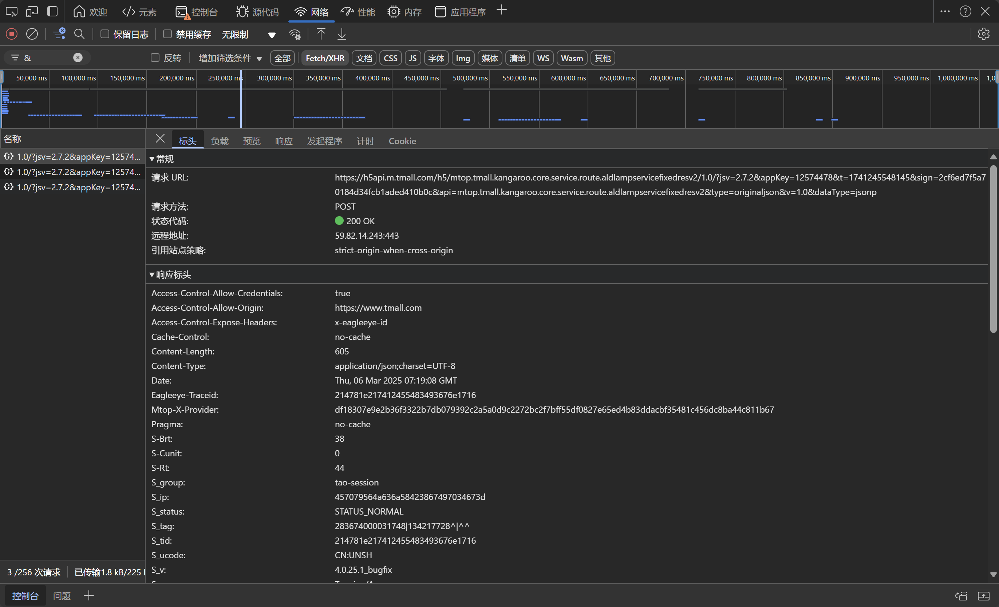

### 代码

天猫网页的URL

```python
import requests
import json

url = "https://h5api.m.tmall.com/h5/mtop.tmall.kangaroo.core.service.route.aldlampservicefixedresv2/1.0/?jsv=2.7.2&appKey=12574478&t=1741245548145&sign=2cf6ed7f5a70184d34fcb1aded410b0c&api=mtop.tmall.kangaroo.core.service.route.aldlampservicefixedresv2&type=originaljson&v=1.0&dataType=jsonp"

headers = {
    'User-Agent': 'Mozilla/5.0 (Windows NT 10.0; Win64; x64) AppleWebKit/537.36 (KHTML, like Gecko) Chrome/133.0.0.0 Safari/537.36 Edg/133.0.0.0'
}

response = requests.get(url, headers=headers)
# print(response.text)

if response.status_code == 200:
    try:
        data = response.json()

        with open("website_data.json", "w", encoding="utf-8") as file:
            json.dump(data, file, indent=4, ensure_ascii=False)

        print("JSON数据已成功保存到 website_data.json")

    except json.JSONDecodeError:
        print("响应内容不是JSON格式！")
else:
    print(f"请求失败，状态码：{response.status_code}")
```

### 结果

目录下出现了一个叫 `website_data.json`的文件：

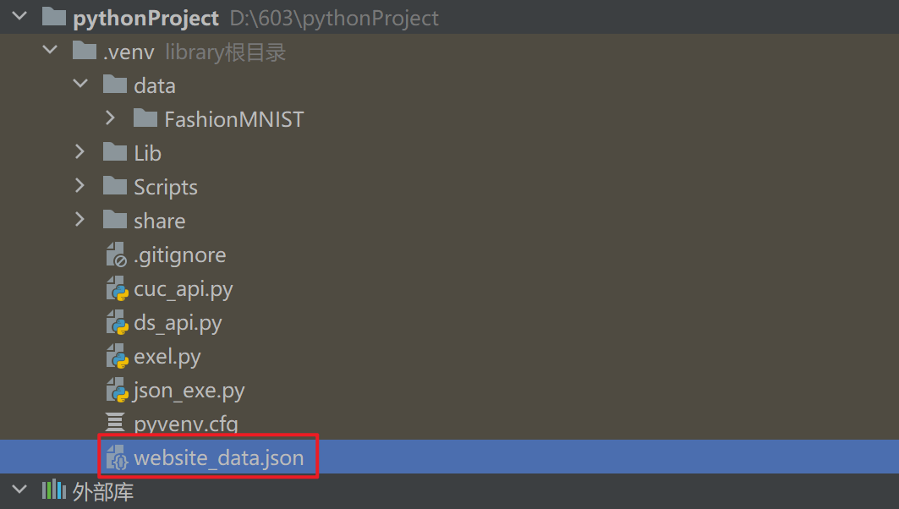

文件内容：

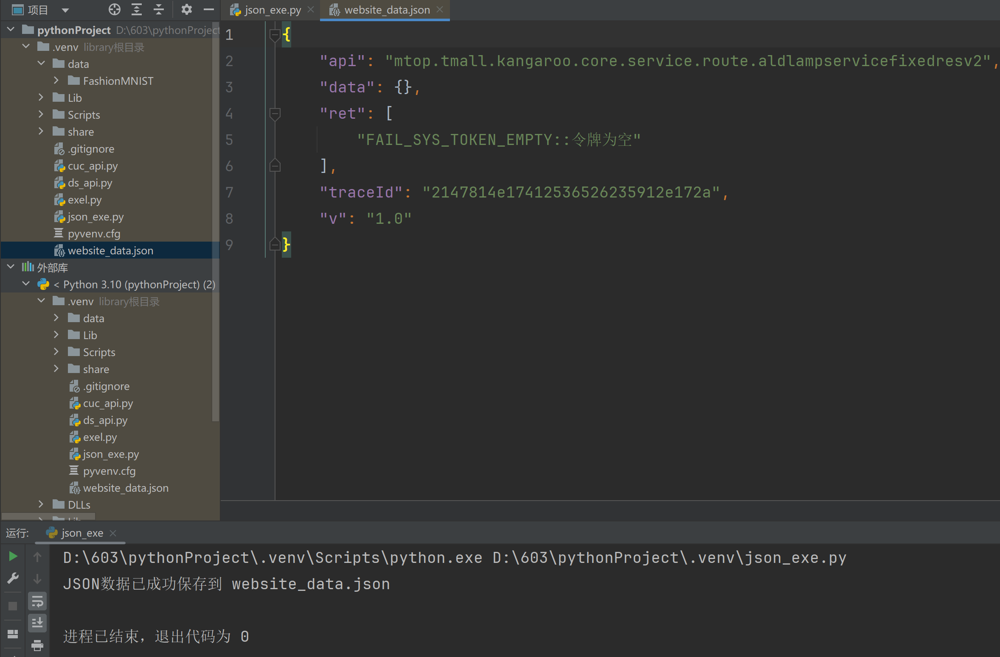


### 读取文件

```python
import json
with open("website_data.json", "r", encoding="utf-8") as file:
    loaded_data = json.load(file)
    print("从文件中读取的 JSON 数据：")
    print(json.dumps(loaded_data, indent=4, ensure_ascii=False))
```

运行结果：

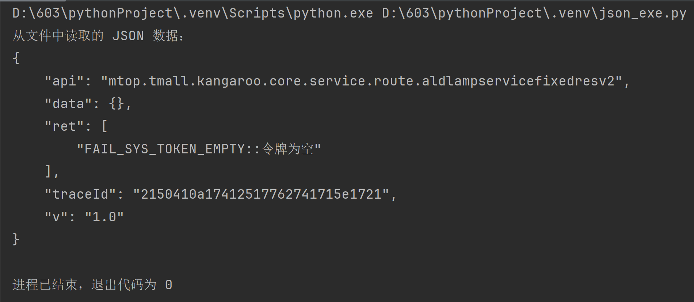

### 写文件

```python
import json

info = {
    'Name':"Json 中国",
    "url": "http://www.json.org.cn",
    "links":[
        {"name":"Google", 'url':'http://www.google.com'},
        {"name":"Facebook", 'url':'http://www.facebook.com'}
    ]
}

with open('website_data.json', 'w', encoding='utf-8') as fp:
    json.dump(info, fp, indent=4, ensure_ascii=False)
print("JSON 数据已成功写入 jsonfile.json")

with open('website_data.json', 'r', encoding='utf-8') as fp:
    loaded_data = json.load(fp)

print("从文件中读取的 JSON 数据：")
print(json.dumps(loaded_data, indent=4, ensure_ascii=False))
```

运行结果：

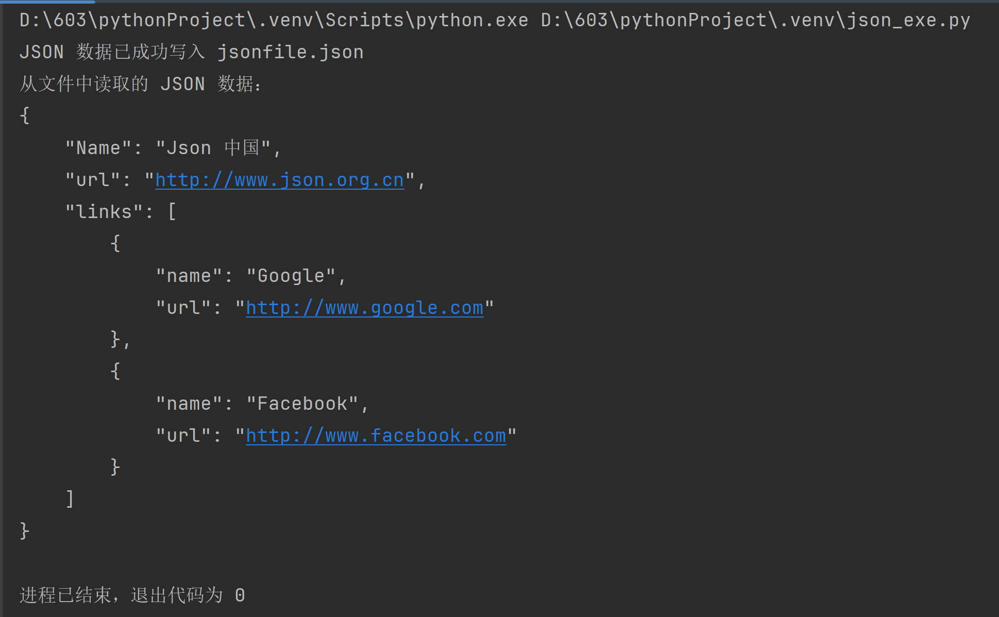

文件内容也改变：

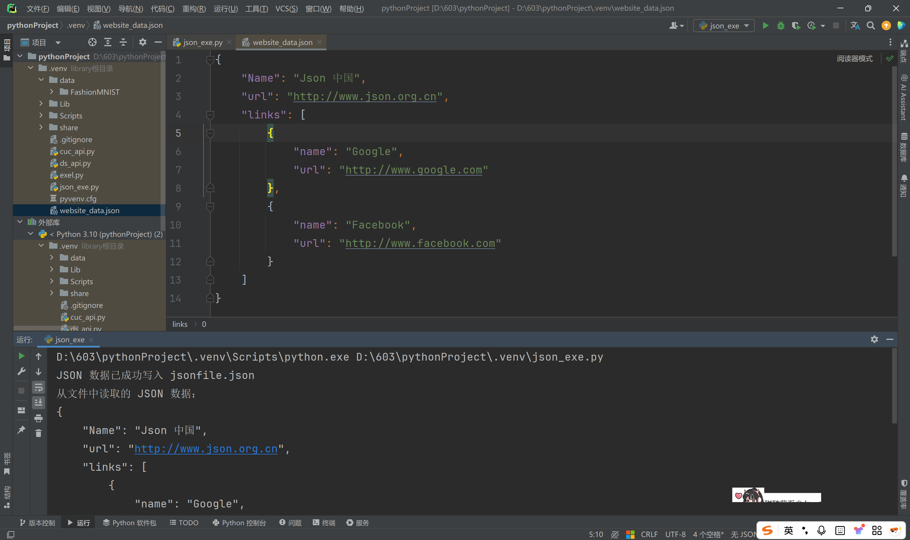