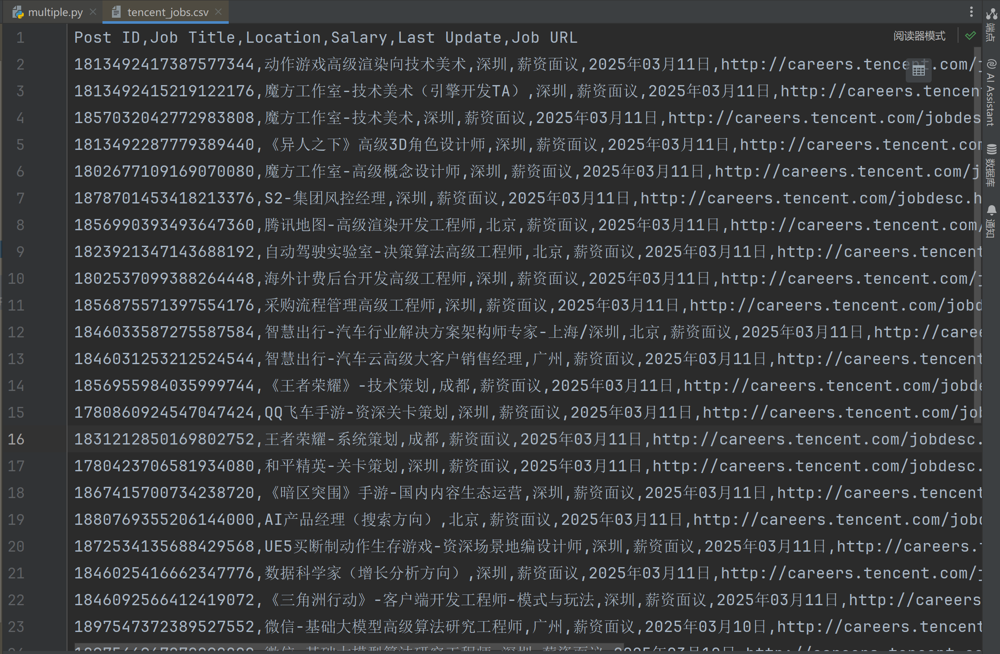

### Task 01

> Form data 和Request Payload两种格式的区别和特点

特性区别：

| 特性         | **Form Data**                                                | **Request Payload**                     |
| ------------ | ------------------------------------------------------------ | --------------------------------------- |
| **请求方式** | `application/x-www-form-urlencoded` 或 `multipart/form-data` | `application/json` 或 `application/xml` |
| **数据结构** | `key=value&key2=value2`                                      | 结构化 JSON/XML                         |
| **是否可读** | 人类可读，类似 URL 查询参数                                  | 需要 JSON/XML 解析                      |
| **适用于**   | HTML 表单、简单请求、文件上传                                | API 请求、大量数据、结构化数据          |
| **编码方式** | URL 编码                                                     | 直接以 JSON/XML 形式传输                |
| **文件上传** | 需要 `multipart/form-data`                                   | 需要 `base64` 编码或 `multipart`        |

使用区别：

-  **使用 Form Data**
    - 传统 HTML 表单提交
    - 需要兼容 `x-www-form-urlencoded`
    - 需要上传文件（`multipart/form-data`）

- **使用 Request Payload**
    - 调用 RESTful API
    - 发送复杂的 JSON 数据，如对象和数组
    - 需要良好的可读性和扩展性

前端开发中，如果与后端 API 交互，优先选择 JSON（Request Payload）；如果是 HTML 表单提交，则使用 Form Data！


### Task 02

#### 代码

```python
import requests
import csv
import time

# 需要爬取的网页
BASE_URL = "https://careers.tencent.com/tencentcareer/api/post/Query"

# 请求头
headers = {
    "User-Agent": "Mozilla/5.0 (Windows NT 10.0; Win64; x64) AppleWebKit/537.36 (KHTML, like Gecko) Chrome/85.0.4183.102 Safari/537.36"
}

# 存储爬取的数据
job_data = []

# 爬取前 3 页
for page in range(1, 4):
    params = {
        "pageIndex": page,
        "pageSize": "10",
        "language": "zh-cn",
        "area": "cn"
    }

    # 发送请求
    response = requests.get(BASE_URL, headers=headers, params=params)
    data = response.json()

    # 确保 JSON 结构正确
    if not data or "Data" not in data or "Posts" not in data["Data"]:
        print(f"无数据，跳过页数 {page}")
        continue

    # 遍历招聘信息
    for job in data["Data"]["Posts"]:
        job_id = job.get("PostId", "N/A")  # 职位 ID
        job_title = job.get("RecruitPostName", "N/A")  # 职位名称
        location = job.get("LocationName", "N/A")  # 工作地点
        salary = job.get("SalaryDescription", "薪资面议")  # 薪资
        last_update = job.get("LastUpdateTime", "N/A")  # 更新时间
        job_url = job.get("PostURL", "N/A")  # 详情页面

        job_data.append([job_id, job_title, location, salary, last_update, job_url])

    time.sleep(1)

# 保存数据到 CSV
csv_filename = "tencent_jobs.csv"
with open(csv_filename, "w", newline="", encoding="utf-8") as file:
    writer = csv.writer(file)
    writer.writerow(["Post ID", "Job Title", "Location", "Salary", "Last Update", "Job URL"])  # 表头
    writer.writerows(job_data)

print(f"爬取完成，数据已保存至 {csv_filename}")

```


#### .csv 文件


