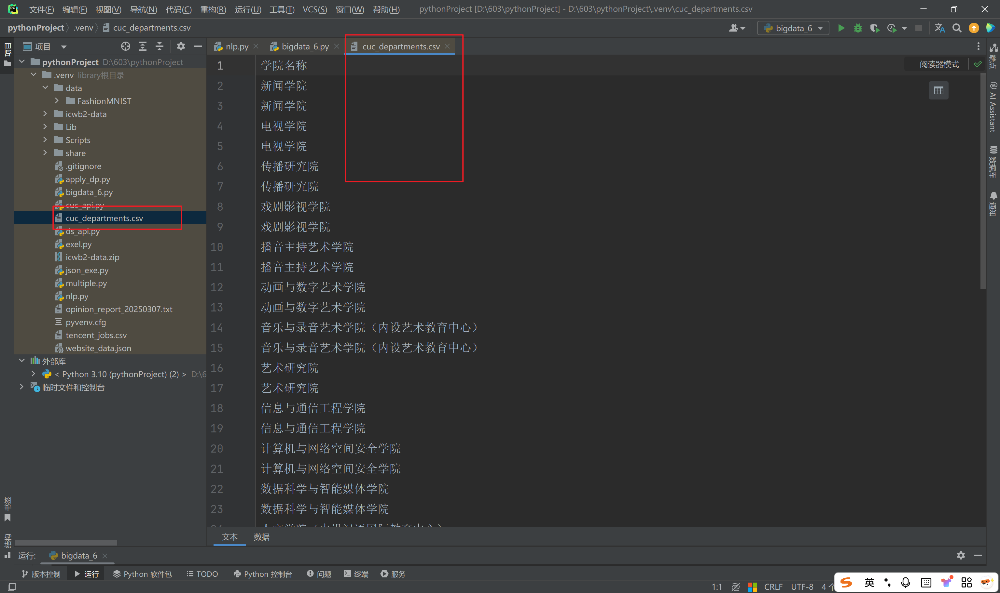
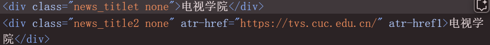
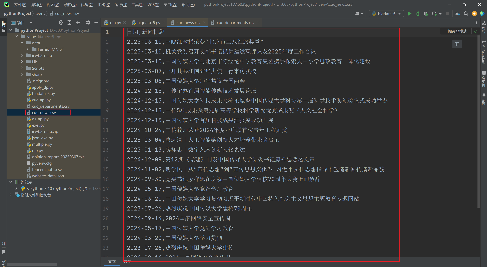

### Task 01

> 仿照课上讲解的例子，使用lxml库及Xpath实现对于中国传媒大学教学科研部门名称的爬取，

#### 代码

```python
import requests
from lxml import etree
import csv

url = "https://www.cuc.edu.cn/9996/list.htm"

headers = {
    "User-Agent": "Mozilla/5.0 (Windows NT 10.0; Win64; x64) AppleWebKit/537.36 (KHTML, like Gecko) Chrome/85.0.4183.102 Safari/537.36"
}

response = requests.get(url, headers=headers)
response.encoding = "utf-8"  

html = etree.HTML(response.text)

# 提取“教学科研单位”节点下的部门名称
departments = html.xpath('//li[@class="wp_sublist sublist-4"]//div[contains(@class, "news_title")]/text()')

print("中国传媒大学 教学科研部门名称:")
for dept in departments:
    print(dept)

# 将数据保存到 CSV 文件
if departments:  
    with open("cuc_departments.csv", "w", newline="", encoding="utf-8") as f:
        writer = csv.writer(f)
        writer.writerow(["学院名称"])  # 表头
        for dept in departments:
            writer.writerow([dept])

    print("数据已成功保存到 cuc_departments.csv")
else:
    print("没有提取到任何数据，请检查 XPath 表达式或网页结构。")
```

#### 结果

目录下出现文档：



每一个部门重复了两遍可能是因为：



上下两行的文本内容都被提取了。


### Task 02

> 仿照课上讲解的例子，使用lxml库及Xpath实现对于中国传媒大学网站新闻网页中的新闻标题和新闻时间的爬取，然后保存成CSV文件（https://www.cuc.edu.cn/news/1901/list.htm）

#### 代码

```python
import requests
from lxml import etree
import pandas as pd

url = "https://www.cuc.edu.cn/news/"

headers = {
    "User-Agent": "Mozilla/5.0 (Windows NT 10.0; Win64; x64) AppleWebKit/537.36 (KHTML, like Gecko) Chrome/133.0.0.0 Safari/537.36"
}

response = requests.get(url, headers=headers)
response.encoding = "utf-8" 

html = etree.HTML(response.text)

titles = html.xpath('//div[@class="news_title line2"]/text()')
dates = html.xpath('//div[@class="news_date"]/text()')

titles = [title.strip() for title in titles]
dates = [date.strip() for date in dates]

news_data = []
for title, date in zip(titles, dates):
    news_data.append([date, title])

df = pd.DataFrame(news_data, columns=["日期", "新闻标题"])

df.to_csv("cuc_news.csv", mode="w", index=False, encoding="utf-8-sig")
```

#### 运行结果


