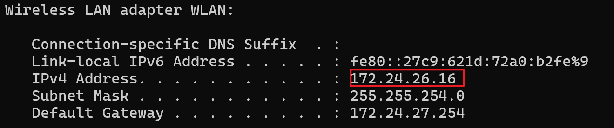
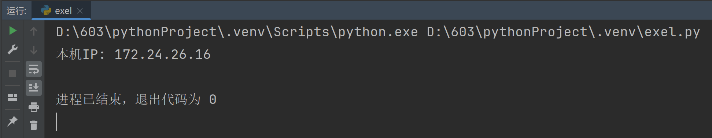
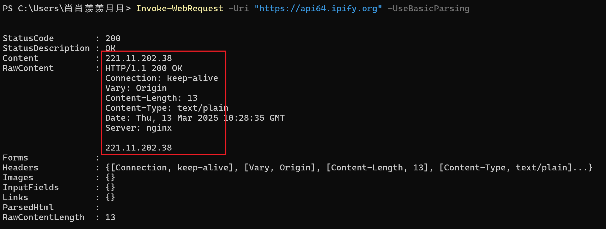
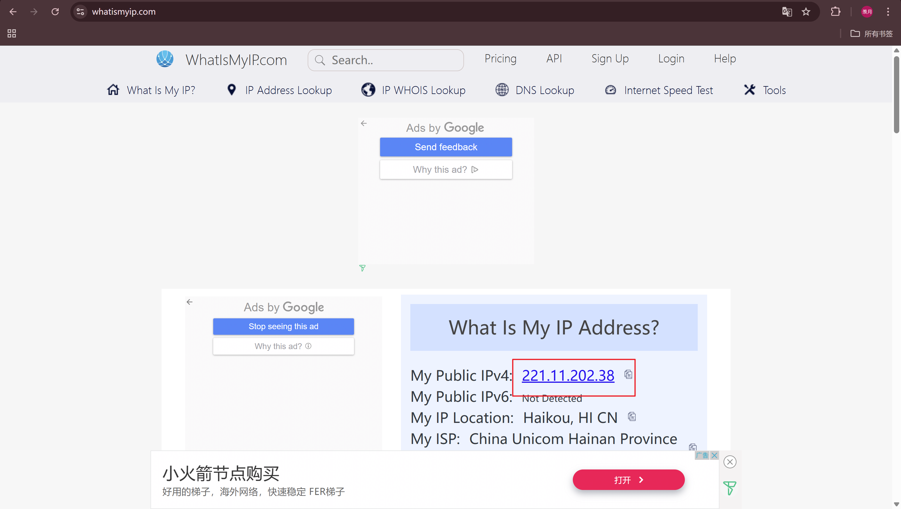
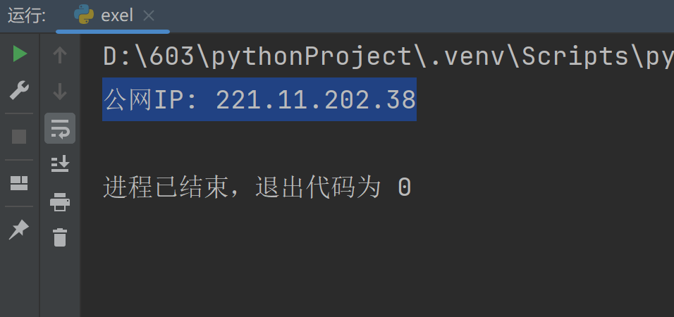
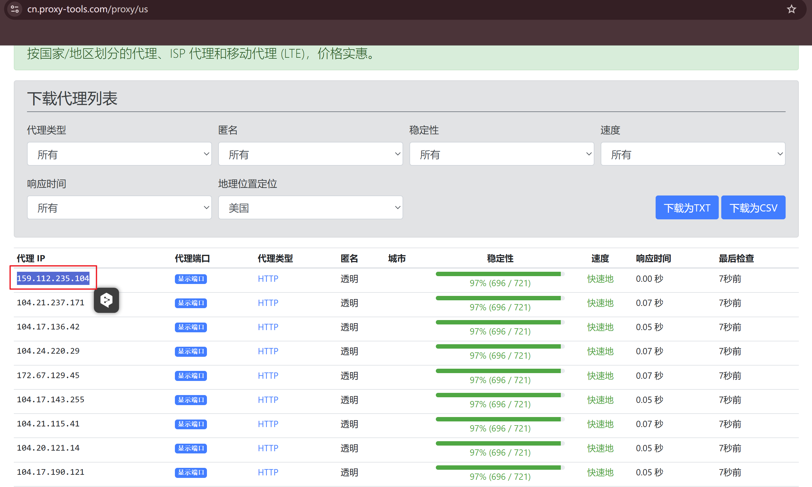
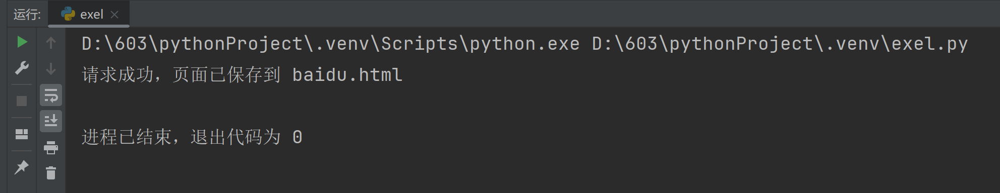
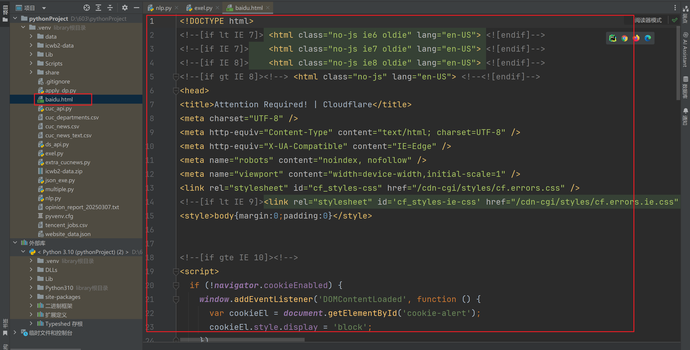
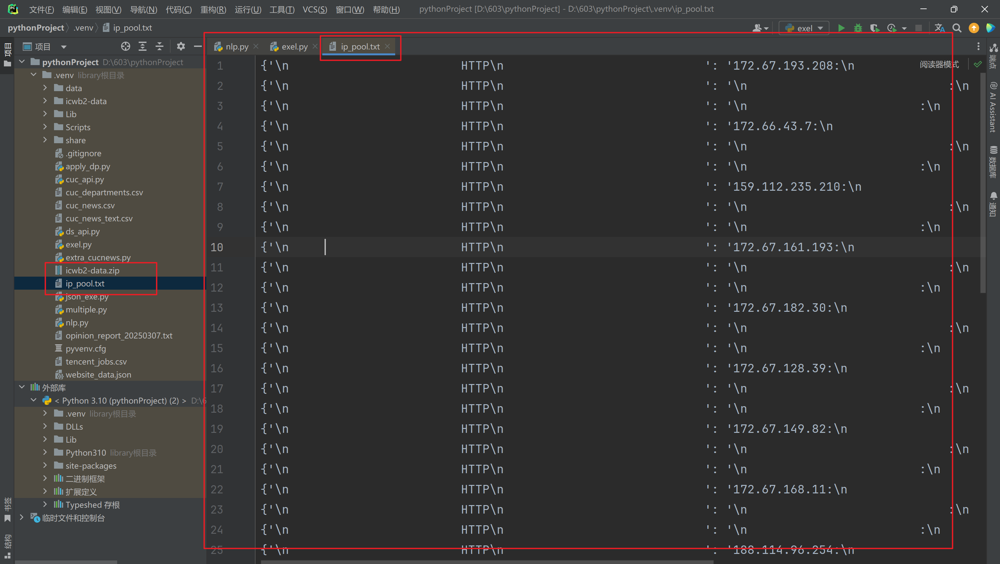

## Task 01

>  在大模型的指导下学习查询IP的各种方法

### 本地 ip

#### 方法一

> 使用命令提示符

```cmd
ipconfig
```



#### 方法二

```python
import socket
hostname = socket.gethostname()
local_ip = socket.gethostbyname(hostname)
print("本机IP:", local_ip)
```



### 公网 ip

#### 方法一

>  **Windows PowerShell**

```powershell
Invoke-WebRequest -Uri "https://api64.ipify.org" -UseBasicParsing
```



#### 方法二

> 可以直接访问以下网站，它们会显示公网IP：

- [https://www.whatismyip.com](https://www.whatismyip.com/)
- [https://ipinfo.io](https://ipinfo.io/)
- https://www.iplocation.net/
- https://ifconfig.me



#### 方法三

```python
import requests
ip = requests.get("https://api64.ipify.org").text
print("公网IP:", ip)
```



## Task 02

> 在网上找一个免费的IP代理并验证其效果

### 代理：



### 验证脚本：

```python
import requests

url = "http://www.baidu.com/s"

headers = {
    'User-Agent': 'Mozilla/5.0 (Windows NT 10.0; Win64; x64) AppleWebKit/537.36 (KHTML, like Gecko) Chrome/120.0.0.0 Safari/537.36'
}

proxies = {
    'http': '159.112.235.104',
    'https': '159.112.235.104'
}

try:
    response = requests.get(url=url, headers=headers, proxies=proxies, timeout=5)
    with open('baidu.html', 'w', encoding='utf-8') as fp:
        fp.write(response.text)
    print("请求成功，页面已保存到 baidu.html")
except requests.exceptions.RequestException as e:
    print(f"代理请求失败: {e}")
```

### 运行结果






## Task 03

> 尝试构建一个IP池

### 运行脚本

```python
import requests
from lxml import etree
import time
import random


# ========== 1. 解析网页，获取IP、端口、协议类型 ==========
def get_content(url):
    """ 解析网页，提取代理IP、端口、协议 """
    headers = {
        'User-Agent': 'Mozilla/5.0 (Windows NT 10.0; Win64; x64) AppleWebKit/537.36 (KHTML, like Gecko) Chrome/120.0.0.0 Safari/537.36'
    }

    try:
        response = requests.get(url, headers=headers, timeout=5)
        if response.status_code == 200:
            print(f"成功连接 {url}")
            html = etree.HTML(response.text)
            IP = html.xpath('//td[@class="text-monospace"]/text()')
            PORT = html.xpath('//td[@class="text-monospace"]/following-sibling::td[1]/text()')
            TYPE = html.xpath('//td[@class="text-primary"]/text()')
            return IP, PORT, TYPE
        else:
            print("请求失败，可能被反爬")
            return [], [], []
    except Exception as e:
        print(f"请求失败: {e}")
        return [], [], []


# ========== 2. 爬取多个页面的代理 ==========
def get_url(pages):
    """ 爬取多页代理数据 """
    diclist = []
    for i in range(1, pages + 1):
        try:
            print(f"正在爬取第 {i} 页...")
            url = f"https://cn.proxy-tools.com/proxy/us?page={i}"  # 目标网站
            IP, PORT, TYPE = get_content(url)  # 解析数据

            for j in range(len(IP)):
                dic = {TYPE[j]: f"{IP[j]}:{PORT[j]}"}  # 格式化为 {协议: "IP:端口"}
                diclist.append(dic)

            time.sleep(3)  # 防止访问频率过快被封
        except Exception as e:
            print(f"爬取失败: {e}")
    return diclist


# ========== 3. 检测代理IP的可用性 ==========
def check_ip(ip_list):
    """ 检测代理IP是否可用 """
    url = "https://www.baidu.com/"
    headers = {
        'User-Agent': 'Mozilla/5.0 (Windows NT 10.0; Win64; x64) AppleWebKit/537.36 (KHTML, like Gecko) Chrome/120.0.0.0 Safari/537.36'
    }

    can_use = []
    for proxy in ip_list:
        try:
            protocol, ip_port = list(proxy.items())[0]  # 获取协议和IP:端口
            proxies = {protocol.lower(): f"{protocol.lower()}://{ip_port}"}
            response = requests.get(url, headers=headers, proxies=proxies, timeout=3)

            if response.status_code == 200:
                can_use.append(proxy)
                print(f"代理可用: {proxies}")
            else:
                print(f"代理无效: {proxies}")
        except Exception:
            print(f"代理连接失败: {proxy}")

    return can_use


# ========== 4. 存储可用代理IP ==========
def save_ip(can_use):
    """ 存储可用代理IP到本地文件 """
    with open("ip_pool.txt", "w", encoding="utf-8") as f:
        for proxy in can_use:
            f.write(str(proxy) + "\n")
    print("有效代理IP已保存到 ip_pool.txt")


# ========== 5. 获取随机代理 ==========
def get_random_proxy():
    """ 从代理池中随机选取一个代理 """
    with open("ip_pool.txt", "r", encoding="utf-8") as f:
        proxies = [line.strip() for line in f.readlines()]

    if not proxies:
        print("没有可用代理，请检查代理池！")
        return None

    proxy = random.choice(proxies)  # 随机选一个代理
    protocol, ip_port = eval(proxy).popitem()  # 解析代理
    return {protocol.lower(): f"{protocol.lower()}://{ip_port}"}


# ========== 6. 运行代理池 ==========
if __name__ == "__main__":
    print("开始爬取代理IP...")
    proxy_list = get_url(3)  # 爬取3页代理数据
    print(f"共获取 {len(proxy_list)} 个代理")

    print("开始检测代理IP...")
    valid_ips = check_ip(proxy_list)  # 检测代理可用性
    print(f"共发现 {len(valid_ips)} 个可用代理")

    print("保存可用代理...")
    save_ip(valid_ips)  # 存储可用代理

    # 获取一个随机可用代理
    proxy = get_random_proxy()
    if proxy:
        print(f"随机选取的代理: {proxy}")
```


### 运行结果

```python
D:\603\pythonProject\.venv\Scripts\python.exe D:\603\pythonProject\.venv\exel.py 
开始爬取代理IP...
正在爬取第 1 页...
请求失败: HTTPSConnectionPool(host='cn.proxy-tools.com', port=443): Max retries exceeded with url: /proxy/us?page=1 (Caused by ConnectTimeoutError(<urllib3.connection.HTTPSConnection object at 0x0000025CBA7C02B0>, 'Connection to cn.proxy-tools.com timed out. (connect timeout=5)'))
正在爬取第 2 页...
成功连接 https://cn.proxy-tools.com/proxy/us?page=2
爬取失败: list index out of range
正在爬取第 3 页...
成功连接 https://cn.proxy-tools.com/proxy/us?page=3
爬取失败: list index out of range
共获取 50 个代理
开始检测代理IP...
代理可用: {'\n                        http\n                            ': '\n                        http\n                            ://172.67.193.208:\n                            '}
代理可用: {'\n                        http\n                            ': '\n                        http\n                            ://\n                            :\n                        '}
代理可用: {'\n                        http\n                            ': '\n                        http\n                            ://\n                        :\n                        HTTP\n                            '}
代理可用: {'\n                        http\n                            ': '\n                        http\n                            ://172.66.43.7:\n                            '}
代理可用: {'\n                        http\n                            ': '\n                        http\n                            ://\n                            :\n                        '}
代理可用: {'\n                        http\n                            ': '\n                        http\n                            ://\n                        :\n                        HTTP\n                            '}
代理可用: {'\n                        http\n                            ': '\n                        http\n                            ://159.112.235.210:\n                            '}
代理可用: {'\n                        http\n                            ': '\n                        http\n                            ://\n                            :\n                        '}
代理可用: {'\n                        http\n                            ': '\n                        http\n                            ://\n                        :\n                        HTTP\n                            '}
代理可用: {'\n                        http\n                            ': '\n                        http\n                            ://172.67.161.193:\n                            '}
代理可用: {'\n                        http\n                            ': '\n                        http\n                            ://\n                            :\n                        '}
代理可用: {'\n                        http\n                            ': '\n                        http\n                            ://\n                        :\n                        HTTP\n                            '}
代理可用: {'\n                        http\n                            ': '\n                        http\n                            ://172.67.182.30:\n                            '}
代理可用: {'\n                        http\n                            ': '\n                        http\n                            ://\n                            :\n                        '}
代理可用: {'\n                        http\n                            ': '\n                        http\n                            ://\n                        :\n                        HTTP\n                            '}
代理可用: {'\n                        http\n                            ': '\n                        http\n                            ://172.67.128.39:\n                            '}
代理可用: {'\n                        http\n                            ': '\n                        http\n                            ://\n                            :\n                        '}
代理可用: {'\n                        http\n                            ': '\n                        http\n                            ://\n                        :\n                        HTTP\n                            '}
代理可用: {'\n                        http\n                            ': '\n                        http\n                            ://172.67.149.82:\n                            '}
代理可用: {'\n                        http\n                            ': '\n                        http\n                            ://\n                            :\n                        '}
代理可用: {'\n                        http\n                            ': '\n                        http\n                            ://\n                        :\n                        HTTP\n                            '}
代理可用: {'\n                        http\n                            ': '\n                        http\n                            ://172.67.168.11:\n                            '}
代理可用: {'\n                        http\n                            ': '\n                        http\n                            ://\n                            :\n                        '}
代理可用: {'\n                        http\n                            ': '\n                        http\n                            ://\n                        :\n                        HTTP\n                            '}
代理可用: {'\n                        http\n                            ': '\n                        http\n                            ://188.114.96.254:\n                            '}
代理可用: {'\n                        http\n                            ': '\n                        http\n                            ://172.67.181.100:\n                            '}
代理可用: {'\n                        http\n                            ': '\n                        http\n                            ://\n                            :\n                        '}
代理可用: {'\n                        http\n                            ': '\n                        http\n                            ://\n                        :\n                        HTTP\n                            '}
代理可用: {'\n                        http\n                            ': '\n                        http\n                            ://104.26.2.171:\n                            '}
代理可用: {'\n                        http\n                            ': '\n                        http\n                            ://\n                            :\n                        '}
代理可用: {'\n                        http\n                            ': '\n                        http\n                            ://\n                        :\n                        HTTP\n                            '}
代理可用: {'\n                        http\n                            ': '\n                        http\n                            ://172.67.161.245:\n                            '}
代理可用: {'\n                        http\n                            ': '\n                        http\n                            ://\n                            :\n                        '}
代理可用: {'\n                        http\n                            ': '\n                        http\n                            ://\n                        :\n                        HTTP\n                            '}
代理可用: {'\n                        http\n                            ': '\n                        http\n                            ://172.67.184.97:\n                            '}
代理可用: {'\n                        http\n                            ': '\n                        http\n                            ://\n                            :\n                        '}
代理可用: {'\n                        http\n                            ': '\n                        http\n                            ://\n                        :\n                        HTTP\n                            '}
代理可用: {'\n                        http\n                            ': '\n                        http\n                            ://172.67.149.229:\n                            '}
代理可用: {'\n                        http\n                            ': '\n                        http\n                            ://\n                            :\n                        '}
代理可用: {'\n                        http\n                            ': '\n                        http\n                            ://\n                        :\n                        HTTP\n                            '}
代理可用: {'\n                        http\n                            ': '\n                        http\n                            ://34.111.135.19:\n                            '}
代理可用: {'\n                        http\n                            ': '\n                        http\n                            ://\n                            :\n                        '}
代理可用: {'\n                        http\n                            ': '\n                        http\n                            ://\n                        :\n                        HTTP\n                            '}
代理可用: {'\n                        http\n                            ': '\n                        http\n                            ://172.67.68.168:\n                            '}
代理可用: {'\n                        http\n                            ': '\n                        http\n                            ://\n                            :\n                        '}
代理可用: {'\n                        http\n                            ': '\n                        http\n                            ://\n                        :\n                        HTTP\n                            '}
代理可用: {'\n                        http\n                            ': '\n                        http\n                            ://172.67.151.120:\n                            '}
代理可用: {'\n                        http\n                            ': '\n                        http\n                            ://\n                            :\n                        '}
代理可用: {'\n                        http\n                            ': '\n                        http\n                            ://\n                        :\n                        HTTP\n                            '}
代理可用: {'\n                        http\n                            ': '\n                        http\n                            ://172.66.47.196:\n                            '}
共发现 50 个可用代理
保存可用代理...
有效代理IP已保存到 ip_pool.txt
随机选取的代理: {'\n                        http\n                            ': '\n                        http\n                            ://\n                        :\n                        HTTP\n                            '}

进程已结束，退出代码为 0
```

### 代理池

