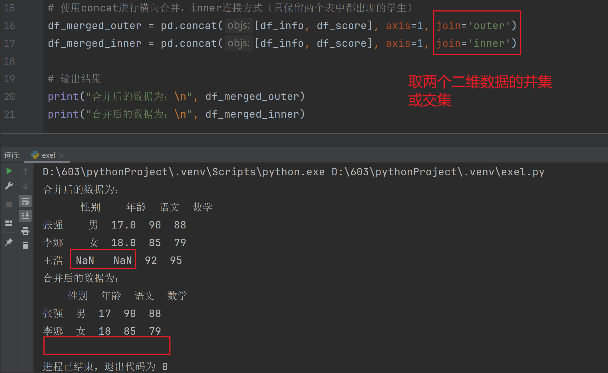
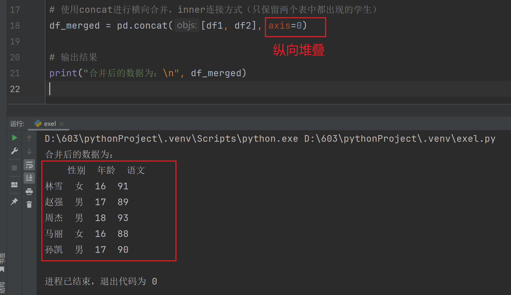
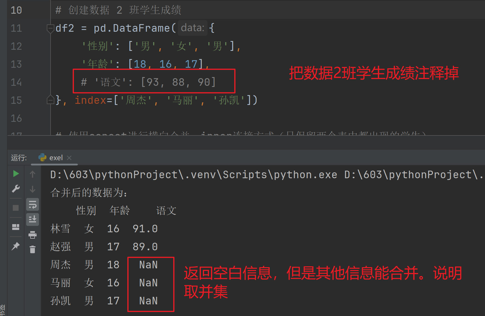
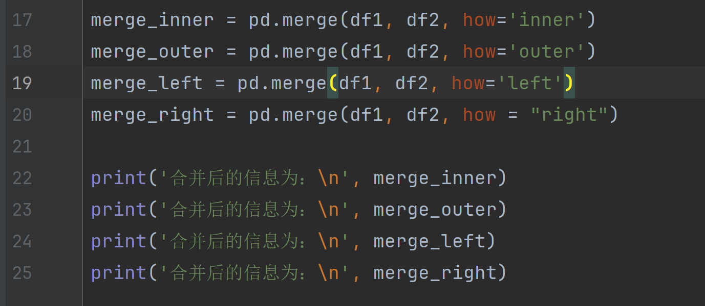
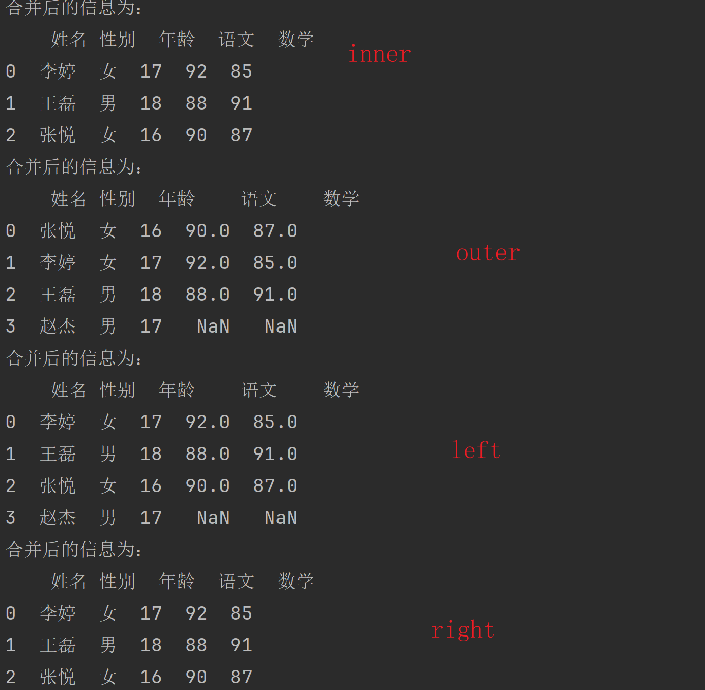
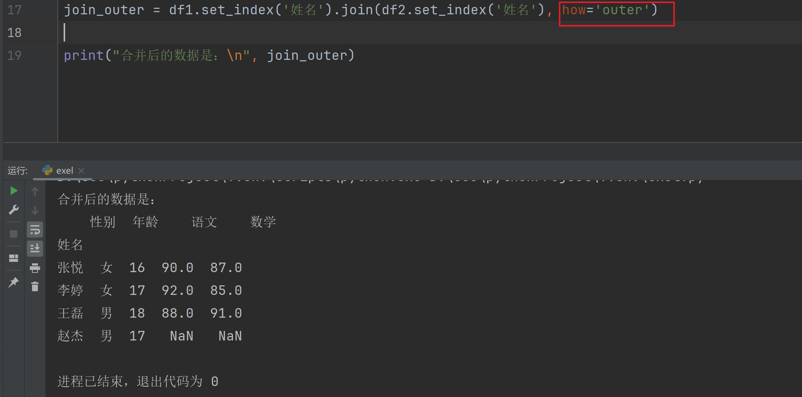
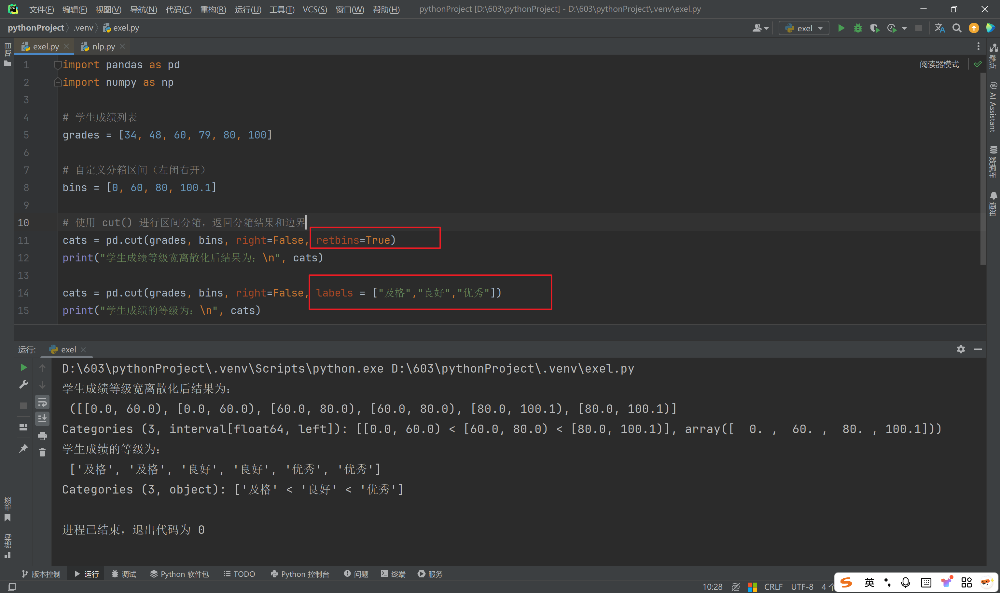
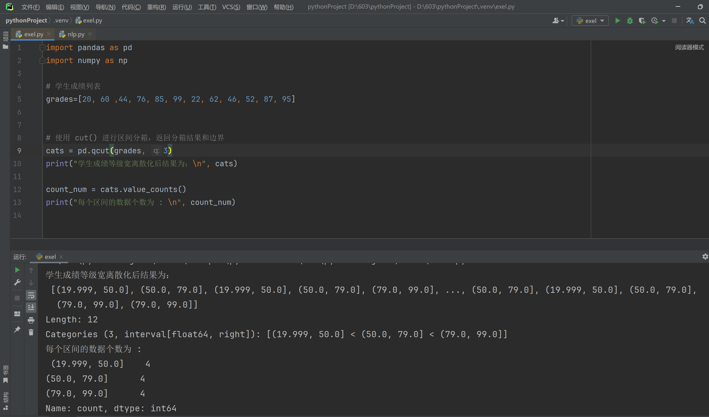
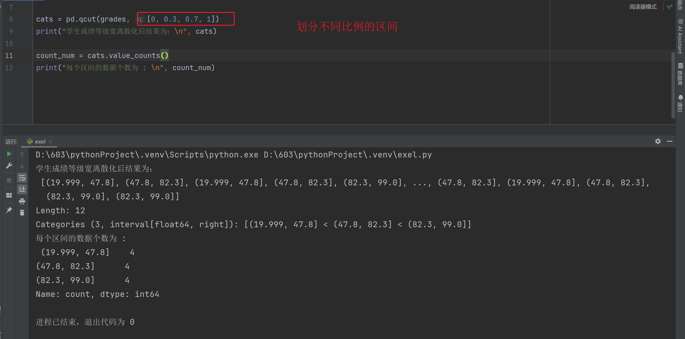

### Task 01

> 用concat(), merge(), join()结合各自具体的参数（axis, join, how)来完成数据的合并，

#### `concat()` 变化 `join`参数

##### 数据

```python
学生信息为：
    性别  年龄
张强  男  17
李娜  女  18
学生成绩为：
     语文  数学
张强  90  88
李娜  85  79
王浩  92  95
```

##### 运行结果



#### `concat()` 变化 `axis`

##### 数据

```python
D:\603\pythonProject\.venv\Scripts\python.exe D:\603\pythonProject\.venv\nlp.py 
数据 1 班学生成绩为：
    性别  年龄  语文
林雪  女  16  91
赵强  男  17  89
数据 2 班学生成绩为：
    性别  年龄  语文
周杰  男  18  93
马丽  女  16  88
孙凯  男  17  90

进程已结束，退出代码为 0
```

##### 运行结果






#### `merge()` 变化 `how`

##### 数据

```python
D:\603\pythonProject\.venv\Scripts\python.exe D:\603\pythonProject\.venv\nlp.py 
学生信息为：
    姓名 性别  年龄
0  李婷  女  17
1  王磊  男  18
2  张悦  女  16
3  赵杰  男  17
学生成绩为：
    姓名  语文  数学
0  李婷  92  85
1  王磊  88  91
2  张悦  90  87

进程已结束，退出代码为 0
```

##### 运行结果






#### `join()` 变化 `how` 

##### 数据

```python
D:\603\pythonProject\.venv\Scripts\python.exe D:\603\pythonProject\.venv\nlp.py 
学生信息为：
    姓名 性别  年龄
0  李婷  女  17
1  王磊  男  18
2  张悦  女  16
3  赵杰  男  17
学生成绩为：
    姓名  语文  数学
0  李婷  92  85
1  王磊  88  91
2  张悦  90  87

进程已结束，退出代码为 0
```

##### 运行结果




### Task 02

> 创建Series数据对象，定义转换函数，然后用 map() 完成数据转换

#### 代码

```python
import pandas as pd
import numpy as np

# 创建英文成绩的 Series
english_score = pd.Series(
    np.random.randint(0, 100, size=10),
    name='英语'
)

# 定义成绩等级映射函数
def map_grade(x):
    if x >= 90:
        return 'A'
    elif x >= 80:
        return 'B'
    elif x >= 60:
        return 'C'
    else:
        return 'D'

# 创建 DataFrame 并添加等级列
df = pd.DataFrame({
    '英语': english_score,
    '等级': english_score.map(map_grade)
})

# 打印结果
print(df)
```

#### 运行结果

```python
D:\603\pythonProject\.venv\Scripts\python.exe D:\603\pythonProject\.venv\exel.py 
   英语 等级
0  64  C
1  59  D
2  78  C
3  38  D
4  18  D
5  40  D
6  41  D
7  55  D
8  32  D
9  14  D

进程已结束，退出代码为 0
```


### Task 03

> 创建Series数据对象，用cut()方法完成指定宽度的离散化




### Task 04

> 创建Series数据对象，用qcut()完成指定分位数的离散化，并统计数据分布情况




