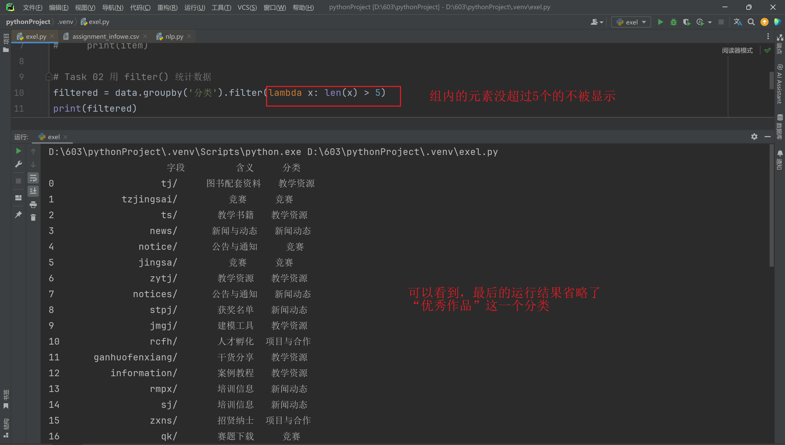
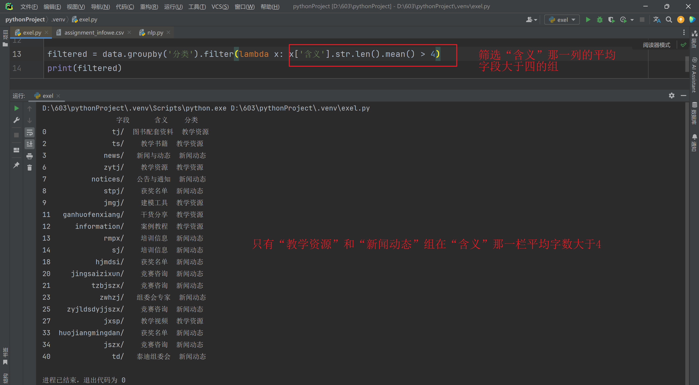
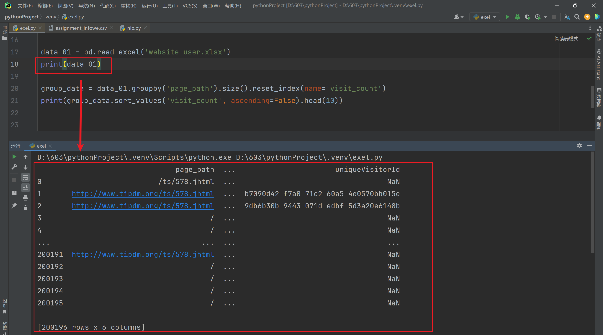
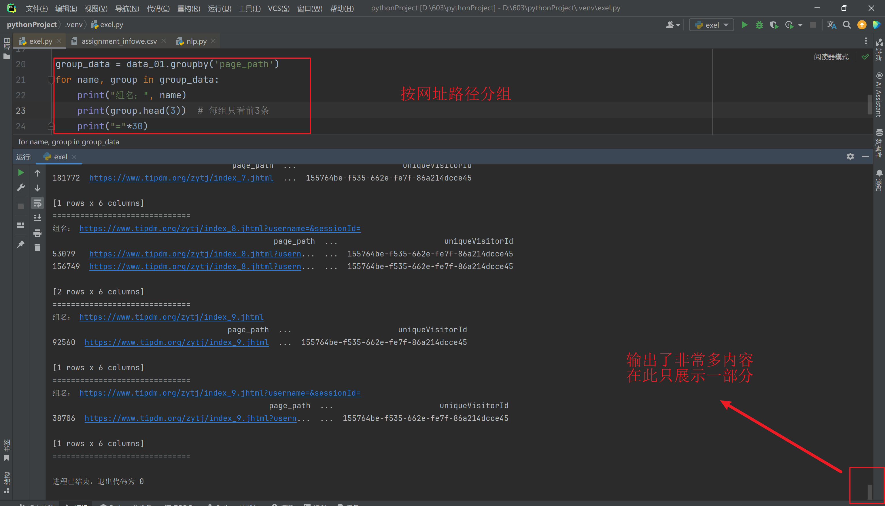
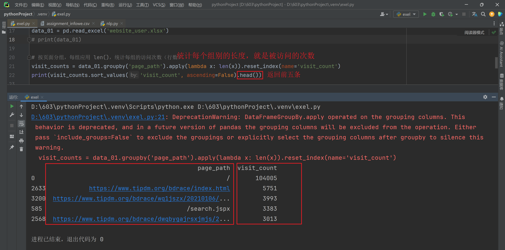
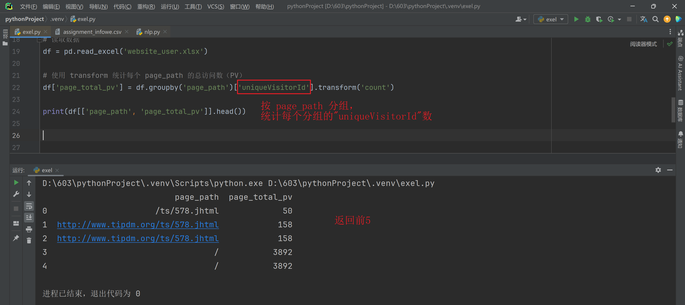

### Task 01

> 对网页相关信息.csv 进行分组,然后进行统计,filter()

#### 分类

```python
import pandas as pd
data = pd.read_csv('assignment_infowe.csv', encoding='gbk')

# Task 01 分组
group_data = data.groupby('分类')
for item in group_data:
    print(item)
```

运行结果：

```python
D:\603\pythonProject\.venv\Scripts\python.exe D:\603\pythonProject\.venv\exel.py 
('优秀作品',                字段    含义    分类
24  youxiuzuopin/  优秀作品  优秀作品
36    yxiuzuopin/  优秀作品  优秀作品
37          yxlw/  优秀作品  优秀作品)
('教学资源',                  字段      含义    分类
0               tj/  图书配套资料  教学资源
2               ts/    教学书籍  教学资源
6             zytj/    教学资源  教学资源
9             jmgj/    建模工具  教学资源
11  ganhuofenxiang/    干货分享  教学资源
12     information/    案例教程  教学资源
27            jxsp/    教学视频  教学资源)
('新闻动态',                   字段     含义    分类
3              news/  新闻与动态  新闻动态
7           notices/  公告与通知  新闻动态
8              stpj/   获奖名单  新闻动态
13             rmpx/   培训信息  新闻动态
14               sj/   培训信息  新闻动态
18           hjmdsi/   获奖名单  新闻动态
20     jingsaizixun/   竞赛咨询  新闻动态
21          tzbjszx/   竞赛咨询  新闻动态
23            zwhzj/  组委会专家  新闻动态
25    zyjldsdyjjszx/   竞赛咨询  新闻动态
33  huojiangmingdan/   获奖名单  新闻动态
34             jszx/   竞赛咨询  新闻动态
40               td/  泰迪组委会  新闻动态)
('竞赛',                      字段         含义  分类
1            tzjingsai/         竞赛  竞赛
4               notice/      公告与通知  竞赛
5               jingsa/         竞赛  竞赛
16                  qk/       赛题下载  竞赛
19          youxiuzuop/       优秀作品  竞赛
22          thirdtipdm/         竞赛  竞赛
26  jssyjssxjmkycxsjds/         竞赛  竞赛
35          firsttipdm/  第1届比赛优秀作品  竞赛
38         secondtipdm/  第4届比赛优秀作品  竞赛
39              saizhi/         赛制  竞赛
41               sjfxs/       赛前指导  竞赛
42           jljingsai/         竞赛  竞赛
43     dwqbygajrsxjmjs/         竞赛  竞赛)
('项目与合作',               字段    含义     分类
10         rcfh/  人才孵化  项目与合作
15         zxns/  招贤纳士  项目与合作
17         xmfh/  项目孵化  项目与合作
28         qyal/  企业应用  项目与合作
29         wjxq/  项目需求  项目与合作
30           fh/    孵化  项目与合作
31  peixunxinxi/  培训信息  项目与合作
32         kjxm/  创新科技  项目与合作)

进程已结束，退出代码为 0
```


#### 统计

##### 筛选出组内元素个数大于 5 的组



##### 筛选组内“含义”字段长度平均值大于 3 的组




### Task 02

> 对website_user.xlsx数据进行分组,然后使用apply() 和 transform()方法,方式自选(求和,求均值,求最值)

#### 分组

打印数据运行结果：



分组：



#### apply()




#### transform()



