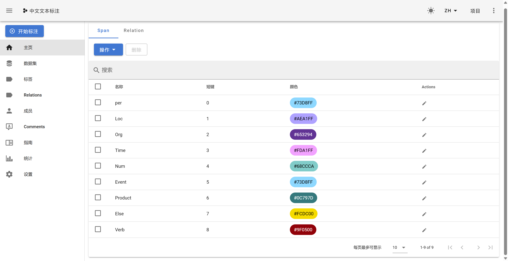

## Task 01

> 安装doccano文本标注工具（安装可以参考课件提供的信息，或自行搜索）

- **第一步：创建虚拟环境**

- **第二步：进入虚拟环境**

- **第三步：安装 doccano**

- **第四步：初始化 daccano**

- **第五步：创建管理员账号**

- **第六步：启动 Web 服务（WebServer）**

**运行成功**：

## Task 02

> 创建一个文本标注的项目，配置标注相关信息，完成文本的标注

- **项目**

- **上传数据集**：

这里文本文件上传不上去，改成了 JSONL 格式的。忘记截图了。后面可以看到只能导出 JSONL 格式的文件。

- **创建标签**

- **开始手动标注**

- 导出标注好的文件