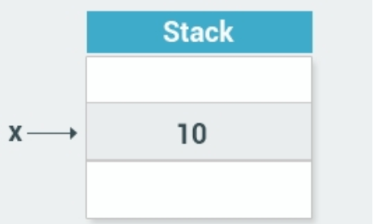
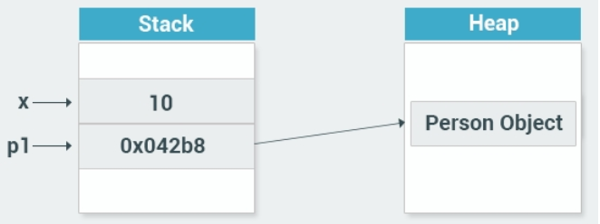

## 1. 类和对象

### 1.1 什么是类

正如我们在前面的模块中所看到的那样，内置的数据类型用于在声明的变量中存储单个值。例如，`int x` 在一个名为 x 的变量中存储一个整型值。

在面向对象的编程中，类是一种数据类型，它定义了一组声明对象的变量和方法。

例如，要创建管理银行帐户的程序，则可以使用 BankAccount 类声明一个对象，该对象具有管理各个银行帐户所需的所有属性和方法，如余额，存钱和取款的方法等。

一个类就像一个蓝图。它定义了一个类型的数据和行为。类定义以关键字 class 开头，后面跟着类名。类体包含花括号里面的数据和操作。如刚才提到的 BankAccount 类：

```cs
class BankAccount
{
  //变量,方法等
}
```

> 这个类为对象定义了一个数据类型，但它本身不是一个对象。 一个对象是一个基于类的具体实体，有时也被称为一个类的实例。

【单选题】要使用自定义数据类型，你需要定义：

A. 一个类

B. 一个变量

C. 一个方法

### 1.2 什么是对象

就像内置的数据类型用来声明多个变量一样，一个类可以用来声明多个对象。 就好像我们准备盖一个新建筑，建筑师会设计一个蓝图作为建筑的一个结构基础,但是同样的蓝图,其实可以用来建造多个相同的建筑物。

编程就是一个类似的方式工作。我们定义（设计）一个类就是创建对象的蓝图。

一旦我们写了一个类，我们就可以根据这个类创建对象。 创建一个对象称为实例化。

> 一个对象被称为类的一个实例。

【单选题】创建对象的过程被称为？

A. 创建

B. 分类

C. 对象

D. 实例化

### 1.3 对象的属性

每个对象都有自己的特性。正如我们人类一样,虽然大家结构一样，但是每个人却有自己的的名字，年龄和性别也不同，五官长相也有所区别。每个个体有自己的一套价值观，这些特性将人与人区分开来。

对象的特征被称为属性。

这些属性的值描述对象的当前状态。 例如，我们可以描述以一个 Person（Person 类的对象），30 岁，男性，并可以将其命名为张三。

对象的属性并不是固定的，例如，编程对象可以表示日期，时间或者表示一个银行账户。银行账户只是一个虚拟的账户，它不像汽车，电脑一样有个形体，你看不见摸不着，但它也是一个定义明确的对象，因为它有它自己的属性。

> 我们将在下面的章节中学习如何创建类和对象。学完以后，也许你会对类和对象有个更直观的认识。

【单选题】以下哪项决定了对象的当前状态？

A. 对象的名称

B. 类

C. 属性

## 2. 堆和栈

### 2.1 值类型

C# 有两种数据存储的方式：值类型(Value Types)和引用类型(Reference Type)。

内置的数据类型（如 int 和 double）用于声明值类型的变量。它们的值被存储在称为栈(stack)的内存中。

例如，声明值类型的赋值语句 `int x = 10` 可以被认为是：



变量 x 的值存储在堆栈中。

【填空题】内存中存储值类型的区域被称为：栈

### 2.2 引用类型

引用类型用于存储对象。例如,当你创建一个类的对象时,它就是被存储为一个引用类型。

引用类型存储在称为堆(heap)的内存中。

实例化对象时，该对象的数据存储在堆(heap)中，而其在堆上的内存地址存储在栈(stack)中。

这就是为什么它被称为引用类型 - 它包含一个引用（内存地址）到堆上的实际对象。



如图所示，Person 类型的 p1对象实际存储在堆(heap)中，栈(stack)中则存放 p1 在堆上的地址。

> 堆(heap)和栈(stack)的区别:
>
> - 栈(stack)：栈的存储空间由编译器自动分配释放，是一些较为固定大小的变量，比如我们使用的 int,dobule 等。
> - 堆(heap)：堆的存储空间一般是手动申请和释放的，一般用来存放一些需要额外大小的变量，比如对象这类未知大小的。

【单选题】堆和栈哪个用于存放未知大小的变量？

A. 堆

B. 栈

## 3. 实践：创建一个类

### 3.1 创建一个类

下面，让我们来创建一个类：

```cs
class Person
{
  int age;
  string name;
  public void SayHi()
  {
    Console.WriteLine("Hi");
  }
}
```

上面的代码声明了一个名为 Person 的类，它具有年龄和名称字段以及一个 SayHi 方法，用于向屏幕显示一个问候语。

您可以为类的字段和方法（也称为成员）添加访问的修饰符。访问修饰符是用于指定成员的可访问性的关键字。

public 关键字代表了该成员为公开成员，允许从类的外部访问，我们打算在类的外部访问 SayHi 方法，所以我们声明 SayHi 方法时，添加了 public 关键字。

> 你也可以将 class 成员指定为私有( private )或受保护的( protected )。这将在后面的课程中更详细地讨论。如果未定义访问修饰符，则默认情况下该成员是私有的，比如名称，年龄，我们未指定访问修饰符，所以他们是私有的。

【填空题】填空，创建一个名为 Car 的类：

```cs
___ Car
 ___
 string color;
 int year;
```

> class Car { string color; int year; }

### 3.2 实例化一个对象

刚才我们已经定义了一个 Person 类，现在我们可以在 Main 方法中实例化该类型的对象。

实例化一个 Person 对象并调用其 SayHi 方法：

```cs
class Person {
  int age;
  string name;
  public void SayHi() {
    Console.WriteLine("Hi");
  }
}
static void Main(string[] args)
{
  Person p1 = new Person();
  p1.SayHi();
}
//输出"Hi"
```

上面的代码声明了一个名为 p1 的 Person 对象，然后调用它公开的 `SayHi()` 方法。

> 注意调用对象里面方法的点(`.`)运算符了吗？调用对象的成员，使用点(`.`)运算符。

【填空题】填空，实例化一个 Car 对象，并调用其 `horn()` 方法：

```cs
Car c = ___ Car();
___ ();
```

> Car c = new Car(); c.horn();

### 3.3 对象属性的访问和赋值

你可以使用点运算符访问一个类的所有公开成员。

除了访问之外，还可以使用点运算符对对象的公开变量进行赋值。例如：

```cs
class Dog
{
  public string name;
  public int age;
}

static void Main(string[] args)
{
  Dog bob = new Dog();
  bob.name = "Bobby";
  bob.age = 3;
  
  Console.WriteLine(bob.age);
  //输出3
}
```

【填空题】填空，将 dog 对象的 age 设置为 7：

```cs
Dog d = new Dog();
___ age = ___;
```

> Dog d = new Dog(); d.age = 7 ;

## 4. 封装

### 4.1 封装

封装这个词在编程中的意思，更多是带有保护的意思。比如我们前面提到的银行账户类，我们会定义用户的余额，存款,和取款等各种方法,但是我们并不希望用户能直接修改余额这个变量，所以我们需要对这个类进行封装。

封装是通过使用访问修饰符来实现的。访问修饰符定义类成员的使用范围和可见性。

> 封装也称为信息隐藏。

【单选题】封装允许你：

A. 赋值给变量

B. 隐藏类实现的细节

C. 声明一个方法

### 4.2 访问修饰符

C# 支持以下访问修饰符： **public**, **private**, **protected**, **internal**, **protected internal**。

如前面的示例所示，Public 修饰符使成员可以从类的外部访问。

private 修饰符使得成员只能在 class 内部访问，对外部是隐藏。

> protected 将在后面解释

【单选题】哪一个不是 C# 中的访问修饰符？

A. private

B. internal

C. closed

D. protected

### 4.3 封装一个类

下面我们来封装之前创建的银行账户类：

```cs
class BankAccount
{
  private double balance=0;
  public void Deposit(double n)
  {
    balance += n;
  }
  public void Withdraw(double n)
  {
    balance -= n;
  }
  public double Withdraw()
  {
    return balance;
  }
}
```

我们对用户余额的字段 balance 使用了私有(private)访问修饰符，balance 将不能从外部直接访问，只能通过存款 `Deposit()` ，取款 `Withdraw()` 进行操作，以及查询 `Withdraw()` 进行访问。

这样做的目的是，是提高安全性。比如，我们可以在存取款的方法中添加各种身份和权限的验证,用户就不能随意修改个人的账户余额了。

> 封装的好处是：
>
> - 复用性更高。
> - 控制数据访问或修改的方式,提高安全性。
> - 部分代码的修改不会影响整体,减少了耦合度。

【填空题】填空，声明 Person 类，隐藏年龄成员，并使其可以通过 GetAge 方法访问

```cs
___ Person {
  private int age;
  ____ int GetAge() {
  ____ age;
  }
  public void SetAge(int n) {
    age = n;
  }
}
```

> class public return

## 5. 构造函数

### 5.1 构造函数

构造函数是类的特殊成员方法，在实例化该类的新对象时就会执行。

构造函数的名称和类名是完全一致的，是公开的，没有任何返回类型。例如：

```cs
class Person
{
  private int age;
  public Person()
  {
    Console.WriteLine("Hi there");
  }
}
```

下面，让我们来实例化该类：

```cs
static void Main(string[] args)
{
  Person p = new Person();
}
// 输出"Hi there"
```

构造函数在很多情况下都很有用的。例如，你在创建 BankAccount 类型的对象时，向所有者发送电子邮件通知。

当然，使用方法也可以实现相同的功能，但是构造函数的优点是可以自动调用。

【单选题】构造函数在什么时候被调用？

A. 不能被调用

B. 在我们手动调用的时候

C. 实例化的时候

### 5.2 带参数的构造函数

构造函数对于设置某些成员变量的初始值非常有用。

默认的构造函数没有参数。不过，如果有需要的话，是可以为构造函数添加参数的。这样就可以在创建对象时为其分配一个初始值，例如：

```cs
class Person
{
  private int age;
  private string name;
  public Person(string nm)
  {
    name = nm;
  }
  public string getName()
  {
    return name;
  }
}
static void Main(string[] args)
 {
  Person p = new Person("David");
  Console.WriteLine(p.getName());
}
//输出"David"
```

这样，我们在实例化一个对象的时候，就可以通过参数给对象一个初始值了。

> 通过使用不同数量的参数，构造函数可以像方法一样被重载。

【填空题】以下代码运行后最终输出的结果是：

```cs
class Dog
{
  public Dog()
  { Console.WriteLine(1); }

  public Dog(string name)
  { Console.WriteLine(name); }
}
static void Main(string[] args)
{
  Dog d = new Dog("2");
}
```

> 2

## 6. 属性

### 6.1 属性

正如我们在前面的课程中所看到的那样，封装一个类的成员并仅通过公开(public)的方法提供对它们的访问是一个好习惯。

属性是用来提供更灵活来操作某些字段的值成员。属性可以像使用公开(public)成员一样使用，但实际上它们包含称为访问器的特殊方法。

属性的访问器包含帮助获取（读取或计算）或设置（写入）对应字段的可执行语句。 访问器声明可以包含 get 访问器，set 访问器两种：

```cs
class Person
{
  private string name; //变量

  public string Name //访问器
  {
    get { return name; }
    set { name = value; }
  }
}
```

Person 类具有 Name 属性，该 Name 属性具有 set 和 get 访问器。

set 访问器用于为 name 变量赋值；  get 用于返回其值。

> value 是一个特殊的关键字，它表示我们使用 set 访问器分配给一个属性的值。
>
> 该属性的名称可以是任何你想要的，但是编码规定属性具有与大写字母相同的私有字段名称。

【多选题】以下哪些是属性的访问器？

A. undo

B. set✅

C. delete

D. get✅

### 6.2 属性的赋值和读取

一旦该属性被定义，我们可以使用它来对私有变量进行赋值和读取：

```cs
class Person
{
  private string name;
  public string Name
  {
    get { return name; }
    set { name = value; }
  }
}
static void Main(string[] args)
{
  Person p = new Person();
  p.Name = "Bob";
  Console.WriteLine(p.Name);
}
```

> 属性访问器的调用就跟访问其他公开成员一样，使用点(`.`) 运算符。

【填空题】填空，为年龄属性创建有效的访问器：

```cs
class Dog
{
  private int age;
  public int Age
  {
      ___ {___ age; }
    set { age = ___; }
  }
}
```

> get ; return ; value

### 6.3 属性的访问器

任何属性的访问者都可以省略。

例如，下面的代码创建一个只读的属性：

```cs
class Person
{
  private string name;
  public string Name
  {
    get { return name; }
  }
}
```

【单选题】跳过哪个访问器可以创建一个只读属性？

A. set

B. return

C. get

### 6.4 使用属性的好处

那么，为什么要使用属性？ 为什么不直接声明成员变量并直接访问呢？

通过属性，您可以选择控制访问变量的逻辑。

例如，您可以在将其分配给变量之前检查 age 的值是否大于 0：

```cs
class Person
{
  private int age=0;
  public int Age
  {
    get { return age; }
    set {
      if (value > 0)
        age = value;
    }
  }
}
```

你可以使用 get 和 set 访问器来创建任何自定义逻辑。

【填空题】填空，创建一个只读属性 x，访问器的返回值应该是 x 的平方。

```cs
class A {
  private int x=8;
  public int X {
      ___ { return x ___ x; }
  }
}
```

> get *

### 6.5 属性的自动创建

当你不需要任何自定义逻辑时，C# 提供了一种通过属性声明私有成员的快速而有效的机制。

例如，要创建只能通过 Name 属性的 get 和 set 访问器访问的私有成员，可以使用以下语法：

```cs
public string Name { get; set; }
```

正如你所看到的，你不需要单独声明私有字段 Name，它可以由属性自动创建。Name也被称为自动执行的属性。

我们可以使用自动属性重写前面示例中的代码：

```cs
class Person
{
  public string Name { get; set; }
}
static void Main(string[] args)
{
  Person p = new Person();
  p.Name = "Bob";
  Console.WriteLine(p.Name);
}
// 输出"Bob"
```

【填空题】填空,创建一个名为 Age 类型为 int 的自动属性。

```cs
class Dog
{
  public ___ Age { ___ set; }
}
```

> int ; get;

## 7. 模块四测验

1. 【单选题】一个类的对象存储在哪里？

A. stack(栈)

B. heap(堆)✅

C. property(属性)

2. 【填空题】实例化 Cat 类的一个对象，将值 12 传递给构造函数，然后调用该对象的 Meow 方法

```cs
Cat c = ___ Cat(___);
___Meow();
```

> new 12 c.

3. 【单选题】为了使类的成员可以被外部访问,你应该声明为该成员为：

A. void

B. public✅

C. private

4. 【单选题】下面描述,哪个是对的？

A. 一个对象是类的一个成员。

B. 一个对象是类的一个实例。✅

C. 一个对象是类的一个方法。

5. 【填空题】为 Student 类创建一个公开的方法 `Hello()` ,该方法在控制台显示"Hi”

```cs
___Student {
 ___ void Hello() {
    Console.WriteLine("hi");
  }
}
```

> class ; public

【填空题】声明一个具有一个参数的构造函数，并将参数赋值给 age

```cs
class Dog
{
  private int age;
  ___ Dog(___ val)
  { 
    age = ___;
  }
}
```

> public ; int ; val

【单选题】哪个访问器用来读取成员的值？

A. void

B. get✅

C. set

D. return


