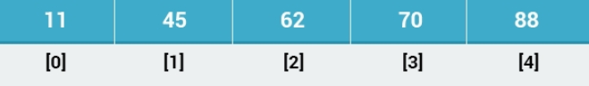
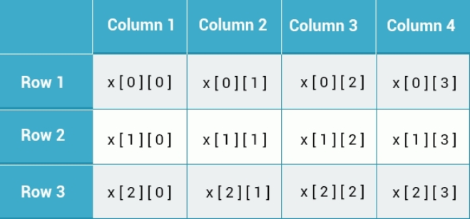

## 1. 数组

### 1.1 数组

C# 提供了许多内置的类来存储和操作数据。

数组(Array)就是其中的一种。

数组是一种用于存储数据集合的数据结构。你可以把它看作是一个同类型变量的集合。

例如，需要存储 100 个号码的情况，你可以考虑声明一个能存储 100 个元素的数组对象，而不是声明一百个变量。

数组的声明格式如下：`数字类型[] 数组名称`

```cs
int[ ] myArray;
```

这个语句声明了一个整型数组。由于数组是对象，我们需要用 new 关键字来实例化它们：

```cs
int[ ] myArray = new int[5]; 
```

实例化一个名为 myArray 的数组，其中 5 为数组的长度，可以存放 5 个整型的数值。

【填空题】实例化一个能存放 42 个 double 类型数值的数组：

```cs
_double__ [ ] a = __new_ double[_42__];
```

> double ; new ; 42

### 1.2 数组的索引

创建数组后，您可以使用索引的方式将值分配给数组：

```cs
int[ ] myArray = new int[5];
myArray[0] = 23;
```

这会将 23 分配给数组的第一个元素。

> C# 中数组的索引是从 0 开始的,即数组的第一个值索引号为 0，第二个值的索引号为 1，依此类推。

【填空题】数组第三个值的索引号是？「2」

### 1.3 数组的初始值

使用大括号声明时，我们可以向数组提供初始值，例如：

```cs
string[ ] names = new string[3] {"John", "Mary", "Jessica"};
double[ ] prices = new double[4] {3.6, 9.8, 6.4, 5.9};
```

但其实，在有设置初始值的数值时，我们可以省略数组的大小，上面的数组定义，也可以写成：

```cs
string[ ] names = new string[ ] {"John", "Mary", "Jessica"};
double[ ] prices = new double[ ] {3.6, 9.8, 6.4, 5.9};
```

甚至，可以省略实例化的关键字：

```cs
string[ ] names = {"John", "Mary", "Jessica"};
double[ ] prices = {3.6, 9.8, 6.4, 5.9};
```

【填空题】实例化一个带初始值的数组：

```cs
int[ ] a = __{_ 1, 2, 3 _}__;
```

> int[ ] a = {1, 2, 3} ;

### 1.4 通过索引访问数组

之前我们有提到过，数组中的每个元素都有一个索引号。

例如，我们来一下下面的数组：

```cs
int[ ] b = {11, 45, 62, 70, 88};
```

数组 b 有如下索引：



所以，当我们要访问 b 数组中的某个元素时，只要通过数组的索引号就能获取某个元素：

```cs
Console.WriteLine(b[2]);
//输出62

Console.WriteLine(b[3]);
//输出70
```

要注意的是，C# 的数组索引号是从 **0** 开始的。

【填空题】执行以下代码后 x 的值是？

```cs
int[ ] a = {4, 7, 2};
int x = a[0]+a[2];
//x = 6
```

## 2. 数组的遍历

### 2.1 数组的遍历

有时候,我们会需要对数组进行遍历，为数组赋值。使用循环，可以很方便的对数组进行遍历。

例如，可以声明一个由 10 个整数组成的数组，并用下面的循环为每个元素赋一个偶数值：

```cs
int[ ] a = new int[10];
for (int k = 0; k < 10; k++) {
  a[k] = k*2;
}
```

我们也可以使用循环来读取数组的值。

例如，我们可以显示刚刚创建的数组的内容：

```cs
for (int k = 0; k < 10; k++) {
  Console.WriteLine(a[k]);
}
```

变量 k 用于访问每个数组元素。数组中的最后一个索引是 9，所以 fo r循环条件是 `k <10` 。

【填空题】使用 for 循环打印数组全部元素

```cs
int[ ] arr = new int[7];
__for_(int k=0;k< __7_;k++) {
  Console.WriteLine(__arr_[k]);
}
```

> for ； 7 ；arr

题目·：编写一个 C# 程序，使用 for 循环遍历一个整数数组并计算该数组的所有元素的总和。

```c#
int[] numbers = { 1, 2, 3, 4, 5 };
int total = 0;
for (int i = 0;i < 5; i++)
{
    
    total+= numbers[i];   
}
Console.WriteLine(total);
```

### 2.2 foreach 遍历

foreach 循环提供了一种更简单的方法来对数组进行遍历。

例如前面数组我们也可以使用 foreach 循环来遍历：

```cs
foreach (int k in a) {
  Console.WriteLine(k);
}
```

foreach 循环遍历数组 a,并在循环的每次迭代中将当前元素的值赋给变量 k。因此，在第一次迭代中，`k = a [0]`，第二次 `k = a [1]`，以此类推。

> foreach 循环中，变量的数据类型应该匹配数组的类型。
>
> 关键字 var 也经常用作变量的类型，如：`foreach(var k in a)`。关于 var 关键词，我们会在后面的章节中进行阐述。

【填空题】创建一个有效的 foreach 循环，显示数组中所有的偶数元素。

```cs
int[ ] nums = {5, 2, 3, 4, 7};
_foreach__(var n __in_ nums) {
  if(n%2 == 0)
    Console.WriteLine(__n_);
}
```

> foreach in n

### 2.3 实践：使用循环计算数组总和

下面，让我们使用 foreach 循环来计算数组中所有元素的总和：

int[ ] arr = {11, 35, 62, 555, 989};

```c#
int[] arr = { 11, 35, 62, 555, 989 };
int total = 0;
foreach (int i in arr)
{
    total += i;
}
Console.WriteLine(total);
```

## 3. 多维数组

### 3.1 多维数组

一个数组可以有多个维度，声明方法如下：

```cs
type[, , … ,] arrayName = new type[size1, size2, …, sizeN];
```

例如，我们定义一个整型 3 行 4 列的二维数组：

```cs
int[ , ] x = new int[3,4];
```

可以将此数组可视化为由 3 行 4 列组成的表格：



【填空题】填空,实例化一个 8 行 8 列的二维数组：

```cs
int[_,_] chessBoard = _new__ int[8, __8_];
```

> int[ , ] chessBoard = new int[8, 8 ];

### 3.2 带初始值的多维数组

我们可以像使用一维数组一样在实例化多维数组时设置初始值。例如：

```cs
int[ , ] someNums = { {2, 3 }, {5, 6}, {4, 6} }; 
```

这将创建一个三行两列的数组。 嵌套大括号用于定义每行的值。

要访问数组的一个二维数组的元素，需要提供两个索引号。例如 `someNums[2, 0]` 将返回值 4，因为它访问第三行的第一列。

我们来创建一个程序，它将以表格的形式显示数组的值,这样更直观一点。

```cs
for (int k = 0; k < 3; k++) {
  for (int j = 0; j < 2; j++) {
    Console.Write(someNums[k, j]+" ");
  }
  Console.WriteLine();
}
```

我们使用了两个嵌套循环，一个循环遍历行，一个遍历列。

> 数组可以有任意数量的维度，但是要记住，三维以上的数组难于管理。

在C#中创建三维数组的基本语法如下：

```csharp
type[,,] arrayName = new type[x, y, z];
```

这里，`type` 是数组元素的数据类型，`arrayName` 是数组的名称，而 `x`, `y`, `z` 是数组各维度的长度。

例如，如果你想创建一个整型的三维数组，其中每个维度的大小分别为 4, 3 和 2，可以这样写：

```csharp
int[,,] myArray = new int[4, 3, 2];
```

这样定义后，`myArray` 就是一个三维数组，可以通过三个索引访问每个元素，例如 `myArray[0, 1, 1]` 来访问或修改元素。

你还可以在声明时直接初始化数组，如下所示：

```csharp
int[,,] myArray = new int[,,]
{
    {
        {1, 2},
        {3, 4},
        {5, 6}
    },
    {
        {7, 8},
        {9, 10},
        {11, 12}
    },
    {
        {13, 14},
        {15, 16},
        {17, 18}
    },
    {
        {19, 20},
        {21, 22},
        {23, 24}
    }
};
```

这种方式可以在创建数组的同时为每个元素指定一个初始值。

【填空】以下数组有几个维度？

```cs
int[ , , , ] arr; 四维
```

### 3.3 锯齿数组

锯齿数组是指元素为数组的数组。

以下是一个具有三个元素的单维数组的声明，每个元素是一个整型的一维数组：

```cs
int[ ][ ] jaggedArr = new int[3][ ];
```

因为该数组每个维度都是一个数组，所以你也可以像这样声明初始化数组：

```cs
int[ ][ ] jaggedArr = new int[ ][ ] 
{
  new int[ ] {1,8,2,7,9},
  new int[ ] {2,4,6},
  new int[ ] {33,42}
};
```

你可以通过索引号访问单个数组元素，如下面的示例所示:

```cs
int x = jaggedArr[2][1]; //42
```

这访问第三个数组的第二个元素。

> 锯齿数组是因为数组的元素也为数组,并且元素里面的数组的大小允许不相等，形状如同锯齿而得名。所以一个 `int [][]` 是一个`int []` 数组，每个数组的长度可以不同，并占用自己的内存块。
> 多维数组（`int [,]`）是一个单独的内存块（本质上是一个矩阵）。 每行的列总是相同的。

【填空题】声明包含 8 个二维数组的锯齿数组：

```cs
int[ ][,] a = new int[___][___];
```

> `int[ ][,] a = new int[ 8 ][ , ];`

## 4. 数组的属性

### 4.1 数组的属性

C# 中的 Array 类提供了使用数组的各种属性和方法。

例如，Length 和 Rank 属性分别返回元素的数量和数组的维数。你可以像使用任何类的成员一样使用点(`.`)运算符访问它们：

```cs
int[ ] arr = {2, 4, 7};
Console.WriteLine(arr.Length); 
//输出3

Console.WriteLine(arr.Rank); 
//输出1
```

Length 属性在需要遍历数组的时候是非常有用的，例如：

```cs
int[ ] arr = {2, 4, 7};
for(int k=0; k<arr.Length; k++) {
  Console.WriteLine(arr[k]);
}
```

【填空题】执行以下代码,最后输出的结果是？

```cs
int[ , , ] a = new int[2, 3, 4];
Console.Write(a.Rank);
```

> 3

当然，数组的属性远不止 **Length**  和 **Rank**，数组还有许多其他的属性，比如：

Max：返回最大值。

Min：返回最小值。

Sum：返回所有元素的总和。

```cs
int[ ] arr = { 2, 4, 7, 1};
Console.WriteLine(arr.Max());
//输出7

Console.WriteLine(arr.Min());
//输出1

Console.WriteLine(arr.Sum());
//输出14
```

> C# 还提供了一个静态 Array 类和其他方法。 你将在下一个模块中了解这些。

【填空题】执行以下代码,最后输出的结果是？

```cs
int[ ] a = {4, 6, 5, 2};
int x = a[0]+a.Min();
Console.Write(x);
//output 2
```

## 5. 字符串

将字符串(string)视为字符数组是很常见的。 实际上，C# 中的字符串是对象。

当你声明一个字符串变量时，你基本上是实例化一个 String 类型的对象。

字符串对象支持许多很有用的属性和方法：

- **Length:** 返回字符串的长度。

- **IndexOf(value):** 返回索引值在字符串中第一次出现的位置。

- **Insert(index, value):** 将值插字符串中的指定位置。

- **Remove(index):** 删除字符串中指定位置后面的所有字符。

- **Replace(oldValue, newValue):** 替换字符串中的指定值。

- **Substring(index, length):** 从指定的索引开始，返回指定长度的子串。 如果未指定长度，则该操作将持续到字符串的末尾。

- **Contains(value):**如果字符串包含指定的值，则返回 true。

以下示例演示了每个 String 成员：

```cs
string a = "some text";
Console.WriteLine(a.Length);
//输出9

Console.WriteLine(a.IndexOf('t'));
//输出5

 a = a.Insert(0, "This is ");
Console.WriteLine(a);
//输出"This is some text"

a = a.Replace("This is", "I am");
Console.WriteLine(a);
//输出"I am some text"

if(a.Contains("some"))
  Console.WriteLine("found");
//输出"found"

a = a.Remove(4);
Console.WriteLine(a);
//输出"I am"

a = a.Substring(2);
Console.WriteLine(a);
//输出"am"
```

你也可以通过索引号访问字符串中的字符，就像访问数组的元素一样：

```cs
string a = "some text";
Console.WriteLine(a[2]);
//输出"m"
```

> 字符串中的索引与数组类似，从 0 开始。

【填空题】执行以下代码,最后输出的结果是？

```cs
string s = "SoloLearn is awesome";
Console.Write(s.IndexOf('e'));
```

> 5

### 5.2 字符串的使用

让我们创建一个程序，它将接收一个字符串，然后用“cat”替换所有出现的单词“dog”，并仅输出第一个句子。

```cs
string text = "This is some text about a dog. The word dog appears in this text a number of times. This is the end.";

text = text.Replace("dog", "cat");
text = text.Substring(0, text.IndexOf(".")+1);

Console.WriteLine(text);
//输出: "This is some text about a cat."
```

> C# 提供了一些非常实用的属性和方法来处理和操作字符串。 例如，您可以使用这些方法轻松查找某本书中某个特定单词出现的次数。

【填空题】将字符串的最后一个字符赋值给变量 x

```cs
string s = "Hello";
char x;
x = _s__[s.Length-1 ]___;
```

## 6. 模块五测验

1. 【单选题】数组是

A. 值类型

B. 引用类型✅

C. 以上都不是

2. 【填空题】打印数组的所有元素

```cs
int[] arr = {0, 5, 3, 2, 1 };
foreach (int item _in__ arr) {
  Console.WriteLine(__item__);
}
```

> in item

3. 【填空题】执行以下代码，最后输出的结果是？

```cs
string s = "SoloLearn";
Console.Write(s[6]);
```

> a 下标从零开始

【单选题】以下数组可以存储多少个元素？

```cs
int[ , , ] array = new int[4, 5, 3];
```

A. 12

B. 60✅

C. 59

D. 4

【填空题】执行以下代码,最后输出的结果是？

```cs
string s = "SoloLearn";
int x = s.Length;
int y = s.IndexOf("e");
Console.Write(x%y);
```

> 4
