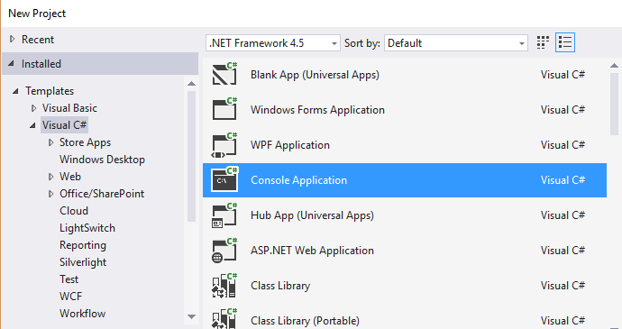
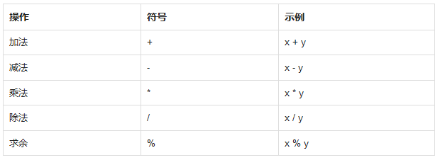

## 1. 什么是 C#

### 1.1 欢迎学习C#

C# 是一种优雅的面向对象语言，使开发人员能够构建在 `.NET Framework` 上运行的各种安全和强大的应用程序。

您可以使用 `C#` 创建 Windows 应用程序，Web 服务，移动应用程序，客户端 - 服务器应用程序，数据库应用程序等等。

【单选题】C# 应用程序运行在?

A. JAVA 环境

B. 在 `.NET Framework` 环境✅

C. 只能在 Linux 环境

### 1.2 .NET Framework

`.NET Framework` 由公共语言运行时（CLR）和 `.NET Framework` 类库组成。

CLR 是 `.NET Framework` 的基础。 它在执行时管理代码，提供核心服务，如内存管理，代码准确性以及代码的许多其他方面。

类库是类，接口和值类型的集合，可以实现一系列常用的编程任务，如数据收集，文件访问和处理文本。

C＃程序广泛使用 `.NET Framework` 类库来执行常见任务并提供各种功能。

> 这些概念似乎很复杂，但现在只要记住用C＃编写的应用程序使用 `.NET Framework` 及其组件。

【单选题】下列哪个不是 `.NET Framework` 的一部分？

A. 公共语言运行时

B. 操作系统✅

C. `.Net` 框架类库

## 2. 变量

### 2.1 变量

程序通常使用数据来执行任务。

创建一个变量来保存一个存储器的位置或一个存储空间，用于存储某个值。因为存储在该位置的信息可以在程序运行时被更改，所以它被称为变量。

要使用变量，必须先通过指定名称和数据类型来声明。

变量名称（也称为标识符）可以包含**字母**，**数字**和**下划线字符（`_`）**，并且必须以字母或下划线开头。

虽然变量的名称可以是任何一组字母和数字，但最好的标识符描述了它将包含的数据。 这是非常重要的，因为这可以让代码更清晰，可理解和可读！

> 例如，firstName 和 lastName 就可以很好的描述变量名，而 abc 和 xyz 则不行。

【单选题】哪个是有效的变量名称?

A. `Bad_Var` ✅

B. `1Star`

C. `#PersonName#`

### 2.2 变量类型

数据类型定义了可以存储在变量中的信息，所需使用的内存大小以及可以用变量执行的操作。

例如，要在变量中存储整数值（整型），请使用 int 关键字：

```cs
int myAge;
```

上面的代码声明一个名为 myAge 的整数类型的变量。

> 一行完成一个动作的代码称为语句。 C# 中的每个语句必须以分号结尾。

我们也可以在声明变量时指定变量的值：

```cs
int myAge = 18;
```

或者在稍后的代码中指定也行：

```cs
int myAge;
myAge = 18;
```

> 记住，变量在使用之前必需声明。

【填空题】填空,声明一个名为 num 的变量，并赋值为 42。

```cs
_int__ num;
num _=__ 42;
```

### 2.3 内置数据类型

C# 中有一些内置的数据类型。 最常见的是：

- **int** - 整数。
- **float** - 浮点数。
- **double -** 双精度浮点数。
- **char** - 单个字符。
- **bool** - 布尔值，它只能有两个值之一：True 或 False。
- **string** - 字符串。

| bool    | 布尔值                               | True 或 False                                           | False |
| ------- | ------------------------------------ | ------------------------------------------------------- | ----- |
| byte    | 8 位无符号整数                       | 0 到 255                                                | 0     |
| char    | 单个字符                             | U +0000 到 U +ffff                                      | '\0'  |
| decimal | 128 位精确的十进制值，28-29 有效位数 | (-7.9 x 1028 到 7.9 x 1028) / 100 到 28                 | 0.0M  |
| double  | 64 位双精度浮点型                    | (+/-)5.0 x 10-324 到 (+/-)1.7 x 10308                   | 0.0D  |
| float   | 32 位单精度浮点型                    | -3.4 x 1038 到 + 3.4 x 1038                             | 0.0F  |
| int     | 32 位有符号整数类型                  | -2,147,483,648 到 2,147,483,647                         | 0     |
| long    | 64 位有符号整数类型                  | -9,223,372,036,854,775,808 到 9,223,372,036,854,775,807 | 0L    |
| sbyte   | 8 位有符号整数类型                   | -128 到 127                                             | 0     |
| short   | 16 位有符号整数类型                  | -32,768 到 32,767                                       | 0     |
| uint    | 32 位无符号整数类型                  | 0 到 4,294,967,295                                      | 0     |
| ulong   | 64 位无符号整数类型                  | 0 到 18,446,744,073,709,551,615                         | 0     |
| ushort  | 16 位无符号整数类型                  | 0 到 65,535                                             | 0     |

以下语句使用 C# 数据类型定义变量：

```cs
int x = 42;
double pi = 3.14;
char y = 'Z';
bool isOnline = true;
string firstName = "David";
```

请注意，**char 类型使用单引号，字符串值需要双引号。**

你将在即将到来的课程中学习到如何使用变量执行不同的操作！

【单选题】为下面变量选择合适的类型：

```cs
__B_ a = false;
```

A. double

B. bool

C. string

D. int

### 2.4 C# 项目的创建

#### 2.4.1 Visual Studio 社区版

要创建 C# 程序，您需要安装具有编码和调试工具的集成开发环境（IDE）。

我们将使用 Visual Studio 社区版，可免费下载。

安装完成后，选择默认配置。

接下来，点击 File-> New-> Project，然后选择 Console Application，如下所示：



输入您的项目的名称，然后单击确定。

> 控制台应用程序使用纯文本界面。 我们选择了这种类型的应用程序，专注于学习 C# 的基础知识。

### 2.4.2 命令行

在 C# 中，你可以使用命令行工具如 `.NET CLI`（`.NET` 命令行接口）来创建和管理项目。这里是一个基本的步骤说明，通过它你可以使用命令行创建一个 C# 项目：

1. **安装.NET SDK**:

    确保你的计算机上已经安装了 .NET SDK。你可以从 [Microsoft的官方网站](https://dotnet.microsoft.com/download) 下载并安装它。

2. **打开命令行工具**:

    在Windows上，你可以使用命令提示符或PowerShell。在Mac或Linux上，通常使用终端。

3. **创建一个新的 C# 项目**:

    你可以创建不同类型的C#项目，例如控制台应用、Web应用等。以下是创建一个简单的控制台应用的命令：

    ```bash
    dotnet new console -n YourProjectName
    ```

    这条命令将创建一个名为 “YourProjectName” 的新控制台应用项目。这将在当前目录下创建一个新文件夹，其中包含一个简单的 “Hello World” 程序。

4. **切换到项目目录**:

    使用命令行切换到你的项目文件夹：

    ```bash
    cd YourProjectName
    ```

5. **运行你的项目**:

    在项目目录中，你可以使用以下命令来编译并运行你的应用：

    ```bash
    dotnet run
    ```

    这将编译项目并运行输出，通常是显示 “Hello World”。

通过这些步骤，你可以快速开始使用 C# 开发。此外，`.NET CLI` 还提供了许多其他功能，如项目管理、依赖管理和版本控制等，你可以通过 `dotnet --help` 命令查看更多可用命令。

我的具体操作：

```c#
(base) ➜  C#Coder git:(main) ✗ dotnet new console -n "YourProjectName"
The template "Console App" was created successfully.

Processing post-creation actions...
Restoring /Users/huangjiabao/GitHub/iMac/C#Coder/YourProjectName/YourProjectName.csproj:
  Determining projects to restore...
  Restored /Users/huangjiabao/GitHub/iMac/C#Coder/YourProjectName/YourProjectName.csproj (in 36 ms).
Restore succeeded.
```

**【单选题】用于创建 C# 程序的 IDE 的名称是什么？**

A. Visual Maya

B. Visual Studio✅

C. CStudio

D. 3D Studio

### [2.5 基本代码](#_2-5-基本代码)

Visual Studio 会自动为您的项目生成一些代码：

```cs
using System;
using System.Collections.Generic;
using System.Linq;
using System.Text;
using System.Threading.Tasks;

namespace SoloLearn
{
    class Program
    {
        static void Main(string[] args)
        {
        }
    }
}
```

这些是 C# 程序中的 `using` 指令，它们用于包含 .NET 框架的标准库。**这些库提供了一系列的功能**，如基本的系统操作(`System`)、集合(`System.Collections.Generic`)、用于数据查询的语言集成查询(LINQ)功能(`System.Linq`)、文本处理(`System.Text`)和支持异步编程(`System.Threading.Tasks`)。

```cs
namespace SoloLearn
```

**什么是命名空间？**

`namespace ` 关键字用来声明一个命名空间，名为 `SoloLearn`。*命名空间是一种封装一组相关的类和其他类型的方式*，它帮助**组织代码并且可以避免名称冲突。**

1.组织代码：将相关的代码分组在一起，使得代码结构清晰，更容易管理和维护。

2.避免名称冲突：不同的库或项目可能有相同名字的类或者方法，使用命名空间可以区分它们，防止冲突。

例子:

想象一下你在管理一个大型图书馆，里面有成千上万的书籍。如果所有的书都随机放置，那么找到一本特定的书将非常困难。命名空间就像是将图书馆划分为不同的区域（例如历史、科学、文学等），在每个区域中，相关的书籍都放在一起。这样，当你需要找特定类型的书时，你可以直接去对应的区域查找。

**Main方法**

在 `Program` 类中定义了一个 `Main` 方法。`Main` 方法是 C# 程序的入口点。它必须是静态的(`static`)，这意味着它不依赖于类的实例。它返回 `void`，表示不返回任何值。`Main ` 方法可以接收一个 `string[] args` 参数，这是命令行参数的数组，由操作系统传入。


**代码例子：**

假设我们有一个程序，它处理一个学校的信息系统，我们可能会有几个不同的命名空间，每个命名空间处理不同的部分：

```cs
namespace SchoolSystem
{
    namespace StudentServices
    {
        class Enrollment
        {
            // 代码处理学生注册
        }

        class Records
        {
            // 代码处理学生记录
        }
    }

    namespace FacultyServices
    {
        class Recruitment
        {
            // 代码处理教职工招聘
        }

        class Scheduling
        {
            // 代码处理课程安排
        }
    }
}

```

在这个例子中：

- `SchoolSystem` 是最外层的命名空间，它包含整个学校系统的代码。
- `StudentServices` 和 `FacultyServices` 是嵌套在 `SchoolSystem` 里的子命名空间，分别处理与学生和教职工相关的服务。
- `Enrollment`, `Records`, `Recruitment`, 和 `Scheduling` 是类，分别在其对应的命名空间中处理具体的功能。

通过使用这样的结构，代码不仅易于维护和升级，也使得团队成员能更容易地找到和理解他们需要工作的部分。同时，这样的结构还帮助避免了可能出现的命名冲突，例如如果两个不同的部门都有一个`Records`类，它们可以分别存在于`StudentServices`和`FacultyServices`命名空间中，互不干扰。

我们将在接下来的课程中学习类，方法，参数和命名空间。

【单选题】C# 中的每个控制台应用程序应包含：

A. 变量

B. 输入输出语句

C. Main 函数✅

【单选题】哪种类型的应用程序使用纯文本界面？

A. Windows Application(Windows 窗体应用程序)

B. Mobile Application(移动应用程序)

C. Console Application(控制台应用程序)✅

## 4. 打印输出

### 4.1 显示输出

大多数应用需要用户的一些输入并运算输出结果。

要在控制台窗口中显示文本，请使用 `Console.Write` 或 `Console.WriteLine` 方法。 这两者之间的区别是 `Console.WriteLine` 后面是一个行终止符，它将光标移动到文本输出后的下一行。

下面的程序将显示"Hello World！"到控制台窗口：

```cs
static void Main(string[] args)
{
   Console.WriteLine("Hello World!");
}
```

注意 WriteLine 方法后的括号。 这是将数据或参数传递给方法的写法。如上所示的代码，WriteLine 是一个封装好的方法，“Hello World！” 是我们要传递给该方法的一个参数,因为是字符串,所以必须用引号括起来。

### 4.2 显示变量值

我们可以显示变量值到控制台窗口：

```cs
static void Main(string[] args)
{
   int x = 89;
   Console.WriteLine(x);
}
// Outputs 89
```

要显示格式化的字符串，请使用以下语法：

```cs
static void Main(string[] args)
{
   int x = 10;
   double y = 20;
 
   Console.WriteLine("x = {0}; y = {1}", x, y);//或者($"x = {x}, y = {y}")
}
// Output: x = 10; y = 20
```

如你所见，x 的值替换为 `{0}`，y 的值替换为 `{1}`。

> 你可以拥有尽可能多的可变占位符。 （即：{3}，{4}等）。

【单选题】运行后最终输出结果是:

```cs
int a = 4;
int b = 2;
Console.Write(a);
Console.Write(b);
```

## 5. 获取用户输入

### 5.1 获取用户输入

你还可以提示用户输入数据，然后使用 `Console.ReadLine` 方法将用户输入的值分配给字符串变量。

以下示例询问用户名称，然后显示包含输入的消息：

```cs
static void Main(string[] args)
{
   string yourName;
   Console.WriteLine("What is your name?");

   yourName = Console.ReadLine();

   Console.WriteLine("Hello {0}", yourName);
}
```

`Console.ReadLine` 方法等待用户输入，然后将其分配给变量。 下一个语句显示包含"Hello"和用户输入的格式化字符串。 

例如，如果你输入 David，则输出将是 Hello David。

> 请注意 ReadLine 方法中的括号是空的。这意味着它并不需要传递任何参数。


【选词填空】从下面的选项中选择相应的内容用以实现获取用户输入并将其存储在 temp 变量中:

```cs
string temp;
temp = _Console_.ReadLine___();
```

::: details Answer

```cs
string temp;
temp = Console.ReadLine();
```

:::

### 5.2 输入类型转换

`Console.ReadLine()` 方法返回一个字符串类型。

如果你期待另一种类型的值（如 int 或 double），则必须将输入的数据转换为该类型。

这可以使用 `Convert.ToXXX` 方法完成，其中 `XXX` 是我们要转换的类型名称。 例如，方法包括 `Convert.ToDouble` 和 `Convert.ToBoolean`。

对于整数转换，根据整数的位大小，有三个可用选项：`Convert.ToInt16`，`Convert.ToInt32` 和 `Convert.ToInt64` 。 C# 中,默认的 int 类型是 32位。

我们来创建一个程序，它将一个整数作为输入，并将其显示在消息中：

```javascript
static void Main(string[] args)
{
  int age = Convert.ToInt32(Console.ReadLine());
  Console.WriteLine("You are {0} years old", age);
}
```

> 如果在上面的程序中输入非整数值（例如字母），则将转换失败并且导致错误。

【选词填空】将下列字符类型转换为 dobule 类型，并保存在变量 n 中：

```cs
double n;
string x = "77";
n = __Convert_._Todouble__(x);
```

## 6. var 类型

### 6.1 var 类型

在使用变量之前，需要根据它的类型声明变量。

或者，C# 提供了一个更方便的函数，使编译器能够根据变量类型自动分配。

var 关键字可用于以下这种情况：

```cs
var num = 15;
```

> 上面的代码使编译器自动确定变量的类型。 由于分配给变量的值是一个整数，变量将被自动声明为一个整数。

【单选题】temp 最终是什么类型？

```cs
var temp = 14.55;    C.
```

A. String

B. Integer

C. Double

D. Boolean

### 6.2 var 类型初始值

使用 var 关键字声明的变量称为隐式类型变量。

**隐式类型变量必须用一个值初始化。**

例如，下面的程序会导致一个错误：

```cs
var num;
num = 42;
```

虽然使用 var 关键字来声明变量很简单，但过度使用会损害代码的可读性。 最佳做法是显式声明变量。

【单选题】下列代码运行后最终输出结果是？

```cs
var n1;
n1 = true;
Console.WriteLine(n1);
```

## 7. 注释

### 7.1 注释

注释是可以包含在程序中的说明性语句,以使代码更便于阅读和理解。

编译器会忽略注释中出现的所有内容，因此这些信息都不会影响运行结果。

以两个斜线（`//`）开头的注释称为单行注释,也称作行注释。*双斜杠告诉编译器忽略该行的所有内容，直到行尾。*

```cs
// 打印 Hello Bornforthis
Console.WriteLine("Hello Bornforthis");
```

> 当你运行这个代码时，"Hello Bornforthis" 会显示在屏幕上。 "//打印 Hello Bornforthis" 行是一个注释，因此不会显示为输出。

【单选题】以下代码运行后最终输出的结果是:

```cs
int x = 8;
// x = 3;
Console.WriteLine(x);

output
8
```

### 7.2 多行注释

需要多行的注释以 `/*`开始，以注释块结尾的 `*/` 结尾。

你可以将它们放在同一行上，或者在它们之间插入一行或多行。

```cs
/* 一些长的 
    需要注释的文本
*/
int x = 42;
Console.WriteLine(x);
```

> 给你的代码添加注释是很好的编程习惯。它能帮助阅读代码的人更好的理解代码。


## 8. 常量

常量的值无法被修改。

使用 const 修饰符就可以声明一个常量。

例如：

```cs
const double PI = 3.14; 
```

**在程序执行期间，PI 的值是不能被改变的。**

例如，下面的程序中对 PI 使用了赋值操作，会导致错误：

```cs
const double PI = 3.14;
PI = 8; //会产生错误
```

> 常量必须在声明时赋予初始值。

【填空题】定义一个数值为 2 的 num 常量：

```cs
const int num=2;
```

## 9. 算术运算符

### 9.1 运算符

运算符是执行数学或逻辑操作的符号。

#### 9.1.1 算术运算符

C# 支持以下算术运算符：



**使用示例**

```cs
int x = 10;
int y = 4;
Console.WriteLine(x-y);

//Outputs 6
```


【填空题】填空,输出 x 和 y 的乘积：

```cs
int x = 42;
int y = 7;
int z = x__*_y;
Console.WriteLine(_z__);
```

### 9.2 除法运算

除法运算符（`/`）将第一个操作数除以第二个操作数。 

**如果操作数都是整数，则返回一个整数值，任何余数都将被删除。**

例如:

```cs
int x = 10 / 4;
Console.WriteLine(x);

// 最终计算结果是 2
```

> 注意:除以 0 将会使程序崩溃。

【填空题】下面程序执行以后将输出什么值?

```cs
int x = 16;
int y = 5;
Console.WriteLine(x/y);
//output 3
```

### 9.3 求余运算

模运算符（％）非正式地称为余数运算符，因为它返回整数除法的余数。

例如:

```cs
int x = 25 % 7;
Console.WriteLine(x);

// 最终输出结果为 4
```


回答：使用哪个运算符能求得余数？

### 9.4 运算符优先级

运算符优先级决定了表达式中的运算的顺序，这决定了表达式最终的运算结果。 某些运算符的优先级高于其他运算符; 

例如，乘法运算符比加法运算符具有更高的优先级。

例如:

```cs
int x = 4 + 3 * 2;
Console.WriteLine(x);
// 输出 10
```

该表达式首先运算 `3 * 2`，然后将结果与 4 相加。

和数学运算一样，使用括号会改变运算符的优先级。

```cs
int x = (4 + 3) * 2;
Console.WriteLine(x);
// 输出 14
```

括号内的操作首先执行。如果有嵌套的括号，则最里面的括号首先被计算。

> 如果没有表达式中没有括号，则乘法（乘法，除法，求余）运算符将在加法（加法，减法）运算之前优先计算。优先级相同的运算符从左到右进行计算。

【填空题】填写适当的运算符，使 x 的值等于 15

```cs
int x = _(__ 2 + 3 __)_ * 3;  
Console.WriteLine(x);
```

## 10.  增量赋值运算符

### 10.1 赋值运算符

**"="**  赋值运算符是将运算符右侧的值赋给左侧的变量。

C# 还提供了复合赋值运算符，它可以在一个语句中执行操作和赋值。

例如:

```cs
int x = 42;
x += 2; // 等效于 x = x + 2
x -= 6; // 等效于  x = x - 6
```

【单选题】`x = x + 5` 的符合运算写法是?  C

A. `x = y + 5;`

B. `x -= 4;`

C. `x += 5;`

### 10.2 复合赋值运算符

复合赋值运算符的简写语法也适用于乘法，除法和求余运算。

```cs
x * = 8; // 等同于 x = x * 8
x / = 5; // 等同于 x = x / 5
x % = 2; // 等同于 x = x % 2
```

【填空题】将下面代码补充，计算出 x 除以 3 后的值：

```cs
int x = 42;
x ___/ = __3_;
```

### 10.3 增量运算符

递增运算符用于将整数值增加 1，是较为常用的 C# 运算符之一。

```cs
x++; //等同于 x = x + 1
```

例如：

```cs
int x = 10;
x++;
Console.WriteLine(x);

//输出 11
```

【填空题】执行以下代码,最后输出的结果是？

```cs
int x = 6; 
x++; 
Console.WriteLine(x); 
//output 7
```

### 10.4 增量的前缀和后缀形式

增量运算符有两种形式，前缀和后缀。

```cs
++x; //前缀
x++; //后缀
```

**前缀形式：先自增,然后进行后续运算**

**后缀形式：先执行后续运算,再进行递增**

例如：

```cs
//前缀形式
int x = 3;
int y = ++x;
// 输出的结果是 x = 4, y = 4
```

```cs
//后缀形式
int x = 3;
int y = x++;
// 输出的结果是x = 4, y = 3
```

**y = ++x 就是x先加一，再赋值给y；**

**y = x++就是x先赋值给y，再加一。**

【多选题】`++x` 和 `x++` 有什么区别?   A. C.

A. `++x` 先自增再运算

B. `++x` 先运算再自增

C. `x++` 先运算再自增

D. `x++` 先自增再运算

### 10.5 减量运算符

减量运算符（`--`）与增量运算符的运算方式大致相同，不同的是,减量运算符不是增加变量的值，而是将变量的值进行减 1 操作。

减量运算符也有前缀和后缀两种形式,运算方式也与增量运算符大致相同

```cs
--x; // 前缀形式
x--; // 后缀形式
```

【选词填空】将下面代码补充完整，实现将 x 的值减 1 的操作：

```cs
int x = 42;
x _--__ ;
Console.WriteLine(x);
```

## 11. 模块一测验

1. 在电脑上编写下面的代码：

```cs
static void Main(string[] args)
{
   int x = (4 + 3) * 2;
   Console.WriteLine(x);
}


using System;
class Program
{
    static void Main(string[] args)
    {
        int x = (4 + 3) * 2;
        Console.WriteLine(x);
    }
}
```

2. **执行以下代码,最后输出的结果是？**(错题)

```cs
int a = 4;
int b = 6;
b = a++;  //b = 4
Console.WriteLine(++b);//b = 5 
// output 5
```

3. 将下面代码补充完整，实现输出 x 与 y 的和：

```cs
int x = 8;
int y = 15;
Console.WriteLine(x__+__y);
```

'4. 以下代码运行后最终输出的结果是：

```cs
int x = 15;
int y = 6;
x %= y;
Console.WriteLine(x);
// 3
```


