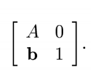
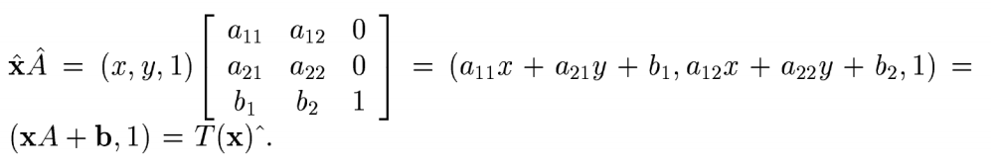
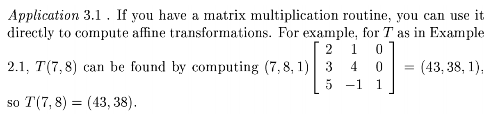
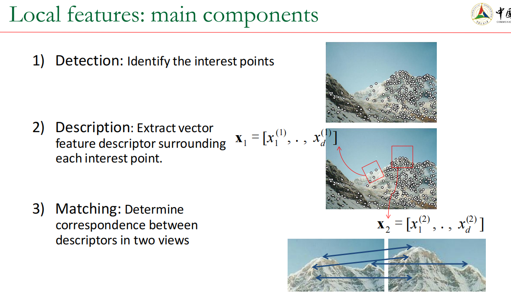
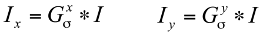
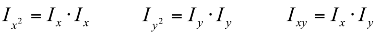
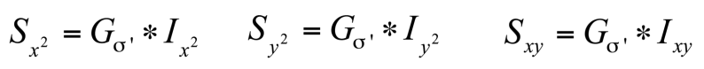
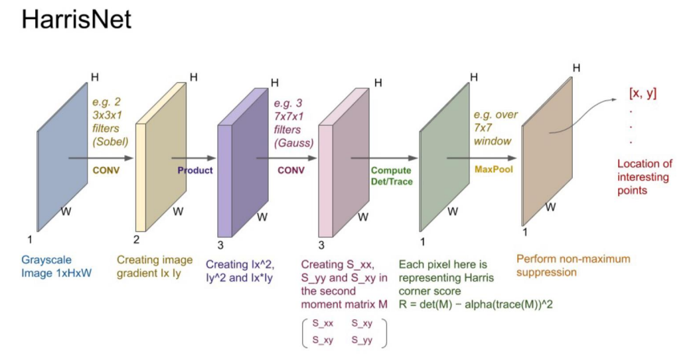

## 1. Lecture 5 : Affine Transformations

- Affine transformations are combinations of  arbitrary (4-DOF) linear transformations（线性变换）, and translations（平移）

- Properties of affine transformations:

    • origin does not necessarily map to origin

    • lines map to lines

    • parallel lines map to parallel lines

    • ratios are preserved

    • compositions of affine transforms are also affine transforms

==计算公式：==

​                                                                                                      **T(x) = xA + b**

==例子：==

## 2. Lecture 6

### 2.1 What is Interest Point?

- 选择 兴趣点 的原则:

    - Repeatability : The same feature can be found in several images despite geometric and photometric transformations.
    - Saliency : Each feature is distinctive
    - Compactness and efficiency : Many fewer features than image pixels
    - Locality : A feature occupies a relatively small area of the image; robust to clutter and occlusion

    

### 2.2 What is Harris Corner? How to get it?

#### 1. GPT

==**什么是 Harris 角点检测？**==

Harris 角点检测是一种在计算机视觉中用于检测图像中**角点**或**特征点**的算法。角点是图像中在两个方向上都有显著强度变化的区域，这使它们成为图像匹配、跟踪和物体识别等任务的理想特征。

Harris 角点检测的基本思想是：在角点周围的区域中，无论向哪个方向移动观察窗口，都会导致**较大的强度变化**。相对而言，边缘上的强度变化只在一个方向上显著，而在平坦区域中，几乎没有强度变化。

==**关键点：**==

1. **角点**是图像梯度在两个方向（x 和 y）上都有显著变化的区域。
2. **边缘**在一个方向上有显著变化。
3. **平坦区域**几乎没有强度变化。

==**如何获得 Harris 角点？**==

Harris 角点检测算法的步骤可以总结如下：

1. **计算图像梯度**：通过通常使用 Sobel 算子，计算图像的**水平**和**垂直梯度**，得到两个梯度图像：
   - \( I_x \)（x 方向的梯度）
   - \( I_y \)（y 方向的梯度）

2. **计算结构张量矩阵**：对于图像中的每个像素，基于图像梯度构建一个**结构张量矩阵**：
   \[
   M = \begin{bmatrix}
   I_x^2 & I_x I_y \\
   I_x I_y & I_y^2
   \end{bmatrix}
   \]
   这个矩阵包含了该像素周围区域在 x 和 y 方向上强度变化的信息。

3. **计算 Harris 响应值 (R)**：通过结构张量的特征值，计算 Harris 响应函数。常用的公式为：
   \[
   R = \text{det}(M) - k \cdot (\text{trace}(M))^2
   \]
   其中：
   - \(\text{det}(M)\) 是矩阵 \(M\) 的行列式
   - \(\text{trace}(M)\) 是矩阵 \(M\) 的迹（对角线元素之和）
   - \(k\) 是一个经验常数，通常设置在 0.04 到 0.06 之间

4. **阈值化**：计算每个像素的 Harris 响应 \(R\) 之后，应用阈值化操作来确定哪些点是图像中的角点。通常，如果 Harris 响应值超过某个阈值，该点即被认为是角点。

5. **非极大值抑制**：在阈值化之后，应用非极大值抑制以确保在局部区域内只保留最强的角点，从而减少相邻像素间的重复检测。

==**Harris 角点检测公式解析**==

对于每个像素，Harris 响应矩阵 \(M\) 定义为：

其中：
- \(I_x\) 和 \(I_y\) 分别为 x 和 y 方向的梯度。
- \(w(u, v)\) 是一个窗口函数（通常是高斯核），根据距离中心像素的远近为梯度加权。

然后，Harris 响应函数计算为：

\[
R = \text{det}(M) - k \cdot (\text{trace}(M))^2
\]

其中：
- \(\text{det}(M)\) 是矩阵 \(M\) 的行列式，表示梯度向量所生成的平行四边形的面积。
- \(\text{trace}(M)\) 是矩阵 \(M\) 的迹（对角线元素的和），它提供了关于梯度整体强度的信息。
- \(k\) 是一个常数，通常在 0.04 到 0.06 之间。

==**Harris 角点检测的步骤示例：**==

1. 将图像转换为灰度图。
2. 使用 Sobel 滤波器计算梯度图像 \(I_x\) 和 \(I_y\)。
3. 计算每个像素的梯度乘积 \(I_x^2\)、\(I_y^2\) 和 \(I_x I_y\)。
4. 对梯度乘积应用高斯滤波进行平滑。
5. 计算每个像素的 Harris 响应 \(R\)。
6. 对响应值进行阈值化以识别角点。
7. 进行非极大值抑制以获得最终的角点集合。

#### 2. ppt

1. Compute x and y derivatives of image

    

2. Compute products of derivatives at every pixel

    

3. Compute the sums of the products of derivatives at each pixel

4. Define the matrix at each pixel

    

5. Compute the response of the detector at each pixel

    

6. Threshold on value of R, compute non-max suppression.

- 

### 2.3 What is SIFT, HOG, GIST? And how to extract these features?

#### 1. SIFT Detector and Descriptor —— Scale Invanriant Feature Transform

##### 1.1 Advantages of SIFT

**Locality:** features are local, so robust to occlusion and clutter (no prior segmentation)

**Distinctiveness:** individual features can be matched to a large database of objects

**Quantity:** many features can be generated for even small objects

**Efficiency:** close to real-time performance

**Extensibility:** can easily be extended to wide range of differing feature types, with each adding robustness

#### Step 1 . Scale-space extrema detection

- Goal: Identify locations and scales that can be repeatably assigned under different views of the same scene or object.

- Method: search for stable features across multiple scales using a continuous function of scale.

- Prior work has shown that under a variety of assumptions, the best function is a Gaussian function.

- The scale space of an image is a function *L(x,y,****)* that is produced from the convolution of a Gaussian kernel (at different scales) with the input image.

##### Step 2 Key point localization

