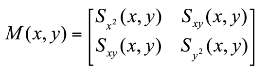

## 1. Lecture 5 : Affine Transformations

- Affine transformations are combinations of  arbitrary (4-DOF) linear transformations（线性变换）, and translations（平移）

- Properties of affine transformations:

    • origin does not necessarily map to origin

    • lines map to lines

    • parallel lines map to parallel lines

    • ratios are preserved

    • compositions of affine transforms are also affine transforms

==计算公式：==

​                                                                                                      **T(x) = xA + b**

==例子：==

## 2. Lecture 6

### 2.1 What is Interest Point?

- 选择 兴趣点 的原则:

    - Repeatability : The same feature can be found in several images despite geometric and photometric transformations.
    - Saliency : Each feature is distinctive
    - Compactness and efficiency : Many fewer features than image pixels
    - Locality : A feature occupies a relatively small area of the image; robust to clutter and occlusion

    

### 2.2 What is Harris Corner? How to get it?

#### 1. GPT

==**什么是 Harris 角点检测？**==

Harris 角点检测是一种在计算机视觉中用于检测图像中**角点**或**特征点**的算法。角点是图像中在两个方向上都有显著强度变化的区域，这使它们成为图像匹配、跟踪和物体识别等任务的理想特征。

Harris 角点检测的基本思想是：在角点周围的区域中，无论向哪个方向移动观察窗口，都会导致**较大的强度变化**。相对而言，边缘上的强度变化只在一个方向上显著，而在平坦区域中，几乎没有强度变化。

==**关键点：**==

1. **角点**是图像梯度在两个方向（x 和 y）上都有显著变化的区域。
2. **边缘**在一个方向上有显著变化。
3. **平坦区域**几乎没有强度变化。

==**如何获得 Harris 角点？**==

Harris 角点检测算法的步骤可以总结如下：

1. **计算图像梯度**：通过通常使用 Sobel 算子，计算图像的**水平**和**垂直梯度**，得到两个梯度图像：
   - \( I_x \)（x 方向的梯度）
   - \( I_y \)（y 方向的梯度）

2. **计算结构张量矩阵**：对于图像中的每个像素，基于图像梯度构建一个**结构张量矩阵**：
   \[
   M = \begin{bmatrix}
   I_x^2 & I_x I_y \\
   I_x I_y & I_y^2
   \end{bmatrix}
   \]
   这个矩阵包含了该像素周围区域在 x 和 y 方向上强度变化的信息。

3. **计算 Harris 响应值 (R)**：通过结构张量的特征值，计算 Harris 响应函数。常用的公式为：
   \[
   R = \text{det}(M) - k \cdot (\text{trace}(M))^2
   \]
   其中：
   - \(\text{det}(M)\) 是矩阵 \(M\) 的行列式
   - \(\text{trace}(M)\) 是矩阵 \(M\) 的迹（对角线元素之和）
   - \(k\) 是一个经验常数，通常设置在 0.04 到 0.06 之间

4. **阈值化**：计算每个像素的 Harris 响应 \(R\) 之后，应用阈值化操作来确定哪些点是图像中的角点。通常，如果 Harris 响应值超过某个阈值，该点即被认为是角点。

5. **非极大值抑制**：在阈值化之后，应用非极大值抑制以确保在局部区域内只保留最强的角点，从而减少相邻像素间的重复检测。

==**Harris 角点检测公式解析**==

对于每个像素，Harris 响应矩阵 \(M\) 定义为：

其中：
- \(I_x\) 和 \(I_y\) 分别为 x 和 y 方向的梯度。
- \(w(u, v)\) 是一个窗口函数（通常是高斯核），根据距离中心像素的远近为梯度加权。

然后，Harris 响应函数计算为：

\[
R = \text{det}(M) - k \cdot (\text{trace}(M))^2
\]

其中：
- \(\text{det}(M)\) 是矩阵 \(M\) 的行列式，表示梯度向量所生成的平行四边形的面积。
- \(\text{trace}(M)\) 是矩阵 \(M\) 的迹（对角线元素的和），它提供了关于梯度整体强度的信息。
- \(k\) 是一个常数，通常在 0.04 到 0.06 之间。

==**Harris 角点检测的步骤示例：**==

1. 将图像转换为灰度图。
2. 使用 Sobel 滤波器计算梯度图像 \(I_x\) 和 \(I_y\)。
3. 计算每个像素的梯度乘积 \(I_x^2\)、\(I_y^2\) 和 \(I_x I_y\)。
4. 对梯度乘积应用高斯滤波进行平滑。
5. 计算每个像素的 Harris 响应 \(R\)。
6. 对响应值进行阈值化以识别角点。
7. 进行非极大值抑制以获得最终的角点集合。

#### 2. ppt

1. Compute x and y derivatives of image

    

2. Compute products of derivatives at every pixel

    

3. Compute the sums of the products of derivatives at each pixel

4. Define the matrix at each pixel

    

5. Compute the response of the detector at each pixel

    

6. Threshold on value of R, compute non-max suppression.

- 

 ### 2.3 SIFT Detector and Descriptor —— Scale Invanriant Feature Transform

#### 2.3.1 基本信息

- 选取关键点后，这些关键点 invariant to scale and rotation.
- Also, Lowe aimed to create a descriptor that was robust to the variations corresponding to typical viewing conditions. The descriptor is the most-used part of SIFT.

- Image content is transformed into local feature coordinates that are invariant to translation, rotation, scale, and other imaging parameters. (图像的内容进行平移，旋转，放大缩小的变换)

- Advantages：
    - 局部性 Locality
    - 独特性：单一特征与整个数据库比对 Distinctive
    - Quantity 一个简单的关键点也可以生成大量不同特征
    - Efficiency
    - Extensibility

#### 2.3.2 Step 1 —— Scale-space extrema detection

- Goal: Identify locations and scales that can be repeatably assigned under different views of the same scene or object.

::: detail Chinese

同一个视图（物体）在不同的位置和比例也可以检测到。

:::

-  Method: search for stable features across multiple scales using a continuous function of scale.

::: detail

用一个比例的连续函数检测在不同比例下的稳定的特征。

:::

- Prior work has shown that under a variety of assumptions, the best function is a Gaussian function.

::: detail

我们用一个高斯函数来做这个工作

:::

The scale space of an image is a function *L(x,y,****)* that is producedfrom the convolution of a Gaussian kernel (at different scales) with the input image

::: tabs

@tab 为什么选择高斯函数？

高斯函数在图像处理中的一个关键作用是创建图像的**尺度空间**，即在不同尺度下搜索稳定的特征。通过高斯函数，可以实现对图像进行多尺度分析，以便找到那些在不同尺度下都稳定存在的特征。具体来说，高斯函数可以做到这一点的原因有以下几个方面：

- **高斯模糊和图像卷积** 

    高斯函数是一种平滑函数，当我们对图像进行高斯模糊（Gaussian Blur）时，其实是将图像与一个高斯核进行**卷积**操作。这个过程可以平滑图像，消除噪声，同时保留图像的主要结构。高斯模糊有一个重要的性质：它能够根据不同的尺度（即高斯函数的标准差 \(\sigma\)）对图像进行平滑处理。

- **尺度空间**

    尺度空间的概念是为了处理图像中不同大小的特征点（例如角点、边缘等），通过对图像使用不同尺度的高斯核进行卷积，生成多个版本的图像，每个版本对应于不同的尺度。这个过程使得我们能够在不同的尺度下检测图像特征，因为在某些尺度下，特征可能会更加明显或稳定。

数学上，图像的尺度空间 \( L(x, y, \singema) \) 表示的是通过与不同尺度的高斯核 \( G(x, y, \singema) \) 卷积后的图像：

其中 \( I(x, y) \) 是输入图像，\( G(x, y, \sigma) \) 是高斯核，\(\sigma\) 控制高斯模糊的程度（即尺度)。

- **高斯函数的性质**

    高斯函数的一个重要性质是，它的卷积操作具有**平滑性**和**尺度变换的连续性**。这意味着：

    - 当 \(\sigma\) 变小时，我们在图像中可以捕捉到细节更多的特征。

    - 当 \(\sigma\) 变大时，图像中的噪声和细小结构会被抹去，只留下大尺度的结构特征.

        通过在多个尺度下应用高斯函数，可以有效地捕捉到那些在多种尺度下都保持稳定的特征。也就是说，特征在不同尺度下“稳定”存在，这就是图像特征的**尺度不变性**。

- **总结**

    高斯函数通过在不同尺度下平滑图像，可以构建图像的尺度空间。在这个过程中，我们能够检测到那些在不同尺度下都保持稳定的特征，这就是如何通过高斯函数来实现多尺度特征提取的原理。

@tab ppt 图片解释

1. **尺度空间（Scale Space）** 被分为 **octaves（八度）**。

    第一个八度使用尺度 σ。

    第二个八度使用尺度 2σ。

    后续八度依次类推。

2. 在每个八度中，原始图像被重复地与不同尺度的高斯核进行卷积，产生一组尺度空间图像。

3. 相邻的高斯图像相减，得到差分高斯（DOG，Difference of Gaussians）图像。

4. 在每个八度结束时，高斯图像通过下采样，大小缩小为原图的四分之一，开始下一层八度的计算。

:::
