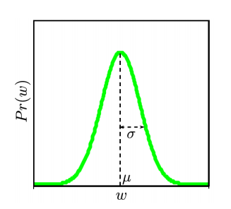
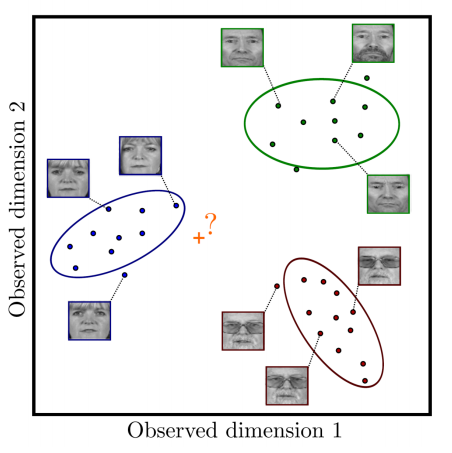
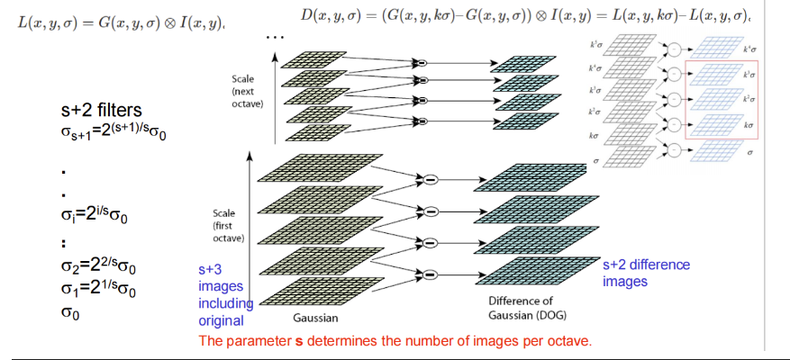
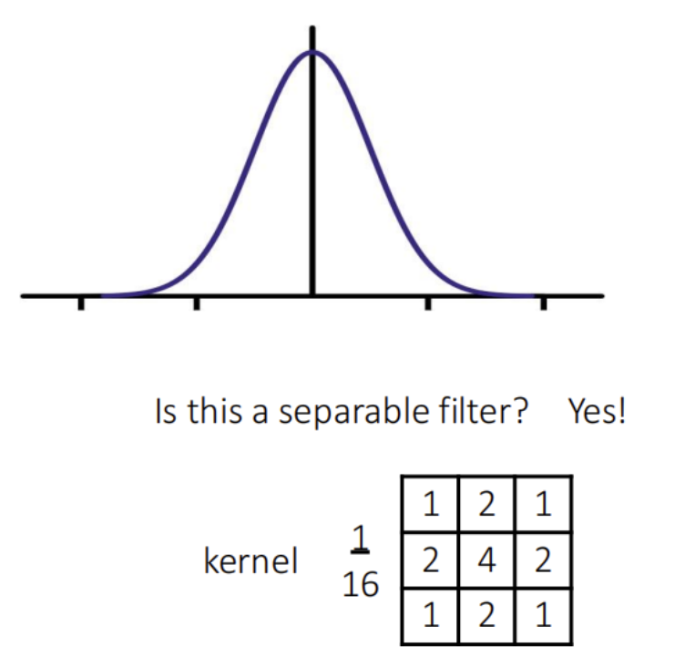
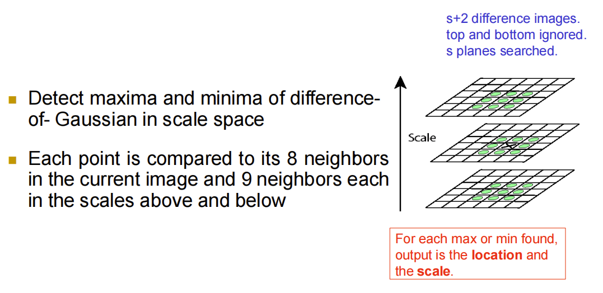
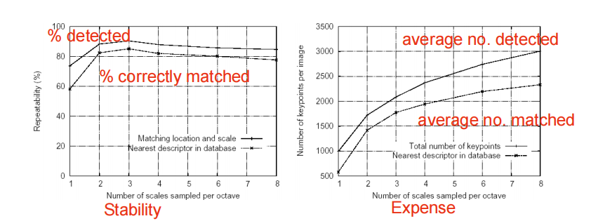
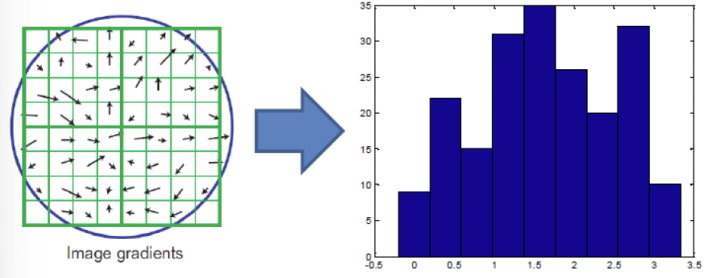
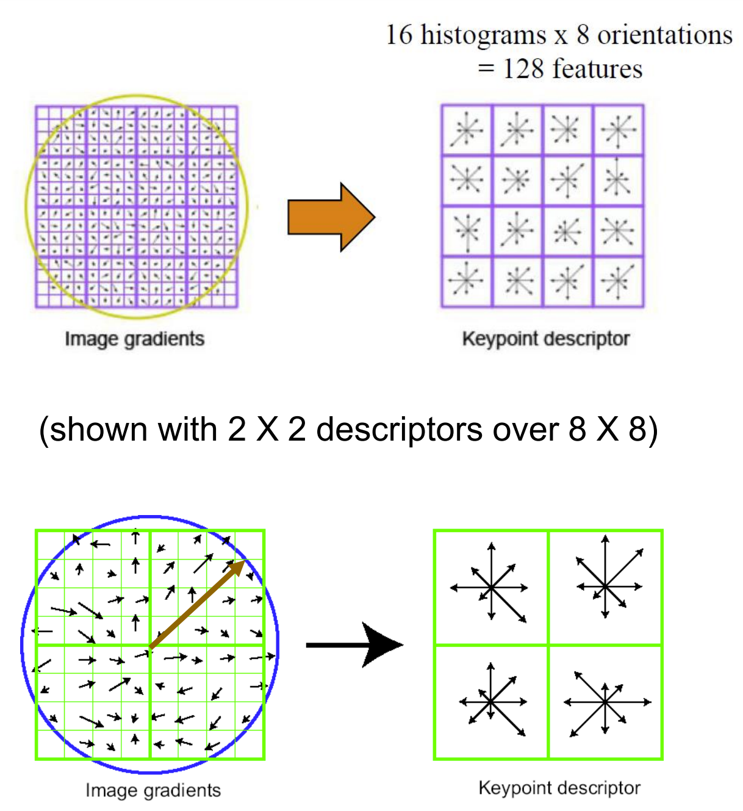

## 1. Question 01

> 1.1 What is the Gaussian Mixture Model (GMM) or Mixture of Gaussian(MoG) ?
>
> 1.2 how to solve GMM via Expectation Maximization(EM)? 
>
> 1.3 Further, why can the GMM or MoG be solved well by the EM algorithm? Please explain the reason.

### 1.1 What is a Gaussian Mixture Model (GMM)?

A Gaussian Mixture Model (GMM) is a probabilistic model. GMM assumes all data points are generated from a mixture of several Gaussian distributions, each with unknown parameters. Simply put, GMM assumes that a dataset consists of several different Gaussian distributions, with each distribution corresponding to a "subgroup" or "cluster" within the data. 

Mathematically, GMM can be represented as:
$$
P(\mathbf{x}) = \sum_{k=1}^K \pi_K \mathcal{N}(\mathbf{x} | \boldsymbol{\mu}_k, \boldsymbol{\Sigma}_k)
$$

where:

- $K$ is the number of Gaussian distributions,
- $\pi_k$ is  the mixing coefficient for the k-th Gaussian component, satisfying $\sum_{k=1}^K \pi_K$ = 1且 $\pi_k \geq$ 0 
- $\mathcal{N}(\mathbf{x} | \boldsymbol{\mu}_k, \boldsymbol{\Sigma}_k)$ is the Gaussian probability density function with mean $\mu_k$ and covariance matrix $\Sigma_k$.

### 1.2 How to solve GMM using Expectation Maximization (EM)

**GOAL:** to learn parameters $\theta = \{ \lambda_{1...K}, \mu_{1...K}, \Sigma_{1...K} \}$ from training data $\mathbf{x}_{1...I}$. Estimate the mean, variance, and mixing weights of each Gaussian component.

1. **E-Step (Expectation Step)**: we maximize the bound with respect to the distributions $q(h_i)$by finding the posterior probability distribution  $Pr(h_i | x_i)$ of each hidden variable $h_i$  given the observation  $x_i$ and the current parameter settings.

    For each data point $\mathbf{x}_i$  and each Gaussian component $k$, calculate the responsibility (i.e., posterior probability):
    $$\gamma_{ik} = \frac{\pi_k \mathcal{N}(\mathbf{x}_i | \boldsymbol{\mu}_k, \boldsymbol{\Sigma}_k)}{\sum_{j=1}^{K} \pi_j \mathcal{N}(\mathbf{x}_i | \boldsymbol{\mu}_j, \boldsymbol{\Sigma}_j)}$$

2. **M-Step (Maximization Step)**: we maximize the bound with respect to the parameters $\theta = \{ \lambda_k, \mu_k, \Sigma_k \}_{k=1}^K$. We update the weights $\lambda$ according to the relative total responsibility of each component for the data points. We update the cluster means $\mu$ by computing the weighted mean over the data points where the weights are given by the responsibilities.

    Update the mixing coefficients:
    $$ \pi_k = \frac{N_k}{N} $$

    Update the means:
    $$ \boldsymbol{\mu}_k = \frac{1}{N_k} \sum_{i=1}^{N} \gamma_{ik} \mathbf{x}_i $$

    Update the covariance matrices:
    $$ \boldsymbol{\Sigma}_k = \frac{1}{N_k} \sum_{i=1}^{N} \gamma_{ik} (\mathbf{x}_i - \boldsymbol{\mu}_k)(\mathbf{x}_i - \boldsymbol{\mu}_k)^\top $$

    where:

    - $N$ is the total number of data points,
    -  $N_k = \sum_{i=1}^{N} \gamma_{ik}$  is the total responsibility for component $k$.

3. The E- and M-steps are alternated until the bound on the data no longer increases and the parameters no longer change.

### 1.3 Why does the EM algorithm work well for GMM?

Using maximum likelihood estimation in a mixed Gaussian model (MoG) is a bit difficult because the likelihood function contains sum terms of multiple Gaussian distributions, which is troublesome to derive directly and simply cannot get the optimal solution easily.

So we can introduce a hidden variable to indicate which Gaussian component each data point belongs to. In this way, in step E of the EM algorithm, we can calculate the posterior probability of these hidden variables given the observed data - that is, the probability that each data point belongs to a different Gaussian component.

Then, by marginalising the likelihood function and converting it into the form of a joint distribution, the EM algorithm can optimise the parameters of the model in the M step. In the M-step, we update the mixture weights, means and covariance matrices to make the bounded likelihood function larger.

By iterating the E and M steps, the EM algorithm can progressively optimise the parameters and finally allow the likelihood function to converge to a locally optimal solution. This iterative optimisation process is particularly suitable for the structure of MoG, and thus the EM algorithm is very effective in dealing with MoG.

## 2. Question 2

> 2.1 What about the difference between linear regression and logistic regression? 
>
> 2.2 If we want to solve real-world related tasks, how do we choose these two methods?

### 2.1 Differences Between Linear Regression and Logistic Regression

1. **Output Type:**

    - Linear Regression: A continuous numeric variable predicted using this method.
    -  Logistic Regression: A categorical variable predicted to classify it as either a positive or negative (for instance, 0 or 1).

2. **Applicable Data Types**

    - Linear Regression: Both independent and dependent variables are usually **continuous**.
    - Logistic Regression: Independent variables can be **continuous or categorical**, while the dependent variable is **categorical**.

3. **Mathematical Model**

    - Linear Regression:
        - Formula: $Y = \beta_0 + \beta_1 X_1 + \dots + \beta_n X_n + \epsilon$
        - Explanation: Directly fits a linear equation to predict specific numerical values of the dependent variable.

    - Logistic Regression:
        - Formula: $P(Y=1) = \frac{1}{1 + e^{-(\beta_0 + \beta_1 X_1 + \dots + \beta_n X_n)}}$
        - Explanation: Uses the Sigmoid function to map a linear combination to a probability between 0 and 1.

4. **Fitting method**

    - Linear Regression:
        - Loss Function: Least Squares (minimizing the sum of squared residuals).

    - Logistic Regression:
        - Loss Function: Log-Likelihood (maximizing likelihood estimation).

5. **Output Results** 

    - Linear Regression: This is referred to as a ‘continuous’ value as opposed to the categorical ones. 
    - Logistic Regression: For the prediction of an event occurrence, the outcome is the probability, which can be used to classify based on a certain threshold (for instance, 0.5). 

6. **Example:**

    - Linear:

    

    - Logistic:

        

    

### 2.2 How to Choose in Practical Tasks

1. **Based on the Type of Target Variable**

    When the detected data is continuous , such as temperature, house price, we use linear regression to model it. When we detect data that is discrete, such as whether a production part is up to standard or not, winning or losing a game, we model it with logistic regression.

2. **data characteristics（relationship  between the independent and dependent variables）**     

    - **Linear Relationship:** If there is a linear relationship between the independent and dependent variables and the data are independent of each other, choose linear regression.     
    - **Categorical Problems:** If the modelling objective is classification and the data are independent of each other, choose logistic regression.

    

In summary:

- **Linear Regression** is suitable for predicting **continuous values** and emphasizes the linear relationship between independent and dependent variables.
- **Logistic Regression** is suitable for **classification tasks**, particularly binary classification, and focuses on estimating the **probability** of an event occurring.

## 3. Question 3

> 3.1 Please choose one feature descriptor to explain its definition and function. 
>
> 3.2 It is encouraged to analyze/explain the reason or advantage why you select the feature descriptor. 
>
> 3.3 If an example could be used to introduce it, it would be better.

### 3.1 What is SIFT?

**SIFT** (Scale-Invariant Feature Transform) is an algorithm used to detect and describe local features in images. Image content can transformed into local feature coordinates that are invariant to translation, rotation, scale, and other imaging parameters. In other words, interest points extracted still can be detected by SIFT.  

**Definition and Function:**

The SIFT algorithm includes four main steps:

1. **Scale-space extrema detection**: Identify locations and scales that can be repeatably assigned under different views of the same scene or object. By building a Gaussian pyramid, it blurs the image at different scales to detect potential key points that are scale-invariant.

    

    ::: info Additional Knowledge Points for Supplementary Understanding

    Gaussion filter：

    

    - Why choose Gaussian functions?

        - Gaussian functions and their properties are covered in Lecture 2 and Gaussian pyramids are covered in Lecture 3.

        - Gaussian function is a smoothing function, using Gaussian blurring we can smooth the image to remove noise, but at the same time we can still keep the main structure of the image.
        - The image is convolved with Gaussian kernels of different scales to produce images of different scales, note that the scale transformation of the Gaussian convolution is continuous. In this way we can apply the Gaussian pyramid to detect scale-independent keypoints.
    
    :::

2. **Key point localization**: It precisely locates the key points and removes unstable ones, such as low-contrast points or edge response points.

- At each point, it compares with 8 neighbours in the current image, and 9 neighbours above and below the scale, to determine whether the point is a local extreme or not。

- According to the experiment result from Lecture 7 PPT, for efficiency considerations, the maximum number of stable keypoints can usually be found using 3-scale sampling, with more or less than this affecting performance.

    

3. **Orientation assignment**: Based on the gradient direction distribution in the neighborhood of each key point, it assigns one or more main directions to the key point, making it rotation-invariant.

    - Additional knowledge: exactly how to assign directions

        - Calculate image gradient -> Construct histogram -> Select main direction

            

4. **Key point descriptor generation**: It calculates the gradient direction and magnitude in the area around each key point, producing a 128-dimensional feature vector as the descriptor for the key point.

    

 ### 3.2 **Reasons and Advantages of Choosing SIFT:**

- **Scale and rotation invariance**: SIFT features can be detected even when they undergo rotations, translations, etc., which helps us to detect image features in different sizes, directions and so on.
- **Locality：** features are extracted locally with high flexibility without prior segmentation.
- **Robustness to lighting and noise**: SIFT is somewhat resistant to changes in lighting, affine transformations, and noise, which improves the accuracy of matches.
- **Quantity**: many features can be generated for even small objects.

### 3.3 **Example:**

Imagine we have two images of the same object. One is a close-up from the front, and the other is taken from the side at a distance, with different lighting conditions. Using the SIFT algorithm, we can detect key points in both images and match them by comparing their feature descriptors. This way, even if the images differ in scale, angle, and lighting, we can still identify that they are images of the same object.

## 4. Additional information on assignments

- This article is written in Markdown language (usually used to write articles written in Markdown language), the preparation process using the software Typora and uploaded to my github and personal website, the submitted version for the export of the pdf. format, if you need to visit the website of this article, please click the link [coursework](https://bougiemoonintaurus.com/zh/Computer_Vision/Coursework.html) , password：cvjy

- Some of the visual effects of the article are only visible on the website and not in the pdf.

- The images in the assignment are taken from the ppt that was taught in class.

