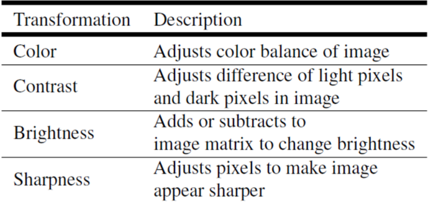
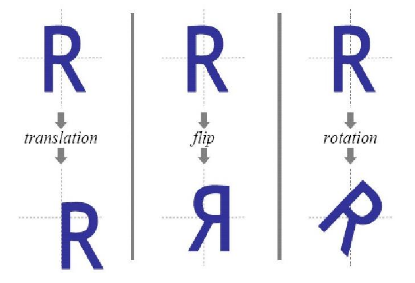
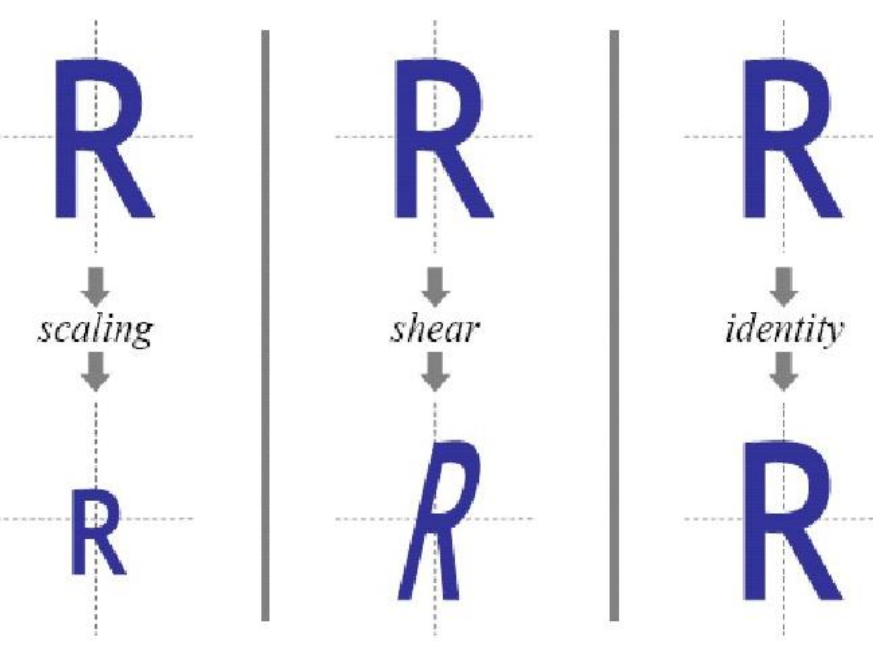
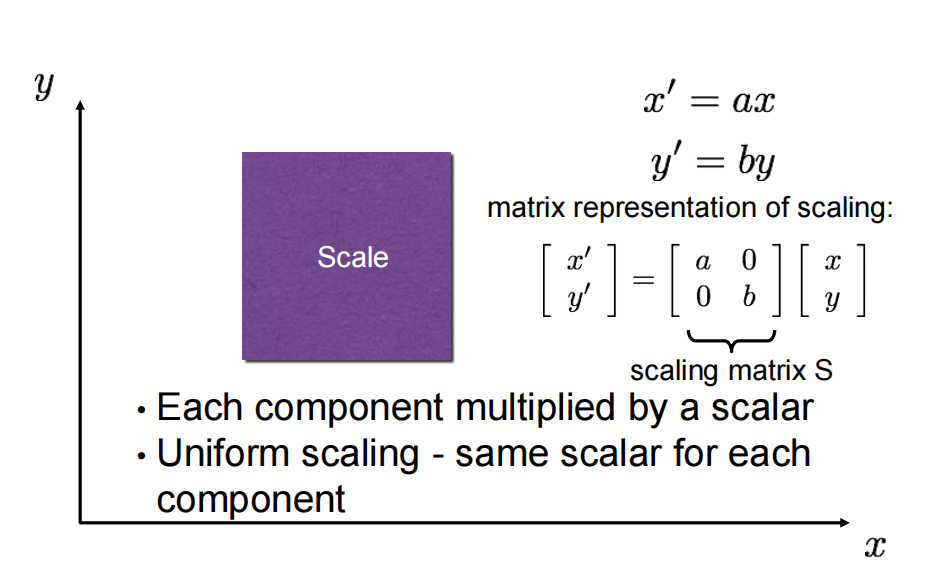
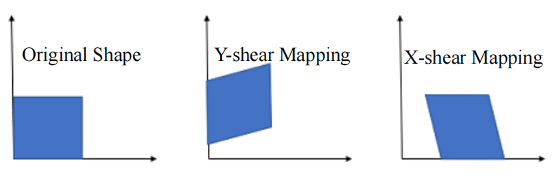
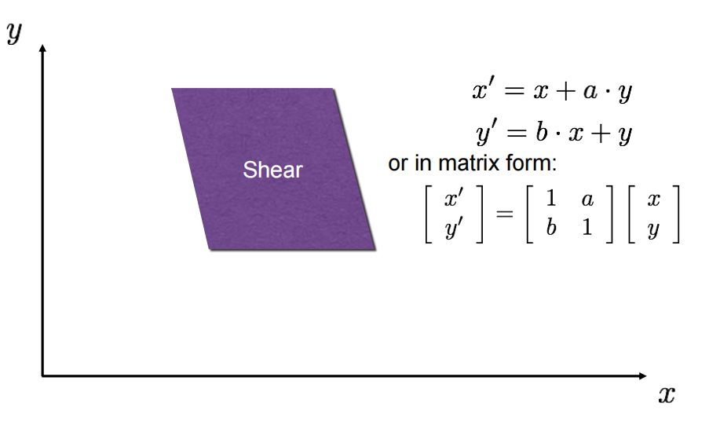
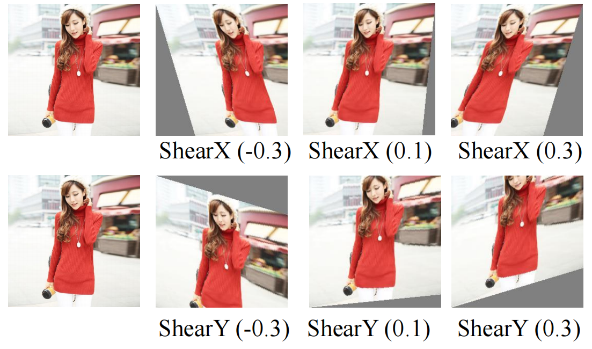
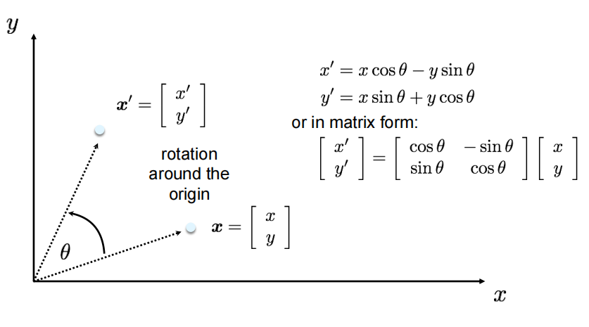
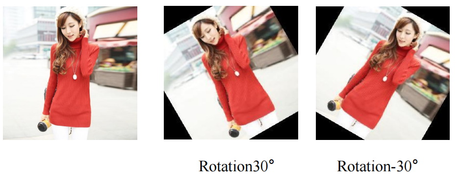
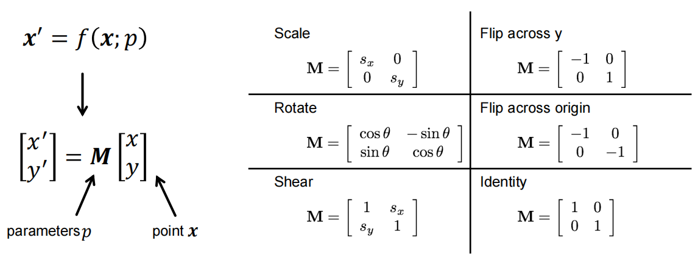

## Lecture 5 Transformations

### 1. Non-spatial Transformation

### 2. Spatial Transformation

​                                                 

#### 2.1 Scale

#### 2.2 Shear Transformation

**Definition:** Points on one axis remain unchanged, while all other points are shifted parallel to that axis.

•Each point moves a distance which is proportional to their (signed) perpendicular distance from the axis,

•All points on one side of the stationary axis are transformed in the same direction,

•Areas are always transformed into equal areas.

::: Info

每个点移动的距离与其与轴线的（有符号）垂直距离成正比、

静止轴一侧的所有点都沿同一方向变换、

区域总是转化为相等的区域。

:::

**可视化：**

#### 2.3 2D planar transformations —— Rotation

#### 2.4 2D planar and linear transformations

