## 计算题

### 1. Affine Transformation

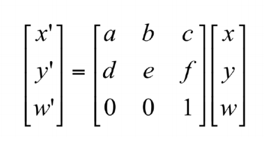

**公式：**

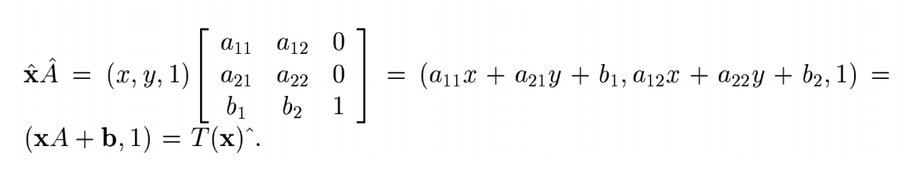

**例子：**

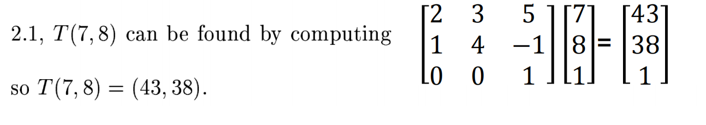

（2x7 + 3x8 + 5x1, 1x7 + 4x8 -1, 1)

### 2. distance between 2 image features

1. Manhattan distance 

$D(h1,h2) = \sum_{i=1}^N|h_1(i)-h_2(i)|$

::: details

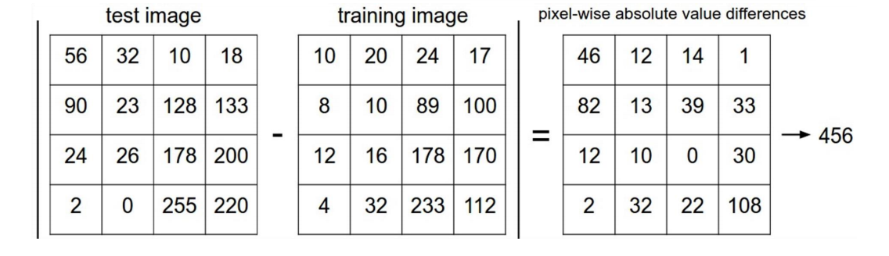

:::

2. Euclidean distance

$D(x,y) = \sum_{i=1}^n(x_i-y_i)^2$ 开根号。

::: details

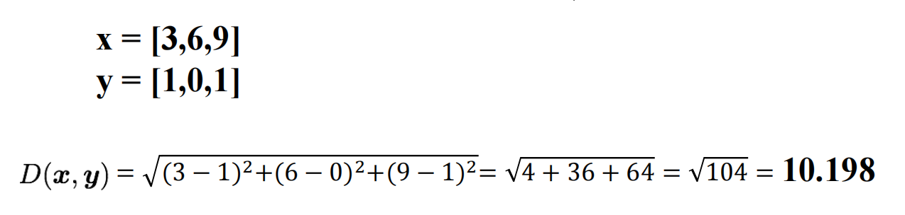

:::

### 3. Markov chain model

the state transition probability matrix is: 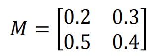

An initial state distribution $ a = [0.1, 0.3]$

**公式：**

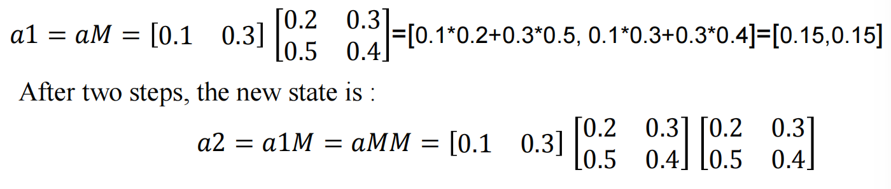

## 简单题 或 判断题

### 1. What is interesting point?

不在考试范围内？？

### 2. Harris Corner?

通过两个方向的梯度变化计算得到。（理解内容）

### 3. 有哪些对于图片的特征提取的方法？

SIFT GIST HOG ORB SURF

注意：Harris Corners 也是特征提取的方法

### 4. SIFT，GIST，HOG步骤？

#### SIFT

1. **scale-space extrema detection:**

    Use a Gaussian Pyramid to find hidden keypoints which is scale-invariant.

2. **Keypoints Localization**

    Locate the keypoints and remove unstable one.

3. **Orientation assignment**

    ==Compute== 1 or more dominant orientation(s) for each keypoint region.

4. **keypoint descriptor**

    Using local feature ==gradients== and rotation to describe each ==keypoint region==.

#### *GIST

1. Compute filter responses (filter bank of ==Gabor filters==)

4 scales  8 orientations

2. Divide image patch into 4x4 cells
3. Compute ==filter response averages for each cell==
4. ==Size of description is 4x4xN，where N is the size of the filter bank==

#### *HOG

- ==Image== Processing: Cut out a patch and adjust its size to 64*128
- Find horizontal and vertical gradients , gradient magnitude and orientations.
- Compute histogram bins. ==Quantize== gradient orientations ==in==to 9 bins

- 16 * 16 block normalization, ==normalize vectors with L2==
- Concatenate histograms ==in==to a feature with 3780 dimensions

### *5. random variable? Types?

- Discrete and Continuous
- May be results of a experiment (flipping a coin) or real word measurements (temperature).
- Some values occur more than others and that information is captured by a probability distribution.

- a random variable ==denotes== a ==quantity== that is uncertain.

- If obverse several instances of x we get different values.

### 6. Conditional Probability

The Conditional probability of  x given that $y = y_1$:

The relative ==propensity== of the variable x to take different outcomes given that y is fixed to be equal to $y_1$, written as：

​                              $Pr(x|y=y_1)$

### *7. Fitting probability distributions method

- Maximum Likelihood: Evaluate the new data point $x^*$ under the probability distribution $Pr(x^*|\theta)$ with ML parameters
- Maximum a Posteriori: ~
- Bayesian approach: compute weighted sum of predictions from all possible values of parameters

### 8. Discrete and Continuous probability distributions

Discrete: Bernuolli;  Categorical 

Continuous: Univariate normal; Multivariate normal

### 9. **Two types of models according to the world state:**

Discrete : Classiffication ==Classification==

Continuous : Regression

### *10. Two Models (data —— world state)

- Model contigency ==contingency== of the world state on data $Pr(w|x)$ : Discriminative models
- Model contigency ==contingency== of the data on the world state $Pr(x|w):$ Generative models

### 11. Hidden variable

Represent ==density== $Pr(x)$ as ==marginalization== of joint ==density== with a variable h that we don’t see.

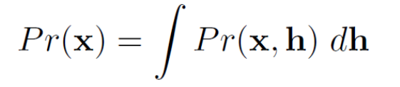

### 12. Advantage of Expectation Maximization

- Be computed in a closed form.
- parameters are respected
- can cope with missing data

### 13. independence?

==Two variables== x and y are independent if their joint probability distribution ==factorizes as==

$Pr(x,y) = Pr(x)Pr(y)$

### 14. conditional independence?

The variable $x_1$ is conditional independent of $x_3$ given $x_2$ when $x_1$ and $x_3$ are independent for fixed $x_2$

$Pr(x_1|x_2,x_3)=Pr(x_1|x_2)$

$Pr(x_3|x_1,x_2)=Pr(x_3|x_2)$

::: tip

- Note that conditional independence relations are always **symmetric**.

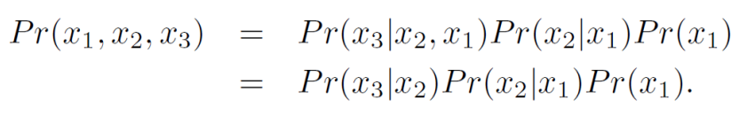

:::

### 15. How many types of graphical models?

- Directed graphical model (Bayesian network)
- Undirected graphical mode(Markov Random Field or Markov network)

### 16. CRF’s function? (Conditional Random Field)

image segmentation (图像分割) 

#### MRF & CRF

**MRF:**

- Undirected graphical model
- Contextual constraints connect neighbors
- Neighborhood relations define cliques

**CFR:**

- MRF specifies joint distribution on Y
- For any probability distribution, you can condition it on some other variables X

**CRF= MRF conditioned on X**

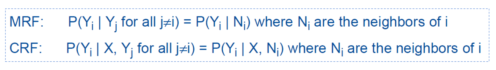

### 17. 图的概率分布的表示

有向图：

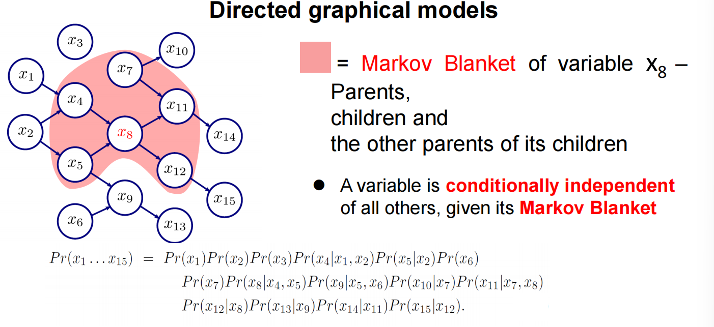

无向图：
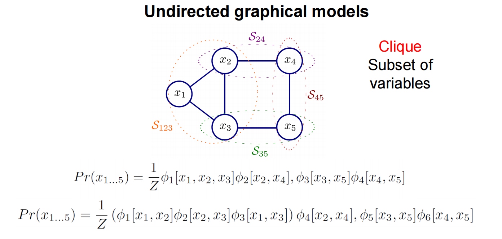

### *18. Chain and tree model

- chain model: Only model connections between a world variable w and its1  ==preceding== and 1 ==subsequent variables== .
- tree model: ==connection between world variables== are organized as a Tree. Disregard directionality ==of connections==  for directed models.

### 19. Directed model for chain

**or Hidden Markov model**

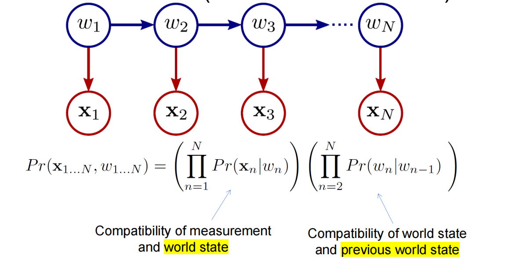

这里公式缺了一个 $Pr(w_1)$

### 20. Undirected model for chain

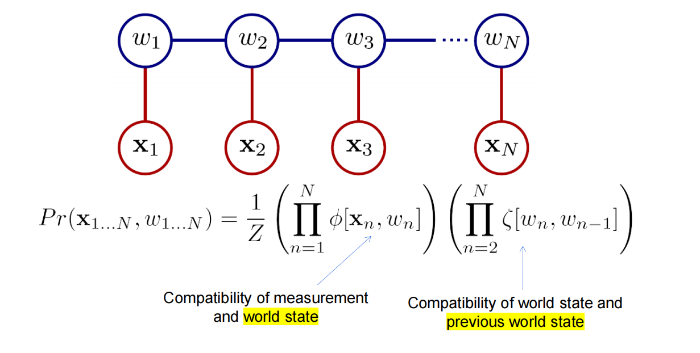

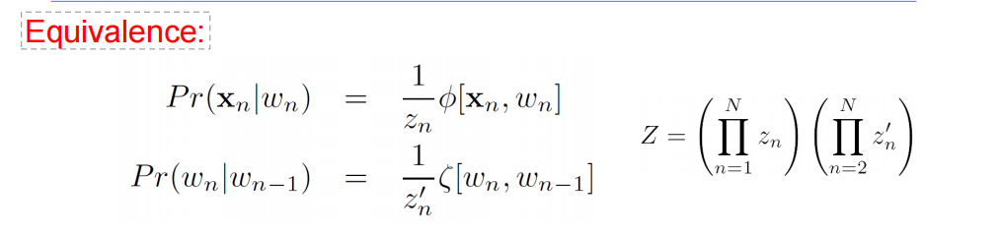

### 21. Lattice (grid) model

Consider ==model with one unknown== word ==state== at each pixel in the image —— take a form of a grid.

### 22. what is Markov random field

- A set of site S = {1…N} corresponds N pixel ==locations==.
- A set of ==random variable== ${w_n}_1^N$ ==associate with each sites==.
- A set of neighbors ${N_n}_1^N$ at each sites.

### 23.  Grid & Markov Random Fields

==Higher-order lattice(grid) models are more complex than pair-wise models (Markov Random Fields).==

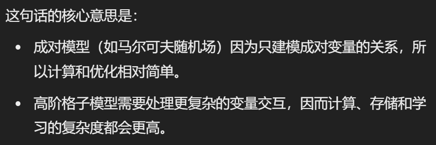

### 24. Graph cut & Dynamic programming

- Graph cut for grid or MRF  (Maximum flow or Minimum cut)
- Dynamic programming for tree or chain

 

### 25. what is Subspace Identity model? what’s its function?

$x^{ij}$ denotes $j^{th}$ J of obversed data examples from $i^{th}$ I of identities.

Generative equation:

$x^{ij} = \mu + \phi h_i + $ 

**Reduction high-dimension to low-dimension.**

### 26. Probabilistic linear discriminant analysis

$x^{ij} = \mu + \phi h_i + s_{ij} + $

### 27. Probabilistic form of both

### 28. Non-linear models

are more complex than linear model 

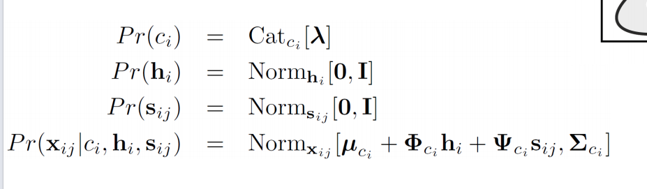

## 问答题大题

### 1. BOF？

- Local Features Extraction: Use SIFT

- learn “visual vocabulary”

    Visual vacabulary is a collection of local features. They often are extracted by clustering. A visual word corresponds to a cluster center.

-  Quantize the features using visual vacabulary. Using k-clustering. Compute the minimum sum of squared Euclidean distances between a local feature and its nearest cluster center.
- Represent the image by the frequencies of visual words

### 2. image classification

- Data collections. Collect and Label images in corresponding classes (grass, people, building…). 

- Extract Local Features. use SIFT.
    - Scale-space extrema detection. Build a Gaussian Pyramid to detect keypoints which are scale-invariant.
    - Keypoints localization. Locate the keypoints and remove unstable one.
    - Orientation assignment. Assign 1 or more dominant orientations for each keypoint region.
    - Keypoint descriptors. Use local ==image== grandients and rotation to describe ==each keypoint region==
- Clustering local feature.
    - Quantize local features using visual vocabulary.  Use k-clustering: compute the minimum sum of squared ==Euclidean== distance between a local feature and it nearest clustering center. 
    - Represent images using the frequencies of visual words. assume a outcome with 10th (number 0-9) visual words is [1,2,2,5,8,8]. Construct a 10-dimensional histogram [0120010020]

- Divide those data in 2 groups. One for training set. One for testing set.
- Training:
    - feed those histograms ==with their labels== into a machine learning classifier.
    - train the classifier to learn to differentiate the classes of data
- Testing:
    - Put testing data into a learned classifier.
    - See if it can predict the class of a image correctly.

### 3. **What is t-distributions? How to use EM to solve t-distributions?**

$Pr(x) = Stud_x[\mu,\sum,v]$ is described as a distribution robust against data with a heavy tail.

- Goal: to find the parameters $\theta=[\mu,\sum,v]$ from training data $x_1...I$ . $\mu$ is the mean, $\sum$ is the ==covariance==, $v$ is degrees of freedom.
- E-step: We maximize the bound on data with respect to distribution $q_i(h_i)$ by finding the posterior probability distribution $Pr(h_i|x_i,\theta^{[t]})$ ==of each hidden variable== given that obversed data $x_i$ and current parameters setting $\theta$. $Pr(h_i|x_i,\theta)$ use gamma distribution as a conjugate prior probability for ==scaling factor==.
- M-step: We maximize the bound on data with respect to parameters. We update $\mu$ and $\sum$ by ==the average of data weighted by expectation from E-step==. Because no closed-form solution for v, we use grid search to find the best value v which maximizes the likelihood.
- Alternate E-step and M-step until the bound on data no longer increases and the parameters no longer change.

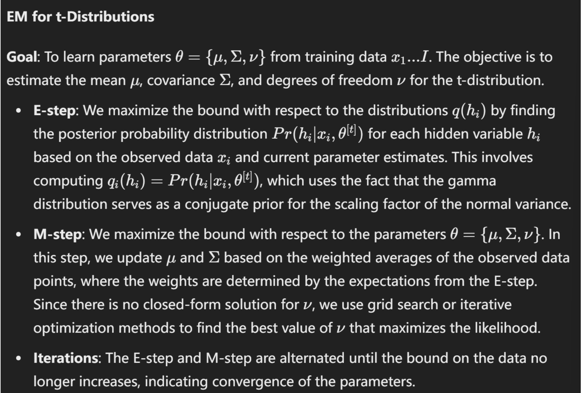

### 4. *What is the factor analysis? How to use Expectation Maximization to solve ~?

$Pr(\mu, \phi\phi^T+\sum)$ where $\phi\phi^T$ is a full ==covariance== model over subspace with the factors (==columns== of the matrix) determining the subspace modeled. $\sum$ is a ==diagonal== matrix that accounts for all remaining variation.

- Goal: to learn the $\theta=[\mu,\phi,\sum]$ from training data $x_1...I$. $\mu$ is mean, $\phi$ is a factor loading matrix, $\sum$ is a unique variation matrix.

- E-step: We maximize the bound with respect to distribution $q_i(h_i)$ by finding the posterior probability distribution $Pr(h_i|x_i,\theta^{[t]})$ of each hidden factor $h_i$ given that the obversed data and current parameter settings. In other word, $Pr(h_i|x_i,\theta^{[t]})$ specifies the contribution of each hidden factor for i-th data point.

- M-step: We maximize the bound with respect to parameters $\theta$. We update $\mu$ by computing the average of data point weighted by posterior expectations of lantent factors from E-step. We update $\phi$ by the covariances captured by latent factors.
- Alternate E and M until….

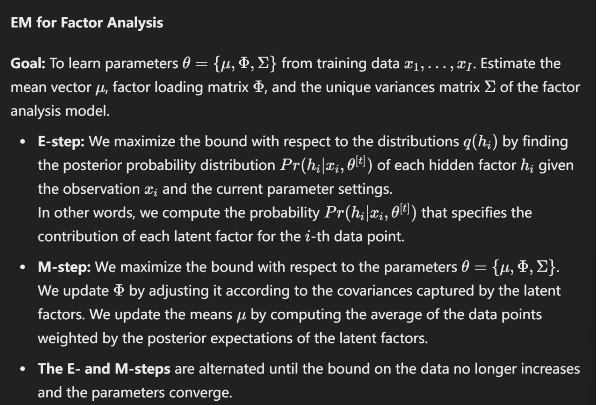

### 5.**What is Mixture of Gaussians (MoG)? How to use EM to solve MoG?**

is described as a weighted sum of k-th normal distribution

- Goal: …. $\sum$ is the variance 

- 
-  