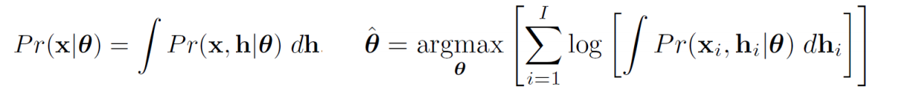
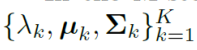
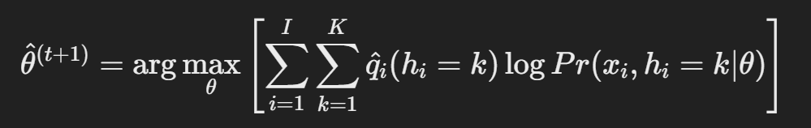
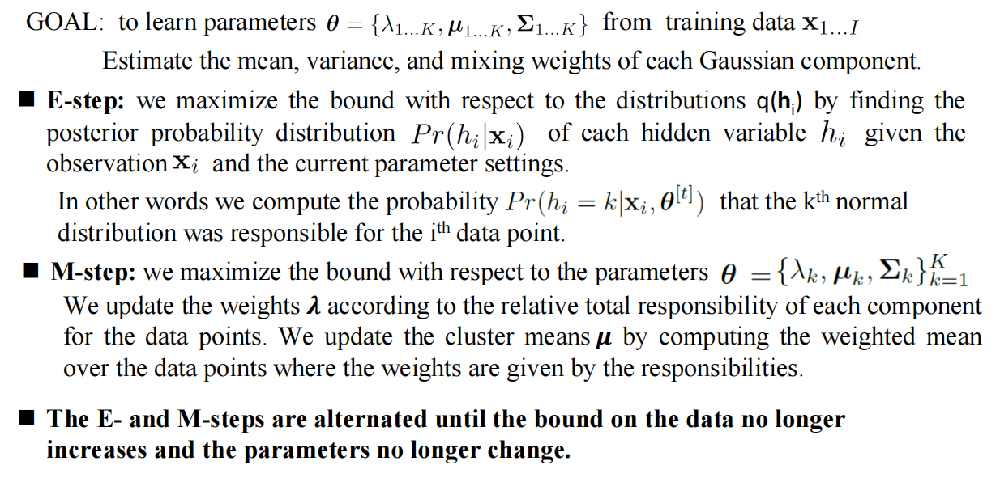
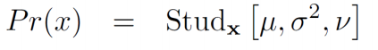
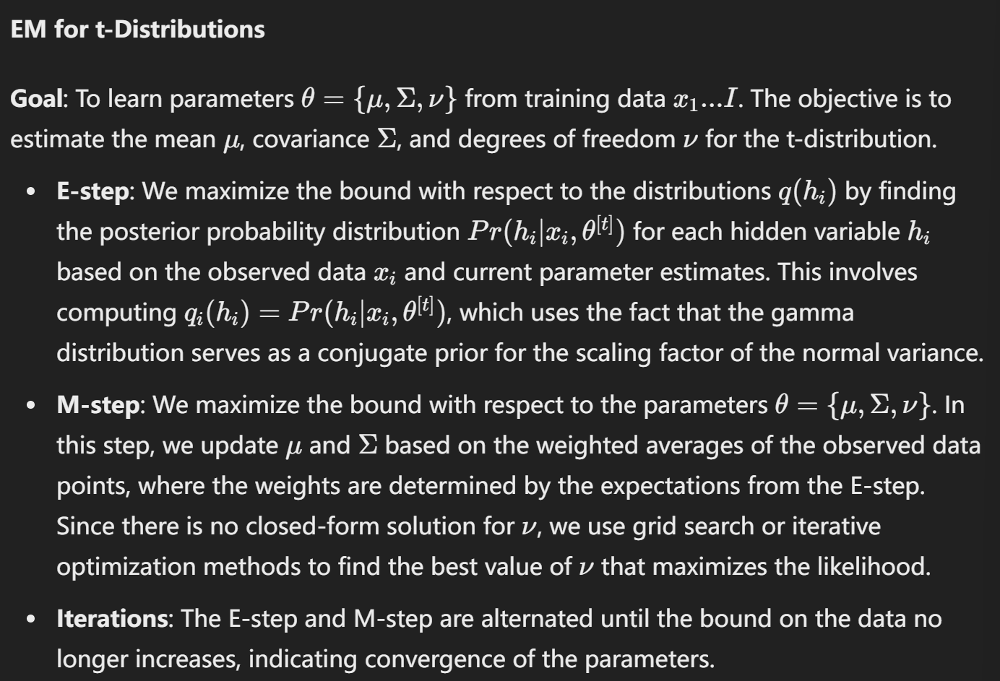
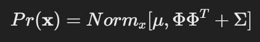
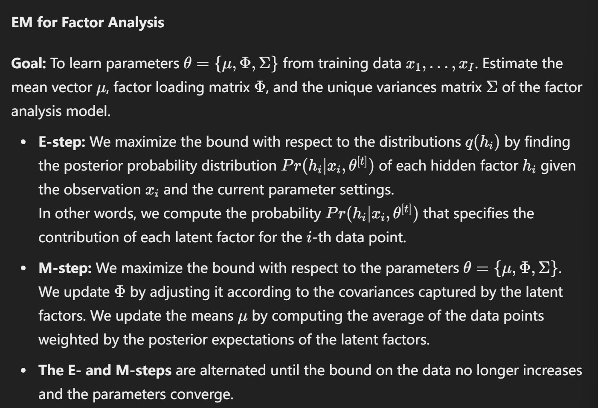

## Lecture 10

- **回归任务：**

    - Both x and w are continuous value
    - choose Linear regression to compute the Pr(w|x) 
    - 我们使用一个 Probability density function to model Pr(w|x) ，因为我们需要检测在一个特定世界状态下数据的分布。
    - 通过 **线性回归** 来直接建模 Pr(x|w)，从而估计数据与世界状态的关系。

    

- **分类任务：**

    - x is continuous while w are categorical, typibally taking value in {0, 1}
    - **Logistic regression** is chosen to compute Pr(w∣x)Pr(w|x)Pr(w∣x), predicting the probability of each category.
    - 对于 Pr(x∣w)，使用 **概率密度函数** 来表示数据在给定类别下的分布情况。

- **总结：**

    - 回归任务中，模型关注的是连续数值之间的关系，通过概率密度函数建模。
    - 分类任务中，模型关注的是数据如何划分到不同的类别，通过逻辑回归和概率密度函数实现分类预测。

    

### 1.1 **What is hidden or latent variables?**

**Key idea:** represent density **Pr(x)** as marginalization of joint density with another **variable h** that we do not see. In other words, hidden variables are unobserved factors within a model that influence the values of observed variables.

Also, depend on some parameters

::: details GPT

**隐藏变量的定义**：

- 隐藏变量是模型中未直接观测到的变量，但它们影响了观测变量的值或数据生成过程。
- 例如，在学生的考试成绩数据中，“学生的学习能力”可以被认为是一个隐藏变量。我们无法直接观测到每个学生的学习能力，但它显然影响了学生的考试成绩。

**隐藏变量的用途**：

- **揭示数据结构**：隐藏变量能够揭示出数据的潜在结构。通过引入这些隐藏变量，可以解释观测数据之间的相关性和结构。
- **降维和信息压缩**：在复杂数据中，隐藏变量常用于将数据从高维空间映射到低维空间。这是降维的一种方式，可以减少数据的复杂度，例如主成分分析（PCA）中隐含的主成分就是一种隐藏变量。
- **分离噪声**：隐藏变量模型有时可以帮助分离出数据中的噪声，进而更准确地反映出数据的真实模式。

**处理隐藏变量的算法**：

- **期望最大化算法（EM算法）**：EM算法是常用来估计带有隐藏变量的模型参数的算法。它包含两步：在“E步”中，估计隐藏变量的分布；在“M步”中，基于估计的分布，最大化参数的对数似然。

:::

### 1.2 What is **Expectation Maximization**?

::: tabs

@tab PPT

@tab GPT 

Expectation Maximization (EM) is an iterative algorithm used in statistics to find maximum likelihood estimates of parameters in models that have latent (hidden) variables or missing data. 

Step:

- Defines **a lower bound** on log likelihood and increases bound iteratively. Lower bound is a *function* of parameters **q** and a set of probability distributions 𝑞𝑖 (𝒉𝑖 )
- E-Step –  Updating the probability distributions {𝑞𝑖 𝒉𝑖 }𝑖 𝐼 =1 to improve the bound.
- M-Step – updating the parameters 𝜃 to improve the bound.

:::

### 1.3 **What are the advantages of EM?**

会出判断题。

### 1.4 **What is Mixture of Gaussians (MoG)? How to use EM to solve MoG?**

#### What is Mixture of Gaussians (MoG)?

The mixture of Gaussians (MoG) is a prototypical example of a model where learning is suited to the EM algorithm. The data are described as a weighted sum of K normal distributions.

#### How to use EM to solve MoG?

::: tabs

@tab 自己总结

1. **Goal**

The goal is "to learn parameters $θ={{λ_1…_k,μ_1…_k,Σ_1…_k}}$ from training data $x_1,…,x_I$."

2. **E-Step**

In the E-step, we fix parameters  $θ$ , maximize bound with respect to (w.r.t.) distributions $q_i(h_i)$ by calculating "the responsibility of the $k^{th}$ Gaussian for the $i^{th}$ data point.

- For each data point $x_i$, we calculate the posterior probability distribution $Pr(h_i=k | x_i, \theta^{(t)})$.

3. **M-Step**

In the M-step, we fix distributions $q_i(h_i)$ ,maximize bound with respect to w.r.t. parameters θ = 

- We compute the updated parameters 
- 
- Then, we updated parameter values. 

4. **Iterate Until Convergence**

Alternates E-steps and M-Steps, until the model parameters converge, the (local) maximum of the actual log likelihood is approached.

@tab PPT

:::

### 1.5 **What is t-distributions? How to use EM to solve t-distributions?**

#### What is t-distributions?

The **Student's t-distribution** is described as a distribution robust against data with heavy tails. It is defined as:

where the degrees of freedom $ν∈(0,∞)$ control the length of the tails; a smaller ν implies a heavier tail, meaning more weight in the tails.

#### How to use EM to solve t-distributions?

### **1.6 What is factor analysis? How to use EM to solve factor analysis?**

#### What is factor analysis? 

The probability density function of a factor analyzer is given by:

where the covariance matrix  $\Phi\Phi^T + \Sigma$  contains a sum of two terms. The first term, $\Phi\Phi^T$ describes a full covariance model over the subspace with the factors (columns of matrix $\Phi$) determining the subspace modeled. The factors are latent variables used to explain the correlations between observed variables. The second term, $\Sigma$, is a diagonal matrix that accounts for all remaining variation.

#### How to use EM to solve factor analysis?

