## Lecture 2 What is Image？

### 1. Image in computer

- Signal： A (multi-dimensional)function that contains information about a phenomenon.

    - Signals can be： 

        - Continuous: light 
        - Discrete（离散的）: measurement（量度） of a light

        - Sampling: reduction of continuous signal to a discrete signal

        - Any phenomenon : Light; Heat; Gravity

- Sampling： Sampling in 1D takes a function and returns a vector whose elements are

    values of that function at the sample points.（一维采样会获取一个函数，并返回一个元素为该函数在采样点上的值的向量。）

    - 1 D：

        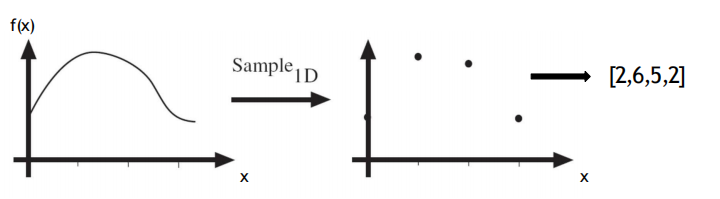

    - 2 D：

        

### 2.  2D image：

To be more specific:

#### 2.1 Resolution 分辨率

#### 2.2 Dimensionality of an Image

- An image of size 1000x1000 with 8-bit quantization per pixel = 256 values ^ (1000 x 1000)

-  All images ever created of size 1000x1000

- Computer vision as making sense of an extremely high-dimensional data. ‘natural’ images are a subspace.

#### 2.3 Images in Python

​                           

- WITH COLOR?

    

### 3. Color

#### 3.1 Spectra of Light Sources

#### 3.2 Linear color spaces: CIE XYZ

- Primaries are *imaginary*, but matching functions are everywhere positive

- The 𝑌 parameter corresponds to brightness or *luminance*

## Lecture 3 Image Filter

### 

### 1. point processing

- Example

    

- data changes (actually)

### 2. Linear shift-invariant filtering ( 线性位移不变的图像滤波 )

- Replace each pixel by a **linear** combination of its **neighbors** (and possibly itself).

- The combination is determined by the filter’s **kernel**.

- The same kernel is *shifted* to all pixel locations so that all pixels use the same linear combination of their neighbors.

#### 2.1 Let’s run the box filter

#### 2.2 Convolution 卷积

- **1D :**

    - **definition**

    

    - **example**

        

    

- **2D :**

    - **definition**

        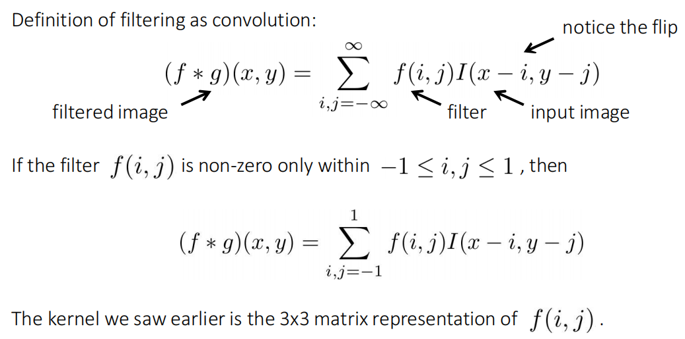

- **Convolution vs correlation of 2D:**

    Convolution: notice the flip

    Correlation: notice the lack of flip

    - Definition:

        

#### 2.3 Separable filters

A 2D filter is separable if it can be written as the product of a “column” and a “row”.

- 2D convolution with a separable filter is equivalent to two 1D convolutions (with the

    “column” and “row” filters).

::: info

可分离滤波会大大增加过滤器的效率。

If the image has M x M pixels and the filter kernel has size N x N:

• What is the cost of convolution with a non-separable filter?      M2 x N2

• What is the cost of convolution with a separable filter?      2 x N x M2

:::

- Example:

    

#### 2.4 Gaussion filter

#### 2.5 2D Gaussion

- Standard deviation 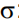: determines extent of smoothing.

可视化：

- The Gaussian function has infinite support, but discrete filters use finite kernels 

    

#### 2.6 Other filters

最后一个就是我们常说的：锐化。

### 3. Image gradients

图像的检测是不连续的。（discontinue）

怎么检测我们的不连续性？Derivative，导数。

或者我们可以用其他变换公式：

#### 3.1 Sober filter

blurring: 使模糊

- Horizontal Sober filter: 水平

    

- Vertical Sober filter: 垂直

    

- To be more specific:

    

#### 3.2 Computing image gradients

1. Your filters?

    

2. Convolve with the image to compute derivatives.

3. Form the image gradient, and compute its direction and amplitude.

#### 3.3 How do you find the edge of this signal? 没看懂。。

#### 3.4 Laplace filter

Basically a second derivative filter.

- We can use finite differences to derive it, as with first derivative filter.

**一阶：导一次**

**二阶：导两次**

- As with derivative, we can combine Laplace filtering with Gaussian filtering

LoG :

- LoG output are “zero crossings” at edges

- 可视化：

    

### 4.  None-linear Filtering

- Gaussian filtering is appropriate for *additive, zero-mean* noise (assuming nearby pixels share the same value)

    

- What about *impulse* or *shot noise,* i.e.*,* when some pixels are arbitrarily replaced by spurious values?

​                                                                       

#### 4.1 What it is?

**Linear filters**: their response of a sum of two signals is the same as the sum of the individual responses. This is equivalent to saying that each output pixel is a weighted summation of some number of input pixels.

**Non-linear: A non-linear combination of neighboring pixels.**

#### 4.2 Median filtering

Median filter, which selects the median value from each pixel’s neighborhood.

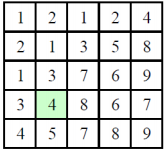

α-trimmed mean: averages together all of the pixels except for the α fraction that are the smallest and the largest.

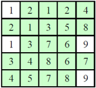

中值滤波器是线性的吗？

#### 4.3 Bilateral filtering

In the bilateral filter, the output pixel value depends on a weighted combination of neighboring pixel values.

在双边滤波器中，输出像素值取决于相邻像素值的加权组合。

#### 4.4 Guided image filtering

## Lecture 4 **Spatial Pyramids**

### 1. The Gaussian pyramid

1. Blur input image with a Gaussian (actually, binomial) low-pass filter.

### 2. The Laplacian Pyramid

- 可以编码可以解码：

- application：

    • Texture synthesis

    • Image compression

    • Noise removal

    • Computing image features (e.g., SIFT)

    • Image Blending…

### 3. Steerable pyramid

- Application

    • Texture synthesis

    • Noise removal

    • Motion analysis

    • Motion synthesis, motion magnification

### 4. Fourier series（傅里叶）

#### 4.1 Basic building block

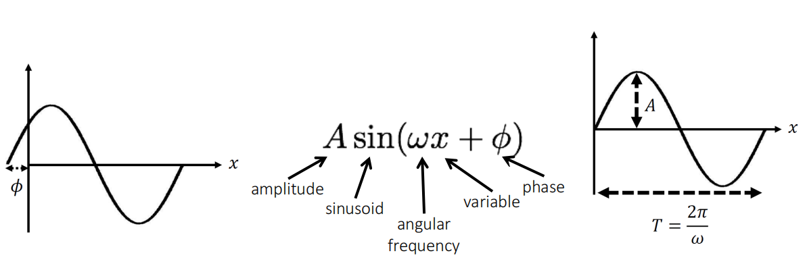

- 我们知道：

- EXAMPLE:

    

- 对于这样一个函数我们怎么合成？

    

    - 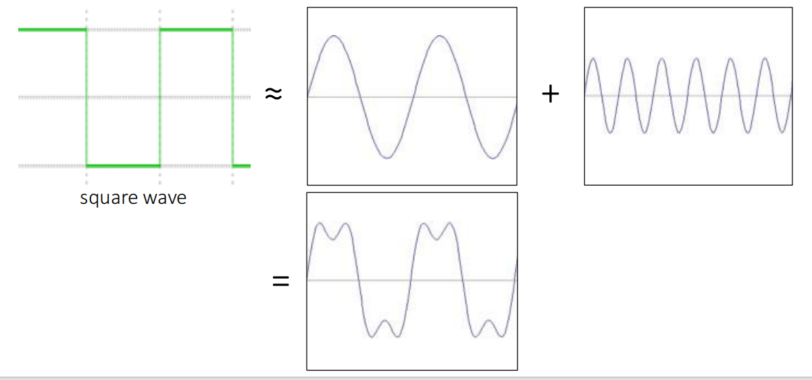

    - 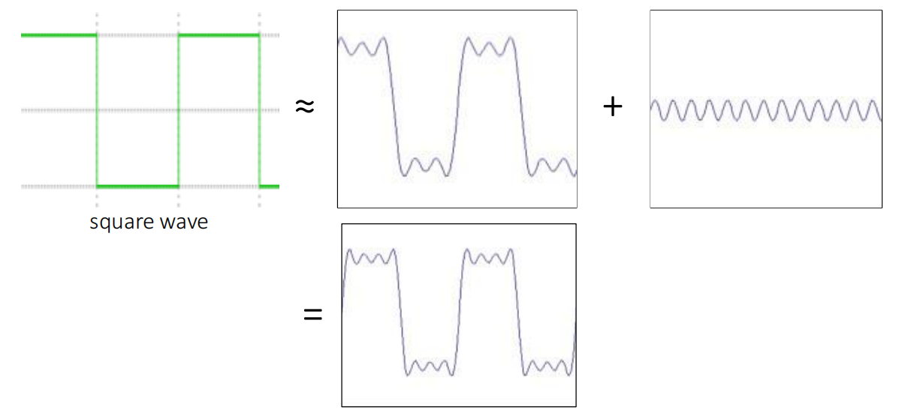

    - 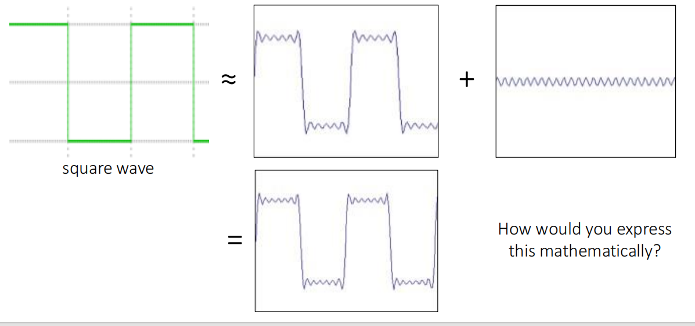

    - How would you express this mathematically? infinite sum of sine waves

        正弦波的无穷和。

        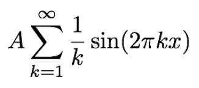

#### 4.2 Frequency domain

#### 4.3 Fourier Transform

##### 4.3.1 1D

也可以写成：

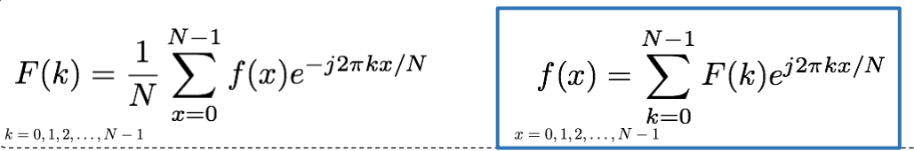

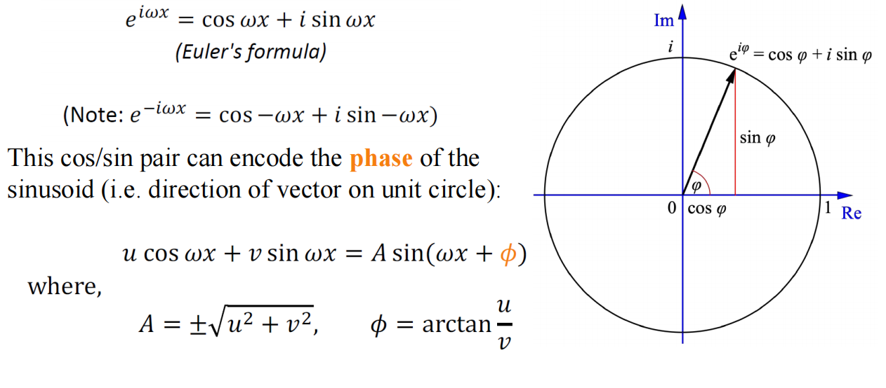

##### 4.3.2 2D

To represent 2D signals 𝑓(𝑥, 𝑦), we need to extend our 1D basis functions to two variables:

**Symmetry**: the Fourier transform of a real-valued image has coefficients that come in pairs, with 𝐹(𝑢, 𝑣) being the complex conjugate of 𝐹(−𝑢,−𝑣)

#### 4.4 Vector Projection

- 什么是矢量投影

    

#### 4.5 The convolution theorem

- The Fourier transform of the convolution of two functions is the product of their Fourier transforms:

    

- The inverse Fourier transform of the product of two Fourier transforms isthe convolution 

    of the two inverse Fourier transforms:

    
