## 1. Lecture 5 : Affine Transformations

- Affine transformations are combinations of  arbitrary (4-DOF) linear transformations（线性变换）, and translations（平移）

- Properties of affine transformations:

    • origin does not necessarily map to origin

    • lines map to lines

    • parallel lines map to parallel lines

    • ratios are preserved

    • compositions of affine transforms are also affine transforms

==计算公式：==

​                                                                                                      **T(x) = xA + b**

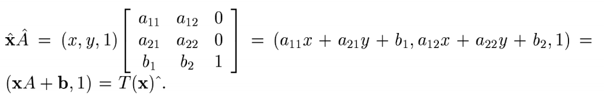

==例子：==

## 2. Lecture 6

### 2.1 What is Interest Point?

- 选择 兴趣点 的原则:

    - Repeatability : The same feature can be found in several images despite geometric and photometric transformations.
    - Saliency : Each feature is distinctive
    - Compactness and efficiency : Many fewer features than image pixels
    - Locality : A feature occupies a relatively small area of the image; robust to clutter and occlusion

    

### 2.2 What is Harris Corner? How to get it?

#### 1. GPT

==**什么是 Harris 角点检测？**==

Harris 角点检测是一种在计算机视觉中用于检测图像中**角点**或**特征点**的算法。角点是图像中在两个方向上都有显著强度变化的区域，这使它们成为图像匹配、跟踪和物体识别等任务的理想特征。

Harris 角点检测的基本思想是：在角点周围的区域中，无论向哪个方向移动观察窗口，都会导致**较大的强度变化**。相对而言，边缘上的强度变化只在一个方向上显著，而在平坦区域中，几乎没有强度变化。

==**关键点：**==

1. **角点**是图像梯度在两个方向（x 和 y）上都有显著变化的区域。
2. **边缘**在一个方向上有显著变化。
3. **平坦区域**几乎没有强度变化。

==**如何获得 Harris 角点？**==

Harris 角点检测算法的步骤可以总结如下：

1. **计算图像梯度**：通过通常使用 Sobel 算子，计算图像的**水平**和**垂直梯度**，得到两个梯度图像：
   - \( I_x \)（x 方向的梯度）
   - \( I_y \)（y 方向的梯度）

2. **计算结构张量矩阵**：对于图像中的每个像素，基于图像梯度构建一个**结构张量矩阵**：
   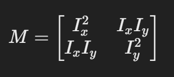
   这个矩阵包含了该像素周围区域在 x 和 y 方向上强度变化的信息。
   
3. **计算 Harris 响应值 (R)**：通过结构张量的特征值，计算 Harris 响应函数。常用的公式为：
   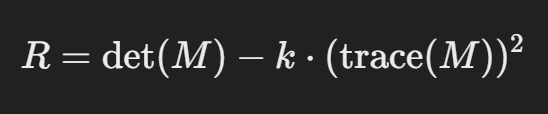
   其中：
   - det(M) 是矩阵 \(M\) 的行列式
   - trace(M) 是矩阵 \(M\) 的迹（对角线元素之和）
   - \(k\) 是一个经验常数，通常设置在 0.04 到 0.06 之间
   
4. **阈值化**：计算每个像素的 Harris 响应 \(R\) 之后，应用阈值化操作来确定哪些点是图像中的角点。通常，如果 Harris 响应值超过某个阈值，该点即被认为是角点。

5. **非极大值抑制**：在阈值化之后，应用非极大值抑制以确保在局部区域内只保留最强的角点，从而减少相邻像素间的重复检测。

==**Harris 角点检测公式解析**==

对于每个像素，Harris 响应矩阵 \(M\) 定义为：

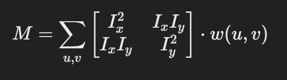

其中：
- \(I_x\) 和 \(I_y\) 分别为 x 和 y 方向的梯度。
- w(u, v) 是一个窗口函数（通常是高斯核），根据距离中心像素的远近为梯度加权。

然后，Harris 响应函数计算为：

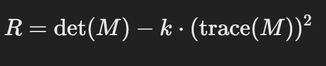

其中：
- det(M) 是矩阵 \(M\) 的行列式，表示梯度向量所生成的平行四边形的面积。
- trace(M) 是矩阵 \(M\) 的迹（对角线元素的和），它提供了关于梯度整体强度的信息。
- \(k\) 是一个常数，通常在 0.04 到 0.06 之间。

==**Harris 角点检测的步骤示例：**==

1. 将图像转换为灰度图。
2. 使用 Sobel 滤波器计算梯度图像 \(I_x\) 和 \(I_y\)。
3. 计算每个像素的梯度乘积 \(I_x^2\)、\(I_y^2\) 和 \(I_x I_y\)。
4. 对梯度乘积应用高斯滤波进行平滑。
5. 计算每个像素的 Harris 响应 \(R\)。
6. 对响应值进行阈值化以识别角点。
7. 进行非极大值抑制以获得最终的角点集合。

#### 2. ppt

1. Compute x and y derivatives of image

    

2. Compute products of derivatives at every pixel

    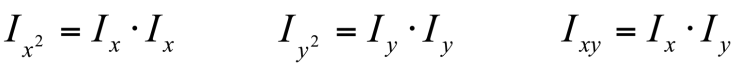

3. Compute the sums of the products of derivatives at each pixel

4. Define the matrix at each pixel

    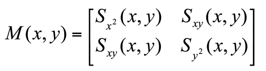

5. Compute the response of the detector at each pixel

    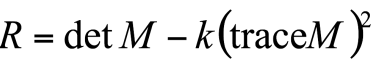

6. Threshold on value of R, compute non-max suppression.

- 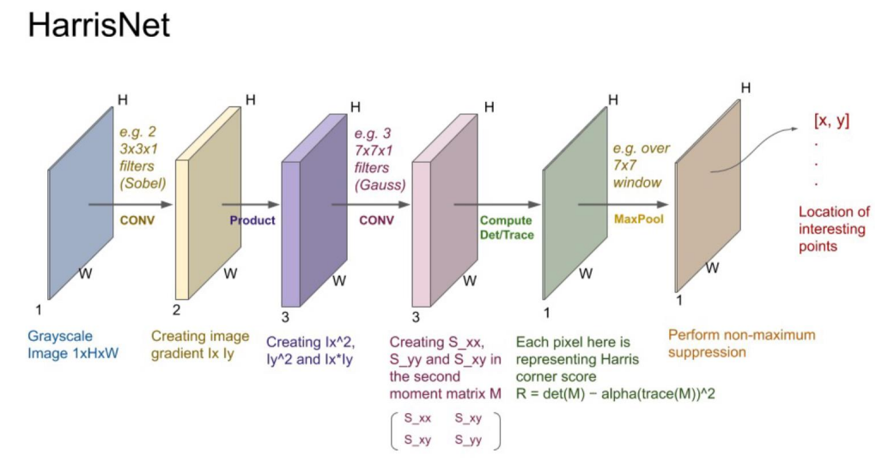

 ### 2.3 SIFT Detector and Descriptor —— Scale Invanriant Feature Transform

#### 2.3.1 基本信息

- 选取关键点后，这些关键点 invariant to scale and rotation.
- Also, Lowe aimed to create a descriptor that was robust to the variations corresponding to typical viewing conditions. The descriptor is the most-used part of SIFT.

- Image content is transformed into local feature coordinates that are invariant to translation, rotation, scale, and other imaging parameters. (图像的内容进行平移，旋转，放大缩小的变换)

- Advantages：
    - 局部性 Locality
    - 独特性：单一特征与整个数据库比对 Distinctive
    - Quantity 一个简单的关键点也可以生成大量不同特征
    - Efficiency
    - Extensibility

#### 2.3.2 Step 1 —— Scale-space extrema detection

- Goal: Identify locations and scales that can be repeatably assigned under different views of the same scene or object.

::: details Chinese

同一个视图（物体）在不同的位置和比例也可以检测到。

:::

-  Method: search for stable features across multiple scales using a continuous function of scale.

::: details

用一个比例的连续函数检测在不同比例下的稳定的特征。

:::

- Prior work has shown that under a variety of assumptions, the best function is a Gaussian function.

::: details

我们用一个高斯函数来做这个工作

:::

The scale space of an image is a function *L(x,y,****)* that is producedfrom the convolution of a Gaussian kernel (at different scales) with the input image

::: tabs

@tab 为什么选择高斯函数？

高斯函数在图像处理中的一个关键作用是创建图像的**尺度空间**，即在不同尺度下搜索稳定的特征。通过高斯函数，可以实现对图像进行多尺度分析，以便找到那些在不同尺度下都稳定存在的特征。具体来说，高斯函数可以做到这一点的原因有以下几个方面：

- **高斯模糊和图像卷积** 

    高斯函数是一种平滑函数，当我们对图像进行高斯模糊（Gaussian Blur）时，其实是将图像与一个高斯核进行**卷积**操作。这个过程可以平滑图像，消除噪声，同时保留图像的主要结构。高斯模糊有一个重要的性质：它能够根据不同的尺度（即高斯函数的标准差 \(\sigma\)）对图像进行平滑处理。

- **尺度空间**

    尺度空间的概念是为了处理图像中不同大小的特征点（例如角点、边缘等），通过对图像使用不同尺度的高斯核进行卷积，生成多个版本的图像，每个版本对应于不同的尺度。这个过程使得我们能够在不同的尺度下检测图像特征，因为在某些尺度下，特征可能会更加明显或稳定。

数学上，图像的尺度空间 \( L(x, y, \singema) \) 表示的是通过与不同尺度的高斯核 \( G(x, y, \singema) \) 卷积后的图像：
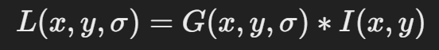
其中 \( I(x, y) \) 是输入图像，\( G(x, y, \sigma) \) 是高斯核，\(\sigma\) 控制高斯模糊的程度（即尺度)。

- **高斯函数的性质**

    高斯函数的一个重要性质是，它的卷积操作具有**平滑性**和**尺度变换的连续性**。这意味着：

    - 当 \(\sigma\) 变小时，我们在图像中可以捕捉到细节更多的特征。

    - 当 \(\sigma\) 变大时，图像中的噪声和细小结构会被抹去，只留下大尺度的结构特征.

        通过在多个尺度下应用高斯函数，可以有效地捕捉到那些在多种尺度下都保持稳定的特征。也就是说，特征在不同尺度下“稳定”存在，这就是图像特征的**尺度不变性**。

- **总结**

    高斯函数通过在不同尺度下平滑图像，可以构建图像的尺度空间。在这个过程中，我们能够检测到那些在不同尺度下都保持稳定的特征，这就是如何通过高斯函数来实现多尺度特征提取的原理。

@tab ppt 图片解释

1. **尺度空间（Scale Space）** 被分为 **octaves（八度）**。

    第一个八度使用尺度 σ。

    第二个八度使用尺度 2σ。

    后续八度依次类推。

2. 在每个八度中，原始图像被重复地与不同尺度的高斯核进行卷积，产生一组尺度空间图像。

3. 相邻的高斯图像相减，得到差分高斯（DOG，Difference of Gaussians）图像。

4. 在每个八度结束时，高斯图像通过下采样，大小缩小为原图的四分之一，开始下一层八度的计算。

:::

#### 2.3.3 Step 2 —— Key point localization

::: tabs

@tab

- 差分高斯（DoG）极值检测：
    - 这张图的核心是在**尺度空间中检测DoG的极大值和极小值**。
    - 在每一个点，它都会和当前图像中的8个邻居进行比较，以及尺度上下的9个邻居进行比较，以此来确定该点是否是一个局部极值。
    - 对于每个找到的极大值或极小值，输出该点的**位置**和**尺度**，这为后续的特征点描述提供了基础

@tab

图中展示了在32张经过合成变换和噪声添加的图像上进行的实验结果。

左侧图：表示在不同的尺度下，检测到的特征点的比例（% detected）和正确匹配的比例（% correctly matched）。

- 稳定性随着检测尺度的增加而增加，但是到了一定的尺度数量后，稳定性趋于平稳。

右侧图：表示在不同的尺度下，检测到的特征点总数（average no. detected）和成功匹配的特征点数量（average no. matched）。

- 随着检测的尺度数增加，检测到的特征点总数增加，但匹配的特征点数量也有限度。

总结：**对于效率的考虑，通常使用3个尺度采样可以找到最大数量的稳定关键点**，超过或小于这个数都会影响性能。

@tab

- Once a keypoint candidate is found, perform a detailed fit to nearby data to determine location, scale, and ratio of principal curvatures

- In initial work keypoints were found at location and scale of a central sample point.

- In newer work, they fit a 3D quadratic function to improve interpolation accuracy.

- The Hessian matrix was used to eliminate edge responses

::: detail

一旦找到一个关键点候选点，会对邻近数据进行详细拟合，以确定该关键点的**位置**、**尺度**以及**主曲率比**。

最初的工作中，关键点是根据中央样本点的**位置和尺度**来确定的。

新的工作中，使用了**3D二次函数**来提高插值的准确性。

同时，使用**Hessian矩阵**来消除边缘响应，进一步提高关键点的鲁棒性。

:::

#### 2.3.4 Step 3 —— Orientation assignment

Compute the gradient magnitudes and orientations in a small  window around the keypoint—at the appropriate scale.

::: info

- Create histogram of local gradient directions at selected scale

- Assign canonical orientation at peak of smoothed histogram

- Each key specifies stable 2D coordinates (x, y, scale,orientation)

:::

#### 2.3.5 Step 4 —— Keypoint Descriptors

◼ At this point, each keypoint has

 ❑ location

 ❑ scale

 ❑ orientation

◼ Next is to compute a descriptor for the local image region about each keypoint that is

 ❑ highly distinctive

 ❑ invariant as possible to variations such as changes in viewpoint and illumination

::: details

- 此时，每个关键点都有
    - 位置
    - 比例尺
    -  方向

- 下一步是计算关于每个关键点的局部图像区域的描述符，即
    - 高度独特
    - 尽可能不受视角和光照变化等因素的影响

:::

1. Take a 16 x16 window around interest point (i.e., at the scale detected).

2. Divide into a 4x4 grid of cells. 

3. Compute histogram of image gradient directions in each cell (8 bins  each).

::: details

在兴趣点周围（即检测到的比例尺处）开一个 16 x 16 的窗口。

划分为 4x4 网格的单元。

计算每个单元格中图像梯度方向的直方图（每个单元格 8 个分区）。

:::

- Example:
    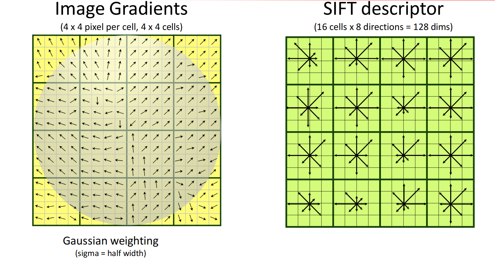

- 步骤：
    1. use the normalized region about the keypoint
    2. compute gradient magnitude and orientation at each point in the region
    3. weight them by a Gaussian window overlaid on the circle
    4. create an orientation histogram over the 4ⅹ4 subregions of the window
    5. 4 X 4 descriptors over 16 X 16 sample array were used in practice.
    6. 4 X 4 times 8 directions gives a vector of 128 values.

::: details

**区域归一化**：在特征点附近的归一化区域内进行特征描述符的计算，以确保特征的尺度和旋转不变性。

**梯度计算**：在特征点周围的每个像素处计算梯度的幅度和方向，这帮助提取特征点的方向性信息。

**加权**：将一个高斯窗口叠加在区域上，使得离特征点较远的梯度贡献较小，从而突出了特征点周围的强特征。

**方向直方图**：将该区域划分为4×4的子区域，在每个子区域中统计8个方向的梯度方向直方图。

**128维向量生成**：最终生成4×4×8 = 128维的特征向量，以描述该特征点的局部特性。

:::

### 2.4 GIST descriptor

1. Compute filter responses (filter bank of Gabor filters)
2. Divide image patch into 4 x 4 cells
3. Compute filter response averages for each cell
4. Size of descriptor is 4 x 4 x N, where N is the size of the filter bank

::: details

:::

::: info Gabor filters？

:::

### 2.5 Histogram of Gradient Orientations(HOG)

#### 2.5.1 Step 1 Image Processing

• Patches can be any size, but there is a fixed ratio, for example, when the patch aspect ratio is 1:2, the patch size can be 100*200, 128*256 or 1000*2000 but not 101*205.

• Here is a picture of 720*475, we choose a patch of 100*200 size to calculate the HOG feature, cut out this patch from the image, and then adjust the size to 64*128.

#### 2.5.2 Step 2

Find horizontal and vertical gradients, gradient magnitude and orientations 

#### 2.5.3 Step 3

1. **图像划分与滑动窗口**：将图像分成 8x8 像素的单元格，然后使用 2x2 的块作为滑动窗口。这样做的目的是对图像进行局部区域的分析，每个区域能够反映该区域的梯度信息。（“8x8 的单元格”代表图像被分成小区域，“2x2 的滑动窗口”表示在8x8区域内的更细粒度滑动，这样可以获得更丰富的梯度信息并保持计算的局部一致性。）

2. **梯度方向与幅值的计算**：对于每个像素，计算其梯度的幅值和方向。每个像素的梯度方向和幅值可以帮助捕捉图像边缘和纹理的方向。

3. **量化梯度方向**：将梯度方向量化成 9 个方向区间（20°到160°），每个区间代表一个方向“桶”（bin），然后根据幅值分布对方向区间内的像素进行统计。量化后的方向信息被记录在直方图中，以便后续进行特征描述。

4. **特征直方图的压缩表示**：每个块（2x2的单元格）内的像素梯度方向和幅值被量化并统计成一个方向直方图。这样的表示方式既能够简化数据，同时保留了足够的边缘和轮廓信息。举例来说，如果一个图像是 8x8 大小，每个像素有三通道值，那么最终的HOG特征将会形成一个包含128维度的特征向量。

5. **可视化**：图中用箭头表示了梯度方向，箭头的长度表示梯度的幅值。右下角的直方图展示了量化后的梯度方向和幅值，这种表示方式能够帮助HOG特征在不同尺度下获得鲁棒性。

#### 2.5.4 Step 4，5

step 4：16*16 block normalization

step 5：Concatenate histograms into a feature of : 15 x 7 x 4 x 9 = 3780 dimensions （7：horizontal；15：vertical）

#### 2.5.5 Summary

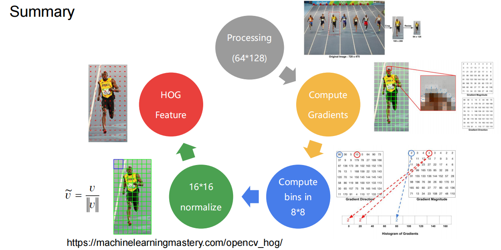

## 3.  Lecture 7

### 3.1 What is bag of features? What about the steps of BOG?

#### 3.1.1  Step

1. Extract local features
2. Learn “visual vocabulary”
3. Quantize local features using visual vocabulary
4. Represent images by frequencies of “visual words

#### 3.1.2  Local feature extraction

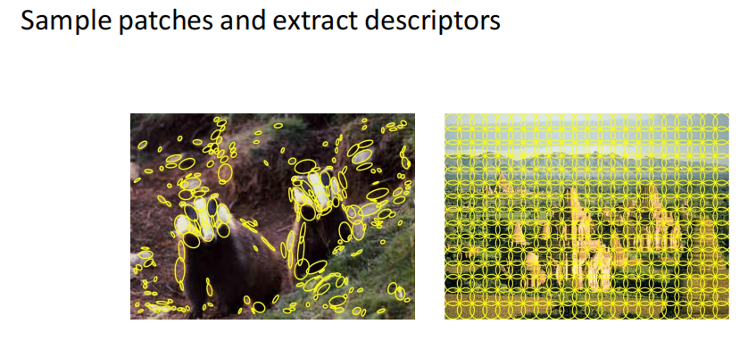

#### 3.1.3 Learning the visual vocabulary

视觉词汇就是通过聚类提取的局部特征集合，每个视觉单词对应一个聚类中心。通过这些视觉单词的频率，可以用直方图的形式来表示图像的特征。

- 具体步骤

Extracted descriptors from the training set （左上角）

::: info 

在提取的描述子上应用聚类算法，将相似的特征聚集在一起，以创建视觉词汇表。每个聚类中心就代表了一个“视觉单词”。

右图中的彩色点表示将描述子经过聚类后，形成了不同类别的视觉单词。

:::

#### 3.1.4 **Quantize local features using visual vocabulary** and

- 怎么聚类？ K-means clustering

    **Goal**: minimize sum of squared Euclidean distances between features **x**i and their nearest cluster centers **m**k

    

​                                            

#### 3.1.5 **Represent images by frequencies of “visual words”**

- ==**Spatial pyramid**==

    ::: tabs

    @tab Level 0

    

    

    @tab Level 1

    

    @tab Level 2

    

    :::

    ::: info
    
    将聚类得到的视觉词汇转换为图像的直方图，一般按照以下步骤来进行：
    
    ==步骤==
    
    1. **构建视觉词汇表**：
       - 使用特征提取算法（例如SIFT）从一组图像中提取局部特征。
       - 将所有图像的特征汇总，并使用聚类算法（通常是K-means）将这些特征分成若干个簇。每个簇的中心代表一个“视觉单词”。
       - 这样得到一个视觉词汇表，包含所有“视觉单词”。
    
    2. **量化图像特征**：
       - 对于每一张待量化的图像，再次提取其局部特征（例如SIFT特征）。
       - 将图像中的每个特征与视觉词汇表中的视觉单词进行比较，找到最近的视觉单词（即距离最近的簇中心）。
       - 记录每个视觉单词出现的次数。
    
    3. **生成直方图**：
       - 初始化一个直方图，其维度等于视觉词汇表中视觉单词的个数，每个维度的初始值为0。
       - 对于图像中的每个特征，根据找到的最近视觉单词的编号，将该编号对应的直方图位置的值加1。
       - 最后，得到的直方图就是该图像的“词频”表示，即每个视觉单词在该图像中的出现频率。
    
    4. **归一化**（可选）：
       - 为了避免图像大小对直方图的影响，可以将直方图归一化，使其所有值的和为1。
    
    ==示例==
    
    假设我们有一个视觉词汇表，共10个视觉单词编号为0到9，表示一个图像中的特征量化结果为[1, 2, 3, 3, 5, 8, 8]。我们构建一个10维的直方图，将相应编号的计数加1：
    
    - 初始化直方图：`[0, 0, 0, 0, 0, 0, 0, 0, 0, 0]`
    - 填充直方图：
       - 视觉单词1出现1次 -> `[0, 1, 0, 0, 0, 0, 0, 0, 0, 0]`
       - 视觉单词2出现1次 -> `[0, 1, 1, 0, 0, 0, 0, 0, 0, 0]`
       - 视觉单词3出现2次 -> `[0, 1, 1, 2, 0, 0, 0, 0, 0, 0]`
       - 视觉单词5出现1次 -> `[0, 1, 1, 2, 0, 1, 0, 0, 0, 0]`
       - 视觉单词8出现2次 -> `[0, 1, 1, 2, 0, 1, 0, 0, 2, 0]`
    
    最终得到的直方图表示为`[0, 1, 1, 2, 0, 1, 0, 0, 2, 0]`。
    
    ==结果==
    
    通过这种方式，我们将图像转换为视觉词汇的直方图表示，形成固定长度的特征向量，可以用于进一步的分类和比较。
    
    可以根据图片内容生成一些直方图。每个层级的特征通过直方图表示，随着层次的增加，特征的分辨率变高，可以捕捉更细粒度的图像信息。
    
    :::

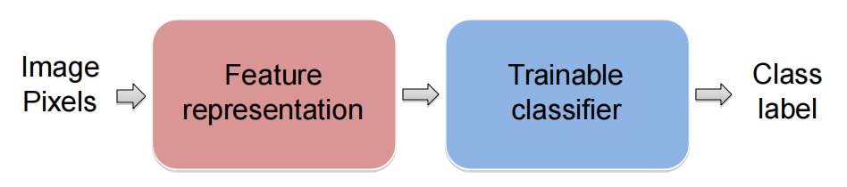

- 这个过程就是，首先从图像中提取特征（一般是手工设计的特征），然后通过可以训练的分类器进行分类。常见的特征表示方法包括边缘、纹理等手工特征，而分类器可以是支持向量机（SVM）、K-近邻（KNN）等。

#### 3.1.6 对直方图进行分类处理

分类器：

::: tabs

@tab K-nearest neighbor classifier

- ==**K-nearest neighbor classifier 工作原理：**==

    给定一个测试样本，通过计算它与训练集中每个样本的距离，找到与之距离最近的训练样本，并将最近样本的标签赋予测试样本。这种方法不需要训练，只需要一个距离或相似度度量。

    

    我们这里用来比对的是（之一）欧几里得距离和余弦距离：

    

    ::: details

    K-最近邻（KNN）分类器 是一种基于实例的学习方法。它不需要训练模型，而是在分类时直接使用训练数据。KNN通过计算新数据点与训练集中所有数据点之间的距离来找到最近的kkk个点，然后通过这些点的标签来决定新数据点的类别。KNN通常使用欧几里得距离，但也可以使用其他距离度量。

    

    :::

    ::: info

    如果我们用直方图来进行比对，有一些特定的公式可以把从图片上提取的直方图和一下特定样本比对：

    

    :::

@tab Linear classifier

- ==**线性分类器—— Linear classifiers**==

    线性分类器的主要步骤如下：

    1. **定义线性函数**：假设线性分类器的形式为
                                                            f(x) = w * x + b
       其中，\( w \) 是权重向量，\( x \) 是输入样本特征向量，\( b \) 是偏置。目标是找到最优的\( w \)和\( b \)，以便将不同类别的数据分开。

    2. **选择损失函数**：根据具体的分类器选择损失函数。例如：
       - 感知机：基于误分类损失。
       - 支持向量机（SVM）：基于最大化分类间隔的 hinge 损失。
       - 线性回归：可以用于分类，但通常通过最小化均方误差来优化。

    3. **优化权重和偏置**：使用梯度下降或其他优化算法最小化损失函数，找到最优的权重\( w \)和偏置\( b \)。例如，在支持向量机中，优化的目标是找到一个最大化分类间隔的分隔超平面。

    4. **预测**：对于一个新的样本\( x \)，计算其分类分数

       ​                                                       f(x) = w * x + b

       根据分数的符号来确定类别。通常，正数表示一种类别，负数表示另一种类别。

    5. **评估**：使用验证数据集或交叉验证等方法来评估分类器的性能，并根据需要调整参数以提高模型的泛化能力。

    **总结**

    线性分类器的基本步骤可以归纳为：定义线性模型，选择损失函数，优化模型参数（权重和偏置），然后利用优化后的模型进行预测。

@tab Nearest neighbor VS Linear classifiers

  

@tab Support Vector Machines

这些分隔线都能够将红色点和棕色点正确分类，因为数据是线性可分的。

但问题是，哪一条分隔线才是最佳的？SVM的目标是找到一个**最优超平面**，这个超平面不仅能分隔两类数据，还能最大化与两类样本之间的间隔（称为“间隔最大化”）。选择间隔更大的分隔线可以提高模型的鲁棒性，对未来数据分类的准确性也更高。

SVM可以通过在高维空间中寻找线性分隔面，进而在原始空间形成非线性边界来解决这个问题。此方法利用了**核函数**，将原始的特征映射到更高维的特征空间，使得在该空间内可以找到一个简单的线性决策边界。

- Example：

    

    图中展示了一个较为复杂的分类问题。在这个例子中，决策边界是曲线的，而不是简单的直线，这是因为数据不是线性可分的。图中展示的是对“人脸”与“非人脸”分类的问题，经过复杂特征的学习后，形成了一个复杂的决策边界，从而可以在原始的空间中精确地区分两类数据。

@tab 如何训练一个分类器

• Goal: obtain a classifier with **good generalization** or performance on never before seen data

1. Learn *parameters* on the **training set**
2. Tune *hyperparameters* (implementation choices) on the*held out* **validation set**

3. Evaluate performance on the **test set**

​               • – Crucial: do not peek at the test set when iterating 

​               steps 1 and 2!

这张幻灯片讲解了机器学习模型的训练和评估流程，目的是得到一个**具有良好泛化能力的分类器**，即在从未见过的数据上也能保持较好的性能。具体步骤如下：

1. **在训练集上学习参数**：
   - **训练集（Training Set）**用于模型的训练。模型会在这个数据集上学习到特定的参数，以便能够尽可能准确地拟合训练数据。
   - 在这个过程中，模型内部的参数（如权重）会根据数据进行调整，以最小化预测误差。

2. **在验证集上调整超参数**：
   - **验证集（Validation Set）**通常是从训练数据中分离出的一部分数据，不用于直接的参数学习，而是用于调整**超参数**。
   - 超参数是模型构建时的某些设置选项，比如树的深度、学习率等。这些超参数不在训练过程中自动调整，而是由用户通过实验来手动优化。
   - 验证集用于检查模型在不同超参数下的表现，从而帮助选择最佳的超参数组合。
   - 需要注意的是，验证集数据不会影响模型的参数，而仅用于选择模型结构。

3. **在测试集上评估模型性能**：
   - **测试集（Test Set）**是用来评估模型最终性能的数据。它是完全隔离的数据集，模型在之前的训练和验证过程中都没有见过这部分数据。
   - 测试集的主要目的是提供一个客观的标准来衡量模型的泛化能力。
   - **重要提醒**：在整个模型的训练和验证过程中，绝对不能提前查看测试集的结果，因为这样会导致数据泄露，使得测试结果的客观性受到影响。

这几张图片展示了模型训练过程中数据的分割和验证过程，特别强调了如何通过合理的数据集划分来优化模型的泛化能力和防止过拟合。

1. **不建议直接使用测试集调参**：
   - 第一张图表明，用测试集来调试和选择超参数是一种不好的做法，因为测试集应该作为模型最终性能的验证，不应该参与模型的训练过程。测试集是模型最终评估的代理，用于反映模型对全新数据的泛化性能，只有在最终评估时才少量使用。

2. **分割训练集和验证集**：
   - 第二张图展示了一种更好的做法，即将训练数据进一步分割为不同的“折”（fold）用于交叉验证。通常，我们将一部分数据保留为验证集，其他数据用于训练。然后使用该验证集来优化模型的超参数，而测试集仅在最后用于最终模型的性能评估。

3. **交叉验证（Cross-validation）**：
   - 第三张图展示了交叉验证的方法。交叉验证将训练数据集划分为多个部分（例如五折交叉验证）。每次选择一个“折”作为验证集，其他折用于训练模型，依次轮换，直到每个折都做过一次验证集。最后将各折的结果平均，得到模型的整体性能。这样可以更好地评估模型的稳定性和泛化能力。

这套流程确保了模型的性能评估尽量客观，使得模型不仅在当前数据上表现良好，也能够在全新数据上具有良好的泛化性能。

:::

#### 3.1.5 Summar

1. **Extract Local Features** from images.
2. **Cluster Features** to form a visual vocabulary (create visual words).
3. **Quantize Features** of each image based on the visual vocabulary.
4. **Build Histograms** of visual words to represent each image.
5. Optionally, **Classify** images using these histograms as feature vectors.

This approach allows images to be represented by fixed-size vectors, making them suitable for machine learning models that require fixed-length inputs, regardless of the number of keypoints detected in each image.

### 3.2 Choose recognize model

**We have many images, these images contains grass, person,** **building. Now we want to classify them into three classes.** **How can we design the recognition model? What is the steps?**

::: tabs

@tab 自己话总结

1. 首先提取兴趣点，做标签（通常是手动的）
2. 提取特征向量描述（兴趣点附近）
3. 我们可以用 SIFT 算法生成一个描述符，使其经过平移，旋转，放大缩小，也能检测出来。
4. 通过 SIFT 检测出的特征描述符聚类（用一些聚类算法）成“视觉单词”，并生成词频直方图表示图像。
5. 再用 SVM 或 KNN 把生成的不同图片的直方图与元特征进行比对，进行分类。

:::
