## Lecture 8

### 1.1 Random Variable

Discrete :

Continuous :

### 1.2 Joint Probability

• Written as Pr(𝑥, 𝑦)

• Can read Pr(𝑥, 𝑦) as “probability of x and y ”

### 1.3 Marginalization

::: details

这张幻灯片介绍了概率中的边缘化（Marginalization）概念。边缘化是从联合概率分布中获得单一变量的概率分布的方法。

**具体解释：**

1. **联合分布**：
   - 在图像中心，我们可以看到一个二维的联合概率分布 \( Pr(x, y) \)，用来表示变量 \( x \) 和 \( y \) 的联合分布情况。亮度越高的区域表示联合分布的概率值越大。

2. **边缘概率**：
   - 边缘化的过程是通过将联合分布 \( Pr(x, y) \) 中其他变量积分（或求和）以得到感兴趣变量的概率分布。
   - 例如，我们可以通过对 \( Pr(x, y) \) 在 \( y \) 上积分来获得 \( x \) 的边缘分布 \( Pr(x) \)：
     \[
     Pr(x) = \int Pr(x, y) \, dy
     \]
   - 同样，通过对 \( Pr(x, y) \) 在 \( x \) 上积分来获得 \( y \) 的边缘分布 \( Pr(y) \)：
     \[
     Pr(y) = \int Pr(x, y) \, dx
     \]

3. **图示**：
   - 下面右侧的图示展示了边缘化的效果。我们从二维联合分布 \( Pr(x, y) \) 中分别得到 \( Pr(x) \) 和 \( Pr(y) \) 的单独分布。
   - 在顶部和左侧的曲线分别表示 \( Pr(x) \) 和 \( Pr(y) \) 的分布，即分别将 \( y \) 和 \( x \) 变量“边缘化”之后的概率密度函数。

4. **直观理解**：
   - 可以把边缘化理解为在二维分布上“投影”到单个轴上。例如，计算 \( Pr(x) \) 时，相当于将 \( y \) 方向上的分布“压扁”或“合并”，从而得到一个仅与 \( x \) 相关的概率分布。

**应用：**

边缘化广泛应用于概率和统计学中，用来计算单一变量的分布，即使在实际中我们关注的是联合分布。

:::

在更高维也可以用边缘分布——leaves joint distribution between whatever variables are left

### 1.4 Conditional Probability

• Conditional probability can be extracted from joint probability

• Extract appropriate slice and normalize

- 求解公式：

    

- 延伸至高阶

    

### 1.5 Bayes' Rule

### 1.6 Independence

- When variable are independent:

    Pr(x, y) = Pr(x|y)Pr(y) = Pr(x)Pr(y)

### 1.7 Expectation

**期望是什么：**

- 离散时：

    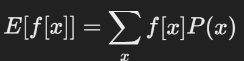

- 连续时:

    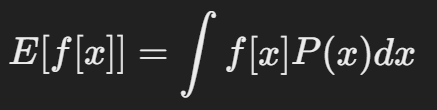

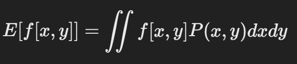

**期望的计算规则**：

- **规则 1**：常数的期望等于常数本身。 E[k] = k
- **规则 2**：常数乘以函数的期望等于常数乘以函数的期望值。 E[k f[x]]=k E[f[x]]
- **规则 3**：两个函数之和的期望等于它们各自期望的和。 E[f[x]+g[x]]=E[f[x]]+E[g[x]]

- **规则 4：**两个函数乘积的和的期望等于他们各自期望的积（如果他们是独立的）。E[f[x]g[x]]=E[f[x]]E[g[x]]

### 1.8 Bernoulli Distribution

只有 0 和 1 的情况

### 1.9 Beta Distribution

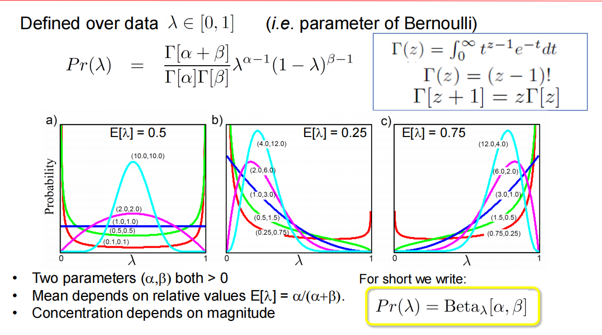

::: details Beta分布和 Bernoulli Distribution 的关系

**Beta分布**并不是伯努利分布的积分，但它确实和伯努利分布密切相关。具体来说，Beta分布通常被用作伯努利分布中参数 \( p \) 的**先验分布**，特别是在**贝叶斯统计**中。

1. ==**Beta分布与伯努利分布的关系**==

- **伯努利分布**描述了二元随机变量的分布，即事件成功的概率为 \( p \)（例如投掷硬币正面朝上的概率），其概率质量函数为：
  
  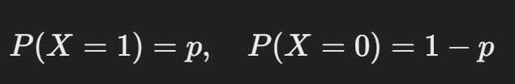
  
- **Beta分布**可以看作是对这个成功概率 \( p \) 的一个概率模型。Beta分布用于表示 \( p \) 的不确定性。也就是说，我们并不直接知道 \( p \) 的值，而是通过 Beta 分布来描述我们对 \( p \) 的信念。

- **贝叶斯更新**：在贝叶斯框架中，如果我们对伯努利分布的参数 \( p \) 进行建模，通常会选择 Beta 分布作为 \( p \) 的先验分布。这样，当我们获得新的数据（成功或失败的观测）时，可以通过更新 Beta 分布的参数来得到 \( p \) 的后验分布。

2. ==**为什么使用Beta分布作为先验**==

Beta 分布有两个参数 \( \alpha \) 和 \( \beta \)，它们表示我们在事前对 \( p \) 的成功和失败次数的“虚拟观测”。例如：

- 如果我们选择 \( \alpha = 1 \), \( \beta = 1 \)，那么 Beta 分布是一个均匀分布，表示我们对 \( p \) 没有偏好。
- 如果 \( \alpha \) 很大，而 \( \beta \) 很小，表示我们认为事件大概率会成功（\( p \) 接近 1）。
- 反之，\( \alpha \) 很小，\( \beta \) 很大时，表示我们认为事件大概率会失败（\( p \) 接近 0）。

3. ==**Beta分布并不代表“伯努利参数的准确性”**==

Beta 分布是用来表示我们对 \( p \) 的不确定性的，而不是直接表示 \( p \) 的准确性。但随着数据的增多（比如更多的伯努利实验结果），我们可以更准确地估计 \( p \)。具体来说：

- 每当我们观测到一次“成功”事件，就增加 \( \alpha \) 的值。
- 每当观测到一次“失败”事件，就增加 \( \beta \) 的值。

随着 \( \alpha \) 和 \( \beta \) 的增加，Beta 分布会逐渐收缩到一个较窄的范围，从而更精确地描述 \( p \) 的可能值。这可以理解为：**Beta 分布会随着数据增多而对 \( p \) 的估计变得更准确**。

4. ==**总结**==

Beta分布和伯努利分布的关系在于，Beta分布可以作为伯努利分布参数 \( p \) 的先验分布。通过贝叶斯更新，我们可以在观测到更多成功或失败事件后，利用 Beta 分布来更新对 \( p \) 的信念，使得对 \( p \) 的估计更加精确。因此，Beta分布反映了我们对 \( p \) 的不确定性，而不直接表示 \( p \) 的准确性。

:::

### 1.10 Categorical Distribution

分类分布（Categorical Distribution）的公式确实涉及概率的表示，但并不是将所有取值的概率相乘，而是通过一个简单的表达式来表明某个特定类别发生的概率。

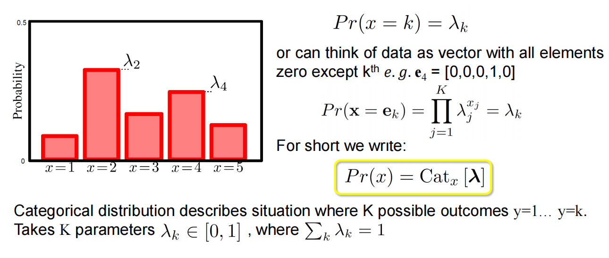

::: info

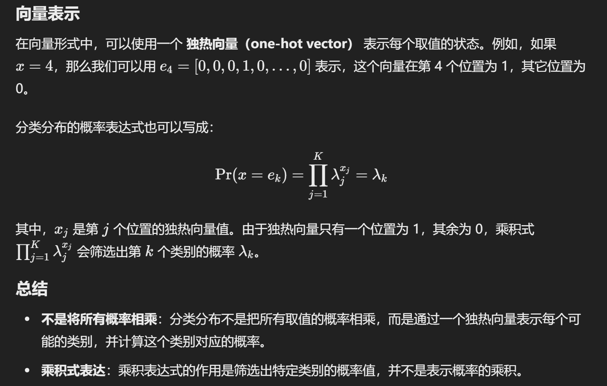

:::

::: details 例子

假设我们有一个骰子，它有6个面（1到6），每个面朝上的概率不同。我们用一个分类分布来描述这个骰子每一面的概率。假设各面的概率如下：

lambda = [0.1, 0.2, 0.3, 0.15, 0.15, 0.1]

这个概率向量表示：

- 掷出1的概率是0.1
- 掷出2的概率是0.2
- 掷出3的概率是0.3
- 掷出4的概率是0.15
- 掷出5的概率是0.15
- 掷出6的概率是0.1

**问题：计算掷出“3”的概率**

为了表示我们想要的类别“3”，我们可以用一个独热向量表示，其中只有第三个位置是1，其余位置是0：

e 3 = [0, 0, 1, 0, 0, 0]

分类分布公式为：

这里的 \( x j \) 是向量 \( e 3 \) 中的元素。因为独热向量的第三个位置为1，其他位置为0，上式会变成：

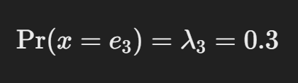

因此，掷出“3”的概率就是0.3。

**总结**

在这个例子中，我们使用分类分布来表示一个不均匀骰子每一面朝上的概率。通过使用独热向量 \( e 3 \)，我们可以筛选出掷出3的概率，即 0.3。

:::

### 1.11 Dirichlet Distribution

::: tabs

@tab 概率密度函数

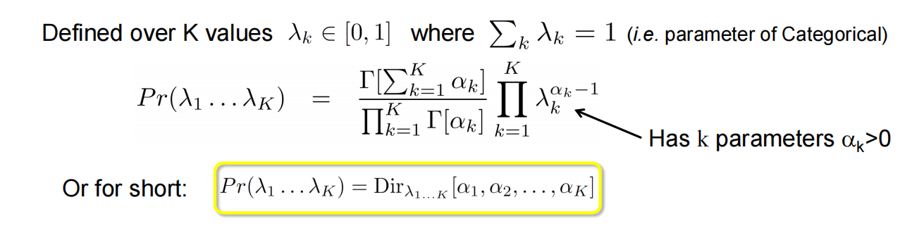

@tab 图形解释

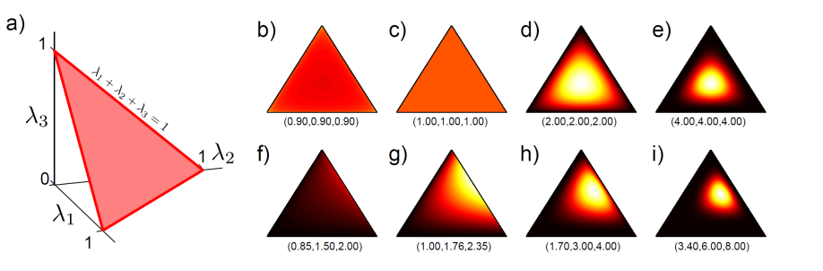

- 图中左侧三角形图（a）展示了一个二维情况下的三维空间，表示 λ1,λ2,λ3的所有可能组合。

- 子图 (b) 到 (i) 展示了不同参数组合下的狄利克雷分布形状。每个子图标注的参数（如 (0.90, 0.90, 0.90)）表示不同的αk值，显示了在这种条件下概率密度的分布形态。随着参数的增大，分布会更加集中

### 1.12 Univariate Normal Distribution

又叫正态分布。

::: tabs

@tab 概率密度函数

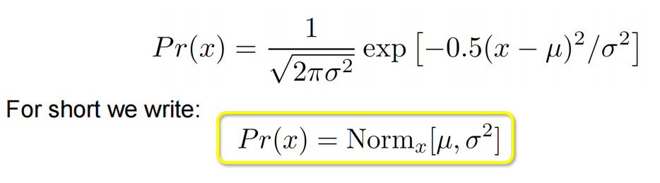

或者又可以写作：

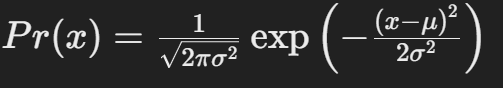

@tab 图示

- 绿色曲线：均值 μ=−3.4方差 σ2=0.25。

- 红色曲线：均值 μ=0方差 σ2=1。
- 蓝色曲线：均值 μ=1.5方差 σ2=4.41。

这些曲线显示了不同均值和方差组合下正态分布的形状变化，均值越高曲线向右移动，方差越大曲线越平缓。

:::

### 1.13 Normal Inverse Gamma Distribution

::: tabs

@tab 概率密度函数

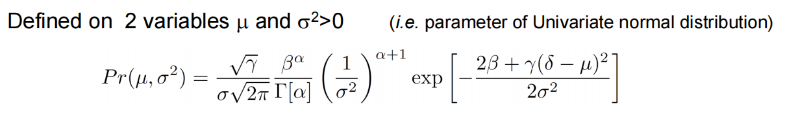

@tab 图示

下方的热力图展示了在不同参数组合下正态逆伽马分布的概率密度。每张图上方的括号内容表示具体的参数值组合，例如：

- a) 图的参数组合为 (1.0, 1.0, 1.0, 0.0)，表示 α=1，β=1，γ=1，δ=0。
- b) 图的参数组合为 (0.5, 1.0, 1.0, 0.0)，等等。

每张热力图显示了在不同均值 μ 和方差 σ22的情况下概率密度的分布情况。颜色越亮，表示在对应的 μ和 σ2 位置上概率密度越高。

:::

### 1.14 Multivariate Normal Distribution

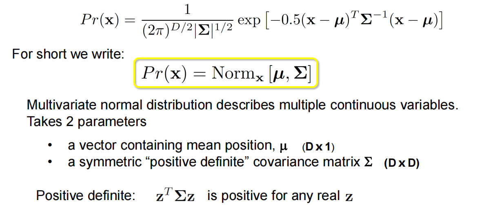

### 1.15 Normal Inverse Wishart

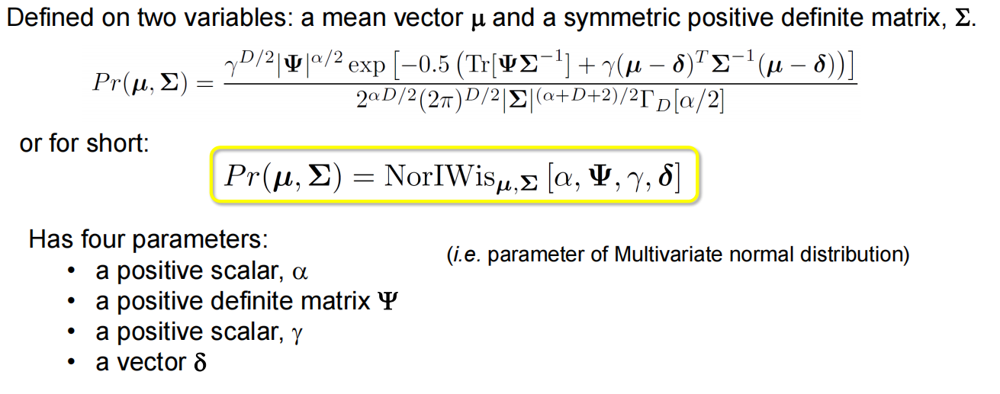

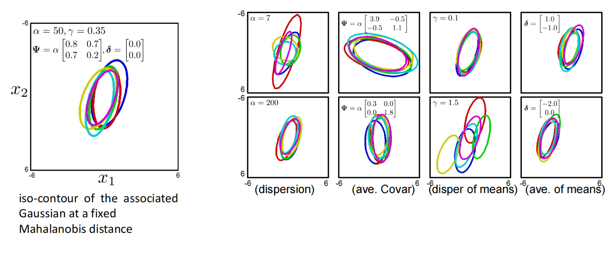

### 1.16 Conjugate Distributions

::: info 常见的共轭分布

 

:::

- When we take product of distribution and it’s conjugate, the result has the same form as the conjugate.

::: details

这句话的意思是，当我们将一个概率分布与它的共轭分布相乘时，所得的结果（即后验分布）仍然具有与共轭分布相同的数学形式。

在贝叶斯推断中，我们常常会用**先验分布**去描述某个未知参数的初始信念，然后结合**似然函数**（即观测数据的概率分布）来更新我们的信念，得到**后验分布**。如果我们选择的先验分布是似然函数的共轭分布，那么当我们将这个先验分布与似然函数相乘后，得到的后验分布将和先验分布保持相同的形式，只是分布的参数会发生变化。这就是**共轭分布的性质**。

:::

- Example:

    一个先验分布：我们暂时设做 beta 分布。

    一个似然函数：从伯努利分布中提取，因为 beta 分布是他的共轭分布。这时我们从伯努利分布中得到一些观测函数（他们满足伯努利分布）

    把后验分布：把先验分布与似然函数相乘，得到的后验分布仍然是 Beta 分布的形式。

    

### 1.17 Importance of Conjugate in Bayes’ Rule

回顾一下贝叶斯定理是什么？

- 在贝叶斯公式中，后验概率 Pr(y∣x) 是通过结合似然 Pr(x∣y) 和先验分布 Pr(y)计算得到的。共轭分布的一个重要特性是，当我们将先验分布和似然相乘时，得到的后验分布形式与先验分布相同，这就是“共轭”的含义。

::: details

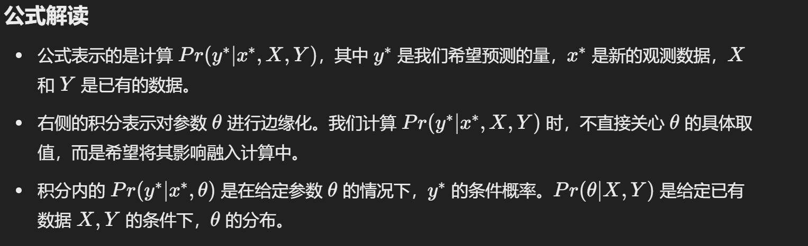

:::

### 1.18 Maximum Likelihood

::: tabs

@ tab PPT

目标是找到一组参数 θ 使得观测到的数据 X1, X2,…,XI 在该参数下的概率最大化。换句话说，MLE 旨在找到最能解释数据的参数。

We have assumed that data was independent (hence product)

- 预测密度：计算一个新的数据的时候 x 的时候我们就可以用估计出来的最可能的参数。

@tab GPT

**什么是似然（likelihood）？**

- 似然就是给定参数时，数据出现的可能性。我们的目标是让这个可能性最大化，也就是让模型的参数尽量让数据更“合理”地出现。我们希望找到这样一组参数，让我们观察到的数据在该参数下出现的可能性最高。

**步骤**：

- 我们要找到一组参数，使得所有数据同时出现的可能性最大。在数学上，这可以理解为找出每个数据点的出现概率，并把它们的概率值相乘。为了简化这个过程，我们假设数据是独立的（即一个数据点的出现不影响其他数据点的出现），这样就可以直接把每个数据的概率乘起来。

**预测新数据**：

- 一旦找到让现有数据可能性最大的参数（最优参数），我们可以使用这个参数来预测新的数据。这就相当于：我们调整好了猜测器的设置，现在它可以更好地预测新情况。

:::

### 1.19 Maximum a posteriori (MAP)

也假设数据都是独立的。

### 1.20 Bayesian Approach

#### 1. Fitting

Compute the posterior distribution over possible parameter values using Bayes’ rule:

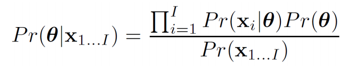

贝叶斯方法的一个核心思想是通过已知的数据来更新关于参数 θ 的知识，得到其后验分布。

这里：

- P(θ∣x1...I)表示在给定数据 x1...I 后，对参数 θ的后验分布。
- P(xi∣θ)是似然函数，表示在参数 θ 下生成数据点 xi的概率。
- P(θ)是先验分布，表示我们在观察到数据之前对参数 θ 的信念。
- P(x1...I)是数据的边缘似然，用于归一化使得后验分布的总概率为1。

**原则**：贝叶斯方法不选择单一的最优参数，而是保留所有可能的参数值，并考虑每种情况的概率。这种方法能够捕捉到所有可能的解释，而不是仅仅选择一个。

::: note

**为何P(θ)是先验分布？它与后验分布函数形式一样吗？**

在贝叶斯统计中，先验分布 \( P(\theta) \) 和后验分布 \( P(θ | x_{1...I}) \) 是两个不同的概念，尽管它们的形式可以在某些情况下相似。我们来详细探讨一下：

1. 先验分布 \( P(θ) \)

先验分布 \( P(θ) \) 表示我们在观察到数据之前，对参数 \( θ \) 的信念。它反映了在没有任何数据的情况下，关于 \( θ\) 的不确定性。选择先验分布通常依赖于先验知识、经验或假设。在贝叶斯分析中，先验分布的选择对结果有很大影响，特别是在数据量少的情况下。

2. 后验分布 \( P(θ | x_{1...I}) \)

后验分布 \( P(θ | x_{1...I}) \) 表示在观察了数据 \( x_{1...I} \) 后，我们对参数 \( θ \) 的更新后的信念。根据贝叶斯定理，后验分布的计算公式为：

这里：
- \( P(x_{1...I} |θ) \) 是似然函数，表示在给定参数 \( θ \) 的条件下观测到数据 \( x_{1...I} \) 的概率。
- \( P(x_{1...I}) \) 是边缘似然，用于归一化，使得后验分布的总概率为 1。

因此，后验分布是基于先验分布和数据的似然函数共同决定的。

3. 先验分布与后验分布的形式关系

在某些情况下，先验分布和后验分布的形式可以相似。例如，当我们选择一个共轭先验（conjugate prior）时，后验分布会与先验分布具有相同的分布族形式。共轭先验是一种特殊的先验分布形式，使得后验分布的形式保持与先验分布相同，这在计算上非常方便。例如：

- 对于二项分布的参数（如伯努利分布中的成功概率），选择 Beta 分布作为先验分布。更新后的后验分布仍然是 Beta 分布。
- 对于正态分布的均值，选择正态分布作为先验分布，后验分布也保持正态分布形式。

然而，**一般情况下，先验分布和后验分布的形式并不一定相同**。在没有选择共轭先验的情况下，后验分布可能是复杂的、非标准的分布，甚至可能需要使用数值方法（如马尔可夫链蒙特卡洛方法）来估计。

:::

#### 2. Predictive Density

• Each possible parameter value makes a prediction

• Some parameters more probable than others

Make a prediction that is an infinite weighted sum (integral) of the predictions for each parameter value, where weights are the probabilities.

这句话是说，预测密度是一个加权平均，其中每个可能的参数值 θ对预测 x∗的贡献根据其后验概率 P(θ∣x1...I)进行加权。

### 1.21 三种预测密度的方法

**1. Maximum likelihood:**

Evaluate new data point under probability distribution with ML parameters

**2. Maximum a posteriori:**

Evaluate new data point under probability distribution with MAP parameters

**3. Bayesian:**

Calculate weighted sum of predictions from all possible values of parameters

## Lecture 8 Review Question

### 1. **What are random variables? How many types of random variables?**

::: tabs

@tab GPT

A **random variable** is a variable whose possible values are outcomes of a random phenomenon. It's a way to quantify uncertainty by assigning numerical values to different outcomes of a random process. 

1. **Discrete Random Variables**
    - **Definition**: A discrete random variable takes on a countable number of distinct values. These values are often integers, such as 0, 1, 2, etc., but can also be any distinct set of outcomes.
    - **Probability Distribution**: Discrete random variables have a probability mass function (PMF), which provides the probability of each possible outcome.

2. **Continuous Random Variables**
    - **Definition**: A continuous random variable can take on an infinite number of values within a given range. These values are typically real numbers and can vary continuously without jumps.
    - **Probability Distribution**: Continuous random variables have a probability density function (PDF), which describes the probability of the variable falling within a specific range of values. For continuous random variables, the probability of taking any exact value is zero, but we can calculate the probability over an interval.

@tab PPT

- May be result of experiment (flipping a coin) or a real world measurements (measuring temperature)
- If observe several instances of x we get different values.
- A random variable x denotes a quantity that is **uncertain**
- Some values occur more than others and this information is captured by a **probability distribution**

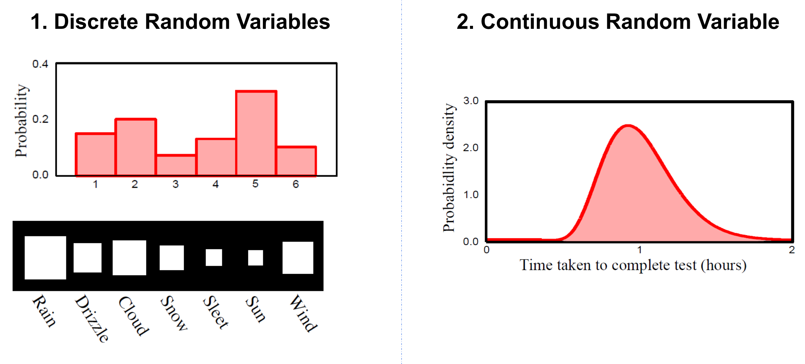

:::

### 2. The definition of Conditional Probability

给定 y=y1 的条件概率 P(x∣y = y1)是指在 y 固定为 y1 时，变量 x 取不同结果的相对倾向。

Conditional probability of x given that y=y1 is relative propensity of variable x to take different outcomes given that y is fixed to be equal to y1 .

In another way …

The conditional probability \( P(x | y = y_1) \) represents the probability of event \( x \) occurring given that event \( y = y_1 \) has already occurred.

### 3. **The definition of Bayesian Rule**

首先我们得到：

然后我们可以进行变换，得到 Bayes’ Rule：

解析 Bayes‘ Rule：

### 4. Three Fitting probability distributions

**1. Maximum likelihood:**

Evaluate new data point x* under probability distribution with ML parameters

**2. Maximum a posteriori:**

Evaluate new data point x* under probability distribution with MAP parameters

**3. Bayesian:**

Calculate weighted sum of predictions from all possible values of parameters

### 5. 默写一些分布

#### 5.1 Bernoulli likelihood

Probability Mass Function (PMF)：

写作：

#### 5.2 Categorical Distribution

The **Categorical distribution** generalizes the Bernoulli distribution to handle more than two possible outcomes. It describes the probabilities of each category in a set of k categories.

Probability Mass Function：

​                                               

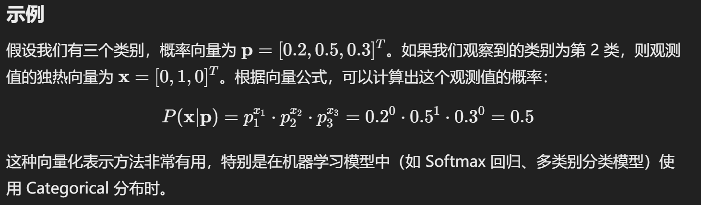

#### 5.3 Univariate Normal Distribution

Probability Density Function (PDF)：

#### 5.4 Multivariate Normal Distribution

The **Multivariate Normal distribution** generalizes the univariate normal distribution to multiple dimensions. It is defined by a mean vector μ\muμ and a covariance matrix Σ.

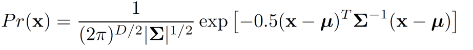

- μ is the d-dimensional mean vector.

- Σ is the d×d covariance matrix, which must be positive definite.

Multivariate normal distribution describes multiple continuous variables. Takes 2 parameters 

## Lecture 9

这几页幻灯片介绍了视觉世界中的不确定性、计算机视觉的目标，以及解决这个问题的模型设计。

1. **视觉世界的模糊性**：视觉测量往往无法唯一确定世界状态，因为观测数据（如图像）可能含有噪声或内在的不确定性。这导致同一个观测值可能对应多个可能的世界状态。为了应对这种模糊性，最好的方法是计算观测数据下可能的世界状态的后验概率分布。

2. **计算机视觉的目标**：计算机视觉的目标是基于观测值（如图像数据）输出一个关于世界状态的概率分布。由于直接求解可能非常复杂，通常可以使用近似方法或选择最大后验（MAP）估计来代表最可能的世界状态。

3. **解决方案的组成部分**：要解决这个问题，需要设计一个模型来将视觉数据和世界状态联系起来，并通过学习算法拟合模型参数。最后通过推理算法在新的观测数据下估计可能的世界状态的概率。

4. ==**模型的类型**：主要有两类模型：==
   - 基于观测数据预测世界状态的模型 \( Pr(w|x) \)。Discriminative
   - 基于世界状态预测观测数据的模型 \( Pr(x|w) \)。Generative

5. 不同的世界状态的输出对应的模型类型：

    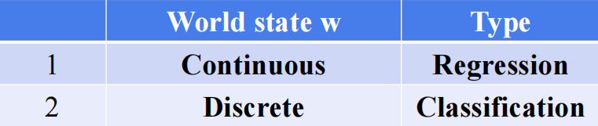

### 1. Model

#### 1.1 Discriminative — Model contingency of the world on the data

通过观测数据观测世界状态的概率 Pr(w|x)

**判别模型**旨在直接估计给定观测数据 x 时，某一特定世界状态 w 发生的概率Pr(w∣x)。

1. Choose an appropriate form for Pr(**w**)

2. Make parameters a function of **x**

3. Function takes parameters θ that define its shape

学习算法：（Learning algorithm） learn parameters θ from training data.

推理算法：（Inference algorithm）在模型学习完成后，直接计算 Pr(w∣x)，即在给定观测数据时预测特定状态的可能性。just evaluate Pr(w|x)。

#### 1.2 Generative — Model contingency of data on world

通过观测世界状态观测数据的概率 Pr(x|w)。

**生成模型**不直接估计 Pr(w∣x)，而是通过先估计在某个世界状态 w 下观测数据 x 的概率 Pr(x∣w)，再使用贝叶斯公式计算 Pr(w∣x)。

1. Choose an appropriate form for Pr(**x**)
2. Make parameters a function of **w**
3. Function takes parameters θ that define its shape

Learning algorithm: learn parameters θ from training data.

Inference algorithm: Define prior Pr(**w**) and then compute Pr(**w**|**x**) using Bayes’ rule.

### 2. Linear Regression

Consider:

- we make a univariate(单变量的) continuous measurement **x**
- use this to predict a univariate continuous state **w**

**regression as world state is continuous**

#### 2.1 Discriminative

这些幻灯片讲解了如何在判别模型中使用线性回归来建模和预测变量 w 与观测变量 x 之间的关系。

- How to model Pr(**w**|**x**)?
    - Choose an appropriate form for Pr(**w**)
    - Make parameters a function of **x**
    - Function takes parameters **** that define its shape

- **模型选择**：选择一个适当的概率分布来描述 Pr(w∣x)。在这里，我们选择了正态分布 (Normal distribution) 作为分布形式。

    - Choose normal distribution over w
    - Assume that the mean value μ of w is a linear function of x, i.e. μ = ϕ0 + ϕ1 .
    - The variance σ2 is assumed to be constant and not varying with x.

- 整个函数可以和简写成：

    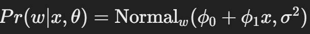

- Learning algorithm

    E.g. MAP

    

- Inference algorithm: just evaluate Pr(**w**|**x,**𝜃) for new data **x**

    

### 3. Logistics regression

离散的，同上所述。

#### 3.1 Discriminative

这些页面详细说明了生成模型 (Generative Model) 的构建方法及其运作原理。

1. **如何构建 \( P(x|w) \)**

- 选择一个适当的形式：在这里，为了模型 \( P(x|w) \)，我们选择了一个高斯分布。
- 使参数成为 \( w \) 的函数：因为我们希望数据 \( x \) 的分布依赖于分类 \( w \) 的值（例如，二分类情况下 \( w \) 为 0 或 1）。
- 定义模型的参数：模型有参数θ（比如 μ0、 μ1、 σ0 和 σ1），这些参数决定了 \( P(x|w) \) 的形状。

2. **学习算法**

在学习算法部分，通过使用训练数据集 { \( x_i \), \( w_i \) } 来估计参数 \(θ \)。这些参数被拟合到数据中，使得对于已知 \( w \) 的情况下 \( x \) 的概率最大化。

3. **推理算法**

推理算法的目标是通过贝叶斯规则计算后验分布 \( P(w|x) \)。计算后验分布时，我们会定义 \( P(w) \) 的先验分布（这里使用伯努利分布表示二分类的先验概率），然后通过贝叶斯公式：

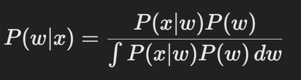

在离散情况下，这可以简化为求和形式。

**生成模型中的例子**

图中展示了生成模型的典型情况：两类 \( w = 0 \) 和 \( w = 1 \) 的数据分布（分别用蓝色和红色表示）。不同类别的 \( x \) 分布在不同的均值 μ0 和 μ1周围，并具有不同的方差 σ0 和 σ1。

### 4. Review Questions

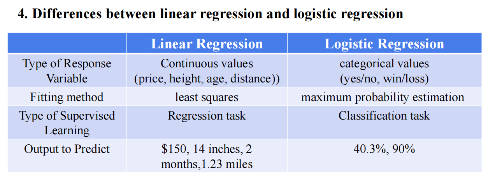

#### 4.1 

这张图表对比了 **线性回归** 和 **逻辑回归** 的主要区别。以下是总结和补充：

1. ==**响应变量的类型**==

- **线性回归**：适用于 **连续值** 响应变量，例如价格、高度、年龄、距离等。
- **逻辑回归**：适用于 **分类值** 响应变量，例如二元分类 (yes/no, win/loss)。

2. ==**拟合方法**==

- **线性回归**：使用 **最小二乘法** 来找到最佳拟合直线，以最小化预测值和实际值之间的误差。
- **逻辑回归**：使用 **最大似然估计** 来找到最佳参数，从而最大化观测数据的概率。

3. ==**监督学习类型**==

- **线性回归**：用于 **回归任务**，目标是预测一个连续的数值。
- **逻辑回归**：用于 **分类任务**，目标是预测类别标签。

4. ==**输出**==

- **线性回归**：直接预测数值输出，如 $150、14 inches、2 months、1.23 miles。
- **逻辑回归**：输出的是属于某个类别的 **概率值**，如 40.3% 或 90%，并根据概率进行分类

