## Lecture 8

### 1.1 Random Variable

Discrete :

Continuous :

### 1.2 Joint Probability

• Written as Pr(𝑥, 𝑦)

• Can read Pr(𝑥, 𝑦) as “probability of x and y ”

### 1.3 Marginalization

::: details

这张幻灯片介绍了概率中的边缘化（Marginalization）概念。边缘化是从联合概率分布中获得单一变量的概率分布的方法。

**具体解释：**

1. **联合分布**：
   - 在图像中心，我们可以看到一个二维的联合概率分布 \( Pr(x, y) \)，用来表示变量 \( x \) 和 \( y \) 的联合分布情况。亮度越高的区域表示联合分布的概率值越大。

2. **边缘概率**：
   - 边缘化的过程是通过将联合分布 \( Pr(x, y) \) 中其他变量积分（或求和）以得到感兴趣变量的概率分布。
   - 例如，我们可以通过对 \( Pr(x, y) \) 在 \( y \) 上积分来获得 \( x \) 的边缘分布 \( Pr(x) \)：
     \[
     Pr(x) = \int Pr(x, y) \, dy
     \]
   - 同样，通过对 \( Pr(x, y) \) 在 \( x \) 上积分来获得 \( y \) 的边缘分布 \( Pr(y) \)：
     \[
     Pr(y) = \int Pr(x, y) \, dx
     \]

3. **图示**：
   - 下面右侧的图示展示了边缘化的效果。我们从二维联合分布 \( Pr(x, y) \) 中分别得到 \( Pr(x) \) 和 \( Pr(y) \) 的单独分布。
   - 在顶部和左侧的曲线分别表示 \( Pr(x) \) 和 \( Pr(y) \) 的分布，即分别将 \( y \) 和 \( x \) 变量“边缘化”之后的概率密度函数。

4. **直观理解**：
   - 可以把边缘化理解为在二维分布上“投影”到单个轴上。例如，计算 \( Pr(x) \) 时，相当于将 \( y \) 方向上的分布“压扁”或“合并”，从而得到一个仅与 \( x \) 相关的概率分布。

**应用：**

边缘化广泛应用于概率和统计学中，用来计算单一变量的分布，即使在实际中我们关注的是联合分布。

:::

在更高维也可以用边缘分布——leaves joint distribution between whatever variables are left

### 1.4 Conditional Probability

• Conditional probability can be extracted from joint probability

• Extract appropriate slice and normalize

- 求解公式：

    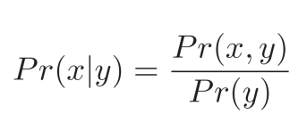

- 延伸至高阶

    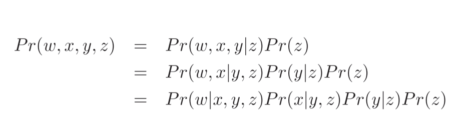

### 1.5 Bayes' Rule

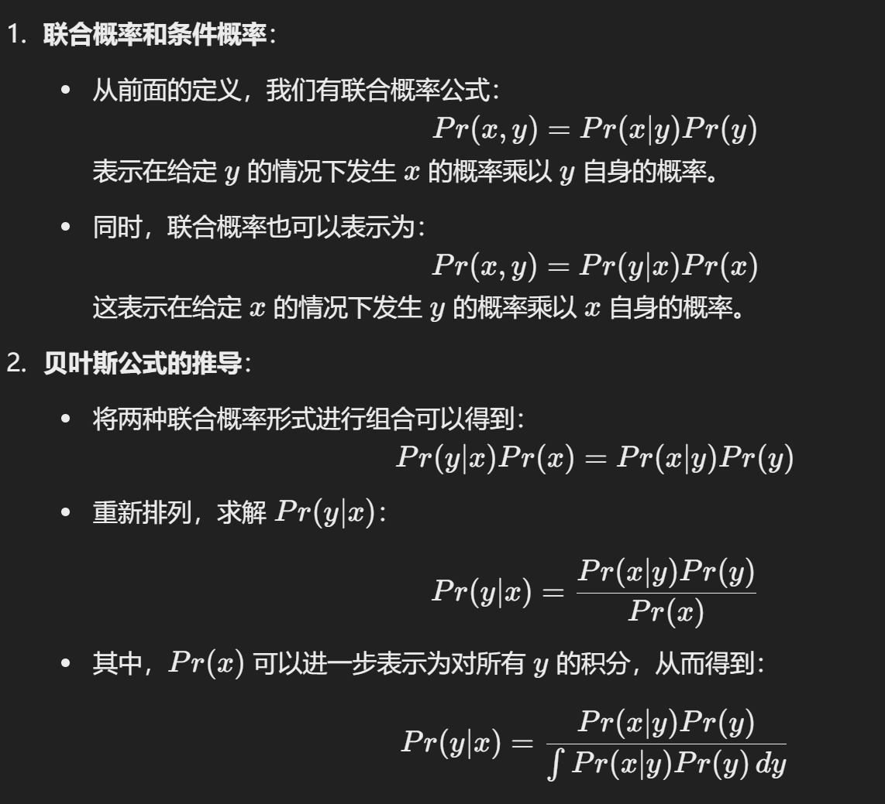

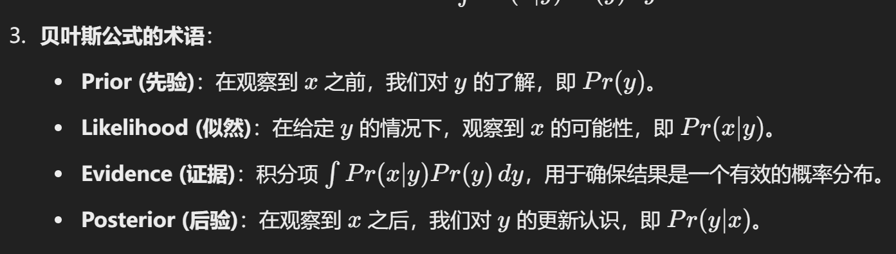

### 1.6 Independence

- When variable are independent:

    Pr(x, y) = Pr(x|y)Pr(y) = Pr(x)Pr(y)

### 1.7 Expectation

**期望是什么：**

- 离散时：

    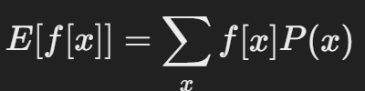

- 连续时:

    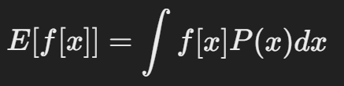

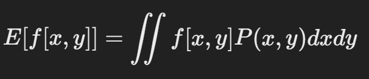

**期望的计算规则**：

- **规则 1**：常数的期望等于常数本身。 E[k] = k
- **规则 2**：常数乘以函数的期望等于常数乘以函数的期望值。 E[k f[x]]=k E[f[x]]
- **规则 3**：两个函数之和的期望等于它们各自期望的和。 E[f[x]+g[x]]=E[f[x]]+E[g[x]]

- **规则 4：**两个函数乘积的和的期望等于他们各自期望的积（如果他们是独立的）。E[f[x]g[x]]=E[f[x]]E[g[x]]

### 1.8 Bernoulli Distribution

只有 0 和 1 的情况

### 1.9 Beta Distribution

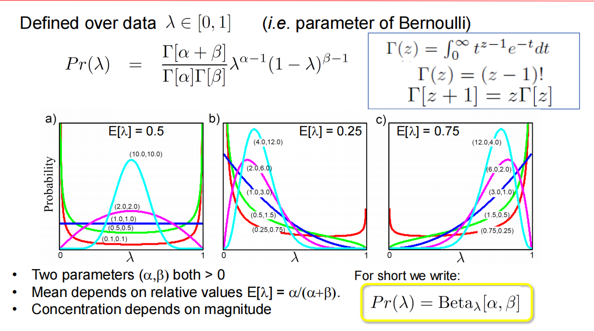

::: details Beta分布和 Bernoulli Distribution 的关系

**Beta分布**并不是伯努利分布的积分，但它确实和伯努利分布密切相关。具体来说，Beta分布通常被用作伯努利分布中参数 \( p \) 的**先验分布**，特别是在**贝叶斯统计**中。

1. ==**Beta分布与伯努利分布的关系**==

- **伯努利分布**描述了二元随机变量的分布，即事件成功的概率为 \( p \)（例如投掷硬币正面朝上的概率），其概率质量函数为：
  
  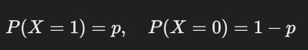
  
- **Beta分布**可以看作是对这个成功概率 \( p \) 的一个概率模型。Beta分布用于表示 \( p \) 的不确定性。也就是说，我们并不直接知道 \( p \) 的值，而是通过 Beta 分布来描述我们对 \( p \) 的信念。

- **贝叶斯更新**：在贝叶斯框架中，如果我们对伯努利分布的参数 \( p \) 进行建模，通常会选择 Beta 分布作为 \( p \) 的先验分布。这样，当我们获得新的数据（成功或失败的观测）时，可以通过更新 Beta 分布的参数来得到 \( p \) 的后验分布。

2. ==**为什么使用Beta分布作为先验**==

Beta 分布有两个参数 \( \alpha \) 和 \( \beta \)，它们表示我们在事前对 \( p \) 的成功和失败次数的“虚拟观测”。例如：

- 如果我们选择 \( \alpha = 1 \), \( \beta = 1 \)，那么 Beta 分布是一个均匀分布，表示我们对 \( p \) 没有偏好。
- 如果 \( \alpha \) 很大，而 \( \beta \) 很小，表示我们认为事件大概率会成功（\( p \) 接近 1）。
- 反之，\( \alpha \) 很小，\( \beta \) 很大时，表示我们认为事件大概率会失败（\( p \) 接近 0）。

3. ==**Beta分布并不代表“伯努利参数的准确性”**==

Beta 分布是用来表示我们对 \( p \) 的不确定性的，而不是直接表示 \( p \) 的准确性。但随着数据的增多（比如更多的伯努利实验结果），我们可以更准确地估计 \( p \)。具体来说：

- 每当我们观测到一次“成功”事件，就增加 \( \alpha \) 的值。
- 每当观测到一次“失败”事件，就增加 \( \beta \) 的值。

随着 \( \alpha \) 和 \( \beta \) 的增加，Beta 分布会逐渐收缩到一个较窄的范围，从而更精确地描述 \( p \) 的可能值。这可以理解为：**Beta 分布会随着数据增多而对 \( p \) 的估计变得更准确**。

4. ==**总结**==

Beta分布和伯努利分布的关系在于，Beta分布可以作为伯努利分布参数 \( p \) 的先验分布。通过贝叶斯更新，我们可以在观测到更多成功或失败事件后，利用 Beta 分布来更新对 \( p \) 的信念，使得对 \( p \) 的估计更加精确。因此，Beta分布反映了我们对 \( p \) 的不确定性，而不直接表示 \( p \) 的准确性。

:::

### 1.10 Categorical Distribution

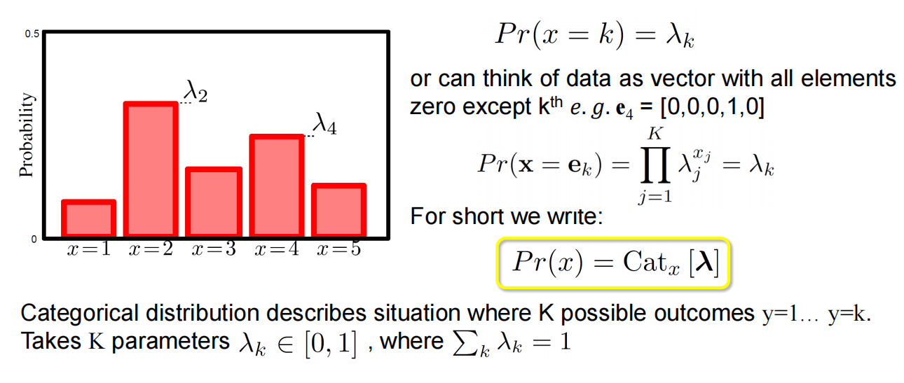

::: details 例子

假设我们有一个骰子，它有6个面（1到6），每个面朝上的概率不同。我们用一个分类分布来描述这个骰子每一面的概率。假设各面的概率如下：

lambda = [0.1, 0.2, 0.3, 0.15, 0.15, 0.1]

这个概率向量表示：

- 掷出1的概率是0.1
- 掷出2的概率是0.2
- 掷出3的概率是0.3
- 掷出4的概率是0.15
- 掷出5的概率是0.15
- 掷出6的概率是0.1

**问题：计算掷出“3”的概率**

为了表示我们想要的类别“3”，我们可以用一个独热向量表示，其中只有第三个位置是1，其余位置是0：

e 3 = [0, 0, 1, 0, 0, 0]

分类分布公式为：

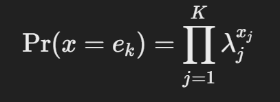

这里的 \( x j \) 是向量 \( e 3 \) 中的元素。因为独热向量的第三个位置为1，其他位置为0，上式会变成：

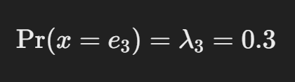

因此，掷出“3”的概率就是0.3。

**总结**

在这个例子中，我们使用分类分布来表示一个不均匀骰子每一面朝上的概率。通过使用独热向量 \( e 3 \)，我们可以筛选出掷出3的概率，即 0.3。

:::