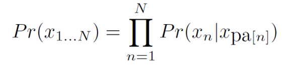
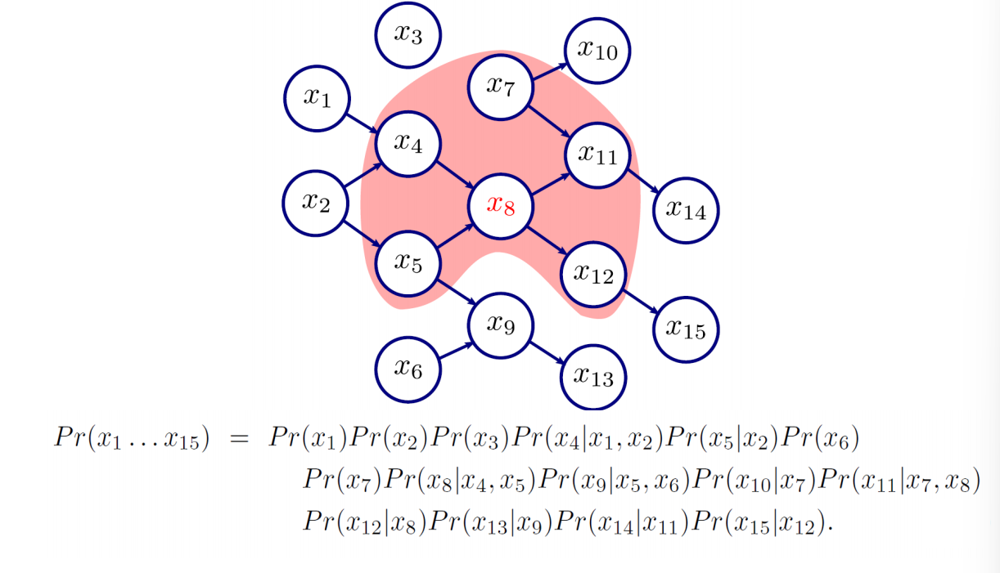
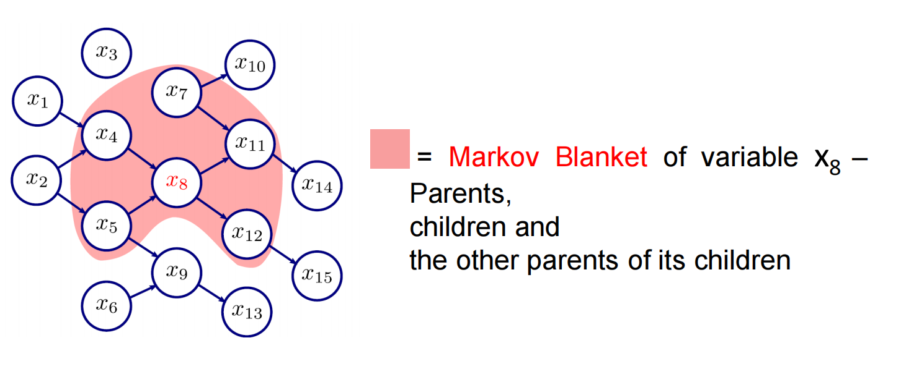
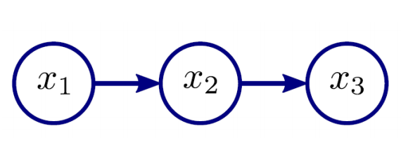
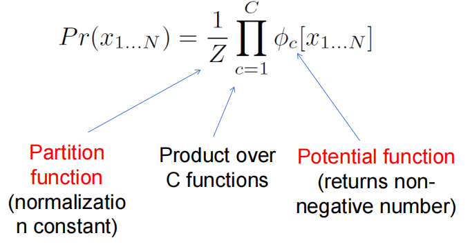
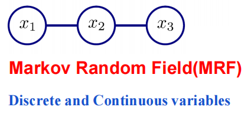
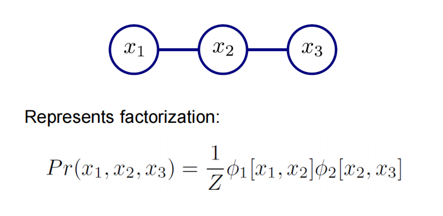
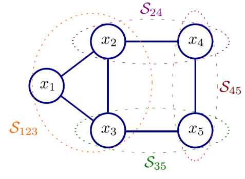
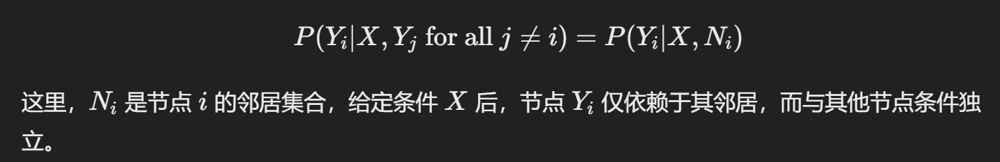
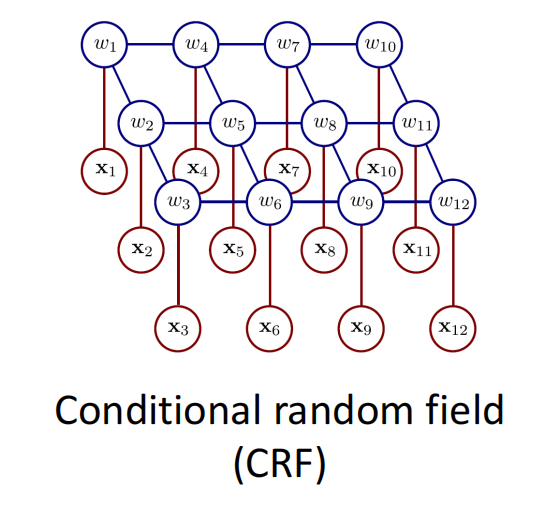

## Lecture 10

- **回归任务：**

    - Both x and w are continuous value
    - choose Linear regression to compute the Pr(w|x) 
    - 我们使用一个 Probability density function to model Pr(w|x) ，因为我们需要检测在一个特定世界状态下数据的分布。
    - 通过 **线性回归** 来直接建模 Pr(x|w)，从而估计数据与世界状态的关系。

    

- **分类任务：**

    - x is continuous while w are categorical, typibally taking value in {0, 1}
    - **Logistic regression** is chosen to compute Pr(w∣x)Pr(w|x)Pr(w∣x), predicting the probability of each category.
    - 对于 Pr(x∣w)，使用 **概率密度函数** 来表示数据在给定类别下的分布情况。

- **总结：**

    - 回归任务中，模型关注的是连续数值之间的关系，通过概率密度函数建模。
    - 分类任务中，模型关注的是数据如何划分到不同的类别，通过逻辑回归和概率密度函数实现分类预测。

    

### 1.1 **What is hidden or latent variables?**

**Key idea:** represent density **Pr(x)** as marginalization of joint density with another **variable h** that we do not see. In other words, hidden variables are unobserved factors within a model that influence the values of observed variables.

Also, depend on some parameters

::: details GPT

**隐藏变量的定义**：

- 隐藏变量是模型中未直接观测到的变量，但它们影响了观测变量的值或数据生成过程。
- 例如，在学生的考试成绩数据中，“学生的学习能力”可以被认为是一个隐藏变量。我们无法直接观测到每个学生的学习能力，但它显然影响了学生的考试成绩。

**隐藏变量的用途**：

- **揭示数据结构**：隐藏变量能够揭示出数据的潜在结构。通过引入这些隐藏变量，可以解释观测数据之间的相关性和结构。
- **降维和信息压缩**：在复杂数据中，隐藏变量常用于将数据从高维空间映射到低维空间。这是降维的一种方式，可以减少数据的复杂度，例如主成分分析（PCA）中隐含的主成分就是一种隐藏变量。
- **分离噪声**：隐藏变量模型有时可以帮助分离出数据中的噪声，进而更准确地反映出数据的真实模式。

**处理隐藏变量的算法**：

- **期望最大化算法（EM算法）**：EM算法是常用来估计带有隐藏变量的模型参数的算法。它包含两步：在“E步”中，估计隐藏变量的分布；在“M步”中，基于估计的分布，最大化参数的对数似然。

:::

### 1.2 What is **Expectation Maximization**?

::: tabs

@tab PPT

@tab GPT 

Expectation Maximization (EM) is an iterative algorithm used in statistics to find maximum likelihood estimates of parameters in models that have latent (hidden) variables or missing data. 

Step:

- Defines **a lower bound** on log likelihood and increases bound iteratively. Lower bound is a *function* of parameters **q** and a set of probability distributions 𝑞𝑖 (𝒉𝑖 )
- E-Step –  Updating the probability distributions {𝑞𝑖 𝒉𝑖 }𝑖 𝐼 =1 to improve the bound.
- M-Step – updating the parameters 𝜃 to improve the bound.

:::

### 1.3 **What are the advantages of EM?**

会出判断题。

### 1.4 **What is Mixture of Gaussians (MoG)? How to use EM to solve MoG?**

#### What is Mixture of Gaussians (MoG)?

*The mixture of Gaussians (MoG) is a prototypical example of a model where learning is suited to the EM algorithm.* The data are described as a weighted sum of K normal distributions.

#### How to use EM to solve MoG?

::: tabs

@tab 自己总结

1. **Goal**

The goal is "to learn parameters $θ={{λ_1…_k,μ_1…_k,Σ_1…_k}}$ from training data $x_1,…,x_I$."

2. **E-Step**

In the E-step, we fix parameters  $θ$ , maximize bound with respect to (w.r.t.) distributions $q_i(h_i)$ by calculating "the responsibility of the $k^{th}$ Gaussian for the $i^{th}$ data point.

- For each data point $x_i$, we calculate the posterior probability distribution $Pr(h_i=k | x_i, \theta^{(t)})$.

3. **M-Step**

In the M-step, we fix distributions $q_i(h_i)$ ,maximize bound with respect to w.r.t. parameters θ = 

- We compute the updated parameters 
- 
- Then, we updated parameter values. 

4. **Iterate Until Convergence**

Alternates E-steps and M-Steps, until the model parameters converge, the (local) maximum of the actual log likelihood is approached.

@tab PPT

:::

### 1.5 **What is t-distributions? How to use EM to solve t-distributions?**

#### What is t-distributions?

The **Student's t-distribution** is described as a distribution robust against data with heavy tails. It is defined as:

where the degrees of freedom $ν∈(0,∞)$ control the length of the tails; a smaller ν implies a heavier tail, meaning more weight in the tails.

#### How to use EM to solve t-distributions?

### **1.6 What is factor analysis? How to use EM to solve factor analysis?**

#### What is factor analysis? 

The probability density function of a factor analyzer is given by:

where the covariance matrix  $\Phi\Phi^T + \Sigma$  contains a sum of two terms. The first term, $\Phi\Phi^T$ describes a full covariance model over the subspace with the factors (columns of matrix $\Phi$) determining the subspace modeled. The factors are latent variables used to explain the correlations between observed variables. The second term, $\Sigma$, is a diagonal matrix that accounts for all remaining variation.

#### How to use EM to solve factor analysis?

## Lecture 11

### 1. Directed graphical models

#### 1.1 Difination

- Directed graphical model represents probability distribution that factorizes as a product of conditional probability distributions.

    

#### 1.2 To draw the graph:

• Add one term per node in the graph Pr(xn | xpa[n])

• If no parents then just add Pr(xn )

- Example:

    

::: tips

Pr(xi | xi 的所有父节点)

:::

#### 1.3 Markov Blanket

**Example 1**

以下图为例，给出了节点 $x_8$ 的 Markov Blanket.

- Markov Blanket 通常包括该节点的
    - 父节点
    - 子节点
    - 子节点的其他父节点
- 马尔可夫毯的概念意味着 **给定马尔可夫毯中的节点，$x_8$ 与网络中其他所有节点条件独立**。也就是说，马尔可夫毯中的节点包含了所有直接影响 $x_8$ 的信息，但它们本身并不一定相互条件独立。
- 根据上述条件概率的定义，我们可知，在给定$x_8$的 Markov Blanket 的条件下，$x_8$ 与图中其他节点条件独立。

**Example 2**

- 显然，在给定 $x_2$ 的条件下，$x_1$ 和 $x_3$ 条件独立。所以：
    $Pr(x_1,x_2,x_3)=Pr(x_1)⋅Pr(x_2∣x_1)⋅Pr(x_3∣x_2)$

### 2. Undirected graphical models

#### 2.1 Probability distribution factorize as

Markov Random field

- 用 Gibbs Distribution 表示

    **吉布斯分布形式**：无向图模型的概率分布可以写成吉布斯分布： $Pr(x_1, \dots, x_N) = \frac{1}{Z} \exp\left(-\sum_{c=1}^{C} \psi_c[x_1, \dots, x_N]\right)$

    **成本函数 ψ\psiψ**：通过定义势函数的负对数来引入**成本函数** $\psi_c[x_1, \dots, x_N] = -\log(\phi_c[x_1, \dots, x_N])$

- 团（Cliques）

    在无向图中，每个势函数作用于变量的一个子集，这个子集被称为**团**。

    

​	**团的意义**：对于每个团，我们可以定义势函数，用以描述该团中变量的相互依赖性。在计算机	视觉等应用中，势函数通常作用于变量的子集而不是整个变量集。

​	**马尔科夫随机场（MRF）**：无向图模型通常表示为马尔科夫随机场，定义了离散或连续变量间的关系。

#### 2.2 To visualize graphical model from factorization

::: info

**识别变量**：公式中的 $x_1, x_2, \ldots, x_N$ 是模型的随机变量。每个变量将对应无向图中的一个节点。

**识别势函数（Potential Functions）**：公式中的势函数 $\phi_c$ 表示特定变量子集之间的依赖关系。每个势函数通常作用于一组变量，这些变量构成一个团（Clique）。团是无向图中完全连接的子图，其中每对节点之间都有边。

**确定边的连接**：如果某个势函数作用于一组变量（比如 $\phi_c[x_1, x_2]$ 作用于 $x_1$ 和 $x_2$），则在无向图中绘制这两个变量之间的一条边。如果势函数涉及多个变量（如 $\phi_c[x_1, x_2, x_3]$），则在无向图中构建一个包含这些变量的完全连接子图。

**重复此过程**：对于每个势函数，按照其包含的变量确定相应的团，并在无向图中连接相应的节点，直到所有势函数都被映射到图中。

:::

- Sketch one node per random variable

- For every clique, sketch connection from every node to every other

#### 2.3 Example

- **Example 1**

    

    **One set of nodes is conditionally independent of another given a third if the third set separates them (i.e. Blocks any path from the first node to the second)**

​	也就是说，在无向图中，只要两个节点不直接相连，在给定与其中一个节点直接相连的所有节	点集的条件下，这两个节点条件独立。

​	再换句话说，在无向图中，给定一个节点的直接邻居集合，该节点与所有其他节点条件独立。	换句话说，只要知道一个节点的直接邻居，就可以忽略图中所有其他节点的信息来预测该节点	的状态。

​	因此，一个节点的直接邻居集合就是它的**马尔可夫毯**。

- **Example 2**

    

​	这个图的概率分布因子式可以是：

$Pr(x_1,x_2,x_3,x_4,x_5)=Z1ϕ1[x_1,x_2,x_3]ϕ2[x_2,x_4]ϕ3[x_3,x_5]ϕ4[x_4,x_5]$	$Pr(x_1, x_2, x_3, x_4, x_5) = \frac{1}{Z} (\phi_1[x_1, x_2] \phi_2[x_2, x_3]) \phi_3[x_1, x_3] \phi_4[x_2, x_4], \phi_5[x_3, x_5] \phi_6[x_4, x_5]$

### 3. MRF and CRF

#### 3.1 Markov Random Fields

- 基于 Undirected graphical modell
- Contextual constraints (spatial, temporal) , connect neighbors.
- Neighborhood relations define cliques

**公式表达: **

$P(Y_i | Y_j \text{ for all } j \neq i) = P(Y_i | N_i)$

其中，$N_i$表示节点 $i$ 的邻居集合。即给定节点 $i$ 的邻居集合 $N_i$，节点 $Y_i$ 与其他节点条件独立。

#### 3.2 Conditional Random Field

- MRF specifies joint distribution on Y
- For any probability distribution, you can condition it on some other variables X

::: tip

**MRF在条件上的扩展**：CRF可以看作是一个在某些给定条件（通常是特征变量集 X）下的MRF。

**条件分布**：CRF不直接建模变量 Y 的联合分布，而是在给定其他变量 X 的条件下对 Y 的分布进行建模。通过这种方式，CRF可以更好地适应有监督学习问题。

**CRF的定义**：CRF可以理解为**在 X 条件下的MRF**，因此它的依赖关系不仅受邻居影响，还受给定的条件变量 X 影响

:::

