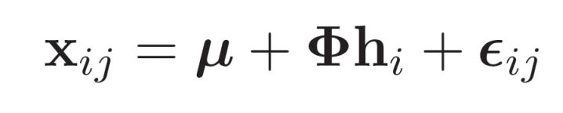
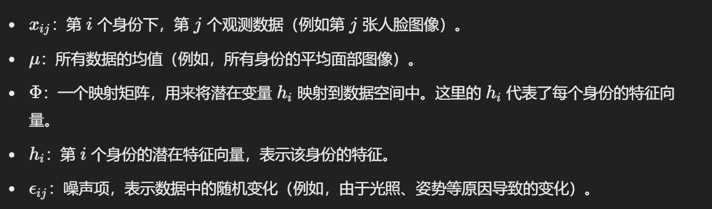
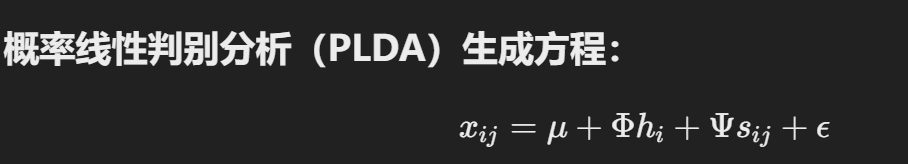
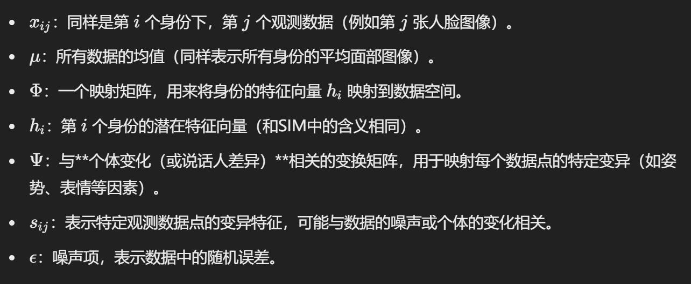
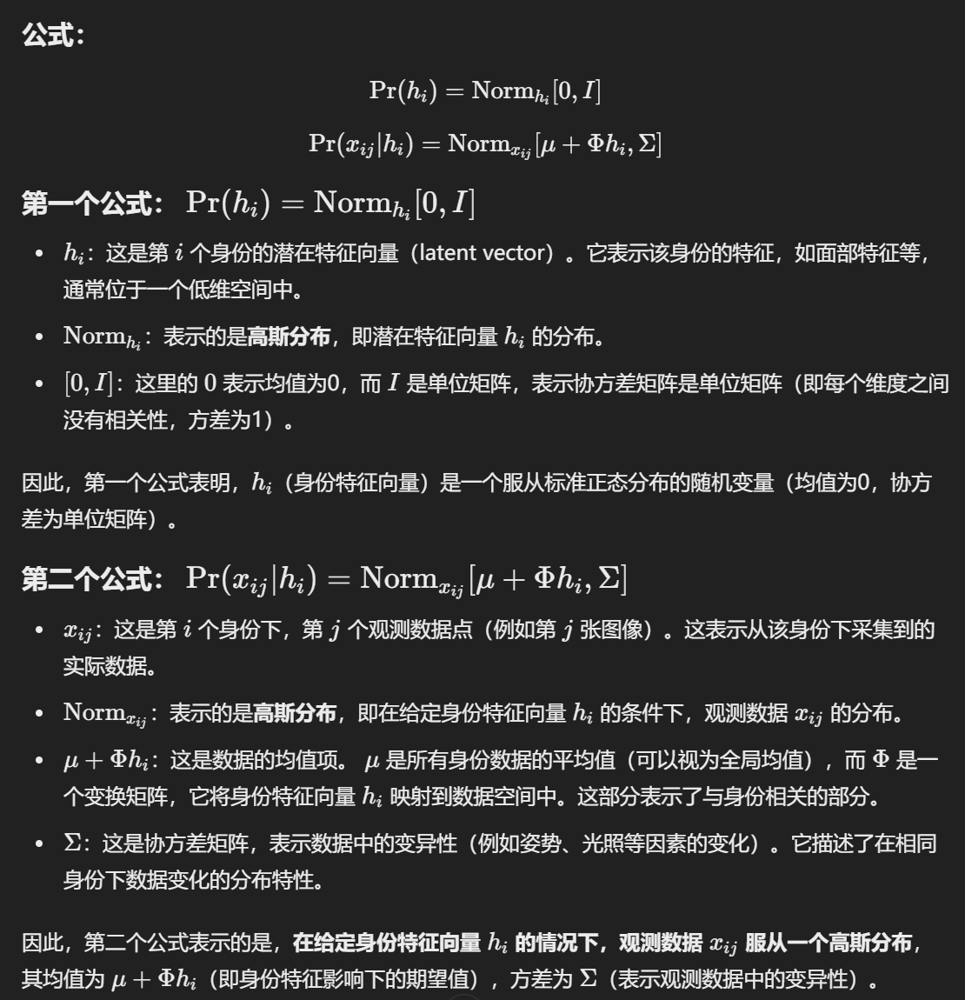
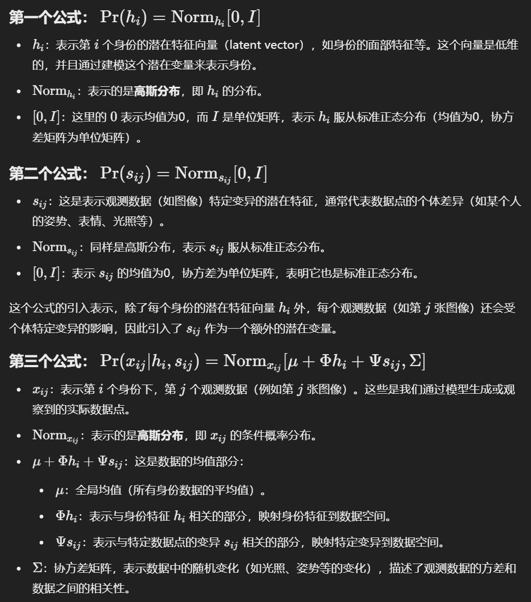
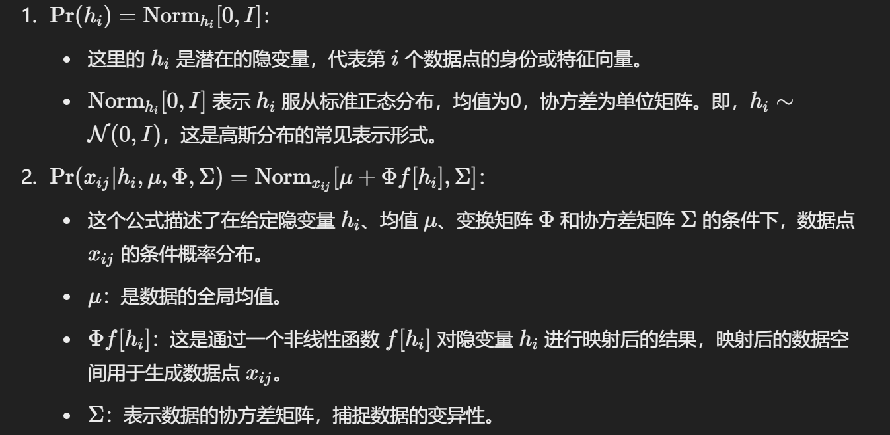
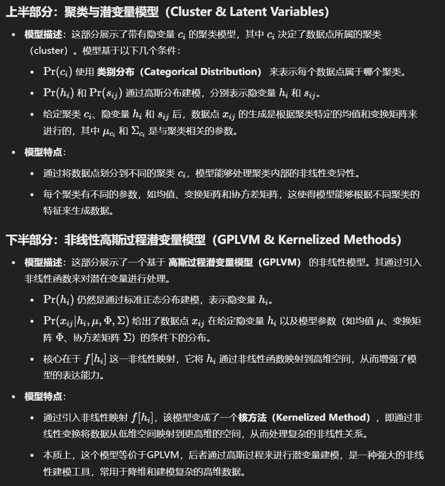

## Lecture 12

::: tips

Motivation。

:::

## Lecture 13

::: tabs

@tab

@tab

:::

::: tips

使用图割方法将这个最小化问题转换为一个**标准的计算机科学问题**，即：

最大流（Maximum Flow）**或**最小割（Minimum Cut）问题

- **最大流**：在网络流图中找到最大可能的流量，从源节点流向汇节点。
- **最小割**：在图中找到一条割，使割断边的权重总和最小化，这条割可以将图分割成两个部分（如前景和背景）。

:::

## Lecture 14

### 1. what is subspace identity model？

**Subspace Identity Model**（子空间身份模型）可以被看作是因子分析（Factor Analysis）的一种扩展或变体。

因子分析的目标是将高维的数据（如图像、音频等）降维，提取出少数几个潜在的因子来简化数据的结构。因子分析假设每个观测数据点是由多个潜在因子的线性组合构成的，且这些因子无法直接观察到。

而**Subspace Identity Model**则在此基础上更进一步，专门用来建模身份（如人脸）在低维子空间中的分布。它假设每个身份（例如一个人）对应于一个低维的子空间，其中每个身份的图像数据是从这个子空间中生成的，同时在每个身份的数据点上还会有一些噪声或变化。

==**相似之处：**==

1. **降维：** 两者都通过降维来简化数据结构。在因子分析中，通过因子（潜在变量）将高维数据表示为低维的线性组合；而在子空间身份模型中，图像数据通过映射到低维子空间来表示每个身份。
2. **生成模型：** 子空间身份模型也是一种生成模型，它假设每个数据点是由身份的特征向量和一些噪声生成的，这与因子分析中的生成过程类似。

**==区别==**

1. **重点：** 因子分析更侧重于发现数据中隐藏的潜在因子，而子空间身份模型则专注于如何通过低维子空间来描述和区分不同的身份（例如人脸）。
2. **应用：** 子空间身份模型通常用于人脸识别等任务中，它考虑了身份间的差异，并通过子空间来建模这些差异。

==**生成方程：**==

::: tips

:::

### 2. Probabilistic linear discriminant analysis?

 

::: tips

:::

在PLDA中，除了像SIM中一样考虑到身份的潜在特征向量 $h_i$，它还特别引入了与特定观测（例如特定的图像、说话人的特征）相关的变异部分 $s_{ij}$，并通过矩阵 $\Psi$ 来映射这些特定变化。PLDA不仅考虑身份之间的差异，还建模了身份内的变化（如姿势、表情等因素），这使得PLDA能够更加精细地捕捉和建模数据中的各种变异。

### 两者 probabilistic form

::: tabs

@tab

@tab

​                                                      
:::

### Non-linear identity model

::: info 最便于理解的特征

**输入和输出的关系非线性**：

- 在非线性模型中，输入和输出之间的关系并非简单的加权和（即线性组合），而是通过非线性函数连接。常见的非线性关系包括多项式关系、指数关系、对数关系等。

**模型的形式**：

- 公式形式可能包含输入变量的高次项、指数项、对数项、乘积项等，无法简单地用直线表示。一个常见的非线性模型例子是： $y = \beta_0 + \beta_1 x + \beta_2 x^2 + \epsilon$ 这里，$x^2$ 是一个二次项，表示输入与输出之间的关系是非线性的。

**复杂性与灵活性**：

- 非线性模型比线性模型更复杂，通常能够拟合更为复杂的数据模式。它们可以处理复杂的非线性关系和数据变异。

:::

#### 1 

**$\Pr(c_i) = \text{Cat}_{c_i}[\lambda]$**

- 这里 $c_i$ 是第 i 个数据点属于的聚类（cluster），它是一个**隐变量**，意味着数据点的聚类信息是不可直接观察的。
- **$\text{Cat}$** 表示**类别分布**（Categorical distribution），$\lambda$ 是聚类的概率分布参数，表示数据点属于每个聚类的概率。
- 该公式表示每个数据点 $c_i$ 选择一个聚类的概率。

**$\Pr(h_i) = \text{Norm}_{h_i}[0, I]$**

- $h_i$ 是与身份（或数据点特征）相关的潜在特征向量，表示第 iii 个数据点的身份或特征。
- 该潜在变量服从一个标准正态分布，即 $h_i \sim \mathcal{N}(0, I)$，表示它是从均值为0、协方差为单位矩阵的高斯分布中采样的。

**$\Pr(s_{ij}) = \text{Norm}_{s_{ij}}[0, I]$**

- $s_{ij}$ 是与数据点 $x_{ij}$ 相关的另一个潜在特征，表示第 j 个观测数据的变异部分。
- 这个变量也服从标准正态分布 $s_{ij} \sim \mathcal{N}(0, I)$，表示数据点的噪声或变异性。

**$\Pr(x_{ij} | c_i, h_i, s_{ij}) = \text{Norm}_{x_{ij}}[\mu_{c_i} + \Phi_{c_i} h_i + \Psi_{c_i} s_{ij}, \Sigma_{c_i}]$**

- 这是生成模型的核心，表示给定聚类 $c_i$、身份特征 $h_i$ 和变异 $s_{ij}$ 时，数据点 $x_{ij}$ 的条件概率分布。
- **$\mu_{c_i}$** 是聚类 $c_i$ 的均值，它描述了该聚类的中心。
- **$\Phi_{c_i}$** 和 **$\Psi_{c_i}$** 是与聚类$c_i$ 相关的线性变换矩阵，分别将身份特征 $h_i$ 和变异特征 $s_{ij}$ 映射到数据空间。
- **$\Sigma_{c_i}$** 是聚类 $c_i$ 的协方差矩阵，描述了该聚类内部数据的变异性。
- 该公式表示，在给定隐变量 cic_ici（聚类）、hih_ihi（身份特征）、sijs_{ij}sij（变异特征）的条件下，数据点 xijx_{ij}xij 服从高斯分布，均值和协方差依赖于聚类 cic_ici 和其他潜在变量。

#### 2

#### 1 2 对比

