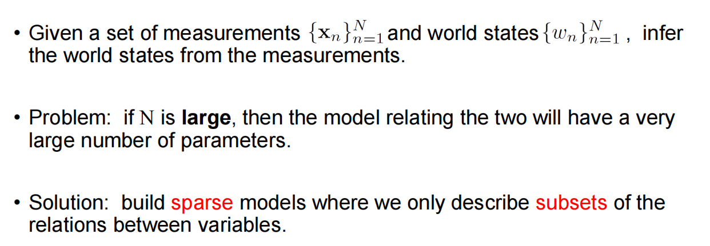
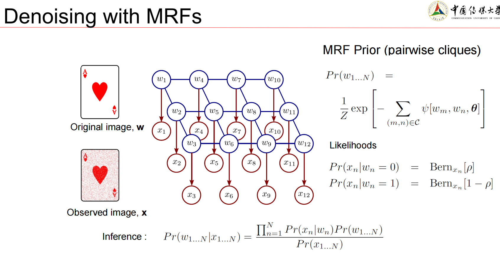
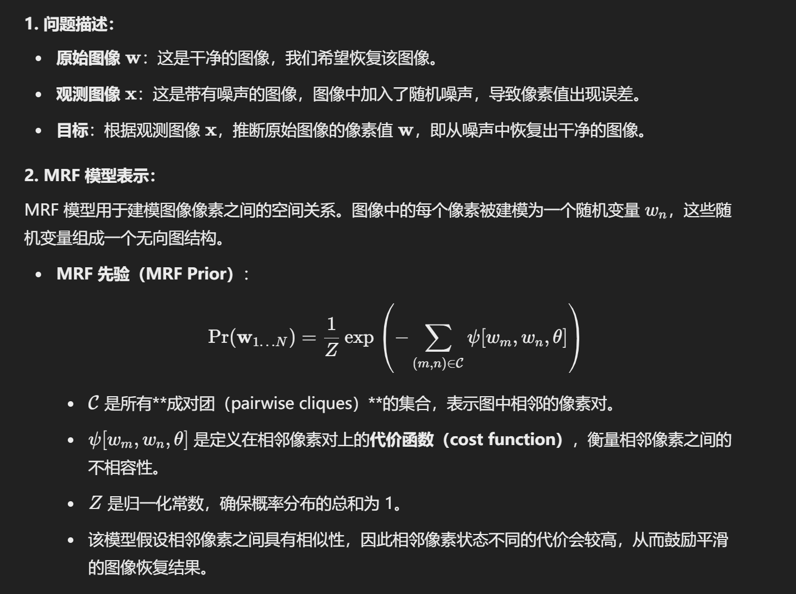
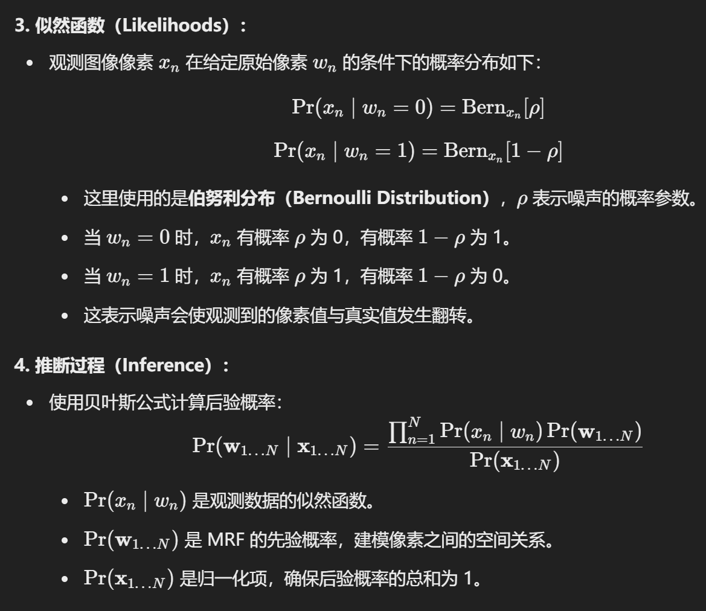
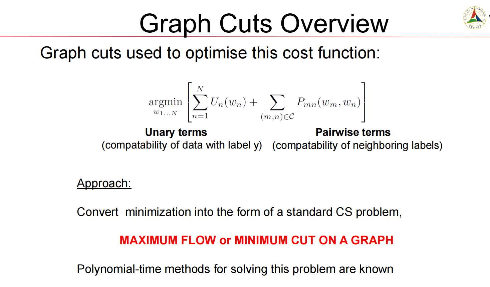
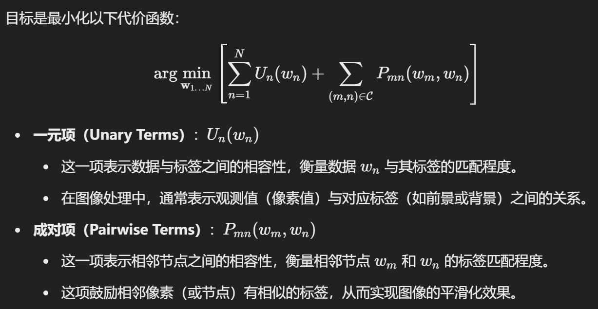

## Lecture 12

::: tips

Motivation。

:::

## Lecture 13

::: tabs

@tab

@tab

:::

::: tips

使用图割方法将这个最小化问题转换为一个**标准的计算机科学问题**，即：

最大流（Maximum Flow）**或**最小割（Minimum Cut）问题

- **最大流**：在网络流图中找到最大可能的流量，从源节点流向汇节点。
- **最小割**：在图中找到一条割，使割断边的权重总和最小化，这条割可以将图分割成两个部分（如前景和背景）。

:::