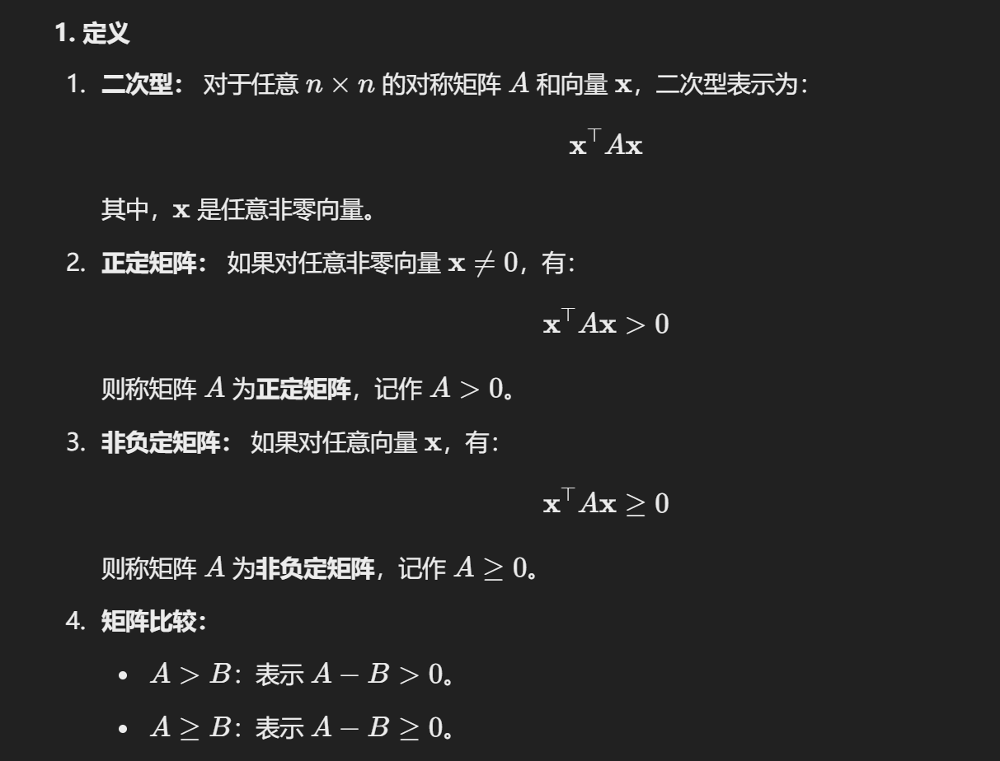

## 1. 定义

### 1.1 $p \times q$ 矩阵

**矩阵** 

- $p \times q$ 矩阵：A 的形状由 p 行和 q 列组成。
- 矩阵 A 的一般表示法：$A = \begin{pmatrix} a_{11} & a_{12} & \cdots & a_{1q} \\ a_{21} & a_{22} & \cdots & a_{2q} \\ \vdots & \vdots & \ddots & \vdots \\ a_{p1} & a_{p2} & \cdots & a_{pq} \end{pmatrix}$

**向量**

- **列向量** a：是一个 $p-$ 维的列向量，表示为： $a = \begin{pmatrix} a_1 \\ a_2 \\ \vdots \\ a_p \end{pmatrix}$
- **行向量** $b′$：是一个 $q-$ 维的行向量，表示为： $b' = (b_1, b_2, \cdots, b_q)$

**向量的长度**

- 向量 a 的长度定义为： $\|a\| = \sqrt{a'a} = \sqrt{a_1^2 + a_2^2 + \cdots + a_p^2}$如果向量是单位向量，则满足： $\|a\| = 1$

### 1.2 其他概念

- **0 矩阵：**  $0=0_{pq}=(0): p×q$

- **$p$ 阶方阵**

### 1.3 不同形态的矩阵

从图片内容来看，包含以下矩阵的基本概念和性质：

------

#### 1. **矩阵分类**：

- **上三角矩阵**
    $A = \begin{pmatrix} a_{11} & a_{12} & \cdots & a_{1p} \\ 0 & a_{22} & \cdots & a_{2p} \\ \vdots & \vdots & \ddots & \vdots \\ 0 & 0 & \cdots & a_{pp} \end{pmatrix}$
     特点：主对角线以下的元素全为零。

- **下三角矩阵**
    $A = \begin{pmatrix} a_{11} & 0 & \cdots & 0 \\ a_{21} & a_{22} & \cdots & 0 \\ \vdots & \vdots & \ddots & \vdots \\ a_{p1} & a_{p2} & \cdots & a_{pp} \end{pmatrix}$
     特点：主对角线上方的元素全为零。

- **对角矩阵**
     $A = \begin{pmatrix} a_{11} & 0 & \cdots & 0 \\ 0 & a_{22} & \cdots & 0 \\ \vdots & \vdots & \ddots & \vdots \\ 0 & 0 & \cdots & a_{pp} \end{pmatrix}$
     可表示为：

    $\text{diag}(a_{11}, a_{22}, \ldots, a_{pp})$

- **单位矩阵**
     $I_p = \begin{pmatrix} 1 & 0 & \cdots & 0 \\ 0 & 1 & \cdots & 0 \\ \vdots & \vdots & \ddots & \vdots \\ 0 & 0 & \cdots & 1 \end{pmatrix}$
     特点：主对角线全为 1，其他位置为 0。

------

#### 2. **矩阵的转置**：

- 矩阵 A 的转置定义为 $A' = A^T$：
     转置操作将矩阵的行变为列，列变为行：
     $A^T = \begin{pmatrix} a_{11} & a_{21} & \cdots & a_{p1} \\ a_{12} & a_{22} & \cdots & a_{p2} \\ \vdots & \vdots & \ddots & \vdots \\ a_{1q} & a_{2q} & \cdots & a_{pq} \end{pmatrix}$

------

#### 3. **对称矩阵**：

- 矩阵 A 是对称矩阵当且仅当 $A = A^T$。
     这意味着矩阵中满足 $a_{ij} = a_{ji}$。
     举例：$\begin{pmatrix} 1 & 3 \\ 3 & 4 \end{pmatrix}, \begin{pmatrix} 9 & 0 & 0 \\ 0 & 7 & 0 \\ 0 & 0 & 1 \end{pmatrix}, \begin{pmatrix} 2 & 3 & 5 \\ 3 & 0 & 1 \\ 5 & 1 & 1 \end{pmatrix}$

------

## 2. 矩阵的运算

### 2.1 基本运算

### 2.2 运算规律

**转置的性质**：

- $(A + B)' = A' + B'$
- $(AB)' = B'A'$

**分配律**：

- $A(B_1 + B_2) = AB_1 + AB_2$

**加法的扩展性**：

- $A \left( \sum_{i=1}^{k} B_i \right) = \sum_{i=1}^{k} AB_i$

**数乘分配律**：

- $c(A + B) = cA + cB$

### 2.3 正交

**投影矩阵和幂等矩阵**：

- 如果矩阵 A 满足 $A^2 = A$，称 A 为幂等矩阵。
- 对称的幂等矩阵被称为投影矩阵。

**正交矩阵的几何意义**：

- 在二维情况下 ($p = 2$)，正交矩阵对应的是坐标轴的旋转变换，例如：

    

    $y = Ax = \begin{bmatrix} \cos\theta & \sin\theta \\ -\sin\theta & \cos\theta \end{bmatrix} \begin{bmatrix} x_1 \\ x_2 \end{bmatrix}$

    这表示一个关于原点的旋转。

- 在三维情况下 ($p = 3$)，正交矩阵也表示旋转变换。若 $|A| = 1$，对应刚性旋转；若 $|A| = -1$，包含一个镜像反射的轴。

**正交矩阵保持长度不变**：

- 在正交变换下，点到原点的距离保持不变。这是由公式 $y'y = (Ax)'(Ax) = x'A'Ax = x'x$ 推导出的。

### 2.3 矩阵的分块

## 3. 行列式

### 3.1 基本性质

### 3.2 代数余子式

::: details 例子

:::

## 4. 矩阵的逆

### 4.1 基本定义

#### **1. 矩阵的逆定义：**

- 若矩阵 A 为一个 $n \times n$ 的方阵（必须是方阵），且存在矩阵 C 满足：$AC = CA = I$ 则称 C 为 A 的**逆矩阵**，记为 $A^{-1}$。

#### **2. 非退化与退化矩阵：**

- **非退化（非奇异）矩阵**：行列式 $|A| \neq 0$，此时矩阵 A 有唯一的逆矩阵。
- **退化（奇异）矩阵**：行列式 $|A| = 0$，此时矩阵 A 不可逆。

#### **3. $2 \times 2$ 方阵的逆矩阵计算公式：**

设：

$A = \begin{bmatrix} a_{11} & a_{12} \\ a_{21} & a_{22} \end{bmatrix}$

则：

$A^{-1} = \frac{1}{|A|} \begin{bmatrix} a_{22} & -a_{12} \\ -a_{21} & a_{11} \end{bmatrix}$

- $A| = a_{11}a_{22} - a_{12}a_{21}$ 是 A 的行列式。
- **条件**：$|A| \neq 0$。

### 4.2 基本性质

## 5. 矩阵的秩

## 6. 特征值，特征向量和矩阵的迹

### 6.1 特征值，特征向量

### 6.2 基本性质 1, 2

#### 例题

### 6.3 基本特征 3,4,5

### 6.4 矩阵的迹

#### **公式表示**

设矩阵 A 为一个 $n \times n$ 的方阵：

$A = \begin{bmatrix} a_{11} & a_{12} & \cdots & a_{1n} \\ a_{21} & a_{22} & \cdots & a_{2n} \\ \vdots & \vdots & \ddots & \vdots \\ a_{n1} & a_{n2} & \cdots & a_{nn} \end{bmatrix}$

则矩阵的迹（记作 $\text{tr}(A)$）定义为：

$\text{tr}(A) = \sum_{i=1}^n a_{ii} = a_{11} + a_{22} + \cdots + a_{nn}$

即矩阵主对角线上的所有元素的总和。

#### 基本性质

## 正定

